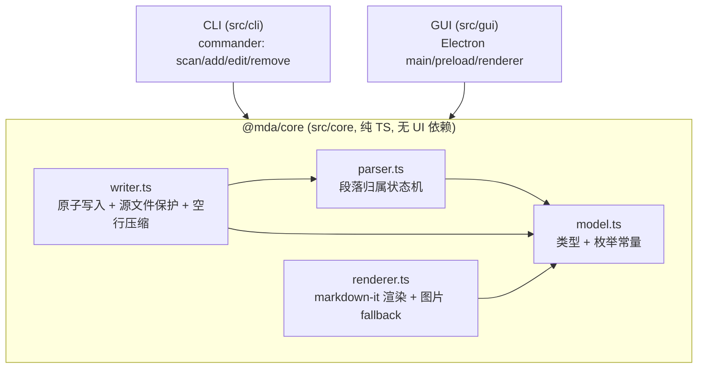

# AGENTS.md — MDA（Markdown 批注管理工具）AI 协作指南

> 本文件是面向 AI 协作者的项目级资产。任何在本仓库工作的 AI/人，**动手前必须读完本文件**，
> 并严格遵守「禁止事项」与「隐性规范」。本文件与代码同步维护，发现不一致以代码为准并回头更新本文件。

---

## 1. 项目背景

MDA 是 L2 命题任务「Markdown 批注管理工具」的实现。目标：在不破坏 Markdown 原文渲染效果的前提下，
为 `.md` 文件嵌入、查询、管理结构化批注（评审意见）。批注以 **Markdown 标准注释语法**承载，
渲染后完全不可见，因此可与正文共存于同一文件、随文件一起进入 git 版本控制。

工具同时提供两种一致的使用方式：

- **CLI**（`mda-cli`）：扫描 / 增 / 删 / 改批注，可脚本化、可输出 JSON。
- **GUI**（`mda`，Electron）：Markdown 预览 + 批注面板，可视化增删改查与双向定位。

两者共享同一个核心库 `@mda/core`（`src/core/`），保证 CLI 与 GUI 行为完全一致。

---

## 2. 项目概述

| 维度 | 说明 |
|------|------|
| 形态 | 单仓库，TypeScript 核心 + commander CLI + Electron GUI |
| 入口 | `mda`（GUI）、`mda-cli`（CLI），见 `package.json` 的 `bin` |
| 核心库 | `@mda/core` = model + parser + writer + renderer，CLI/GUI 均复用 |
| 批注载体 | `[comment]: <> (@anno {JSON})` 独立成行，置于被批注段落上方 |
| 关键保证 | 源文件保护（不改正文行）、原子写入、批注渲染不可见、换行风格保留 |
| 平台 | 跨平台（Windows/macOS/Linux）；GUI 依赖 Electron |

---

## 3. 业务术语表

| 术语 | 定义 |
|------|------|
| 批注 / Annotation | 一条评审意见，结构化为 JSON，字段见「接口约定」。 |
| `@anno` 前缀 | 批注行的识别标记，位于 `[comment]: <> (...)` 注释体内，用于区分普通注释。 |
| 批注行 | 形如 `[comment]: <> (@anno {...})` 的整行，匹配 `ANNO_REGEX`；这是**唯一**允许被增删改的行。 |
| 段落 / Paragraph | 连续非空行组成的文本块；空行分隔段落。是批注的归属对象。 |
| 段落归属 | 批注归属于其**下方第一个正文段落**；批注与段落之间的空行不打断归属；文件末尾无后续正文的批注为「孤儿批注」（在 `annotations` 中但不属于任何段落）。 |
| level（级别） | `critical` / `major` / `minor` / `info`，对应色条 红 / 橙 / 黄 / 灰。 |
| status（状态） | `open` / `resolved` / `wontfix`。 |
| 源文件保护 | 写操作只能增删改批注行，正文行逐字节不变（`verifySourceProtection`）。 |
| 原子写入 | 先写临时文件再 `fs.rename` 覆盖，避免写入中断损坏原文件。 |
| 空行压缩 | 删除批注行后，若上下都是空行则合并为一个，避免遗留多余空行。 |
| 不可见性 | 批注是标准 Markdown 注释，渲染后 HTML 中不得出现 `@anno` 或任何批注字段值。 |
| data-line | GUI preload 在渲染 HTML 的块级元素上注入的源码行号属性，用于「段落↔批注」双向定位。其值等于该段落的 `startLine`。 |

---

## 4. 架构设计

分层、单向依赖：`gui` / `cli` → `core`。`core` 不依赖 `cli`/`gui`，不引入任何 UI/IO 框架。



模块职责边界：

| 模块 | 文件 | 职责 | 禁止 |
|------|------|------|------|
| model | `src/core/model.ts` | 类型定义 + 枚举常量 + 枚举守卫 | 不含逻辑/IO |
| parser | `src/core/parser.ts` | 解析批注、构建段落、计算归属（只读，不碰文件） | 不写文件、不校验行号 |
| writer | `src/core/writer.ts` | `addAnnotation/editAnnotation/removeAnnotation`，含原子写入、源文件保护、空行压缩、换行保留 | 不负责渲染/CLI 输出 |
| renderer | `src/core/renderer.ts` | `createMarkdownIt()` + `renderMarkdown()`，保持纯净 | **不得注入 data-line**（破坏渲染等价性与测试） |
| CLI | `src/cli/**` | 参数解析、输入校验、stdout/stderr 输出 | 不重写 core 逻辑 |
| GUI main | `src/gui/main.js` | 窗口、菜单、`read-file` 等 IPC | 不直接做批注写入逻辑 |
| GUI preload | `src/gui/preload.js` | `require('../core')`，经 contextBridge 暴露 core 能力；叠加 GUI 专用 data-line 注入 | 不暴露 `fs`/`require` 给渲染层 |
| GUI renderer | `src/gui/renderer/app.js` | 纯 UI；通过 `window.mdaAPI` 调用 core | **不得自行实现 parser/writer/UUID/拼接批注行** |

数据流（写操作，CLI 与 GUI 一致）：
`读文件 → parseAnnotations → 定位段落/批注 → 改批注行 → verifySourceProtection → atomicWrite(保留 EOL)`。

---

## 5. 接口约定

### 5.1 核心数据类型（`src/core/model.ts`）

```ts
type AnnotationLevel = 'critical' | 'major' | 'minor' | 'info';
type AnnotationStatus = 'open' | 'resolved' | 'wontfix';

interface Annotation {
  id: string;            // UUID
  content: string;
  tags: string[];
  level: AnnotationLevel;
  status: AnnotationStatus;
  created_at: string;    // ISO 8601
  line?: number;         // 1-based，解析时回填（批注行所在行号）
  file?: string;         // 扫描时回填
}
interface AnnotationInput { content: string; tags?: string[]; level?: AnnotationLevel; }
interface AnnotationPatch { content?: string; tags?: string[]; level?: AnnotationLevel; status?: AnnotationStatus; }
interface Paragraph { startLine: number; endLine: number; text: string; annotations: Annotation[]; }
interface ScanResult { annotations: Annotation[]; paragraphs: Paragraph[]; }
```

枚举守卫（新增/编辑入口必须用于校验）：`isAnnotationLevel`、`isAnnotationStatus`、`ANNOTATION_LEVELS`、`ANNOTATION_STATUSES`。

### 5.2 core 公共 API（`src/core/index.ts` barrel 导出）

```ts
parseAnnotations(text: string): ScanResult            // 纯函数，不读写文件
findParagraphByLine(paragraphs, line): Paragraph | null
addAnnotation(filePath, paragraphLine, input): Promise<Annotation>
editAnnotation(filePath, id, patch): Promise<Annotation>
removeAnnotation(filePath, id): Promise<void>
createMarkdownIt(): MarkdownIt
renderMarkdown(md: MarkdownIt, text: string): string
```

### 5.3 批注行语法（唯一合法形态）

```
[comment]: <> (@anno {"id":...,"content":...,"tags":[...],"level":...,"status":...,"created_at":...})
```
识别正则（保持一致，勿擅改）：`/^\[comment\]:\s*<>\s*\(@anno\s+(\{.+?\})\)\s*$/`

### 5.4 CLI 契约（`src/cli`）

- `mda-cli scan <file|dir> [-r] [--format table|json] [--status <s>] [--level <l>]`
- `mda-cli add <file> <line> <content> [--tags a,b] [--level <l>]`
- `mda-cli edit <file> <id> [--content <c>] [--tags a,b] [--level <l>] [--status <s>]`
- `mda-cli remove <file> <id>`

输出规范（**强约束**）：
- `--format json`：stdout **仅**输出 JSON 数组（无批注则 `[]`），每个对象含 `id/file/line/content/tags/level/status/created_at`。
- 表格模式：stdout 输出表格；**所有**提示/警告/错误一律走 stderr。
- 出错时 `process.stderr.write(...)` + `process.exit(1)`。

### 5.5 GUI 桥接契约（`src/gui/preload.js` → `window.mdaAPI`）

```
readFile(filePath) -> {success, content, filePath} | {success:false,error}
openExternal(url) / setTitle(title)
onFileOpened(cb) / onReload(cb)
parseAnnotations(text) -> ScanResult
renderMarkdown(text) -> {success, html} | {success:false,error}
addAnnotation(filePath, line, input) -> {success, value:Annotation} | {success:false,error}
editAnnotation(filePath, id, patch) -> {success, value} | {success:false,error}
removeAnnotation(filePath, id) -> {success} | {success:false,error}
```
渲染层只能通过该桥与外界交互；新增能力一律在 preload 暴露，禁止把 `fs`/`require` 直接交给渲染层。

---

## 6. 编码规范

- **语言/严格度**：TypeScript `strict: true`；core 与 cli 用 TS，GUI 渲染/preload 为运行期 JS（受 Electron 限制）。
- **分层依赖**：`core` 不得 `import` `cli`/`gui`；GUI/CLI 不得复制 core 逻辑，一律复用。
- **CLI 输出**：stdout 仅承载「结果数据」，其余全部 stderr；JSON 模式保持纯净。
- **写文件**：必须走 `writer` 的原子写入路径；写前 `detectEol` 保留换行，写后 `verifySourceProtection` 校验。
- **输入校验**：`level`/`status` 必须经枚举守卫校验后再落盘。
- **错误处理**：core 抛 `Error`（带可读中文消息）；CLI 捕获后转 stderr + 退出码；GUI 转 `{success:false,error}` 并用 `uiAlert` 呈现。
- **注释**：只解释「为什么」（约束/权衡/陷阱），不写复述代码的废话注释。
- **命名**：函数/变量小驼峰，类型大驼峰，常量大写下划线（如 `ANNOTATION_LEVELS`）。
- **测试**：核心逻辑改动需同步 `tests/`；边界用例延续 E1–E25 编号体系。
- **提交**：`<type>(<scope>): <desc>`，type ∈ feat/fix/refactor/test/docs/chore；按 scope 小粒度提交，勿堆积。

---

## 7. 项目依赖

| 类别 | 依赖 | 版本 |
|------|------|------|
| 运行时 | Node.js / npm | ≥ 18 / ≥ 9 |
| 语言 | TypeScript | ^5.5 |
| CLI | commander | ^12.1 |
| 渲染 | markdown-it（CommonMark 0.31 + GFM 表格） | ^14.1 |
| 代码高亮 | highlight.js（**仅 GUI**，在 preload 经 `md.set({highlight})` 注入） | ^11.9 |
| GUI | Electron | ^31.1 |
| 校验 | zod（依赖已声明，当前以枚举守卫为主） | ^3.23 |
| 测试 | jest + ts-jest（内置 coverage） | ^29.7 |

常用命令：

```bash
npm install            # 安装
npm run build          # tsc 编译 core/cli → dist + 拷贝 GUI 资源
npm run cli -- <args>  # 运行 CLI
npm run gui -- <file>  # 启动 GUI
npm test               # jest（含覆盖率）
```

构建顺序固定：先 `build:ts`（产出 `dist/core`）再 `build:gui`（拷贝 GUI）。GUI preload 依赖 `dist/core`，故 **GUI 跑前必须先 build**。

---

## 8. 禁止事项（违反即视为 bug / 不通过）

1. **不得修改正文行**：写操作只能增删改批注行（`@anno`）；正文必须逐字节不变，操作前后渲染效果完全一致。任何绕过 `verifySourceProtection` 的写入都禁止。
2. **不得改批注语法**：必须沿用 `[comment]: <> (@anno {JSON})` 与 `@anno` 前缀及现有正则。
3. **不得改主程序命名**：GUI=`mda`，CLI=`mda-cli`（`package.json` bin），不得重命名。
4. **CLI 不得污染 stdout**：`scan --format json` 之外不得向 stdout 写非数据文本；警告/日志只走 stderr。
5. **GUI 不得重写 core 逻辑**：渲染层禁止自实现 parser/writer/UUID 或手工拼接批注行；写操作一律经 `window.mdaAPI` → core writer。
6. **renderer 保持纯净**：禁止在 `src/core/renderer.ts` 注入 `data-line` 等 GUI 专属内容（会破坏渲染等价性与 `renderer.test.ts`）；此类逻辑只放 GUI preload。
7. **GUI 禁用原生 `alert`/`confirm`/`prompt`**：Electron 原生模态会导致渲染进程输入框失焦（最小化恢复才好）；统一用 DOM 版 `uiAlert`/`uiConfirm`。
8. **不得削弱安全配置**：保持 `contextIsolation: true`、`nodeIntegration: false`；`sandbox: false` 仅为让 preload `require('../core')`，不得进一步放开（如开启 nodeIntegration）。
9. **不得写入非法枚举**：`level`/`status` 越过枚举校验会让批注无法被解析而静默丢失。
10. **派生物入库策略**：`node_modules/`、`coverage/` 不入库；`dist/` 作为可执行交付物**随版本入库**（功能稳定后已纳入 `.gitignore` 放行）。
11. **GUI 链接/拖拽不得触发默认导航**：预览区 `<a>` 点击与文件拖拽必须 `preventDefault`，否则渲染进程会跳离 `index.html` 导致白屏且无法恢复；主进程另有 `will-navigate`/`setWindowOpenHandler` 兜底。

---

## 9. 隐性规范（项目实战中沉淀，务必遵守）

> 覆盖类别：CLI 输出 / 写入安全 / 渲染 / GUI·Electron / 数据校验 / 解析语义。

1. **【解析语义】批注归属**：批注属于其下方第一个正文段落；中间的空行不打断归属；末尾无正文的批注是孤儿（仅入 `annotations`）。无空行时连续非空行视为同一段落。
2. **【写入安全】换行保留**：写回前 `detectEol(rawText)`，只要原文出现过 `\r\n` 就按 CRLF 回写，否则 LF；禁止把 CRLF 文件静默转 LF。
3. **【写入安全】原子写入**：临时文件（`.<name>.<uuid>.tmp`）+ `fs.rename`；失败需清理临时文件。绝不直接覆盖原文件。
4. **【渲染】不可见性是硬指标**：渲染输出的 HTML 中不得出现 `@anno` 或任何批注字段值；`renderer.test.ts` 用「去批注后渲染等价」断言守护，改渲染时勿破坏。
4b. **【渲染】渲染前预处理**：`renderMarkdown` 先 `preprocessForRender` —— ① 去掉起始 BOM（否则首行 `# 标题` 被 BOM 抢占行首而当成普通段落）；② 用 `buildCodeFenceMask` 把**围栏外**的批注行清空为空行（保留行数 → `data-line` 不变）。不能依赖 markdown-it 的链接引用定义来隐藏批注：内容含括号（如 `n(n-1)/2`）会破坏该语法导致批注泄漏。
4c. **【解析/渲染】围栏感知**：`buildCodeFenceMask` 为 parser 与 renderer 共用；```` ``` ````/`~~~` 围栏内的 `@anno` 样例是字面文本，**不识别为批注、也不清空**，三处行为必须一致。
5. **【GUI·Electron】data-line 映射**：preload 仅对 `level===0` 的块级 token 注入 `data-line = map[0]+1`，其值等于段落 `startLine`，GUI 据此做「段落↔批注」双向定位与色条。
6. **【GUI·Electron】运行前提**：preload `require('../core')` 需 `sandbox:false`；GUI 运行前必须 `npm run build`（否则 `dist/core` 不存在）。
7. **【数据校验】枚举守卫**：add/edit/scan 入口用 `isAnnotationLevel/isAnnotationStatus` 校验，非法值报错退出而非落盘。
8. **【CLI 输出】表格按显示宽度对齐**：中文为全角（2 列），用 `displayWidth/truncateToWidth/padToWidth` 对齐，勿用 `String.padEnd`（按码元数会错位）。
9. **【CLI 输出】scan 目录模式**：每条批注的 `file` 必须是真实文件路径（在 `scanFile` 内回填），不可回退成目录名。

---

## 10. 关键文件索引

| 关注点 | 文件 |
|--------|------|
| 类型/枚举 | `src/core/model.ts` |
| 可配置规则（枚举/正则/色条） | `src/config/annotation-schema.json` |
| 解析/归属算法 | `src/core/parser.ts` |
| 写入/保护/原子性 | `src/core/writer.ts` |
| 渲染/不可见性 | `src/core/renderer.ts` |
| CLI 命令 | `src/cli/commands/*.ts` |
| GUI 主进程/桥接/界面 | `src/gui/main.js` / `preload.js` / `renderer/app.js` |
| 设计文档 | `docs/P0..P3-*.md` |
| AI 协作记录 | `docs/prompts/*.md` |
| Few-shot 正反例 | `docs/few-shot-examples.md` |
| 测试 | `tests/core/*.test.ts`、`tests/cli/*.test.ts` |
