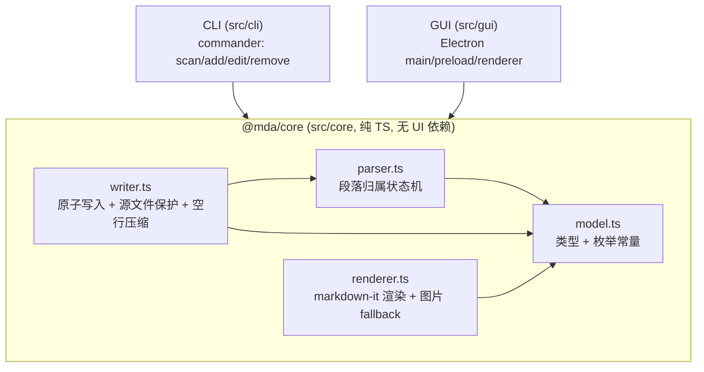

# AGENTS.md — MDA（Markdown 工作台）AI 协作指南

> 本文件是面向 AI 协作者的项目级资产。任何在本仓库工作的 AI/人，**动手前必须读完本文件**，
> 并严格遵守「禁止事项」与「隐性规范」。本文件与代码同步维护，发现不一致以代码为准并回头更新本文件。

---

## 1. 项目背景

### 1.1 行业与产品背景

生成式 AI 普及后，Markdown（`.md`）已从技术文档标记语言，扩展为 AI 与人协作的「通用中介语言」：方案草稿、会议纪要、技术说明、知识库条目、Agent 配置与评审意见等，越来越多以 Markdown 生成、修订与传递。相对富文本或二进制文档，它语法轻量、便于 git 版本管理与跨工具协作，在研发与日常办公中的使用频率持续上升。

用户反馈亦集中在：**打开/预览体验**、**语法渲染**、**导入导出与格式互操作**、**与 AI 工作流结合**等基础能力。市场存在明显断层——办公套件多将 `.md` 导入为私有格式，难以原生编辑源文件；专业编辑器（Typora、Obsidian、IDE 等）面向重度用户，在办公交付与 Agent 协作链路上仍偏重。大量用户从 AI / 协作平台拿到 `.md` 后，只需「能看懂、能改几句、能批注、能导出」，却不得不在多种工具间切换。

### 1.2 MDA 定位

MDA（Markdown 工作台）面向「被 Markdown 文件触达」的研发与办公用户，补齐本地优先的 **打开 → 预览 → 轻量编辑 → 批注协作 → 导出 / Agent 调用** 链路：比办公套件更原生地处理 `.md`，比专业编辑器更贴合「读改批注 + AI 脚本化」的轻便场景。

产品源自 L2 命题「Markdown 批注管理工具」，能力已扩展为工作台，**差异化核心**仍是：在不破坏原文渲染的前提下，用 Markdown 标准注释嵌入结构化批注（`[comment]: <> (@anno {JSON})`），渲染不可见、可随文件进 git；并提供一致的 **CLI**（`mda-cli`）/ **GUI**（`mda`）/ **MCP**（`mda-mcp`），共享 `@mda/core`。

| 能力轴 | MDA 现状侧重 |
|--------|----------------|
| 打开与预览 | 工作区文件树、欢迎页、最近打开、CommonMark + GFM / Mermaid / KaTeX |
| 轻量编辑 | 源码高亮、查找替换、大纲、分屏预览 |
| 批注协作 | 段落/选区批注、色条互定位、源文件保护写入 |
| 导出与 AI | HTML/PDF、微信公众号复制、MCP 工具供 Agent 扫描与改批注 |

---

## 2. 项目概述

| 维度 | 说明 |
|------|------|
| 形态 | 单仓库，TypeScript 核心 + commander CLI + Electron GUI |
| 入口 | `mda`（GUI）、`mda-cli`（CLI），见 `package.json` 的 `bin` |
| 核心库 | `@mda/core` = model + parser + writer + renderer，CLI/GUI 均复用 |
| 批注载体 | `[comment]: <> (@anno {JSON})` 独立成行，置于被批注段落上方 |
| 关键保证 | 源文件保护（不改正文行）、原子写入、批注渲染不可见、换行风格保留 |
| 平台 | 跨平台（Windows/macOS/Linux）；GUI 依赖 Electron |

---

## 3. 业务术语表

| 术语 | 定义 |
|------|------|
| 批注 / Annotation | 一条评审意见，结构化为 JSON，字段见「接口约定」。 |
| `@anno` 前缀 | 批注行的识别标记，位于 `[comment]: <> (...)` 注释体内，用于区分普通注释。 |
| 批注行 | 形如 `[comment]: <> (@anno {...})` 的整行，匹配 `ANNO_REGEX`；这是**唯一**允许被增删改的行。 |
| 段落 / Paragraph | 连续非空行组成的文本块；空行分隔段落。是批注的归属对象。 |
| 段落归属 | 批注归属于其**下方第一个正文段落**；批注与段落之间的空行不打断归属；文件末尾无后续正文的批注为「孤儿批注」（在 `annotations` 中但不属于任何段落）。 |
| level（级别） | `critical` / `major` / `minor` / `info`，对应色条 红 / 橙 / 黄 / 灰。 |
| status（状态） | `open` / `resolved` / `wontfix`。 |
| 源文件保护 | 写操作只能增删改批注行，正文行逐字节不变（`verifySourceProtection`）。 |
| 原子写入 | 先写临时文件再 `fs.rename` 覆盖，避免写入中断损坏原文件。 |
| 空行压缩 | 删除批注行后，若上下都是空行则合并为一个，避免遗留多余空行。 |
| 不可见性 | 批注是标准 Markdown 注释，渲染后 HTML 中不得出现 `@anno` 或任何批注字段值。 |
| data-line | GUI preload 在渲染 HTML 的块级元素上注入的源码行号属性，用于「段落↔批注」双向定位。其值等于该段落的 `startLine`。 |

---

## 4. 架构设计

分层、单向依赖：`gui` / `cli` → `core`。`core` 不依赖 `cli`/`gui`，不引入任何 UI/IO 框架。


```mermaid
flowchart TD
  subgraph core["@mda/core (src/core, 纯 TS, 无 UI 依赖)"]
    model[model.ts<br/>类型 + 枚举常量]
    parser[parser.ts<br/>段落归属状态机]
    writer[writer.ts<br/>原子写入 + 源文件保护 + 空行压缩]
    renderer[renderer.ts<br/>markdown-it 渲染 + 图片 fallback]
  end
  cli["CLI (src/cli)<br/>commander: scan/add/edit/remove"] --> core
  gui["GUI (src/gui)<br/>Electron main/preload/renderer"] --> core
  parser --> model
  writer --> parser
  writer --> model
  renderer --> model
```

模块职责边界：

| 模块 | 文件 | 职责 | 禁止 |
|------|------|------|------|
| model | `src/core/model.ts` | 类型定义 + 枚举常量 + 枚举守卫 | 不含逻辑/IO |
| parser | `src/core/parser.ts` | 解析批注、构建段落、计算归属（只读，不碰文件） | 不写文件、不校验行号 |
| writer | `src/core/writer.ts` | `addAnnotation/editAnnotation/removeAnnotation/clearAllAnnotations`，含原子写入、源文件保护、空行压缩、换行保留 | 不负责渲染/CLI 输出 |
| renderer | `src/core/renderer.ts` | `createMarkdownIt()` + `renderMarkdown()`，保持纯净 | **不得注入 data-line**（破坏渲染等价性与测试） |
| CLI | `src/cli/**` | 参数解析、输入校验、stdout/stderr 输出 | 不重写 core 逻辑 |
| GUI main | `src/gui/main.js` | 窗口、菜单、`read-file` 等 IPC | 不直接做批注写入逻辑 |
| GUI preload | `src/gui/preload.js` | `require('../core')`，经 contextBridge 暴露 core 能力；叠加 GUI 专用 data-line 注入 | 不暴露 `fs`/`require` 给渲染层 |
| GUI renderer | `src/gui/renderer/app.js` | 纯 UI；通过 `window.mdaAPI` 调用 core | **不得自行实现 parser/writer/UUID/拼接批注行** |

数据流（写操作，CLI 与 GUI 一致）：
`读文件 → parseAnnotations → 定位段落/批注 → 改批注行 → verifySourceProtection → atomicWrite(保留 EOL)`。

---

## 5. 接口约定

### 5.1 核心数据类型（`src/core/model.ts`）

```ts
type AnnotationLevel = 'critical' | 'major' | 'minor' | 'info';
type AnnotationStatus = 'open' | 'resolved' | 'wontfix';

interface Annotation {
  id: string;            // UUID
  content: string;
  tags: string[];
  level: AnnotationLevel;
  status: AnnotationStatus;
  created_at: string;    // ISO 8601
  line?: number;         // 1-based，解析时回填（批注行所在行号）
  file?: string;         // 扫描时回填
  anchor?: AnnotationAnchor;  // 选区级批注（UTF-16 start/end + quote）
}
interface AnnotationAnchor { start: number; end: number; quote?: string; }
interface AnnotationInput { content: string; tags?: string[]; level?: AnnotationLevel; anchor?: AnnotationAnchor; }
interface AnnotationPatch { content?: string; tags?: string[]; level?: AnnotationLevel; status?: AnnotationStatus; }
interface Paragraph { startLine: number; endLine: number; text: string; annotations: Annotation[]; }
interface ScanResult { annotations: Annotation[]; paragraphs: Paragraph[]; }
```

枚举守卫（新增/编辑入口必须用于校验）：`isAnnotationLevel`、`isAnnotationStatus`、`ANNOTATION_LEVELS`、`ANNOTATION_STATUSES`。

### 5.2 core 公共 API（`src/core/index.ts` barrel 导出）

```ts
parseAnnotations(text: string): ScanResult            // 纯函数，不读写文件
findParagraphByLine(paragraphs, line): Paragraph | null
addAnnotation(filePath, paragraphLine, input): Promise<Annotation>
editAnnotation(filePath, id, patch): Promise<Annotation>
removeAnnotation(filePath, id): Promise<void>
clearAllAnnotations(filePath): Promise<number>  // 清空围栏外全部批注，返回删除条数
createMarkdownIt(): MarkdownIt
renderMarkdown(md: MarkdownIt, text: string): string
writeRawFile(filePath, content): Promise<void>   // 整篇写回（GUI 源码编辑保存）
buildCodeFenceMask(lines: string[]): boolean[]    // 围栏遮罩，parser/renderer/GUI 共用
validateAnchor(text, anchor): boolean             // 锚点是否仍有效（quote 匹配）
shiftAnchorForInsert(anchor, insertLineIndex, insertedLineCount, text): AnnotationAnchor | null
extractHeadings(text): HeadingNode[]              // 大纲标题树（outline.ts）
```

### 5.3 批注行语法（唯一合法形态）

```
[comment]: <> (@anno {"id":...,"content":...,"tags":[...],"level":...,"status":...,"created_at":...})
```
识别正则（保持一致，勿擅改）：`/^\[comment\]:\s*<>\s*\(@anno\s+(\{.+?\})\)\s*$/`

### 5.4 CLI 契约（`src/cli`）

- `mda-cli scan <file|dir> [-r] [--format table|json] [--status <s>] [--level <l>]`
- `mda-cli add <file> <line> <content> [--tags a,b] [--level <l>] [--anchor <json>]`
- `mda-cli edit <file> <id> [--content <c>] [--tags a,b] [--level <l>] [--status <s>]`
- `mda-cli remove <file> <id>`

**MCP**（`mda-mcp` / `dist/mcp/server.js`）：stdio 六 tools — `mda_scan`、`mda_add`、`mda_edit`、`mda_remove`、`mda_read_file`、`mda_export_review_prompt`；工作区 `MDA_WORKSPACE` 或 `--workspace`。

输出规范（**强约束**）：
- `--format json`：stdout **仅**输出 JSON 数组（无批注则 `[]`），每个对象含 `id/file/line/content/tags/level/status/created_at`。
- 表格模式：stdout 输出表格；**所有**提示/警告/错误一律走 stderr。
- 出错时 `process.stderr.write(...)` + `process.exit(1)`。

### 5.5 GUI 桥接契约（`src/gui/preload.js` → `window.mdaAPI`）

```
readFile(filePath) -> {success, content, filePath} | {success:false,error}
openExternal(url) / setTitle(title) / showItemInFolder(filePath) / copyToClipboard(text)
copyClipboardImage({dataUrl|filePath}) -> {success} | {success:false,error}  // 缩放层复制图片
copyArticleHtml(html, text) -> {success:true} | {success:false,error}  // 富文本剪贴板（微信公众号；勿 writeBuffer 覆盖）
readFileAsDataUrl(filePath) -> {success, dataUrl} | {success:false,error}  // 本地图片转 base64（复制预览内嵌用）
capturePageRect({x,y,width,height}) -> {success, dataUrl} | {success:false,error}
exportDocx(filePath, html) -> {success, filePath} | {success:false,error}  // HTML→docx（html-to-docx）
getAutosavePref() / setAutosavePref(mode) / onMenuAutosave(cb)  // off|blur|interval:30|interval:60
resolvePath(baseFile, href) -> absPath        // 相对当前文件目录解析（相对链接/图片用）
onFileOpened(cb) / onReload(cb) / onMenuShowInFolder(cb)
onMenuToggleTheme(cb) / onMenuToggleEdit(cb) / onMenuTogglePanel(cb) / onMenuSave(cb) / onMenuShowHelp(cb) / onMenuCopyArticle(cb) / onAppCloseRequest(cb)
onMenuExportDocx(cb) / onMenuAutosave(cb)
setDirty(dirty) / confirmClose()
levelColors / levelSeverity / markdownExtensions / isMarkdownPath(filePath)   // 来自 annotation-schema.json（扩展名）与 core
parseAnnotations(text) -> ScanResult
renderMarkdown(text) -> {success, html} | {success:false,error}   // 内部先容错隐藏疑似批注行
addAnnotation(filePath, line, input) -> {success, value:Annotation} | {success:false,error}
editAnnotation(filePath, id, patch) -> {success, value} | {success:false,error}
removeAnnotation(filePath, id) -> {success} | {success:false,error}
clearAllAnnotations(filePath) -> {success, value:number} | {success:false,error}
saveFile(filePath, content) -> {success} | {success:false,error}  // 整篇写回 writeRawFile
findMalformedAnnotations(text) -> number[]     // 疑似批注但格式不正确的行号（保存前提示用）
highlightSource(code) -> html                  // Markdown 源码高亮（hljs），编辑栏高亮层用
renameFile(oldPath, newPath, {workspaceRoot, conflict}) -> {success, filePath} | {success:false,error,conflict,...}
deleteFile(filePath) -> {success} | {success:false,error}
copyFileToDir(src, destDir, workspaceRoot, {conflict}) -> {success, filePath} | {success:false,error,conflict,...}
moveFileToDir(src, destDir, workspaceRoot, {conflict}) -> {success, filePath} | {success:false,error,conflict,noop}
fileExists(filePath, workspaceRoot) -> boolean
```
渲染层只能通过该桥与外界交互；新增能力一律在 preload 暴露，禁止把 `fs`/`require` 直接交给渲染层。

---

## 6. 编码规范

- **语言/严格度**：TypeScript `strict: true`；core 与 cli 用 TS，GUI 渲染/preload 为运行期 JS（受 Electron 限制）。
- **分层依赖**：`core` 不得 `import` `cli`/`gui`；GUI/CLI 不得复制 core 逻辑，一律复用。
- **CLI 输出**：stdout 仅承载「结果数据」，其余全部 stderr；JSON 模式保持纯净。
- **写文件**：必须走 `writer` 的原子写入路径；写前 `detectEol` 保留换行，写后 `verifySourceProtection` 校验。
- **输入校验**：`level`/`status` 必须经枚举守卫校验后再落盘。
- **错误处理**：core 抛 `Error`（带可读中文消息）；CLI 捕获后转 stderr + 退出码；GUI 转 `{success:false,error}` 并用 `uiAlert` 呈现。
- **注释**：只解释「为什么」（约束/权衡/陷阱），不写复述代码的废话注释。
- **命名**：函数/变量小驼峰，类型大驼峰，常量大写下划线（如 `ANNOTATION_LEVELS`）。
- **GUI i18n（强制）**：所有**用户可见**文案（菜单 / 弹窗 / toast / 工具栏 / 帮助 / 占位符）必须走 i18n，禁止在业务代码里硬编码中文或英文句子。
  - 主进程：`src/gui/main/i18n.js` 的 `t(key)` / `setLangPref`
  - 渲染进程：`src/gui/renderer/i18n.js` 的 `MDAI18n.t`（`app.js` 内用 `uiT`）；帮助正文用 `MDAI18n.buildHelpHtml`
  - **新增能力时必须同时补齐 `zh` + `en` 键**；语言切换入口为「视图 → 界面语言」
- **测试**：核心逻辑改动需同步 `tests/`；边界用例延续 E1–E25 编号体系。
- **提交**：`<type>(<scope>): <desc>`，type ∈ feat/fix/refactor/test/docs/chore；按 scope 小粒度提交，勿堆积。

---

## 7. 项目依赖

| 类别 | 依赖 | 版本 |
|------|------|------|
| 运行时 | Node.js / npm | ≥ 18 / ≥ 9 |
| 语言 | TypeScript | ^5.5 |
| CLI | commander | ^12.1 |
| 渲染 | markdown-it（CommonMark 0.31 + GFM 表格） | ^14.1 |
| 代码高亮 | highlight.js（**仅 GUI**，在 preload 经 `md.set({highlight})` 注入） | ^11.9 |
| 流程图 | mermaid（**仅 GUI**，离线 UMD 由 `copy-gui` 拷入 `dist/gui/renderer/mermaid.min.js`，`index.html` 本地引入） | ^11 |
| GUI | Electron | ^31.1 |
| 校验 | zod（依赖已声明，当前以枚举守卫为主） | ^3.23 |
| 测试 | jest + ts-jest（内置 coverage） | ^29.7 |

常用命令：

```bash
npm install            # 安装
npm run build          # tsc 编译 core/cli → dist + 拷贝 GUI 资源
npm run cli -- <args>  # 运行 CLI
npm run gui -- <file>  # 启动 GUI
npm test               # jest（含覆盖率）
```

构建顺序固定：先 `build:ts`（产出 `dist/core`）再 `build:gui`（拷贝 GUI）。GUI preload 依赖 `dist/core`，故 **GUI 跑前必须先 build**。

---

## 8. 禁止事项（违反即视为 bug / 不通过）

1. **不得修改正文行**：写操作只能增删改批注行（`@anno`）；正文必须逐字节不变，操作前后渲染效果完全一致。任何绕过 `verifySourceProtection` 的写入都禁止。
2. **不得改批注语法**：必须沿用 `[comment]: <> (@anno {JSON})` 与 `@anno` 前缀及现有正则。
3. **不得改主程序命名**：GUI=`mda`，CLI=`mda-cli`（`package.json` bin），不得重命名。
4. **CLI 不得污染 stdout**：`scan --format json` 之外不得向 stdout 写非数据文本；警告/日志只走 stderr。
5. **GUI 不得重写 core 逻辑**：渲染层禁止自实现 parser/writer/UUID 或手工拼接批注行；写操作一律经 `window.mdaAPI` → core writer。
6. **renderer 保持纯净**：禁止在 `src/core/renderer.ts` 注入 `data-line` 等 GUI 专属内容（会破坏渲染等价性与 `renderer.test.ts`）；此类逻辑只放 GUI preload。
7. **GUI 禁用原生 `alert`/`confirm`/`prompt`**：Electron 原生模态会导致渲染进程输入框失焦（最小化恢复才好）；统一用 DOM 版 `uiAlert`/`uiConfirm`。
8. **不得削弱安全配置**：保持 `contextIsolation: true`、`nodeIntegration: false`；`sandbox: false` 仅为让 preload `require('../core')`，不得进一步放开（如开启 nodeIntegration）。
9. **不得写入非法枚举**：`level`/`status` 越过枚举校验会让批注无法被解析而静默丢失。
10. **派生物入库策略**：`node_modules/`、`coverage/` 不入库；`dist/` 作为可执行交付物**随版本入库**（功能稳定后已纳入 `.gitignore` 放行）。
11. **GUI 链接/拖拽不得触发默认导航**：预览区 `<a>` 点击与文件拖拽必须 `preventDefault`，否则渲染进程会跳离 `index.html` 导致白屏且无法恢复；主进程另有 `will-navigate`/`setWindowOpenHandler` 兜底。
12. **GUI 用户可见文案不得硬编码单语**：必须经 `t` / `uiT` / `MDAI18n`，且 zh+en 同时落地（见 §6 GUI i18n）。
13. **CM6/编辑面功能改动不得连带破坏光标与文字选取**：做块 widget、装饰层、手柄、样式等任意功能时，**禁止**影响正文/引用/标题的点击落点（`posAtCoords`/`coordsAtPos`）与鼠标拖选；**除非用户明确要求**调整光标或选取相关交互。
14. **不得擅自删除已有功能入口**：工具栏按钮、菜单项、块手柄、快捷键等用户可见入口，删除或隐藏前**须用户明确同意**；重构时须保持等价入口或先确认替代方案。

---

## 9. 隐性规范（项目实战中沉淀，务必遵守）

> 覆盖类别：CLI 输出 / 写入安全 / 渲染 / GUI·Electron / 数据校验 / 解析语义 / Agent·MCP 批注写入。

1. **【解析语义】批注归属**：批注属于其下方第一个正文段落；中间的空行不打断归属；末尾无正文的批注是孤儿（仅入 `annotations`）。无空行时连续非空行视为同一段落。
2. **【写入安全】换行保留**：写回前 `detectEol(rawText)`，只要原文出现过 `\r\n` 就按 CRLF 回写，否则 LF；禁止把 CRLF 文件静默转 LF。
3. **【写入安全】原子写入**：临时文件（`.<name>.<uuid>.tmp`）+ `fs.rename`；失败需清理临时文件。绝不直接覆盖原文件。
4. **【渲染】不可见性是硬指标**：渲染输出的 HTML 中不得出现 `@anno` 或任何批注字段值；`renderer.test.ts` 用「去批注后渲染等价」断言守护，改渲染时勿破坏。
4b. **【渲染】渲染前预处理**：`renderMarkdown` 先 `preprocessForRender` —— ① 去掉起始 BOM（否则首行 `# 标题` 被 BOM 抢占行首而当成普通段落）；② 用 `buildCodeFenceMask` 把**围栏外**的批注行清空为空行（保留行数 → `data-line` 不变）；③ 对 `4b.` / `4e、` / `4f)` 等伪子条目在上一行末补硬换行，避免与父列表项并成一段；④ 非空段落后紧跟 `---`/`___` 改写为 `***`，避免 CommonMark Setext 下划线把分割线显示成源码（图片后的 `===` 同样改写；须在 front matter 清空之后）；⑤ 围栏外 `<!-- -->` 清空为同等换行（**不**开 `html:true`）。不能依赖 markdown-it 的链接引用定义来隐藏批注：内容含括号（如 `n(n-1)/2`）会破坏该语法导致批注泄漏。
4c. **【解析/渲染】围栏感知**：`buildCodeFenceMask` 为 parser 与 renderer 共用；```` ``` ````/`~~~` 围栏内的 `@anno` 样例是字面文本，**不识别为批注、也不清空**，三处行为必须一致。
4d. **【GUI 渲染】疑似批注容错隐藏**：GUI 源码编辑时批注可能被改坏（如缺 `]`、坏 JSON），此时严格正则不匹配 → 既不入面板又会泄漏进预览。preload 用**宽松识别** `ANNO_ISH`（只认 `<> (@anno` 标记，容忍方括号缺失/JSON 残缺，围栏外）在渲染前清空这些行，保证坏批注不泄漏；同一识别用于 `findMalformedAnnotations`，**保存时**对「疑似批注但不满足严格格式」的行号弹窗提示。此为 GUI 层能力，不改 core 严格解析。
4e. **【写入安全】整篇写回**：GUI 源码编辑保存走 `writeRawFile`（原子写入 + `detectEol` 保留原换行风格），是对正文的**全量编辑**，**不做**源文件保护校验（区别于批注增删改）。存在未保存编辑（dirty）时，批注增删改须走 `withFreshDisk`：**先**自动保存正文（`saveFile` + 原子写入），**再**调 core writer；保存失败则中止批注；连续批注须排队（`annoWriteQueue`），同批次 toast 一次。
4e2. **【写入安全】清空全部批注**：`clearAllAnnotations` 一次删掉围栏外全部 `@anno` 行，仍须 `verifySourceProtection` + 原子写入；GUI 须确认弹窗；经 `withFreshDisk` 先保存正文（同 4e）。
4e3. **【GUI 设置 / 自动保存 / 界面习惯 / 会话】**：入口为「视图 → 设置…」（`Ctrl+,`）。打开设置须 `setSettingsModal(true)`：菜单栏**保留**顶栏标签，去掉 submenu 并 `enabled:false`（不可点开下拉）；同时拦截 `menu-*` IPC 与窗口关闭。**禁止** `Menu.setApplicationMenu(null)` 整栏卸载。关闭设置后务必 `setSettingsModal(false)` 恢复完整菜单。帮助仅单例防叠开（`#help-dialog`），不锁菜单。自动保存键 `mda-autosave`；「图片默认缩放」键 `mda-preview-media-default-width`（`auto`/`25`/`50`/`75`：以各图「自动」显示宽 × 比例；**仅作用于图片**，流程图边框通栏、内容固有尺寸，不受此项影响、也不支持拖拽调宽）；「记住界面习惯」：渲染层键 `mda-remember-layout`，并同步 `workspace-prefs.json` 的 `rememberLayout`（默认开；含**窗口大小/位置** `windowBounds` + 批注栏/编辑栏/大纲/文件侧栏展开态与分栏宽度；关时清除上述习惯）；「记住上次会话」键落在 `workspace-prefs.json` 的 `rememberSession`（默认开：恢复工作区文件列表 + 自动打开最近文件；关：清除工作区根与最近文件、不再 `addRecent`/`setWorkspaceRoot` 落盘，下次启动 `session-welcome`）。命令行传入的初始文件仍直接打开。勿再把自动保存塞回文件菜单 radio。批注面板状态筛选**默认仅勾选 open**（会话内可改，不持久化；不受布局开关影响）。主题/语言/自动保存本身仍始终持久化。
4f. **【GUI 编辑器】高亮层对齐**：源码编辑器为「透明 `textarea` 叠加 `pre` 高亮层 + 行号槽」结构；三者必须**同字体/字号/行高/padding/`white-space:pre`/`tab-size`**，`textarea` 为唯一可交互滚动层，其 `scroll` 事件同步高亮层与行号槽的 `scrollTop/scrollLeft`，否则光标与着色错位。**必须在三层都关闭连字**（`font-variant-ligatures: none; font-feature-settings: "liga" 0, "calt" 0;`）：整行被拆成多个 `<span>` 后，跨 span 的连字（如 `##`/`->`）会在高亮层断开而 textarea 不断开，两层字符宽度不一致导致光标错位。**并须在字体栈里显式指定同一中文回退字体**（如 `'Microsoft YaHei'`）：等宽字体无中文字形时，`<textarea>` 与高亮 `<code>` 可能各自挑到不同 CJK 回退字体，每个汉字差一点、行尾累积成明显偏移（点行首正常、点行尾偏）。连字关闭后斜体（`font-style`）不改字宽可保留；但**加粗禁用真实 `font-weight`**（会改变字宽、尤其中文回退字体 → 加粗行 textarea 光标错位），标题/粗体一律用 `text-shadow: 0.4px 0 0 currentColor` 横向描边**模拟加粗**（布局中性），围栏内 hljs 的 `.hljs-strong` 亦同。**行高须用整数像素**（如 `21px`，勿用 `1.6` 之类小数：13px×1.6=20.8px，textarea 与 `<code>` 逐行取整方式不同，滚几百行累积成纵向错位）。**高亮层文本须与 textarea 严格 1:1**（勿删 BOM——textarea 的 `value` 保留 BOM，删了会整体错开一位；BOM 仅在正则识别时单独剥离、原样拼回）。**高亮层须加足够底/右 `padding`**（如 60px）：textarea 因横向滚动条+末行预留，可滚动范围恒比高亮层多几十像素，滚到底部时高亮层被钳住导致纵向错位，加 padding 使其可滚范围 ≥ textarea 即可。
4g. **【GUI 缩放】遮罩去栅格化 + 边界 + 复制**：图片/流程图缩放遮罩的舞台元素**禁止**加 `will-change: transform`（会先按原尺寸栅格化再缩放导致放大模糊，SVG 亦然）。流程图（SVG）缩放须改 `width`/`height` 做矢量放大，平移用 `left`/`top`，**勿**对舞台 `transform: scale` / `translate`（易糊字）。深色模式下缩放层 SVG 背景须用深色（与 Mermaid dark 主题浅色字匹配），并中和 SVG 内近白铺底 rect，禁止强制白底导致浅字发灰发糊；Timeline 连接线须统一浅灰（覆盖 Mermaid `.section-N line` 分段色）。默认全屏适配约 **72%–75%** 视口。缩放钳制 0.3×–8×；平移须钳制中心留在视口内；`+/-` 按钮点击/双击要 `stopPropagation`，仅内容本身双击才复位（避免连点误复位）。工具栏「复制」/ `Ctrl+C`：图片走 `copyClipboardImage`（剪贴板位图）；流程图提供「复制图片」与「复制源码」——源码须带 ` ```mermaid ` 围栏；**块工具栏「复制图片」截取完整卡片边框（含顶栏）**，全屏缩放层复制仍仅 SVG；`capturePageRect` 须向外取整并保留设备像素（禁止把 DPR 图平滑缩到 1× 逻辑像素，否则边框发糊）。**选中流程图块后 `Ctrl+C` 须复制该块围栏源码**（`mermaid-shortcuts` / `onCopyMermaidBlock`），勿让空选区落到原生复制而沿用剪贴板旧内容；源码框 `paste` 须 `stopPropagation`，贴入完整围栏时只取正文（防嵌套 ```）；源码框 `Ctrl+A` 只选框内。CM6 Mermaid：**边框通栏**（与正文栏同宽），**内容固有尺寸居中**（`layoutMermaidFixedColumn`），不支持拖宽、不受图片默认缩放影响。插入流程图后须在围栏下补空白行且光标落在该行行首（`planMermaidInsert` / `formatBlankLineInsert`）。
4g2. **【GUI Mermaid 间距】**：`mermaidInitOptions` 可略收紧 `flowchart.nodeSpacing` / `rankSpacing` / `padding`；**观感疏密首先取决于显示宽度是否被栏宽拉伸**——勿在仍按栏宽撑满时只调 spacing 验收。
4h. **【GUI 复制预览】仅微信公众号、不扰动界面**：「复制预览（微信公众号）」克隆预览 DOM 后离线处理（Mermaid→PNG、**KaTeX→PNG（SVG foreignObject 离屏栅格化，禁止往视口插临时节点 / capturePage 导致闪烁）**、本地图→base64、内联样式），经 `copyArticleHtml` 写 `clipboard.write({ html, text })`。**禁止**复制时滚动预览、临时 overlay 重渲染、或 `clipboard.writeBuffer` 覆盖 HTML。不提供知乎复制路径。
4i. **【GUI 文件树拖动】目标目录须在 dragover 记录、drop 复用**：`drop` 时 `e.target` 常为源文件行，不可单靠 `closest('.dir')`；须在 `dragover` 写入 `dropTargetDir`（文件夹行路径，或文件行之父目录），`drop` 优先使用该值；`lastDropIsCopy` 亦在 `dragover` 记录（`drop` 的 `ctrlKey` 不可靠）。同目录移动或拖到自身须静默忽略；`moveFileToDir` 源=目标返回 `noop` 不得 toast 成功。写操作路径须经 `file-ops.resolveInWorkspace`（工作区根 `rel===''` 合法）。
4j. **【GUI 大纲】预览左侧栏 + 行归属高亮**：大纲在 `#preview-pane` 内、正文在 `#preview-scroll`；分隔线默认隐藏、hover 大纲显示；收起用左侧窄栏按钮（勿绝对定位盖住正文）；收放时正文 `max-width` 勿变（否则换行跳动）。高亮按「≤ 当前行的最近标题」更新（编辑 `onPreviewLocate` / 预览点击 / 滚动侦测）；滚动锚点约视口 20%，与 sync-scroll 对齐。**滚动同步高亮**须 `setActiveLine(..., { expandAncestors: false })`，不得展开用户手动折叠的节点；**点击正文标题**同步大纲时仍默认展开祖先（`syncOutlineFromHeadingClick`）。
4k. **【GUI 启动 / 最近打开 / 工作区】**：启动仅当「记住上次会话」开启且最近列表非空才自动打开 `recents[0]`，否则欢迎页。**恢复工作区不得**在无当前文件时自动 `requestOpen` 树内首个 Markdown（会覆盖空历史欢迎页）。关闭「记住上次会话」后不落盘工作区/最近文件。清空最近打开：只清列表、保持当前文档；本会话禁止静默 `addRecent` 直至用户主动打开。清空文件列表（侧栏 ✕）：关工作区侧栏 + `setWorkspaceRoot(null)`，**不删**磁盘文件、不关当前文档。
4l. **【GUI CM6 所见即所得】光标/选取与入口保护**：见 §8.13–14。修块 widget、装饰层、手柄、边框等**局部**问题时，改动须**隔离**——不得顺带改 `click-collapse`、hide-mark 层、`EditorView.atomicRanges`、装饰层 `selectionSet` 指纹等坐标/选取基础设施，**除非用户明确要求**。验收闸门：点击诊断 HUD（`mda-editor-debug-click`）Δ ≤ 2px；正文/引用/标题可鼠标拖选；标题拖选不闪烁。删/藏工具栏、块手柄、菜单项、快捷键等入口前须用户同意。
4l2. **【GUI CM6 hide-mark 点击/剪贴板】**：`caret-syntax-adjust.js` 校准单击与拖选端点（可见内容左缘→开定界符左侧，右缘→闭定界符右侧）；拖选结束在 `click-collapse.js` 调用 `adjustSelectionForHiddenMarks`；`clampEmptyLineSelectionBleed` 避免拖选行末吃进下一空行行首。`syntax-clipboard.js` 拦截预览 `copy`/`cut`：选区**同时含**开闭定界符则保留 Markdown，**仅一侧**则去掉定界符字符。调用 `SYNTAX_RULES.markRanges`/`contentRange` 时 `text` 须为**全文**，节点用 `{ from, to, type: node.name }` 适配。**hide-mark 装饰层 `height` 须非零**（`index.html` 约 `1.3em`）：CM6 光标高度取自 `coordsAtPos` 矩形，取消样式后落点常紧邻零宽 hide-mark widget，高为 0 会画出零高度光标（看起来光标丢了）。
4l3. **【GUI CM6 块 widget 邻接行指针】**：大块 widget（Mermaid/图/表）下方 `posAtCoords`/`coordsAtPos` 失真时，`click-collapse.js` 须：**`mousedown`**（非 Shift、非多击）抢先 `setSelectionAtClick` 并 `return true`；**拖选** `mousemove` 用 `posAtClick`+`applyDragSelectionAt`，`event.buttons&1===0` 或 **document `mouseup`** 结束会话；**双击** `state.wordAt`、**三击** `docLineAtClick`+`lineSelectionRange`（选 `[line.from,line.to]`，勿 `line.to+1` 再吃下一行）；`refineIfFar` **仅纵向**偏差触发；行带优先 `.cm-line` DOM。修局部 widget 时**除非用户明确要求**勿再改此链路。
4l4. **【GUI CM6 行内定界符编辑】融合优先、以「可见文本」为判据**：预览模式定界符始终隐藏（D15），所以合法性判据**不是**「`*` 成对」，而是「挖掉全部 `hide-mark`/`hide-line`/widget 覆盖区后的**可见文本**里不得出现 `*`/`~`/`` ` ``」——`**A****B**` 每对都配对，却会渲染出裸 `****`。三层结构：规划纯函数 `model/inline-delimiters.js`、按**行窗口**取材 `state/inline-mark-context.js`（`collectMarkRegions`/`collectDelimiterRuns`/`lineWindow`，勿全树遍历）、CM6 接线 `state/inline-delimiter-ops.js`。四条算法：① `planFusedWrap` 包裹时吸收**相交或紧邻**的同类样式段（`close.to === lo` / `open.from === hi` 也算紧邻），只留一对定界符，空内容不生成定界符对；② `planSplitUnwrap` 部分选区取消时**拆分**成左右两段（`**加粗文字**` 选「粗文」→ `**加**粗文**字**`），残段为空则整对删除；③ `planRegionCleanup` 给非规划器变更兜底——内容掏空、同类紧邻两种情形清掉裸定界符，但**必须跳过映射后定界符长度变化的区段**（长度变了 = 本次变更自己重写了它，如待输入插入 / IME 上屏；拿旧坐标清理会把刚写进去的定界符当残余删掉，现象是整段样式连同新输入文字一起消失）；由此空缺的「删除只吃掉一侧定界符」改在源头堵——见 ③b；③b `planDeleteRangePreservingPairs` 规划**有选区的删除**：点击落点校准本身不对称（`caret-syntax-adjust.js` 左缘推到开定界符**外侧**、右缘停在闭定界符**内侧**），所以「从段首往中间拖选」会把开定界符吃进选区，直接删就剩裸露的闭定界符（`**加粗**` 选「加」→ `粗**`）。**禁止**反过来「撑到整对」——那会连带删掉用户没选中的可见文字。正确做法是把删除区间**按定界符切成多段**：整对都在区间内 → 一起删；内容被整段覆盖 → 定界符也吃掉不留空对；只覆盖一侧 → **原样保留**该定界符（`**加粗**` 选「加」→ `**粗**`；`AA**加粗**` 从 0 选到「加」之后 → `**粗**`）。第二条仅限**纯删除**，若区间随即被新文本替换（粘贴/替换输入）须传 `collapseEmptied=false`，否则粘贴会顺手取消该段样式（`**加粗**` 选中内容粘 `X` 应得 `**X**`）；④ `skipHiddenRuns` 让 Backspace/Delete 跨过隐藏定界符作用到**可见字符**再 `findClusterBreak`。**派发必须分两条**：规划器输出走 `dispatchPlannedChange`（**禁止**再叠加清理——旧坐标会把新写入的定界符当残余删掉，可清空整行），删除/剪切/粘贴/待输入插入走 `dispatchWithDelimiterCleanup`（清理段须 `sequential: true`）。`mapRegions` 端点一律向外：`open` 用 `(-1,-1)`、`content` 用 `(-1,1)`、`close` 用 `(1,1)`。任何删除路径先 `snapOutOfDelimiters` 外推端点、再走 ③b。**跨标记混排选区不得再折叠成光标**（旧 `inlineFormatUsesPending` 行为，用户观感是「点了没反应」），一律交规划器。**拆分取消须过渲染探针**（`repairUnrenderableSplit` + `markdown-probe.js`）：`**、加粗**` 这类「闭定界符左邻为标点」的残段在 CommonMark flanking 规则下无法独立成立，朴素拆分 `**、**测试**粗**` 会被解析成**外层**强调（用户按了取消却整串变粗，第二次输入还会裸 `****`）；探针用一次性解析问「插入文字是否真无样式」，失败则解包残段（`、测试**加粗**`）。详见 `docs/界定符处理方案.md` 附录。
4l4b. **【GUI CM6 待输入格式不得跨操作串味】**：`pendingFormatField` 在光标移动时会按新位置的样式自动武装；其 `keepOverride` 分支（沿用上一处的覆盖态）**只允许**用于「用户在工具栏/快捷键显式切换过」的覆盖态（effect 里带 `explicit: true`）。由 selMove 或输入自动武装的 marks 若继续沿用，会**跨操作串味**：实测中上一处编辑在行内代码里武装了 `code`，撤销（`docChanged` → 不触发 selMove）不清 pending，之后点进下划线段落时前后 mark 上下文恰好相同 → `code` 被带过来，输入插出 `` `测试` `` 而不是 `~下划线测试~`。**e2e 必须在同一行上连续操作**才能暴露这类残留（每个用例开新文档一定测不出），见 `tests/e2e/gui/inline-delimiter-edit.spec.ts`。
4l5. **【GUI CM6 文本替换】规划须基于「干净文档」**：键盘输入走 `inputHandler`，字符**还没进文档**，直接在原文档上算落点即可。但**任何 `from < to` 的替换**（输入法上屏替换拼音、选区替换输入）不同：待删区间夹在光标与定界符之间，直接取材会让 `resolveMarkRegion` 找不到紧邻样式段，把「延续」误判成「新包一层」。统一走 `planTypedReplace(state, from, to, text, intended)`（`from === to` 时退化为直接规划），`planCompositionEndReplace` 与 `applyPendingTypedInsert` 都调它；`handlePendingInput` 的放行判断（`canPassThroughPendingInput`）须用 `typedReplaceBasis` 取同一份干净文档（放行等价于「CM6 把 text 插到干净文档的 from 处」）。**禁止**在被污染的文档上算落点后把 `[spec.from, to)` 合并成单区间替换——夹在落点与组字区之间的定界符会被吞掉（尾后上屏 `AA**文字**|`+「测试」→ `AA**文字测试`，头前上屏 → `**测试****文字**`）。正确做法：先 `state.update({changes:{from,to,insert:''}})` 摘掉待删区得到干净文档，在其上跑 `buildPendingTypedInsert`，再换算回当前坐标并**把落点与待删区之间的原文一并带上**（`spec.from <= from` → `spec.insert + clean[spec.from,from)`；否则 `clean[from,spec.from) + spec.insert`，右端 `+ (to-from)`）。这条路径同时覆盖拼音残留清理与取消样式后拆分，勿再加 `needs`/`hasImeJunk` 分支；结果与原文一致须返回 `null`（避免多余历史项与 IME 抖动）。派发走 `dispatchTypedInsertWithCleanup`。**验收须走全链路**（规划 + 清理派发）：只测规划函数会漏掉「规划正确但被清理毁掉」的组合缺陷。
4l5b. **【GUI CM6 输入法】模拟 IME 必须送拼音而非汉字**：真实中文输入法组字阶段落进文档的是**拼音字母**（`ce'shi`），`compositionend` 时 CM6 的 state 里仍是拼音 → `findCommittedText` 找不到 `data` → `planCompositionEndReplace` 以 `noCommittedTextOrRange` **必然被拒**；真正干活的是随后 `inputHandler` 的「用汉字替换那段拼音」（`from=15,to=21,text='测试'`）。所以 4l5 的干净文档规范**必须挂在替换路径上**，只挂 `compositionend` 等于没挂（实测现象：`docSnap` 为 `、|ce'shi**加粗**` → 插出 `、**测试****加粗**`）。测试若拿最终汉字当组字文本，`findCommittedText` 会命中并走进 `planCompositionEndReplace`，**恰好绕开**出问题的路径——这正是「测试全绿但用户一打字就坏」的成因。单测须模拟拼音先落盘（`tests/gui/editor/inline-input-sweep.test.ts` 的 `IME拼音` 模式：五类标记 × 五个落点 × 延续/取消 × 键盘/IME/IME拼音 扫 300 例并比对三种模式结果一致），e2e 须用 CDP 逐字送拼音再 `Input.insertText` 汉字（`tests/e2e/gui/inline-delimiter-edit.spec.ts`）。定位这类问题开内置日志最快：`localStorage.setItem('mda-editor-debug-inline-format','1')`（`readFlag` 实时读取，**勿 reload**——会回到欢迎页丢掉已打开文件），`input.check`/`buildInsert` 的 `docSnap` 直接暴露取材文档是否被污染。
4m. **【GUI CM6 选区着色】**：正文/引用/标题/内联装饰在预览模式用紧致自绘层（`tight-selection.js`，`above: true` + `--cm-preview-sel-overlay`）；源码模式用 CM6 默认 `.cm-selectionLayer`。禁止给整段内联 span 打选中 class。行内 code 背景须半透明以便与选区蓝区分；引用块仅左侧 `--blockquote-bar` 竖条、勿整行底色。**表格单元格与块 widget 内编辑**（代码/Mermaid/公式源码）走 `contenteditable` + `--table-text-sel` 的 `::selection`（**勿**用 `<textarea>`）；**勿**让 CM6 文档选区与格内原生选区并存（见 4m2）。
   - **紧致层优先 DOM Range**：`tightMarkersForRange` 先用 `domAtPos` + `getClientRects()` 画矩形，再按视觉行合并（避免行内 code 与正文高度阶梯），失败再回退 `coordsAtPos`。长文档靠后块 widget 下方 `coordsAtPos` 易把 left/right 撑成整行。回归：`tests/e2e/gui/tight-sel-spill.spec.ts`。
   - **单击进格**：`kind === 'cell'` **不**打整格 `mda-cm-table-cell-selected` 蓝底；仅文字拖选用 `::selection`。
   - **验收现状（2026-08-07）**：**正文选区着色 SEL-1 用户复验 ✅**。预览用紧致自绘层（`tight-selection.js`）；表格/代码/Mermaid 源码（SEL-2–4）走 widget `contenteditable` + `widget-editable-guard`。指针/拖选见 §4l3。再改选区须小步可回退；`layer({class})` / `classList.add` **禁止含空格**。
4m2. **【GUI CM6 widget 内文字拖选】**：`widget-editable-guard.js` — `attachWidgetEditablePointerIsolation`（捕获阶段 `stopPropagation` 拖选 `mousemove`）；`EditorState.transactionFilter` 在 widget 编辑期坍缩 CM6 非空选区；`tight-selection.js` 在 widget 聚焦或 `coordsAtPos` 不可靠时跳过、且丢弃超视口 2 倍的矩形。**禁止**对 widget `contenteditable` 在 `EditorView.domEventHandlers` 中 `return true`（CM6 会 `preventDefault()`，原生拖选失效）。预览 CSS：`body.mda-cm6-mode-preview` 下 `.cm-content *::selection` 透明时，widget 须有更高特异性规则恢复 `--table-text-sel`（`index.html`）。
4m2b. **【GUI CM6 表格单元格编辑】格内不是独立王国，规则须与正文同源**：单元格是 widget 内的 `contenteditable`，内容以 **Markdown 字符串**形态存在、没有 CM6 文档可依托，早期因此另接了 `editor-assist` 的朴素 wrap/unwrap —— 于是 4l4 的融合包裹 / 拆分取消 / 空对清理在格内一条都不生效。现由 `state/inline-string-ops.js` 用**一次性 EditorState** 搭桥（`textState` + `ensureSyntaxTree`，短内容开销可忽略），让格内复用正文同一套规划器：选区格式走 `toggleInlineMarkInText`（`planSplitUnwrap` / `planFusedWrap`，规划器输出**不再叠加清理**），待输入格式走 `planTypedInsertInText`（`buildPendingTypedInsert` + `planRegionCleanup`，取代盲目 `wrapWithAdds` —— 后者在样式段头前输入会插出 `**测试****加粗**`）。四条硬约束：
 - **`cleanupDelimitersInText` 这类「事后扫字符串清理」不成立**：`****`、`**A****B**` 在 Lezer 里根本不是合法强调节点，解析器事后找不回泄漏的定界符。空对必须在**产生它的地方**堵住 —— `serializeInlineStyledElement` 内容为空时整对丢弃。
 - **`data-mda-inline-source` 是渲染快照，必须能失效**：它存的是渲染那一刻的源码（`**加粗**`），而 `textContent` 是可见文字。用户在段内改字后若仍原样吐回快照，这次编辑会被**整个吞掉**（改成 `加粗改了` 仍写回 `**加粗**`，删空则文字复活）。因此渲染时须同时写 `data-mda-inline-text`（可见文字），序列化时只有两者一致才认快照，否则按 class + 当前文字重建。
 - **格内快捷键不走 `runFormatCommand`**：`table-chrome.js` 的 cell `keydown` 自己拦了 Ctrl+B/I/U/`/Shift+X 并 `stopPropagation`，**根本到不了** `tryWidgetFormatCommand`。所以「无选区只改后续输入格式」的判断必须在**这里**再做一遍（`isCellSelectionCollapsed` → `toggleWidgetPendingMark`）；直接 `applyInlineFormatToTableCell` 会走 `assist.toggleWrap` 的空选区分支，往格里写入 `**<零宽空格>**`。
 - **改这条链路时先确认命令实际入口**：格内同一个快捷键存在 chrome keydown 与 CM6 keymap 两条路径，光看 `format-commands.js` 会得出错误结论。
4m2d. **【GUI 表格单元格工具栏状态】格内选区不在 CM6 文档里，工具栏须换个数据源、还得自己找刷新时机**：
 - **数据源**：`getInlineToolbarState(view.state)` 读的是 CM6 文档选区，而格内光标活在 contenteditable 里、文档选区停在表首 —— 点进格内加粗文字按钮**一律不亮**。`toolbar.js` 在 `kind === 'table-cell'` 时改问 `getCellInlineState(cell, widgetTarget)`（`table-cell-content.js` → `inline-string-ops.inlineStateInText`），即把单元格自己的 Markdown + 可见偏移换算成标记覆盖态。
 - **刷新时机**：格内移光标不产生 CM6 事务，`mount.js` 的 `update` 钩子收不到，工具栏会停在进格那一刻。故 `toolbar.js` 另听 document `selectionchange`（rAF 合并，仅当 `focusInWidgetInlineEditable()`）；按键武装待输入格式不改选区，连 `selectionchange` 都没有，由 `setWidgetPendingListener` 回调补刷新。
 - **待输入格式基准**：`toggleWidgetPendingMark(el, mark, base, pos)` 的 `base` **必须**传光标处已有标记（`getCellInlineFlags`），否则「在斜体里按 Ctrl+B」会把斜体一并关掉，且工具栏立刻显示斜体灭。`syncWidgetPendingForCaret` 对齐正文 `pendingFormatField` 的 selMove 分支：光标移到标记上下文不同处即丢弃覆盖态，避免跨落点串味。
 - **段头/段尾本就报「已加粗」**：`markCoverage` 折叠位会同时 `resolveInner(pos, 1)` 与 `(pos, -1)`，所以紧邻定界符的位置算在样式内 —— 这与「在那里输入会融合进该段」一致。因此段头按 Ctrl+B 语义是**取消**而非再包一层（`X**加粗**`），别按旧的「从零武装」去写断言。
 - **取消样式后要能真的取消**：`onWidgetBeforeInput` 旧守卫 `!anyMarkOn(wp.marks)` 直接放行，浏览器会把字插进 `<strong>` 里，序列化回来还是 `**...**`。现改为「marks 全关但光标在样式段内」也接管，交 `planTypedInsertInText` 拆分。
 - **工具栏不是「表外」**：`table-chrome.js` 的 `onDocPointer`（document mousedown 捕获）须放行 `.mda-cm-edit-toolbar` 内的点击，否则会走 `clearTableInteraction` blur 掉单元格并 `removeAllRanges` —— 无选区时点加粗光标直接消失（有选区那条路只是碰巧被 `applyInlineFormatToTableCell` 的 `restore()` 救回来，掩盖了同一个缺陷）。
4m2e. **【GUI 表格单元格输入】IME 交 composition 路径，普通键入按「规划 ≠ 朴素插入」才接管**（`pending-inline-format.js`）：
 - **`beforeinput` 遇 `isComposing` / `insertCompositionText` 必须放行**。组字阶段落进 DOM 的是**拼音**，此时接管等于把拼音首字母当正式输入写死，且改写单元格 DOM 会把组字整段打断 —— 现象是 `**加**c测试**粗**`（`c` 是 `ce'shi` 的首字母）。正确做法：`compositionstart` 拍一份**组字前的干净取材**（Markdown + 光标 md 偏移 + 意图标记），`compositionend` 用 `e.data` 在该快照上跑 `planTypedInsertInText` 再整体写回。同 §9.4l5 的「干净文档」原则，只是格内的干净文档来自快照而非 `state.update` 摘除。
 - **未武装待输入时也要能接管**：光标停在样式段**头前**（`getCellInlineFlags` 因 `resolveInner` 双向而报「在样式内」）时，浏览器的默认插入会落在 span 外，得到 `测试**加粗**`，与正文的融合语义（`**测试加粗**`）不一致。故取材时 `marks` 在未武装时回退成 `getCellInlineFlags().flags`。
 - **但不能每次按键都改写 DOM**：未武装时只在**规划结果 ≠ 在同一 md 偏移做朴素插入**时才 `preventDefault` 接管（段中输入两者一致，直接交给浏览器）。武装态（用户点过工具栏/快捷键）一律接管。
 - **武装态插入后须保留 `widgetPending`**：`applyCellPlannedInsert` 写完 DOM 后若 `ctx.armed`，须把覆盖态与 `explicit: true` 写回并 `notifyWidgetPendingListener`；否则只有第一个字落在样式外，第二个字又按落点周围样式融合（`a**bc加粗**`），工具栏也会弹回选中。
 - 诊断开 `mda-editor-debug-inline-format`，看 `cell.typedInsert` 的 `md`/`mdPos`/`marks`/`takeover`。
4m2c. **【GUI 表格结构变更 / 保存 / 关窗须先把格内编辑读回来】**：格内编辑只改 widget 的 DOM，**不经 CM6 事务**，因此文档既不脏也拿不到新内容。三处必须显式 flush：
 - `table-chrome.js` 的 `mutate(fn)`：**`syncFromDomIfNeeded()` 必须在 `mutating = true` 之前调用**。该函数自身以 `mutating` 早退（那是给 `renderLocal` 拆 DOM 时误触发的 blur 用的），置位后再调等于空转 —— fn 在旧 `parsed` 上加行/列，`renderLocal` 随即用它重建，正在编辑的格子内容就没了（用户报的「编辑后点添加行会丢内容」）。旁边的 `chrome.flush()` 正是绕开该 guard 直接读 DOM 的写法。
 - `app.js` 的 `saveFile` / `tryAutosave`：`flushActiveWidgetEditsBeforeSave()` 必须在 **`if (!dirty) return` 之前**调用，否则保存直接被跳过（无声失败）。该函数已扩展为先 `MDAEditor.flushAllTableWidgets(view)`（同步读 DOM 写回文档），再 blur 代码块 / Mermaid —— 表格的 blur 提交是 rAF 异步的，保存时来不及。
 - `app.js` 的 `handleAppCloseRequest`：同理先 flush 再判脏，否则「改了格子就关窗」会被当成没改过直接关掉。
 - **flush 会把光标踢出单元格**：写回文档 → widget 重建 → 正在编辑的 `td` 被销毁，焦点掉回 body。Ctrl+S 是编辑途中的高频动作，故 `flushAllTableWidgets` 须 `captureFocusedCellPos` 记下（块序号/行/列 + 可见偏移），写回后 `restoreFocusedCellPos` 落回去。
4m2f. **【GUI 表格列宽/行高拖拽不得粘鼠标】**：`table-resize.js` 拖拽中**禁止** `rebuildHandles`（`innerHTML=''` 会卸掉 pointer capture / mousedown 目标，Electron 易丢 `mouseup`，`body.mda-cm-table-resizing-col` 的 `col-resize` 光标永久残留）。拖拽中只 `syncActiveHandleGeometry`；`ResizeObserver`/scroll 须 `isDragging()` 时跳过重建；结束须覆盖 `pointerup`/`pointercancel`/`lostpointercapture`/`buttons===0`/`blur`。回归：`tests/e2e/gui/table-col-resize.spec.ts`。
4n. **【GUI CM6 块选中 / 删除撤销 / 悬停菜单】**：
   - **空白行插入**：正文空白行 hover 左侧「+」→ 扁平插入菜单（图片…/表格/代码块/引用/流程图/分隔线）；光标落空白行显示占位提示；**按 `/`** 弹出同一菜单（不写入 `/`）。菜单 `empty-line-insert-menu.js`；插入 `insertSnippetAtBlankLine`（替换空行）。**块手柄菜单插入**前须 `pinSelectionForHistory`（`addToHistory: false`），避免 undo 光标回到文档头。
   - **空标题行**：占位「标题一」~「标题六」（i18n）；空行也应用 `mda-cm-hN-line` 行高；光标落在 `#` 之后；Backspace 删整行（`heading-enter.js`，勿让 atomic hide-mark 只剥前缀）。
   - **块手柄 hover**：仅 hover **手柄**时整块浅蓝高亮 + 自定义 tooltip（对齐空白行「+」）；**代码块/流程图/图片除外**；分割线 hover 高亮 `.mda-cm-hr-frame`（12% accent），与选中态一致。
   - **分隔线插入**：段后空白行插 `---` 时若上一行有正文，须补前导 `\n` 避免 Setext 误解析（`hrLeadingNewline`）；补空行时光标落该空行（`planHrInsertCaret`）。**已有文档**无空行时：`collectSyntaxNodes` 把 SetextHeading2 的 `---`/`___` 提升为 `HorizontalRule` widget，勿把下划线当标题源码显示。
   - **删除→撤销**：图片 / Mermaid / 代码 / 表 / 引用 / 高亮 / 分割线（及公式）删前须钉 CM6 选区到块首（钉选区 `Transaction.addToHistory.of(false)`）；删除**不清**内存选中态；`docChanged` 后 sync plugin 按 `source` reconcile 并重贴 `.mda-cm-block-selected` / 媒体蓝框。实现：`image-selection` / `mermaid-selection` / `block-selection`。
   - **悬停移出关闭**：语言子菜单、块手柄主/子菜单、块手柄显隐等共用 `HOVER_LEAVE_MS = 200`（`widget-common.js`），勿各自散落不同延迟。
   - **代码块内 Enter 编辑**：编辑期用 `localCode` 缓冲 + `setPlainCodeDom`（`<br>`+ZWSP 保留尾部空行）；**失焦**才 `onEditCodeBlock` 写回 CM6；块内 Ctrl+Z/Y 走本地 undo 栈（`tryCodeBlockUndo`）；`onCodeBlockDirty({ dirty })` 在 `localCode === self.code` 时须 `syncDirtyFromEditor`；`serializeFencedCode` 仅去首部空行、保留尾部换行；保存前 `flushActiveWidgetEditsBeforeSave` blur 活跃代码块。
4n2. **【GUI CM6 列表按钮不得吞掉标题】**：切换无序/有序/任务列表**只增删行首列表标记**，不碰段落级与字符级样式。`- ## 标题` / `1. ## 标题` 在 CommonMark 里仍是**真标题**（markdown-it 与 Lezer 一致），故 `toggleListType` **禁止**在加前缀时剥 `#`；配套三处须同步认这种形态，否则会出现「点了列表，标题样式没了、大纲少一条、块手柄消失」：① `core/outline.extractHeadings` 的 `LIST_HEADING_RE`；② `state/block-format.paragraphSelectOfLine` 的 `listItemHeadingLevel`（决定段落下拉显示「标题 N」而非「正文」）；③ `format-availability.selectionTouchesHeading` 的行级兜底改用 `paragraphSelectOfLine`。**唯一例外是任务列表**：GFM 要求任务标记后首块为段落，`- [ ] ## 标题` 的 `##` 会退化成字面文本，故 `deriveFormatAvailability.taskList = !inHeading` 让按钮在标题行**置灰**（与加粗同策），**不得**改成静默降级为正文；`toggleListType` 内 `type === 'task'` 的剥标题分支仅作非工具栏路径的兜底。

4o. **【GUI CM6 右键菜单 / widget 选区】**：`context-menu.js` 在 **document 捕获** `mousedown`（button 2）快照 DOM/CM6 选区；`context-selection.js` 负责命中/保留/恢复；菜单打开期 `widget-context-menu-guard.js` 暂缓代码块 blur 提交。表格 `table-chrome.js` 的 `onDocPointer`：**右键（button 2）直接 return**；`clearTableInteraction` **仅**清除落在**本表** `tableWrap` 内的 DOM 选区，**禁止**全局 `removeAllRanges`（多表文档靠后的代码块/单元格右键易被误清）。代码块 hljs→plain 压平仅在 `contextmenu` 阶段用逻辑偏移恢复，**禁止**在 mousedown 快照前压平。
4p. **【GUI 粘贴图片落盘】**：`main/clipboard-image.js` + `main/paste-assets.js` + `main/paste-prefs.js`；粘贴写入 `paste-{sha256前16位}{ext}`，**同字节内容去重复用**。**不**自动删除未引用的 `paste-*`（撤销/保存不联动删盘）；需手动清理。保存目录可在「视图 → 设置」配置：`doc`（文档同目录 `./assets`）、`workspace`（工作区根 `assets/`，默认）、`custom`（自定义文件夹）；偏好存 `userData/mda-settings.json`。选图对话框插入只写相对路径、不落盘 paste 文件。
5. **【GUI·Electron】data-line 映射**：preload 仅对 `level===0` 的块级 token 注入 `data-line = map[0]+1`，其值等于段落 `startLine`，GUI 据此做「段落↔批注」双向定位与色条。
6. **【GUI·Electron】运行前提**：preload `require('../core')` 需 `sandbox:false`；GUI 运行前必须 `npm run build`（否则 `dist/core` 不存在）。CM6 编辑器是**打包产物** `dist/gui/renderer/editor.bundle.js`，改 `src/gui/renderer/editor/**` 后只 `copy-gui` 无效，必须走 `npm run build`（含 `build:editor` → `scripts/bundle-editor.js`）。
6b. **【GUI·Electron】单实例锁会让「重启」变成假重启**：`main.js` 有 `requestSingleInstanceLock()`，已开着 MDA 时再 `npm run gui` 会让**新进程直接退出**，仅把旧窗口（旧代码）激活并打开文件——改了代码却「问题依旧」多半是这个。验证改动生效须**先关掉所有 MDA 窗口**再启动，或 `Ctrl+R` 重载渲染进程。Playwright e2e 同理：`electron.launch` 必须带独立 `--user-data-dir=<临时目录>`，否则本机开着的 MDA 会让被测实例秒退（报 `Target page, context or browser has been closed`）。
6b2. **【GUI·Electron】关窗半途不得留下幽灵进程**：关窗路径常先 `hide` 再等渲染进程 `confirmClose`；若渲染未回调（崩溃/卡死/脏标记不同步），进程仍活着占住单实例锁 → 双击 `.md` / 再启 GUI 只会唤醒「看不见」的旧进程。须：① 关窗启动看门狗（约 8s）超时仍隐藏则 `finishAppClose`；② 渲染取消关闭（脏确认取消 / 设置弹窗拦截）走 `abortClose` 清看门狗并 `show`；③ `second-instance` 先 `abortAppClose` + `focusOrCreateMainWindow`（隐藏窗不可只 `focus`）。
6c. **【GUI CM6】预览编辑是默认模式，开关判定在 `editor/pref.js`**：`localStorage` 的 `mda-cm6` **未设置或为空串时走预览编辑**，只有显式 `'0'`/`'false'` 才回退 2.0 源码模式。判定单独成模块是为了能单测默认值——嵌在 `editor/index.js` 的模块初始化里测不到。改默认行为须同步 `tests/gui/editor/pref.test.ts`，并确认 e2e 不再依赖「默认源码模式」的前提。点击诊断浮层（`clickDebug.devDefault`）**默认关闭**，别在发版前才想起来关。
6d. **【GUI 编辑工具栏溢出滚动】**：顶栏 `#cm-edit-toolbar-slot` 内 `.mda-cm-tb-main` 放不下时显示左右滚动钮；**`scrollLeft≈0` 不显示左钮**，滚到最右不显示右钮；未溢出两钮皆隐。槽位 `clientWidth<1`（仍 `hidden`）时**不得**判溢出（勿误加 `is-overflowing` 取消居中）。溢出时去掉首尾 `margin:auto` 居中，保证 `scrollLeft=0` 即左端完全可见。实现：`toolbar.js` + `index.html` `.mda-cm-tb-scroll-*`。
7. **【数据校验】枚举守卫**：add/edit/scan 入口用 `isAnnotationLevel/isAnnotationStatus` 校验，非法值报错退出而非落盘。
8. **【CLI 输出】表格按显示宽度对齐**：中文为全角（2 列），用 `displayWidth/truncateToWidth/padToWidth` 对齐，勿用 `String.padEnd`（按码元数会错位）。
9. **【CLI 输出】scan 目录模式**：每条批注的 `file` 必须是真实文件路径（在 `scanFile` 内回填），不可回退成目录名。
10. **【选区批注】anchor 偏移**：`addAnnotation` 在段落上方插入批注行后，须 `shiftAnchorForInsert` 修正同文件内已有 anchor 的 UTF-16 偏移，否则选区批注一律失效。
11. **【选区批注】预览映射**：`selection-anchor.js` 负责预览 DOM / 源码 textarea → UTF-16 `anchor`；围栏代码块经 `extractFenceContentRegions` 映射到源码字面内容；`anchor-highlights.js` 用 CSS Highlight API（降级 `<mark>`）着色。
11b. **【选区批注】anchor 的权威坐标系是磁盘原文，不是编辑器文本**：anchor 要写进文件、被 CLI/MCP 读取，所以偏移必须按**磁盘表示**（原 EOL + 可能的 BOM）计算。CM6 文档恒为 LF 且不含 BOM，直接拿 `view.state.doc` 算偏移会在 CRLF 文件上每行少一个字符、整体错位（现象：定位跑偏、`validateAnchor` 的 quote 校验失败）。换算集中在 `renderer/doc-coords.js`，`app.js` 只在三处接线：`getSourceText()` 按 `docCoordsInfo` 还原磁盘文本、新建批注写盘前 `anchorToDisk`、定位前 `anchorToDoc`。`refreshDocCoords` 须在**打开 / 新建 / 关闭文档**时调用；另存为落到换行风格不同的文件上时也要重新探测（否则下次定位整体错位）。源码模式下 `currentText` 本就是磁盘文本，无需换算。
12. **【GUI 定位同步】**：预览/源码**滚动互不拖动**；点击预览只定位源码（`skipPreview`，勿再改预览 scroll）；点击源码行或方向键移动光标才定位预览；大纲/`Ctrl+G` 可显式双边跳转。禁止滚动反馈环路；查找替换须同步预览高亮与 `scrollLeft`。
12b. **【GUI 查找种子 / widget】**：有选区打开查找须填词且**不** `refreshMatches(true)` 跳文档首命中——种子为 `{ text, from?, to?, skipScroll: true }`，`indexOfMatchForSelection` 对齐当前选区。CM6 正文选区不够：代码块/表格格选区在 DOM，须 `widget-find-seed.getWidgetFindSeed`（fence body / cell markdown 映射到文档偏移）。`Ctrl+F`/`Ctrl+H` 须在 **window 捕获阶段**处理（代码块 `keydown` 冒泡会 `stopPropagation`）。代码块点击/聚焦**不得**再 `ensurePlainForEdit` 压平 hljs（选区色已由 `*::selection` 覆盖）；输入时重绘 hljs 后须 `reapplyWidgetFindHighlights`；仅右键菜单路径可短暂压平。
13. **【Agent·MCP】同文件批量 add 批注**：每条 `mda_add`/`addAnnotation` 在段落上方插入一行，其后行号全部 +1。须 **串行**；优先 **自下而上**（高 `startLine` 先加），或每加一条后重新 `parse`/`mda_scan` 再定位下一条。`line` 必须属于某段落（空行会报「未找到第 N 行所属的段落」）。取 JSON 时用 MCP 或 `node dist/cli/main.js scan … --format json`，避免 `npm run cli` 横幅污染 stdout。细节与 ✅/❌ 见 `docs/few-shot-examples.md` §19。

---

## 10. 关键文件索引

| 关注点 | 文件 |
|--------|------|
| 类型/枚举 | `src/core/model.ts` |
| 可配置规则（枚举/正则/色条） | `src/config/annotation-schema.json` |
| 解析/归属算法 | `src/core/parser.ts` |
| 锚点校验/偏移 | `src/core/anchor.ts` |
| 大纲提取 | `src/core/outline.ts` |
| 写入/保护/原子性 | `src/core/writer.ts` |
| 渲染/不可见性 | `src/core/renderer.ts` |
| CLI 命令 | `src/cli/commands/*.ts` |
| MCP Server | `src/mcp/server.ts`、`handlers.ts` |
| GUI 主进程/桥接/界面 | `src/gui/main.js` / `preload.js` / `renderer/app.js` |
| GUI i18n | `main/i18n.js`、`renderer/i18n.js` |
| GUI 工作区文件 IPC | `main/file-ops.js`（复制/移动/重名）、`main/workspace-prefs.js` |
| GUI 剪贴板图片 / 粘贴落盘 | `main/clipboard-image.js`、`main/paste-assets.js`、`main/paste-prefs.js` |
| GUI 选区/高亮/滚动/查找 | `renderer/selection-anchor.js`、`anchor-highlights.js`、`sync-scroll.js`、`find-replace.js`、`editor/widget-find-seed.js`、`editor/widget-find-highlight.js` |
| GUI 磁盘↔文档坐标换算（anchor） | `renderer/doc-coords.js` |
| GUI CM6 默认模式开关 | `renderer/editor/pref.js` |
| GUI CM6 顶栏编辑工具栏 | `renderer/editor/toolbar.js`（含溢出左右滚动） |
| GUI 文档截图采集 | `tests/e2e/capture/docs-screenshots.spec.ts`、`scripts/seed-review-demo-annos.js` |
| GUI CM6 空白行插入 / 大纲点击同步 | `renderer/editor/empty-line-insert.js`、`empty-line-insert-menu.js`、`outline-click-sync.js`、`outline-scroll.js` |
| GUI CM6 空标题 / 分隔线插入 | `renderer/editor/heading-enter.js`、`widgets/block-insert-snippets.js`、`widgets/block-handle-ops.js` |
| GUI CM6 块手柄 hover | `renderer/editor/widgets/block-drag-handle.js` |
| GUI CM6 hide-mark 点击/剪贴板 | `renderer/editor/caret-syntax-adjust.js`、`syntax-clipboard.js`、`click-collapse.js` |
| GUI CM6 行内定界符融合/拆分/清理 | `renderer/editor/model/inline-delimiters.js`、`state/inline-delimiter-ops.js`、`state/inline-mark-context.js`、`state/markdown-probe.js` |
| GUI CM6 单元格复用定界符规划器 | `renderer/editor/state/inline-string-ops.js`、`widgets/table-cell-content.js`、`widgets/table-chrome.js` |
| GUI CM6 表格列宽/行高拖拽 | `renderer/editor/widgets/table-resize.js`、`table-chrome.js`；e2e `tests/e2e/gui/table-col-resize.spec.ts` |
| GUI CM6 预览紧致选区 / widget 内拖选 | `renderer/editor/view/tight-selection.js`、`widget-editable-guard.js` |
| GUI CM6 右键菜单 / 选区快照 | `renderer/editor/context-menu.js`、`context-selection.js`、`widget-context-menu-guard.js`、`link-edit-popover.js` |
| GUI 文件/欢迎/大纲 | `renderer/welcome.js`、`file-sidebar.js`、`outline-panel.js` |
| 设计文档 | `docs/P0..P3-*.md`、`docs/README.md` |
| 里程碑验收 | `docs/M2–M4-acceptance-checklist.md` |
| AI 协作记录 | `docs/prompts/*.md` |
| Few-shot 正反例 | `docs/few-shot-examples.md` |
| 质量保障说明 | `quality.md` |
| GUI 截图清单 | `docs/screenshots/README.md` |
| 测试 | `tests/core/*.test.ts`、`tests/cli/*.test.ts`、`tests/gui/*.test.ts`、`tests/mcp/*.test.ts` |
