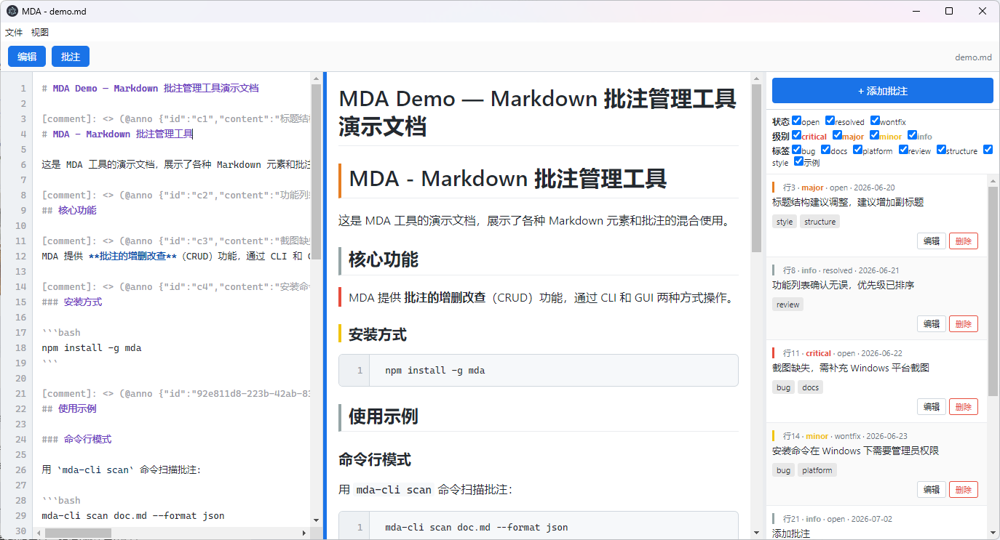
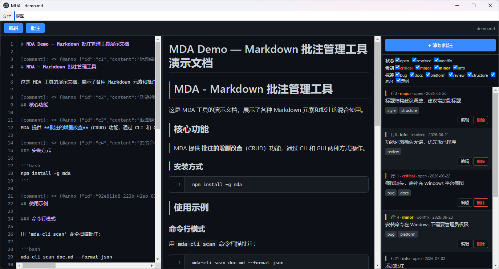
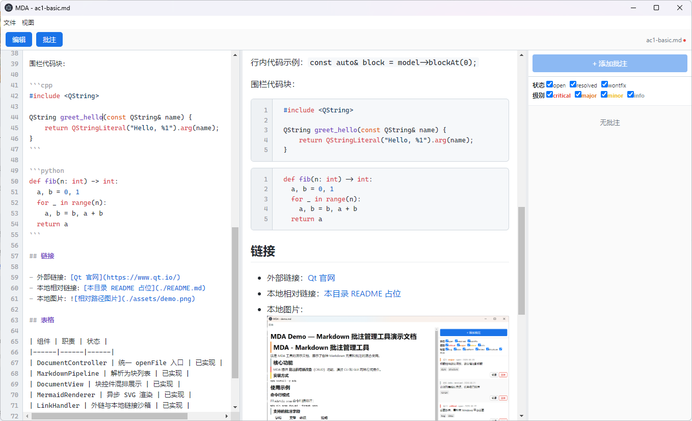
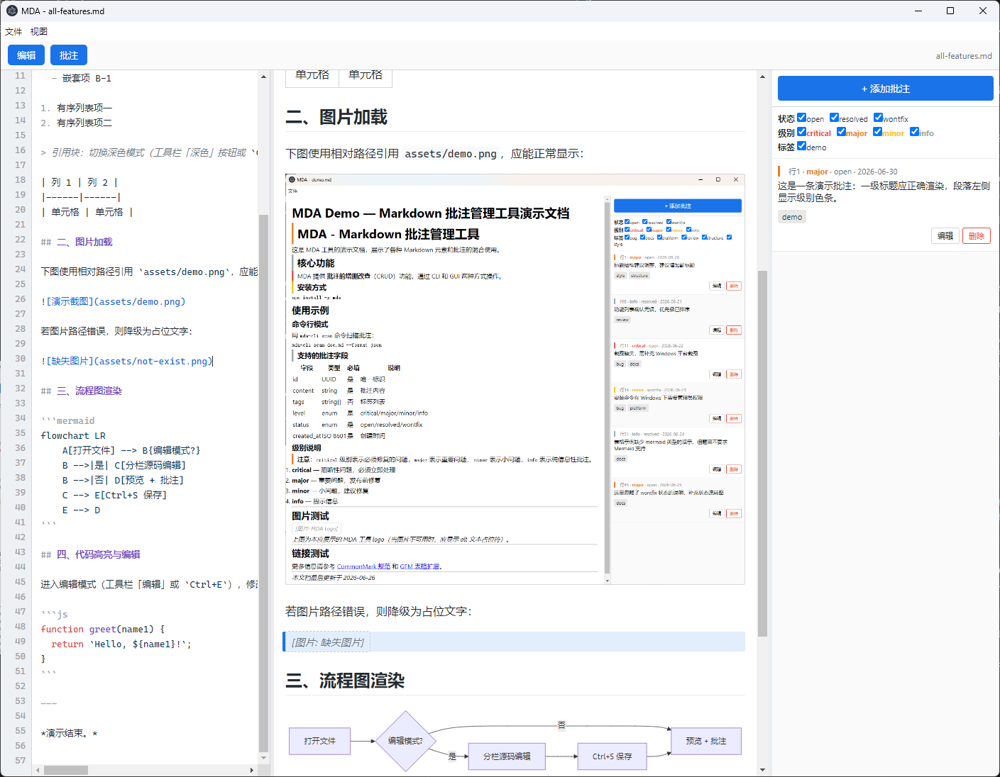
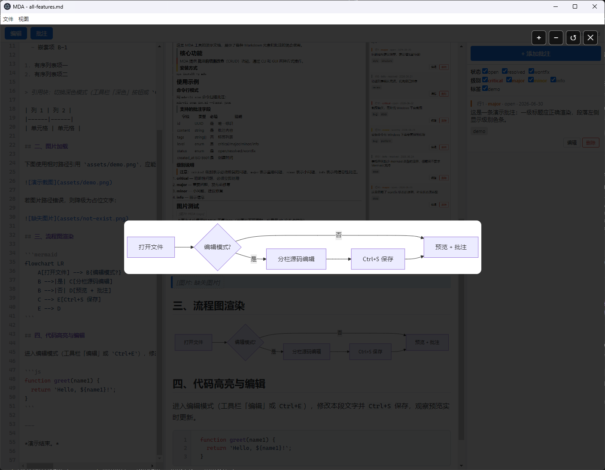

# MDA — Markdown 批注管理工具

> **当前发版**：Phase A Free · tag [`v2.0.0-alpha`](docs/RELEASE-2.0.0-alpha.md)（2026-07-15）  
> Pro AI（M7）未包含在本 tag。

通过 Markdown 标准注释语法在 `.md` 文件中嵌入结构化批注，提供 **CLI** (`mda-cli`)、**GUI** (`mda`) 与 **MCP** (`mda-mcp`) 三种使用方式。


## 目录结构

```
mda-l2/
├── src/
│   ├── core/                  # 共享核心库 @mda/core
│   │   ├── model.ts           # 类型定义 (Annotation, Paragraph, ScanResult)
│   │   ├── parser.ts          # 批注解析器 (状态机段落归属算法)
│   │   ├── writer.ts          # 批注写入器 (原子写入 + 空行压缩 + 源文件保护)
│   │   ├── renderer.ts        # Markdown 渲染器 (CommonMark 0.31 + GFM 表格)
│   │   └── index.ts           # barrel export
│   ├── config/
│   │   └── annotation-schema.json # 可配置规则（枚举/正则/级别配色/严重度）
│   ├── cli/
│   │   ├── main.ts            # CLI 入口 (commander)
│   │   └── commands/          # 子命令实现
│   │       ├── scan.ts        # 扫描批注
│   │       ├── add.ts         # 添加批注
│   │       ├── edit.ts        # 编辑批注
│   │       └── remove.ts      # 删除批注
│   ├── gui/
│   │   ├── main.js            # Electron 主进程
│   │   ├── main/
│   │   │   ├── file-ops.js    # 工作区内复制/移动/重名处理
│   │   │   ├── workspace-prefs.js # 侧栏与工作区偏好
│   │   │   └── i18n.js        # 主进程文案（菜单/对话框）
│   │   ├── preload.js         # contextBridge，复用 @mda/core（解析/渲染/读写）
│   │   └── renderer/
│   │       ├── index.html     # HTML shell
│   │       ├── i18n.js        # 渲染层文案
│   │       ├── app.js         # 渲染进程 (纯 JS)
│   │       └── file-sidebar.js # 工作区文件树
│   └── scripts/
│       └── copy-gui.js        # GUI 文件复制脚本
├── tests/
│   ├── core/
│   │   ├── parser.test.ts     # parser 25 边界用例 (E1-E25)
│   │   ├── writer.test.ts     # writer 原子写入 + 空行压缩 + 源文件保护
│   │   └── renderer.test.ts   # 批注不可见性验证 + CommonMark 语法覆盖
│   └── cli/                   # CLI 集成测试
├── docs/
│   ├── README.md              # 文档总索引
│   ├── P0-requirements.md     # 需求分析
│   ├── P1-architecture.md     # 架构设计
│   ├── P2-detailed-design.md  # 详细设计
│   ├── P3-implementation-plan.md # 实现步骤
│   ├── prompts/               # AI 协作记录（含 prompt-11 文件侧栏迭代）
│   ├── packaging-windows.md   # Windows 打包、签名、语言、更新
│   ├── screenshots/           # GUI 截图 + 录屏
│   ├── few-shot-examples.md   # Few-shot 正反例（易错点 ✅/❌ 对照）
│   └── templates/             # 阶段模板
├── samples/                   # 演示与验收样本（CLI/GUI 体验、人工验收、录屏演示）
├── quality.md                 # 质量保障说明（测试/覆盖率/审核点/Review）
├── AGENTS.md                  # AI 协作指南（架构/接口/规范/禁止事项/隐性规范）
├── package.json
├── tsconfig.json
├── jest.config.js
└── README.md
```

## 技术栈

| 组件 | 技术 | 版本要求 |
|------|------|----------|
| 运行时 | Node.js | ≥ 18 |
| 包管理器 | npm | ≥ 9 |
| 语言 | TypeScript | ^5.5 |
| CLI 框架 | commander | ^12.1 |
| Markdown 渲染 | markdown-it (CommonMark 0.31 preset + GFM 表格) | ^14.1 |
| 代码高亮 | highlight.js（仅 GUI 预览） | ^11.9 |
| 流程图 | mermaid（仅 GUI 预览，离线打包） | ^11 |
| GUI 框架 | Electron | ^31.1 |
| 测试 | Jest + ts-jest | ^29.7 |
| 覆盖率 | Jest 内置 (lcov + text) | — |

## 运行指引

### 1. 安装依赖

```bash
npm install
```

### 2. 构建

```bash
npm run build
```

### 3. 启动

**CLI 模式：**

```bash
# 扫描批注（表格输出）
npm run cli -- scan samples/demo.md

# 扫描批注（JSON 输出）
npm run cli -- scan samples/demo.md --format json

# 添加批注
npm run cli -- add samples/demo.md 12 "这里是批注内容" --tags bug --level major

# 编辑批注
npm run cli -- edit samples/demo.md <批注ID> --status resolved

# 删除批注
npm run cli -- remove samples/demo.md <批注ID>
```

**GUI 模式：**

```bash
# 打开空窗口
npm run gui

# 直接打开指定文件
npm run gui -- samples/demo.md
```

## 打包与分发

将 **GUI** 打成安装包分发给他人（无需对方安装 Node.js）。项目使用 [electron-builder](https://www.electron-builder.io/)，产物输出到 `release/` 目录。

### 环境要求

- 已执行 `npm install`
- **Windows `.exe`**：在 Windows 上运行 `npm run dist:win`
- **macOS `.dmg`**：须在 **macOS** 上运行 `npm run dist:mac`（或使用 macOS CI）
- **Linux `.AppImage` / `.deb`**：在 Linux 上运行 `npm run dist:linux`

### 打包命令

```bash
npm run build          # 先编译（打包脚本会自动执行，也可手动预检）

npm run dist:win       # Windows：NSIS 安装包 + portable 便携版 + zip 绿色版
npm run dist:mac       # macOS：.dmg + .zip
npm run dist:linux     # Linux：AppImage + deb
npm run dist           # 当前平台默认目标
```

| 平台 | 典型产物（`release/` 下） |
|------|---------------------------|
| Windows | `MDA-1.0.0-win-x64.exe`（NSIS 安装程序，**推荐**）、`MDA-1.0.0-win-x64.zip`（解压后运行，**推荐**）、`MDA-1.0.0-portable-win-x64.exe`（单文件便携版） |
| macOS | `MDA-1.0.0-mac-x64.dmg`、`MDA-1.0.0-mac-arm64.dmg` 等 |
| Linux | `MDA-1.0.0-linux-x86_64.AppImage`、`mda_1.0.0_amd64.deb` |

安装后可通过开始菜单 / 应用程序启动；支持关联 `.md` / `.markdown` 文件。命令行传入文件路径亦可直接打开，例如：

```bash
# Windows（安装后示例路径因安装位置而异）
"C:\Program Files\MDA\MDA.exe" D:\docs\readme.md
```

### 仅 CLI（开发者 / 脚本集成）

打包安装包**仅含 GUI**。若对方需要 `mda-cli` 命令行：

```bash
npm install -g .    # 全局安装后使用 mda-cli / mda-mcp
# 或源码方式：npm run build && npm run cli -- scan <file>
```

## MCP Server（AI 工作流）

MDA 提供 **stdio MCP** 服务，六 tools 与 CLI 语义一致。工作区根目录由环境变量 `MDA_WORKSPACE` 或启动参数 `--workspace` 指定；写操作路径必须在其下。

### 本地启动

```bash
npm run build
MDA_WORKSPACE=/path/to/project npm run mcp
# 或
node dist/mcp/server.js --workspace D:\my-docs
```

### Cursor 配置示例

在 Cursor **Settings → MCP** 或项目 `.cursor/mcp.json` 中添加：

```json
{
  "mcpServers": {
    "mda": {
      "command": "node",
      "args": [
        "D:/mda-l2/dist/mcp/server.js",
        "--workspace",
        "D:/my-docs"
      ]
    }
  }
}
```

全局安装后可将 `command` 改为 `mda-mcp`（`npm install -g .`）。

| Tool | 说明 |
|------|------|
| `mda_scan` | 扫描批注，JSON 同 `mda-cli scan --format json` |
| `mda_add` | 添加批注（支持 `anchor`） |
| `mda_edit` | 编辑批注 |
| `mda_remove` | 删除批注 |
| `mda_read_file` | 读文件 + `parseAnnotations` 结果 |
| `mda_export_review_prompt` | 多文件批注汇总为 AI 审阅 prompt |

### 导出与自动更新

- **导出 HTML / PDF**：GUI 菜单「文件 → 导出 HTML / 导出 PDF」（复用公众号复制的内联样式与图片内嵌逻辑）
- **自动更新**：打包版「帮助 → 检查更新」（`electron-updater`）。须用 `electron-builder --publish` 上传安装包与 `latest.yml`；详情见 [`docs/packaging-windows.md`](docs/packaging-windows.md)（含代码签名、中英语言）。

### 签名与首次打开提示

- **Windows**：未签名时 SmartScreen 可能提示「未知发布者」，属正常现象；正式对外分发建议代码签名。
- **macOS**：未公证时首次打开需右键「打开」；正式分发需 Apple 开发者账号 + 公证。
- **Linux**：AppImage 需 `chmod +x` 后执行；deb 用 `sudo dpkg -i` 安装。

### Windows 分发说明（避免「找不到 ffmpeg.dll」）

Electron 应用启动时需要与 `MDA.exe` **同目录**下的多个运行时文件（`ffmpeg.dll`、`d3dcompiler_47.dll`、`libEGL.dll` 等共 6 个 DLL，以及 `locales/`、`resources/` 等）。**不能只拷贝 `MDA.exe` 一个文件**。

| 分发方式 | 用法 | 说明 |
|----------|------|------|
| NSIS 安装包 `MDA-*-win-x64.exe` | 双击安装 | **最稳妥**，推荐发给一般用户 |
| ZIP 绿色版 `MDA-*-win-x64.zip` | 解压整个文件夹 → 运行其中 `MDA.exe` | 无需安装；须保留解压后的**全部文件** |
| 便携版 `MDA-*-portable-win-x64.exe` | 双击该 exe（不要只拷内部的 `MDA.exe`） | 每次运行解压到临时目录；部分杀毒软件会误删 `ffmpeg.dll` |

若对方仍报 **「找不到 ffmpeg.dll」**：

1. 确认发的是**完整安装包 / zip / portable exe**，不是从 `win-unpacked` 里单独拎出的 `MDA.exe`。
2. 让对方将 MDA 加入杀毒/EDR **白名单**（`ffmpeg.dll` 常被误报）。
3. 改用 **NSIS 安装包** 或 **zip 绿色版** 再试。

打包结束会自动运行 `scripts/verify-release.js` 校验 `release/win-unpacked` 运行时文件是否齐全。

若打包报 **`EBUSY: resource busy or locked, unlink ... app.asar`**：说明上次构建产物仍被占用。请先**关闭所有 MDA 窗口**，关闭资源管理器中打开的 `release` 文件夹，再执行 `npm run dist:win`（脚本会自动 `pre-dist` 清理并重试）。仍失败时重启终端或暂时排除杀毒对 `release/` 的实时扫描。

### GUI 功能

- **三栏布局**：工具栏「编辑」「批注」两个独立开关，中间预览常驻；两者可同时展开为 **源码 ｜ 预览 ｜ 批注** 三栏平铺。栏间可拖拽调宽，**双击手柄复位**默认宽度。
- **源码编辑**：编辑栏内直接修改 Markdown 源码（**语法高亮 + 行号**），右侧预览实时更新（防抖）；`Ctrl+S` 整篇原子写回并保留原换行风格。保存前若检出「疑似批注但格式不正确」的行会弹窗提示；存在未保存修改时禁用批注增删改，避免与磁盘写入冲突。
- **图片 / 流程图缩放**：点击预览中的图片或流程图进入缩放遮罩，支持滚轮缩放（0.3×–8×）、拖拽平移（边界受限不丢失）、双击复位、`Esc`/× 关闭。
- **深色模式**：默认跟随系统，可手动切换（菜单「视图 → 切换深色模式」/ `Ctrl+Shift+D`）并记忆；代码高亮与流程图配色随主题联动。
- **图片加载**：相对/本地路径图片相对当前文件目录解析为绝对 `file://` 显示（png/jpg/gif/webp/svg 等），加载失败降级为占位文字。
- **流程图渲染**：` ```mermaid ` 代码块渲染为图形（flowchart/sequence/class/state 等），离线打包无需联网；解析失败降级为错误提示。
- **批注管理**：增 / 删 / 改 / 筛选（按状态、级别、标签），写操作复用 core writer（原子写入 + 源文件保护）；支持**选区级批注**（预览/源码拖选 + 右键，含代码块/表格内映射）。
- **段落 ↔ 批注双向定位**：含批注段落显示级别色条，点击段落定位批注、点击批注滚动到段落；选区批注点击面板项可定位到高亮选区。
- **拖拽打开**：将 `.md` / `.markdown` / `.txt` / `.mdc` 拖入窗口即可打开；文件菜单提供「打开文件所在目录」（`Ctrl+Shift+O`）。
- **代码块增强**：语法高亮 + 行号、右上角悬浮「复制」按钮、右键菜单与快捷键（`Ctrl+C` 拷贝选区 / `Ctrl+A` 全选）；复制内容不含行号。
- **复制预览（微信公众号）**：菜单或 `Ctrl+Shift+C`，将预览转为带内联样式的富文本（本地图与 Mermaid 内嵌 base64 PNG），可直接粘贴到公众号编辑器；复制过程不滚动、不改布局。
- **导出 HTML / PDF**：菜单「文件 → 导出 HTML / 导出 PDF」，单文件离线分发。
- **自动更新**：打包版「帮助 → 检查更新」。
- **界面语言**：菜单「视图 → 界面语言」— 跟随系统 / 中文 / English；偏好写入用户目录，切换后立即刷新菜单与 UI。
- **工作区文件侧栏**：`Ctrl+Alt+O` 打开文件夹后展示 Markdown 树；侧栏可拖宽、双击右缘复位；标题栏 **✕** 清空文件列表（关闭工作区侧栏，**不删除**磁盘文件）；悬停显示完整路径；↑↓ 切换文档；右键与快捷键支持复制文件名、复制/剪切/粘贴、重命名（`Ctrl+R`，仅改主文件名）、删除（`Delete`）、拖动移动（`Ctrl` 拖动为复制）；重名时弹窗选择覆盖/自动重命名/取消；`Ctrl+Z` 撤销最近一次文件操作；记住侧栏宽度、收起状态、上次工作区与目录展开状态。
- **文档大纲**：位于预览区**左侧**，可收起/展开（收起后左侧窄栏按钮）、可拖宽；hover 大纲区才显示与正文的分隔线；点击跳转；滚动预览或点击编辑/预览时同步高亮当前标题；正文栏宽恒定，收放大纲不重排跳动。
- **最近打开与启动**：菜单可清空最近文件列表（不清当前文档）；列表为空时下次启动进入**起始页**，且不会因恢复工作区而自动打开树内第一个文件。
- **编辑区偏好**：用户手动收起编辑栏后，切换文档保持收起（`localStorage`）。
- **稳健渲染**：自动忽略文件起始 BOM；批注行渲染时清空（不可见性对含括号等任意内容成立，并容忍编辑中/被改坏的残缺批注行不泄漏）；围栏代码块内的批注样例按字面显示、不计入面板。

## 界面截图与演示

### 基础功能（已入库）

| 完整窗口（含标题栏） | 四级别色条 + 段落高亮 |
|----------------------|------------------------|
|  |  |

| 标签筛选后 | 添加批注弹窗 |
|------------|--------------|
|  |  |

操作演示（点击段落↔批注双向定位、编辑、删除）：


### 新增 GUI 能力

| 三栏布局（编辑｜预览｜批注） | 深色模式 |
|------------------------------|----------|
|  |  |

| 源码编辑（高亮+行号） | 流程图与图片渲染 |
|----------------------|------------------|
|  |  |

缩放遮罩（点击图片或流程图放大，支持滚轮缩放与拖拽平移）：



## 批注语法

批注通过 Markdown 标准注释语法嵌入，渲染后完全不可见：

```markdown
[comment]: <> (@anno {"id":"<UUID>","content":"批注内容","tags":["tag1"],"level":"major","status":"open","created_at":"2026-06-26T00:00:00+08:00"})
被批注的正文段落。
```

批注字段：

| 字段 | 类型 | 说明 |
|------|------|------|
| id | UUID string | 唯一标识 |
| content | string | 批注内容 |
| tags | string[] | 标签列表 |
| level | critical/major/minor/info | 严重级别 |
| status | open/resolved/wontfix | 状态 |
| created_at | ISO 8601 | 创建时间 |

## 验证方法

```bash
# 运行全部测试
npm test

# 运行覆盖率统计
npm run coverage
# 报告在 coverage/lcov-report/index.html
```

## 覆盖率统计

使用 Jest 内置 coverage 引擎，输出格式：

- **text** — 终端摘要
- **lcov** — `coverage/lcov.info`（可导入 IDE）
- **html** — `coverage/lcov-report/index.html`（浏览器查看）

当前覆盖率：**Statements 85.36% / Lines 88.81% / Functions 92.20%**（117 个测试用例全部通过，含 MCP handlers、core 单元测试、anchor/outline、GUI 辅助单测、配置一致性测试与 CLI 集成测试）。

## 规则配置

批注的**枚举值、识别正则、级别配色与严重度**统一外置到 [`src/config/annotation-schema.json`](src/config/annotation-schema.json)，
作为单一可配置真相；`@mda/core` 与 GUI 均从中派生（GUI 经 preload 暴露 `levelColors`/`levelSeverity`）。

扩展方式（示例）：

```jsonc
{
  "levels": ["critical", "major", "minor", "info"],      // 调整级别枚举
  "statuses": ["open", "resolved", "wontfix"],           // 调整状态枚举
  "levelColors": { "critical": "#e74c3c", "...": "..." }, // 调整级别配色
  "annotationPattern": "^\\[comment\\]:\\s*<>\\s*\\(@anno\\s+(\\{.+?\\})\\)\\s*$",
  "fileExtensions": ["md", "markdown", "txt", "mdc"]   // GUI 打开/拖拽与 scan -r 识别的扩展名
}
```

> 修改后执行 `npm run build`（配置会被复制到 `dist/config/`）。注意：`levels`/`statuses` 同时受
> `model.ts` 的 TS 字面联合类型约束，新增枚举值需同步该类型。`fileExtensions` 由 core 暴露
> `MARKDOWN_FILE_EXTENSIONS` / `isMarkdownPath`，GUI preload 同步暴露给渲染层。

## 质量与协作资产

- [`docs/README.md`](docs/README.md) — 文档总索引（阶段交付与协作资产）。
- [`quality.md`](quality.md) — 测试体系、覆盖率、数据校验、源文件安全、人工审核点、Code Review 痕迹。
- [`docs/few-shot-examples.md`](docs/few-shot-examples.md) — 易错点的 ✅ 正确 / ❌ 错误 成对示例（含 GUI：dirty/坏批注/编辑器对齐/缩放遮罩）。
- [`samples/`](samples/) — 演示与验收样本，可直接用 CLI/GUI 体验。

## 开发约定

参与本项目开发（含 AI 协作）前，请阅读 [`AGENTS.md`](AGENTS.md)，其中定义了架构分层、核心
接口、编码规范、**禁止事项**（如源文件保护、CLI stdout 纯净、GUI 禁用原生 alert/confirm 等）
与项目沉淀的隐性规范。
