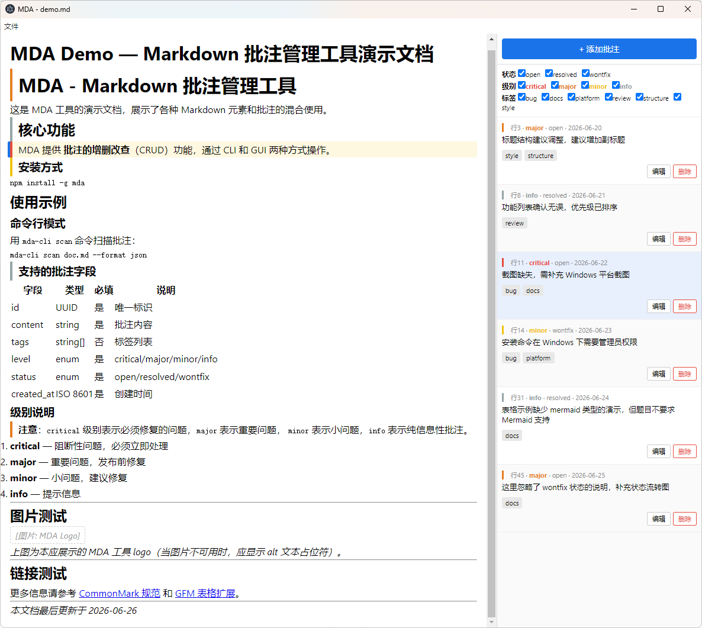
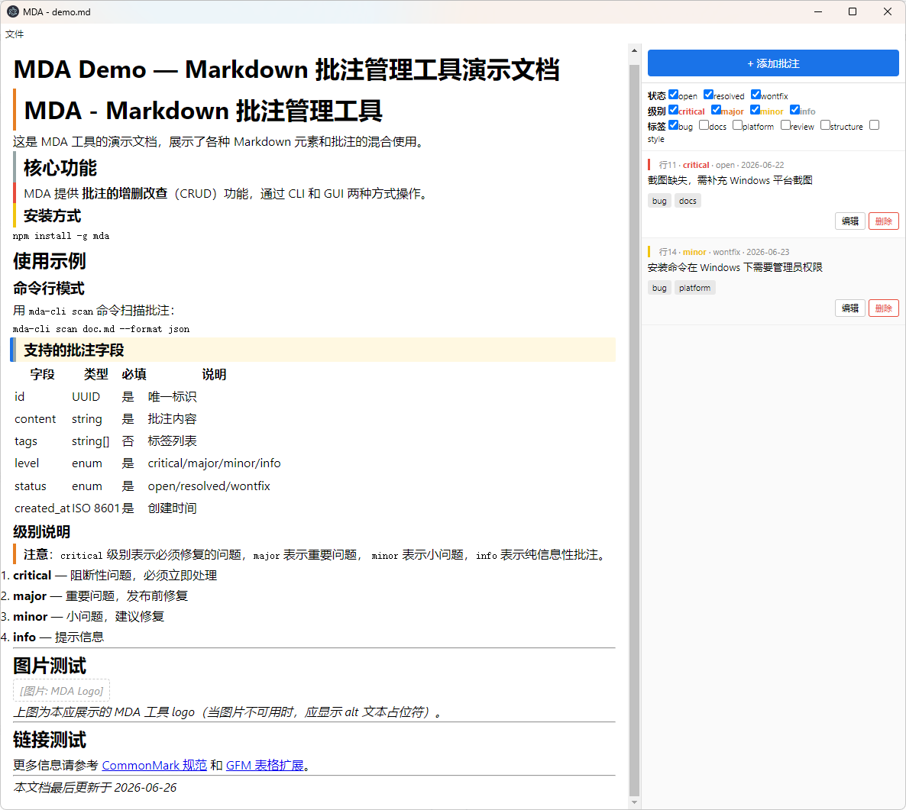
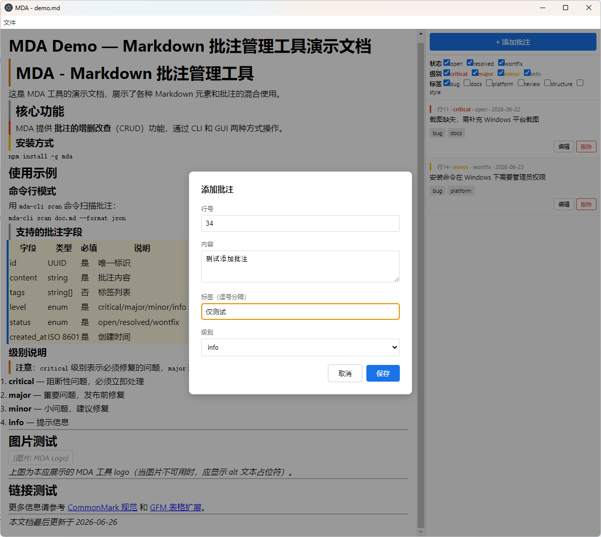
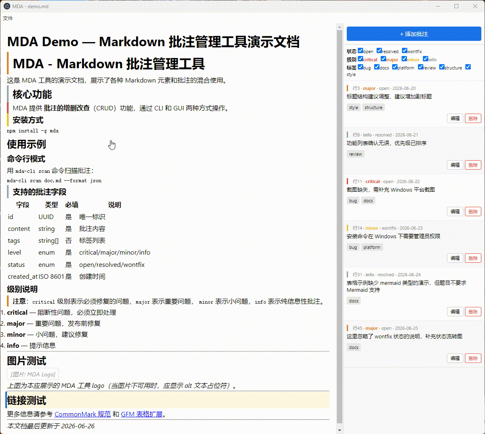

# MDA — Markdown 批注管理工具

通过 Markdown 标准注释语法在 `.md` 文件中嵌入结构化批注，提供 **CLI** (`mda-cli`) 和 **GUI** (`mda`) 两种使用方式。

## 目录结构

```
mda-l2/
├── src/
│   ├── core/                  # 共享核心库 @mda/core
│   │   ├── model.ts           # 类型定义 (Annotation, Paragraph, ScanResult)
│   │   ├── parser.ts          # 批注解析器 (状态机段落归属算法)
│   │   ├── writer.ts          # 批注写入器 (原子写入 + 空行压缩 + 源文件保护)
│   │   ├── renderer.ts        # Markdown 渲染器 (CommonMark 0.31 + GFM 表格)
│   │   └── index.ts           # barrel export
│   ├── config/
│   │   └── annotation-schema.json # 可配置规则（枚举/正则/级别配色/严重度）
│   ├── cli/
│   │   ├── main.ts            # CLI 入口 (commander)
│   │   └── commands/          # 子命令实现
│   │       ├── scan.ts        # 扫描批注
│   │       ├── add.ts         # 添加批注
│   │       ├── edit.ts        # 编辑批注
│   │       └── remove.ts      # 删除批注
│   ├── gui/
│   │   ├── main.js            # Electron 主进程
│   │   ├── preload.js         # contextBridge，复用 @mda/core（解析/渲染/读写）
│   │   └── renderer/
│   │       ├── index.html     # HTML shell
│   │       └── app.js         # 渲染进程 (纯 JS)
│   └── scripts/
│       └── copy-gui.js        # GUI 文件复制脚本
├── tests/
│   ├── core/
│   │   ├── parser.test.ts     # parser 25 边界用例 (E1-E25)
│   │   ├── writer.test.ts     # writer 原子写入 + 空行压缩 + 源文件保护
│   │   └── renderer.test.ts   # 批注不可见性验证 + CommonMark 语法覆盖
│   └── cli/                   # CLI 集成测试
├── docs/
│   ├── P0-requirements.md     # 需求分析
│   ├── P1-architecture.md     # 架构设计
│   ├── P2-detailed-design.md  # 详细设计
│   ├── P3-implementation-plan.md # 实现步骤
│   ├── prompts/               # AI 协作记录
│   ├── screenshots/           # GUI 截图 + 录屏
│   ├── few-shot-examples.md   # Few-shot 正反例（易错点 ✅/❌ 对照）
│   └── templates/             # 阶段模板
├── samples/                   # 演示与验收样本（CLI/GUI 体验、人工验收、录屏演示）
├── quality.md                 # 质量保障说明（测试/覆盖率/审核点/Review）
├── AGENTS.md                  # AI 协作指南（架构/接口/规范/禁止事项/隐性规范）
├── package.json
├── tsconfig.json
├── jest.config.js
└── README.md
```

## 技术栈

| 组件 | 技术 | 版本要求 |
|------|------|----------|
| 运行时 | Node.js | ≥ 18 |
| 包管理器 | npm | ≥ 9 |
| 语言 | TypeScript | ^5.5 |
| CLI 框架 | commander | ^12.1 |
| Markdown 渲染 | markdown-it (CommonMark 0.31 preset + GFM 表格) | ^14.1 |
| 代码高亮 | highlight.js（仅 GUI 预览） | ^11.9 |
| 流程图 | mermaid（仅 GUI 预览，离线打包） | ^11 |
| GUI 框架 | Electron | ^31.1 |
| 测试 | Jest + ts-jest | ^29.7 |
| 覆盖率 | Jest 内置 (lcov + text) | — |

## 运行指引

### 1. 安装依赖

```bash
npm install
```

### 2. 构建

```bash
npm run build
```

### 3. 启动

**CLI 模式：**

```bash
# 扫描批注（表格输出）
npm run cli -- scan samples/demo.md

# 扫描批注（JSON 输出）
npm run cli -- scan samples/demo.md --format json

# 添加批注
npm run cli -- add samples/demo.md 12 "这里是批注内容" --tags bug --level major

# 编辑批注
npm run cli -- edit samples/demo.md <批注ID> --status resolved

# 删除批注
npm run cli -- remove samples/demo.md <批注ID>
```

**GUI 模式：**

```bash
# 打开空窗口
npm run gui

# 直接打开指定文件
npm run gui -- samples/demo.md
```

### GUI 功能

- **三栏布局**：工具栏「编辑」「批注」两个独立开关，中间预览常驻；两者可同时展开为 **源码 ｜ 预览 ｜ 批注** 三栏平铺。栏间可拖拽调宽，**双击手柄复位**默认宽度。
- **源码编辑**：编辑栏内直接修改 Markdown 源码（**语法高亮 + 行号**），右侧预览实时更新（防抖）；`Ctrl+S` 整篇原子写回并保留原换行风格。保存前若检出「疑似批注但格式不正确」的行会弹窗提示；存在未保存修改时禁用批注增删改，避免与磁盘写入冲突。
- **图片 / 流程图缩放**：点击预览中的图片或流程图进入缩放遮罩，支持滚轮缩放（0.3×–8×）、拖拽平移（边界受限不丢失）、双击复位、`Esc`/× 关闭。
- **深色模式**：默认跟随系统，可手动切换（菜单「视图 → 切换深色模式」/ `Ctrl+Shift+D`）并记忆；代码高亮与流程图配色随主题联动。
- **图片加载**：相对/本地路径图片相对当前文件目录解析为绝对 `file://` 显示（png/jpg/gif/webp/svg 等），加载失败降级为占位文字。
- **流程图渲染**：` ```mermaid ` 代码块渲染为图形（flowchart/sequence/class/state 等），离线打包无需联网；解析失败降级为错误提示。
- **批注管理**：增 / 删 / 改 / 筛选（按状态、级别、标签），写操作复用 core writer（原子写入 + 源文件保护）。
- **段落 ↔ 批注双向定位**：含批注段落显示级别色条，点击段落定位批注、点击批注滚动到段落。
- **拖拽打开**：将 `.md` / `.markdown` / `.txt` 拖入窗口即可打开；文件菜单提供「打开文件所在目录」（`Ctrl+Shift+O`）。
- **代码块增强**：语法高亮 + 行号、右上角悬浮「复制」按钮、右键菜单与快捷键（`Ctrl+C` 拷贝选区 / `Ctrl+A` 全选）；复制内容不含行号。
- **稳健渲染**：自动忽略文件起始 BOM；批注行渲染时清空（不可见性对含括号等任意内容成立，并容忍编辑中/被改坏的残缺批注行不泄漏）；围栏代码块内的批注样例按字面显示、不计入面板。

## 界面截图与演示

### 基础功能（已入库）

| 完整窗口（含标题栏） | 四级别色条 + 段落高亮 |
|----------------------|------------------------|
|  |  |

| 标签筛选后 | 添加批注弹窗 |
|------------|--------------|
|  |  |

操作演示（点击段落↔批注双向定位、编辑、删除）：



### 新增 GUI 能力（待补截图）

三栏布局、深色模式、源码编辑高亮、流程图渲染、图片/流程图缩放等能力已实现并通过人工验证，
**截图尚未入库**。待补清单与拍摄指引见 [`docs/screenshots/README.md`](docs/screenshots/README.md)。

| 能力 | 建议素材 |
|------|----------|
| 三栏布局（编辑｜预览｜批注） | `docs/screenshots/5-three-pane.png` |
| 深色模式 | `docs/screenshots/6-dark-mode.png` |
| 源码编辑（高亮+行号） | `docs/screenshots/7-editor-highlight.png` |
| 流程图渲染 | `docs/screenshots/8-mermaid.png` |
| 缩放遮罩 | `docs/screenshots/9-zoom-overlay.png` |

## 批注语法

批注通过 Markdown 标准注释语法嵌入，渲染后完全不可见：

```markdown
[comment]: <> (@anno {"id":"<UUID>","content":"批注内容","tags":["tag1"],"level":"major","status":"open","created_at":"2026-06-26T00:00:00+08:00"})
被批注的正文段落。
```

批注字段：

| 字段 | 类型 | 说明 |
|------|------|------|
| id | UUID string | 唯一标识 |
| content | string | 批注内容 |
| tags | string[] | 标签列表 |
| level | critical/major/minor/info | 严重级别 |
| status | open/resolved/wontfix | 状态 |
| created_at | ISO 8601 | 创建时间 |

## 验证方法

```bash
# 运行全部测试
npm test

# 运行覆盖率统计
npm run coverage
# 报告在 coverage/lcov-report/index.html
```

## 覆盖率统计

使用 Jest 内置 coverage 引擎，输出格式：

- **text** — 终端摘要
- **lcov** — `coverage/lcov.info`（可导入 IDE）
- **html** — `coverage/lcov-report/index.html`（浏览器查看）

当前覆盖率：**Statements 88.36% / Lines 91.29% / Functions 95.34%**（73 个测试用例全部通过，含 core 单元测试、配置一致性测试、整篇写回 EOL 保留测试与 CLI 集成测试）。

## 规则配置

批注的**枚举值、识别正则、级别配色与严重度**统一外置到 [`src/config/annotation-schema.json`](src/config/annotation-schema.json)，
作为单一可配置真相；`@mda/core` 与 GUI 均从中派生（GUI 经 preload 暴露 `levelColors`/`levelSeverity`）。

扩展方式（示例）：

```jsonc
{
  "levels": ["critical", "major", "minor", "info"],      // 调整级别枚举
  "statuses": ["open", "resolved", "wontfix"],           // 调整状态枚举
  "levelColors": { "critical": "#e74c3c", "...": "..." }, // 调整级别配色
  "annotationPattern": "^\\[comment\\]:\\s*<>\\s*\\(@anno\\s+(\\{.+?\\})\\)\\s*$"
}
```

> 修改后执行 `npm run build`（配置会被复制到 `dist/config/`）。注意：`levels`/`statuses` 同时受
> `model.ts` 的 TS 字面联合类型约束，新增枚举值需同步该类型。

## 质量与协作资产

- [`quality.md`](quality.md) — 测试体系、覆盖率、数据校验、源文件安全、人工审核点、Code Review 痕迹。
- [`docs/few-shot-examples.md`](docs/few-shot-examples.md) — 易错点的 ✅ 正确 / ❌ 错误 成对示例（含 GUI：dirty/坏批注/编辑器对齐/缩放遮罩）。
- [`samples/`](samples/) — 演示与验收样本，可直接用 CLI/GUI 体验。

## 开发约定

参与本项目开发（含 AI 协作）前，请阅读 [`AGENTS.md`](AGENTS.md)，其中定义了架构分层、核心
接口、编码规范、**禁止事项**（如源文件保护、CLI stdout 纯净、GUI 禁用原生 alert/confirm 等）
与项目沉淀的隐性规范。
