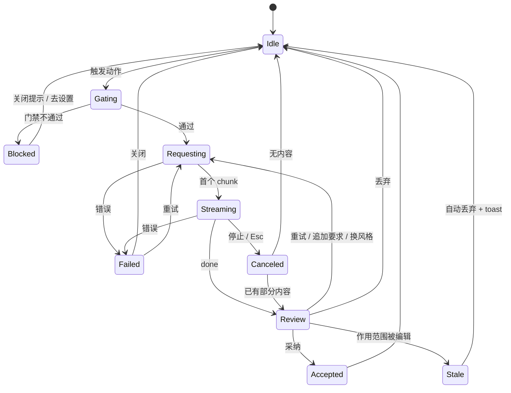

# MDA AI 功能交互设计（v1 草案）

> 状态：**已确认**（2026-09-24，§12 五项决策均按建议方案）；M9-A/B/C 已实施，进度与实现偏差见 §13.1–13.2
> 需求来源：[`P0-requirements-v3-wysiwyg.md`](P0-requirements-v3-wysiwyg.md) F14 / F15-1 / F17 / F18、D7 / D9 / D13
> 取代：[`P2-detailed-design-v3-wysiwyg.md`](P2-detailed-design-v3-wysiwyg.md) §5.6（该节仅一张动作表，本文展开为完整交互规格）；§5.9 模型设置继续有效
> 前提裁决（2026-09-24 用户）：**M7 已有 AI 实现认定为不可用，可直接优化或废弃**

---

## 0. 一页结论

1. **一个统一入口组件**：「AI 指令条」（`Ctrl+J`）。所有入口（顶栏 AI ▾ / 浮动条 / 右键 / 块手柄 / `/` 面板 / 空态 / 批注卡片）最终都打开同一个指令条或直接执行其中某个动作，入口不同、动作集与门禁行为完全一致（AC-30）。
2. **三种结果呈现，全部非模态、原位**：
   - **待确认区**（生成类：续写、帮我写）——流式长在光标处，虚线底纹，不进文档；
   - **原位 diff**（改写类：润色、扩写、缩写、语病、翻译、自定义改写）——原文删除线 + 建议高亮；
   - **只读卡片**（理解类：解释、总结选区）——锚在选区旁，不改文档。
   结果下方统一挂一条「结果操作条」：采纳 / 重试 / 追加要求 / 丢弃。
3. **文档永远只在「采纳」时改一次**：一次采纳 = 一个 CM6 transaction = 一次 `Ctrl+Z` 可撤回。
4. **批注隔离是硬约束**：发给模型的上下文剔除 `@anno` 行；返回内容里出现 `@anno` 一律剥离；采纳范围跨批注行时分段替换、批注行原样保留。
5. **评审线（MDA 差异化，已纳入）**：「AI 审阅 → 生成批注草稿 → 逐条采纳写入 `@anno`」与「按批注让 AI 改 → diff → 采纳并标 resolved」。P0「明确不做：AI 校对与建议 beta」已同步修订（本功能以批注为载体，不做竞品式行内校对建议）。

---

## 1. 现状处置

| 现有资产 | 处置 | 原因 |
|----------|------|------|
| `src/gui/renderer/ai-panel.js`（模态 overlay、`<pre>` 流式、左右 textarea diff） | **废弃** | 绑定 2.0 源码 `textarea`（`getEditor → editorEl`），CM6 预览编辑为默认模式后基本不可用；模态遮挡正文，无法边看边判断 |
| `app.js` `setupAiPanel` / `setupAiEditorKeys` / `applyAiInsert` | **废弃** | 快捷键只挂在 textarea 上；写入绕过 CM6 事务 |
| 视图菜单「AI 续写 / AI 补全 / AI 智能美化」 | **迁移**到新增顶层菜单「AI」 | 视图菜单语义不符 |
| `Ctrl+Space` 补全 | **废弃** | 中文 Windows 上与输入法切换冲突；与「伴写」语义重叠 |
| 美化（整篇重写） | **废弃**，并入「润色」 | 整篇 AI 重写风险高、diff 难读；整篇统一风格由 D8「格式化整篇」（非 AI）承担 |
| `block-handle-menu.js` / `context-menu.js` / `toolbar.js` 中 `soon: true` 的 AI 占位 | **保留入口位置**，接到新命令 | 入口已布好，遵守 §8.14 不删入口 |
| `src/pro/ai/provider.js`（SSE 解析、错误脱敏） | **保留重构** | 解析逻辑可用；改为按 `requestId` 管理会话、错误改为错误码 |
| `src/pro/ai/settings.js`（safeStorage 存 Key） | **保留**，按 P2 §5.9 升级为模型列表 | 安全路径正确 |
| `src/pro/license.js` / `feature-gate.js` | **保留**，门禁链扩展为 5 级（§7） | — |
| `main.js` 里 `'需要 Pro 激活'`、`'已取消'` 等硬编码中文 | **废弃**，改返回错误码由渲染层 i18n | 违反 §6 i18n 强制规范；`'已取消'` 还被当作控制流字符串比较 |
| 单个全局 `aiAbortController` | **废弃**，改会话表 | 新请求会误杀旧请求，旧请求的 chunk 又会串到新面板 |

---

## 2. 设计原则

| # | 原则 | 落到交互上 |
|---|------|-----------|
| P1 | 采纳前不写入 | 所有预览都是装饰层，不产生 doc change，不置 dirty |
| P2 | 不打断编辑 | 无模态；结果期间允许滚动、选别处文字、看大纲；只有**作用范围内**的编辑会让结果作废 |
| P3 | 作用范围可见 | 请求期间作用范围持续淡蓝底，用户始终知道 AI 在改哪一段 |
| P4 | 零请求门禁 | Free / 未配置 / 停用时入口可见可点，点击只出提示，不发网络请求 |
| P5 | 批注隔离 | 见 §0-4 |
| P6 | 一步撤回 | 采纳后 `Ctrl+Z` 一次回到采纳前 |
| P7 | 费用可预期 | 默认不自动发请求（伴写默认手动）；长文动作发送前显示预估字数 |

---

## 3. 能力地图

| 线 | 动作 | 作用范围 | 呈现 | 改文档 |
|----|------|---------|------|--------|
| 写作 | 续写 | 光标位置（上文 ≤ 6000 字，下文 ≤ 1500 字） | 待确认区 | 采纳后 |
| 写作 | 伴写 | 光标位置 | 行内灰字 ghost text | `Tab` 后 |
| 写作 | 帮我写 | 空文档 / 空行，用户描述需求 | 待确认区 | 采纳后 |
| 写作 | 润色 ▸ 快速 / 更正式 / 口语化 / 更文艺 / 更简洁 | 选区；无选区 = 当前块 | 原位 diff | 采纳后 |
| 写作 | 扩写 / 缩写 / 语病修正 | 同上 | 原位 diff | 采纳后 |
| 写作 | 翻译 ▸ 中 / 英 / 日 / 更多… | 同上 | 原位 diff（默认替换）；操作条可切「插入到下方」 | 采纳后 |
| 写作 | 自定义指令（指令条里自由输入） | 有选区=改写，无选区=生成 | diff 或待确认区 | 采纳后 |
| 理解 | 解释 | 选区；无选区 = 当前块 | 只读卡片 | 否（可「插入到下方」） |
| 理解 | 总结选区 | 选区 | 只读卡片 | 否（可插入） |
| 理解 | 文档要点 | 全文（剔除批注） | 左侧栏「要点」tab | 否（可插入） |
| 评审 ⚠ | AI 审阅本文 | 全文或选区 | 批注草稿列表（批注面板内） | 逐条采纳写 `@anno` |
| 评审 ⚠ | 按批注修改 | 某条批注归属段落 / anchor 选区 | 原位 diff | 采纳后，可顺带标 resolved |
| 评审 | 解释卡片「转为批注」 | 卡片内容 → 选区批注 | 批注编辑框预填 | 用户确认后 |

⚠ = 需 §12 决策 1 确认。

**作用范围规则**：
- 选区跨多个块：按块边界扩成完整块再发送（避免模型只拿到半个列表项），扩展后的范围用 P3 淡蓝底告诉用户。
- 选区落在 widget 内（表格单元格、代码块、Mermaid、公式）：v1 只开放**只读动作**（解释），改写类入口置灰并 tooltip「此处暂不支持 AI 改写」。代码块额外提供「解释代码」。
- 选区包含整块 widget（例如选中了一段文字 + 一张表格）：发送时 widget 以 Markdown 源码进上下文，但 diff 采纳时若模型改动了 widget 源码，**只采纳正文部分**，widget 原样保留并在操作条提示。

---

## 4. 入口矩阵

所有入口调用同一个命令 `ai.run(actionId, { scope, source })`；`source` 只用于埋点与键盘焦点恢复。

| 入口 | 位置 | 内容 | 无选区时 |
|------|------|------|---------|
| 顶栏 `AI ▾` | 编辑工具栏最右（已有占位 `tbAi`） | 下拉：打开指令条 · 续写 · 润色 ▸ · 扩写 · 缩写 · 语病修正 · 翻译 ▸ · 解释 · 总结 · ─ · 文档要点 · AI 审阅本文 ⚠ · ─ · AI 设置… | 改写类作用于当前块 |
| 选区浮动条 | 选区上方 | `✦ AI` 按钮 → 直接在选区下方打开指令条 | — |
| 右键「AI 帮我改 ▸」 | 已有 `blockMenuAiEdit` | 同顶栏下拉的动作部分 | 同上 |
| 块手柄菜单「AI ▸」 | 已有 10 个 `soon` 项 | 同上，作用范围固定为该块 | — |
| `/` 面板 | 新增「AI」分组置顶 | 帮我写 · 续写 | — |
| 空行占位 | 光标落空行时已有占位提示 | 文案追加「`Ctrl+J` 让 AI 写」 | — |
| 新建空态 | F15-1 三按钮之一 | 「AI 帮我写」→ 指令条，带模板建议 chips | — |
| 批注卡片 ⚠ | 批注面板每张卡片 | 「✦ 让 AI 按此修改」 | — |
| 左侧栏 | 大纲旁「要点」tab | F17 | — |
| 顶层菜单「AI」 | 主菜单新增 | 同顶栏下拉 + 快捷键显示 | — |
| 快捷键 | 见 §9 | — | — |

源码模式（2.0 textarea 回退）下：只保留顶层菜单与快捷键入口，结果统一用只读卡片 + 「替换选区 / 插入到光标」两个按钮，不做原位 diff（源码模式不是 AI 主战场，避免维护两套装饰）。

---

## 5. 核心组件

### 5.1 AI 指令条（Command Bar）

锚定在选区或光标行**下方**，宽度与正文栏一致，不遮挡作用范围本身；空间不足时翻到上方。

```
 ┌───────────────────────────────────────────────────────────┐
 │ ✦  告诉 AI 要做什么…                         [gpt-4o-mini ▾] │
 ├───────────────────────────────────────────────────────────┤
 │  改写选中内容                                               │
 │    ✎ 润色               ▸                                   │
 │    ⤢ 扩写                                                  │
 │    ⤡ 缩写                                                  │
 │    ✓ 语病修正                                              │
 │    文 翻译              ▸                                   │
 │  理解                                                       │
 │    ? 解释                                                  │
 │    ≡ 总结                                                  │
 │  最近使用                                                   │
 │    ↺ 改成适合发给领导的语气                                 │
 └───────────────────────────────────────────────────────────┘
```

- **输入框为空**：下方列出与当前作用范围匹配的动作（有选区显示「改写 / 理解」，无选区显示「生成」：续写、帮我写）。
- **输入文字**：列表实时按名称过滤；列表首项变为「✦ 执行：<输入内容>」（自定义指令）。`Enter` 执行高亮项。
- **模型切换**：右上角下拉只列已启用模型（F18-5），本次会话生效，不改默认模型。
- **最近使用**：最多 5 条自定义指令，本地持久化（键 `mda-ai-recent-prompts`），可逐条删除。
- **键盘**：`↑/↓` 选择、`→` 展开子菜单、`Enter` 执行、`Esc` 关闭并把焦点还给编辑器且**恢复原选区**。
- 执行后指令条**原地变形**为「进行中条」，不关闭再开新元素，避免视觉跳动：

```
 │ ✦ 润色中…  ▍                              [停止 Esc] │
```

### 5.2 待确认区（生成类）

```
  这是用户原有的段落。|
  ┆ AI 生成的第一行内容正在流式出现……                    ┆   ← 虚线左边框 + 极淡底纹
  ┆ 第二行▍                                            ┆
  ┌──────────────────────────────────────────────────────┐
  │ [✓ 采纳 Enter] [↻ 重试] [✎ 追加要求] [✕ 丢弃 Esc]  ⓘ │
  └──────────────────────────────────────────────────────┘
```

- 实现为 CM6 `Decoration.widget`（block），内容按 Markdown **渲染后**展示（和正文同样式，用户看到的是最终效果而非源码）。
- 流式期间操作条只显示「停止」；完成后显示完整四按钮。
- 「追加要求」：操作条变为输入框（如「再短一点」），基于上一轮结果继续，结果替换当前预览；最多保留 5 轮，操作条左侧 `‹ 2/3 ›` 可回看历史版本。
- 「ⓘ」悬停显示：模型名、耗时、「内容由 AI 生成，请核实」。

### 5.3 原位 diff（改写类）

**短文本（改写前后均 ≤ 8 行）用行内 diff**：

```
  原来的~~一句不太通顺的~~**表述更清晰的**话。
         └ 删除：红色删除线      └ 新增：绿色底
  ┌──────────────────────────────────────────────────────────┐
  │ [✓ 采纳] [↻ 重试] [风格：更正式 ▾] [✎ 追加要求] [✕ 丢弃] │
  └──────────────────────────────────────────────────────────┘
```

- 词级 diff（中文按字、英文按词）；删除部分以 `Decoration.mark` 覆盖原文，新增部分以 inline widget 插入，**原文本身不动**。
- 「风格 ▾」仅润色出现，切换即重新请求，相当于换一种润色。
- 翻译额外有「替换 / 插入到下方」切换。

**长文本（> 8 行）自动切换为块级对比卡片**，原文段落整体淡化，下方卡片展示建议全文，建议区可直接编辑后再采纳（保留 M7 美化的「可编辑建议」这一优点）：

```
  ░░ 原文段落（淡化 40%）░░
  ┌─ AI 建议（可编辑）──────────────────── [显示差异 ⇄] ┐
  │ 改写后的段落……                                      │
  ├────────────────────────────────────────────────────┤
  │ [✓ 采纳] [↻ 重试] [✎ 追加要求] [✕ 丢弃]            │
  └────────────────────────────────────────────────────┘
```

### 5.4 只读卡片（理解类）

```
                         ┌──────────────────────────────────┐
  被解释的选区（淡蓝）── │ 解释                          ✕  │
                         │ 这段话的意思是……                  │
                         │ · 要点一                          │
                         ├──────────────────────────────────┤
                         │ [复制] [插入到下方] [转为批注]    │
                         │ 内容由 AI 生成，请核实            │
                         └──────────────────────────────────┘
```

- 浮在选区右侧（宽屏）或下方（窄屏）；滚动时跟随选区，选区滚出视口时卡片收为右侧小圆点，点击回到选区。
- 「转为批注」：打开现有批注编辑框，内容预填卡片文本、anchor 为该选区、level 默认 `info`、tags 预填 `ai`。仍走 `window.mdaAPI.addAnnotation`（遵守 §8.5）。
- 卡片内可继续追问（底部小输入框），追问结果追加在卡片内，不另开卡片。

### 5.5 伴写（ghost text）

- 触发：默认**手动** `Ctrl+Shift+Space`；设置可改为「停止输入 800ms 自动」（P2 定为 600ms，建议放宽到 800ms 降低请求量，见 §12 决策 3）。
- 呈现：光标后灰色斜体一句话（≤ 60 字），不换行；多行建议只显示首行 + `…`。
- `Tab` 采纳整句、`Ctrl+→` 逐词采纳、继续输入与建议前缀一致则建议跟随缩短、输入不一致或移动光标即消失、`Esc` 忽略。
- 自动模式下：行内代码 / 代码块 / 表格单元格 / 标题行不触发；IME 组字期间不触发（`view.composing`）。

### 5.6 文档要点侧栏（F17）

沿用 P2 §5.10.11 视觉规格，补充交互：

- 首次打开 tab：空态说明 + 「生成要点」按钮 + 预估「约 12,000 字，将分 4 段发送」。
- 文档 dirty 或内容变化后，已生成要点顶部出现「文档已修改 · 重新生成」提示条，不自动重新生成。
- 要点每条带「定位」：点击滚动到对应标题（要求模型输出时带回标题文本，前端按标题匹配 `data-line`）。
- 会话内按文件路径缓存，切换文件再切回不丢失。

### 5.7 AI 审阅（评审线 ⚠）

```
  批注面板
  ┌───────────────────────────────────────────┐
  │ [批注 12] [AI 审阅草稿 5]                   │
  ├───────────────────────────────────────────┤
  │ ● major  第 3 段                          │
  │   「……该段结论缺少数据支撑」               │
  │   [✓ 写入批注] [✎ 编辑后写入] [✕ 忽略]      │
  │ ● minor  第 7 段  选区「n(n-1)/2」         │
  │   …                                        │
  ├───────────────────────────────────────────┤
  │ [全部写入 5]  [全部忽略]                   │
  └───────────────────────────────────────────┘
```

- 触发：顶栏 AI ▾ → 「AI 审阅本文」→ 小对话框选择审阅侧重（逻辑 / 表述 / 技术准确性 / 自定义）与严重度下限。
- 模型输出**结构化 JSON**（段落 startLine、可选 quote、level、content、tags），前端校验：level 走 `isAnnotationLevel`、quote 必须能在对应段落中找到，否则降为段落级批注。
- 草稿在正文中以**虚线色条**显示（区别于真批注的实线色条），点击草稿定位段落。
- 「写入」走 `addAnnotation`；**批量写入必须自下而上串行**（§9.13），写入期间面板显示进度，任一条失败停止并报告已写入条数。
- 草稿不落盘，关闭文件即丢弃（关闭前若有未处理草稿，`uiConfirm` 提示）。

**按批注修改**：批注卡片「✦ 让 AI 按此修改」→ 作用范围为该批注的 anchor 选区（无 anchor 则归属段落）→ 原位 diff → 采纳后操作条附带勾选框「同时将此批注标为已解决」（默认勾选）→ 先改正文（CM6 transaction + 保存），再 `editAnnotation(status:'resolved')`，经 `withFreshDisk` 串行（§9.4e）。

---

## 6. 会话状态机



规则：

- **同一时刻只有一个编辑类会话**（续写 / 改写 / 伴写）。新会话发起时，旧会话处于 Streaming → 取消；处于 Review → 直接丢弃（不弹确认，结果可通过 `‹ ›` 历史找回的仅限同一会话）。
- 只读卡片与要点侧栏是**独立会话**，可与编辑类会话并存（最多：1 编辑 + 1 卡片 + 1 要点）。
- **Stale 判定**：作用范围用 `changes.mapPos` 跟随文档变化；只要有 change 落在范围内（含边界）即 Stale；范围外的编辑只映射坐标，结果继续有效。
- 部分内容取消（Canceled 且有内容）进入 Review，允许采纳已生成部分——用户经常「看到够用了就停」。
- 切换文件、切换源码/预览模式、关闭窗口：取消所有会话；Review 中的结果直接丢弃（未采纳即不属于文档）。

---

## 7. 门禁与异常态

门禁链（按顺序，任一失败即停，**零网络请求**）：

| # | 条件 | 提示（i18n 键） | 按钮 |
|---|------|----------------|------|
| 1 | Pro 未激活 / 过期 | `aiGateUpgrade`「AI 功能需要 Pro」 | 了解 Pro · 输入激活码 |
| 2 | Provider 已停用 | `aiGateProviderOff` | 去设置 |
| 3 | 未配置 API Key | `aiGateNeedKey` | 去设置 |
| 4 | 无已启用模型 | `aiGateNoModel` | 去设置 |
| 5 | 默认模型已停用 | `aiGateDefaultDisabled` | 选择模型 ▾（就地切换） |

提示形态：**在指令条 / 卡片原位显示**，不弹全局 `uiAlert`——用户点的是哪里，提示就出现在哪里。「去设置」直接打开设置并定位到 Pro 面板对应区块。

请求异常（main 返回错误码，渲染层映射文案）：

| 错误码 | 场景 | 文案要点 | 操作 |
|--------|------|---------|------|
| `E_AUTH` | 401/403 | Key 无效或无权限 | 去设置 |
| `E_MODEL` | 404 / model_not_found | 模型不存在 | 换模型 ▾ |
| `E_RATE` | 429 | 请求过于频繁或额度不足 | 重试 |
| `E_CONTEXT` | 上下文超长 | 内容过长，请缩小选区 | — |
| `E_TIMEOUT` | 首包 30s / 空闲 60s 无数据 | 请求超时 | 重试 |
| `E_NETWORK` | fetch 失败 | 网络不可用 | 重试 |
| `E_EMPTY` | 返回为空或清洗后为空 | AI 未返回有效内容 | 重试 |
| `E_ANNO_ONLY` | 作用范围只有批注行 | 所选内容没有可处理的正文 | — |
| `E_UNKNOWN` | 其他 | 附脱敏后的原始信息（≤ 120 字） | 重试 |

错误均在进行中条 / 结果操作条原位显示，不另弹窗。取消不是错误，不提示。

---

## 8. 上下文构建与写入规则

### 8.1 发送前（纯函数 `model/ai-context.js`）

1. 取文本：以 CM6 文档为准（LF、无 BOM）。
2. 剔除批注：用 `buildCodeFenceMask` + `ANNO_REGEX` / `ANNO_ISH` 找出围栏外批注行，从上下文中删掉；记录「上下文偏移 ↔ 文档偏移」映射。
3. 作用范围全部是批注行 → `E_ANNO_ONLY`，不请求。
4. 截断：续写上文取末 6000 字、下文取前 1500 字；改写作用范围上限 8000 字，超出提示缩小选区；截断优先落在块边界。
5. 附加元信息：文件名、文档语言（按字符集粗判）、作用范围所在标题路径（`extractHeadings`），帮助模型保持术语与层级。

### 8.2 返回后（纯函数 `model/ai-output.js`）

1. 剥离整体包裹的 ```` ```markdown ```` 围栏与「以下是润色后的内容：」类前缀。
2. 剥离任何匹配 `ANNO_ISH` 的行。
3. 改写类：若原范围首尾是完整块，保持结果首尾换行数与原文一致；若原范围在行内，结果不得引入换行（有则提示并按空格合并）。
4. 标题层级：改写结果若出现比原范围所在层级更高的标题（如在 H3 下出现 `#`），降级到原层级下。

### 8.3 采纳写入（`state/ai-apply.js`）

- 单 transaction，`userEvent: 'input.ai'`，一次 `Ctrl+Z` 撤回。
- 作用范围内有批注行：按批注行把范围切成若干正文片段，**仅替换正文片段**，批注行原位保留；结果按段落对齐分配到片段（段数不一致时全部放入第一个片段并 toast 提示批注仍留在原处）。
- 行内改写结果经过 4l4 定界符规划（`planFusedWrap` / `planRegionCleanup`），避免 AI 返回的 `**` 与周围样式产生裸定界符。
- 采纳后光标落在新内容末尾；置 dirty；不自动保存（遵守自动保存设置）。

---

## 9. 快捷键

| 键 | 作用 | 说明 |
|----|------|------|
| `Ctrl+J` | 打开 AI 指令条 | 新增；主入口 |
| `Ctrl+Shift+Enter` | 续写 | 保留 |
| `Ctrl+Shift+Space` | 伴写（手动触发） | 保留 P2 定义 |
| `Ctrl+Shift+M` | 润色（快速） | 原「美化」改为润色 |
| `Tab` / `Ctrl+→` | 采纳伴写整句 / 逐词 | 仅 ghost text 可见时拦截，否则交还列表缩进 |
| `Enter` | 采纳（结果操作条获焦时） | 编辑器获焦时 `Enter` 仍是换行——操作条出现后焦点**不自动**移过去，需 `Alt+Enter` 采纳 |
| `Alt+Enter` | 采纳当前 AI 结果 | 编辑器焦点下也有效 |
| `Esc` | 停止 → 丢弃 → 关闭 | 按状态逐级；遵循 P2 §5.5 `Esc` 优先级链 |
| ~~`Ctrl+Space`~~ | — | 废弃（与输入法切换冲突） |

所有快捷键在 CM6 keymap 注册（`Prec.high`），不再挂 textarea。

---

## 10. 设置（设置 → AI）

建议把 AI 从「Pro」面板拆成独立的「AI」面板，Pro 面板只管 License：

| 分组 | 项 | 默认 |
|------|----|------|
| 服务 | Provider / API 地址 / API Key / Provider 启用 / 模型列表 / 默认模型 / 检测 | 按 P2 §5.9 |
| 行为 | 伴写触发：手动 / 停止输入后自动 | 手动 |
| 行为 | AI 输出语言：跟随文档 / 中文 / English | 跟随文档 |
| 行为 | 翻译默认目标语言 | 中↔英自动 |
| 行为 | 长文确认阈值：超过 N 字发送前确认 | 20000 |
| 隐私 | 清除最近使用的指令 | — |
| 隐私 | 说明文字：内容直接发送至所配置的 Provider，不经 MDA 服务器 | — |

---

## 11. 技术落地

### 11.1 分层与文件

```
main 进程  src/pro/ai/
  provider.js        保留 SSE 解析；新增 listModels / testChat；错误 → { code, detail }
  settings.js        升级 V2（模型列表、迁移）
  actions.js    新   动作注册表：id → { prompt 构建, temperature, 流式?, 输出格式 }
  prompts/      新   每个动作一份 system prompt（替代单文件 prompts.js）
  session.js    新   Map<requestId, AbortController>；超时看门狗
preload
  aiRun({ requestId, action, payload, modelId? }) -> { success, code? }
  aiCancel(requestId)
  onAiEvent(cb)  // { requestId, type: 'chunk'|'done'|'error', text?, code?, detail? }
  checkAiAccess() -> { allowed, reason }   // reason 为门禁 1–5 的枚举
渲染层  src/gui/renderer/editor/ai/
  model/ai-context.js    纯函数：上下文构建、批注剔除、偏移映射
  model/ai-output.js     纯函数：输出清洗
  model/ai-diff.js       纯函数：字/词级 diff
  state/ai-session.js    StateField：会话状态、作用范围映射、Stale 判定
  state/ai-apply.js      采纳写入（批注分段、定界符清理）
  view/command-bar.js    指令条
  view/result-bar.js     结果操作条
  view/pending-block.js  待确认区 widget
  view/inline-diff.js    diff 装饰
  view/read-card.js      只读卡片
  view/ghost-text.js     伴写
  entry.js               ai.run 统一命令；各入口只调它
渲染层（非编辑器）
  renderer/ai-summary-tab.js   要点侧栏
  renderer/ai-review-drafts.js 审阅草稿（⚠）
```

`ai-panel.js`、`app.js` 中 `setupAiPanel` / `setupAiEditorKeys` / `applyAiInsert` 删除；preload 的 `aiContinue/aiComplete/aiBeautify/onAiChunk/onAiDone/onAiError` 删除（同步更新 AGENTS.md §5.5）。

### 11.2 i18n

新增键前缀 `ai*`（渲染层）与 `menuAi*`（主进程），zh + en 同时落地。错误码 → 文案映射集中在一个表里（`aiErr_E_AUTH` 等）。

### 11.3 测试

| 层 | 用例 |
|----|------|
| 单测 | `ai-context`：批注剔除（围栏内 `@anno` 不剔除）、截断落在块边界、偏移映射往返 |
| 单测 | `ai-output`：围栏包裹剥离、`@anno` 注入剥离、行内结果含换行 |
| 单测 | `ai-apply`：范围跨批注行分段替换后 `verifySourceProtection` 语义成立（批注行逐字节不变） |
| 单测 | `ai-session`：范围内编辑 → Stale；范围外编辑 → 坐标映射正确 |
| 单测 | 门禁 5 级 + 零请求（mock fetch 断言未调用） |
| e2e | mock Provider（本地 HTTP 服务返回 SSE）：润色 → diff → 采纳 → `Ctrl+Z` 一次恢复原文 |
| e2e | 四处入口 Free 下行为一致（AC-30） |
| e2e | 流式中停止 → 采纳部分内容 |

---

## 12. 决策记录（2026-09-24 用户确认）

| # | 问题 | 结论 |
|---|------|------|
| 1 | 评审线（AI 审阅生成批注草稿、按批注修改） | **纳入**；P0 v3「明确不做」清单同步修订 |
| 2 | 统一入口形态 | **AI 指令条**（可自由输入 + 预设动作）；菜单入口作为其快捷方式 |
| 3 | 伴写 | **推迟**到后续版本（ghost text 与 hide-mark、IME、点击坐标链路耦合，风险落在 AGENTS §8.13）；§5.5 规格保留备用，首期入口不显示 |
| 4 | AI 设置位置 | **拆出独立「AI」设置面板**，Pro 面板只管 License |
| 5 | widget 内（表格格、代码块）改写 | 首期**只开放「解释」**，改写类置灰 |

---

## 13. 分期建议

| 期 | 内容 | 验收 |
|----|------|------|
| M9-A 地基 | 废弃旧实现；main 会话表 + 错误码 + 动作注册表；preload 新 API；门禁 5 级；设置 V2（模型列表） | 单测 + AC-31–34 |
| M9-B 改写 | 指令条、原位 diff（行内 + 长文卡片）、结果操作条、采纳写入、四处入口接线 | AC-13 / AC-30 + 新增 e2e |
| M9-C 生成与理解 | 续写 / 帮我写（待确认区）、解释 / 总结（只读卡片）、新建空态入口 | — |
| M9-D 要点侧栏 | F17 全部 | AC-29 |
| M9-E 评审线 | AI 审阅草稿、按批注修改、卡片转批注 | — |
| 后续 | 伴写（决策 3 推迟） | — |

### 13.1 实施进度（2026-09-24）

- **M9-A 完成**：`src/pro/ai/{provider,session,actions,prompts,settings}.js` + `feature-gate.js` 五级门禁；preload 新接口；顶层「AI」菜单；旧 `ai-panel.js` 与 app.js 旧接线已删除；设置拆为「AI」「Pro」两栏。
- **M9-B / M9-C 主体完成**：命令条、改写审阅（词级 diff）、续写 / 帮我写、解释 / 总结卡片（含复制 / 插入到下方 / 转为批注）、重试 / 继续调整 / 版本切换、四处入口接线。
- 验证：`tests/pro/*`、`tests/gui/editor/ai-model.test.ts` 单测；`tests/e2e/gui/ai-command.spec.ts` 全链路 e2e（假 SSE 服务）。
- 未做：M9-D 要点侧栏、M9-E 评审线（AI 审阅草稿 / 按批注修改）、新建空态入口。

### 13.2 与本文规格的实现偏差（v1）

| 规格 | 实际 | 原因 |
|------|------|------|
| §5.2 待确认区为文档内块 widget；§5.1/5.4 用 CM6 tooltip | 统一为 `document.body` 上的 fixed 浮层，锚在范围末行下方（`lineBlockAt` 定位） | 块 widget 会改变正文几何、触碰 AGENTS §8.13 / §4l3 的点击落点链路；浮层完全不进 contentDOM |
| §5.3 短结果在正文内原位 diff | diff 显示在浮层里，正文只有范围底色（纯 mark） | 同上：正文内插删除线 / 插入 widget 会干扰光标与拖选 |
| §6 编辑类 1 + 卡片 1 + 要点 1 并存 | 单会话，新入口先取消旧会话 | v1 简化；main 侧会话表已支持多请求，后续可放开 |
| §8.3 事务 `userEvent: 'input.ai'` | `userEvent: 'ai.apply'` | `auto-link.js` 把所有 `input.*` 当键入，会对 AI 输出结尾的 URL 自动包链接 |
| §11.1 `prompts/` 目录、`state/ai-apply.js` | `src/pro/ai/prompts.js` 单文件；纯函数统一在 `editor/ai/model/` | 体量小，无需拆目录 |
| — | 改写范围 > 8000 字拒绝（`E_CONTEXT`） | 发送会截断，采纳时会用截断结果覆盖整段原文 |
