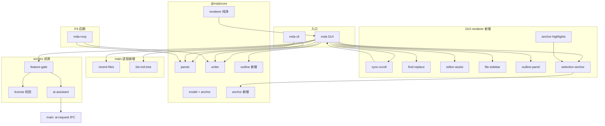

# 设计文档 — MDA 2.0 架构设计（ToC · 预览/编辑/批注三核心）

---

## 版本历史

| 版本 | 时间 | 触发原因 | 综合置信度 | 关键变更 |
|------|------|---------|-----------|---------|
| v1 | 2026-07-13T10:35:00+08:00 | P0 确认后 P1 启动 | 82% | 2.0 三核心架构；anchor/编辑器/License 方案对比与推荐 |
| v1.1 | 2026-07-13T10:40:00+08:00 | 用户要求增强辅助编辑 | 83% | 新增 §3.6 editor-assist 能力与快捷键契约 |
| v1.2 | 2026-07-13T10:45:00+08:00 | 用户要求文件管理 | 82% | 新增 §3.7 file-manager；左脊布局；FM IPC |
| v1.3 | 2026-07-13T11:05:00+08:00 | 用户要求 Pro AI（BYOK） | 81% | 新增 §3.8 ai-assistant；Pro 分界更新 |
| v1.4 | 2026-07-13T11:12:00+08:00 | P1 用户确认 | 83% | Free=全非AI；Phase A/B 门禁；Provider/补全定稿 |

> 前置：[`P0-requirements-v2-commercial.md`](P0-requirements-v2-commercial.md)（**已确认** 2026-07-13）  
> 继承：[`P1-architecture.md`](P1-architecture.md)（1.0 分层与 `@mda/core` 约束不变）

---

## 1. 设计预调研

### 调研方法

- 阅读 1.0 源码：`src/core/*`、`src/gui/preload.js`（data-line 注入）、`src/gui/renderer/app.js`（三栏/高亮层/段落定位）
- 对照 P0 v2：ToC、F1–F3 最高优先、MCP 次优先
- 参考竞品实现取向：mdprobe（UTF-16 anchor + CSS Highlight API）、Penmark（预览选区批注）
- 评估 Monaco / CodeMirror 与现有 textarea+高亮层叠方案的迁移成本

### 关键发现

1. **1.0 已有 preview↔段落定位基础**：preload 对块级 token 注入 `data-line`；GUI 点击段落/批注可 `scrollIntoView`，但 **无比例同步滚动、无大纲、无选区批注**。
2. **编辑器高亮层对齐成本高**：`AGENTS.md` 隐性规范 4f（连字关闭、整数行高、BOM、padding）已在 textarea 方案验证；**换 Monaco 需整层重写对齐逻辑**，工期 +2~3 周，风险高。
3. **批注仍必须只改批注行**：选区信息存入 `@anno` JSON 的 `anchor` 字段，**不修改正文**，源文件保护不变。
4. **预览层选区高亮应放 GUI**：`core/renderer.ts` 保持纯净；anchor 可视化用 preload 渲染后处理或 renderer 层 **CSS Custom Highlight API**（与 mdprobe 同思路，零 DOM  mutation）。
5. **大纲可与 heading token 复用**：preload 已 hook `heading_open` 注入 `data-line`；TOC 解析可共用 `src/core/outline.ts`（纯函数，CLI/GUI 复用）。

### 核心场景代码路径

**场景 A：同步滚动（2.0 新增）**

```
用户滚动 editor textarea
  → app.js syncScroll.onEditorScroll()
  → 按 editor.scrollTop / scrollHeight 得比例 r
  → 查 lineScrollMap（渲染时由 data-line 块累计高度构建）
  → previewPaneEl.scrollTop = r * (previewScrollHeight - clientHeight)
反向：preview 滚动 → 反查最近 data-line 块 → 定位 editor 行号 scrollTop
```

**场景 B：预览选区 → 添加批注（2.0 新增）**

```
用户在 preview 选中文本
  → selectionAnchor.previewSelectionToUtf16(currentText, previewEl, selection)
  → { start, end, quote }（UTF-16 全文件偏移 + 摘录兜底）
  → 用户填批注表单
  → mdaAPI.addAnnotation(file, paragraphLine, { content, anchor, ... })
  → core/writer.addAnnotation → 仅插入/更新批注行 JSON
  → 重载 → preload renderMarkdown → GUI applyAnchorHighlights(annotations)
```

**场景 C：大纲跳转（2.0 新增）**

```
core/outline.extractHeadings(text) → [{ level, title, line }]
  → outlinePanel 渲染
  → 点击项 → editor 定位 line（scroll + 光标）+ preview scrollToLine(line)
```

**场景 D：查找替换（2.0 新增）**

```
Ctrl+F → findReplace.open('find')
  → 在 editor.value 上搜索（支持 regex 选项）
  → 高亮匹配（editor 选区循环 / 高亮层 overlay marks）
  → Ctrl+H 替换 → 写 editor.value + setDirty；不自动 save
```

**场景 E：新建并保存（2.0 新增）**

```
Ctrl+N → app 进入 UNTITLED（空 buffer，展开编辑栏）
  → 用户编辑 → dirty
  → Ctrl+S → preload.showSaveDialog → main dialog.showSaveDialog
  → writeRawFile → OPEN(path) → addRecentFile → 可批注
```

**场景 F：打开文件夹切换文件（2.0 新增）**

```
Ctrl+Alt+O → folderPath → main listMarkdownTree（跳过 .git/node_modules）
  → IPC → file-sidebar 渲染树
  → 点击 leaf.md → guardDiscard → openFile → addRecentFile
```

### 跨模块通信链路

2.0 仍单 Electron 应用 + 可选独立 MCP 进程（P4 后期）：

```
┌──────────── Electron ────────────┐
│ main.js ──IPC──► preload.js      │
│                    │ require core │
│                    ▼             │
│              renderer/app.js     │
│    ┌──────────┼──────────┐       │
│    editor   preview    panel     │
│    outline  findReplace syncScroll│
│    fileSidebar welcome            │
└──────────────────────────────────┘
         │ write/read          ┌──── MCP (P4d) ────┐
         ▼                     │ mcp/server.ts     │
    @mda/core ◄────────────────│ → core writer     │
                               └───────────────────┘
```

---

## 2. 方案对比

### 2.1 编辑器方案

| 维度 | 方案 A: 增强 textarea（推荐） | 方案 B: Monaco Editor | 方案 C: CodeMirror 6 |
|------|------------------------------|----------------------|----------------------|
| 核心思路 | 保留 1.0 高亮层叠，新增 find/replace、**editor-assist（Markdown 辅助编辑）**、大纲跳转 | 替换为 Monaco 组件 | 替换为 CM6 |
| 优点 | 对齐规范已验证；改动面可控；包体积不增 | 内置 find/replace、多光标、行跳转 | 轻量、可定制、Markdown 模式成熟 |
| 缺点 | find 高亮需自研 overlay | 与 Electron 集成 + 中文对齐需重做；~2MB+ | 与高亮层/行号三层结构需重构 |
| 风险 | 中：find 高亮与 textarea 同步 | 高：光标对齐回归 | 中高 |
| 改动量 | ~700–900 行 GUI | ~1200+ 行 + 删旧编辑器 | ~900+ 行 |
| 2.0 结论 | **采用** | 2.1 再评估 | 不采用 |

### 2.2 选区 anchor 方案

| 维度 | 方案 A: 全文件 UTF-16 偏移（推荐） | 方案 B: 段落内偏移 | 方案 C: 仅 quote 指纹 |
|------|-----------------------------------|-------------------|----------------------|
| 核心思路 | `anchor: { start, end, quote? }` 相对整篇源码 UTF-16 | `{ paragraphLine, start, end }` | `{ quote, before, after }` 模糊匹配 |
| 优点 | 与 mdprobe/浏览器 Selection 一致；跨段落可选区 | 与 1.0 段落模型贴近 | 编辑后容错好 |
| 缺点 | 正文大改后 orphan | 跨段落选区难表达 | 重复文本误匹配 |
| 风险 | 中：偏移漂移 | 高：无法覆盖 AC-3 选区场景 | 高：歧义 |
| 改动量 | core anchor 模块 + GUI 映射 ~500 行 | ~350 行但不满足 P0 | ~400 行，作辅助不作主 |

**推荐 A + 可选 `quote` 字段**：偏移为主定位；漂移时用 `quote` 模糊 re-anchor（orphan 桶，P2 详设）。

### 2.3 预览选区高亮方案

| 维度 | 方案 A: CSS Custom Highlight API（推荐） | 方案 B: 渲染后 wrap `<mark>` | 方案 C: 预览区透明 overlay 矩形 |
|------|------------------------------------------|------------------------------|--------------------------------|
| 优点 | 不 mutate DOM；data-line 映射稳定 | 实现直观 | 不依赖 Highlight API |
| 缺点 | 需 Chromium 105+（Electron 31 满足） | 破坏 markdown-it HTML 结构 | 滚动/换行对齐难 |
| 风险 | 低 | 高：破坏复制/缩放/Mermaid | 中 |

### 2.4 Freemium / License 方案

| 维度 | 方案 A: 离线激活码（推荐） | 方案 B: 账号登录 + 云端校验 | 方案 C: 应用商店 IAP |
|------|---------------------------|---------------------------|---------------------|
| 优点 | 无后端、隐私友好、ToC 快上线 | 防破解强 | 支付省心 |
| 缺点 | 密钥管理需小心 | 需服务器与合规 | 抽成 30%；更新慢 |
| 2.0 结论 | **采用** | 不做 | 2.1 可选 |

**Pro 分界（P1 定稿，2026-07-13 用户确认）**：

| 能力 | Free | Pro |
|------|------|-----|
| 同步滚动、大纲、查找替换、Markdown 辅助编辑 | ✓ | ✓ |
| 文件管理（新建/文件夹/最近/侧栏树） | ✓ | ✓ |
| 选区级批注、KaTeX、表格增强 | ✓ | ✓ |
| 导出 PDF/HTML、自动更新 | ✓ | ✓ |
| MCP 全部 tools（含批量、export prompt） | ✓ | ✓ |
| **AI 续写 / 补全（Ctrl+Space 弹层）/ 智能美化** | — | ✓（BYOK，§3.8） |

**实施门禁**：**Phase A（Free）全部验收通过 → 才启动 Phase B（Pro AI）**。

---

## 3. 推荐方案详述

### 3.0 方案架构图（Mermaid）



### 3.1 模块影响分析

| 模块 | 改动类型 | 影响说明 | 改动量预估 |
|------|---------|---------|-----------|
| `src/core/model.ts` | 扩展 | `AnnotationAnchor` 类型；`Annotation.anchor?` | ~40 行 |
| `src/core/anchor.ts` | **新建** | UTF-16 偏移计算、校验、quote 提取、orphan 检测 | ~150 行 |
| `src/core/outline.ts` | **新建** | 从源码提取 `# heading` 树（围栏感知） | ~80 行 |
| `src/core/parser.ts` | 扩展 | 解析 JSON 内 `anchor`；无效 anchor 忽略不丢批注 | ~30 行 |
| `src/core/writer.ts` | 扩展 | `addAnnotation` 接受可选 anchor；仍只写批注行 | ~50 行 |
| `src/core/index.ts` | 扩展 | export anchor/outline API | ~15 行 |
| `src/gui/main.js` | 扩展 | 新建/另存为/打开文件夹对话框；recent-files 读写；listMarkdownTree IPC | ~180 行 |
| `src/gui/preload.js` | 扩展 | KaTeX、headings 桥接、anchor 辅助、**fileManager API** | ~170 行 |
| `src/gui/renderer/file-sidebar.js` | **新建** | 工作区文件树 UI + 与 openFile 联动 | ~200 行 |
| `src/gui/renderer/welcome.js` | **新建** | 空态欢迎页（新建/打开/文件夹/最近） | ~80 行 |
| `src/gui/main/recent-files.js` | **新建** | userData JSON 持久化，max 20，去重、剔除失效路径 | ~100 行 |
| `src/gui/renderer/app.js` | 扩展 | 集成子模块；选区批注 UI | ~200 行 |
| `src/gui/renderer/sync-scroll.js` | **新建** | 编辑↔预览同步滚动 | ~120 行 |
| `src/gui/renderer/find-replace.js` | **新建** | 查找/替换浮层 | ~200 行 |
| `src/gui/renderer/editor-assist.js` | **新建** | Markdown 辅助编辑：包裹、块级切换、缩进、行操作、补全、浮动条 | ~350 行 |
| `src/gui/renderer/outline-panel.js` | **新建** | 大纲侧栏 UI | ~100 行 |
| `src/gui/renderer/selection-anchor.js` | **新建** | 预览选区 ↔ UTF-16 映射 | ~180 行 |
| `src/gui/renderer/anchor-highlights.js` | **新建** | CSS Highlight API 应用/清除 | ~100 行 |
| `src/pro/license.js` | **新建** | 离线激活码验证（闭源） | ~150 行 |
| `src/pro/feature-gate.js` | **新建** | Pro 功能开关（含 AI 入口） | ~80 行 |
| `src/pro/ai/provider.js` | **新建** | OpenAI-compatible 客户端；streaming | ~200 行 |
| `src/pro/ai/prompts.js` | **新建** | 续写/美化 system+user 模板 | ~120 行 |
| `src/pro/ai/settings.js` | **新建** | Provider 配置 + safeStorage 读写 Key | ~150 行 |
| `src/gui/renderer/ai-panel.js` | **新建** | 续写流式 UI、美化 diff 对比、采纳/保留 | ~280 行 |
| `src/gui/renderer/settings-ai.js` | **新建** | API Key 设置页 | ~120 行 |
| `src/mcp/server.ts` | **新建**（P4d） | MCP stdio tools | ~250 行 |
| `tests/core/anchor.test.ts` | **新建** | anchor 边界用例 | ~150 行 |
| `tests/core/outline.test.ts` | **新建** | 标题提取 | ~80 行 |
| `website/` | **新建**（P4c） | ToC 落地页 | 静态站 |

**总预估（三核心 + 文件管理 + Pro + AI，不含 MCP）**：~3,200 行源码 + ~550 行测试

### 3.2 数据模型扩展

```ts
/** UTF-16 码元偏移，相对整篇文件源码（含 BOM 与否与 textarea.value 一致） */
interface AnnotationAnchor {
  start: number;   // inclusive
  end: number;     // exclusive
  quote?: string;  // 选区原文摘录，用于 re-anchor
}

interface Annotation {
  // ...既有字段
  anchor?: AnnotationAnchor;
}
```

**批注行位置规则（不变）**：
- 有 `anchor` 时，批注行仍插入在 **anchor 所在段落**（由 `start` 映射到 `paragraph.startLine`）上方
- 无 `anchor` → 1.0 段落级行为

### 3.3 GUI 布局演进

```
┌────────────────────────────────────────────────────────────────────────┐
│ [文件▾][编辑][批注] │ B I K ` │ 查找 │  文件名 ●                           │
├────────┬─────────┬──────────┬────────────────────┬──────────────────────┤
│ 文件树 │ 大纲    │ 源码编辑 │ 预览               │ 批注面板             │
│(文件夹)│(可折叠) │ +assist  │ +anchor 高亮       │                      │
│        │         │ +find    │ +sync scroll       │                      │
└────────┴─────────┴──────────┴────────────────────┴──────────────────────┘
     ▲ 无打开文件夹时可隐藏文件树列，仅保留大纲或欢迎页
```

- **左脊**：文件树（FM-4/6）与大纲（PV-2）可折叠；窄屏时互斥展开（P2 定断点）
- **欢迎页**：无 `currentFilePath` 且非「未命名编辑中」时，主区显示 `welcome.js`

### 3.6 编辑器辅助功能详述（`editor-assist.js`）

**设计原则**：
- 纯文本操作：对 `textarea.value` + `selectionStart/End` 读写，**不经过 core writer**（整篇编辑保存仍走 `writeRawFile`）
- 围栏感知：在 ` ``` ` / `~~~` 围栏内时，块级快捷键（标题/列表/引用）**不生效**或仅做选区包裹，避免破坏代码块
- 与 find-replace、大纲跳转解耦，由 `app.js` 统一注册快捷键（避免与全局 `Ctrl+S` 等冲突）
- 操作后 `setDirty(true)` + 触发预览防抖更新

#### 3.6.1 能力清单与快捷键（Windows；macOS 为 Cmd）

| ID | 能力 | 行为摘要 | 快捷键 | 优先级 |
|----|------|----------|--------|--------|
| EA-1 | 粗体 | 无选区时插入 `****` 光标居中；有选区包裹 `**` | `Ctrl+B` | 必做 |
| EA-2 | 斜体 | 包裹 `*` | `Ctrl+I` | 必做 |
| EA-3 | 行内代码 | 包裹 `` ` `` | `` Ctrl+` `` | 必做 |
| EA-4 | 删除线 | 包裹 `~~` | `Ctrl+Shift+X` | 建议 |
| EA-5 | 链接 | 无选区插入 `[text](url)`；有选区作 link text，弹窗填 url | `Ctrl+K` | 必做 |
| EA-6 | 围栏代码块 | 选区或多行包裹 ` ``` ` + 可选语言 | `Ctrl+Shift+`` | 必做 |
| EA-7 | 水平线 | 行首插入 `---` + 换行 | `Ctrl+Shift+-` | 建议 |
| EA-8 | 标题级 | `Ctrl+1`…`Ctrl+6` 设 `#` 级；0 为正文（去 `#`） | `Ctrl+1~6` | 必做 |
| EA-9 | 标题升降 | 行首 `#` 数 ±1（上限 6） | `Ctrl+Shift+↑/↓` | 必做 |
| EA-10 | 无序列表 | 行首加 `- ` 或切换为列表 | `Ctrl+Shift+8` | 必做 |
| EA-11 | 有序列表 | 行首加 `1. ` | `Ctrl+Shift+7` | 必做 |
| EA-12 | 引用 | 行首加 `> ` | `Ctrl+Shift+.` | 必做 |
| EA-13 | 增缩进 | 选中行首加/减 2 空格（列表优先） | `Tab` / `Shift+Tab` | 必做 |
| EA-14 | 移动行 | 当前行或选区块上移/下移 | `Alt+↑/↓` | 建议 |
| EA-15 | 复制行 | 复制当前行到下一行 | `Ctrl+Shift+D` | 建议 |
| EA-16 | 跳转行 | 输入行号跳转（复用 ED-4） | `Ctrl+G` | 必做 |
| EA-17 | 成对补全 | 输入 `([{"'` 自动补全闭合；在代码围栏内可关闭 | 输入时 | 建议 |
| EA-18 | 列表续行 | 列表项 `Enter` 续 `-`/`n.`；空项 `Enter` 退出 | `Enter` | 建议 |
| EA-19 | 浮动格式条 | 选区上方显示 B/I/K/` 图标按钮 | 选中时 | 必做 |

> **快捷键冲突处理**：`Ctrl+E` 保留为「切换编辑栏」；`Ctrl+Shift+C` 保留为「复制预览（公众号）」——与辅助编辑无冲突。P2 输出完整快捷键表并更新帮助对话框。

#### 3.6.2 模块 API（renderer 内纯函数）

```js
// editor-assist.js — 均返回 { value, selectionStart, selectionEnd } 或 null（未处理）
export function wrapSelection(value, start, end, before, after, placeholder)
export function toggleLinePrefix(value, start, end, prefixFn)  // 标题/列表/引用
export function indentLines(value, start, end, deltaSpaces)
export function moveLines(value, start, end, direction)       // -1 | +1
export function duplicateLine(value, lineIndex)
export function handlePairInsert(value, pos, char)
export function continueListOnEnter(value, cursorPos)
export function isInsideCodeFence(value, pos)  // 复用 core.buildCodeFenceMask 经 preload 桥接
```

单元测试：`tests/gui/editor-assist.test.ts`（Node 环境测纯函数，不启 Electron）。

#### 3.6.3 明确不做（辅助编辑范围外）

- 多光标 / 列选择
- Vim 模式
- 实时 WYSIWYG（预览区直接改字）
- **MDA 托管 AI / 代扣 API 额度**（用户 BYOK，§3.8）
- 表格 GUI 编辑器（2.1 候选）

### 3.7 文件管理详述（`file-manager`）

**1.0 基线**：`main.js` 仅 `openFile` 对话框；`saveFile` 必须有路径；无新建/另存为/文件夹/最近列表。

#### 3.7.1 方案对比（工作区文件树）

| 维度 | 方案 A: 递归文件树（推荐） | 方案 B: 仅平铺列表 | 方案 C: 完整工作区+多 tab |
|------|---------------------------|-------------------|---------------------------|
| 思路 | `openDirectory` 后递归扫描 md，树形 UI | 只列一层目录 | VS Code 式 workspace |
| 优点 | 符合「打开文件夹」预期；ToC 够用 | 实现快 | 体验最强 |
| 缺点 | 大目录扫描需去抖 | 子目录不可见 | 工期大、与 2.0 范围冲突 |
| 2.0 | **采用** | 不采用 | **2.1** |

#### 3.7.2 文档状态机

```
EMPTY ──Ctrl+N──► UNTITLED(dirty) ──Save/SaveAs──► OPEN(path)
   │                    │                              │
   │ Ctrl+O             │                              │
   └────────────────────┴──Open/FileTree───────────────┘
```

| 状态 | `currentFilePath` | 可编辑 | 可批注 CRUD | 保存行为 |
|------|-------------------|--------|-------------|----------|
| EMPTY | `null` | 否（显示欢迎页） | 否 | — |
| UNTITLED | `null` + 有 buffer | 是 | **否** | `Ctrl+S` → Save As |
| OPEN | 绝对路径 | 是 | 是（非 dirty） | `Ctrl+S` 写回 |

#### 3.7.3 main / preload API 契约

```js
// preload → window.mdaAPI（新增）
showSaveDialog({ defaultPath, defaultName }) → { success, filePath? }
showOpenFolderDialog() → { success, folderPath? }
listMarkdownTree(folderPath) → { success, tree: FileTreeNode[] }
getRecentFiles() → { success, files: { path, openedAt }[] }
addRecentFile(path) → { success }
clearRecentFiles() → { success }
removeRecentFile(path) → { success }

// FileTreeNode: { name, path, isDir, children?: FileTreeNode[] }
// 仅目录节点可展开；叶子为 md/markdown/txt/mdc（schema 扩展名）
```

**`listMarkdownTree` 规则**：
- 递归深度默认 **无限制**；单目录子项 >500 时仅扫描该层并 stderr 警告（P2 可调）
- 忽略 `node_modules`、`.git` 目录（硬编码跳过，避免扫描爆炸）
- 排序：目录优先，同层按名称 localeCompare

**`recent-files.js` 存储**（`app.getPath('userData')/recent-files.json`）：

```json
{ "version": 1, "items": [{ "path": "D:/docs/spec.md", "openedAt": "ISO8601" }] }
```

- 上限 **20**；打开时 `unshift` + 按 path 去重；读取时 `fs.existsSync` 过滤

#### 3.7.4 菜单结构（文件）

| 菜单项 | 快捷键 | 行为 |
|--------|--------|------|
| 新建 | `Ctrl+N` | → UNTITLED，展开编辑栏 |
| 打开… | `Ctrl+O` | 单文件 → OPEN + addRecent |
| 打开文件夹… | `Ctrl+Alt+O` | 设 `workspaceRoot`，刷新文件树 |
| 最近打开 ▶ | — | 动态子菜单，最多 20 项 +「清除列表」 |
| 保存 | `Ctrl+S` | OPEN 写回；UNTITLED → Save As |
| 另存为… | `Ctrl+Shift+S` | Save As → OPEN |
| 打开文件所在目录 | `Ctrl+Shift+O` | 保持 1.0（shell.showItemInFolder） |

#### 3.7.5 任务与依赖

| 任务 | 依赖 | 说明 |
|------|------|------|
| T15: recent-files + IPC | 无 | main 模块 + 单测 |
| T16: 对话框 save/folder | T15 | main.js 菜单 |
| T17: file-sidebar + welcome | T16 | renderer |
| T18: app.js 状态机集成 | T17 | 新建/切换/dirty 守卫 |

**P4 建议**：T15–T18 与 T6b（editor-assist）**并行**，早于选区批注（批注需 OPEN 路径）。

#### 3.7.6 明确不做（文件管理）

- 多标签页、分屏双文件
- 文件新建向导（选模板库）— 2.0 新建为空白；模板可 2.1
- 云盘 / 同步
- 在侧栏删除/重命名文件（2.1 候选）

### 3.8 Pro AI 编辑助手（BYOK，`src/pro/ai`）

**产品约束（P0 F9）**：Pro 专属；用户自填 API Key；**采纳前不覆盖原文**；请求直连 Provider，不经 MDA 服务器。

#### 3.8.1 Provider 方案对比

| 维度 | 方案 A: OpenAI-compatible 单客户端（推荐） | 方案 B: 每厂商独立 SDK | 方案 C: MDA 云端代理 |
|------|-------------------------------------------|------------------------|----------------------|
| 思路 | 统一 `POST {base}/chat/completions` + SSE | openai、anthropic 等多包 | 服务端转发 |
| 优点 | 覆盖 OpenAI/DeepSeek/Ollama/Azure；零后端 | 厂商特性完整 | 易用 |
| 缺点 | 非兼容 API 需适配器 | 依赖多、体积大 | **违反 BYOK/隐私**，不采用 |
| 2.0 | **采用 A** + 预设：**OpenAI**、**DeepSeek**、**自定义 Base URL** | 不采用 | **禁止** |

#### 3.8.2 架构与数据流

```
renderer ai-panel.js
  → IPC ai-complete / ai-beautify / ai-cancel
  → main.js 读取 safeStorage 解密 Key
  → pro/ai/provider.js fetch(baseUrl, stream)
  → IPC chunk 事件回传 renderer
  → 用户「采纳」→ editor-assist 插入 / diff 替换
```

**安全**：
- Key 仅存 `userData/ai-settings.json` 中 **加密字段**（`safeStorage.encryptString`）；renderer **永不**持有 Key 明文
- main 进程发 HTTP；禁止在 preload 暴露 Key
- 错误消息脱敏（不含 Key、不含完整请求体）

#### 3.8.3 功能规格

| ID | 功能 | 触发 | 输出 UX |
|----|------|------|---------|
| AI-C | **续写** | `Ctrl+Shift+Enter` / 菜单 | 流式插入预览条；**Enter 采纳** / Esc 取消 |
| AI-A | **补全** | **`Ctrl+Space` 弹层**（非 inline ghost）；展示建议全文；Enter/按钮采纳 | Pro |
| AI-B | **智能美化** | 选区右键 / 菜单 | 左右 diff（原文 \| AI）；**保留原文 / 采纳 AI / 编辑后采纳** |

**Prompt 要点（prompts.js）**：
- 续写：输出纯 Markdown，不包裹解释；尊重现有标题层级与列表风格
- 美化：保留语义与技术术语；不删除 `@anno` 批注行；围栏代码块原样返回

**与批注关系**：AI 修改的是 editor buffer；用户保存后仍走 `writeRawFile`。AI **不得**自动调用 `addAnnotation`/`writer`（避免绕过源文件保护语义）。

#### 3.8.4 IPC 契约（preload 暴露）

```js
// 配置（无 Key 明文返回）
getAiSettings() → { success, value: { provider, baseUrl, model, hasKey } }
saveAiSettings({ provider, baseUrl, model, apiKey? }) → { success }

// 调用（须 isPro + hasKey）
aiContinue({ textBefore, textAfter, selection }) → 通过 onAiChunk / onAiDone 事件流式返回
aiBeautify({ source, scope: 'selection'|'document' }) → { success, suggestion }
aiCancel() → 中止进行中的 fetch
```

#### 3.8.5 任务

| 任务 | 依赖 | 说明 |
|------|------|------|
| T19: ai settings + safeStorage | T11 license | settings.js + settings-ai UI |
| T20: provider streaming | T19 | provider.js + main IPC |
| T21: ai-panel UI | T20, T6b | 续写/美化/diff |
| T22: feature-gate 接 AI | T11, T21 | Free 显示升级提示 |

**P4 顺序（修订）**：
1. T1→T4 core
2. T15–T18 文件管理 ∥ T5–T9 体验三件套
3. T8→T10 选区批注
4. T14 MCP + 导出 + 自动更新（**Free，T11 前无需 License**）
5. T11→T13 官网 + **可选** Pro License 基础设施（为 Phase B 预留）
6. **【门禁】Free 验收**
7. T19→T22 Pro AI（**仅 Phase B**）

#### 3.8.6 明确不做（AI）

- MDA 提供默认 Key 或转售 Token
- 自动多轮改稿 Agent
- 把 AI 输出直接写入批注 JSON

### 3.4 任务拆分初稿（P3 细化）

| 任务 | 依赖 | 可并行 | 涉及模块 |
|------|------|--------|---------|
| T1: core anchor + model | 无 | 是 | anchor.ts, model.ts |
| T2: core outline | 无 | 是 | outline.ts |
| T3: parser/writer 扩展 | T1 | 否 | parser, writer |
| T4: anchor/outline 测试 | T1,T2,T3 | 否 | tests/core |
| T5: sync-scroll | 无 | 是 | sync-scroll.js |
| T6: find-replace | 无 | 是 | find-replace.js |
| T6b: editor-assist | 无 | 是 | editor-assist.js + tests |
| T15: file-manager (recent+IPC) | 无 | 是 | main/recent-files, main.js |
| T16: save/folder dialogs | T15 | 是 | main.js menus |
| T17: file-sidebar + welcome | T16 | 是 | file-sidebar.js, welcome.js |
| T7: outline-panel | T2 | 否 | outline-panel.js |
| T8: selection-anchor + highlights | T1,T3 | 否 | selection-anchor, anchor-highlights |
| T9: preload KaTeX + 桥接 | 无 | 是 | preload.js |
| T10: app.js 集成 | T5–T9,T6b,T17,T18 | 否 | app.js |
| T18: doc 状态机 | T17 | 否 | app.js new/open/save |
| T11: pro license + gate | 无 | 是 | src/pro |
| T12: 导出 PDF/HTML（Pro） | T11 | 否 | pro + gui |
| T13: 官网 | T11 | 是 | website |
| T14: MCP server | T3, T10 | 否 | src/mcp |
| T19–T22: Pro AI | T11 | 否 | src/pro/ai, ai-panel |

**推荐实施顺序（P4）**：
1. T1→T3→T4（core 基础）
2. **T15→T16→T17→T18**（文件管理，可与下一步并行）
3. T5+T6+T6b+T7+T9 并行（体验三件套 + 辅助编辑）
4. T8→T10（批注选区，依赖 core + OPEN 路径）
5. T11→T12→T13（官网；License 壳可为 Phase B 预留）
6. **Free 验收门禁**
7. **T19→T22（Pro AI，Phase B only）**
8. T14 若未在步骤 4 完成则补齐

### 3.5 明确不包含（2.0）

- Monaco/CodeMirror 编辑器替换
- **多标签页** / 分屏双文件
- 侧栏内删除/重命名文件
- ToB 席位、SSO、审计
- VS Code 插件
- 批注线程回复
- 实时协作

---

## 4. 关键技术假设

| # | 假设内容 | 证据类型 | 证据详情 | 置信度 |
|---|---------|---------|---------|-------|
| H1 | Electron 31 Chromium 支持 CSS Custom Highlight API | 文档链接 | Can I use + Electron 31 基于 Chromium 124+ | 90% |
| H2 | 全文件 UTF-16 offset 可从 preview Selection 稳定映射 | 行业共识 | mdprobe v0.5 同类方案；P2 需 POC | 75% |
| H3 | 增强 textarea + editor-assist 可满足 AC-2/AC-2b | 源码确认 | 包裹/行操作为标准 textarea 选区 API | 88% |
| H4 | KaTeX 可通过 markdown-it 插件在 preload 注入 | 行业共识 | markdown-it-katex 广泛使用 | 88% |
| H5 | 离线激活码 Ed25519/HMAC 签名可防 trivial 破解 | 行业共识 | 桌面软件常见方案 | 80% |
| H6 | sync-scroll 基于 scroll 比例在 10 万字符文档可接受 | 无证据 | P2 POC 需实机验证 | 65% |
| H7 | 选区/文件 Free 仍能驱动 Pro（**AI/导出**）转化 | 无证据 | 商业假设 | 55% |
| H8 | `userData` 存 recent 在 Electron 31 跨平台可用 | 文档链接 | app.getPath | 95% |
| H9 | OpenAI-compatible SSE 在 main 进程可稳定 streaming | 行业共识 | fetch + ReadableStream | 85% |

---

## 5. 预死亡分析（Pre-mortem）

| # | 原因 | 可能性 | 缓解措施 |
|---|------|--------|---------|
| 1 | 预览选区→UTF-16 映射在表格/代码块内失败 | 高 | 首版禁止在 fence 内选区批注；提示「请在正文段落选择」 |
| 2 | sync-scroll 长文漂移明显，AC-1 不通过 | 中 | 块级 map 校准 + 点击 preview 块强制 reconcile |
| 3 | textarea find 或 assist 大文件卡顿 | 中 | 搜索防抖；assist 仅操作选区/当前行；>500KB 提示 |
| 4 | 三核心工期挤占 MCP，2.0 承诺落空 | 中 | MCP 独立 milestone；官网写清发布波次 |
| 5 | ToC 无人付费 | 高 | 2.0 聚焦体验 GIF 传播；Pro ¥199 买断 |
| 6 | 打开大仓库扫描卡顿 | 中 | 跳过 `.git`/`node_modules`；去抖 refresh |
| 7 | API Key 泄露或 AI 输出破坏文档 | 中 | safeStorage + main 代理；美化必过 diff 确认 |
| 8 | textarea ghost 补全实现困难 | 中 | 2.0  fallback：`Ctrl+Space` 弹层预览，非 inline ghost |

---

## 6. 对抗审查结论

| # | 审查问题 | 结论 |
|---|---------|------|
| 1 | 哪些结论是推测？ | H6 sync-scroll 体验、H7 付费转化、定价、MCP 高级分界均为推测 |
| 2 | 什么场景下方案完全失效？ | 用户主要在 Cursor 内完成全部工作且不打开独立 App；或选区映射在复杂 MD 上全面失败 |
| 3 | 最大风险任务有无更简单替代？ | selection-anchor 最难；备选是 **首版仅源码选区批注**（预览只读高亮），降低 AC-3 但可上线 |
| 4 | 置信度打 5 折最怀疑？ | **预览选区 ↔ UTF-16 映射** — P2 必须 POC，失败则降级为源码选区 |

---

## 7. 综合置信度评估

| 评估维度 | 置信度 | 说明 |
|---------|--------|------|
| 技术可行性 | 84% | core 扩展清晰；GUI 子模块化；最大不确定在 selection-anchor |
| 方案完整性 | 84% | 含 **Pro AI BYOK**、文件管理、三核心 |
| 风险可控性 | 79% | AI Key 与 diff 采纳链已约束；ghost 补全有降级 |
| **综合** | **81%** | ≥80%；P2 详设 ai-panel diff 与 provider 错误码 |

### 低置信度环节处置

- **H6 sync-scroll**：P2 用 `samples/demo.md` + 人工长文实机验证
- **H2 selection-anchor**：P2 开头 0.5–1 天 POC，不通过则 P0 AC-3 改为「源码选区批注」并更新 P0

---

## 8. P0 开放问题决议

| 开放问题 | P1 决议 |
|----------|---------|
| 编辑器选型 | **方案 A：增强 textarea** |
| Pro 分界 | **仅 AI 为 Pro**；其余全部 Free（2026-07-13 确认） |
| anchor 方案 | **全文件 UTF-16 + 可选 quote** |
| 定价倾向 | **¥199 买断**；Pro **仅卖 AI** |
| AI Provider | OpenAI 兼容 + DeepSeek + 自定义 Base URL |
| AI 补全 | **Ctrl+Space 弹层** |
| 交付门禁 | **Free 可交付 → 再 Pro AI** |
| WPS 合规 | 不阻塞技术；用户自行确认 |

---

## Spec Self-Review

- [x] 无占位符（TODO/TBD/待定）
- [x] 无内部矛盾
- [x] 关键决策有明确结论（编辑器、anchor、Pro 分界）
- [x] 范围边界清晰（§3.5 不包含）
- [x] 接口契约：anchor/outline 扩展已定义；MCP 留 P2
- [x] 假设标注证据与置信度
- [x] 方案对比 ≥3（编辑器、anchor、高亮、License）
- [x] 预死亡分析 ≥3
- [x] Mermaid 节点 ≤12

---

## 确认状态

状态: **已确认**（2026-07-13）

→ [`P2-detailed-design-v2.md`](P2-detailed-design-v2.md)
