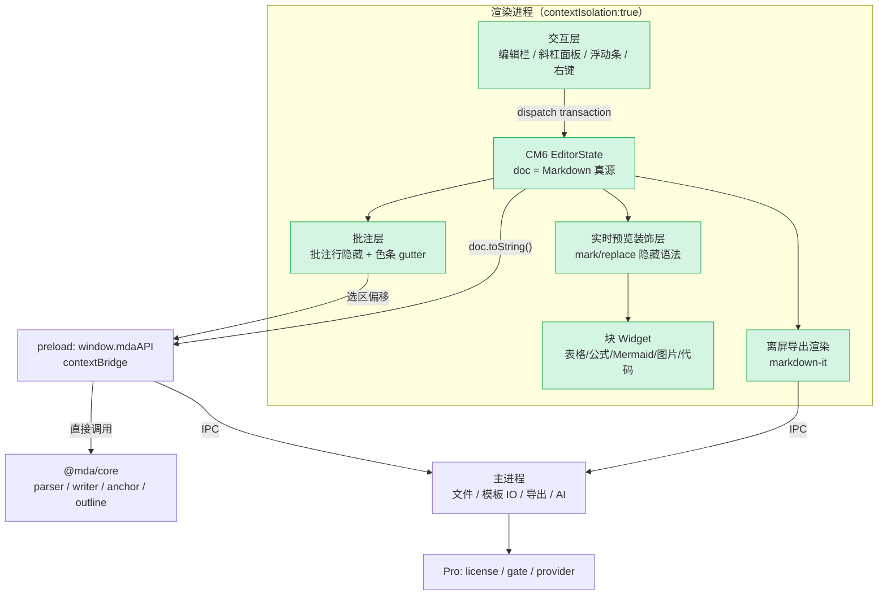

# 架构设计 — MDA 3.0 预览直接编辑（WYSIWYG）与源码模式

> 输入：[`P0-requirements-v3-wysiwyg.md`](P0-requirements-v3-wysiwyg.md)（已确认 2026-07-28，含裁决 D1–D11）
> 状态：**已确认**（2026-07-28）

### 用户裁决记录（2026-07-28）

| # | 议题 | 裁决 |
|---|------|------|
| D12 | 体验取舍 | **接受**「光标所在块显示原始 Markdown 语法、移开即恢复渲染」（Obsidian 式实时预览）；M8-A 可点原型仍作为硬闸门再拍一次 |
| D13 | 装饰层实施策略 | **以 CM6 官方扩展为基座，实时预览装饰层自研**，行为对齐开源实现（`codemirror-live-markdown` / `atomic-editor` 等），**不被 0.x 第三方包绑定** |

## 版本历史

| 版本 | 时间 | 触发原因 | 综合置信度 | 关键变更 |
|------|------|---------|-----------|---------|
| v1 | 2026-07-28 | P1 架构设计完成 | 86% | 初始版本：推荐「源码即真源 + CodeMirror 6 装饰式实时预览」 |
| v1.1 | 2026-07-28 | 用户确认 | 86% | 写入裁决 D12（接受实时预览体验取舍）与 D13（装饰层自研、不绑 0.x 第三方包）；对抗审查 Q3 与低置信度处置同步收敛 |

---

## 1. 设计预调研

### 调研方法

| 方法 | 内容 |
|------|------|
| 代码全量调研 | 以 7 个问题系统排查现有实现：预览渲染管线、所有读写预览 DOM 的模块、dirty/保存状态机、批注隐藏机制、键盘处理、序列化能力、测试约束 |
| **运行时 POC** | `markdown-it` 的 `token.map` 能否给出稳定的「块 ↔ 源码行范围」，以验证 P0 假设 A18（D3「仅改动块局部重写」的前提） |
| 行业调研 | CodeMirror 6 实时预览生态现状（2026）、Tiptap `@tiptap/markdown` 往返保真的真实案例、Milkdown 定位 |
| 包体核算 | `npm view <pkg> dist.unpackedSize` 实测各候选依赖体积，对照 NF-18（≤15MB） |

### 关键发现

| # | 发现 | 证据 |
|---|------|------|
| K1 | 仓库**无任何 HTML/DOM → Markdown 序列化能力**；`html-to-docx` 只用于导出 | `package.json` 依赖清单 |
| K2 | 预览是渲染缓存而非文档模型：源码输入后每 250ms 用 `previewEl.innerHTML = ...` **全量替换**，与 `contenteditable` 根本互斥 | `app.js` `renderMarkdownContent` |
| K3 | 预览上的装饰层（批注色条、查找高亮、选区批注高亮、Mermaid 节点替换、代码块 gutter、图片缩放手柄）**全部假设 DOM 只读**，且每次重渲后重建 | `decorateParagraphs` / `updateFindPreviewHighlights` / `renderMermaidBlocks` / `ensureImageResizeChrome` |
| K4 | **POC 通过**：`token.map` 为每个 level-0 块给出 `[start, end)` 行范围，**互不重叠**；空行与批注行**不属于任何块**；清空批注行后块序列**完全不变** | 见下「POC 实测输出」 |
| K5 | **POC 也暴露三个坑**：①`bullet_list` 的范围**含尾随空行**而 `table` 不含（需归一化）②嵌套列表整体算**一个块**，改一项就要重写整列表（需块内保留未改动行）③无 front-matter 插件时 `---` 被解析成 `hr` + setext 标题（core 已在 `preprocessForRender` 清空，但块级重写必须避开该区域） | 同上 |
| K6 | ProseMirror/Tiptap 路线的往返风险**有生产实证**：某项目在 Tiptap + `@tiptap/markdown` 上被迫写 14 类修复（软换行、块间空行塌陷、表格分隔线、front matter 间距、CRLF 还原），并加「>70% 全文重写即拒绝」的保险；Tiptap 自身 2026 年仍在修「空行侵蚀」（重复 parse/serialize 每轮丢一个空行） | DesktopCommanderMCP commit `fc6b143`；tiptap PR #8008 / `@tiptap/core` 3.29.0 changelog |
| K7 | CodeMirror 6「实时预览」生态在 2026 已成熟且路线一致：**原始 Markdown 即真源，装饰仅改视图，往返逐字节等同纯文本框**；表格 / 公式 / 代码块 / 图片 / 任务复选框均有 widget 实践；光标所在行显示原始语法 | `@atomic-editor/editor`、`conql/codemirror-live-markdown`、`@yuya296/cm6-live-preview-core`（2026-01 发布）、`fedoup/markdown-editor` |
| K8 | 包体不是区分点：CM6 六个核心包 unpacked ≈ **2.6MB**；`@tiptap/core` + `@tiptap/markdown` ≈ **2.9MB**；`@milkdown/crepe` ≈ **3.3MB**；`turndown` ≈ 0.19MB。三者压缩后均远低于 NF-18 的 15MB | `npm view` 实测（2026-07-28） |
| K9 | 渲染层目前**无打包步骤**（`copy-gui.js` 只是拷贝原生 `<script>`），而 CM6 / ProseMirror 均为 ESM 包且必须在渲染进程直接操作 DOM（`nodeIntegration:false` 下渲染层不能 `require`）→ **任一方案都必须新增 renderer 打包链** | `scripts/copy-gui.js`、`index.html`、`main.js` webPreferences |

### POC 实测输出（`token.map` 块 ↔ 源码行范围）

样本含 front matter、标题、批注行、段落、嵌套列表、GFM 表格、Mermaid 围栏、引用、`$$` 公式、内联 HTML、末段。实测结果：

```
hr               lines[0,1)     "---"
heading_open h2  lines[1,3)     "title: front matter\n---"     ← 无 front-matter 插件时的误判
heading_open h1  lines[4,5)     "# 标题一"
paragraph_open   lines[7,8)     "这是第一个段落，含 **粗体** 与 `code`。"
bullet_list_open lines[9,13)    "- 列表项 A\n  - 嵌套 A1\n- 列表项 B\n"  ← 含尾随空行
table_open       lines[13,16)   "| 列1 | 列2 |..."                      ← 不含尾随空行
fence            lines[17,21)   "```mermaid\ngraph TD\nA-->B\n```"
blockquote_open  lines[22,24)   "> 引用块\n> 第二行"
paragraph_open   lines[25,28)   "$$\nE = mc^2\n$$"
html_block       lines[29,30)   "<div class=\"raw\">内联 HTML 块</div>"
paragraph_open   lines[31,32)   "最后一个段落。"

重叠检查：无重叠
未被任何块覆盖的行：全部空行 + 批注行（第 6 行）
批注行归属的 level-0 块：无（→ 块级重写不会吞掉批注行）
局部重写模拟（只改第一个段落）：差异行数 = 1
清空批注行后块序列是否一致：true
```

**结论**：A18 成立，且额外收获两条安全性证据 —— 批注行天然落在所有块范围之外；隐藏批注行不会让块行号漂移（现有 `data-line` 机制的正确性得到运行时确认）。同时 K5 三个坑说明「块级重写」并非零成本，需要归一化与块内行保留逻辑。

### 核心场景代码路径

场景：**用户在预览区改一句话并保存**。

| 阶段 | 现状（2.0） | 目标（3.0，推荐方案） |
|------|-------------|----------------------|
| 输入 | 只能在 `#editor`（textarea）输入 | 在编辑面直接输入 → CM6 `transaction` 更新 `EditorState.doc` |
| 联动 | `input` → 防抖 250ms → `parseAndRender` → `previewEl.innerHTML` 全量替换 | 无重渲：装饰层按变更范围增量更新（`ViewPlugin.decorations`） |
| 脏标记 | `setDirtyState(editorEl.value !== currentText)` | `setDirtyState(view.state.doc.toString() !== currentText)` |
| 保存 | `writeToPath` 读 `editorEl.value` → `api.saveFile` → `core.writeRawFile`（原子写入 + `detectEol`） | 同一条链路，仅取值改为 `view.state.doc.toString()` |
| 结果 | 磁盘 diff = 用户改动 | **同上，且 diff 天然逐字符最小** |

### 跨模块通信链路

涉及渲染进程 / 主进程 / core 三方：

1. **正文编辑与保存**：renderer(CM6) → `window.mdaAPI.saveFile` → preload → `core.writeRawFile`（原子写入 + EOL 保留）
2. **批注读写**：renderer → `parseAnnotations`（preload 直调 core，纯函数）/ `addAnnotation|editAnnotation|removeAnnotation` → core writer（`verifySourceProtection`）
3. **模板 IO**（新增 F15）：renderer → IPC → main（仅读 `.md`、路径校验）→ 返回文本 → CM6 插入
4. **AI**（F14/F17）：renderer → IPC → main（`safeStorage` 取 Key + provider 流式）→ `ai-chunk` 事件回渲染层 → 装饰层以 ghost text / diff 呈现 → 用户采纳后才 dispatch transaction
5. **导出与复制**（改造）：renderer 用 markdown-it **离屏**渲染当前文本 → Mermaid/KaTeX→PNG → `copyArticleHtml` / `export-pdf` / `export-docx` IPC

---

## 2. 方案对比

| 维度 | **方案 A：CM6 装饰式实时预览**（源码即真源） | 方案 B：Tiptap / ProseMirror + Markdown 序列化 | 方案 C：Milkdown（PM + remark） | 方案 D：自研块级 contenteditable |
|------|---------------------------------------------|-----------------------------------------------|--------------------------------|----------------------------------|
| 核心思路 | 文档模型**就是 Markdown 文本**；用 `Decoration.mark/replace/widget` 把语法标记隐藏、内容样式化、表格/公式/图/流程图替换为渲染 widget；光标所在块显示原始语法 | 文档模型为 ProseMirror doc（富结构）；打开时 MD→doc，保存时 doc→MD | 同 B，但用官方 remark 桥做 MD 往返，开箱即用 | 用 `token.map` 把文档切块，块渲染为 HTML，聚焦块切换为块内源码编辑器 |
| 优点 | 往返**逐字节无损**（模型即源码）；diff 天然最小；undo/redo 由 CM6 提供；批注 anchor 直接是文本偏移；双模式=同一实例两套装饰；视口渲染性能好；IME/无障碍由 CM6 兜底 | 真正的所见即所得（表格、列表拖拽等交互最自然）；生态与插件丰富；AI 富交互成熟 | 上手最快，MD 往返有官方桥 | 无重依赖；复用现有 markdown-it 渲染 |
| 缺点 | 光标所在块会显示原始语法（Obsidian 式），不是 WPS 式全程隐藏；表格等复杂块需自建 widget；「所见即所得」程度弱于 B | **MD 往返有损**，需自建修复层；富结构 → Markdown 的规范化不可避免；批注 anchor 需从 doc 位置反算源码偏移 | 序列化为**全文 remark-stringify**，与 D3「仅改动块」正面冲突；定制自由度低于 B | 需自研 undo 栈、选区、IME、块合并/拆分；等于自己造编辑器内核 |
| 风险 | 用户体验预期落差（见对抗审查 Q1）；装饰层需自研且要处理 composition 冻结 | **有生产实证的文件被静默改写风险**（K6）；修复层长期维护成本高 | 与 D3 冲突需额外造块级 diff，反而更复杂 | 最高：IME/光标/undo 三大坑，历史上无成功轻量先例 |
| 改动量 | 中高：新增编辑面 + 装饰层 + widget；**净退役** sync-scroll / 预览选区映射 / 预览 find 高亮等约 1000 行 | 高：编辑面 + schema + 序列化 + 修复层 + anchor 反算 | 中高 | 极高 |
| 与 D1（互斥双模式） | ✅ 同一 CM6 实例切换装饰配置，内容零风险 | ⚠️ 两套模型需同步 | ⚠️ 同 B | ⚠️ 需自建 |
| 与 D3（仅改动块） | ✅ **超额满足**（逐字符最小 diff） | ❌ 需修复层 + 阈值保险 | ❌ 天然全文规范化 | ⚠️ 块级，仍需块内保留 |
| 与 D4（富块源码微编辑） | ✅ 光标进入 widget 即显源码，天然 | ⚠️ 需自定义 node view | ⚠️ 同 B | ✅ 天然 |
| 与批注 anchor（F13-3） | ✅ `state.selection` 即源码 UTF-16 偏移 | ❌ 需 doc↔源码位置映射（当前最脆弱环节的加强版） | ❌ 同 B | ⚠️ 需块内偏移换算 |
| 包体（unpacked） | ≈2.6MB | ≈2.9MB（+修复层代码） | ≈3.3MB | ≈0 |

### 推荐方案

**推荐方案 A（CodeMirror 6 装饰式实时预览，源码即真源）。**

理由按重要性排序：

1. **它把本项目最大的风险直接消灭**。P0 把「序列化往返有损」列为头号风险，D3 又要求「只改动过的块才重写」。方案 A 下文档模型就是 Markdown 文本，用户改一个字，磁盘就只差一个字 —— 不存在序列化，也不存在 A18 依赖的块↔行映射写回逻辑（K5 的三个坑随之消失）。方案 B 的同类风险有生产实证（K6），需要长期维护一个修复层，且仍要加「全文重写超阈值就拒绝」的保险。
2. **它让批注体系变简单而不是变复杂**。批注 anchor 本就是源码 UTF-16 偏移，CM6 的 `doc` 就是源码，选区批注直接取 `state.selection` 即可；现有 `selection-anchor.js` 中「预览 DOM → 源码偏移」那套最脆弱的映射（含围栏区域特判）可以退役。方案 B/C 则要新增「PM 位置 → 源码偏移」的反算，比现状更难。
3. **双模式几乎零成本**。D1 要求互斥切换，方案 A 下「源码模式」= 关掉装饰的同一个 CM6 实例（一个 compartment 切换），AC-12「切换保真」天然通过，不存在两套模型对不上的可能。
4. **现有能力大面积复用或净退役**。大纲仍用 `extractHeadings`（吃源码文本，不变）；查找替换、跳转行、行号、代码高亮由 CM6 原生提供；而「预览与源码双向定位」「同步滚动」「预览查找高亮」这些为双栏而生的复杂逻辑直接**退役**，是净减法。
5. **性能与输入法有保障**。CM6 只渲染视口、`@lezer/markdown` 增量解析，NF-10（10 万字符 P95 ≤80ms）达标概率高；中文输入法的 composition 处理由 CM6 承担，不必自己踩坑。
6. **AI 体验反而更好**。伴写可以做成 Copilot 式行内灰字（`Decoration.widget` ghost text），采纳/拒绝用装饰做 inline diff —— 这正是 CM6 的强项，也正好回应 P0 对抗自检里「伴写被期待成灰字建议」的落差。

**必须让用户知晓的取舍**：方案 A 是 Obsidian「实时预览」而非 WPS 式全程所见即所得 —— **光标所在的那一块会显示原始 Markdown 语法**，移开光标即恢复渲染。缓解措施：

- 把最不像成品的部分全部 widget 化：**表格**（点单元格就地编辑）、**KaTeX 公式**、**Mermaid 流程图**、**图片**、**任务复选框**、**代码块**（带高亮与复制），这些块在非聚焦时与现在的预览观感一致；
- reveal 粒度做成**块级**而非行级（光标在段落内时只显露该块），并把「显露范围」做成设置项（`块` / `邻近行` / `从不`）；
- 常驻编辑栏（F11-6）、`/` 面板（F11-2）、浮动工具条（F11-3）、右键菜单（F11-4）照 P0 全部实现，鼠标路径与竞品一致，用户不必接触语法；
- **P4 Phase A 先交付一个可点的原型**给用户实机拍板，再继续后续 Phase（避免走到一半才发现体验预期不符）。

**明确不采用**：方案 B/C 的富结构模型（往返有损与 D3 冲突）、方案 D 的自研内核（工期与 IME/undo 风险不可接受）。若 Phase A 原型被用户否决（要求全程隐藏语法），退路见「低置信度环节处置」。

---

## 3. 推荐方案详述

### 3.0 方案架构图



节点 10 个（≤12），绿色为新增/重构。通信机制：装饰层与 widget 为同进程直接调用；`preload` 对 core 为直接 `require` 调用，对主进程为 IPC；AI 与文件 IO 一律在主进程。

### 3.1 模块影响分析

| 模块 | 改动类型 | 影响说明 | 改动量预估 |
|------|---------|---------|-----------|
| `scripts/bundle-editor.js`（新） | 新增 | 用 esbuild 把 CM6 及装饰层打成单文件 IIFE 注入 `dist/gui/renderer/`（K9：渲染层不能 `require`，必须打包） | ~80 行 + devDep |
| `scripts/copy-gui.js` | 修改 | 构建顺序接入打包产物；`build` = `build:ts` → `build:editor` → `build:gui` | ~20 行 |
| `src/gui/renderer/editor/*`（新） | 新增 | CM6 挂载、双模式 compartment、装饰层（行内标记/标题/列表/引用）、块 widget（表格/公式/Mermaid/图片/代码）、ghost text | ~1800 行 |
| `src/gui/renderer/app.js` | 大幅重构 | 编辑面替换 textarea；dirty/保存改取 `doc.toString()`；预览点击定位、`decorateParagraphs`、`updateFindPreviewHighlights`、`renderMermaidBlocks`、图片手柄等**迁入装饰层或退役** | −1200 / +600 行 |
| `src/gui/renderer/sync-scroll.js` | **退役** | 双栏同步滚动/双向定位在单编辑面下不再需要 | −360 行 |
| `src/gui/renderer/selection-anchor.js` | 大幅简化 | 预览 DOM → 偏移映射退役，仅保留围栏语义相关工具；选区改取 `state.selection` | −250 行 |
| `src/gui/renderer/find-replace.js` | 重写为薄封装 | 复用 `@codemirror/search`，保留现有 UI 与 i18n | −200 / +150 行 |
| `src/gui/renderer/anchor-highlights.js` | 重写 | CSS Highlight API → CM6 `Decoration.mark`（更稳、不改 DOM 结构） | −120 / +90 行 |
| `src/gui/renderer/outline-panel.js` | 小改 + 扩展 | 跳转改用 CM6 `scrollIntoView`；新增「要点」tab 承载 F17 AI 总结 | +180 行 |
| `src/gui/renderer/editor-assist.js` | 迁移 | Markdown 包裹/标题/列表快捷键改为 CM6 keymap（语义与测试保留） | −150 / +180 行 |
| 导出与复制预览（`app.js` 内） | 改造 | `buildArticleClipboardContent` / `buildExportHtmlContent` 从「克隆屏上 `#preview-content`」改为「markdown-it **离屏**渲染当前文本」，Mermaid/KaTeX→PNG 流程复用 | ~300 行 |
| `src/gui/preload.js` | 扩展 | 新增模板 IO、AI 总结、（保留）批注与渲染桥；导出仍走原 IPC | +120 行 |
| `src/gui/main.js` + `main/*` | 扩展 | 模板目录读取（仅 `.md` + 路径校验）、菜单与模式项、AI 总结 IPC | +250 行 |
| `src/gui/main/i18n.js`、`renderer/i18n.js` | 扩展 | 新增编辑栏/面板/模板/侧栏/提示文案，zh + en 同步（NF-14） | +300 行 |
| `src/core/**` | **不改** | parser / writer / anchor / outline / renderer 全部沿用；分层纯净不破（P0 接口契约「不变更」） | 0 |
| `tests/**` | 扩展 | 装饰计算与写回抽为纯函数后单测；新增往返与「未改动行不变」测试；旧 sync-scroll/预览映射测试随退役调整 | +600 行 |
| `AGENTS.md` | 必改 | §9 隐性规范 4e「dirty 时禁用批注」按 D5 改为「先保存后批注」；新增 CM6 装饰层相关规范 | ~80 行 |

### 3.2 任务拆分初稿

| 任务 | 依赖 | 可并行 | 涉及模块 |
|------|------|--------|---------|
| **M8-A 编辑器基座与打包**（esbuild 打包链、CM6 挂载、双模式 compartment、BOM/EOL、dirty/保存接 `writeRawFile`）+ **可点原型交给用户拍板** | 无 | 否（阻塞全部） | `scripts/`, `renderer/editor/`, `app.js` |
| M8-B 实时预览装饰层（标题/强调/删除线/行内代码/链接、列表 bullet 与任务复选框、引用、分隔线、块级 reveal 策略） | A | 是（与 C 并行） | `renderer/editor/` |
| M8-C 块 Widget（表格就地编辑、代码围栏 + 高亮、KaTeX、Mermaid、图片 + 缩放/全屏复用） | A | 是（与 B 并行） | `renderer/editor/` |
| M8-D 批注共存（批注行隐藏装饰、色条 gutter、选区批注取 CM6 偏移、先保存后批注、坏批注容错、清空全部） | A, B | 否 | `renderer/editor/`, `app.js`, `preload.js` |
| M8-E 交互层（常驻编辑栏、`/` 面板、浮动工具条、右键菜单、快捷键路由表、i18n） | B, C | 是（与 F 并行） | `renderer/editor/`, `i18n.js` |
| M8-F 文档态（新建空态、模板库主进程 IO、自定义模板目录、默认模式与记忆、只读/超大降级、外部改动） | A | 是（与 E 并行） | `main/`, `preload.js`, `app.js` |
| M8-G Pro AI（入口迁移到四处、伴写 ghost text、diff 采纳、AI 总结侧栏 tab、Free 门禁一致性） | E | 否 | `renderer/editor/`, `pro/`, `main.js` |
| M8-H 导出与复制离屏化（markdown-it 离屏渲染 + Mermaid/KaTeX→PNG 复用 + 公众号复制回归） | A | 是（与 D/E/F 并行） | `app.js`, `main.js` |
| M8-I 退役与清理（sync-scroll、预览选区映射、旧 textarea 下线、find-replace 迁移） | B, C, D, E | 否 | `renderer/*` |
| M8-J 测试与文档（装饰纯函数单测、往返与最小 diff 测试、`AGENTS.md` 4e 更新、`quality.md`、截图清单、`M8-acceptance-checklist.md`） | 全部 | 否 | `tests/`, 文档 |

关键路径：**A → (B∥C) → D → E → G → I → J**；H 与 F 可全程并行。A 阶段的原型拍板是唯一的「方向性闸门」。

---

## 4. 关键技术假设

| # | 假设内容 | 证据类型 | 证据详情 | 置信度 |
|---|---------|---------|---------|-------|
| H1 | 以 Markdown 文本为唯一模型 + 装饰渲染，可实现「往返逐字节无损、diff 天然最小」 | POC验证 + 行业共识 | 本文 POC 证明批注行与空行不属任何块、隐藏批注不影响块序列；CM6 生态明确宣称「装饰仅改视图，round-trip 与纯文本框逐字节等同」（K7） | 93% |
| H2 | 富结构模型（PM/Tiptap）路线的 Markdown 往返会静默改写用户文件，需长期维护修复层 | 文档链接 + 运行时验证（他方） | DesktopCommanderMCP `fc6b143` 记录 14 类修复与 >70% 全文重写保险；tiptap PR #8008 修「空行侵蚀」（K6） | 90% |
| H3 | 渲染层必须新增打包步骤才能使用 CM6（渲染进程无法 `require`） | 源码确认 | `main.js` `nodeIntegration:false` + `contextIsolation:true`；`copy-gui.js` 仅拷贝；`index.html` 用原生 `<script>`（K9） | 96% |
| H4 | CM6 的视口渲染 + 增量解析可满足 NF-10（10 万字符，按键 P95 ≤80ms） | 行业共识 | CM6 官方设计即为大文档；Obsidian 等以此承载十万字级笔记；本项目尚未实测 | 78% |
| H5 | 选区批注可直接取 `state.selection` 作为源码 UTF-16 偏移，无需 DOM 映射 | 源码确认 | 现有 `AnnotationAnchor` 定义即源码 UTF-16 `start/end` + `quote`；CM6 `doc` 即源码文本 | 92% |
| H6 | 批注行可用 `Decoration.replace` 整行隐藏，且不破坏偏移语义（偏移始终基于真实文本） | 行业共识 + 源码确认 | CM6 装饰不改 `doc`，仅改视图；现有 `ANNO_REGEX` / `ANNO_ISH` 识别可复用 | 88% |
| H7 | 表格 / 公式 / Mermaid / 图片 / 代码块可用 widget 达到「非聚焦时与现预览观感一致」 | 文档链接 | `codemirror-live-markdown` 已含 table/math/code/image widget 与可编辑表格；`atomic-editor` 有 WYSIWYG 表格 | 80% |
| H8 | 导出 / 公众号复制改为 markdown-it 离屏渲染后行为不变 | 源码确认 | 现有实现已是「克隆 DOM 到离屏容器再处理」，只是数据来源从屏上 DOM 换成离屏渲染结果；Mermaid/KaTeX→PNG 流程不动 | 82% |
| H9 | `AGENTS.md` §9 4e 的「dirty 禁用批注」可安全替换为「先保存后批注」，core 写入前提仍满足 | 源码确认 | core writer 基于磁盘文件工作；先 `writeRawFile` 落盘再写批注即满足前提；失败中止即可保证一致性 | 90% |
| H10 | 中文输入法（composition）与装饰共存无致命冲突 | 行业共识 | CM6 原生处理 composition；社区实现普遍在 composition 期间冻结装饰重建 | 75% |
| H11 | 「格式化整篇」（F10-7b）可用离线规范化 + 一次性 transaction 实现，撤销由 CM6 undo 栈天然支持 | 行业共识 | CM6 单次 transaction 即单个 undo 单元；规范化可用 markdown-it token 重排或引入 remark-stringify（仅此一处使用） | 84% |

---

## 5. 预死亡分析（Pre-mortem）

假设方案上线后失败，最可能的原因：

| # | 原因 | 可能性 | 缓解措施 |
|---|------|--------|---------|
| 1 | **用户看到「光标所在块显示原始语法」，认为这不是所见即所得** —— 与 WPS 竞品截图的预期不符 | 高 | ①M8-A 先交付可点原型请用户实机拍板，方向不对立即止损；②表格/公式/图/流程图/代码/任务框全部 widget 化，观感与现预览一致；③reveal 粒度做成设置项；④鼠标路径（编辑栏 / `/` 面板 / 浮动条 / 右键）完整实现，用户可以完全不碰语法 |
| 2 | **渲染层引入打包链后开发调试与交付复杂化** —— dist 产物结构变化、改一行要重新 bundle、source map 缺失导致排障困难 | 中 | 打包只针对 `renderer/editor/` 与 CM6，其余渲染层仍保持原生 `<script>` 免打包；提供 watch 模式；产出 source map；`dist/` 仍随版本入库（禁止事项 10 不变） |
| 3 | **导出与公众号复制回归** —— 离屏化后 Mermaid/KaTeX 图片、样式内联、图片 base64 出现差异，而公众号复制是已交付卖点 | 中 | M8-H 独立阶段并保留旧路径开关；以 `samples/all-features.md` 做前后对照人工验收；离屏容器沿用同一套 CSS |
| 4 | **表格 widget 的编辑体验不过关** —— 就地编辑单元格与源码同步出错，或宽表格/合并需求暴露 | 中 | 表格 widget 以「行级替换」保持源码为真源；不支持合并单元格（P0 已排除）；退路是表格块退化为「聚焦即显源码」的普通块 |
| 5 | **app.js 重构面过大导致长期半成品** —— 5000+ 行文件同时承载新旧两套编辑面 | 中 | 新编辑面作为独立模块 + 功能开关；旧 textarea 保留为 fallback 直到 M8-I 验收通过才下线；每 Phase 必须实机通过才推进（工作流硬约束） |
| 6 | **中文输入法在装饰边界处丢字或光标跳动** | 中低 | composition 期间冻结装饰重建；把 IME 连续输入长段中文列为每 Phase 的固定人工验收项（本项目历史上已有等宽字体/连字导致光标错位的教训，见 `AGENTS.md` 4f） |
| 7 | **性能不达 NF-10** —— 大量 Mermaid/公式 widget 导致滚动卡顿 | 中低 | widget 惰性渲染（仅视口内）+ 结果缓存；Mermaid 渲染排队；以 10 万字符样本压测作为 M8-C 出口条件 |

---

## 6. 对抗审查结论

| # | 审查问题 | 结论 |
|---|---------|------|
| 1 | 哪些结论是基于「推测」而非「验证」的？ | 已验证：`token.map` 块行范围与批注行安全性（本文 POC）、渲染层不能 `require`（源码）、包体（npm 实测）、Tiptap 往返风险（他方生产实证）。**仍属推测**：CM6 在本项目 10 万字符下的实际性能（H4，78%）、widget 化后的观感能否让用户接受（H7 + 预死亡 1）、IME 边界（H10，75%）。这三项都由 M8-A/C 的出口条件兜住，且原型拍板放在最前。 |
| 2 | 什么场景下这个方案会完全失效？ | ①用户坚持「任何时候都不能看到 Markdown 语法」——那 A 路线在原理上就不满足（光标处必须暴露源码才能编辑文本模型），只能回退方案 B 并接受往返修复层与 D3 妥协；②需求扩展到「表格合并单元格、分栏、多维表格」等富结构（P0 已排除，若拉回则 B 更合适）；③要求实时协同编辑（CRDT 在 PM/Yjs 生态更成熟；本项目 3.0 明确单文件无协同）。 |
| 3 | 改动量最大 / 风险最高的任务，有没有更简单替代？ | 最大是 M8-B/C（装饰层 + widget，约 1800 行）。更简单替代是直接采用现成开源实时预览包（`codemirror-live-markdown` 已含 math/table/code/image widget），但**已按裁决 D13 决定：以 CM6 官方扩展为基座、装饰层自研、行为对齐开源实现，不引入 0.x 第三方包**，以换取长期可控性。次高是 M8-I 退役清理，缓解是功能开关 + 旧路径并存。 |
| 4 | 总置信度打 5 折，最该怀疑的环节？ | **用户对「实时预览」体验的接受度**（预死亡 1）。技术上方案 A 明显更安全，但产品预期来自 WPS 式全程隐藏语法的截图。因此 M8-A 的原型拍板不是可选项而是硬闸门；若被否，宁可在 P1 阶段回头改选 B，也不要带着预期落差做完 10 个 Phase。 |

---

## 7. 综合置信度评估

| 评估维度 | 置信度 | 说明 |
|---------|--------|------|
| 技术可行性 | 90% | 核心机制有 POC 与成熟生态双重支撑；唯一真源 + 原子写入链路不变；core 零改动 |
| 方案完整性 | 86% | P0 的 F10–F17 均有对应模块与任务；导出/复制、退役清理、i18n、测试均已列入；widget 细节与 reveal 策略留给 P2 |
| 风险可控性 | 82% | 最大风险（体验预期）已用「原型先行 + 硬闸门」处置；其余以 Phase 出口条件 + 功能开关 + 旧路径并存兜底 |
| **综合** | **86%** | ≥80%，可进入 P2 详细设计 |

### 低置信度环节处置

| 环节 | 置信度 | 处置 |
|------|--------|------|
| 体验预期落差（预死亡 1） | — | **M8-A 交付可点原型请用户实机拍板**，通过才继续 B/C；否决则回到 P1 改选方案 B（并同步调整 D3：接受修复层 + 全文重写阈值保险） |
| CM6 性能（H4，78%） | 78% | M8-A 出口条件：用 10 万字符样本实测按键延迟 P95，未达标则关闭部分 widget 或引入 reveal 降级 |
| IME/composition（H10，75%） | 75% | 列为每个 Phase 的固定人工验收项；M8-B 出口条件包含「连续输入 500 字中文无丢字、无光标偏移」 |
| widget 观感（H7，80%） | 80% | M8-C 出口条件：与现有预览逐块对照截图；表格退路为「聚焦即显源码」 |
| 第三方实时预览包的许可证与可控性 | — | 已由 D13 处置：不引入 0.x 第三方包，装饰层自研并对齐其行为；P2 仅在「参考实现清单」中列出对齐点 |

---

## Spec Self-Review

- [x] 无占位符（无 TODO / TBD / 待定）
- [x] 无内部矛盾：D3「仅改动块」在方案 A 下以「逐字符最小 diff」超额满足，已在方案对比与推荐理由中明确说明，不与 P0 冲突
- [x] 无歧义描述：推荐方案唯一（A），被否决方案与否决理由明确，退路明确
- [x] 范围边界清晰：不做富结构模型、不做协同、不做表格合并/分栏/多维表格；Milkdown 与自研内核明确不采用
- [x] 接口契约完整：core 零改动；保存仍走 `writeRawFile`（原子写入 + `detectEol`）；批注写入仍走 core writer + `verifySourceProtection`；preload 新增桥已列出
- [x] 所有假设标注证据类型与置信度（H1–H11）
- [x] Mermaid 图 10 节点（≤12）

---

## 确认状态

状态: **已确认**（2026-07-28）

裁决 D12–D13 已写入正文；进入 P2 详细设计。P2 必须交付：装饰规则表与语法白名单、双模式状态机、批注共存算法、常驻编辑栏 / `/` 面板 / 浮动条 / 右键菜单规格、内置模板正文、降级阈值、边界用例 E 编号续接。

