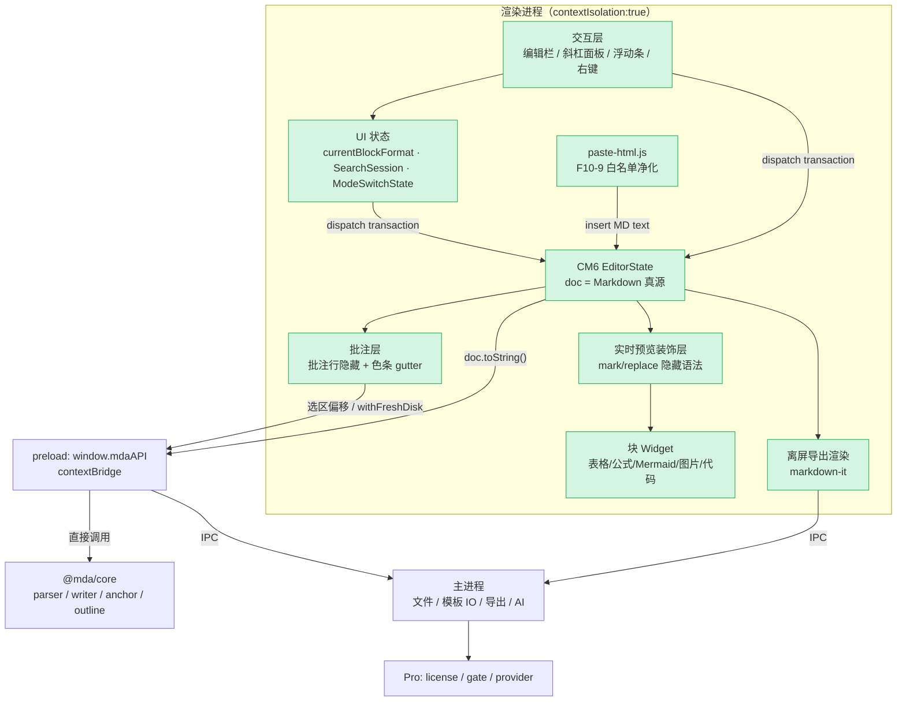

# 架构设计 — MDA 3.0 预览直接编辑（WYSIWYG）与源码模式

> 输入：[`P0-requirements-v3-wysiwyg.md`](P0-requirements-v3-wysiwyg.md)（**v1.10**，已确认；含裁决 D1–D15）
> 状态：**已确认**（2026-07-28；**v1.6** 对齐 D15 全程隐藏语法，2026-07-30）

### 用户裁决记录

**继承 P0**（D1–D15）：其中 **D12** 规定路线甲禁止额外序列化引擎；**D15** 规定预览编辑**全程隐藏语法**（竞品对齐），坐标质量为硬闸门。

**P1 补充裁决**（与 P0 编号独立）：

| # | 议题 | 裁决 |
|---|------|------|
| P1-D12 | 体验取舍（**已由 D15 废止长期方案**） | M8-A 曾接受「聚焦块显露语法」作原型验证；**自 2026-07-30 起不作为产品目标**。设置项 `mda-live-reveal` 保留供调试，**默认 `never`** |
| P1-D13 | 装饰层实施策略 | **以 CM6 官方扩展为基座，实时预览装饰层自研**，行为对齐开源实现（`codemirror-live-markdown` / `atomic-editor` 等），**不被 0.x 第三方包绑定** |
| P1-D15 | 语法隐藏与坐标 | **行内 hide-mark**：`Decoration.replace` 零宽 widget + `EditorView.atomicRanges`（**禁止** `font-size:0` / 透明占宽临时代码作为终态）。**块 widget**：启用前须过 **M8-B8 坐标闸门**（`samples/all-features.md` + 含表格/代码/Mermaid 的长文）。**调试**：`src/gui/renderer/editor/config.js`；`MDA_EDITOR_RELEASE=1` 发布构建关闭 HUD |

### 术语：P 阶段与 M 里程碑

| 系列 | 含义 | 本文涉及 |
|------|------|---------|
| P0–P4 | 工作流阶段（需求 → 架构 → 详设 → 计划 → **实现**） | 本文为 **P1**；编码与实机验收在 **P4** 执行 |
| M8-x | 3.0 WYSIWYG 的**交付里程碑**（任务粒度，在 P4 内排期） | **M8-A** = P4 首个硬闸门：可点原型交用户拍板 |

下文实现节奏一律用 **M8-x** 指代里程碑，不再使用「P4 Phase A」等混称。

## 版本历史

| 版本 | 时间 | 触发原因 | 综合置信度 | 关键变更 |
|------|------|---------|-----------|---------|
| v1 | 2026-07-28 | P1 架构设计完成 | 86% | 初始版本：推荐「源码即真源 + CodeMirror 6 装饰式实时预览」 |
| v1.1 | 2026-07-28 | 用户确认 | 86% | 写入裁决 D12（接受实时预览体验取舍）与 D13（装饰层自研、不绑 0.x 第三方包）；对抗审查 Q3 与低置信度处置同步收敛 |
| v1.2 | 2026-07-29 | 架构评审反馈 | 86% | 统一 M8-A 术语；澄清 K4 POC 对方案 A 的意义；K8 补充 tarball 体积实测；M8-D 自动保存策略、M8-E 格式化前置检查、IME 验收归属、预死亡 8、模块关键性列、打包注入方式 |
| v1.3 | 2026-07-29 | 对齐 P0 v1.6 | 86% | 继承 P0 D12 写回语义；A18 降为辅助证据；架构图增 UI 状态层；`SearchSession`/`currentBlockFormat`/粘贴白名单/模式切换状态；M8 任务与 H12–H14；预死亡 9–10 |
| v1.4 | 2026-07-29 | P1 通过附建议 | 86% | P2 交付要求细化（`currentBlockFormat` 观察者、SearchSession 规范、AI composition 规则）；附录嵌入 F10-9 白名单 |
| v1.5 | 2026-07-29 | P0 v1.7 F18 | 86% | 继承 D13；`ai-settings` 模型列表数据模型；`listModels`/`testModel` IPC；M8-G0 模型设置任务；H16 |
| v1.6 | 2026-07-30 | P0 D15 | 86% | P1-D12 废止；P1-D15 全程隐藏 + 坐标闸门；`editor/config.js`；默认 reveal=never |

---

## 1. 设计预调研

### 调研方法

| 方法 | 内容 |
|------|------|
| 代码全量调研 | 以 7 个问题系统排查现有实现：预览渲染管线、所有读写预览 DOM 的模块、dirty/保存状态机、批注隐藏机制、键盘处理、序列化能力、测试约束 |
| **运行时 POC** | `markdown-it` 的 `token.map` 块行范围（**辅助证据**：批注安全、格式化整篇等批量操作；**非**路线甲写回闸门，见 P0 D12） |
| 行业调研 | CodeMirror 6 实时预览生态现状（2026）、Tiptap `@tiptap/markdown` 往返保真的真实案例、Milkdown 定位 |
| 包体核算 | `npm view <pkg> dist.unpackedSize`（解压体积）+ `npm pack <pkg> --dry-run`（registry tarball ≈ gzip 传输体积）实测各候选依赖，对照 NF-18（≤15MB） |

### 关键发现

| # | 发现 | 证据 |
|---|------|------|
| K1 | 仓库**无全文 doc↔MD 序列化**；路线甲仅需 **F10-9 粘贴路径** HTML→MD（白名单见 P0 附表）；`html-to-docx` 只用于导出 | `package.json` 依赖清单；P0 D12 |
| K2 | 预览是渲染缓存而非文档模型：源码输入后每 250ms 用 `previewEl.innerHTML = ...` **全量替换**，与 `contenteditable` 根本互斥 | `app.js` `renderMarkdownContent` |
| K3 | 预览上的装饰层（批注色条、查找高亮、选区批注高亮、Mermaid 节点替换、代码块 gutter、图片缩放手柄）**全部假设 DOM 只读**，且每次重渲后重建 | `decorateParagraphs` / `updateFindPreviewHighlights` / `renderMermaidBlocks` / `ensureImageResizeChrome` |
| K4 | **POC 通过**：`token.map` 为每个 level-0 块给出 `[start, end)` 行范围，**互不重叠**；空行与批注行**不属于任何块**；清空批注行后块序列**完全不变** | 见下「POC 实测输出」 |
| K5 | **POC 也暴露三个坑**：①`bullet_list` 的范围**含尾随空行**而 `table` 不含（需归一化）②嵌套列表整体算**一个块**，改一项就要重写整列表（需块内保留未改动行）③无 front-matter 插件时 `---` 被解析成 `hr` + setext 标题（core 已在 `preprocessForRender` 清空，但块级重写必须避开该区域） | 同上 |
| K6 | ProseMirror/Tiptap 路线的往返风险**有生产实证**：某项目在 Tiptap + `@tiptap/markdown` 上被迫写 14 类修复（软换行、块间空行塌陷、表格分隔线、front matter 间距、CRLF 还原），并加「>70% 全文重写即拒绝」的保险；Tiptap 自身 2026 年仍在修「空行侵蚀」（重复 parse/serialize 每轮丢一个空行） | DesktopCommanderMCP commit `fc6b143`；tiptap PR #8008 / `@tiptap/core` 3.29.0 changelog |
| K7 | CodeMirror 6「实时预览」生态在 2026 已成熟且路线一致：**原始 Markdown 即真源，装饰仅改视图，往返逐字节等同纯文本框**；表格 / 公式 / 代码块 / 图片 / 任务复选框均有 widget 实践；光标所在行显示原始语法 | `@atomic-editor/editor`、`conql/codemirror-live-markdown`、`@yuya296/cm6-live-preview-core`（2026-01 发布）、`fedoup/markdown-editor` |
| K8 | 包体不是区分点（均远低于 NF-18 的 15MB）。**解压（unpacked）**：CM6 七个核心包合计 ≈ **2.77MB**；`@tiptap/core` + `@tiptap/markdown` ≈ **2.87MB**；`@milkdown/crepe` ≈ **3.33MB**。**传输（registry tarball，≈ gzip）**：CM6 合计 ≈ **704KB**；Tiptap 两包 ≈ **641KB**；Milkdown ≈ **719KB**。注：npm registry 不暴露 `dist.size` 字段，以 `npm pack --dry-run` 的 package size 作为 gzip 量级依据；实际分发按 minify + gzip 后的 bundle 计入，仍有余量 | `npm view` + `npm pack --dry-run` 实测（2026-07-29） |
| K9 | 渲染层目前**无打包步骤**（`copy-gui.js` 只是拷贝原生 `<script>`），而 CM6 / ProseMirror 均为 ESM 包且必须在渲染进程直接操作 DOM（`nodeIntegration:false` 下渲染层不能 `require`）→ **任一方案都必须新增 renderer 打包链** | `scripts/copy-gui.js`、`index.html`、`main.js` webPreferences |

### POC 实测输出（`token.map` 块 ↔ 源码行范围）

样本含 front matter、标题、批注行、段落、嵌套列表、GFM 表格、Mermaid 围栏、引用、`$$` 公式、内联 HTML、末段。实测结果：

```
hr               lines[0,1)     "---"
heading_open h2  lines[1,3)     "title: front matter\n---"     ← 无 front-matter 插件时的误判
heading_open h1  lines[4,5)     "# 标题一"
paragraph_open   lines[7,8)     "这是第一个段落，含 **粗体** 与 `code`。"
bullet_list_open lines[9,13)    "- 列表项 A\n  - 嵌套 A1\n- 列表项 B\n"  ← 含尾随空行
table_open       lines[13,16)   "| 列1 | 列2 |..."                      ← 不含尾随空行
fence            lines[17,21)   "```mermaid\ngraph TD\nA-->B\n```"
blockquote_open  lines[22,24)   "> 引用块\n> 第二行"
paragraph_open   lines[25,28)   "$$\nE = mc^2\n$$"
html_block       lines[29,30)   "<div class=\"raw\">内联 HTML 块</div>"
paragraph_open   lines[31,32)   "最后一个段落。"

重叠检查：无重叠
未被任何块覆盖的行：全部空行 + 批注行（第 6 行）
批注行归属的 level-0 块：无（→ 块级重写不会吞掉批注行）
局部重写模拟（只改第一个段落）：差异行数 = 1
清空批注行后块序列是否一致：true
```

**结论**：POC 证实批注行落在所有块范围之外、隐藏不改变块序列（`data-line` / 色条机制可延续）。**路线甲（已选）**：日常写回**不依赖**本 POC；D3/F10-7a 由 `doc.toString()` + CM6 transaction 满足（P0 写回语义表）。K5 三个坑仅针对方案 B/C/D 的块级写回路径。

**对方案 A 的直接意义**：①格式化整篇等批量操作可预测行结构；②批注共存安全性已运行时验证。K5 **不**约束方案 A 日常编辑。

### 核心场景代码路径

场景：**用户在预览区改一句话并保存**。

| 阶段 | 现状（2.0） | 目标（3.0，推荐方案） |
|------|-------------|----------------------|
| 输入 | 只能在 `#editor`（textarea）输入 | 在编辑面直接输入 → CM6 `transaction` 更新 `EditorState.doc` |
| 联动 | `input` → 防抖 250ms → `parseAndRender` → `previewEl.innerHTML` 全量替换 | 无重渲：装饰层按变更范围增量更新（`ViewPlugin.decorations`） |
| 脏标记 | `setDirtyState(editorEl.value !== currentText)` | `setDirtyState(view.state.doc.toString() !== currentText)` |
| 保存 | `writeToPath` 读 `editorEl.value` → `api.saveFile` → `core.writeRawFile`（原子写入 + `detectEol`） | 同一条链路，仅取值改为 `view.state.doc.toString()` |
| 结果 | 磁盘 diff = 用户改动 | **同上，且 diff 天然逐字符最小** |

**打包与注入（K9）**：`scripts/bundle-editor.js` 用 esbuild 将 CM6 + 装饰层打成 **IIFE 单文件**（`dist/gui/renderer/editor.bundle.js`），`index.html` 以原生 `<script src="editor.bundle.js">` 引入；`window.MDAEditor`（或同等命名空间）暴露 `mountEditor()` 供 `app.js` 调用。**不经 preload 桥加载编辑器**——preload 仍只负责 `mdaAPI` 与 core 调用；编辑器 DOM 操作留在渲染进程同页脚本内，满足 `nodeIntegration:false` + `contextIsolation:true` 约束。

### 跨模块通信链路

涉及渲染进程 / 主进程 / core 三方：

1. **正文编辑与保存**：renderer(CM6) → `window.mdaAPI.saveFile` → preload → `core.writeRawFile`（原子写入 + EOL 保留）
2. **批注读写**：renderer → `parseAnnotations`（preload 直调 core，纯函数）/ `addAnnotation|editAnnotation|removeAnnotation` → core writer（`verifySourceProtection`）
3. **模板 IO**（新增 F15）：renderer → IPC → main（仅读 `.md`、路径校验）→ 返回文本 → CM6 插入
4. **AI**（F14/F17）：renderer → IPC → main（`safeStorage` 取 Key + provider 流式）→ `ai-chunk` 事件回渲染层 → 装饰层以 ghost text / diff 呈现 → 用户采纳后才 dispatch transaction
5. **导出与复制**（改造）：renderer 用 markdown-it **离屏**渲染当前文本 → Mermaid/KaTeX→PNG → `copyArticleHtml` / `export-pdf` / `export-docx` IPC
6. **粘贴 HTML**（F10-9）：renderer 内 `paste-html.js` 按 P0 最小白名单净化 → dispatch CM6 transaction 插入 Markdown 文本（**非**序列化引擎）
7. **批注先保存**（D5/AC-19）：`withFreshDisk` 保存锁 → 单飞 `writeRawFile` → 排队批注写入 core writer

### 与 P0 写回语义的对齐（路线甲）

| P0 条目 | 本架构实现 | P2 **禁止** |
|---------|-----------|------------|
| F10-7 / AC-10 | `doc.toString()` + `writeRawFile`；往返保真单测 = 打开→不保存编辑→保存零语义 diff | 独立 `serialize()` 层 |
| F10-7a / AC-7 / AC-18 | CM6 transaction 自然最小 diff | 块映射写回、`token.map` diff 算法 |
| F10-7b / AC-28 | 单次 transaction 或快照回填；行为级撤销验收 | — |
| D5 / AC-19 | `saveInFlight` 互斥 + 批注队列 | 并发 `writeRawFile` |

---

## 2. 方案对比

| 维度 | **方案 A：CM6 装饰式实时预览**（源码即真源） | 方案 B：Tiptap / ProseMirror + Markdown 序列化 | 方案 C：Milkdown（PM + remark） | 方案 D：自研块级 contenteditable |
|------|---------------------------------------------|-----------------------------------------------|--------------------------------|----------------------------------|
| 核心思路 | 文档模型**就是 Markdown 文本**；用 `Decoration.mark/replace/widget` 把语法标记隐藏、内容样式化、表格/公式/图/流程图替换为渲染 widget；光标所在块显示原始语法 | 文档模型为 ProseMirror doc（富结构）；打开时 MD→doc，保存时 doc→MD | 同 B，但用官方 remark 桥做 MD 往返，开箱即用 | 用 `token.map` 把文档切块，块渲染为 HTML，聚焦块切换为块内源码编辑器 |
| 优点 | 往返**逐字节无损**（模型即源码）；diff 天然最小；undo/redo 由 CM6 提供；批注 anchor 直接是文本偏移；双模式=同一实例两套装饰；视口渲染性能好；IME/无障碍由 CM6 兜底 | 真正的所见即所得（表格、列表拖拽等交互最自然）；生态与插件丰富；AI 富交互成熟 | 上手最快，MD 往返有官方桥 | 无重依赖；复用现有 markdown-it 渲染 |
| 缺点 | 光标所在块会显示原始语法（Obsidian 式），不是 WPS 式全程隐藏；表格等复杂块需自建 widget；「所见即所得」程度弱于 B | **MD 往返有损**，需自建修复层；富结构 → Markdown 的规范化不可避免；批注 anchor 需从 doc 位置反算源码偏移 | 序列化为**全文 remark-stringify**，与 D3「仅改动块」正面冲突；定制自由度低于 B | 需自研 undo 栈、选区、IME、块合并/拆分；等于自己造编辑器内核 |
| 风险 | 用户体验预期落差（见对抗审查 Q1）；装饰层需自研且要处理 composition 冻结 | **有生产实证的文件被静默改写风险**（K6）；修复层长期维护成本高 | 与 D3 冲突需额外造块级 diff，反而更复杂 | 最高：IME/光标/undo 三大坑，历史上无成功轻量先例 |
| 改动量 | 中高：新增编辑面 + 装饰层 + widget；**净退役** sync-scroll / 预览选区映射 / 预览 find 高亮等约 1000 行 | 高：编辑面 + schema + 序列化 + 修复层 + anchor 反算 | 中高 | 极高 |
| 与 D1（互斥双模式） | ✅ 同一 CM6 实例切换装饰配置，内容零风险 | ⚠️ 两套模型需同步 | ⚠️ 同 B | ⚠️ 需自建 |
| 与 D3（仅改动块） | ✅ **超额满足**（逐字符最小 diff） | ❌ 需修复层 + 阈值保险 | ❌ 天然全文规范化 | ⚠️ 块级，仍需块内保留 |
| 与 D4（富块源码微编辑） | ✅ 光标进入 widget 即显源码，天然 | ⚠️ 需自定义 node view | ⚠️ 同 B | ✅ 天然 |
| 与批注 anchor（F13-3） | ✅ `state.selection` 即源码 UTF-16 偏移 | ❌ 需 doc↔源码位置映射（当前最脆弱环节的加强版） | ❌ 同 B | ⚠️ 需块内偏移换算 |
| 包体（unpacked） | ≈2.6MB | ≈2.9MB（+修复层代码） | ≈3.3MB | ≈0 |

### 推荐方案

**推荐方案 A（CodeMirror 6 装饰式实时预览，源码即真源）。**

理由按重要性排序：

1. **它把本项目最大的风险直接消灭**。P0 头号风险是「写回产生非预期 diff」。路线甲下文档模型就是 Markdown 文本，保存 = `doc.toString()`，**不存在序列化管线**（P0 D12）；D3 由 transaction 天然满足。方案 B 仍有 K6 生产实证风险。
2. **它让批注体系变简单而不是变复杂**。批注 anchor 本就是源码 UTF-16 偏移，CM6 的 `doc` 就是源码，选区批注直接取 `state.selection` 即可；现有 `selection-anchor.js` 中「预览 DOM → 源码偏移」那套最脆弱的映射（含围栏区域特判）可以退役。方案 B/C 则要新增「PM 位置 → 源码偏移」的反算，比现状更难。
3. **双模式几乎零成本**。D1 要求互斥切换，方案 A 下「源码模式」= 关掉装饰的同一个 CM6 实例（一个 compartment 切换），AC-12 由共享 `EditorState` + `ModeSwitchState`（光标/首可见行）保证。
4. **现有能力大面积复用或净退役**。大纲仍用 `extractHeadings`；查找替换迁入 CM6 + **跨模式 `SearchSession`**（F12-2）；`sync-scroll`、预览选区映射、预览 find 高亮退役。
5. **性能与输入法有保障**。CM6 只渲染视口、`@lezer/markdown` 增量解析，NF-10（10 万字符 P95 ≤80ms）达标概率高；中文输入法的 composition 处理由 CM6 承担，不必自己踩坑。
6. **AI 体验反而更好**。伴写可以做成 Copilot 式行内灰字（`Decoration.widget` ghost text），采纳/拒绝用装饰做 inline diff —— 这正是 CM6 的强项，也正好回应 P0 对抗自检里「伴写被期待成灰字建议」的落差。

**必须让用户知晓的取舍**：方案 A 是 Obsidian「实时预览」而非 WPS 式全程所见即所得 —— **光标所在的那一块会显示原始 Markdown 语法**，移开光标即恢复渲染。缓解措施：

- 把最不像成品的部分全部 widget 化：**表格**（点单元格就地编辑）、**KaTeX 公式**、**Mermaid 流程图**、**图片**、**任务复选框**、**代码块**（带高亮与复制），这些块在非聚焦时与现在的预览观感一致；
- reveal 粒度做成**块级**而非行级（光标在段落内时只显露该块），并把「显露范围」做成设置项（`块` / `邻近行` / `从不`）；
- 常驻编辑栏（F11-6）、`/` 面板（F11-2）、浮动工具条（F11-3）、右键菜单（F11-4）照 P0 全部实现，鼠标路径与竞品一致，用户不必接触语法；
- **M8-A 先交付可点原型**给用户实机拍板，通过后才继续 M8-B 及后续里程碑（避免走到一半才发现体验预期不符）。

**明确不采用**：方案 B/C 的富结构模型（往返有损与 D3 冲突）、方案 D 的自研内核（工期与 IME/undo 风险不可接受）。若 M8-A 原型被用户否决（要求全程隐藏语法），退路见「低置信度环节处置」。

---

## 3. 推荐方案详述

### 3.0 方案架构图



节点 12 个（≤12），绿色为新增/重构。`uistate` 为 P2 必交付的共享状态层（AC-12 / AC-21 / F12-2）；**无**序列化子图（P0 D12）。

### 3.1 模块影响分析

| 模块 | 关键性 | 改动类型 | 影响说明 | 改动量预估 |
|------|--------|---------|---------|-----------|
| `scripts/bundle-editor.js`（新） | 核心 | 新增 | 用 esbuild 把 CM6 及装饰层打成单文件 IIFE 注入 `dist/gui/renderer/`（K9：渲染层不能 `require`，必须打包） | ~80 行 + devDep |
| `scripts/copy-gui.js` | 配套 | 修改 | 构建顺序接入打包产物；`build` = `build:ts` → `build:editor` → `build:gui` | ~20 行 |
| `src/gui/renderer/editor/*`（新） | 核心 | 新增 | CM6 挂载、双模式 compartment、装饰层、块 widget、ghost text、**`currentBlockFormat`**（AC-21）、**`ModeSwitchState`**（AC-12）、**`paste-html.js`**（F10-9 白名单） | ~2000 行 |
| `src/gui/renderer/app.js` | 核心 | 大幅重构 | 编辑面替换 textarea；dirty/保存 `doc.toString()`；**`withFreshDisk` 保存锁**（AC-19）；预览装饰迁入或退役 | −1200 / +650 行 |
| `src/gui/renderer/sync-scroll.js` | 退役 | **退役** | 双栏同步滚动/双向定位在单编辑面下不再需要 | −360 行 |
| `src/gui/renderer/selection-anchor.js` | 配套 | 大幅简化 | 预览 DOM → 偏移映射退役，仅保留围栏语义相关工具；选区改取 `state.selection` | −250 行 |
| `src/gui/renderer/find-replace.js` | 配套 | 重写为薄封装 | 复用 `@codemirror/search`；抽出 **`SearchSession`**（F12-2：跨模式共享搜索词/索引/选项，高亮随模式迁移） | −200 / +180 行 |
| `src/gui/renderer/anchor-highlights.js` | 配套 | 重写 | CSS Highlight API → CM6 `Decoration.mark`（更稳、不改 DOM 结构） | −120 / +90 行 |
| `src/gui/renderer/outline-panel.js` | 配套 | 小改 + 扩展 | 跳转改用 CM6 `scrollIntoView`；新增「要点」tab 承载 F17 AI 总结 | +180 行 |
| `src/gui/renderer/editor-assist.js` | 配套 | 迁移 | Markdown 包裹/标题/列表快捷键改为 CM6 keymap（语义与测试保留） | −150 / +180 行 |
| 导出与复制预览（`app.js` 内） | 配套 | 改造 | `buildArticleClipboardContent` / `buildExportHtmlContent` 从「克隆屏上 `#preview-content`」改为「markdown-it **离屏**渲染当前文本」，Mermaid/KaTeX→PNG 流程复用 | ~300 行 |
| `src/gui/renderer/settings-ai.js` | 配套 | 大幅扩展 | M7 单字段 model → **Cherry Studio 式模型列表**（F18）：启停 toggle、添加、获取列表、检测；Provider 级开关 | +200 行 |
| `src/pro/ai/settings.js` | 核心 | 扩展 | `models[]` 持久化、默认模型、启用状态、从旧 `model` 字段迁移；`listRemoteModels` / `testModel` 编排 | +120 行 |
| `src/pro/ai/provider.js` | 核心 | 扩展 | 新增 `GET /v1/models`；`testChat` 最小探测请求；错误脱敏沿用 | +80 行 |
| `src/gui/preload.js` | 核心 | 扩展 | 新增模板 IO、AI 总结、**`fetchAiModels` / `testAiModel`**、（保留）批注与渲染桥 | +150 行 |
| `src/gui/main.js` + `main/*` | 配套 | 扩展 | 模板目录读取、菜单与模式项、AI 总结 IPC、**模型列表/检测 IPC** | +300 行 |
| `src/gui/main/i18n.js`、`renderer/i18n.js` | 配套 | 扩展 | 新增编辑栏/面板/模板/侧栏/提示文案，zh + en 同步（NF-14） | +300 行 |
| `src/core/**` | 核心 | **不改** | parser / writer / anchor / outline / renderer 全部沿用；分层纯净不破（P0 接口契约「不变更」） | 0 |
| `tests/**` | 配套 | 扩展 | 装饰纯函数单测；**往返保真**（AC-10）与最小 diff（AC-7/18）；**粘贴白名单**（AC-17b）；**模型设置**（AC-31–34）；**不建**独立序列化引擎单测层（P0 D12） | +750 行 |
| `AGENTS.md` | 配套 | 必改 | §9 隐性规范 4e「dirty 时禁用批注」按 D5 改为「先保存后批注」；新增 CM6 装饰层相关规范 | ~80 行 |

### 3.2 任务拆分初稿

| 任务 | 依赖 | 可并行 | 涉及模块 |
|------|------|--------|---------|
| **M8-A 编辑器基座与打包**（esbuild、CM6 挂载、双模式 compartment、`SearchSession` 骨架、`ModeSwitchState` 骨架、BOM/EOL、dirty/保存、`writeRawFile`）+ **可点原型拍板** | 无 | 否 | `scripts/`, `renderer/editor/`, `app.js`, `find-replace.js` |
| M8-B 实时预览装饰层（S1–S12、reveal、composition 冻结） | A | 是（与 C 并行） | `renderer/editor/` |
| M8-C 块 Widget（表格/代码/公式/Mermaid/图片） | A | 是（与 B 并行） | `renderer/editor/` |
| M8-D 批注共存（隐藏装饰、gutter、选区偏移、**`withFreshDisk` 保存锁+排队**（AC-19）、toast、坏批注容错） | A, B | 否 | `renderer/editor/`, `app.js`, `preload.js` |
| M8-E 交互层（编辑栏/`/`/浮动条/右键、**`currentBlockFormat` 双向同步**（AC-21）、**`paste-html.js`**（F10-9）、格式化整篇（F10-7b/AC-28）、i18n） | B, C | 是（与 F 并行） | `renderer/editor/`, `i18n.js` |
| M8-F 文档态（新建空态、模板库主进程 IO、自定义模板目录、默认模式与记忆、只读/超大降级、外部改动） | A | 是（与 E 并行） | `main/`, `preload.js`, `app.js` |
| M8-G0 **AI 模型设置**（F18：`models[]` 迁移、列表 UI、获取/添加/启停/检测、Provider 开关；**先于或并行 G1**） | A（打包链） | 是（与 F 并行） | `pro/ai/settings.js`, `settings-ai.js`, `provider.js` |
| M8-G Pro AI（入口迁移、伴写 ghost text、diff 采纳、总结侧栏；**composition 期间冻结 ghost/diff**，采纳前 flush composition（H15）；**依赖 G0 默认模型可用**） | E, **G0** | 否 | `renderer/editor/`, `pro/`, `main.js` |
| M8-H 导出与复制离屏化（markdown-it 离屏渲染 + Mermaid/KaTeX→PNG 复用 + 公众号复制回归） | A | 是（与 D/E/F 并行） | `app.js`, `main.js` |
| M8-I 退役与清理（sync-scroll、预览选区映射、旧 textarea、`find-replace` 迁入 `SearchSession`） | B, C, D, E | 否 | `renderer/*` |
| M8-J 测试与文档（装饰单测、**往返保真 AC-10**、最小 diff、粘贴白名单 AC-17b、**模型设置 AC-31–34**、`AGENTS.md`、`M8-acceptance-checklist.md`；**无序列化引擎单测**） | 全部 | 否 | `tests/`, 文档 |

关键路径：**A → (B∥C) → D → E → (G0∥F) → G → I → J**；H 可全程并行。A 阶段的原型拍板是唯一的「方向性闸门」。

---

## 4. 关键技术假设

| # | 假设内容 | 证据类型 | 证据详情 | 置信度 |
|---|---------|---------|---------|-------|
| H1 | 以 Markdown 文本为唯一模型 + 装饰渲染，可实现往返保真（AC-10）与最小 diff（AC-7） | POC + 行业共识 | CM6「装饰不改 doc」；K4 辅助证明批注安全；**非**序列化往返（P0 D12） | 93% |
| H2 | 富结构模型（PM/Tiptap）路线的 Markdown 往返会静默改写用户文件，需长期维护修复层 | 文档链接 + 运行时验证（他方） | DesktopCommanderMCP `fc6b143` 记录 14 类修复与 >70% 全文重写保险；tiptap PR #8008 修「空行侵蚀」（K6） | 90% |
| H3 | 渲染层必须新增打包步骤才能使用 CM6（渲染进程无法 `require`） | 源码确认 | `main.js` `nodeIntegration:false` + `contextIsolation:true`；`copy-gui.js` 仅拷贝；`index.html` 用原生 `<script>`（K9） | 96% |
| H4 | CM6 的视口渲染 + 增量解析可满足 NF-10（10 万字符，按键 P95 ≤80ms） | 行业共识 | CM6 官方设计即为大文档；Obsidian 等以此承载十万字级笔记；本项目尚未实测 | 78% |
| H5 | 选区批注可直接取 `state.selection` 作为源码 UTF-16 偏移，无需 DOM 映射 | 源码确认 | 现有 `AnnotationAnchor` 定义即源码 UTF-16 `start/end` + `quote`；CM6 `doc` 即源码文本 | 92% |
| H6 | 批注行可用 `Decoration.replace` 整行隐藏，且不破坏偏移语义（偏移始终基于真实文本） | 行业共识 + 源码确认 | CM6 装饰不改 `doc`，仅改视图；现有 `ANNO_REGEX` / `ANNO_ISH` 识别可复用 | 88% |
| H7 | 表格 / 公式 / Mermaid / 图片 / 代码块可用 widget 达到「非聚焦时与现预览观感一致」 | 文档链接 | `codemirror-live-markdown` 已含 table/math/code/image widget 与可编辑表格；`atomic-editor` 有 WYSIWYG 表格 | 80% |
| H8 | 导出 / 公众号复制改为 markdown-it 离屏渲染后行为不变 | 源码确认 | 现有实现已是「克隆 DOM 到离屏容器再处理」，只是数据来源从屏上 DOM 换成离屏渲染结果；Mermaid/KaTeX→PNG 流程不动 | 82% |
| H9 | 脏状态下批注可通过「先自动保存」满足 core 前提；连续批注须保存锁排队（AC-19） | 源码确认 + P0 裁决 D5 | `withFreshDisk`：`saveInFlight` 互斥 → `writeRawFile` → 队列写 `@anno`；失败清空队列 | 90% |
| H10 | 中文输入法（composition）与装饰共存无致命冲突 | 行业共识 | CM6 原生处理 composition；composition 期间冻结装饰重建 | 75% |
| H11 | 「格式化整篇」撤销可一次性恢复全文（AC-28 行为级） | 行业共识 | CM6 单次 transaction 首选；否则快照回填；见预死亡 8 | 84% |
| H12 | 跨模式 **`SearchSession`** 可在 compartment 切换时保留搜索状态并迁移高亮 | 设计约束 | P0 F12-2；同一 CM6 实例 + 共享 session 对象 | 85% |
| H13 | **`currentBlockFormat`** 可使编辑栏与浮动条段落级别双向同步（AC-21） | 设计约束 | 由 `EditorState` + 语法树/lezer 块类型派生，单一订阅源 | 82% |
| H14 | **F10-9 粘贴白名单**可在 renderer 内纯函数实现，无需序列化引擎 | P0 附表 + 设计 | `paste-html.js` 剥离禁止标签/属性后 dispatch 文本 transaction | 88% |
| H15 | **伴写 ghost text** 在 composition 期间不渲染；采纳前须 flush composition | 设计约束 + IME 经验 | P0 F14-2 不保证 Copilot 灰字；composition 与装饰冻结策略须扩展至 AI 装饰层 | 80% |
| H16 | 目标 Provider 支持 OpenAI 兼容 **`GET /v1/models`**；不支持时用户仍可手动添加 + 检测 | 行业共识 | OpenAI / DeepSeek / 多数代理均支持；CodingPlan 等变体端点 P2 须做 URL 拼接规则 | 82% |

---

## 5. 预死亡分析（Pre-mortem）

假设方案上线后失败，最可能的原因：

| # | 原因 | 可能性 | 缓解措施 |
|---|------|--------|---------|
| 1 | **点击/光标与视觉不一致**（坐标闸门未过） | 高 | ①M8-B8 硬闸门：红蓝绿诊断点重合、HUD Δ≤2px；②行内 `atomicRanges`；③块 widget 测高后再开 `blockWidgets`；④`lineWrapping` 与 CM 一致 |
| 2 | **渲染层引入打包链后开发调试与交付复杂化** | 中 | 打包只针对 `renderer/editor/`；`watch:editor` + sourcemap；**`editor/config.js`** 统一调试开关；`MDA_EDITOR_RELEASE=1` 发布关 HUD |
| 3 | **导出与公众号复制回归** —— 离屏化后 Mermaid/KaTeX 图片、样式内联、图片 base64 出现差异，而公众号复制是已交付卖点 | 中 | M8-H 独立阶段并保留旧路径开关；以 `samples/all-features.md` 做前后对照人工验收；离屏容器沿用同一套 CSS |
| 4 | **表格 widget 的编辑体验不过关** —— 就地编辑单元格与源码同步出错，或宽表格/合并需求暴露 | 中 | 表格 widget 以「行级替换」保持源码为真源；不支持合并单元格（P0 已排除）；退路是表格块退化为「聚焦即显源码」的普通块 |
| 5 | **app.js 重构面过大导致长期半成品** —— 5000+ 行文件同时承载新旧两套编辑面 | 中 | 新编辑面作为独立模块 + 功能开关；旧 textarea 保留为 fallback 直到 M8-I 验收通过才下线；每 M8 里程碑必须实机通过才推进（工作流硬约束） |
| 6 | **中文输入法在装饰边界处丢字或光标跳动** | 中低 | composition 期间冻结装饰重建；IME 验收自 **M8-A** 起纳入每里程碑固定项（含自动化 composition 冒烟）；**M8-B 硬出口**：连续输入 500 字中文无丢字、无光标偏移。历史教训：2.0 textarea 高亮层因未关闭连字 / CJK 回退字体不一致导致光标错位（`AGENTS.md` §9 4f） |
| 7 | **性能不达 NF-10** —— 大量 Mermaid/公式 widget 导致滚动卡顿 | 中低 | widget 惰性渲染（仅视口内）+ 结果缓存；Mermaid 渲染排队；以 10 万字符样本压测作为 M8-C 出口条件 |
| 8 | **「格式化整篇」误触后撤销体验差** | 中低 | AC-28 行为级验收；dirty 先保存/确认；快照兜底（H11） |
| 9 | **P2 误建序列化/块映射层**（P0 D12） | 中 | 本文写回语义表 + M8-J 不测序列化；格式化整篇可用 remark-stringify **仅此一处**且结果仍经 transaction 写入 doc |
| 10 | **批注自动保存并发竞速** | 中 | `withFreshDisk` 保存锁（H9）；AC-19 失败清空队列 |
| 11 | **中文 IME 与 AI ghost text 冲突** | 中低 | composition 期间不渲染 ghost text；采纳前 flush composition（H15）；M8-G 实机验收 |
| 12 | **Provider 不支持 `GET /v1/models`** | 中 | H16；获取失败时保留手动添加；检测仍可用；错误脱敏 |

---

## 6. 对抗审查结论

| # | 审查问题 | 结论 |
|---|---------|------|
| 1 | 哪些结论是基于「推测」而非「验证」的？ | 已验证：`token.map` 块行范围与批注行安全性（本文 POC，对方案 A 为批注共存与可选批量操作的辅助证据，非日常编辑依赖）、渲染层不能 `require`（源码）、包体（npm 实测含 tarball）、Tiptap 往返风险（他方生产实证）。**仍属推测**：CM6 在本项目 10 万字符下的实际性能（H4，78%）、widget 化后的观感能否让用户接受（H7 + 预死亡 1）、IME 边界（H10，75%）。性能与观感由 M8-A/C 出口条件兜住；IME 自 M8-A 起每里程碑验收、M8-B 硬出口；原型拍板放在最前。 |
| 2 | 什么场景下这个方案会完全失效？ | ①用户坚持「任何时候都不能看到 Markdown 语法」——那 A 路线在原理上就不满足（光标处必须暴露源码才能编辑文本模型），只能回退方案 B 并接受往返修复层与 D3 妥协；②需求扩展到「表格合并单元格、分栏、多维表格」等富结构（P0 已排除，若拉回则 B 更合适）；③要求实时协同编辑（CRDT 在 PM/Yjs 生态更成熟；本项目 3.0 明确单文件无协同）。 |
| 3 | 改动量最大 / 风险最高的任务，有没有更简单替代？ | 最大是 M8-B/C（装饰 + widget）。**禁止**用「加序列化层」简化写回（P0 D12）。开源实时预览包已被 P1-D13 否决。 |
| 4 | 总置信度打 5 折，最该怀疑的环节？ | **用户对「实时预览」体验的接受度**（预死亡 1）。技术上方案 A 明显更安全，但产品预期来自 WPS 式全程隐藏语法的截图。因此 M8-A 的原型拍板不是可选项而是硬闸门；若被否，宁可在 P1 阶段回头改选 B，也不要带着预期落差做完 M8-J 全部里程碑。 |

---

## 7. 综合置信度评估

| 评估维度 | 置信度 | 说明 |
|---------|--------|------|
| 技术可行性 | 90% | 核心机制有 POC 与成熟生态双重支撑；唯一真源 + 原子写入链路不变；core 零改动 |
| 方案完整性 | 86% | P0 的 F10–F17 均有对应模块与任务；导出/复制、退役清理、i18n、测试均已列入；widget 细节与 reveal 策略留给 P2 |
| 风险可控性 | 82% | 最大风险（体验预期）已用「原型先行 + 硬闸门」处置；其余以 M8 里程碑出口条件 + 功能开关 + 旧路径并存兜底 |
| **综合** | **86%** | ≥80%，可进入 P2 详细设计 |

### 低置信度环节处置

| 环节 | 置信度 | 处置 |
|------|--------|------|
| 体验预期落差（预死亡 1） | — | **M8-A 交付可点原型请用户实机拍板**，通过才继续 B/C；否决则回到 P1 改选方案 B（并同步调整 D3：接受修复层 + 全文重写阈值保险） |
| CM6 性能（H4，78%） | 78% | M8-A 出口条件：用 10 万字符样本实测按键延迟 P95，未达标则关闭部分 widget 或引入 reveal 降级 |
| IME/composition（H10，75%） | 75% | **M8-A** 起：composition 冻结逻辑落地 + 自动化冒烟（起止/取消 composition 不崩）；**每里程碑**固定人工验收；**M8-B 硬出口**：连续输入 500 字中文无丢字、无光标偏移（装饰层与 widget 叠加后的真实场景） |
| widget 观感（H7，80%） | 80% | M8-C 出口条件：与现有预览逐块对照截图；表格退路为「聚焦即显源码」 |
| 第三方实时预览包的许可证与可控性 | — | 已由 **P1-D13** 处置：装饰层自研；P2 参考实现清单即可 |

---

## Spec Self-Review

- [x] 无占位符（无 TODO / TBD / 待定）
- [x] 无内部矛盾：路线甲写回与 P0 D12 / 写回语义表一致；**禁止** P2 序列化引擎
- [x] 无歧义描述：推荐方案唯一（A），退路明确（改选 B 须回 P0 修订 D3）
- [x] 范围边界清晰：不做富结构模型、不做协同、不做表格合并；Milkdown/自研内核不采用
- [x] 接口契约完整：core 零改动；保存 `writeRawFile`；批注 `verifySourceProtection`；preload 无序列化 API
- [x] 所有假设标注证据类型与置信度（H1–H16）
- [x] Mermaid 图 12 节点（≤12）

---

## 确认状态

状态: **已确认**（2026-07-28；v1.4 P1 通过附建议，2026-07-29）

裁决 P1-D12–D13 已写入正文；继承 P0 D1–D12（含写回语义）。进入 P2 详细设计。

### P2 必须交付（清单）

**基础**

- 装饰规则表与 Markdown 语法白名单（F10-2~4）
- 双模式状态机 + **`ModeSwitchState`**（AC-12：首可见行 ≤5 行、光标段落）
- 批注 `withFreshDisk` 算法（F13-4 / AC-19）
- 常驻编辑栏 / `/` 面板 / 浮动条 / 右键菜单规格
- 内置模板正文、降级阈值、边界用例 E 编号续接
- **禁止**：独立序列化引擎、块映射写回层（P0 D12）

**`currentBlockFormat`（AC-21）**

- P2 须提供**订阅/观察者模式**设计：单一源状态（由 `EditorState` + 块类型派生），编辑栏段落下拉与浮动工具条（F11-3）均为订阅者
- 任一方触发格式变更后，另一方须在 **100ms 内**同步 UI 状态
- 须提供**自动化测试**：编辑栏改 H2 → 浮动条反映；浮动条改 H3 → 编辑栏反映

**`SearchSession`（F12-2）**

P2 须明确行为规范（不得留空），至少包含：

| 维度 | 须定稿内容 |
|------|-----------|
| **状态保留项** | 搜索词、大小写敏感、正则开关（若有）、当前匹配索引、匹配总数 |
| **模式切换迁移** | 切换预览↔源码时上述状态**保留**；高亮装饰迁移到当前编辑面（同一 CM6 实例） |
| **高亮策略** | 普通文本：`Decoration.mark`；**widget 内文本**（表格单元格、代码围栏内）：须说明是否/如何高亮（默认：仅源码可见部分高亮，widget 外壳不高亮） |
| **滚动策略** | 显式二选一并在规格中写明：①「查找下一个」时 `scrollIntoView` 当前匹配；②切换模式时不自动滚动（仅迁移高亮）。**推荐 ①** |

**粘贴 HTML（F10-9 / AC-17b）**

- 实现须**完整遵循**本文 [附录 A · F10-9 粘贴白名单](#附录-a--f10-9-粘贴-html-最小白名单)（等同 P0 v1.6）
- [`M8-acceptance-checklist.md`](M8-acceptance-checklist.md) 须列出关键粘贴场景（见该文档「粘贴场景」节）

**Pro AI · composition 互斥（F14 / M8-G）**

- **规则**：用户处于 **composition**（中文 IME 组字）期间，**不得**渲染伴写 ghost text；须等待 `compositionend` 后再显示
- **采纳**：用户点击「采纳」时若仍有 pending composition，须**先 flush composition**（提交组字到 doc），再 dispatch 采纳的文本变更
- 续写/润色等 **inline diff** 装饰亦遵循同一冻结策略（composition 期间不更新 AI 装饰）

---

## 附录 A · F10-9 粘贴 HTML 最小白名单

> 与 [`P0-requirements-v3-wysiwyg.md`](P0-requirements-v3-wysiwyg.md) F10-9 附表**逐字一致**；P2 可扩展但不得弱于本表。测试基准：AC-17b、`tests/gui/editor/paste-html.test.ts`（P2 创建）。

| 类别 | 允许的标签 / 结构 | 禁止 |
|------|-------------------|------|
| 文本格式 | `b`, `strong`, `i`, `em`, `u`, `s`, `del`, `code`, `pre` | — |
| 链接 | `a[href]`（仅 `href`；`title` 可选） | `javascript:` 等危险协议 |
| 列表 | `ul`, `ol`, `li` | — |
| 表格 | `table`, `thead`, `tbody`, `tr`, `th`, `td` | `colspan`/`rowspan`（3.0 不支持合并） |
| 块与换行 | `p`, `div`, `br`, `h1`–`h6`, `blockquote` | — |
| 全局禁止 | — | `script`, `style`, `iframe`, `object`, `embed`, `form`, `input` 及一切**事件属性**（`onclick` 等）、**`class` / `id` / `style` 属性**（剥离后转 MD，不保留） |

**关键验收场景**（须在 M8 清单中勾选）：

| # | 来源 | 预期 |
|---|------|------|
| P1 | VS Code 复制带语法高亮的代码片段 | 转为围栏代码块或行内 `` `code` ``，无 HTML/span 残留 |
| P2 | Google Docs 复制表格 | 转为 GFM 表格，单元格文本保留，无 `colspan` |
| P3 | 网页复制含链接与图片的段落 | 链接 → `[text](url)`；图片 → `` 或纯文本 fallback（`` 无安全 src 时降级为 alt 文本） |
| P4 | 含 `onclick` / `<script>` 的 HTML | 危险标签与属性剥离，不执行脚本 |
| P5 | `Ctrl+Shift+V` | 始终纯文本，不走 HTML 管线 |

