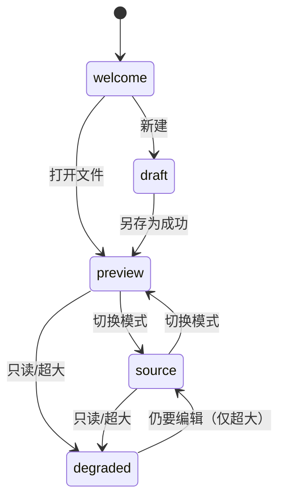

# 详细设计 — MDA 3.0 预览直接编辑（WYSIWYG）与源码模式

> 输入：[`P1-architecture-v3-wysiwyg.md`](P1-architecture-v3-wysiwyg.md)（**v1.6**，已确认；含 P1-D15）
> 需求：[`P0-requirements-v3-wysiwyg.md`](P0-requirements-v3-wysiwyg.md)（**v1.10**；F10–F18 / D15）
> 状态：**已确认**（2026-07-28；**v1.4** D15 语法隐藏与坐标闸门，2026-07-30）

### 用户裁决记录（2026-07-28）

| # | 议题 | 裁决 |
|---|------|------|
| D14 | 组件化节奏 | **只把表格拆两轮**：第一轮表格按「聚焦即显源码」跑通功能，第二轮再做就地编辑的表格组件；代码块 / 行内与块公式 / Mermaid / 图片**一次做到组件化**。风险集中在表格并单独设闸门 |

## 版本历史

| 版本 | 时间 | 触发原因 | 综合置信度 | 关键变更 |
|------|------|---------|-----------|---------|
| v1 | 2026-07-28 | P2 详细设计完成 | 85% | 初始版本：语法白名单与装饰规则表、双模式状态机、8 组核心算法伪代码、GUI 四入口规格、14 模板骨架、边界用例 E49–E86、测试设计 |
| v1.1 | 2026-07-29 | P0 v1.7 D13/F18 | 85% | §5.9 AI 模型设置（Cherry Studio 式）；数据模型；IPC；AC-31–34 边界用例 |
| v1.2 | 2026-07-29 | 竞品截图沉淀 | 85% | §5.10 WPS 竞品交互风格（工具栏/widget/AI）；[`competitor-product/README.md`](competitor-product/README.md) |
| v1.3 | 2026-07-29 | P0 D14 媒体交互 | 85% | §5.10.9 图片/流程图单击选中、双击全屏；2.0→3.0 手势变更；AC-35 |
| v1.4 | 2026-07-30 | P0 D15 全程隐藏语法 | 85% | §4.1.1 hide-mark 终态 + atomicRanges；§4.9 开发配置；默认 reveal=never；M8-B8 坐标闸门 |
| v1.5 | 2026-09-22 | 阶段模板 v2 拆分 | 85% | §6 内置模板 14→15：T5–T7 骨架对齐 requirement/design/dev-plan v2.0；新增 T15 `detailed-design`（P2） |

---

## 1. 本文件定稿的内容

P1 遗留给 P2 的项目全部在此定稿，不再留悬念：

| 编号 | P1/P0 遗留项 | 本文件章节 |
|------|--------------|-----------|
| 1 | 语法白名单边界（支持 / 只读 / 不支持） | §2 |
| 2 | 双模式状态机与切换保真 | §3 |
| 3 | 装饰构建、reveal 判定、批注隐藏、anchor 计算、先保存后批注、格式化整篇、EOL/BOM、色条更新 | §4 |
| 4 | 常驻编辑栏 / `/` 面板 / 浮动条 / 右键菜单 / 快捷键路由 / AI 交互 / 空态 | §5 |
| 5 | 14 个内置模板骨架（正文文件在 P4 M8-F 落地） | §6 |
| 6 | 只读与超大文件降级阈值 | §5.8 |
| 7 | 伴写触发时机 | §5.6 |
| 8 | 边界用例 E 编号续接（现有已用至 E48，本文件从 **E49** 起） | §7 |
| 9 | 验证测试设计 | §8 |
| 10 | 参考实现对齐点（D13：自研但对齐开源行为） | §9 |
| 11 | **AI 模型设置**（F18 / D13，参照 Cherry Studio） | §5.9 |
| 12 | **竞品交互风格**（WPS 365 文档截图） | §5.10 + [`competitor-product/README.md`](competitor-product/README.md) |
| 13 | **图片 / 流程图选中与全屏**（D14，相对 2.0 手势变更） | §5.10.9 |

**范围不包含**：富结构文档模型、协同编辑、表格合并单元格、分栏、多维表格 / 电子表格 / 思维导图、AI 生成 PPT / 表格、docx 导入（P0 已排除）。

---

## 2. 语法白名单与装饰规则表

三类处理方式：

- **R（Rendered）** — 装饰渲染：`Decoration.mark` 给内容加样式，`Decoration.replace` 隐藏语法标记；聚焦所在块时标记显露。
- **W（Widget）** — 块 widget：`Decoration.replace`（block）整块替换为渲染 DOM；聚焦（光标进入该块行范围）时切回源码文本。
- **P（Preserved）** — 只读原文：保持源码字面显示，禁止在预览编辑模式修改（`EditorState.changeFilter` 拦截），提供「到源码模式编辑」入口。

| # | 语法 | 处理 | 非聚焦显示 | 聚焦显示 | 编辑支持 | 备注 |
|---|------|------|-----------|---------|---------|------|
| S1 | ATX 标题 `#`–`######` | R | 按级别字号/字重，`#` 与其后空格隐藏 | 显示 `## ` | 是 | 字号变化不影响文本模型 |
| S2 | 粗体 `**`/`__` | R | 加粗，标记隐藏 | 显示标记 | 是 | — |
| S3 | 斜体 `*`/`_` | R | 斜体 | 显示标记 | 是 | — |
| S4 | 删除线 `~~` | R | 删除线 | 显示标记 | 是 | — |
| S5 | 行内代码 `` ` `` | R | 等宽 + 底色 | 显示反引号 | 是 | — |
| S6 | 链接 `[t](u)` | R | 仅显示 `t`，可点击（`Ctrl/Cmd+点击` 打开） | 显示完整语法 | 是 | 打开仍走 `openExternal`；相对路径走 `resolvePath` |
| S7 | 自动链接 / 裸 URL | R | 链接样式 | 原文 | 是 | 与 linkify 行为一致 |
| S8 | 无序列表 `-`/`*`/`+` | R | 项目符号 `•` widget 替换标记 | 显示原始标记 | 是 | **保留用户原有标记字符**（不统一为 `-`） |
| S9 | 有序列表 `1.` | R | 序号原样显示 | 同 | 是 | 不重排序号 |
| S10 | 任务列表 `- [ ]` / `- [x]` | R+W | 可点击复选框 widget | 显示原文 | 是 | 点击复选框 = 单字符 transaction（`x` ↔ 空格） |
| S11 | 引用 `>` | R | 左竖线 + 缩进，`>` 隐藏 | 显示 `>` | 是 | 嵌套按层级缩进 |
| S12 | 分隔线 `---`/`***` | W | 横线 | 显示原文 | 是 | 与 front matter 需区分（见 S18） |
| S13 | 围栏代码块 ``` / ~~~ | W | 语法高亮 + **顶栏**（语言/复制/行号）+ 选中描边；见 §5.10.2 | 光标进入 → 源码可编辑 | 是 | 复用 `highlight.js`；对标 `competitor-product/code-block-widget.png` |
| S14 | GFM 表格 | W | 渲染表格；点单元格就地编辑 | 光标进入 → 该行源码 | 是（增删行列、对齐） | **不支持合并单元格**；单元格编辑以「行级替换」写回 |
| S15 | 行内公式 `$...$` | W | KaTeX 渲染 | 显示原文 | 是 | 复用现有 KaTeX 配置 |
| S16 | 块公式 `$$...$$` | W | KaTeX 块渲染 | 光标进入 / 双击 → 源码微编辑（可取消） | 是 | D4 |
| S17 | Mermaid 围栏 | W | SVG + 顶栏（AI/模板/代码）；**单击选中**+手柄缩放；**双击**全屏 zoom | 顶栏「代码」→ 微编辑 | 是 | `mermaid-block-toolbar.png` + D14；复用 2.0 overlay |
| S18 | front matter（首行 `---` 起） | **P** | 折叠为「文档属性」只读条 | 只读 | 否 | 语法歧义大（POC 已证会被误判为 `hr`+setext）；改动走源码模式 |
| S19 | 内联 HTML 块 | **P** | 显示源码字面 + 只读标记 | 只读 | 否 | 安全与往返双重考虑；不渲染 |
| S20 | 脚注 `[^1]` | **P** | 源码字面 + 只读标记 | 只读 | 否 | markdown-it 未启用脚注插件，保持原样不丢失 |
| S21 | 引用式链接定义 `[a]: url` | **P** | 源码字面 | 只读 | 否 | 与批注语法形近，避免误伤 |
| S22 | 图片 `` | W | **单击选中**（`image-block-selected.png`）+ 四角手柄 + 浮动条；**双击**全屏 zoom | 显示原文 | 是 | D14；宽度不写回 MD |
| S23 | 硬换行（行尾两空格 / `\`） | R | 换行生效，尾随空格用可见性提示 | 原文 | 是 | 不静默删除尾随空格 |
| S24 | **批注行 `[comment]: <> (@anno …)`** | **隐藏** | 整行 `Decoration.replace` 为零高度（不可见、不可选） | **同样隐藏** | 否（只能经批注面板增删改） | F13-1；围栏内的 `@anno` 样例**不隐藏**（`buildCodeFenceMask`） |
| S25 | 疑似坏批注（`ANNO_ISH` 命中但严格正则不匹配） | 隐藏 + 标记 | 隐藏并在行号槽标警示 | 隐藏 | 否 | 保存时提示（沿用 `findMalformedAnnotations`） |

**判定优先级**：S24/S25（批注）→ S18（front matter，仅文档开头）→ S13/S17（围栏，围栏内不再解析其它语法）→ 其余按 `@lezer/markdown` 语法树节点。

---

## 3. 双模式状态机

### 3.1 状态定义

| 状态 | 含义 | 编辑面 | 装饰 | 可写 |
|------|------|--------|------|------|
| `welcome` | 无文档（欢迎页 / 会话未恢复） | 无 | — | — |
| `draft` | 新建未落盘文档 | CM6 | 开（预览编辑） | 是（保存走另存为） |
| `preview` | 已有文档 · 预览编辑模式 | CM6 | 开 | 是 |
| `source` | 已有文档 · 源码模式 | CM6（同实例） | 关（仅语法高亮 + 行号） | 是 |
| `degraded` | 只读文件 / 超大文件 | CM6 | 关 | 只读或仅源码 |

**关键**：`preview` 与 `source` 是**同一个 `EditorView` 实例**，只切换 compartment 配置，因此 `doc` / `selection` / undo 栈 / 滚动位置天然保持 —— AC-12「模式切换保真」由架构保证，而非靠同步代码。

### 3.2 转换表

| 当前 | 事件 | 目标 | 副作用 |
|------|------|------|--------|
| `welcome` | 新建（`Ctrl+N`） | `draft` | 空 doc + 空态引导（F15-1） |
| `welcome` | 打开文件 | `preview` / `degraded` | 读盘 → 阈值与权限检查（§5.8） |
| `draft` | 保存成功（另存为） | `preview` | 落盘 → `addRecent` → 标题更新 |
| `draft` / `preview` | 切换模式 | `source` | `livePreview.reconfigure(off)` + `lineNumbers(on)`；记忆偏好 |
| `source` | 切换模式 | `preview` | 反向 reconfigure |
| `preview` / `source` | 外部文件改动 | 同状态 | 无 dirty → 重载；有 dirty → 让用户选择（F16-5 / E62） |
| `preview` / `source` | 打开另一文件 | 同类状态 | `guardDiscard` 后重置 doc + undo 栈 |
| 任一 | 只读/超大检测命中 | `degraded` | 提示原因（不静默） |
| `degraded` | 用户显式「仍要编辑」 | `source` | 仅超大文件允许；只读文件保持 `degraded` |



### 3.3 Compartment 配置

| Compartment | `preview` | `source` | `degraded` |
|-------------|-----------|----------|------------|
| `livePreviewComp` | 装饰全开 | 空（关闭） | 空 |
| `lineNumbersComp` | 关（改用批注色条 gutter） | 开 | 开 |
| `readOnlyComp` | 可写 | 可写 | 只读（只读文件） |
| `highlightComp` | widget 内高亮 | 全文 Markdown 高亮 | 全文高亮 |
| `keymapComp` | 编辑面 keymap（含 `/` 触发） | 源码 keymap（含 editor-assist 迁移项） | 只读 keymap |

模式偏好持久化：键 `mda-editor-mode`（`preview` / `source`），受「记住界面习惯」开关约束（关闭时每次默认 `preview`）。

---

## 4. 核心算法

所有算法分成**纯函数层**（不依赖 DOM / Electron，可直接单测）与**视图层**（CM6 装饰/事件绑定）。纯函数层放 `src/gui/renderer/editor/model/*.js`，视图层放 `src/gui/renderer/editor/view/*.js`。

### 4.1 装饰构建（纯函数层）

```
// 输入：文本、语法树节点列表、当前显露块范围、模式
// 输出：装饰描述数组（不含 DOM），由视图层翻译为 CM6 Decoration
function buildDecorationSpecs(text, nodes, revealRanges, opts):
    specs = []
    fenceMask = buildCodeFenceMask(splitLines(text))      // 复用 core
    annoLines = findAnnotationLines(text, fenceMask)       // S24/S25
    for line in annoLines:
        specs.push({ kind: 'hide-line', from: line.from, to: line.to,
                     malformed: line.malformed })          // 零高度、不可选
    fmRange = detectFrontMatter(text)                      // S18，仅文档开头
    if fmRange: specs.push({ kind: 'readonly-block', ...fmRange, label: 'frontMatter' })

    for node in nodes:                                     // @lezer/markdown 语法树
        if insideFence(node, fenceMask) and not isFenceNode(node): continue
        rule = SYNTAX_RULES[node.type]                     // §2 表格的机器可读形式
        if not rule: continue
        if rule.class == 'P':
            specs.push({ kind: 'readonly-block', from: node.from, to: node.to,
                         label: rule.label })
        else if isRevealed(node, revealRanges):            // 4.2
            specs.push({ kind: 'raw', from: node.from, to: node.to })   // 仅样式，不隐藏
        else if rule.class == 'W':
            specs.push({ kind: 'widget', widget: rule.widget,
                         from: node.from, to: node.to, src: text.slice(node.from, node.to) })
        else: // R
            for m in rule.markRanges(node): specs.push({ kind: 'hide-mark', ...m })
            specs.push({ kind: 'style', from: node.contentFrom, to: node.contentTo,
                         cls: rule.cls })
    return dedupeByPriority(specs)     // 批注 > frontMatter > 围栏 > 其它
```

不变量：**任何 spec 都不修改 `text`**；`hide-line` 只作用于批注行；`dedupeByPriority` 保证同一区间只落一条最高优先级装饰。

### 4.1.1 语法隐藏终态（D15 · 禁止临时代码入库为终态）

| 手段 | 状态 | 说明 |
|------|------|------|
| `hide-mark` + `color:transparent` / `font-size:0` | **已废弃** | 占宽不一致或零宽导致 `posAtCoords` 横向/纵向漂移 |
| `hide-mark` + `Decoration.replace` 零宽 widget | **M8-B8 目标** | 须同步注册 `EditorView.atomicRanges`，使光标/点击跳过隐藏区间 |
| 块 `W` 类 widget | **M8-C1 目标** | 启用前须过坐标闸门；`blockWidgets` 默认关（`editor/config.js`） |
| `mda-live-reveal` | **默认 `never`** | `block`/`nearby` 仅调试；**不作为**面向用户的长期「显露语法」方案 |

**质量闸门（M8-B8）**：在 `samples/all-features.md` 与用户长文（含 GFM 表格行、行内 code、链接）上，开发期点击诊断 HUD 满足：红（点击）与蓝（`posAtCoords`）偏差 ≤2px；绿（`selection.head`）与蓝一致。未过闸门**不得**进入 M8-B7 用户签收与 M8-C1 widget 开发。

### 4.2 显露判定（reveal）

```
function computeRevealRanges(state, granularity):
    if state.selection is empty and granularity == 'never': return []
    ranges = []
    for range in state.selection.ranges:
        if granularity == 'block':
            blk = enclosingBlock(state, range.head)   // 语法树最近的块节点
            ranges.push(blk)
        else if granularity == 'nearby':
            ranges.push(lineRange(state, range.head, ±1))
    if state.composing: return lastRevealRanges       // IME 期间冻结（H10）
    return mergeOverlaps(ranges)
```

- 默认 `granularity = 'never'`（D15；最接近竞品观感）。设置项键 `mda-live-reveal`，可选 `block` / `nearby` / `never`（**后两者仅供开发调试**）。
- `never` 时纯文本标记始终隐藏；块级编辑走 **widget 聚焦** 或 **源码模式（`Ctrl+E`）**。
- **重建时机**：doc 变更、选区变更、模式切换、设置变更。**不在滚动时重建**（参考实现踩过的坑：滚动时重建会中断移动端惯性滚动，且引起视口抖动）。

### 4.3 批注行识别与隐藏

```
function findAnnotationLines(text, fenceMask):
    out = []
    lines = splitLines(text)
    for i, line in lines:
        if fenceMask[i]: continue                  // 围栏内的 @anno 是字面样例
        if ANNO_REGEX.test(line):  out.push({ i, malformed: false })
        else if ANNO_ISH.test(line): out.push({ i, malformed: true })
    return out.map(x => ({ from: lineStart(i), to: lineEnd(i) incl. 换行, ...x }))
```

- `ANNO_REGEX` / `ANNO_ISH` 与现有 core / preload 保持**同一份**定义（从 `annotation-schema.json` + preload 抽取为共享常量，禁止各自复制）。
- 隐藏方式：`Decoration.replace({ block: true })` 覆盖整行含行尾换行 → 视觉零高度、光标不能停留、`Ctrl+A` 复制不含批注行。
- `malformed` 行额外在 gutter 标警示图标，保存时沿用 `findMalformedAnnotations` 弹窗（F13-5）。
- **不可见性三断言**（AC-11）：①编辑面 DOM 文本不含 `@anno`；②不含任何批注字段值；③以「去掉批注行的文本」构建的装饰结果与「含批注行」在正文部分完全一致。

### 4.4 选区批注 anchor 计算

```
function anchorFromSelection(state):
    r = state.selection.main
    if r.empty: return null
    from = skipHiddenAndTrim(state, r.from, +1)   // 跨过被隐藏的批注行、去首尾空白
    to   = skipHiddenAndTrim(state, r.to,   -1)
    if to <= from: return null
    quote = state.doc.sliceString(from, to)
    if quote.length > QUOTE_MAX (=200): quote = quote.slice(0, QUOTE_MAX)
    return { start: from, end: to, quote }        // 直接是源码 UTF-16 偏移
```

- 偏移天然为源码偏移（H5）：CM6 `doc` 即磁盘文本，无需任何 DOM 映射。
- 选区跨越隐藏的批注行时，`start/end` 仍是真实文本偏移，语义正确；`quote` 会包含该批注行 → 故 `skipHiddenAndTrim` 在**端点**跳过隐藏行，中间若夹着批注行则 `quote` 按原文保留（与 core `validateAnchor` 的比较对象一致，不会误判 stale）。
- 添加批注后仍须 `shiftAnchorForInsert` 修正同文件其它 anchor（core 现有能力，隐性规范 10）。

### 4.5 先保存后批注（D5）

```
async function withFreshDisk(action):
    if dirty:
        ok = await saveCurrentDocument()          // writeRawFile：原子写入 + detectEol
        if not ok:
            uiAlert(t('alertSaveBeforeAnnoFailed'))
            return { success: false }             // 中止，磁盘不变
        if firstTimeThisSession: toast(t('toastAutoSavedForAnno'))
    return await action()                          // core writer 基于最新磁盘内容
```

- 所有批注写操作（add / edit / remove / clearAll）统一经 `withFreshDisk` 包裹，替换现有 `ensureNotDirty()`。
- 失败路径必须**先中止再提示**，绝不在旧磁盘内容上写批注（否则 `verifySourceProtection` 会把用户编辑判为正文改动）。
- 写入完成后重载文档（沿用 `reloadFile`），但**保留选区与滚动**：记录 `selection` 偏移，重载后按 `shiftAnchorForInsert` 同样的位移规则恢复。

### 4.6 格式化整篇（F10-7b / D8）

```
async function formatWholeDocument():
    if not await uiConfirm(t('confirmFormatAll')): return    // 必须弹框（D8）
    before = state.doc.toString()
    after  = normalizeMarkdown(before)                        // 纯函数，见下
    if after == before: toast(t('toastFormatNoChange')); return
    view.dispatch({ changes: { from: 0, to: before.length, insert: after },
                    annotations: [formatAnnotation.of(true)] })  // 单 transaction = 单 undo 单元
    toastWithAction(t('toastFormatted'), t('undo'), () => undo(view))
```

- `normalizeMarkdown` 规则（**只做无歧义的规范化**）：列表标记统一、有序列表重编号、表格列宽对齐、块间空行归一为 1、行尾多余空白清理（保留硬换行的两空格）、标题前后空行补齐。
- **绝不触碰**：批注行、front matter、内联 HTML / 脚注 / 引用式定义（S18–S21）、围栏内内容。
- 撤销：CM6 单 transaction 即单个 undo 单元（H11），一次 `Ctrl+Z` 全量回退；toast 内亦提供「撤销」按钮。
- 默认永不自动触发；不在保存时触发。

### 4.7 EOL / BOM / 编码

```
openFile: raw = read(file)
          bom = raw.startsWith('\uFEFF')
          eol = detectEol(raw)                  // core：出现过 \r\n 即 CRLF
          docText = bom ? raw.slice(1) : raw     // BOM 不进 doc，避免偏移偏移一位
          CM6 EditorState.create({ doc: docText, lineSeparator: eol })
saveFile: out = (bom ? '\uFEFF' : '') + state.doc.toString()   // 原样拼回
          api.saveFile(path, out)                // core.writeRawFile 内再次 detectEol
```

- BOM **不进 `doc`**：否则所有偏移（含批注 anchor）整体偏移一位，与 core / CLI / MCP 的偏移语义不一致。保存时原样拼回（延续隐性规范 4f 的教训）。
- `lineSeparator` 交给 CM6，保证 `doc.toString()` 用原文换行风格；core 侧 `detectEol` 作为第二道保险。

### 4.8 批注色条与大纲联动

```
annoGutter: for each paragraph in parseAnnotations(text).paragraphs:
                if paragraph.annotations.length:
                    marker at line paragraph.startLine with color = max severity level
outline:    extractHeadings(text)   // core，输入源码文本，与现状一致
active:     ≤ 当前行的最近标题（沿用隐性规范 4j）
locate:     批注面板 → view.dispatch({ selection, effects: scrollIntoView })
```

- 色条从「渲染后内联 style」改为 **CM6 gutter + 行装饰**：不再受重渲影响，且在 `source` 模式同样可用（现状只有预览有色条）。
- 段落归属仍由 core `parseAnnotations` 计算（禁止在渲染层重实现，禁止事项 5）。

### 4.9 开发配置（`editor/config.js`）

| 键 | localStorage（非 RELEASE） | 开发默认 | 发布值（`MDA_EDITOR_RELEASE=1`） |
|----|---------------------------|----------|----------------------------------|
| `clickDebug` | `mda-editor-debug-click` | `true` | `false` |
| `blockWidgets` | `mda-editor-block-widgets` | `false` | `false` |
| `logDecoBuild` | `mda-editor-log-deco` | `false` | `false` |

- 点击诊断：红/蓝/绿三色点 + HUD（`click-debug.js`）；**仅** `clickDebug=true` 时挂载。
- 发布：`npm run build:editor` 前设 `MDA_EDITOR_RELEASE=1`，或 CI 发布流水线注入；产物内调试扩展不生效。
- **禁止**在 `app.js` / 装饰层散落 `localStorage` 调试键；新增开关先进 `config.js`。

---

## 5. GUI 规格

### 5.1 常驻编辑工具栏（F11-6 / D10）

| 分组 | 按钮 | 行为 | i18n key | 源码模式 |
|------|------|------|----------|----------|
| 历史 | 撤销 / 重做 | CM6 `undo` / `redo` | `tbUndo` / `tbRedo` | 保留 |
| 段落 | 级别下拉（正文 / H1–H6） | 改行首 `#` 数量 | `tbParagraph` | 保留 |
| 行内 | 加粗 / 斜体 / 删除线 / 行内代码 | 包裹或解包裹选区 | `tbBold` … | 保留 |
| 链接 | 插入 / 编辑链接 | 弹框输入 URL；有选区则用作文本 | `tbLink` | 保留 |
| 列表 | 无序 / 有序 / 任务 | 行前缀切换（保留原标记字符） | `tbUl` / `tbOl` / `tbTask` | 保留 |
| 块 | 引用 / 分隔线 / 表格 / 代码块 | 插入对应块 | `tbQuote` … | 保留 |
| 插入 ▾ | 同 `/` 面板全集 | 打开插入菜单 | `tbInsert` | 保留 |
| AI ▾ | 同「AI 帮我改」动作集 | 打开 AI 菜单（Pro 门禁） | `tbAi` | 保留 |
| 查找 | 查找 / 替换 | 打开查找栏 | `tbFind` | 保留 |
| 模式 | 预览编辑 ⇄ 源码 | 状态机切换（§3） | `tbModeToggle` | 保留（高亮当前模式） |

- 窗口宽度不足时按 **历史 → 模式 → 查找 → AI → 插入** 的保留优先级，把低优先级分组收进「更多 ⋯」溢出菜单。
- 按钮状态随选区实时更新（加粗按钮在粗体内高亮）；`P` 类只读块内所有格式按钮禁用。
- 源码模式下保留全部按钮（行为改为直接操作源码文本），仅「模式」按钮显示为源码态。

### 5.2 `/` 插入面板（F11-2）

**触发**：在空行或行首输入 `/`；或行内输入 `/` 且前一字符为空白。中文输入法 composition 期间不触发。

| 分组 | 项 |
|------|-----|
| 文本 | 正文、H1–H6、无序列表、有序列表、任务列表、引用、分隔线 |
| 块 | 表格、代码块、图片、超链接、日期（插入当天日期）、模板 ▸（§6） |
| 图表与数据 | 行内公式、块公式、Mermaid（含 flowchart / sequence / gantt / timeline 子模板） |

**交互规则**：

- 面板出现后继续输入即**过滤**（拼音首字母与中英文名称均可匹配）；`↑`/`↓` 选择，`Enter` 确认，`Esc` 或输入空格取消。
- 确认插入时**先删除触发用的 `/` 与过滤词**，再插入目标块，光标落在「首个可编辑位置」（表格首单元格、代码块首行、标题文本处）。
- 取消时 `/` 与已输入字符**原样保留**（用户可能就是想打斜杠）。
- 面板位置跟随光标；贴近视口底部时向上翻转。

### 5.3 选区浮动工具条（F11-3）

- **触发**：非空选区且选区落在可编辑区（`P` 类只读块内不出现）；鼠标抬起或键盘选择结束后 120ms 出现（避免拖选过程闪烁）。
- **位置**：选区外接矩形上方 8px 居中；上方空间不足则移到下方；始终钳制在视口内。
- **按钮**：段落级别、加粗、斜体、删除线、行内代码、链接、列表、引用、**添加批注**、**AI ▾**。
- **消失**：选区清空、开始输入、滚动超过 40px、`Esc`。
- 与右键菜单互斥：右键菜单打开时浮动条隐藏。

### 5.4 右键上下文菜单（F11-4）

| 项 | 快捷键 | 说明 |
|----|--------|------|
| 复制 | `Ctrl+C` | 选区文本；批注行不含在内（S24 隐藏行不可选） |
| 剪切 | `Ctrl+X` | 只读块内禁用 |
| 粘贴 | `Ctrl+V` | HTML 剪贴板按白名单转 Markdown；纯文本直插 |
| 粘贴为纯文本 | `Ctrl+Shift+V` | 剥离所有格式 |
| 添加批注 | — | 有选区 → 选区批注；无选区 → 当前段落批注 |
| **AI 帮我改 ▸** | — | 子菜单见 §5.6；Free 下可见并提示升级（D9） |
| 到源码模式编辑 | — | 仅在 `P` 类只读块上出现（F16-3） |

粘贴 HTML → Markdown 的白名单：标题、段落、粗/斜/删除线/行内代码、链接、列表、引用、表格、代码块、图片；其余标签**降级为纯文本**（NF-15：不得引入可执行内容）。

### 5.5 快捷键路由表

按焦点分派，解决 P0 识别的「快捷键互抢」：

| 快捷键 | 焦点在编辑面 | 焦点在设置/模态 | 焦点在查找栏 |
|--------|-------------|----------------|-------------|
| `Ctrl+S` / `Ctrl+Shift+S` | 保存 / 另存为 | 拦截 | 保存 |
| `Ctrl+F` / `Ctrl+H` | 打开查找/替换（不再强制展开源码栏） | 拦截 | 栏内处理 |
| `Ctrl+G` | 跳转行 | 拦截 | — |
| `Ctrl+Z` / `Ctrl+Y` | CM6 undo / redo | 输入框原生 | 输入框原生 |
| `Ctrl+B` / `Ctrl+I` | 加粗 / 斜体 | 拦截 | — |
| `Ctrl+C/V/X/A` | CM6 原生 | **放行**（隐性规范 4e3） | 放行 |
| `/` | 插入面板 | — | — |
| `Ctrl+Space` | AI 补全 | 拦截 | — |
| `Ctrl+Shift+Enter` | AI 续写 | 拦截 | — |
| `Ctrl+Shift+M` | AI 智能美化 | 拦截 | — |
| `Ctrl+Shift+Space` | AI 伴写（显式触发，§5.6） | 拦截 | — |
| `Tab` | 列表缩进 / 表格下一单元格 | 焦点陷阱 | 焦点移动 |
| `Esc` | 关面板/浮动条 → 取消 AI → 退出 widget 微编辑 | 关闭模态 | 关闭查找栏 |
| `F1` | 帮助 | 拦截 | 帮助 |

原则：**编辑面内的键一律由 CM6 keymap 处理**（优先级高于 window 级监听）；window 级只处理编辑面未消费的应用级快捷键。

### 5.6 AI 交互规格（F14 / F17）

| 动作 | 输入 | 呈现 | 采纳方式 |
|------|------|------|---------|
| 续写 | 光标前上下文（最多 4000 字符） | 流式插入到光标处的**待确认区**（虚线底纹） | 保留 / 丢弃 |
| 伴写 | 光标前上下文 | **行内灰字 ghost text**（`Decoration.widget`） | `Tab` 采纳 / `Esc` 忽略 |
| 润色（快速/更正式/口语化/更文艺/更简洁） | 选区 | 原文 vs 建议 **inline diff**（删除红底、新增绿底） | 采纳 / 取消 |
| 扩写 / 缩写 / 语病修正 / 翻译 | 选区 | 同上 | 采纳 / 取消 |
| 解释 / 总结 | 选区 | **只读浮层**（不改文档） | 复制 / 关闭 |
| 文档总结（F17） | 全文（剔除批注行） | 侧栏「要点」tab 流式 | 复制 / 插入到文档 |

**F17 侧栏视觉**（对标 `competitor-product/ai-summary-tab.png`）：

| 区域 | 规格 |
|------|------|
| Tab | 与「目录」并列；选中态下划线 `var(--accent)` |
| 工具条 | 生成完成后显示「复制」；生成中显示「停止」 |
| 正文 | 首段总述（`summary-lead`）+ 无序列表要点；流式追加 |
| 脚注 | `12px` 浅灰「内容由 AI 生成」类文案（i18n） |
| 空态 | 未生成时：说明文案 +「生成要点」主按钮（Pro 门禁） |

- **伴写触发时机（P0 开放问题 4 定稿）**：**显式触发为默认**（`Ctrl+Shift+Space` 或编辑栏 AI ▾ → 伴写）；设置项 `mda-ai-companion`（`manual` / `idle600`）允许改为「停止输入 600ms 自动建议」，默认 `manual`，避免频繁请求与费用意外。
- 所有会改文档的动作**采纳前不写入 doc**：待确认区与 diff 均以装饰呈现，用户采纳才 dispatch transaction（一次 transaction = 一个 undo 单元）。
- **AI 不得触碰批注行**：请求前用 `findAnnotationLines` 把批注行从上下文中剔除；写入时若目标范围含批注行则拒绝并提示（F14-5）。
- 门禁：四处入口统一走 `checkAiAccess()`；Free 下可见 → 点击弹升级提示 → **零网络请求**（AC-30）。
- 取消：`Esc` 或面板「停止」→ `ai-cancel` IPC；已流式插入的待确认内容一并撤回。

### 5.7 新建空态与模板库（F15）

- **空态**（`draft` 且 doc 为空）：正文首行占位「输入正文，或按 `/` 插入内容」；下方三个入口按钮「从模板开始」「AI 帮我写（Pro）」「打开已有文件」。输入任意字符即隐藏占位与按钮。
- **模板列表来源**：内置 15 项（§6）+ 自定义目录（设置项 `mda-template-dir`）。
- **主进程 IPC**：`list-templates()` → `{ builtin: [{id,name}], custom: [{id,name,path}] }`；`read-template(id)` → `{ success, content }`。仅读 `.md`，路径经 `resolveInWorkspace` 同级校验，目录不可读时**仅禁用自定义分组**（AC-24）。
- **套用语义**：`draft` 中套用 → 整篇替换（单 transaction，可撤销）；已有文档经 `/` 面板 → 片段插入光标所在块之后（前后各补一个空行）。
- 模板正文不得含 `@anno` 行（F15-7），构建期用测试断言校验。

### 5.8 降级阈值与提示（F16-4）

| 条件 | 判定 | 处理 |
|------|------|------|
| 无写权限 | `fs.access(W)` 失败 | `degraded` + 只读；提示「文件只读，可另存为副本编辑」 |
| 超大文件 | 字节 > **2MB** 或行数 > **20000** | `degraded`（源码高亮但装饰全关）；提示「文档较大，已切换到源码模式以保证流畅」，允许用户「仍要开启预览编辑」 |
| 极大文件 | 字节 > **10MB** | 仅只读源码 + 明确提示；不允许开启装饰 |
| 二进制/非 UTF-8 | 解码失败或含 NUL | 拒绝打开并提示，不进入编辑态 |

阈值定为设置项默认值（键 `mda-large-file-threshold`），可调但有下限保护。

### 5.9 AI 模型设置（F18 · 参照 Cherry Studio）

> **交互参考**：Cherry Studio 设置页 —— Provider 区（API Key、API 地址）、模型列表区（分组展示、每项启停开关、「获取模型列表」「添加」「检测」）。MDA 在**设置 → Pro** 面板内实现同等能力，**不**做多 Provider 侧边栏（仍用 OpenAI / DeepSeek / Custom 下拉）。

#### 5.9.1 布局

```
┌─ 设置 → Pro ─────────────────────────────────────────┐
│ [License 区 — 沿用 M7]                                │
├──────────────────────────────────────────────────────┤
│ Provider ▾ [OpenAI|DeepSeek|Custom]     [启用 ◉━━]   │  ← F18-7 Provider 级开关
│ API Key    [••••••••••]  [👁] [检测连接]              │  ← F18-6（检测默认模型）
│ API 地址   [https://api.openai.com/v1]               │
├──────────────────────────────────────────────────────┤
│ 模型  [获取模型列表] [+ 添加]  [🔍 筛选]              │
│ ┌────────────────────────────────────────────────┐   │
│ │ ☑ gpt-4o-mini          ★默认  [检测]           │   │
│ │ ☑ deepseek-chat              [检测]           │   │
│ │ ☐ my-old-model         [删除]                  │   │  ← 手动项可删
│ └────────────────────────────────────────────────┘   │
│ 默认模型 ▾  （仅列出已启用项）                        │  ← F18-2
└──────────────────────────────────────────────────────┘
```

- Provider 切换时：加载该 Provider 的 `baseUrl`、模型列表、默认模型；**列表按 Provider 分桶存储**（切换不回写另一 Provider 的列表）。
- 「检测连接」与行内「检测」：均调用同一 `testAiModel` IPC；进行中按钮 disabled + 加载态（NF-22：互斥、15s 超时）。
- 获取列表失败：toast 脱敏错误，**不清空**已有列表（AC-31）。

#### 5.9.2 数据模型（`userData/ai-settings.json`）

```typescript
interface AiModelEntry {
  id: string;              // model id，如 "gpt-4o-mini"
  label?: string;          // 可选显示名（获取列表时填充）
  enabled: boolean;
  source: 'preset' | 'fetched' | 'manual';
}

interface AiSettingsV2 {
  provider: 'openai' | 'deepseek' | 'custom';
  baseUrl: string;
  providerEnabled: boolean;   // F18-7，默认 true
  apiKeyEnc?: EncBlob;        // 沿用 M7 safeStorage
  defaultModelId: string;
  models: AiModelEntry[];
}
```

**迁移（F18-8）**：读取旧版仅有 `model: string` 时 → `models = [{ id: model, enabled: true, source: 'preset' }]`，`defaultModelId = model`。

#### 5.9.3 IPC / `window.mdaAPI`

| API | 说明 |
|-----|------|
| `getAiSettings()` | 返回公开字段 + `models[]` + `defaultModelId` + `providerEnabled`（无 Key 明文） |
| `saveAiSettings(patch)` | 保存 provider/baseUrl/models/defaultModelId/providerEnabled；`apiKey` 可选 |
| `fetchAiModels()` | `GET {baseUrl}/models`（OpenAI 兼容）；合并入列表；返回 `{ success, added, total }` |
| `testAiModel({ modelId? })` | 最小 chat 探测；默认测 `defaultModelId`；返回 `{ success, latencyMs?, error? }` |

main 进程实现：`src/pro/ai/provider.js` 增 `listModels(baseUrl, apiKey)`、`testChat(...)`；`settings.js` 负责合并列表与迁移。

#### 5.9.4 与 AI 动作联动（F18-9）

`checkAiAccess()` 扩展校验链：

1. Pro License 有效
2. `providerEnabled === true`
3. `hasKey === true`
4. `models.filter(m => m.enabled).length >= 1`
5. `defaultModelId` 指向已启用项

任一失败：显示对应 i18n 提示（含「去设置」链接），**零网络请求**。

#### 5.9.5 获取列表 URL 规则（H16）

| baseUrl 示例 | models 端点 |
|--------------|-------------|
| `https://api.openai.com/v1` | `GET https://api.openai.com/v1/models` |
| `https://ai-kas.kso.net/codeplan/v1` | `GET …/v1/models` |
| 已含 `/chat/completions` | 回退到去掉 `/chat/completions` 后拼 `/models` |

响应解析：取 `data[].id`（OpenAI 标准）；非标准 JSON 则失败并提示「响应格式不兼容，请手动添加」。

### 5.10 竞品交互风格（WPS 365 文档）

> **完整对照表与截图索引**：[`docs/competitor-product/README.md`](competitor-product/README.md)（本目录 11 张截图 + 待补清单）。  
> **原则**：视觉与鼠标路径对齐竞品；能力边界服从 P0「明确不做」与 CM6 源码即真源（P1-D12）。

#### 5.10.1 编辑栏视觉（F11-6）

- **布局**：白底横条、细底边 `1px solid var(--border)`；图标 20px + 8px 间距；主操作「插入 ▾」使用 `btn-primary`（对标 WPS 绿色 `+ 插入`）。
- **AI 入口**：工具栏最右侧 `AI ▾`，左侧带 sparkle SVG（不用硬编码 emoji）；点击**下拉菜单**（**非** WPS 右侧宽侧栏，见竞品 README §7）。
- **状态**：当前段落格式、B/I/S/code 激活态用 `aria-pressed` + 背景高亮 `var(--tb-active)`。

#### 5.10.2 代码块 widget（S13）

对标 `competitor-product/code-block-toolbar.png`、`code-block-widget.png`：

| 区域 | 规格 |
|------|------|
| 容器 | `border-radius: 8px`；背景 `var(--code-block-bg)`；选中 `outline: 2px solid var(--accent)` |
| 顶栏 | 高 36px；左：语言 `<select>`；右：`复制`（必做）、`设置`（仅语言，可选） |
| 行号 | 左列宽 40px，`color: var(--line-number)`，`user-select: none` |
| 内容 | `hljs` + 与 CM6 同族等宽字体；块内 `overflow: auto`，最大高度默认无限制（「固定高度」为 P2+ 可选） |
| 浮动钮 | 悬停显示：左上块菜单（移动/删除）；右上 **AI**（Pro，上下文=围栏文本） |
| 聚焦 | 块 widget 顶栏「代码」/ 双击公式 → 微编辑；**纯文本行内标记始终隐藏**（D15） |

#### 5.10.3 Mermaid widget（S17）

对标 `competitor-product/mermaid-block-toolbar.png`：

| 顶栏按钮 | 行为 |
|----------|------|
| 标签 `Mermaid` | 只读，显示子类型 |
| 问问 AI | Pro；自然语言改图 |
| 模板 | 替换为预设围栏模板 |
| 代码 | 打开微编辑浮层（D4；**取代**块体双击微编辑） |
| ~~分屏~~ | **不做** |
| 预览 | 内联渲染态（默认） |

- 图形容器：白/深底自适应；节点浅蓝填充。
- **手势（D14）**：单击选中 + 四角手柄；**双击块体** `openZoom`；详见 §5.10.9。

#### 5.10.4 图片 widget（S22）

对标 **`competitor-product/image-block-selected.png`**。

| 元素 | 规格 |
|------|------|
| 选中框 | `outline: 2px solid var(--accent)`；四角实心圆手柄（8px） |
| 浮动工具条 | 块上方居中：询问 AI（Pro）· 替换 · alt · 删除 |
| 单击块体 | 选中（不进全屏） |
| 双击块体 | `openZoom`（同 2.0 遮罩） |
| 双击手柄 | 还原设置默认比例（M6b-4） |

详见 §5.10.9。

#### 5.10.5 行内 code 与引用（S5 / S11）

- **行内 code**（`doc-outline-inline-code.png`）：`background: var(--inline-code-bg)`；`border-radius: 4px`；`padding: 1px 5px`；`font-size: 0.9em`。
- **引用**（向高亮块借鉴）：左竖线 `3px solid var(--accent)` + 浅底 `var(--blockquote-bg)`（**不**引入高亮块语法）。

#### 5.10.6 选区浮动条与右键（F11-3 / F11-4）

- 浮动条：非空**文本**选区 120ms 后出现；**图片/Mermaid 选中态**使用块顶浮动条（`image-block-selected.png`），不与文本选区浮动条叠开。
- 右键：AI 项在分隔线下方独立一组，带 sparkle 图标（`empty-doc-context-menu.png`）。

#### 5.10.9 图片 / 流程图：选中态与全屏（D14）

> **2.0 → 3.0 变更**：2.0 预览内对图片/Mermaid **单击**（~280ms 去抖）即 `openZoom`；3.0 **单击改为选中**，**双击块体**才 `openZoom`。全屏遮罩内部行为**不变**（滚轮、平移、复制、Esc、深色 Mermaid 底等，见 AGENTS §4g / M6b）。

| 手势 | 目标 | 2.0 | 3.0（CM6 widget） |
|------|------|-----|-------------------|
| 单击块体 | 图片 / Mermaid | 延迟后 **openZoom** | **选中**：蓝框 + 四角手柄 + 浮动条；`dataset.mediaSelected=1` |
| 单击空白 / 它块 | — | — | 取消选中 |
| 拖拽角点 | 图片 / Mermaid | 右下角单手柄（2.0） | **四角**均可拖（视觉对标 `image-block-selected.png`；逻辑复用 `startPreviewResize`） |
| **双击块体** | 图片 / Mermaid | 图片：还原比例；Mermaid：还原比例 | **`openZoom`**（2.0 单击行为迁移到此） |
| 双击角点 / 手柄 | 图片 / Mermaid | 还原设置默认比例 | **不变**（M6b-4） |
| 拖动中 | — | `suppressZoomUntil` 抑制误触 zoom | 选中态下不触发 zoom；拖动结束不自动进全屏 |

**实现要点（M8-C1）**：

1. 复用 `openZoom` / `ensureImageResizeChrome` / `ensureMermaidResizeChrome` 自 2.0 `app.js`，迁入 `view/widgets/image.js`、`mermaid.js`。
2. 删除（或 `#ifdef` 3.0）单击 `setTimeout(280ms) → openZoom`；改为 `click → selectMediaWidget`。
3. `dblclick` on body：`preventDefault` + `openZoom(...)`；取消 2.0 在 holder/img 上 `dblclick → restoreMediaToSettingsScale`（还原仅保留在手柄 double-click）。
4. Mermaid **源码微编辑**：仅 `顶栏「代码」` / 微编辑浮层（D4 修订）；与 zoom 解耦。
5. 帮助/i18n 增一条：「图片与流程图：单击选中调整大小，双击全屏查看」。

```javascript
// 伪代码：媒体 widget 点击路由
onMediaPointerDown(target) {
  if (target.closest('.media-resize-handle')) return; // 交给 resize
  if (target.closest('.media-float-toolbar')) return;
}
onMediaClick(e) {
  if (e.detail >= 2) return; // 留给 dblclick
  selectWidget(e.currentTarget);
}
onMediaDblClick(e) {
  if (e.target.closest('.media-resize-handle')) return;
  openZoom(collectZoomPayload(e.currentTarget)); // 同 2.0
}
```

#### 5.10.7 AI 入口差异说明（必读）

| 竞品 | MDA |
|------|-----|
| 顶栏 AI → 右侧大侧栏（`ai-side-panel.png`） | 顶栏 AI → **下拉动作菜单** |
| `双击 Ctrl` 唤 AI | `/` 插入 + `Ctrl+Shift+Space` 伴写 |
| 块内「问问 AI」 | ✅ 图片/Mermaid 选中浮动条 + 代码/Mermaid 顶栏 |
| 侧栏「要点」完整态 | ✅ 对标 `ai-summary-tab.png`（§5.10.11） |

#### 5.10.8 CSS 令牌（`editor-widgets.css` 建议）

```css
--widget-radius: 8px;
--widget-border: 1px solid var(--border);
--widget-toolbar-h: 36px;
--inline-code-bg: #f3f4f6;      /* light；dark 模式另定 */
--blockquote-bg: #f8fafc;
--accent: #2563eb;
--tb-active: rgba(37, 99, 235, 0.12);
```

#### 5.10.11「要点」tab 完整态（F17）

对标 `competitor-product/ai-summary-tab.png`：

- **容器**：预览左侧轨，与大纲「目录」tab 共用 `outline-panel.js` 宽度与折叠行为。
- **Tab**：`目录` | `要点`；选中 tab 底部 2px 主色下划线；切换不丢失另一侧已生成内容（会话内缓存）。
- **生成结果布局**：顶部工具条（复制）→ 一段总述（14px，行高 1.6）→ `ul` 圆点列表（每条 1–2 行）→ 底部 `12px` 灰色 AI 免责声明。
- **流式**：生成中在列表末尾显示闪烁光标或骨架；`Esc` /「停止」取消请求。
- **不写回**：展示区与文档隔离；仅「插入到文档」dispatch transaction。

---

## 6. 内置模板骨架（15 项）

正文文件在 P4 M8-F 落地为 `src/gui/templates/<id>.md`（随 `copy-gui` 拷入 dist）。本节定稿每个模板的**章节骨架**与素材来源。

> **v2（2026-09-22）**：阶段模板拆分为「架构设计 / 详细设计」两套后，T5–T7 骨架与素材路径对齐 `docs/templates/*.template.md` v2；新增 T15 `detailed-design`。低档任务可按模板「适用档位」裁剪章节，插入时仍给出完整骨架（占位符由用户/AI 按档位删除）。

| # | id | 名称 | 章节骨架 | 素材来源 |
|---|----|------|---------|---------|
| T1 | `blank` | 空白文档 | 仅一个 H1 占位 | — |
| T2 | `readme` | README | 项目简介 / 特性 / 安装 / 快速开始 / 用法示例 / 配置 / 常见问题 / 许可证 | 本仓库 `README.md` |
| T3 | `agents` | AGENTS.md（AI 协作指南） | 项目背景 / 项目概述 / 术语表 / 架构设计 / 接口约定 / 编码规范 / 依赖 / 禁止事项 / 隐性规范 / 关键文件索引 | 本仓库 `AGENTS.md`（十节结构） |
| T4 | `changelog` | CHANGELOG | 版本号 + 日期 / Added / Changed / Fixed / Removed | Keep a Changelog 惯例 |
| T5 | `requirement` | 需求文档（P0） | 模板元信息 / 背景与目标（含非目标）/ 干系人与场景 / 范围边界 / 术语表 / 功能需求 / 用户故事 / 验收标准（G/W/T + 验证层级）/ 非功能需求 / 数据与兼容性 / 接口契约 / 边界与异常 E 表 / 依赖与约束 / 假设 / 风险与对抗自检 / 排期 / 开放问题 / 追溯矩阵 / 退出门禁 | `docs/templates/requirement.template.md`（v2.0） |
| T6 | `design` | 架构设计（P1） | 模板元信息 / 版本历史 / 预调研 / 架构驱动因素 / 约束与前提 / 方案对比（含加权评估矩阵与否决理由）/ 推荐方案详述（架构图 + 分层依赖 + 数据流 + 接口概览 + 模块影响 + 任务初稿）/ 质量属性达成策略 / 技术选型与依赖引入 / 演进与回滚 / 可测试性与可观测性 / 关键假设 / 预死亡 / 对抗审查 / 置信度 / 退出门禁 | `docs/templates/design.template.md`（v2.0） |
| T7 | `dev-plan` | 实施计划（P3） | 模板元信息 / 设计引用 / 就绪检查 / 接口定义 / 架构图 / 任务 DAG（含输入/输出/验收 AC·E / 执行主体）/ 验证矩阵 / 人工配合清单 / 预死亡 / 回滚策略 / 置信度 / 退出门禁 | `docs/templates/dev-plan.template.md`（v2.0） |
| T8 | `review` | 评审意见 | 评审对象与范围 / 结论 / 阻塞问题 / 一般问题 / 建议 / 待确认项 | MDA 批注等级体系（critical/major/minor/info） |
| T9 | `meeting` | 会议纪要 | 时间地点参会人 / 议题 / 结论与决策 / 待办（负责人 + 截止）/ 遗留问题 | 通用办公惯例 |
| T10 | `weekly` | 周报 / 日报 | 本周完成 / 数据与结论 / 下周计划 / 风险与求助 | 通用办公惯例 |
| T11 | `prd` | PRD | 背景与机会 / 目标用户与场景 / 功能清单（优先级）/ 交互说明 / 指标 / 上线计划 / 非目标 | 通用产品惯例 |
| T12 | `api` | API 文档 | 概述 / 认证 / 端点表 / 请求参数 / 响应示例 / 错误码 / 变更记录 | 通用惯例 |
| T13 | `prompt` | Prompt / Skill 说明 | 用途与触发场景 / 输入约定 / 输出格式 / 约束与禁止 / 示例（正例 + 反例）/ 变更记录 | 本仓库 `docs/few-shot-examples.md` 与 skill 结构 |
| T14 | `bug` | Bug 报告 | 环境 / 复现步骤 / 期望与实际 / 影响面与等级 / 日志与截图 / 根因与修复 / 回归验证 | 本仓库 bugfix 工作流 |
| T15 | `detailed-design` | 详细设计（P2） | 模板元信息 / 版本历史 / 设计引用 / 数据结构与类型 / 公共接口规格（前置·后置·幂等·错误）/ 核心算法伪代码 / 状态机 / 并发时序与原子性 / 错误与降级矩阵 / 边界用例 E 表 / 兼容性与迁移 / 可观测性与诊断 / 性能预算 / 测试设计矩阵 / 对抗自检 / 退出门禁 | `docs/templates/detailed-design.template.md`（v1.0） |

**统一约束**：每个模板首行为 H1；不含 `@anno`；不含 front matter（避免落入 S18 只读块）；示例内容用中文，`en` 界面下模板名走 i18n（模板正文不做双语，避免维护成本翻倍——此决定写入 P2 而非留白）。

---

## 7. 边界用例清单（E49 起，续接现有 E1–E48）

| 编号 | 场景 | 预期 | 关联 |
|------|------|------|------|
| E49 | 预览编辑模式输入一个字符后保存 | 磁盘仅该字符差异，其余行逐字节不变 | AC-7 / AC-18 |
| E50 | 打开文档后不做任何修改直接保存 | 文件零 diff（且不触发写盘） | AC-10 |
| E51 | CRLF 文件在预览编辑模式编辑并保存 | 全文仍为 CRLF | NF-12 |
| E52 | 带 BOM 文件编辑保存 | BOM 保留在首位，且所有 anchor 偏移不偏移 | §4.7 |
| E53 | 批注行位于段落上方，编辑该段落并保存 | 批注行位置与内容不变，归属关系不变 | F13-2 |
| E54 | 围栏内含 `@anno` 样例 | 该行**不隐藏**、按代码字面显示、不入批注面板 | S24 / 隐性规范 4c |
| E55 | 坏批注（缺 `]` 或坏 JSON） | 编辑面隐藏且 gutter 警示；保存时弹窗列出行号 | S25 / F13-5 |
| E56 | 光标进入含粗体的段落 | 该块显示 `**`；移开后恢复渲染 | D12 / AC-21 |
| E57 | reveal 设为 `never` 后编辑表格单元格 | 表格保持渲染态可编辑，纯文本标记不显露 | §4.2 |
| E58 | IME 连续输入 500 字中文 | 无丢字、无光标偏移、装饰不在 composition 中重建 | H10 |
| E59 | 在 front matter 区域尝试输入 | 拒绝修改并提示「到源码模式编辑」 | S18 / AC-26 |
| E60 | 内联 HTML 块尝试删除其中一个字符 | 拒绝修改；编辑相邻段落后保存该块逐字节不变 | S19 / AC-26 |
| E61 | 脚注与引用式链接定义 | 原样保留，不被规范化 | S20 / S21 |
| E62 | 有未保存修改时文件被外部改动 | 提示由用户选择保留哪份，不静默覆盖 | F16-5 |
| E63 | 只读文件打开 | 进入 `degraded` 只读并提示可另存副本 | AC-27 |
| E64 | 2MB 文档打开 | 自动降级为源码模式并提示，允许用户强制开启装饰 | §5.8 |
| E65 | 10MB 文档打开 | 只读源码，不允许开启装饰 | §5.8 |
| E66 | 二进制文件打开 | 拒绝打开并提示，不进入编辑态 | §5.8 |
| E67 | 脏状态下添加批注 | 先自动保存成功后写批注；`verifySourceProtection` 通过 | AC-19 |
| E68 | 脏状态下添加批注但保存失败（磁盘只读） | 中止批注、提示、磁盘不变 | AC-19 |
| E69 | 添加选区批注后其它 anchor 偏移 | 经 `shiftAnchorForInsert` 修正，全部选区批注仍有效 | 隐性规范 10 |
| E70 | 选区跨越被隐藏的批注行 | anchor 端点跳过隐藏行；`quote` 与源码切片一致，不判 stale | §4.4 |
| E71 | `Ctrl+A` 全选复制 | 剪贴板不含任何批注行内容 | §4.3 |
| E72 | `/` 面板输入后按 Esc | 面板关闭，`/` 与已输入字符原样保留 | AC-8 |
| E73 | `/` 面板插入表格 | 光标落在首个单元格；触发字符已删除 | AC-8 |
| E74 | 中文输入法输入「/」 | composition 期间不触发面板 | §5.2 |
| E75 | 浮动条对只读块选区 | 不出现浮动条 | §5.3 |
| E76 | 粘贴含 `<script>` 的 HTML | 脚本被剥离，仅保留白名单结构 | NF-15 |
| E77 | 粘贴为纯文本 | 仅插入纯文本，无格式 | AC-17 |
| E78 | 模式切换 5 次（含未保存修改） | 内容一致、dirty 保持、undo 栈与选区保持 | AC-12 |
| E79 | 格式化整篇后按一次 `Ctrl+Z` | 全文恢复到格式化前 | AC-28 |
| E80 | 格式化整篇弹框取消 | 文档零改动 | AC-28 |
| E81 | 格式化整篇对含批注 / front matter / HTML 块的文档 | 这些区域逐字节不变 | §4.6 |
| E82 | Free 用户从四处入口触发 AI | 四处一致：提示升级、零请求、不泄漏 Key | AC-30 |
| E83 | AI 润色的选区内含批注行 | 拒绝并提示，或剔除批注行后仅改正文（不改批注） | F14-5 |
| E84 | AI 流式过程中按 Esc | 请求取消，已插入的待确认内容撤回 | §5.6 |
| E85 | 获取模型列表返回 401 | toast 脱敏错误；已有列表不变 | AC-31 |
| E86 | 停用当前默认模型 | 自动切换到下一个已启用项，或强制用户重选默认 | AC-33 |
| E87 | Provider 级开关关闭时触发 AI | 提示已停用；零请求 | F18-7 |
| E88 | 检测请求超时（>15s） | 提示超时；按钮恢复可点 | NF-22 / AC-34 |
| E89 | 图片单击 | 选中态出现，**不**打开 zoom | AC-35 / D14 |
| E90 | 图片双击块体 | 打开 zoom；与 2.0 遮罩行为一致 | AC-35 |
| E91 | Mermaid 双击块体 | 打开 zoom（**非**源码微编辑） | D4 / D14 |
| E92 | 拖动缩放手柄后单击块体 | 不误触全屏（无 2.0 单击 zoom） | MED-1 |
| E85 | 自定义模板目录不存在 | 仅禁用自定义分组，内置模板可用 | AC-24 |
| E86 | 新建文档套用模板后 `Ctrl+S` | 走另存为；取消另存为则保持 dirty 不丢内容 | AC-22 / AC-23 |

---

## 8. 验证测试设计

| 层次 | 对象 | 方式 | 覆盖 |
|------|------|------|------|
| 纯函数单测（jest） | `buildDecorationSpecs` / `computeRevealRanges` / `findAnnotationLines` / `anchorFromSelection`（以偏移与文本为输入输出）/ `normalizeMarkdown` / `detectFrontMatter` / HTML→MD 白名单转换 | 不依赖 DOM，直接断言 spec 数组与文本 | E49–E61、E70–E71、E76–E77、E79–E81 |
| 不可见性（jest） | 装饰结果与文本 | **三断言**：无 `@anno`、无字段值、去批注等价 | AC-11 / E54–E55 |
| 往返与最小 diff（jest） | 打开→不改→保存；改一处→保存 | 断言零 diff / 单点 diff | AC-10 / AC-18 / E49–E52 |
| 批注一致性（jest） | `withFreshDisk` + core writer（临时目录真实文件） | 成功与失败两条路径 | AC-19 / E67–E68 |
| 模板校验（jest） | 15 个模板文件 | 首行 H1、无 `@anno`、无 front matter、可被 `parseAnnotations` 解析 | F15-7 |
| core 回归（jest） | 现有 core / cli / mcp 测试 | 全部保持通过（core 零改动） | 接口契约 |
| 人工验收（GUI 硬约束） | IME 长文输入、10 万字符性能、**widget 观感对照竞品 VIS-3–5**、导出与公众号复制回归、四处 AI 入口一致性、**模型设置**、模式切换手感 | 每 Phase 出口条件；用户实机确认后才推进 | E58、E64–E66、E82–E88、VIS |

覆盖率目标：不低于现有基线（Statements ≥ 88%）。装饰视图层（DOM 绑定）不强求单测，靠纯函数层 + 人工验收双保险。

---

## 9. 关键技术假设（P2 增量）

| # | 假设内容 | 证据类型 | 证据详情 | 置信度 |
|---|---------|---------|---------|-------|
| H12 | 批注行可用 block `Decoration.replace` 做到「零高度 + 光标不可停留 + 复制不含」 | 行业共识 | CM6 block replace 装饰的既定语义；参考实现用同机制隐藏语法与折叠区域 | 85% |
| H13 | 表格 widget 以「行级替换」写回可保持源码为真源且不破坏对齐 | 文档链接 | 参考实现（`atomic-editor` 表格 widget）即在行级维持 source-as-truth 不变量 | 78% |
| H14 | `@lezer/markdown` 的节点类型足以驱动 §2 的 25 条规则（含 GFM 表格、任务列表） | 文档链接 | `@codemirror/lang-markdown` 默认含 GFM 扩展（表格、任务列表、删除线、autolink） | 88% |
| H15 | `P` 类只读块可用 `changeFilter` 精确拦截而不影响相邻编辑 | 行业共识 | CM6 `EditorState.changeFilter` 为官方推荐的区域保护手段 | 82% |
| H16 | 「先保存后批注」不会与自动保存策略冲突 | 源码确认 | 现有 autosave 为 `off/blur/interval`，均通过同一 `saveCurrentDocument` 入口，可复用其互斥 | 87% |
| H17 | 模板正文单语（中文）+ 模板名 i18n 可接受 | 无证据（产品判断） | 无外部证据；理由是双语模板维护成本翻倍且模板本身是用户可改的起点 | 60% |

H17 置信度偏低但影响可逆（后续可补 en 模板目录），已在 §6 明确决定而非留白。

---

## 10. 预死亡分析（实现层增量）

| # | 原因 | 可能性 | 缓解措施 |
|---|------|--------|---------|
| 1 | 装饰规则表（§2）在真实文档上出现规则冲突（如嵌套强调 + 链接 + 行内代码交叉） | 中 | `dedupeByPriority` 明确优先级；以 `samples/all-features.md` 作为规则回归样本，每加一条规则跑一次 |
| 2 | 表格 widget 与源码行级同步出错，改一格坏一行 | 中 | H13 出口条件：表格编辑后立即断言「非该行内容逐字节不变」；退路是表格降级为「聚焦即显源码」 |
| 3 | `P` 类只读块的拦截过宽，导致相邻正文也不能编辑 | 中低 | `changeFilter` 只拦截落在只读区间内的变更；E59–E61 覆盖边界；只读区间随文档变更重算 |
| 4 | 「先保存后批注」在自动保存 interval 模式下双重写盘 | 中低 | H16：统一入口 + 写盘互斥锁；写盘中触发的批注操作排队等待 |
| 5 | 批注隐藏行导致选区/复制出现越界或半行 | 中低 | E70–E71 覆盖；端点跳过隐藏行的逻辑作为纯函数单测 |
| 6 | 模板库把 3.0 拖长（15 个模板正文写作量） | 中低 | 骨架已定稿，正文以复用现有资产为主；模板属 M8-F 可并行阶段，必要时先交 7 个高频模板（T2/T3/T5/T6/T8/T14/T15），其余随后补 |

---

## 11. 对抗审查结论

| # | 审查问题 | 结论 |
|---|---------|------|
| 1 | 哪些结论是基于「推测」而非「验证」的？ | 已验证：批注行不属于任何块、隐藏批注不影响块序列（P1 POC）；`@codemirror/lang-markdown` 含 GFM 扩展（文档）。**推测**：表格 widget 行级写回的稳健性（H13，78%）、只读块拦截边界（H15，82%）、模板单语可接受（H17，60%）。前两项有明确退路，第三项影响可逆。 |
| 2 | 什么场景下这个设计会完全失效？ | ①用户要求 `P` 类语法（front matter / 内联 HTML / 脚注）也能在预览编辑模式改 —— 那需要为每类语法补往返规则，范围显著扩大；②要求表格合并单元格（P0 已排除）；③要求批注在预览编辑模式**可见并可拖动**（与 F13-1 不可见性硬约束冲突，需重开需求）。 |
| 3 | 改动量最大 / 风险最高的任务，有没有更简单替代？ | 最大是 §2 的 25 条规则 + §5 的四处交互入口。可简化路径：先只做 S1–S12（纯装饰类，无 widget），把 S13–S17 全部按「聚焦即显源码」处理，观感差但功能完整、风险最低；widget 化作为第二轮增强。**建议 P3 把这条切分体现在任务粒度上**（M8-B 先出可用版本，M8-C 增强）。 |
| 4 | 总置信度打 5 折，最该怀疑的环节？ | **表格的编辑体验**（H13 + 预死亡 2）。表格是办公场景高频且最容易「一改就坏」的结构，而它同时又是最不能退化为源码的观感项。因此把「表格编辑后非该行逐字节不变」定为 M8-C 的硬出口条件，不达标即降级。 |

---

## 12. 综合置信度评估

| 评估维度 | 置信度 | 说明 |
|---------|--------|------|
| 技术可行性 | 88% | 核心机制承接 P1（POC + 成熟生态）；算法均已伪代码化且可纯函数单测；core 零改动 |
| 方案完整性 | 87% | P1 遗留 10 项全部定稿；边界用例 E49–E86 覆盖 AC-7–AC-30；测试分层明确 |
| 风险可控性 | 80% | 表格 widget 与只读块拦截为主要不确定项，均有出口条件与降级退路；模板可分批 |
| **综合** | **85%** | ≥80%，可进入 P3 实现步骤规划 |

### 低置信度环节处置

| 环节 | 置信度 | 处置 |
|------|--------|------|
| 表格 widget 行级写回（H13） | 78% | M8-C 硬出口条件：编辑单元格后断言非该行逐字节不变；不达标降级为「聚焦即显源码」 |
| 只读块拦截边界（H15） | 82% | E59–E61 作为 M8-B 出口条件；只读区间随文档变更重算并单测 |
| 模板单语（H17） | 60% | 已明确决定单语 + 模板名 i18n；如需 en 正文，后续以独立模板目录追加，不影响架构 |

---

## Spec Self-Review

- [x] 无占位符（无 TODO / TBD / 待定）
- [x] 无内部矛盾：`P` 类只读语法在 §2 / §5.4 / §7（E59–E61）/ §11 结论一致；伴写默认 `manual` 在 §5.6 与 P0 开放问题 4 的回答一致
- [x] 无歧义描述：25 条语法规则均有明确处理类别；降级阈值给出具体数值；伴写触发方式给出默认值与设置项
- [x] 范围边界清晰：§1 末列出不包含项；§2 明确 `P` 类不可编辑
- [x] 接口契约完整：core 零改动；保存链路（BOM/EOL）、批注写入链路（`withFreshDisk` + core writer）、模板 IPC 输入输出与错误处理均已定义
- [x] 伪代码可直接翻译为代码（§4 八组算法均含输入/输出/不变量）
- [x] 边界用例覆盖 P0 全部 AC 编号（AC-7–AC-30 均有对应 E 编号）
- [x] 所有假设标注证据类型与置信度（H12–H17）

---

## 确认状态

状态: **已确认**（2026-07-28）

裁决 D14 已写入正文；进入 P3 实现步骤规划（M8 任务 DAG + 验收清单）。

