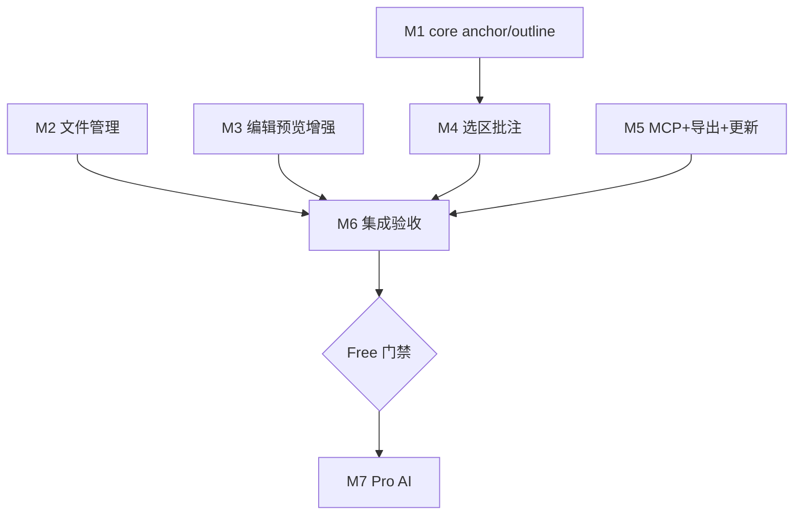

# 实施计划 — MDA 2.0（Phase A Free → 门禁 → Phase B Pro AI）

> 前置：[`P2-detailed-design-v2.md`](P2-detailed-design-v2.md)（**已确认** 2026-07-13）  
> 状态：**已确认**（2026-07-13）；实现进度：**M0–M5 已完成并验收，M6 Free 门禁进行中**

---

## 设计引用

MDA 2.0 分 **Phase A（Free 全功能）** 与 **Phase B（Pro AI）**，中间设 **Free 可交付门禁**。技术栈延续 1.0：TypeScript `@mda/core` + Electron GUI + commander CLI；新增 GUI 子模块与 `src/mcp/`。

**硬约束（继承 1.0）**：源文件保护、批注不可见性、CLI stdout 纯净、renderer 不注入 data-line。

---

## 接口定义

### `@mda/core` 新增/扩展（Phase A）

```typescript
interface AnnotationAnchor {
  start: number;
  end: number;
  quote?: string;
}

interface AnnotationInput {
  content: string;
  tags?: string[];
  level?: AnnotationLevel;
  anchor?: AnnotationAnchor;
}

interface HeadingNode {
  level: number;
  title: string;
  line: number;
  children: HeadingNode[];
}

function validateAnchor(text: string, anchor: AnnotationAnchor): boolean;
function anchorToLine(text: string, start: number): number;
function sliceUtf16(text: string, start: number, end: number): string;
function isAnchorStale(text: string, ann: Annotation): boolean;
function extractHeadings(text: string): HeadingNode[];
```

### `window.mdaAPI` 新增（Phase A）

| API | 说明 |
|-----|------|
| `showSaveDialog({ defaultPath?, defaultName? })` | 另存为 |
| `showOpenFolderDialog()` | 工作区根目录 |
| `listMarkdownTree(folderPath)` | 递归 md 树 |
| `getRecentFiles()` / `addRecentFile(path)` / `clearRecentFiles()` | 最近文件 |
| `extractHeadings(text)` | 大纲（桥接 core） |

### Phase B 追加（门禁后）

`getAiSettings` / `saveAiSettings` / `aiContinue` / `aiBeautify` / `aiCancel` / `onAiChunk` — 见 P1 §3.8。

---

## 方案架构图（Phase A 实施流）



---

## 里程碑与任务 DAG

> 粒度：里程碑内子任务可 2–5 分钟一步；**里程碑间**按依赖顺序。  
> **人机分工**：🤖 AI 实现 + 测试；👤 用户 GUI 实机验收（工作流硬约束）。

### M0 — 基线（0.5 天）

| ID | 任务 | 依赖 | 并行 | 步骤 |
|----|------|------|------|------|
| M0-1 | 版本号升至 `2.0.0-alpha`、分支/tag 策略 | — | — | 1. 更新 `package.json` 2. 记录于 setup-log |
| M0-2 | 复制 `verification-report.template.md` → `.project-setup/` | — | ✓ | 准备 Free 门禁核对表 |

---

### M1 — `@mda/core` 扩展（3–4 天）

| ID | 任务 | 依赖 | 并行 | 涉及文件 | 步骤 |
|----|------|------|------|---------|------|
| M1-1 | `model.ts` 增加 `AnnotationAnchor` | M0 | — | model.ts | 1. 类型 2. `AnnotationInput.anchor?` |
| M1-2 | `anchor.ts` 实现 + 单测 | M1-1 | — | anchor.ts, tests | 1. 五函数 2. E26–E30 边界 |
| M1-3 | `outline.ts` 实现 + 单测 | M0 | ✓ | outline.ts, tests | 1. 围栏感知 2. 树构建 |
| M1-4 | `parser` 解析 anchor | M1-2 | — | parser.ts | 非法 anchor 忽略 |
| M1-5 | `writer` 写入 anchor | M1-2,M1-4 | — | writer.ts, tests | 源文件保护回归 |
| M1-6 | `index.ts` export | M1-3,M1-5 | — | index.ts | barrel 更新 |
| M1-7 | 全量 `npm test` | M1-6 | — | — | 覆盖率 ≥88% |

---

### M2 — 文件管理 F8（4–5 天，与 M3 并行）

| ID | 任务 | 依赖 | 并行 | 涉及文件 | 步骤 |
|----|------|------|------|---------|------|
| M2-1 | `recent-files.js` | M0 | ✓ | main/recent-files.js | JSON 读写、max 20 |
| M2-2 | main IPC：save/folder/tree/recent | M2-1 | — | main.js | dialog + listMarkdownTree |
| M2-3 | preload 桥接 file API | M2-2 | — | preload.js | mdaAPI 扩展 |
| M2-4 | `welcome.js` 空态页 | M2-3 | ✓ | welcome.js | 新建/打开/文件夹/最近 |
| M2-5 | `file-sidebar.js` | M2-3 | ✓ | file-sidebar.js | 树 UI、点击 open |
| M2-6 | `app.js` 状态机 WELCOME/UNTITLED/OPEN | M2-3 | — | app.js | new/saveAs/guardDiscard |
| M2-7 | 菜单：新建、另存为、打开文件夹、最近 | M2-6 | — | main.js | 快捷键表 |
| M2-8 | 👤 实机：AC-9–AC-11 | M2-7 | — | — | ✅ 用户确认 |

---

### M3 — 编辑 & 预览增强 F1/F2（5–6 天，与 M2 并行）

| ID | 任务 | 依赖 | 并行 | 涉及文件 | 步骤 |
|----|------|------|------|---------|------|
| M3-1 | `sync-scroll.js` | M0 | ✓ | sync-scroll.js | ratio 滚动 + reconcile |
| M3-2 | `find-replace.js` | M0 | ✓ | find-replace.js | find/replace UI |
| M3-3 | `editor-assist.js` + 单测 | M0 | ✓ | editor-assist.js, tests/gui | wrap/indent/标题/列表 |
| M3-4 | `outline-panel.js` | M1-3 | ✓ | outline-panel.js | 绑定 extractHeadings |
| M3-5 | preload KaTeX 插件 | M0 | ✓ | preload.js | markdown-it-katex |
| M3-6 | 表格 CSS 增强 | M0 | ✓ | index.html | 横向滚动/斑马纹 |
| M3-7 | `app.js` 接入 M3-1–M3-4 | M3-1–M3-4 | — | app.js | 快捷键、工具栏 |
| M3-8 | 👤 实机：AC-1、AC-2、AC-2b | M3-7 | — | — | ✅ 用户确认 |

---

### M4 — 选区批注 F3（5–6 天，依赖 M1）

| ID | 任务 | 依赖 | 并行 | 涉及文件 | 步骤 |
|----|------|------|------|---------|------|
| M4-0 | **POC** preview→UTF-16 | M1-2,M3-7 | — | selection-anchor.js | 1 天；失败记降级 |
| M4-1 | `selection-anchor.js` 完整 | M4-0 | — | selection-anchor.js | 预览+源码双路径 |
| M4-2 | `anchor-highlights.js` | M4-1 | — | anchor-highlights.js | CSS Highlight API |
| M4-3 | 批注 UI：选区添加、orphan 提示 | M4-1 | — | app.js | 表单 + anchor |
| M4-4 | CLI/MCP add 支持 `--anchor`（可选） | M1-5 | ✓ | cli/commands/add.ts | JSON 字段 |
| M4-5 | 单测 + 1.0 样本回归 | M4-3 | — | tests | AC-4、AC-5 |
| M4-6 | 👤 实机：AC-3 | M4-5 | — | — | ✅ 用户确认 |

---

### M5 — MCP / 导出 / 更新（3–4 天，M1 后并行）

| ID | 任务 | 依赖 | 并行 | 涉及文件 | 步骤 |
|----|------|------|------|---------|------|
| M5-1 | `src/mcp/server.ts` 六 tools | M1-6 | ✓ | mcp/* | stdio MCP SDK |
| M5-2 | MCP 集成测试 vs CLI | M5-1 | ✓ | tests/mcp | AC-7 |
| M5-3 | 导出 HTML（复用 copy 逻辑） | M3-7 | ✓ | app.js | 菜单项 |
| M5-4 | 导出 PDF（printToPDF） | M3-7 | ✓ | main.js | IPC |
| M5-5 | electron-updater 配置 | M0 | ✓ | main.js, package.json | Free 可用 |
| M5-6 | README MCP 配置文档 | M5-1 | ✓ | README.md | Cursor 示例 |

---

### M6 — Phase A 集成与 Free 门禁（2–3 天）

| ID | 任务 | 依赖 | 并行 | 步骤 |
|----|------|------|------|------|
| M6-1 | 帮助对话框快捷键全表 | M2,M3,M4 | — | 更新 showHelpDialog |
| M6-2 | `AGENTS.md` / `quality.md` / 截图清单 | M2–M5 | ✓ | 文档同步 |
| M6-3 | `npm run build && npm test && dist:win` | M2–M5 | — | 打包 smoke |
| M6-4 | `.project-setup/verification-report.md` | M6-3 | — | 勾选 Free 清单 |
| M6-5 | **👤 Free 可交付门禁** | M6-4 | — | **用户明确确认** |

**门禁未通过**：不得启动 M7；回到失败里程碑修复。

---

### M7 — Phase B Pro AI（门禁后 2–3 周）

| ID | 任务 | 依赖 | 并行 | 步骤 |
|----|------|------|------|------|
| M7-1 | `src/pro/license.js` 离线激活 | M6-5 | ✓ | Ed25519/HMAC |
| M7-2 | `src/pro/ai/settings.js` + UI | M7-1 | ✓ | safeStorage、三 Preset |
| M7-3 | `src/pro/ai/provider.js` streaming | M7-2 | — | main IPC |
| M7-4 | `ai-panel.js` 续写/弹层补全/美化 diff | M7-3 | — | AC-6 系列 |
| M7-5 | feature-gate：Free 见升级提示 | M7-1 | ✓ | |
| M7-6 | 官网 Pro 购买 + 激活说明 | M7-1 | ✓ | website/ |
| M7-7 | 👤 Pro AI 实机 + Key 安全抽检 | M7-4 | — | AC-6b/c |

---

## DAG 总览（依赖简图）

```
M0
├─► M1 ──► M4 ──┐
├─► M2 ─────────┼─► M6 ──► [门禁] ──► M7
└─► M3 ─────────┤
    M5 ◄─ M1 ───┘
```

**可并行窗口**：
- **W1**（M1 进行中）：M2-1、M3-1/2/3/5/6 可开工
- **W2**（M1 完成）：M4-0、M5-1 与 M2-4/5 并行
- **W3**（M2–M5 完成）：M6 集成

---

## 人机分工

| 阶段 | AI（实现） | 用户（必须） |
|------|-----------|-------------|
| M1–M5 | 编码、单测、CLI/MCP 测试 | — |
| M2-8,M3-8,M4-6 | 修复反馈 | **GUI 实机**验收 |
| M6-5 | 准备 verification-report | **Free 可交付签字** |
| M7 | Pro 模块实现 | API Key 实测、Pro 购买流走查 |

---

## 预死亡分析（实施层面）

| # | 原因 | 可能性 | 检测 | 回滚 |
|---|------|--------|------|------|
| 1 | M4 POC 失败拖期 | 中 | POC 第 1 天无 mapping | **降级**源码选区；不阻塞 M6 |
| 2 | M2/M3 并行 merge 冲突 | 中 | `app.js` 冲突 | 按模块分支，先 M2 后 rebase M3 |
| 3 | MCP SDK 版本不兼容 | 低 | 集成测试失败 | 锁定 `@modelcontextprotocol/sdk` 版本 |
| 4 | Free 范围膨胀 | 高 | 里程碑超 10 周 | 砍 PV-6/7、PDF 改 2.0.1 |
| 5 | Phase B 提前开工 | 中 | 无 M6-5 确认 | **禁止**合并 M7 至 main |

---

## 回滚策略

1. **单里程碑失败**：`git revert` 该里程碑 merge commit；`npm test` 绿后再继续。
2. **M4 选区批注整体回滚**：移除 anchor GUI；保留 core anchor 字段（向前兼容）；AC-3 改为源码选区。
3. **Phase B 中止**：main 仅发布 Phase A tag `v2.0.0`；Pro 在 `pro/` 分支继续。
4. **发布回滚**：electron-updater 指向上一稳定 `v1.0.0` release。

**回滚风险**：M4 与 writer 耦合后回滚需同步删 CLI `--anchor`；低概率。

---

## 方案置信度

| 项目 | 内容 |
|------|------|
| **Phase A 总体置信度** | **85%** |
| **Phase B 总体置信度** | **80%** |
| **判定依据** | P2 算法已定义；1.0 底座稳定；最大变量为 M4 POC |

### 不确定项

| # | 决策 | 置信度 | 补强 |
|---|------|--------|------|
| D1 | preview→UTF-16 | 70% | M4-0 一天 POC |
| D2 | PDF printToPDF 质量 | 75% | M5-4 样例目录取舍 HTML-only |
| D3 | Free-only 商业转化 | 55% | Phase B 后再评估定价 |

---

## 自检清单

- [x] 接口定义完整
- [x] DAG 依赖与并行清晰
- [x] 子任务含步骤与涉及文件
- [x] 预死亡 ≥3 + 回滚可操作
- [x] Free 门禁明确（M6-5）
- [x] 无 TODO 占位符

---

## 确认状态

状态: **待确认**

请确认 P3 后进入 **P4 实现**（建议从 **M0→M1** 开始；M2/M3 在 M1-2 完成后并行）。
