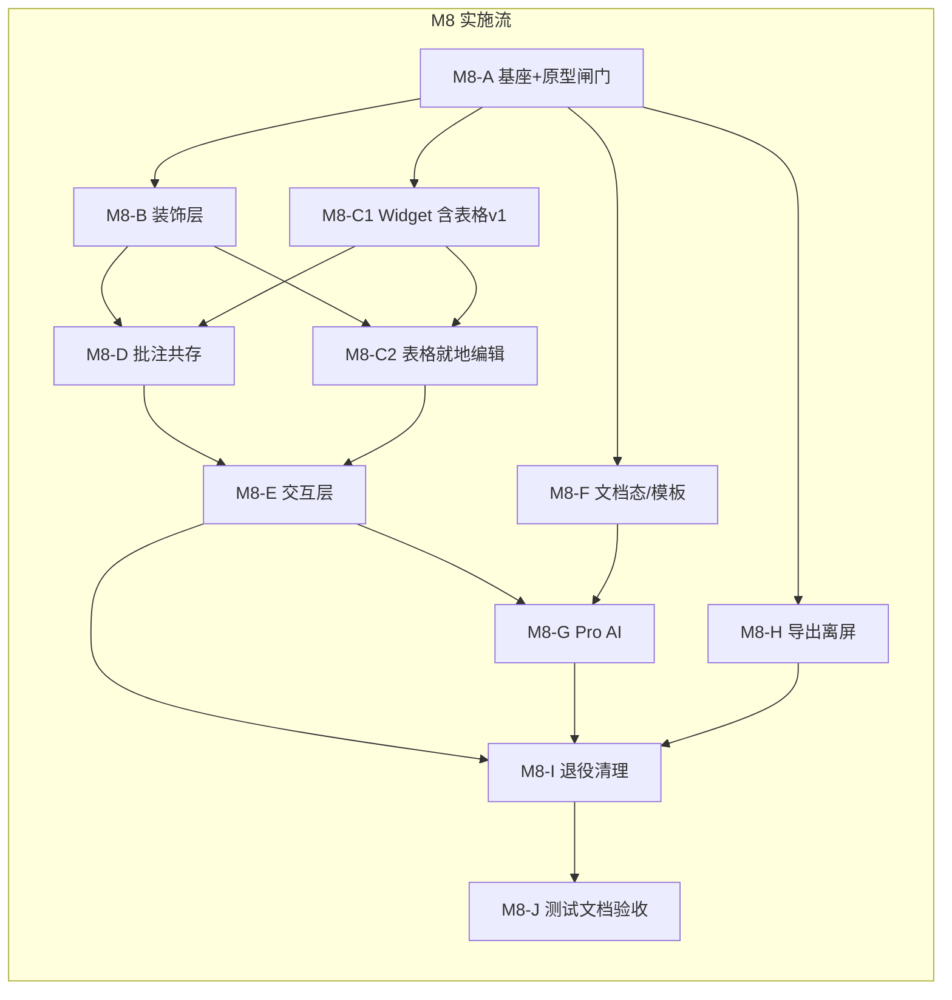

# 实施计划 — MDA 3.0 预览直接编辑（WYSIWYG）与源码模式

> 前置：[`P2-detailed-design-v3-wysiwyg.md`](P2-detailed-design-v3-wysiwyg.md)（**已确认** 2026-07-28，含裁决 D14）  
> 架构：[`P1-architecture-v3-wysiwyg.md`](P1-architecture-v3-wysiwyg.md)（已确认，推荐方案 A：CM6 装饰式实时预览）  
> 需求：[`P0-requirements-v3-wysiwyg.md`](P0-requirements-v3-wysiwyg.md)（F10–F17 / AC-7–AC-30）  
> 状态：**已确认**（2026-07-28）

---

## 设计引用

3.0 以 **Markdown 文本为唯一真源**，用 CodeMirror 6 装饰层实现「预览编辑」观感；原 textarea 退役，双模式（预览编辑 ⇄ 源码）为同一 `EditorView` 的 compartment 切换。批注行以零高度装饰隐藏；脏状态下批注走「先保存后批注」（D5）。Pro AI 入口迁到编辑栏 / `/` / 浮动条 / 右键四处，复用 M7 的 license / gate / provider。

**硬约束（继承）**：源文件保护、批注不可见性、CLI stdout 纯净、`renderer.ts` 不注入 data-line、`contextIsolation:true`、GUI 改动须用户实机确认后才推进。

**关键闸门**：
1. **M8-A 可点原型** — 用户实机确认「光标所在块显源码」可接受（D12），否则止损换路线。
2. **M8-C1 表格 v1** — 「聚焦即显源码」跑通；**M8-C2 表格 v2** — 就地编辑（D14）；不达标则保持 v1。
3. **每 Phase GUI 出口** — 用户明确「测试通过」前不得进入下一 Phase。

---

## 接口定义

### `@mda/core` — **无新增公共接口**

沿用现有：`parseAnnotations` / `writeRawFile` / `add|edit|removeAnnotation` / `clearAllAnnotations` / `buildCodeFenceMask` / `validateAnchor` / `extractHeadings` / `renderMarkdown`。

### 渲染层新增（纯函数，可单测）

```javascript
// src/gui/renderer/editor/model/
buildDecorationSpecs(text, nodes, revealRanges, opts) → Spec[]
computeRevealRanges(state, granularity) → Range[]
findAnnotationLines(text, fenceMask) → { from, to, malformed }[]
anchorFromSelection(state) → AnnotationAnchor | null
withFreshDisk(saveFn, thenAnnoFn) → Promise<Result>   // 先保存后批注
normalizeDocument(text, style) → string               // 格式化整篇
htmlClipboardToMarkdown(html) → string                // 粘贴白名单
```

### `window.mdaAPI` 新增

| API | 说明 |
|-----|------|
| `listBuiltinTemplates()` | 内置模板元数据（id / 名称 i18n key / 分组） |
| `readBuiltinTemplate(id)` | 读内置模板正文 |
| `getCustomTemplateDir()` / `setCustomTemplateDir(path\|null)` | 自定义模板目录偏好 |
| `listCustomTemplates()` | 列出自定义目录内 `.md` |
| `readCustomTemplate(fileName)` | 读自定义模板正文（路径校验） |
| `aiSummarize(text)` / `onAiChunk`（复用） / `aiCancel` | 文档级 AI 总结（Pro） |
| `getEditorModePref()` / `setEditorModePref('preview'\|'source')` | 模式记忆 |

既有 License / AI settings / continue / complete / beautify / cancel **保留并复用**。

### 构建链新增

| 脚本 | 说明 |
|------|------|
| `scripts/bundle-editor.js` | esbuild：`src/gui/renderer/editor/**` + CM6 → `dist/gui/renderer/editor.bundle.js`（IIFE + sourcemap） |
| `npm run build:editor` | 上述脚本；`build` = `build:ts` → `build:editor` → `build:gui` |
| `npm run watch:editor` | esbuild watch，开发用 |

---

## 方案架构图



---

## 任务 DAG

> 粒度：子任务 2–5 分钟可完成一步。  
> 人机分工：🤖 AI 实现 + 单测；👤 用户 GUI 实机验收（硬约束）。

### M8-A — 编辑器基座与可点原型（阻塞全部）

| ID | 任务 | 依赖 | 并行 | 涉及文件 | 步骤 |
|----|------|------|------|---------|------|
| M8-A1 | 引入 CM6 依赖 + esbuild | — | — | package.json | 1. `@codemirror/{state,view,commands,language,lang-markdown,search,autocomplete}` `@lezer/markdown` `esbuild`（dev） |
| M8-A2 | `scripts/bundle-editor.js` + `build:editor` / `watch:editor` | M8-A1 | — | scripts/, package.json | 1. IIFE 入口 2. sourcemap 3. 接入 `build` 顺序 |
| M8-A3 | `editor/mount.js`：创建 EditorView，挂到 `#preview-scroll` 替代区 | M8-A2 | — | renderer/editor/ | 1. 空 doc 2. 主题适配 light/dark |
| M8-A4 | 双模式 compartment（`preview`/`source`）骨架 | M8-A3 | — | editor/mode.js | 1. livePreview 空扩展 2. lineNumbers 切换 3. 偏好读写 |
| M8-A5 | dirty / 保存接 `doc.toString()` + `writeRawFile` | M8-A3 | — | app.js | 1. 替换 `editorEl.value` 读取点 2. BOM 剥离进模型、保存拼回 3. EOL 不变 |
| M8-A6 | 打开文件 → `view.dispatch` 设全文；欢迎/新建路径 | M8-A5 | — | app.js | 1. openFile 2. newDocument 3. guardDiscard |
| M8-A7 | 最小装饰 POC：标题字号 + 粗体隐藏 `**`（仅 2 规则） | M8-A4 | — | editor/view/live-preview.js | 1. ViewPlugin 2. reveal=block 3. composition 冻结 |
| M8-A8 | index.html 引入 bundle；旧 textarea **并存**（feature flag `mda-cm6`） | M8-A7 | — | index.html, app.js | 1. 开关默认开 2. 关则回退旧路径 |
| M8-A9 | 👤 **原型闸门**：打开含标题/粗体/列表的样例，确认「聚焦块显源码」可接受 | M8-A8 | — | — | ✅ 用户确认后才开 B/C |

**出口条件**：用户确认 D12 体验可接受；`npm run build` 通过；开关可回退旧编辑器。

---

### M8-B — 实时预览装饰层（S1–S12）

| ID | 任务 | 依赖 | 并行 | 涉及文件 | 步骤 |
|----|------|------|------|---------|------|
| M8-B1 | `model/build-specs.js` 纯函数骨架 + 单测夹具 | M8-A9 | ✓ | editor/model/, tests/ | 1. Spec 类型 2. 空实现可跑 |
| M8-B2 | S1 标题、S2–S5 行内（粗斜删码） | M8-B1 | — | model/, view/ | 1. markRanges 2. hide-mark 3. E49–E52 |
| M8-B3 | S6–S7 链接（Ctrl/Cmd+点击 `openExternal`） | M8-B2 | — | view/ | 1. 隐藏 URL 2. 点击处理 |
| M8-B4 | S8–S10 列表 + 任务复选框 widget | M8-B2 | ✓ | view/ | 1. 保留原标记字符 2. 点击写回单字符 |
| M8-B5 | S11 引用、S12 分隔线 | M8-B2 | ✓ | view/ | — |
| M8-B6 | reveal 策略 + 设置项 `mda-live-reveal` | M8-B2 | — | model/, settings | 1. block/nearby/never 2. i18n |
| M8-B7 | 👤 实机：IME 长段输入、reveal 三档、列表标记不统一 | M8-B3–B6 | — | — | ✅ |

**出口条件**：S1–S12 在 `samples/all-features.md` 可编辑；E49–E55 相关单测绿；IME 不丢字。

---

### M8-C1 — 块 Widget（代码 / 公式 / Mermaid / 图片 + 表格 v1）

| ID | 任务 | 依赖 | 并行 | 涉及文件 | 步骤 |
|----|------|------|------|---------|------|
| M8-C1-1 | S13 代码围栏 widget（hljs + 复制 + 聚焦可编辑） | M8-A9 | ✓ | view/widgets/code.js | 复用 highlight.js |
| M8-C1-2 | S15/S16 KaTeX 行内/块公式 widget + 双击微编辑 | M8-A9 | ✓ | view/widgets/math.js | 复用 katex 配置；可取消 |
| M8-C1-3 | S17 Mermaid widget + 双击微编辑 + 缩放 overlay 复用 | M8-A9 | ✓ | view/widgets/mermaid.js | — |
| M8-C1-4 | S22 图片 widget + 缩放手柄（会话态宽度） | M8-A9 | ✓ | view/widgets/image.js | 宽度不写回 MD |
| M8-C1-5 | **S14 表格 v1**：非聚焦渲染表；**聚焦即显源码行**（D14 第一轮） | M8-A9 | — | view/widgets/table-v1.js | 不就地编辑单元格 |
| M8-C1-6 | S18–S21 `P` 类只读 + `changeFilter` | M8-B1 | ✓ | model/, view/ | E59–E61 |
| M8-C1-7 | 👤 实机：各 widget 观感对照旧预览；表格 v1 可改源码 | M8-C1-1–6 | — | — | ✅ |

**出口条件**：富块非聚焦观感 ≈ 旧预览；`P` 类不可编辑且不丢内容；10 万字符滚动可接受（粗测）。

---

### M8-C2 — 表格就地编辑（D14 第二轮）

| ID | 任务 | 依赖 | 并行 | 涉及文件 | 步骤 |
|----|------|------|------|---------|------|
| M8-C2-1 | 单元格 contenteditable → **行级替换**写回 | M8-C1-5 | — | view/widgets/table-v2.js | 1. 解析行 2. 替换该行 3. 断言他行不变 |
| M8-C2-2 | 增删行列、对齐 | M8-C2-1 | — | table-v2.js | 不支持合并 |
| M8-C2-3 | 单测：编辑一格 → 非该行逐字节不变（H13 硬出口） | M8-C2-1 | — | tests/ | 不达标 → **保持 v1，不启用 v2** |
| M8-C2-4 | 👤 实机：宽表、空单元格、含 `|` 单元格 | M8-C2-2 | — | — | ✅ 或退回 v1 |

**出口条件**：H13 断言通过；否则功能开关保持表格 v1。

---

### M8-D — 批注共存

| ID | 任务 | 依赖 | 并行 | 涉及文件 | 步骤 |
|----|------|------|------|---------|------|
| M8-D1 | S24/S25 批注行零高度隐藏 + 行号槽警示 | M8-B1, M8-C1-6 | — | model/, view/ | 围栏内不隐藏；E70–E71 |
| M8-D2 | 色条 gutter（替代旧 `decorateParagraphs`） | M8-D1 | — | view/gutter-anno.js | 点击定位批注面板 |
| M8-D3 | 选区批注：`anchorFromSelection` | M8-D1 | — | model/anchor-from-sel.js | 跳过隐藏行端点 |
| M8-D4 | `withFreshDisk`：先保存后批注（D5）；失败中止 | M8-A5 | — | app.js | 替换 `ensureNotDirty`；AC-19 |
| M8-D5 | 批注面板 / 清空全部 / 坏批注保存提示对接 | M8-D3, M8-D4 | — | app.js | — |
| M8-D6 | 👤 实机：隐藏不可见、选区批注、脏时加批注自动保存 | M8-D5 | — | — | ✅ |

**出口条件**：不可见性三断言（AC-11）；脏状态加批注路径通过；`verifySourceProtection` 仍绿。

---

### M8-E — 交互层

| ID | 任务 | 依赖 | 并行 | 涉及文件 | 步骤 |
|----|------|------|------|---------|------|
| M8-E1 | 常驻编辑工具栏（F11-6）+ 溢出菜单 | M8-B7, M8-C1-7 | — | editor/toolbar.js, i18n | zh+en |
| M8-E2 | `/` 插入面板 | M8-E1 | ✓ | editor/slash-menu.js | 过滤/键盘/取消保留 `/` |
| M8-E3 | 选区浮动工具条 | M8-E1 | ✓ | editor/bubble.js | 120ms 延迟；与右键互斥 |
| M8-E4 | 右键菜单（含粘贴纯文本、到源码模式） | M8-E1 | ✓ | editor/context-menu.js | HTML→MD 白名单 |
| M8-E5 | 快捷键路由表（§5.5）迁入 CM6 keymap | M8-E1 | — | editor/keymap.js, app.js | 编辑面优先 |
| M8-E6 | 查找替换薄封装 `@codemirror/search` | M8-A5 | ✓ | find-replace.js | 不再强制展开源码栏 |
| M8-E7 | 👤 实机：四处入口、`/` 面板、浮动条、IME+斜杠不误触 | M8-E2–E6 | — | — | ✅ |

---

### M8-F — 文档态与模板库

| ID | 任务 | 依赖 | 并行 | 涉及文件 | 步骤 |
|----|------|------|------|---------|------|
| M8-F1 | 新建空态三入口 UI（F15-1） | M8-A6 | ✓ | editor/empty-state.js | 模板 / AI 帮我写 / 打开 |
| M8-F2 | 主进程模板 IO + preload | M8-A2 | ✓ | main/templates.js, preload | 仅 `.md`；路径校验 |
| M8-F3 | 内置 14 模板正文落地（优先 T2/T3/T5/T6/T8/T14） | M8-F2 | ✓ | templates/*.md | 复用 l2-project-template |
| M8-F4 | 自定义模板目录设置 | M8-F2 | ✓ | settings, main | AC-24 |
| M8-F5 | 默认模式记忆、只读/超大降级（2MB/2万行/10MB） | M8-A4 | ✓ | app.js | F16 |
| M8-F6 | 外部文件改动提示 | M8-A5 | ✓ | main.js, app.js | — |
| M8-F7 | 👤 实机：新建套模板、自定义目录、超大降级 | M8-F1–F6 | — | — | ✅ |

---

### M8-G — Pro AI 入口迁移

| ID | 任务 | 依赖 | 并行 | 涉及文件 | 步骤 |
|----|------|------|------|---------|------|
| M8-G1 | 四处入口统一 `checkAiAccess`（AC-30） | M8-E7 | — | ai-panel.js, toolbar… | Free 可见+升级提示 |
| M8-G2 | 续写/润色等 → 待确认区 / inline diff 装饰 | M8-G1 | — | editor/ai-decorations.js | 采纳才 transaction |
| M8-G3 | 伴写 ghost text（默认 manual） | M8-G2 | ✓ | editor/ghost-text.js | Ctrl+Shift+Space |
| M8-G4 | 解释/总结只读浮层 | M8-G1 | ✓ | editor/ai-readonly.js | 不入文档 |
| M8-G5 | AI 总结侧栏「要点」tab（F17） | M8-G1, outline | ✓ | outline-panel.js, main | 流式；插入显式 |
| M8-G6 | AI 上下文剔除批注行 | M8-G2 | — | prompts.js / renderer | F14-5 |

---

### M8-H — 导出与复制离屏化

| ID | 任务 | 依赖 | 并行 | 涉及文件 | 步骤 |
|----|------|------|------|---------|------|
| M8-H1 | `buildArticleClipboardContent` 改离屏 markdown-it | M8-A5 | ✓ | app.js | 数据源=doc 文本 |
| M8-H2 | 导出 HTML/PDF/DOCX 同路径 | M8-H1 | — | app.js | — |
| M8-H3 | 👤 对照 `samples/all-features.md` 公众号复制与导出 | M8-H2 | — | — | ✅ |

---

### M8-I — 退役与清理

| ID | 任务 | 依赖 | 并行 | 涉及文件 | 步骤 |
|----|------|------|------|---------|------|
| M8-I1 | 移除 feature flag；删除旧 textarea / 高亮层 DOM | M8-E7, M8-D6, M8-G7 | — | index.html, app.js | — |
| M8-I2 | 删除/停用 `sync-scroll.js`；精简 `selection-anchor.js` | M8-I1 | — | renderer/ | 更新引用 |
| M8-I3 | 格式化整篇（弹框确认 + 单 transaction 可撤销） | M8-B7 | ✓ | editor/format-all.js | F10-7b / AC-28 |
| M8-I4 | 👤 回归：模式切换、查找、批注、导出、无旧栏残留 | M8-I1–I3 | — | — | ✅ |

---

### M8-J — 测试、文档、验收清单

| ID | 任务 | 依赖 | 并行 | 涉及文件 | 步骤 |
|----|------|------|------|---------|------|
| M8-J1 | 纯函数单测补齐 E49–E86 可自动化部分 | 各 Phase | ✓ | tests/gui/editor/ | — |
| M8-J2 | 不可见性三断言 + 往返「无修改零 diff」 | M8-D1 | ✓ | tests/ | AC-10/11 |
| M8-J3 | 更新 `AGENTS.md` §9 4e（先保存后批注）+ CM6 规范 | M8-I4 | — | AGENTS.md | — |
| M8-J4 | `quality.md` / few-shot / prompts 记录 | M8-J3 | — | docs/ | — |
| M8-J5 | 交付 [`M8-acceptance-checklist.md`](M8-acceptance-checklist.md) | M8-I4 | — | docs/ | AC-7–AC-30 映射 |
| M8-J6 | 截图清单更新；提示用户补素材 | M8-J5 | — | screenshots/ | AI 不伪造截图 |
| M8-J7 | 👤 总验收签字 | M8-J5 | — | — | ✅ |

**总改动预估**：约 3500–4500 行净增（含测试与模板），涉及约 40+ 文件；退役约 1500 行旧预览联动代码。

---

## 验收清单交付物

P4 过程中维护并最终交付：

**[`docs/M8-acceptance-checklist.md`](M8-acceptance-checklist.md)**（本阶段末创建骨架，实现中勾选）

| Phase | 映射 AC | 人工必测 |
|-------|---------|----------|
| M8-A | AC-12（雏形）、AC-20 | 原型体验闸门 |
| M8-B | AC-7、AC-9（部分） | IME、reveal |
| M8-C1/C2 | AC-15、AC-16、AC-18 | widget 观感、表格出口 |
| M8-D | AC-11、AC-14、AC-19 | 批注不可见、先保存后批注 |
| M8-E | AC-8、AC-17、AC-21 | `/`、工具栏、剪贴板 |
| M8-F | AC-22–AC-27 | 新建/模板/降级 |
| M8-G | AC-13、AC-29、AC-30 | Free/Pro AI |
| M8-H | （2.0 回归） | 公众号复制、导出 |
| M8-I | AC-28 | 格式化整篇撤销 |
| M8-J | 全部勾选 | 总验收 |

---

## 预死亡分析（实施层面）

| # | 原因 | 可能性 | 检测方式 | 回滚方案 |
|---|------|--------|---------|---------|
| 1 | M8-A 原型被否（用户要求全程隐藏语法） | 中 | 用户闸门明确否决 | 保留 flag 回退旧编辑器；评估方案 B 成本后另开 P1 修订，**不继续 B–J** |
| 2 | 打包链导致 dist/调试混乱或漏拷贝 | 中 | `npm run build` 后 GUI 白屏/无编辑面 | 回退 A2 提交；临时用 unpkg 不可接受（离线约束）；修复入口 script |
| 3 | 表格 v2 写回破坏邻行（H13 失败） | 中 | M8-C2-3 单测红 | **不合并 v2**，生产保持表格 v1 |
| 4 | app.js 半成品两套编辑面长期并存 | 中 | flag 关掉仍依赖已删 DOM | M8-I 前禁止删 textarea；每 Phase 保持 flag 可回退 |
| 5 | 批注隐藏导致选区/复制异常 | 中低 | E70–E71 + 实机 Ctrl+A | 回退 D1 装饰，临时用 preprocess 空行方案（仅导出路径） |
| 6 | AI 四处入口门禁不一致 | 低 | AC-30 清单 | 统一封装 `requireAiOrUpgrade()` 单点 |

---

## 回滚策略

1. **Phase 级**：每个 M8-x 独立 commit；失败则 `git revert` 该 Phase 提交（勿 rewind 已推送历史，除非用户明确要求）。
2. **功能开关**：M8-A8 至 M8-I1 期间保留 `mda-cm6=0` 回退旧 textarea 路径。
3. **表格**：v2 用独立开关 `mda-table-inline=0` 默认可关。
4. **依赖**：移除 CM6 时同步删 `build:editor` 与 bundle 引用，恢复 `build` = ts + copy-gui。
5. **文档**：P0–P3 设计文档保留；实现回滚不删设计。

**回滚风险**：M8-I 删除旧路径后回滚成本升高 —— 故 I 必须在 E/D/G/H 均实机通过后进行。

---

## 方案置信度

| 项目 | 内容 |
|------|------|
| **总体置信度** | **84%** |
| **判定依据** | P0–P2 已确认且 POC 支撑真源路线；DAG 按 P1 任务初稿细化并落实 D14 两轮表格；每 Phase 有出口与回滚；主要不确定项（体验闸门、表格 v2、打包链）均有显式退路 |

### 不确定项（置信度 <80%）

| # | 不确定的决策 | 当前置信度 | 不确定原因 | 判断错误的后果 | 补强方式 |
|---|------------|-----------|-----------|--------------|---------|
| 1 | 用户最终接受「聚焦显源码」 | 72% | D12 接受但实机未看 | 路线重做 | M8-A9 硬闸门 |
| 2 | 表格 v2 行级写回稳健 | 78% | H13 未在本仓库验证 | 表格体验打折 | C2-3 单测 + 退回 v1 |
| 3 | 10 万字符 + 多 Mermaid 性能 | 75% | H4 未实测 | 卡顿 | C1 出口粗测；惰性 widget |
| 4 | 模板正文质量一次过关 | 70% | 内容未写 | 补写耗时 | 先交 6 个高频模板 |

---

## Spec Self-Review

- [x] 无占位符（无 TODO / TBD / 待定）
- [x] 接口定义章节完整（core 无新增已写明；mdaAPI / 纯函数 / 构建链已列）
- [x] 任务 DAG 有依赖与并行；粒度可执行
- [x] 预死亡 ≥3 条且含检测 + 回滚
- [x] 回滚策略可直接操作
- [x] 与 P2 一致：D14 表格两轮、D5 先保存后批注、D12 原型闸门、core 零改动
- [x] GUI 硬约束：每 Phase 含 👤 实机步骤

---

## 确认状态

状态: **已确认**（2026-07-28）

进入 **P4 / M8-A**：编辑器基座与可点原型。
