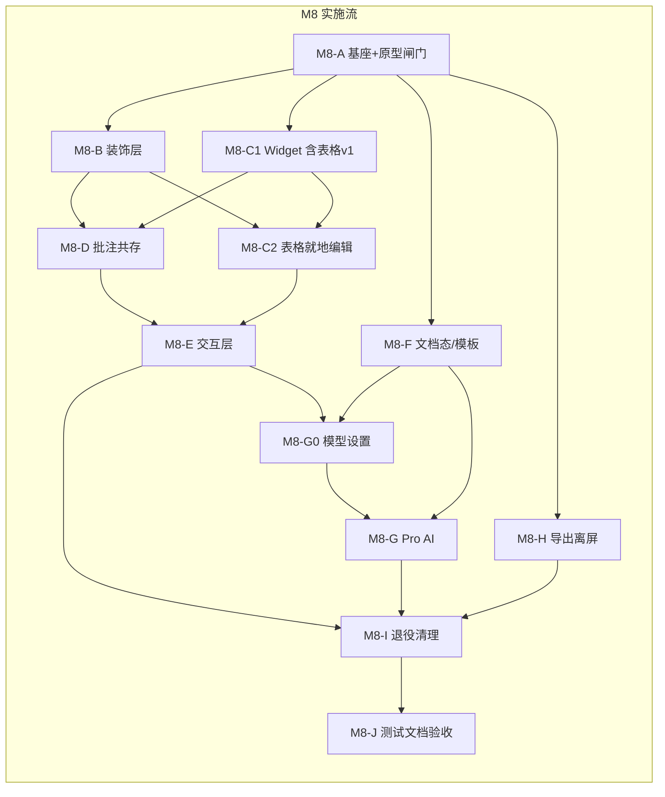

# 实施计划 — MDA 3.0 预览直接编辑（WYSIWYG）与源码模式

> 前置：[`P2-detailed-design-v3-wysiwyg.md`](P2-detailed-design-v3-wysiwyg.md)（**已确认** 2026-07-28，含裁决 D14；**v1.1** F18）  
> 架构：[`P1-architecture-v3-wysiwyg.md`](P1-architecture-v3-wysiwyg.md)（**v1.5**，已确认；方案 A：CM6 源码即真源）  
> 需求：[`P0-requirements-v3-wysiwyg.md`](P0-requirements-v3-wysiwyg.md)（**v1.7**；F10–F18 / AC-7–AC-34 / AC-17b）  
> 验收：[`M8-acceptance-checklist.md`](M8-acceptance-checklist.md)（含粘贴场景 P1–P5、FMT/SRCH/IME-AI、**AI 模型设置**）  
> 状态：**已确认**（2026-07-28；**v1.3** 对齐 D15 / M8-B8，2026-07-30）

## 版本历史

| 版本 | 时间 | 变更摘要 |
|------|------|---------|
| v1 | 2026-07-28 | 初始 DAG；D14 表格两轮；M8-A~J 任务细化 |
| v1.1 | 2026-07-29 | 对齐 P0 D12（无序列化引擎）、P1 v1.4：`SearchSession`/`ModeSwitchState`/`currentBlockFormat`/`paste-html`/保存锁/composition+AI；验收清单同步 |
| v1.2 | 2026-07-29 | 对齐 P0 v1.7 F18：M8-G0 AI 模型设置；`fetchAiModels`/`testAiModel`；AC-31–34 |
| v1.3 | 2026-07-30 | D15：默认 reveal=never；`editor/config.js`；**M8-B8 坐标闸门** 阻塞 B7/C1；移除废弃 hide 临时代码 |

---

## 设计引用

3.0 以 **Markdown 文本为唯一真源**（`EditorState.doc`），保存 = `doc.toString()` → `writeRawFile`；**无独立序列化引擎**（P0 D12）。CM6 装饰层实现「预览编辑」观感；双模式为同一 `EditorView` 的 compartment 切换。批注行零高度隐藏；脏状态下批注走「先保存后批注」+ **保存锁排队**（AC-19）。Pro AI 入口迁到编辑栏 / `/` / 浮动条 / 右键四处。

**硬约束（继承）**：源文件保护、批注不可见性、CLI stdout 纯净、`renderer.ts` 不注入 data-line、`contextIsolation:true`、GUI 改动须用户实机确认后才推进。**禁止**：块映射写回层、remark/stringify 全文序列化管线（格式化整篇除外，且结果须经单次 transaction 写入 doc）。

**关键闸门**：
1. **M8-B8 坐标闸门** — 点击/光标与视觉偏差 ≤2px（HUD 三色点）；**未过不得签收 M8-B7、不得开 block widget**（D15）。
2. **M8-A 可点原型** — 保存往返、双模式切换（✅ 2026-07-30）；**不再**以「聚焦块显露语法」为产品目标（P1-D12 已废止）。
3. **M8-C1 表格 v1** — 「聚焦即显源码」仅作表格 v1 退路；**M8-C2 表格 v2** — 就地编辑（D14）；不达标则保持 v1。
4. **A24 格式化撤销** — CM6 单次 transaction 或快照回填（AC-28 行为级）；M8-I 出口验证。
5. **每 Phase GUI 出口** — 用户明确「测试通过」前不得进入下一 Phase。

---

## 接口定义

### `@mda/core` — **无新增公共接口**

沿用现有：`parseAnnotations` / `writeRawFile` / `add|edit|removeAnnotation` / `clearAllAnnotations` / `buildCodeFenceMask` / `validateAnchor` / `extractHeadings` / `renderMarkdown`。

### 渲染层新增（纯函数 + 会话状态，可单测）

```javascript
// src/gui/renderer/editor/model/  — 纯函数
buildDecorationSpecs(text, nodes, revealRanges, opts) → Spec[]
computeRevealRanges(state, granularity) → Range[]
findAnnotationLines(text, fenceMask) → { from, to, malformed }[]
anchorFromSelection(state) → AnnotationAnchor | null
htmlClipboardToMarkdown(html) → string          // F10-9 / P1 附录 A；AC-17b
formatDocument(text) → string                   // 仅「格式化整篇」；结果经 transaction 写入，非通用序列化

// src/gui/renderer/editor/state/  — 会话（非 core）
class SearchSession { query, caseSensitive, matchIndex, total, … }  // F12-2；跨模式保留
class ModeSwitchState { saveScrollLine(), restoreScrollLine(), saveSelection(), … }  // AC-12
function deriveBlockFormat(state) → 'paragraph'|'h1'|…|'h6'  // currentBlockFormat 源
function subscribeBlockFormat(view, cb) → unsubscribe            // AC-21；100ms 内同步 UI

// src/gui/renderer/app.js 或 editor/anno-save.js
withFreshDisk({ saveFn, annoQueue }) → Promise   // saveInFlight 互斥；失败清空队列（AC-19）
```

### `window.mdaAPI` 新增

| API | 说明 |
|-----|------|
| `listBuiltinTemplates()` | 内置模板元数据（id / 名称 i18n key / 分组） |
| `readBuiltinTemplate(id)` | 读内置模板正文 |
| `getCustomTemplateDir()` / `setCustomTemplateDir(path\|null)` | 自定义模板目录偏好 |
| `listCustomTemplates()` | 列出自定义目录内 `.md` |
| `readCustomTemplate(fileName)` | 读自定义模板正文（路径校验） |
| `aiSummarize(text)` / `onAiChunk`（复用） / `aiCancel` | 文档级 AI 总结（Pro） |
| `fetchAiModels()` | `GET /v1/models` 合并入列表（F18-4 / AC-31） |
| `testAiModel({ modelId? })` | 最小 chat 探测连通性（F18-6 / AC-34） |
| `getEditorModePref()` / `setEditorModePref('preview'\|'source')` | 模式记忆 |

`getAiSettings` / `saveAiSettings` **扩展**：返回 `models[]`、`defaultModelId`、`providerEnabled`（F18）。

既有 License / AI settings / continue / complete / beautify / cancel **保留并复用**。

### 构建链新增

| 脚本 | 说明 |
|------|------|
| `scripts/bundle-editor.js` | esbuild：`src/gui/renderer/editor/**` + CM6 → `dist/gui/renderer/editor.bundle.js`（IIFE + sourcemap） |
| `npm run build:editor` | 上述脚本；`build` = `build:ts` → `build:editor` → `build:gui` |
| `npm run watch:editor` | esbuild watch，开发用 |

---

## 方案架构图



---

## 任务 DAG

> 粒度：子任务 2–5 分钟可完成一步。  
> 人机分工：🤖 AI 实现 + 单测；👤 用户 GUI 实机验收（硬约束）。

### M8-A — 编辑器基座与可点原型（阻塞全部）

| ID | 任务 | 依赖 | 并行 | 涉及文件 | 步骤 |
|----|------|------|------|---------|------|
| M8-A1 | 引入 CM6 依赖 + esbuild | — | — | package.json | 1. `@codemirror/{state,view,commands,language,lang-markdown,search,autocomplete}` `@lezer/markdown` `esbuild`（dev） |
| M8-A2 | `scripts/bundle-editor.js` + `build:editor` / `watch:editor` | M8-A1 | — | scripts/, package.json | 1. IIFE 入口 2. sourcemap 3. 接入 `build` 顺序 |
| M8-A3 | `editor/mount.js`：创建 EditorView，挂到 `#preview-scroll` 替代区 | M8-A2 | — | renderer/editor/ | 1. 空 doc 2. 主题适配 light/dark |
| M8-A4 | 双模式 compartment（`preview`/`source`）+ **`ModeSwitchState` 骨架** | M8-A3 | — | editor/mode.js, state/mode-switch.js | 1. livePreview 空扩展 2. lineNumbers 3. 切换时保存/恢复首可见行（AC-12 ≤5 行）与段落光标 |
| M8-A4b | **`SearchSession` 骨架** + `find-replace.js` 接入 | M8-A3 | ✓ | find-replace.js, state/search-session.js | 1. 共享 query/index/case 2. compartment 切换不清空 |
| M8-A5 | dirty / 保存接 `doc.toString()` + `writeRawFile` | M8-A3 | — | app.js | 1. 替换 `editorEl.value` 2. BOM/EOL 3. **无**序列化中间层 |
| M8-A6 | 打开文件 → `view.dispatch` 设全文；欢迎/新建路径 | M8-A5 | — | app.js | 1. openFile 2. newDocument 3. guardDiscard |
| M8-A7 | 最小装饰 POC：标题字号 + 粗体隐藏 `**`（仅 2 规则） | M8-A4 | — | editor/view/live-preview.js | 1. ViewPlugin 2. reveal=block 3. composition 冻结 |
| M8-A8 | index.html 引入 bundle；旧 textarea **并存**（feature flag `mda-cm6`） | M8-A7 | — | index.html, app.js | 1. 开关默认开 2. 关则回退旧路径 |
| M8-A9 | 👤 **原型闸门**：确认「聚焦块显源码」可接受（P1-D12） | M8-A8 | — | — | ✅ 用户确认后才开 B/C |

**出口条件**：P1-D12 体验确认；`npm run build` 通过；`SearchSession`/`ModeSwitchState` 骨架可测；开关可回退旧编辑器；**往返保真**冒烟（打开→不编辑→保存，AC-10 雏形）。

---

### M8-B — 实时预览装饰层（S1–S12）

| ID | 任务 | 依赖 | 并行 | 涉及文件 | 步骤 |
|----|------|------|------|---------|------|
| M8-B1 | `model/build-specs.js` 纯函数骨架 + 单测夹具 | M8-A9 | ✓ | editor/model/, tests/ | 1. Spec 类型 2. 空实现可跑 |
| M8-B2 | S1 标题、S2–S5 行内（粗斜删码） | M8-B1 | — | model/, view/ | 1. markRanges 2. hide-mark 3. E49–E52 |
| M8-B3 | S6–S7 链接（Ctrl/Cmd+点击 `openExternal`） | M8-B2 | — | view/ | 1. 隐藏 URL 2. 点击处理 |
| M8-B4 | S8–S10 列表 + 任务复选框 widget | M8-B2 | ✓ | view/ | 1. 保留原标记字符 2. 点击写回单字符 |
| M8-B5 | S11 引用、S12 分隔线 | M8-B2 | ✓ | view/ | — |
| M8-B6 | reveal 策略 + 设置项 `mda-live-reveal` | M8-B2 | — | model/, settings | 1. **默认 never** 2. block/nearby 调试 3. i18n |
| M8-B8 | **`editor/config.js`** + 点击诊断 HUD + `MDA_EDITOR_RELEASE` | M8-A8 | ✓ | editor/config.js, click-debug.js, bundle-editor.js | 1. 统一调试开关 2. 发布关 HUD |
| M8-B8b | **坐标闸门实现**：`atomicRanges` + hide-mark replace widget | M8-B8 | — | editor/view/atomic-ranges.js, live-preview.js | 1. 零宽隐藏 2. 单测 E57–E60 3. HUD Δ≤2px |
| M8-B7 | 👤 实机：IME、列表标记、**COORD 场景** | M8-B8b | — | — | ⬜ **依赖 B8b 通过** |

**出口条件**：S1–S12 可编辑；**M8-B8b 坐标闸门通过**；E49–E55 单测绿；IME 不丢字。

> **当前进度（2026-07-30）**：B1–B6 + **B8b 坐标闸门用户签收**（COORD-1–4 ✅）；**可启动 M8-C1**（`blockWidgets` 仍默认关，COORD-5 随 C1 联调）。

---

### M8-C1 — 块 Widget（代码 / 公式 / Mermaid / 图片 + 表格 v1）

| ID | 任务 | 依赖 | 并行 | 涉及文件 | 步骤 |
|----|------|------|------|---------|------|
| M8-C1-1 | S13 代码围栏 widget（hljs + 复制 + 顶栏「代码」） | **M8-B8b** | ✓ | view/widgets/code.js | **依赖坐标闸门**；`blockWidgets` 开关 |
| M8-C1-2 | S15/S16 KaTeX 行内/块公式 widget + 双击微编辑 | M8-A9 | ✓ | view/widgets/math.js | 复用 katex 配置；可取消 |
| M8-C1-3 | S17 Mermaid widget + **D14 选中/双击全屏** + zoom overlay 复用 | M8-A9 | ✓ | view/widgets/mermaid.js | 单击选中；双击 openZoom；微编辑走顶栏「代码」 |
| M8-C1-4 | S22 图片 widget + **D14**（`image-block-selected.png` 选中态 + 四角手柄 + 浮动条） | M8-A9 | ✓ | view/widgets/image.js | 单击选中；双击 openZoom；宽度不写回 MD |
| M8-C1-5 | **S14 表格 v1**：非聚焦渲染表；**聚焦即显源码行**（D14 第一轮） | M8-A9 | — | view/widgets/table-v1.js | 不就地编辑单元格 |
| M8-C1-6 | S18–S21 `P` 类只读 + `changeFilter` | M8-B1 | ✓ | model/, view/ | E59–E61 |
| M8-C1-7 | 👤 实机：各 widget 观感**对照竞品截图**（VIS-3–5） | M8-C1-1–6 | — | — | ✅ |

**出口条件**：富块非聚焦观感 ≈ 旧预览；`P` 类不可编辑且不丢内容；10 万字符滚动可接受（粗测）。

---

### M8-C2 — 表格就地编辑（D14 第二轮）

| ID | 任务 | 依赖 | 并行 | 涉及文件 | 步骤 |
|----|------|------|------|---------|------|
| M8-C2-1 | 单元格 contenteditable → **行级替换**写回 | M8-C1-5 | — | view/widgets/table-v2.js | 1. 解析行 2. 替换该行 3. 断言他行不变 |
| M8-C2-2 | 增删行列、对齐 | M8-C2-1 | — | table-v2.js | 不支持合并 |
| M8-C2-3 | 单测：编辑一格 → 非该行逐字节不变（H13 硬出口） | M8-C2-1 | — | tests/ | 不达标 → **保持 v1，不启用 v2** |
| M8-C2-4 | 👤 实机：宽表、空单元格、含 `|` 单元格 | M8-C2-2 | — | — | ✅ 或退回 v1 |

**出口条件**：H13 断言通过；否则功能开关保持表格 v1。

---

### M8-D — 批注共存

| ID | 任务 | 依赖 | 并行 | 涉及文件 | 步骤 |
|----|------|------|------|---------|------|
| M8-D1 | S24/S25 批注行零高度隐藏 + 行号槽警示 | M8-B1, M8-C1-6 | — | model/, view/ | 围栏内不隐藏；E70–E71 |
| M8-D2 | 色条 gutter（替代旧 `decorateParagraphs`） | M8-D1 | — | view/gutter-anno.js | 点击定位批注面板 |
| M8-D3 | 选区批注：`anchorFromSelection` | M8-D1 | — | model/anchor-from-sel.js | 跳过隐藏行端点 |
| M8-D4 | `withFreshDisk`：**保存锁** + 批注队列（AC-19）；失败清空队列 | M8-A5 | — | app.js, editor/anno-save.js | 1. `saveInFlight` 互斥 2. 禁止并发 `writeRawFile` 3. toast 一次 |
| M8-D5 | 批注面板 / 清空全部 / 坏批注保存提示对接 | M8-D3, M8-D4 | — | app.js | — |
| M8-D6 | 👤 实机：隐藏不可见、选区批注、**连续批注排队**、保存失败中止 | M8-D5 | — | — | ✅ |

**出口条件**：不可见性三断言（AC-11）；脏状态加批注路径通过；`verifySourceProtection` 仍绿。

---

### M8-E — 交互层

| ID | 任务 | 依赖 | 并行 | 涉及文件 | 步骤 |
|----|------|------|------|---------|------|
| M8-E1 | 常驻编辑工具栏（F11-6）+ **`currentBlockFormat` 订阅源** | M8-B7, M8-C1-7 | — | editor/toolbar.js, state/block-format.js | 段落下拉与浮动条共享；AC-21 |
| M8-E2 | `/` 插入面板 | M8-E1 | ✓ | editor/slash-menu.js | 过滤/键盘/取消保留 `/` |
| M8-E3 | 选区浮动工具条 + **段落级别双向同步 ≤100ms** | M8-E1 | ✓ | editor/bubble.js | FMT-1/FMT-2 |
| M8-E4 | 右键菜单（含粘贴纯文本、到源码模式） | M8-E1 | ✓ | editor/context-menu.js | — |
| M8-E5 | 快捷键路由表（§5.5）迁入 CM6 keymap | M8-E1 | — | editor/keymap.js, app.js | 编辑面优先 |
| M8-E6 | **`SearchSession` 完整化**：跨模式高亮迁移 + `scrollIntoView`（SRCH-1/2） | M8-A4b | ✓ | find-replace.js, state/search-session.js | widget 内匹配策略按 P2 §SearchSession |
| M8-E7 | **`paste-html.js`**（P1 附录 A）+ 粘贴 handler | M8-E1 | ✓ | editor/paste-html.js, model/ | 单测 P1–P5 场景；AC-17b |
| M8-E8 | **格式化整篇**（确认弹框、dirty 检查、单 transaction / 快照；AC-28） | M8-B7 | ✓ | editor/format-all.js | F10-7b；行为级撤销验收 |
| M8-E9 | 👤 实机：四处入口、`/`、浮动条、**粘贴 P1–P3**、格式化撤销、**VIS-1/2/6** | M8-E2–E8 | — | — | ✅ |

---

### M8-F — 文档态与模板库

| ID | 任务 | 依赖 | 并行 | 涉及文件 | 步骤 |
|----|------|------|------|---------|------|
| M8-F1 | 新建空态三入口 UI（F15-1） | M8-A6 | ✓ | editor/empty-state.js | 模板 / AI 帮我写 / 打开 |
| M8-F2 | 主进程模板 IO + preload | M8-A2 | ✓ | main/templates.js, preload | 仅 `.md`；路径校验 |
| M8-F3 | 内置 14 模板正文落地（优先 T2/T3/T5/T6/T8/T14） | M8-F2 | ✓ | templates/*.md | 复用 l2-project-template |
| M8-F4 | 自定义模板目录设置 | M8-F2 | ✓ | settings, main | AC-24 |
| M8-F5 | 默认模式记忆、只读/超大降级（2MB/2万行/10MB） | M8-A4 | ✓ | app.js | F16 |
| M8-F6 | 外部文件改动提示 | M8-A5 | ✓ | main.js, app.js | — |
| M8-F7 | 👤 实机：新建套模板、自定义目录、超大降级 | M8-F1–F6 | — | — | ✅ |

---

### M8-G0 — AI 模型设置（F18，Cherry Studio 式）

| ID | 任务 | 依赖 | 并行 | 涉及文件 | 步骤 |
|----|------|------|------|---------|------|
| M8-G0-1 | `settings.js`：`AiSettingsV2` + 旧 `model` 字段迁移 | M8-A2 | ✓ | pro/ai/settings.js | 1. `models[]` 2. `defaultModelId` 3. `providerEnabled` |
| M8-G0-2 | `provider.js`：`listModels` + `testChat`（15s 超时） | M8-G0-1 | — | pro/ai/provider.js | 1. GET /models 2. 最小 ping chat 3. 脱敏 |
| M8-G0-3 | main IPC + preload：`fetchAiModels` / `testAiModel` | M8-G0-2 | — | main.js, preload.js | 1. 互斥 2. 渲染层无 Key |
| M8-G0-4 | `settings-ai.js` 列表 UI：获取/添加/启停/默认/Provider 开关 | M8-G0-3 | — | renderer/settings-ai.js, i18n | F18-1–7；AC-31–34 |
| M8-G0-5 | `checkAiAccess` 扩展校验链（F18-9） | M8-G0-4 | — | feature-gate.js, ai-panel.js | Provider 停用 / 无启用模型 |
| M8-G0-6 | 单测：迁移、列表合并、启停默认切换 | M8-G0-1 | ✓ | tests/pro/ai/ | E85–E88 |
| M8-G0-7 | 👤 实机：获取列表、手动添加、启停、检测、Provider 开关 | M8-G0-4 | — | — | ✅ |

**出口条件**：AC-31–34 通过；M7 旧配置自动迁移；检测与获取互斥。

---

### M8-G — Pro AI 入口迁移

| ID | 任务 | 依赖 | 并行 | 涉及文件 | 步骤 |
|----|------|------|------|---------|------|
| M8-G1 | 四处入口统一 `checkAiAccess`（AC-30，含 G0 校验链） | M8-E9, **M8-G0-5** | — | ai-panel.js, toolbar… | Free 可见+升级提示 |
| M8-G2 | 续写/润色 → inline diff；**composition 期间冻结**（H15） | M8-G1 | — | editor/ai-decorations.js | 采纳前 flush composition |
| M8-G3 | 伴写 ghost text（manual）；**composition 期间不渲染** | M8-G2 | ✓ | editor/ghost-text.js | IME-AI-1/2 |
| M8-G4 | 解释/总结只读浮层 | M8-G1 | ✓ | editor/ai-readonly.js | 不入文档 |
| M8-G5 | AI 总结侧栏「要点」tab（F17 / NF-21 分段） | M8-G1, outline | ✓ | outline-panel.js, main | H1/H2 优先；单段 token 上限；流式；插入显式 |
| M8-G6 | AI 上下文剔除批注行 | M8-G2 | — | prompts.js / renderer | F14-5 |
| M8-G7 | 👤 实机：Free 四处一致；Pro 续写/伴写；**组字中无 ghost、采纳 flush** | M8-G2–G6 | — | — | ✅ |

---

### M8-H — 导出与复制离屏化

| ID | 任务 | 依赖 | 并行 | 涉及文件 | 步骤 |
|----|------|------|------|---------|------|
| M8-H1 | `buildArticleClipboardContent` 改离屏 markdown-it | M8-A5 | ✓ | app.js | 数据源=doc 文本 |
| M8-H2 | 导出 HTML/PDF/DOCX 同路径 | M8-H1 | — | app.js | — |
| M8-H3 | 👤 对照 `samples/all-features.md` 公众号复制与导出 | M8-H2 | — | — | ✅ |

---

### M8-I — 退役与清理

| ID | 任务 | 依赖 | 并行 | 涉及文件 | 步骤 |
|----|------|------|------|---------|------|
| M8-I1 | 移除 feature flag；删除旧 textarea / 高亮层 DOM | M8-E9, M8-D6, M8-G7 | — | index.html, app.js | — |
| M8-I2 | 删除/停用 `sync-scroll.js`；精简 `selection-anchor.js` | M8-I1 | — | renderer/ | — |
| M8-I3 | 👤 回归：模式切换（AC-12）、查找（SRCH）、批注、导出、格式化（AC-28） | M8-I1–I2 | — | — | ✅ |

---

### M8-J — 测试、文档、验收清单

| ID | 任务 | 依赖 | 并行 | 涉及文件 | 步骤 |
|----|------|------|------|---------|------|
| M8-J1 | 纯函数单测：装饰、**paste-html**（P1–P5）、**block-format 同步**、**ai-settings 迁移**、format-all | 各 Phase | ✓ | tests/gui/editor/, tests/pro/ai/ | **无**序列化引擎单测（P0 D12） |
| M8-J2 | 不可见性三断言 + **往返保真 AC-10** + 最小 diff AC-7/18 | M8-D1 | ✓ | tests/ | — |
| M8-J3 | 更新 `AGENTS.md` §9 4e + CM6 规范 | M8-I3 | — | AGENTS.md | — |
| M8-J4 | `quality.md` / few-shot / prompts 记录 | M8-J3 | — | docs/ | — |
| M8-J5 | 维护 [`M8-acceptance-checklist.md`](M8-acceptance-checklist.md)（含粘贴/FMT/SRCH/IME-AI/**模型设置**） | M8-I3 | — | docs/ | AC-7–AC-34、AC-17b |
| M8-J6 | 截图清单更新 | M8-J5 | — | screenshots/ | AI 不伪造截图 |
| M8-J7 | 👤 总验收签字 | M8-J5 | — | — | ✅ |

**总改动预估**：约 3500–4500 行净增（含测试与模板），涉及约 40+ 文件；退役约 1500 行旧预览联动代码。

---

## 验收清单交付物

P4 过程中维护并最终交付：

**[`docs/M8-acceptance-checklist.md`](M8-acceptance-checklist.md)**（本阶段末创建骨架，实现中勾选）

| Phase | 映射 AC | 人工必测 |
|-------|---------|----------|
| M8-A | AC-12（雏形）、AC-18（雏形）、AC-20 | 原型体验闸门；`SearchSession`/`ModeSwitchState` 骨架 |
| M8-B | AC-7、AC-9（部分） | IME、reveal |
| M8-C1/C2 | AC-15、AC-16、AC-18 | widget 观感、表格出口 |
| M8-D | AC-11、AC-14、AC-19 | 批注不可见、先保存后批注、**保存锁排队** |
| M8-E | AC-8、AC-17、AC-17b、AC-21、AC-28 | `/`、工具栏、粘贴 P1–P5、FMT/SRCH、格式化撤销 |
| M8-F | AC-22–AC-27 | 新建/模板/降级 |
| M8-G0 | AC-31–AC-34 | 获取列表、添加、启停、检测、Provider 开关 |
| M8-G | AC-13、AC-29、AC-30；NF-21 分段 | Free/Pro AI；组字中无 ghost（IME-AI） |
| M8-H | （2.0 回归） | 公众号复制、导出 |
| M8-I | AC-28 | 格式化整篇撤销 |
| M8-J | 全部勾选（含 AC-17b、AC-31–34、FMT/SRCH/IME-AI） | 总验收 |

---

## 预死亡分析（实施层面）

| # | 原因 | 可能性 | 检测方式 | 回滚方案 |
|---|------|--------|---------|---------|
| 1 | M8-A 原型被否（用户要求全程隐藏语法） | 中 | 用户闸门明确否决 | 保留 flag 回退旧编辑器；评估方案 B 成本后另开 P1 修订，**不继续 B–J** |
| 2 | 打包链导致 dist/调试混乱或漏拷贝 | 中 | `npm run build` 后 GUI 白屏/无编辑面 | 回退 A2 提交；临时用 unpkg 不可接受（离线约束）；修复入口 script |
| 3 | 表格 v2 写回破坏邻行（H13 失败） | 中 | M8-C2-3 单测红 | **不合并 v2**，生产保持表格 v1 |
| 4 | app.js 半成品两套编辑面长期并存 | 中 | flag 关掉仍依赖已删 DOM | M8-I 前禁止删 textarea；每 Phase 保持 flag 可回退 |
| 5 | 批注隐藏导致选区/复制异常 | 中低 | E70–E71 + 实机 Ctrl+A | 回退 D1 装饰，临时用 preprocess 空行方案（仅导出路径） |
| 6 | AI 四处入口门禁不一致 | 低 | AC-30 清单 | 统一封装 `requireAiOrUpgrade()` 单点 |
| 7 | **「格式化整篇」误触后撤销体验差** | 中低 | AC-28 行为级验收；dirty 先确认 | M8-E8 前置检查 + 快照兜底（H11） |
| 8 | **连续批注并发写盘** | 中 | D6 实机；`saveInFlight` 单测 | `withFreshDisk` 保存锁；失败清空队列 |
| 9 | **P2 误建序列化/块映射层**（P0 D12） | 中 | 代码评审；M8-J1 不测序列化 | 仅 `format-all.js` 可用 remark-stringify，结果经 transaction 写入 doc |
| 10 | **Provider 不支持 models 端点** | 中 | G0-7 实机；H16 | 手动添加 + 检测仍可用；获取失败不清空列表 |

---

## 回滚策略

1. **Phase 级**：每个 M8-x 独立 commit；失败则 `git revert` 该 Phase 提交（勿 rewind 已推送历史，除非用户明确要求）。
2. **功能开关**：M8-A8 至 M8-I1 期间保留 `mda-cm6=0` 回退旧 textarea 路径。
3. **表格**：v2 用独立开关 `mda-table-inline=0` 默认可关。
4. **依赖**：移除 CM6 时同步删 `build:editor` 与 bundle 引用，恢复 `build` = ts + copy-gui。
5. **文档**：P0–P3 设计文档保留；实现回滚不删设计。

**回滚风险**：M8-I 删除旧路径后回滚成本升高 —— 故 I 必须在 E/D/G/H 均实机通过后进行。

---

## 方案置信度

| 项目 | 内容 |
|------|------|
| **总体置信度** | **84%** |
| **判定依据** | P0–P2 已确认且 POC 支撑真源路线；DAG 按 P1 任务初稿细化并落实 D14 两轮表格；每 Phase 有出口与回滚；主要不确定项（体验闸门、表格 v2、打包链）均有显式退路 |

### 不确定项（置信度 <80%）

| # | 不确定的决策 | 当前置信度 | 不确定原因 | 判断错误的后果 | 补强方式 |
|---|------------|-----------|-----------|--------------|---------|
| 1 | 用户最终接受「聚焦显源码」 | 72% | D12 接受但实机未看 | 路线重做 | M8-A9 硬闸门 |
| 2 | 表格 v2 行级写回稳健 | 78% | H13 未在本仓库验证 | 表格体验打折 | C2-3 单测 + 退回 v1 |
| 3 | 10 万字符 + 多 Mermaid 性能 | 75% | H4 未实测 | 卡顿 | C1 出口粗测；惰性 widget |
| 4 | 模板正文质量一次过关 | 70% | 内容未写 | 补写耗时 | 先交 6 个高频模板 |
| 5 | IME + AI ghost 组字冲突 | 75% | H10/H15 边界未全量实测 | 组字乱码/丢字 | M8-A 起 composition 冒烟；G7 硬出口 IME-AI-1/2 |
| 6 | `currentBlockFormat` 双控件同步 | 78% | AC-21 需共享状态 | 工具栏与浮动条不一致 | M8-E1/E3 单测 + FMT-1/2 实机 |

---

## Spec Self-Review

- [x] 无占位符（无 TODO / TBD / 待定）
- [x] 接口定义章节完整（core 无新增已写明；mdaAPI / 纯函数 / 构建链已列）
- [x] 任务 DAG 有依赖与并行；粒度可执行
- [x] 预死亡 ≥3 条且含检测 + 回滚
- [x] 回滚策略可直接操作
- [x] 与 P2 一致：D14 表格两轮、D5 先保存后批注、D12 原型闸门、**P0 D12 无序列化引擎**、core 零改动
- [x] 与 P0/P1 对齐：`SearchSession`、`currentBlockFormat`、`paste-html`、保存锁、IME+AI（H15）、**竞品 VIS 规格（§5.10）**
- [x] GUI 硬约束：每 Phase 含 👤 实机步骤

---

## 确认状态

状态: **已确认**（2026-07-28）

进入 **P4 / M8-A**：编辑器基座与可点原型。
