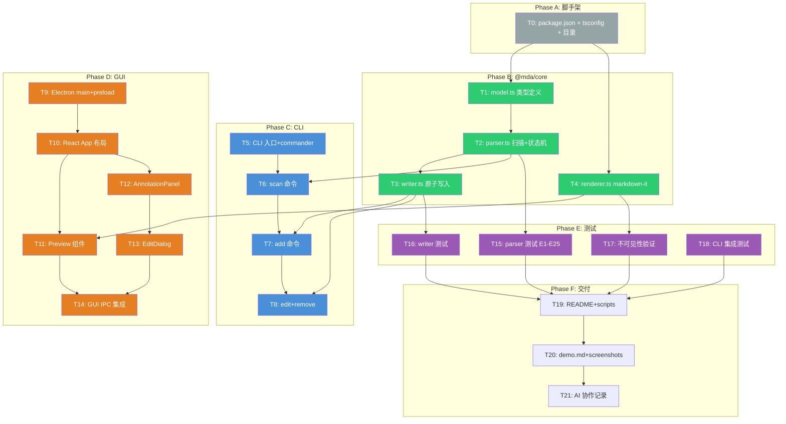

# 实施计划 — Markdown 批注管理工具（MDA）

---

## 设计引用

> 基于 [P1 架构设计](P1-architecture.md) 和 [P2 详细设计](P2-detailed-design.md)。
> 技术栈：TypeScript + Electron + markdown-it（CommonMark 0.31 + GFM 表格）。
> 架构：入口层（CLI/GUI）→ 共享核心 `@mda/core`（parser/writer/renderer/model）→ 文件系统。

---

## 接口定义

### @mda/core 公共 API

```typescript
// ---- model.ts ----

type AnnotationLevel = 'critical' | 'major' | 'minor' | 'info';
type AnnotationStatus = 'open' | 'resolved' | 'wontfix';

interface Annotation {
  id: string;           // UUID v4
  content: string;      // 批注文本，多行以 \n 转义
  tags: string[];
  level: AnnotationLevel;
  status: AnnotationStatus;
  created_at: string;   // ISO 8601
}

interface AnnotationInput {
  content: string;
  tags?: string[];
  level?: AnnotationLevel;
}

interface AnnotationPatch {
  content?: string;
  tags?: string[];
  level?: AnnotationLevel;
  status?: AnnotationStatus;
}

interface Paragraph {
  startLine: number;
  endLine: number;
  text: string;
  annotations: Annotation[];
}

interface ScanResult {
  annotations: Annotation[];
  paragraphs: Paragraph[];
}

// ---- parser.ts ----

/** 扫描文本，返回所有批注和段落归属 */
function parseAnnotations(text: string): ScanResult;

/** 查找指定行号所属的段落 */
function findParagraphByLine(paragraphs: Paragraph[], line: number): Paragraph | null;

/** 按指定行号查找批注 */
function findAnnotationByLine(annotations: Annotation[], line: number): Annotation | null;

// ---- writer.ts ----

/** 添加批注（原子写入），返回新建的 Annotation */
function addAnnotation(
  filePath: string,
  paragraphLine: number,
  input: AnnotationInput
): Promise<Annotation>;

/** 编辑批注（原子写入），返回更新后的 Annotation */
function editAnnotation(
  filePath: string,
  id: string,
  patch: AnnotationPatch
): Promise<Annotation>;

/** 删除批注（原子写入 + 空行压缩） */
function removeAnnotation(filePath: string, id: string): Promise<void>;

// ---- renderer.ts ----

/** 创建配置好的 markdown-it 实例（CommonMark 0.31 + GFM 表格 + 自定义图片 renderer） */
function createMarkdownIt(): MarkdownIt;

/** 渲染 Markdown 为 HTML */
function renderMarkdown(md: MarkdownIt, text: string): string;

// ---- index.ts (barrel export) ----
export { parseAnnotations, findParagraphByLine, findAnnotationByLine };
export { addAnnotation, editAnnotation, removeAnnotation };
export { createMarkdownIt, renderMarkdown };
export type { Annotation, AnnotationInput, AnnotationPatch, AnnotationLevel, AnnotationStatus, Paragraph, ScanResult };
```

### CLI 公共接口（命令签名）

```bash
mda-cli scan <file|dir> [-r] [--format json|table] [--status <s>] [--level <l>]
mda-cli add <file> <line> <content> [--tags <t>] [--level <l>]
mda-cli edit <file> <id> [--content <c>] [--tags <t>] [--level <l>] [--status <s>]
mda-cli remove <file> <id>
```

### GUI 公共接口（入口行为）

```bash
mda              # 空窗口，菜单打开文件
mda <file.md>    # 直接打开指定文件
```

---

## 方案架构图（Mermaid）



---

## 任务 DAG

### Phase A: 项目脚手架

| 任务 | 依赖 | 可并行 | 涉及文件 | 实施步骤 |
|------|------|--------|---------|---------|
| T0.1: npm 初始化 | 无 | 否 | `package.json` | 1. `npm init`，设置 name=`mda`，license=MIT 2. 安装依赖：commander, markdown-it, uuid, zod, chalk, table 3. 安装 devDeps：typescript, @types/node, jest, ts-jest, electron, @types/react 4. 配置 scripts：`build`, `cli`, `gui`, `test`, `coverage` 5. 配置 bin：`mda`→`src/cli/main.ts`, `mda-cli`→`dist/cli/main.js` |
| T0.2: 目录结构 | T0.1 | 否 | 目录 | 1. 创建 `src/core/`, `src/cli/commands/`, `src/gui/renderer/` 2. 创建 `tests/core/`, `tests/cli/` 3. 创建 `tsconfig.json`（target=ES2020, module=commonjs, outDir=dist） 4. 创建 `.gitignore`（node_modules, dist, .tmp） |

### Phase B: 共享核心 @mda/core

| 任务 | 依赖 | 可并行 | 涉及文件 | 实施步骤 |
|------|------|--------|---------|---------|
| T1: 数据模型 | T0.2 | 是（与 T4） | `src/core/model.ts` | 1. 定义 TypeScript 类型（AnnotationLevel, AnnotationStatus, Annotation, AnnotationInput, AnnotationPatch, Paragraph, ScanResult） 2. 定义 Zod 校验 schema（validateAnnotation 函数，检查 6 字段存在 + level/status 枚举值） 3. 导出 UUID 生成函数（crypto.randomUUID）和时间戳生成函数 4. 定义 ANNO_REGEX 正则常量 |
| T2: 解析器 | T1 | 否 | `src/core/parser.ts` | 1. 实现 `parseAnnotations(text)`：按行分割→逐行匹配正则→JSON.parse→validate→状态机归属段落（伪代码见 P2 §3.3.3） 2. 实现 `findParagraphByLine(paragraphs, line)`：二分查找 startLine≤line≤endLine 的段落 3. 实现 `findAnnotationByLine(annotations, line)`：遍历查找 line 匹配的批注 4. 处理 CRLF/LF 换行兼容 |
| T3: 写入器 | T2 | 否 | `src/core/writer.ts` | 1. 实现 `atomicWrite(filePath, content)`：写临时文件→fs.rename 2. 实现 `addAnnotation(filePath, paragraphLine, input)`：定位段落→构造 Annotation→构造批注行→插入→原子写回 3. 实现 `editAnnotation(filePath, id, patch)`：扫描定位 ID→合并 patch→重新序列化→替换该行→原子写回 4. 实现 `removeAnnotation(filePath, id)`：扫描定位 ID→删除批注行→空行压缩（P2 §3.4.3）→原子写回 5. 实现 `verifySourceProtection(origLines, newLines, changedLines)` 自检函数 |
| T4: 渲染器 | T0.2 | 是（与 T1） | `src/core/renderer.ts` | 1. 创建 `createMarkdownIt()`：markdown-it 实例 + CommonMark preset + `markdown-it-gfm-tables` 插件 2. 自定义 image renderer：双重 DOM（img + fallback span with alt），见 P2 §3.6.2 3. 实现 `renderMarkdown(md, text)` 便捷函数 4. 导出 level→color 映射表：`{critical:'#e74c3c', major:'#e67e22', minor:'#f1c40f', info:'#95a5a6'}` |
| T5: 包入口 | T1,T2,T3,T4 | 否 | `src/core/index.ts` | 1. barrel export 所有公共 API |

### Phase C: CLI（mda-cli）

| 任务 | 依赖 | 可并行 | 涉及文件 | 实施步骤 |
|------|------|--------|---------|---------|
| T6: CLI 入口 | T5 | 否 | `src/cli/main.ts` | 1. 引入 commander 2. 注册 4 个命令（scan/add/edit/remove） 3. 全局异常处理（stderr 输出错误，exit 1） 4. 确保 console.log→stdout, console.error→stderr |
| T7: scan 命令 | T6 | 否 | `src/cli/commands/scan.ts` | 1. 实现文件扫描（单文件/目录递归 `-r`） 2. 调用 `parseAnnotations` 3. 筛选（--status/--level，AND 逻辑） 4. `--format json`：JSON.stringify 到 stdout 5. 默认表格格式：ID(截断8位)/文件/行号/段落摘要(前30字)/批注摘要(前30字)/级别/状态 |
| T8: add 命令 | T6 | 否 | `src/cli/commands/add.ts` | 1. 解析参数：file, line(number), content, --tags(逗号split), --level(默认info) 2. 参数校验：文件存在、line>0 3. 调用 `addAnnotation` 4. stdout 输出创建的批注 ID 5. 异常：行号越界→stderr+exit 1 |
| T9: edit 命令 | T6 | 否 | `src/cli/commands/edit.ts` | 1. 解析参数：file, id, --content, --tags, --level, --status 2. 至少一个可选参数需传入 3. 调用 `editAnnotation` 4. stdout 输出更新后批注 JSON 5. 异常：ID 未找到→stderr+exit 1 |
| T10: remove 命令 | T6 | 否 | `src/cli/commands/remove.ts` | 1. 解析参数：file, id 2. 调用 `removeAnnotation` 3. 成功静默（exit 0） 4. 异常：ID 未找到→stderr+exit 1 |

### Phase D: GUI（mda / Electron）

| 任务 | 依赖 | 可并行 | 涉及文件 | 实施步骤 |
|------|------|--------|---------|---------|
| T11: Electron 主进程 | T5 | 是（与 T1-T10 无关，但 T5 编译后） | `src/gui/main.ts`, `src/gui/preload.ts` | 1. 创建 BrowserWindow（标题默认`MDA`，minWidth=900, minHeight=600） 2. 实现菜单：文件→打开（dialog.showOpenDialog filters .md）、文件→重新加载（reload renderer） 3. IPC handler：`open-file`（读文件返回内容）、`write-file`（原子写回）、`open-external-url`（shell.openExternal） 4. 处理命令行参数 `process.argv` 中的文件路径（`mda <file>`） 5. preload.ts：contextBridge.exposeInMainWorld('mdaAPI', { openFile, saveFile, openExternal, onMenuAction }) |
| T12: React 入口 | T11 | 否 | `src/gui/renderer/index.html`, `src/gui/renderer/index.tsx` | 1. HTML shell + React 挂载点 2. 安装 React + ReactDOM（devDeps 补充） 3. 入口 tsx：渲染 `<App />` |
| T13: App 根组件 | T12 | 是（与 T15） | `src/gui/renderer/App.tsx` | 1. 状态管理：filePath, content, annotations, paragraphs, selectedAnnotationId, highlightedParagraphIndex, filters, cursorLine 2. 布局：左侧 Preview（flex:7）+ 右侧 AnnotationPanel（flex:3），resizable 分隔条 3. 文件加载：调用 `window.mdaAPI.openFile()`→content→`parseAnnotations`→渲染 4. 窗口标题更新：`document.title = "MDA - " + path.basename(filePath)` 5. 重新加载：重新读取文件→重新解析→重新渲染 |
| T14: Preview 组件 | T13 | 否 | `src/gui/renderer/Preview.tsx` | 1. 接收 html/paragraphs/highlightedParagraphIndex 作为 props 2. 渲染 markdown-it HTML（dangerouslySetInnerHTML） 3. 批注色条：有批注段落包裹在 div 中，`border-left: 4px solid <level-color>`，同段落多批注取最高级别 4. 段落点击：事件委托监听 click→匹配段落索引→回调 `onParagraphClick(paragraph)` 5. 图片 fallback：markdown-it 自定义 renderer 已内嵌 onerror 逻辑（T4） 6. Ctrl+点击链接：事件委托监听 click→`event.ctrlKey && target.tagName==='A'`→`mdaAPI.openExternal(url)` 7. 滚动到指定段落：`useEffect`+`scrollIntoView`，高亮样式（背景闪黄 1s） |
| T15: AnnotationPanel | T13 | 是（与 T14） | `src/gui/renderer/AnnotationPanel.tsx` | 1. 接收 annotations/paragraphs/selectedAnnotationId/filters/cursorLine + callbacks 2. 筛选器：3 个 FilterGroup（状态 checkbox×3、级别 checkbox×4、标签 chips×N），同维度 OR、跨维度 AND 3. 列表：筛选后排序（按行号升序），每条显示内容(截断50字)/标签徽章(彩色 pill)/级别(色标文字)/状态(图标文字)/时间(本地格式化) 4. 右侧操作：编辑按钮(✏️)→`onEdit(id)`、删除按钮(🗑️)→`confirm('确认删除?')`→`onDelete(id)` 5. 顶部添加按钮：`onAdd(cursorLine)` 6. 列表项点击：`onSelectAnnotation(id)`，样式高亮 7. 选中定位滚动：`useEffect`+`scrollIntoView` |
| T16: EditDialog | T13 | 否 | `src/gui/renderer/EditDialog.tsx` | 1. Modal 弹窗（遮罩层 + 居中表单） 2. add 模式：行号(number,预填defaultLine)、内容(textarea, required)、标签(text,逗号分隔)、级别(select,默认info) 3. edit 模式：内容(textarea,预填)、标签(text,预填逗号join)、级别(select,预填)、状态(select,预填) 4. 保存：表单校验→调用 writer API→写回文件→通知 App 重新加载→关闭弹窗 5. 取消：关闭弹窗，不保存 |
| T17: GUI IPC 集成 | T14,T15,T16 | 否 | `src/gui/main.ts`, `src/gui/renderer/App.tsx` | 1. 端到端联调：打开文件→渲染→添加批注→编辑→删除→重新加载 2. 异常处理：文件不存在弹窗提示（dialog.showErrorBox） 3. 窗口标题同步（main process 侧 `win.setTitle`） 4. 验证 GUI 启动方式：无参→空窗口；`mda <file>`→直接打开 |

### Phase E: 测试

| 任务 | 依赖 | 可并行 | 涉及文件 | 实施步骤 |
|------|------|--------|---------|---------|
| T18: parser 单元测试 | T2 | 否 | `tests/core/parser.test.ts` | 1. 编写 E1-E25 共 25 个边界用例（每个用例：准备输入文本→调用 parseAnnotations→断言输出） 2. 重点验证：空文件(E1)、无批注(E2)、连续批注(E5)、多段落(E6)、JSON 非法(E8-E9)、特殊字符(E10-E11)、CRLF(E21)、无空行段落(E22)、空行压缩(E25) 3. 每个用例包含输入字符串和预期 annotations/paragraphs |
| T19: writer 单元测试 | T3 | 否 | `tests/core/writer.test.ts` | 1. 测试 add：正常添加→验证文件内容+返回 Annotation；行号越界→应 throw 2. 测试 edit：正常编辑→验证文件内容+返回 Annotation；ID 不存在→应 throw；created_at 不变 3. 测试 remove：正常删除→验证文件内容；ID 不存在→应 throw；删除后空行压缩(E25) 4. 测试源文件保护：操作后非批注行逐字节一致（E23） 5. 测试原子写入：mock fs.rename 失败→验证原文件未被修改 6. 测试临时文件清理：rename 失败后 tmp 文件被删除 |
| T20: renderer 测试 | T4 | 否 | `tests/core/renderer.test.ts` | 1. 批注不可见性 3 断言：HTML 不含 `@anno`、不含批注字段值、去除批注行前后渲染结果一致（P2 §3.8） 2. 图片 fallback：验证自定义 renderer 输出的 HTML 含 img+fallback span 双 DOM 3. level→color 映射：验证 4 个级别的颜色值 |
| T21: CLI 集成测试 | T7,T8,T9,T10 | 否 | `tests/cli/` | 1. scan 测试：准备含批注文件→`execSync('node dist/cli/main.js scan ...')`→验证 stdout JSON/表格+exit code 2. add 测试：执行 add→验证 stdout 输出 UUID→读取文件验证批注行存在 3. edit 测试：执行 edit→验证 stdout 输出更新后 JSON→读取文件验证 4. remove 测试：执行 remove→验证 exit 0→读取文件验证批注行已删除 5. 错误场景：文件不存在、行号越界、ID 不存在→验证 stderr 含错误+exit 1 |

### Phase F: 交付

| 任务 | 依赖 | 可并行 | 涉及文件 | 实施步骤 |
|------|------|--------|---------|---------|
| T22: README | T21 | 否 | `README.md` | 1. 项目介绍（一句话） 2. 目录结构（tree） 3. 技术栈及版本（Node≥18, npm≥9, Electron 28, React 18, markdown-it 14） 4. 运行指引（≤3 步）：`npm install`→`npm run build`→GUI: `npm run gui [file]` / CLI: `npm run cli -- scan <file>` 5. 验证方法：`npm test` + `npm run coverage` 6. 覆盖率统计方法：`npm run coverage` 使用 c8 |
| T23: demo 文件 | T22 | 否 | `demo.md` | 1. 创建元素丰富的 Markdown 演示文件：六级标题、表格、列表、代码块、引用、链接、图片（无效 src）、粗斜体、水平线 2. 包含 4 种级别批注（critical/major/minor/info） 3. 包含 3 种状态（open/resolved/wontfix） 4. 包含多标签（bug/ui/docs/question） 5. 包含多批注段落和边界场景 |
| T24: screenshots + video | T23 | 否 | `docs/screenshots/` | 1. 1.png：打开 demo.md 后的完整窗口（含标题栏） 2. 2.png：包含 4 种级别色条的批注区域 3. 3.png：筛选后的界面（按状态/级别/标签任一） 4. video.mp4：10-60 秒录屏（点击段落→点击批注→编辑→删除） |
| T25: AI 协作记录 | T24 | 否 | `docs/prompts/` | 1. prompt-01-p0-requirements.md：P0 需求分析阶段的完整对话 prompt 2. prompt-02-p1-architecture.md：P1 架构设计阶段的完整对话 prompt 3. prompt-03-p2-detailed-design.md：P2 详细设计阶段的完整对话 prompt 4. prompt-04-p3-implementation.md：P3 实现步骤阶段的完整对话 prompt 5. prompt-05-p4-implementation.md：P4 实现阶段的完整对话 prompt |

**总改动预估**：约 2,400 行源码 + 650 行测试 + 200 行配置/文档，涉及 ~30 个文件

---

## 执行主体分工（AI 独立 / 需人工确认）

> 将散落在工作流与协作记录中的人/机分工显式化到任务级。
> - **AI 独立**：AI 可自动产出并以「自动化测试 + `tsc`/`build` 通过」自证，阶段末交用户确认即可。
> - **需人工确认**：存在自动化无法覆盖的判断（GUI 实机交互、视觉/排版、截图录屏、设计取舍），
>   必须由人工实机验证或提供素材后方可推进（与 `workflow.md` Step 4 的 GUI 硬约束一致）。

| 任务 | 执行主体 | 说明 / 人工介入原因 |
|------|----------|---------------------|
| T0.1–T0.2 脚手架 | AI 独立 | 目录/配置生成，`build` 即可自证 |
| T1 model / T4 renderer | AI 独立 | 纯逻辑 + 单元测试守护 |
| T2 parser / T3 writer | AI 独立 | E1–E25 + writer 测试守护（源文件保护、原子写入） |
| T5 barrel / T6 CLI 入口 | AI 独立 | 编译 + 集成测试自证 |
| T7–T10 CLI 子命令 | AI 独立 | CLI 集成测试（stdout/exit code）自证 |
| T11–T17 GUI（Electron/preview/panel/dialog/IPC） | **需人工确认** | GUI 无自动化测试；渲染、双向定位、拖拽、原生模态失焦、代码块交互等只有实机能暴露 |
| T18–T21 测试 | AI 独立 | 测试本身即自证；用例评审可由人工抽查 |
| T22 README / T25 prompts | AI 独立（人工抽查） | 文档产出，准确性由用户确认 |
| T23 demo.md | AI 独立 | 文本产物 |
| T24 截图 + 录屏 | **需人工确认** | 需人工实机操作截屏/录屏，AI 无法产出 |

> 经验法则：**凡涉及 `src/gui/**` 的改动一律归入「需人工确认」**，提交与推进前必须人工实机验证。

---

## 预死亡分析（实施层面）

假设实现过程中出了问题，最可能的 top 3 原因：

| # | 原因 | 可能性 | 检测方式 | 回滚方案 |
|---|------|--------|---------|---------|
| 1 | Electron 主进程 IPC handler 与 renderer 的 contextBridge API 签名不一致导致 GUI 按钮点击后无响应 | 中 | T17 IPC 集成阶段逐接口测试；每个按钮点击后检查 console 无 error | 检查 preload.ts 暴露的方法名与 renderer 调用名一致，修正后重新 build |
| 2 | 段落归属状态机在处理「段落无空行+批注」场景（E22）时出现 off-by-one 错误，批注挂到上一个段落 | 中 | T18 通过 E22 用例后立即发现 | parser.ts 仅 ~160 行，bug 局部修正后重跑全部 E1-E25 |
| 3 | markdown-it 自定义 image renderer 中 innerHTML 注入的 onerror handler 被 React 的虚拟 DOM diff 丢弃或未触发 | 低 | T14 实现后手动打开 demo.md（含无效图片 src），观察是否显示 alt 占位符 | 回退为方案 B（MutationObserver 在容器级监听 img error 事件），改动量约 20 行 |

---

## 回滚策略

1. **任何文件在任意步骤出错时**：`git stash` 暂存当前修改，回到上一个已提交的稳定状态
2. **Phase B-D 模块级回滚**：若某模块实现后测试大面积失败且无法快速修复，删除该模块文件，从 Task 设计重新开始
3. **最坏情况—全量回滚**：`git reset --hard` 回到最后一个通过的 commit，保留 P0-P3 设计文档，重新进入 P4 逐个任务实施

**回滚风险**：设计文档（P0-P3）与代码同步在 git 中管理，回滚代码不会丢失设计文档。

---

## 方案置信度

| 项目 | 内容 |
|------|------|
| **总体置信度** | **88%** |
| **判定依据** | 每个任务粒度 ≤5 分钟，依赖关系明确；核心算法（状态机、原子写入）有伪代码和 25 个边界用例兜底；技术栈（TypeScript + Electron + markdown-it）均为成熟方案 |

### 不确定项（置信度 <80% 的决策点）

| # | 不确定的决策 | 当前置信度 | 不确定原因 | 判断错误的后果 | 补强方式 |
|---|------------|-----------|-----------|--------------|---------|
| D1 | 图片 fallback 使用 markdown-it 自定义 renderer 内嵌 onerror 而非 MutationObserver | 75% | 未在 Electron Chromium 环境中实际验证 img onerror 在 innerHTML 模式下的触发可靠性 | 图片加载失败时显示空白而非 alt 占位符，但核心功能不受影响 | T14 实现后立即手动验证，若不触发则切到 MutationObserver 方案（20 行改动） |
| D2 | 预览区段落点击使用事件委托 + data 属性定位段落索引 | 78% | 段落索引映射到 DOM 的方式（data-para-index 属性）需在 dangerouslySetInnerHTML 后注入 | 段落点击→批注定位功能失效 | T14 实现后用 demo.md 手动点击验证，备选方案为 markdown-it 插件在渲染时注入 data 属性 |

---

## 自检清单

- [x] 接口定义完整（@mda/core 全部 8 个导出函数 + TypeScript 类型签名）
- [x] 任务 DAG 依赖关系清晰，可并行任务已标注（T1∥T4, T7∥T14 等）
- [x] 每个任务包含细粒度实施步骤（2-5 分钟粒度）
- [x] 预死亡分析 ≥ 3 条，含检测方式和回滚方案
- [x] 回滚策略可直接操作（git stash/reset 命令）
- [x] 方案置信度已标注（88%）
- [x] 无 TODO 占位符

---

## 确认状态

状态: **待确认**
