# Markdown工作台软件 V1.0 操作说明书

| 项目 | 内容 |
|------|------|
| 软件全称 | Markdown工作台软件 |
| 软件简称 | MDA |
| 版本号 | V1.0 |
| 文档类型 | 用户操作说明书 |
| 运行环境 | Windows / macOS / Linux 桌面端 |

本说明书所有界面配图均取自本软件实机运行，对象文档为随软件分发的示例文件 `samples/review-demo.md`（一份「预览编辑架构评审记录」），配图采集过程由自动化脚本驱动真实程序实例完成，非示意图或模板图。

---

## 目录

**第一部分 概述与安装**

| 章节 | 内容 |
|------|------|
| 1 | 概述：软件用途、独创技术要点、主要能力、运行环境、术语约定 |
| 2 | 安装与启动：安装包、源码方式、命令行参数、单实例约定 |
| 3 | 界面总览：窗口分区、工具栏、菜单命令、提示与状态 |

**第二部分 基本操作**

| 章节 | 内容 |
|------|------|
| 4 | 文件与工作区：打开新建保存、文件列表、文件管理、最近打开、自动保存 |
| 5 | 预览编辑：两种模式、段落样式、行内格式、列表、插入块、表格、代码块、流程图、公式、图片 |
| 6 | 查找与导航：查找、替换、跳转到行、大纲 |

**第三部分 核心能力**

| 章节 | 内容 |
|------|------|
| 7 | 批注：数据结构、面板、段落级批注、选区级批注、筛选与定位、编辑删除清空、写入时序 |
| 8 | 主题、语言与设置 |
| 9 | 导出与复制 |
| 10 | 命令行工具：输出约定、四个子命令、批量操作注意事项 |
| 11 | 面向自动化程序的本地服务 |

**第四部分 数据与场景**

| 章节 | 内容 |
|------|------|
| 12 | 数据格式与配置 |
| 13 | 典型场景演练：文档评审、脚本汇总、自动化处理、对外发布 |
| 14 | 错误提示与处置 |
| 15 | 常见问题 |
| 16 | 版本信息 |

**第五部分 工程约定**

| 章节 | 内容 |
|------|------|
| 17 | 编码、路径与跨平台约定 |
| 18 | 质量保障：测试分层、关键断言、测试规模 |
| 19 | 安装、更新与卸载 |
| 20 | 与其他工具的互操作 |

**附录**

| 附录 | 内容 |
|------|------|
| A | 快捷键一览 |
| B | 支持的 Markdown 语法范围 |
| C | 界面交互细节约定 |
| D | 示例文档与批注数据 |
| E | 命令行输出样例 |
| F | 规则配置文件 |
| G | 批注写入的执行顺序 |
| H | 模块职责与数据流 |
| I | 导出格式对照 |
| J | 偏好与配置文件清单 |
| K | 常见任务速查 |
| L | 示例文档全文 |
| M | 界面文案与国际化 |
| N | 段落归属推导示例 |
| O | 定界符规划分步示例 |
| P | 查找命中在自定义块内的坐标映射 |
| Q | 表格单元格编辑的实现约定 |
| R | 块操作与撤销语义 |
| S | 图片与流程图的缩放 |
| T | 性能取舍与大文档处理 |
| U | 编辑区键盘操作详表 |
| V | 起始页与最近打开 |
| W | 术语表 |

阅读建议：第一次使用本软件的读者按第一部分与第二部分顺序阅读即可完成日常操作；关注批注协作能力的读者可直接阅读第 7 章与附录 D、G；需要脚本化或自动化集成的读者阅读第 10、11 章与附录 E；希望了解软件独创设计的读者阅读第 1.2 节与附录 N、O、P、Q。

---

## 1. 概述

### 1.1 软件用途

研发与办公场景中，方案草稿、会议纪要、技术说明、知识库条目越来越多地以 Markdown（`.md`）文件形态流转。现有工具存在两处断层：

- 办公套件通常把 Markdown **导入为私有格式**，编辑后难以再以纯文本形态进入版本库；
- 专业编辑器功能强大，但针对「读懂文档 → 改几句 → 写下评审意见 → 交给脚本或自动化程序处理」这条轻量链路显得偏重。

**Markdown工作台软件（MDA）** 面向上述场景，直接读写本地 `.md` 源文件，并在不破坏正文渲染效果的前提下，把结构化的评审意见写入文件本身。软件同时提供图形界面、命令行工具与面向自动化程序的本地服务接口，三者共享同一套解析与写入逻辑。

### 1.2 独创技术要点

下列六点是本软件区别于通用 Markdown 阅读器与通用笔记软件的核心设计，程序鉴别材料亦按此顺序编排。

#### 1.2.1 批注载体：标准注释行承载结构化数据

批注不存放于侧车数据库或私有目录，而是以 Markdown 标准链接型注释独立成行，置于被批注段落的上方：

```text
[comment]: <> (@anno {"id":"ae842f68-c550-49cd-a9d5-df20926dc6d8","content":"这条判据是整个方案的立足点","tags":["架构","约束"],"level":"critical","status":"open","created_at":"2026-09-21T02:22:28.576Z"})
```

识别规则固定为下列正则表达式，其中捕获组用于提取 JSON 主体：

```text
^\[comment\]:\s*<>\s*\(@anno\s+(\{.+?\})\)\s*$
```

由此带来两个直接后果：其一，批注随文件移动、随版本库提交，不会因换机器或换目录而丢失；其二，渲染为 HTML 后批注不可见，对外发布无需额外清理。

#### 1.2.2 段落归属状态机

批注与正文的关联不依赖行号快照，而由解析器按下列规则实时推导：

| 规则 | 说明 |
|------|------|
| 向下归属 | 批注属于其下方第一个正文段落 |
| 空行不打断 | 批注与段落之间的空行不影响归属关系 |
| 孤儿批注 | 文件末尾之后没有正文段落的批注不属于任何段落，但仍可被扫描列出 |
| 段落定义 | 连续的非空行构成一个段落，空行为段落分隔 |
| 围栏感知 | 代码围栏（三个反引号或三个波浪号）内部的批注样例按字面文本处理，不识别为批注 |

围栏感知这一条在解析器、渲染预处理与图形界面三处保持完全一致的行为，否则同一份文档在面板、预览与命令行中会给出互相矛盾的结果。

#### 1.2.3 源文件保护与原子写入

批注的新增、修改、删除**只允许变动批注行**。写盘之前，程序逐行比对正文内容，确认除批注行之外的每一行字节完全一致；校验不通过则中止写入。写盘采用「先写临时文件、再重命名覆盖」的原子方式，写入过程被中断不会损坏原文件。同时检测原文换行风格，原本使用回车换行的文件不会被静默改写为单换行。

由此，评审意见进入版本库后，正文的差异对比不会被批注操作污染。

#### 1.2.4 选区批注锚点与磁盘坐标系

除段落级批注外，本软件支持对任意选中文字添加批注。锚点记录选区的字符起止偏移与被选文字本身，后者用于校验：

```json
"anchor": { "start": 1108, "end": 1119, "quote": "flanking 规则" }
```

锚点的权威坐标系是**磁盘原文**，即包含原换行风格与可能存在的字节序标记。编辑器内部统一使用单换行且不含字节序标记，因此界面在写盘前后进行双向换算。这保证同一条批注在图形界面、命令行与自动化接口中指向同一段文字，不会因文件换行风格不同而整体错位。

#### 1.2.5 三端共享同一核心库

图形界面、命令行工具与本地服务接口共用同一份解析器、写入器与渲染预处理逻辑，避免出现「界面里能改、脚本里读不到」的分裂状态。核心库不依赖任何界面框架，可独立测试。

#### 1.2.6 预览编辑中的行内定界符规划

预览编辑模式下，星号、反引号、波浪号等定界符在界面中隐藏，用户编辑的是可见文字。加粗、斜体一类操作由**定界符融合与拆分规划器**改写源码，而非简单地在选区两侧套一对符号。

举例说明其必要性。文档中若存在两段相邻加粗，源码形如「星号星号加粗一星号星号星号星号加粗二星号星号」。按「星号是否成对」判断，该串每一对都配对、看似合法；但定界符在预览中隐藏后，多余的四个星号会作为可见文字暴露出来。本软件改以「挖掉全部隐藏定界符后的**可见文本**中不得出现裸定界符」为合法性判据，并由规划器合并为单一对定界符后写回源文件。

规划器包含四条算法：

| 算法 | 作用 |
|------|------|
| 融合包裹 | 新增样式时吸收相交或紧邻的同类样式段，只保留一对定界符 |
| 拆分取消 | 部分取消样式时把原样式段拆成左右两段，残段为空则整对删除 |
| 区段清理 | 为非规划路径的变更兜底，清除内容被掏空后残留的裸定界符 |
| 定界符跳越 | 退格与删除跨过隐藏定界符，作用到真正的可见字符 |

拆分取消还需通过渲染探针：部分残段在 Markdown 规范的强调符号定界规则下无法独立成立，朴素拆分会导致用户按下「取消加粗」后整串反而变粗。探针以一次性解析确认「插入文字是否确实无样式」，失败则改为解包残段。

### 1.3 主要能力一览

| 能力轴 | 具体内容 |
|--------|----------|
| 打开与预览 | 工作区文件列表、大纲导航、标准语法与表格扩展、流程图、数学公式、浅色与深色主题 |
| 编辑 | 预览所见即所得编辑、源码模式、段落样式、行内格式、列表、表格、代码块、块插入与重排 |
| 查找 | 查找、替换、全部替换、跳转到行；命中范围覆盖表格单元格与代码块内部 |
| 批注协作 | 段落级与选区级批注、级别与状态与标签、面板筛选、双向定位、一键清空 |
| 导出 | HTML、PDF、Word；富文本复制 |
| 自动化 | 命令行工具与面向自动化程序的本地服务接口 |

### 1.4 运行环境

| 项目 | 要求 |
|------|------|
| 操作系统 | Windows 10 及以上；兼容 macOS 与主流 Linux 桌面 |
| 内存 | 建议 4 GB 及以上 |
| 磁盘 | 安装占用约 200 MB |
| 网络 | 基础功能全部本地运行，无需联网 |
| 源码构建 | 需 Node.js 18 及以上（仅开发者需要） |

### 1.5 术语约定

| 术语 | 含义 |
|------|------|
| 批注 | 一条结构化的评审意见 |
| 批注行 | 承载批注的 Markdown 注释行 |
| 段落 | 由空行分隔的连续非空文本块 |
| 级别 | 批注的严重程度，取值为紧急、重要、次要、提示四档 |
| 状态 | 批注的处理状态，取值为待处理、已解决、不处理三档 |
| 围栏 | 代码块的起止标记 |
| 预览编辑 | 在渲染结果上直接编辑，定界符隐藏，源文件仍为 Markdown |
| 源码模式 | 直接编辑 Markdown 原文，带语法高亮与行号 |

---

## 2. 安装与启动

### 2.1 使用安装包

1. 获取与操作系统匹配的安装包。Windows 平台提供安装程序与免安装压缩包两种形式；
2. 安装程序按向导逐步完成即可，可选择安装目录与是否创建桌面快捷方式；免安装形式解压到任意目录后直接运行主程序；
3. 首次启动时若未指定文件，界面显示起始页，其中包含「新建文档」「打开文件」「打开文件夹」入口与最近打开列表。

### 2.2 源码方式运行

开发者或需要复现构建结果时，可从源码运行：

```text
npm install
npm run build
npm run gui
```

三条命令分别完成依赖安装、编译与资源拷贝、启动图形界面。构建顺序是固定的：图形界面依赖编译产物，未构建直接启动会因缺少核心库而失败。

### 2.3 命令行参数

启动时可直接带上文件路径：

```text
npm run gui -- 路径/文件.md
```

安装版可用主程序名加路径的形式，或把 `.md` 文件的默认打开方式关联到本软件。

### 2.4 单实例约定

程序持有单实例锁。已有窗口运行时再次启动，新进程会把文件交给已有窗口打开并自行退出，而不是开出第二个主窗口。这一行为保证同一文件不会被两个窗口同时编辑而产生写入冲突。

---

## 3. 界面总览

### 3.1 窗口分区

主窗口自左至右依次为：工作区文件列表、文档大纲、编辑与预览区、批注面板。文件列表与批注面板可分别开关，大纲可收起。


图中央为预览编辑区，显示的是渲染后的结果；段落左侧的彩色竖条表示该段落存在批注，颜色对应批注级别。

### 3.2 工具栏

工具栏集中了模式切换、撤销重做、段落样式、行内格式、列表、插入、导出、查找等入口。


| 分组 | 按钮 | 作用 |
|------|------|------|
| 模式 | 文件列表 | 开关左侧工作区文件列表 |
| 模式 | 源码编辑 | 在预览编辑与源码模式之间切换 |
| 模式 | 批注 | 开关右侧批注面板 |
| 历史 | 撤销 / 重做 | 回退或重做编辑操作 |
| 段落 | 段落样式下拉 | 正文与一至六级标题之间转换 |
| 行内 | 加粗 / 斜体 / 下划线 / 删除线 / 行内代码 | 切换选中文字或后续输入的行内格式 |
| 行内 | 超链接 | 为选中文字添加或编辑链接 |
| 列表 | 无序 / 有序 / 任务列表 | 切换行首列表标记 |
| 结构 | 引用 / 表格 / 图片 | 插入对应块 |
| 操作 | 保存 / 导出 / 查找 | 常用文档级操作 |
| 操作 | 插入 | 打开插入菜单 |

按钮悬停时显示名称、快捷键与作用位置，避免误用。


按钮的可用状态随光标位置变化。例如光标位于标题行时，任务列表按钮置灰——规范要求任务标记之后的首个块为段落，在标题行强行加任务标记会使标题退化为普通文字，因此按钮置灰而非静默降级。

### 3.3 菜单命令一览

| 菜单 | 主要命令 |
|------|----------|
| 文件 | 新建、打开文件、打开文件夹、最近文件、保存、另存为、导出 HTML / PDF / Word、打开文件所在目录、退出 |
| 编辑 | 撤销、重做、剪切、复制、粘贴、全选、查找、替换、跳转到行 |
| 视图 | 切换深色模式、编辑栏、批注栏、界面语言、设置、复制预览 |
| 帮助 | 功能与快捷键、检查更新、关于 |

### 3.4 提示与状态

程序不使用系统原生的提示框，一律采用界面内的提示条与对话框。原因在于：原生模态框会使编辑区输入焦点丢失，需要最小化再恢复窗口才能继续输入。界面内提示同时保证了文案可国际化。

---

## 4. 文件与工作区

### 4.1 打开、新建与保存

| 操作 | 方式 |
|------|------|
| 打开文件 | 菜单「文件 → 打开」、起始页入口、把文件拖入窗口、命令行带路径 |
| 打开文件夹 | 菜单「文件 → 打开文件夹」，左侧列出该目录下的 Markdown 文件 |
| 新建 | 菜单「文件 → 新建」，首次保存时弹出另存为对话框 |
| 保存 | 快捷键保存，整篇原子写回并保留原换行风格 |
| 另存为 | 可另存到不同换行风格的文件，锚点坐标系会随目标文件重新探测 |

可打开的扩展名由配置文件统一定义，默认包含 `md`、`markdown`、`txt`、`mdc`。

### 4.2 工作区文件列表

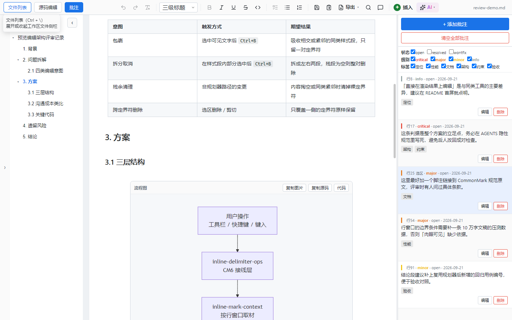

| 操作 | 说明 |
|------|------|
| 切换文档 | 单击文件名；列表获得焦点后可用上下方向键 |
| 调整宽度 | 拖动右缘手柄，双击手柄恢复默认宽度 |
| 收起 | 工具栏「文件列表」按钮或标题栏折叠按钮 |
| 查看完整路径 | 悬停文件名 |
| 清空列表 | 标题栏关闭按钮，仅关闭工作区，**不删除**磁盘文件，也不关闭当前文档 |

### 4.3 文件管理操作

在文件列表中可直接完成文件管理，无需切换到系统文件管理器：

| 操作 | 方式 |
|------|------|
| 复制文件名 | 右键菜单 |
| 复制 / 剪切 / 粘贴 | 右键菜单或对应快捷键 |
| 重命名 | 右键菜单或快捷键，仅修改主文件名 |
| 删除 | 删除键，删除前确认 |
| 移动 | 拖动到目标文件夹行 |
| 复制到其他目录 | 按住控制键拖动 |
| 撤销上一次文件操作 | 撤销快捷键 |

目标文件已存在时弹出冲突对话框，可选择覆盖、自动重命名或取消。所有写操作的路径都限制在工作区根目录之内。

### 4.4 最近打开与会话恢复

菜单「最近文件」记录最近打开的若干文件，悬停显示完整路径，可一键清空。清空只影响列表，不关闭当前文档。

「记住上次会话」开启时，下次启动恢复工作区文件列表并自动打开最近的文件；关闭时不再记录工作区与最近文件，下次启动进入起始页。通过命令行传入的文件始终直接打开，不受该开关影响。

### 4.5 自动保存

自动保存在设置中配置，可选关闭、失焦时保存、每三十秒、每六十秒。自动保存只作用于已经落盘的文件；未命名的新文档不会被自动另存，以避免产生用户预期之外的文件。

---

## 5. 预览编辑

### 5.1 两种编辑模式

软件启动后默认进入预览编辑模式：在渲染结果上直接改字，磁盘保存的仍是原始 Markdown。工具栏「源码编辑」可随时切到源码模式。

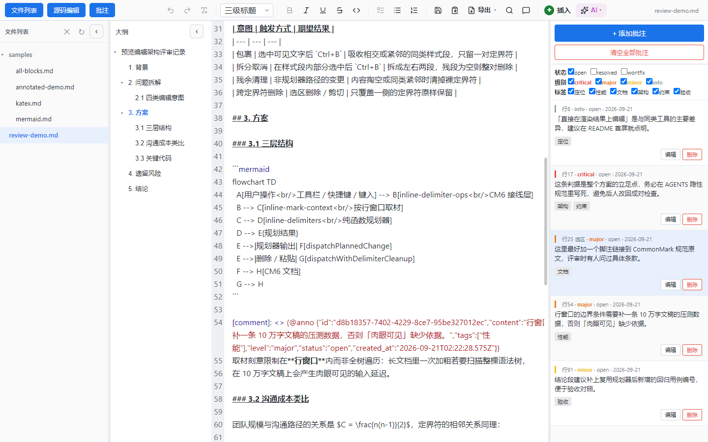

对照上图与 3.1 节的预览界面可以看到同一份文档的两种呈现：预览模式显示渲染结果，源码模式显示包括批注注释行在内的完整原文。这直观说明批注始终以标准注释形态存在于源文件之中。

两种模式共享同一份文档内容与同一个查找栏，切换不会丢失未保存的修改。如需长期默认使用源码模式，可在浏览器开发者工具中将偏好键 `mda-cm6` 设为 `0` 后重载。

### 5.2 段落样式

光标所在段落的样式显示在工具栏下拉框中，可在正文与一至六级标题之间转换。

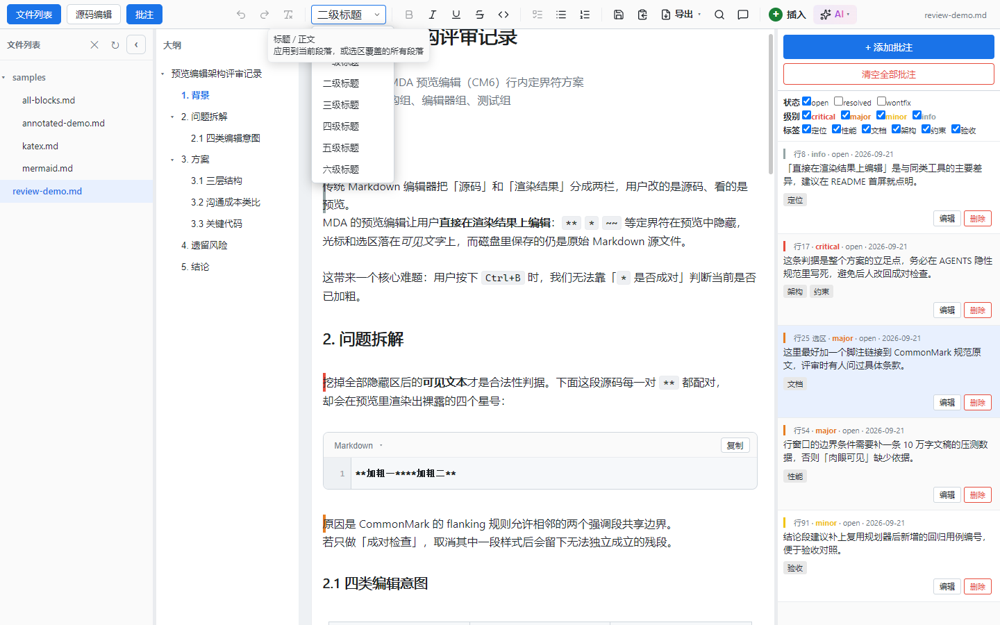

空标题行显示对应级别的占位提示文字，且保持该级别的行高，便于确认当前层级；在空标题行按退格键删除整行，而不是只剥掉标题前缀。

### 5.3 行内格式

选中文字后使用工具栏按钮或快捷键切换加粗、斜体、下划线、删除线、行内代码。未选中文字时，操作作用于**后续输入**：按下加粗后继续键入的文字带加粗样式，此状态在工具栏上以按钮高亮体现。

行内格式的写回由 1.2.6 节所述规划器负责，三种输入路径共用同一套算法：

| 路径 | 处理方式 |
|------|----------|
| 普通键入 | 字符尚未进入文档，直接在当前文档上计算落点 |
| 选区替换 | 先摘除待删区得到干净文档，在其上计算落点后换算回当前坐标 |
| 输入法上屏 | 组字阶段落入文档的是拼音字母，上屏时以汉字替换该段拼音，走与选区替换相同的干净文档路径 |

第三条尤为关键：中文输入法在组字阶段写入文档的并非最终汉字，若只在组字结束事件上做处理，真正产生问题的替换路径会被绕开，表现为「测试全部通过但实际输入就出错」。

### 5.4 列表

无序、有序、任务列表三种按钮只增删行首的列表标记，不改动段落级与字符级样式。因此列表标记与标题可以共存，转为列表后标题样式、大纲条目与块操作入口均保持不变。唯一例外是任务列表：规范要求任务标记之后的首个块为段落，故该按钮在标题行置灰。

### 5.5 插入块

空白行左侧的加号按钮，或在空白行键入斜杠，均可打开插入菜单。

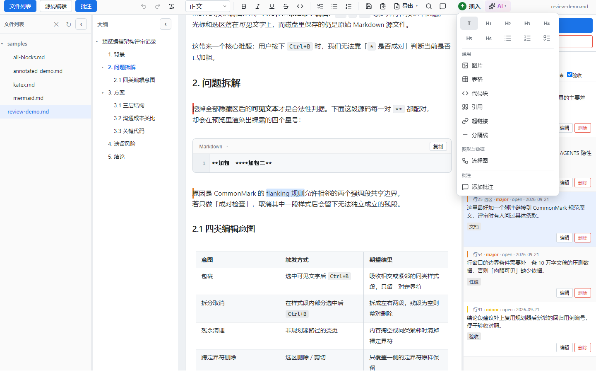

菜单包含标题级别、图片、表格、代码块、引用、超链接、分隔线、流程图与添加批注。插入操作替换当前空行，并把光标置于新块的可编辑位置。

插入分隔线时若上一行存在正文，程序会自动补一个前导空行。这是为了避免分隔线被解析成上一行的下划线式标题——同样的原因，已有文档中缺少空行的下划线式标题会被识别并按分隔线呈现，而不是把下划线当作源码显示出来。

块左侧的手柄可拖动重排，其菜单提供块类型转换、复制与删除。删除块之前程序会把编辑器选区固定到块首且不计入历史，因此删除后一次撤销即可整块还原，光标不会跳回文档开头。

### 5.6 表格

单击单元格即可就地编辑，表格四周出现行列手柄，用于增删行列与调整对齐。

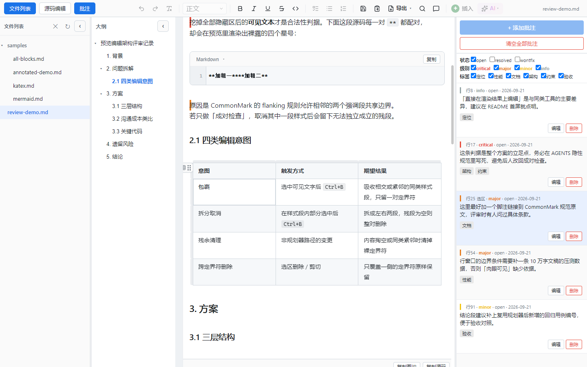

单元格内的行内格式与正文共用同一套规划器。实现上，单元格内容以 Markdown 字符串形态存在、没有可依托的编辑器文档，因此程序为其构造一次性的临时文档作为桥梁，使融合包裹、拆分取消与空对清理在格内同样生效。

表格结构变更、保存文档与关闭窗口这三处操作之前，程序都会先把正在编辑的单元格内容读回文档。否则「改完单元格直接点添加行」会因为重建表格而丢失刚输入的内容，「改完单元格直接保存」会因为文档未被标记为已修改而静默跳过。读回文档会重建表格组件，程序记录并恢复光标所在的单元格与偏移，使保存不打断输入。

### 5.7 代码块

代码块显示语言标签与复制按钮，单击进入块内编辑，支持块内的撤销与重做。


块内编辑使用本地缓冲，失焦时才写回文档，因此在块内连续换行输入不会频繁触发整篇重新渲染。序列化时只去掉首部空行、保留尾部换行，避免代码尾部的空行被反复吞掉。

### 5.8 流程图

以 `mermaid` 为语言标记的代码块渲染为图形，支持流程图、时序图、类图、状态图等类型。渲染离线完成，不需要联网。

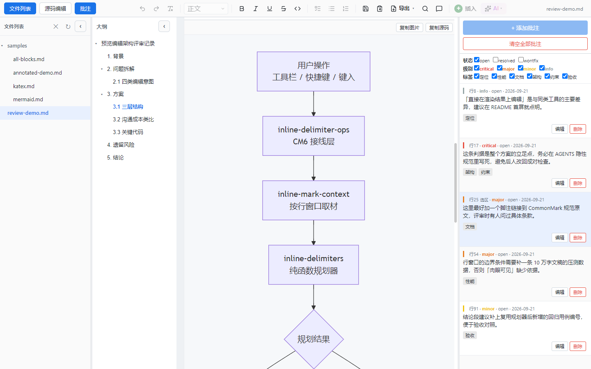

块右上角提供「复制图片」与「复制源码」两个按钮，后者复制的内容带有代码围栏，可直接粘贴到其他 Markdown 文档。单击图形进入缩放查看，支持滚轮缩放、拖动平移与双击复位。缩放时对图形按矢量方式放大而非位图拉伸，因此放大后文字仍然清晰。

### 5.9 数学公式

行内与块级数学公式均可渲染。

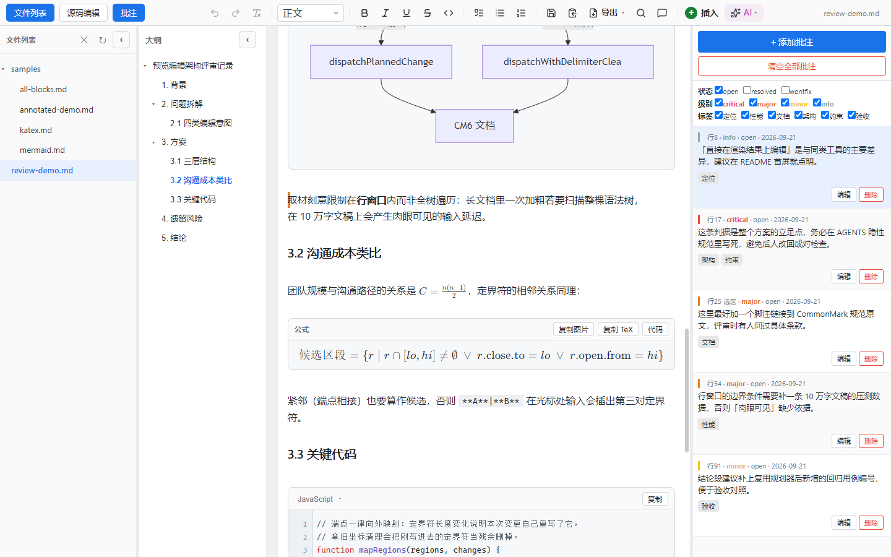

公式在导出与富文本复制时会被栅格化为图片，以便在不支持公式的目标环境中仍能正确显示。

### 5.10 图片

图片支持相对路径，相对当前文件所在目录解析。加载失败时降级为占位文字，不影响其余内容的渲染。

从剪贴板粘贴图片时，程序把图片落盘保存并插入相对路径引用。文件名包含内容摘要，相同字节的图片会复用已有文件而不重复落盘。保存目录可在设置中选择：文档同目录、工作区根目录，或自定义目录。通过对话框选图插入时只写入相对路径，不额外落盘。

程序**不会**自动删除未被引用的粘贴图片，撤销编辑或保存文档都不联动删除磁盘文件，需要时手动清理。这一取舍是为了避免撤销操作意外删除用户仍需要的图片。

---

## 6. 查找与导航

### 6.1 查找

打开查找栏后输入关键字，命中处高亮显示并显示命中计数。


命中范围覆盖正文、表格单元格与代码块内部。后两者是自定义块组件，其内容并不直接存在于编辑器文档的可装饰区域，因此程序按逻辑字符坐标把命中位置映射到组件内部的文本节点上再着色。映射时把换行标记计为一个换行字符、忽略零宽占位字符，否则高亮会整行偏移或落到不匹配的文字上。

选中文字后打开查找栏，查找框自动填入所选内容；该行为在表格单元格与代码块内同样生效。

### 6.2 替换

替换栏提供逐个替换与全部替换。

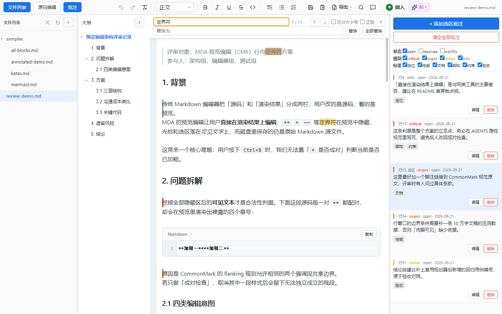

全部替换作为**一次**编辑操作提交，因此一次撤销即可回退本次全部替换结果，而不是需要撤销很多次。替换或撤销之后，查找栏中的命中列表会自动按当前文档内容重新计算，高亮不会停留在已经失效的旧位置。

### 6.3 跳转到行

输入行号可直接跳转，用于与命令行输出的行号对照。

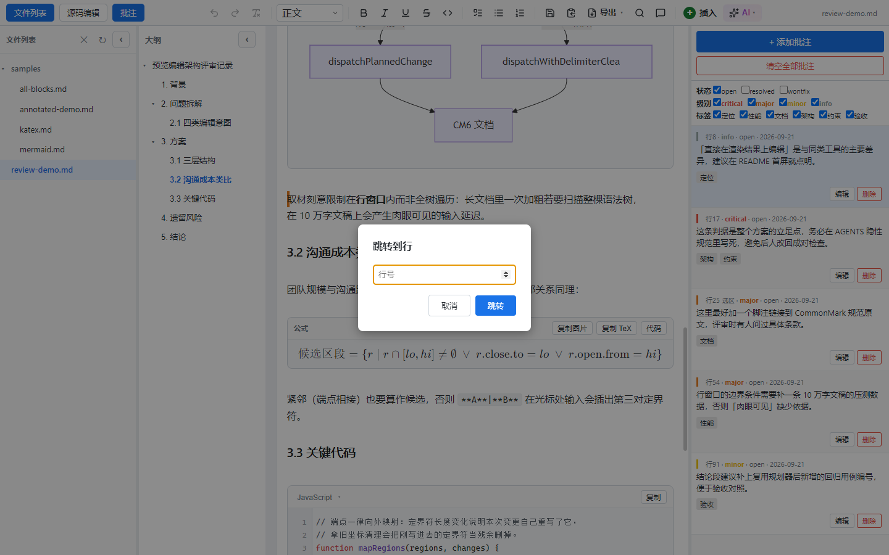

### 6.4 大纲

大纲位于预览区左侧，按标题层级组织，可折叠子项。

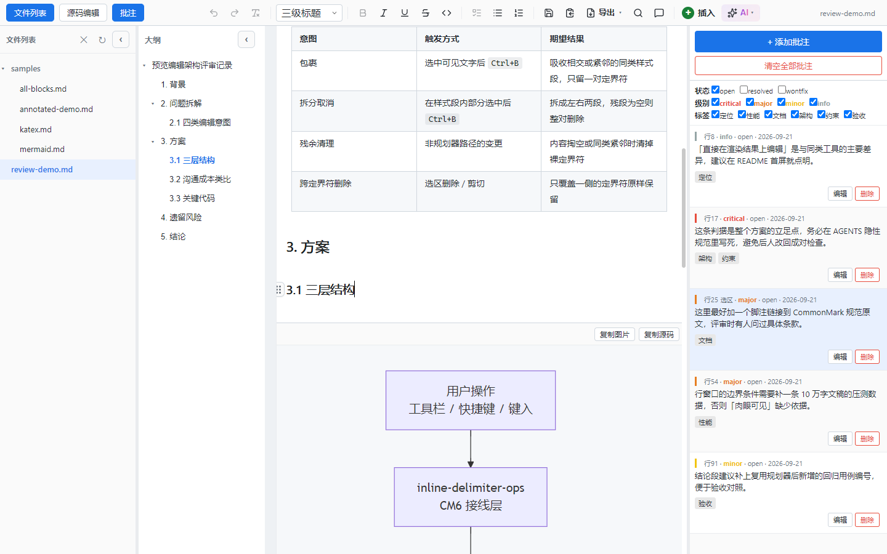

单击条目跳转到对应标题；滚动文档时按「不超过当前位置的最近标题」更新高亮。滚动引起的高亮同步不会展开用户手动折叠的节点，而单击正文标题所触发的同步则会展开其祖先节点，两种场景的展开行为刻意不同。

收放大纲时正文的最大宽度保持不变，避免正文因为栏宽变化而重新换行、产生跳动。

---

## 7. 批注

### 7.1 批注的数据结构

| 字段 | 类型 | 含义 |
|------|------|------|
| id | 字符串 | 通用唯一标识 |
| content | 字符串 | 批注正文 |
| tags | 字符串数组 | 标签列表 |
| level | 枚举 | 紧急、重要、次要、提示 |
| status | 枚举 | 待处理、已解决、不处理 |
| created_at | 字符串 | 创建时间，采用国际标准时间格式 |
| anchor | 对象 | 可选；选区批注的起止偏移与被选文字 |
| line | 数字 | 解析时回填，批注行所在行号 |
| file | 字符串 | 扫描时回填，批注所属文件 |

级别与状态的取值范围由配置文件统一定义，新增与修改入口都要先经枚举校验再落盘。写入非法取值会导致批注无法被解析而静默丢失，因此校验不通过时直接报错而非尝试纠正。

### 7.2 批注面板


面板自上而下为：添加批注与清空全部批注按钮、筛选区、批注列表。列表中每一条显示级别色条、行号、级别、状态、创建日期、批注正文、标签，以及编辑与删除按钮。

级别与颜色的对应关系为：紧急为红色、重要为橙色、次要为黄色、提示为灰色。同一段落存在多条批注时，段落左侧色条取其中最严重的级别颜色。

### 7.3 添加段落级批注

1. 在预览区把光标置于目标段落；
2. 点击面板中的「添加批注」；
3. 在对话框中填写批注正文，选择级别，填写标签（多个标签以逗号分隔）；
4. 确认后程序在该段落**上方**插入一行批注注释，段落左侧出现色条。


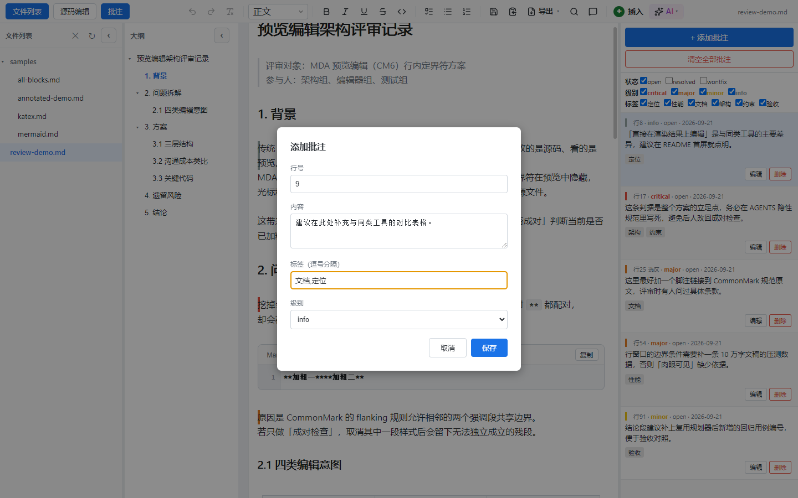

### 7.4 添加选区级批注

1. 在正文中拖选一段文字；
2. 点击「添加选区批注」；
3. 填写内容与级别后确认。

程序把选区的字符起止偏移与被选文字一并写入批注的锚点字段，被批注的文字在预览中以高亮显示。

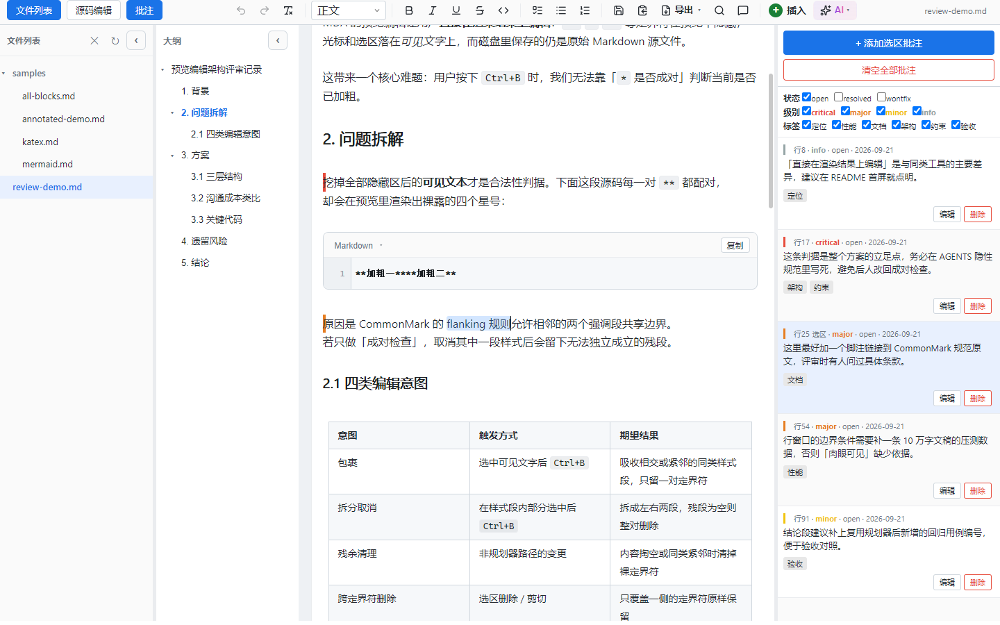

在段落上方插入批注行会使该行之后的字符偏移整体后移，因此程序在插入后会修正同一文件内已有锚点的偏移值，否则先前添加的选区批注会全部失效。

正文被改动导致被选文字与锚点记录不再一致时，界面提示锚点失效，而不会错误地高亮到别处。

### 7.5 筛选与双向定位


筛选支持按状态、级别、标签组合过滤。状态筛选**默认只勾选待处理**，因此列表默认只显示尚未关闭的意见；该选择在当前会话内可以修改，但不做持久化，也不受界面习惯开关影响。

定位关系是双向的：点击批注条目滚动到对应段落或选区；点击预览中的段落色条高亮对应的面板条目。选区批注的定位会同时高亮原选区。

### 7.6 编辑、删除与清空

点击条目上的「编辑」可修改批注正文、级别、标签与状态。典型用法是作者改完正文后把对应批注的状态改为已解决，该条即从默认视图中消失。

「清空全部批注」一次删除当前文件中围栏之外的所有批注行，操作前需要确认。

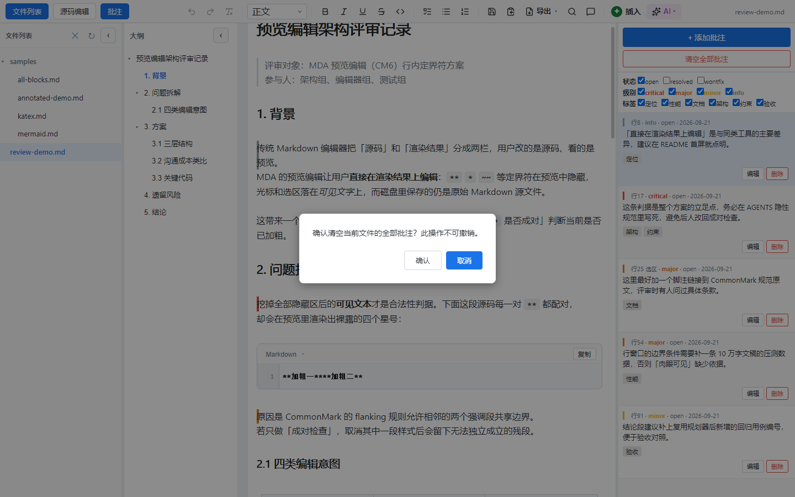

删除批注行后，若其上下都是空行，程序会把两个空行合并为一个，以免文档中留下多余空行；正文原有的空行不受影响。

### 7.7 批注写入与未保存正文的关系

存在未保存的正文修改时，批注写入会先自动保存正文，再执行批注操作；保存失败则中止批注操作。这一顺序是必要的：批注写入基于磁盘上的文件内容进行段落定位与源文件保护校验，若磁盘内容与界面内容不一致，写入结果会覆盖界面中的未保存修改。

连续添加多条批注时，写入请求排队串行执行，同一批次只提示一次。

---

## 8. 主题、语言与设置

### 8.1 深色模式

深色模式默认跟随系统，也可手动切换并记忆选择。代码高亮与流程图配色随主题联动。

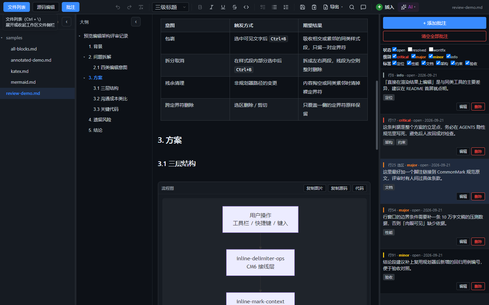

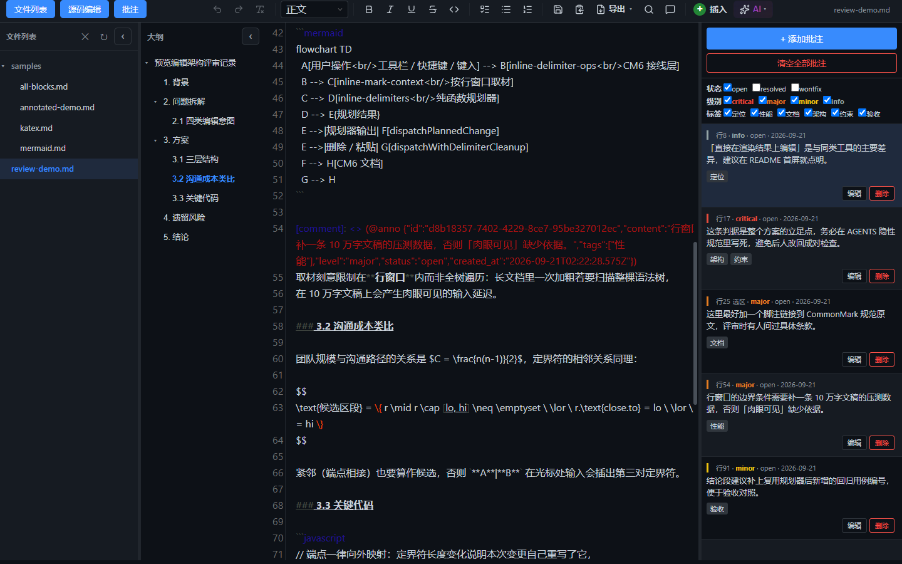

深色模式下图形的缩放层使用深色背景，并中和图形内部接近白色的铺底区域，以避免浅色文字在白底上显得发灰。

### 8.2 界面语言

菜单「视图 → 界面语言」可选跟随系统、中文、英文。所有用户可见文案均取自国际化资源，切换后立即刷新菜单与界面。

### 8.3 设置

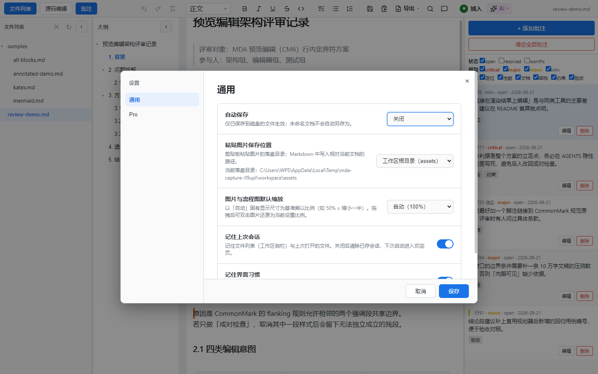


| 设置项 | 可选值 | 说明 |
|--------|--------|------|
| 自动保存 | 关闭 / 失焦 / 每 30 秒 / 每 60 秒 | 仅作用于已落盘文件 |
| 记住界面习惯 | 开 / 关 | 含窗口大小位置、各栏展开状态与分栏宽度 |
| 记住上次会话 | 开 / 关 | 含工作区文件列表与最近打开的文件 |
| 图片与流程图默认缩放 | 自动 / 25% / 50% / 75% | 按各图自动显示宽度乘以比例 |
| 粘贴图片保存目录 | 文档同目录 / 工作区根目录 / 自定义 | 决定粘贴图片的落盘位置 |

设置对话框打开期间，菜单栏保留顶层标签但不可展开下拉，同时拦截菜单命令与窗口关闭请求，避免在设置未生效前触发其他操作。关闭对话框后菜单恢复。

### 8.4 帮助

菜单「帮助 → 功能与快捷键」列出全部能力与快捷键。

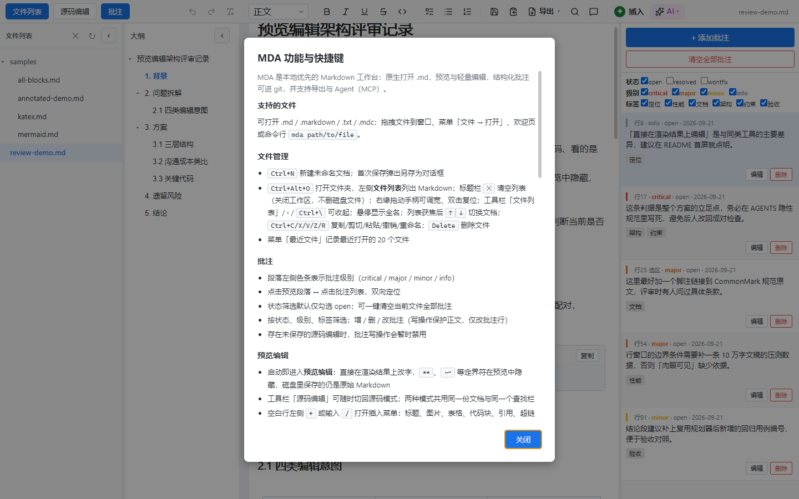


---

## 9. 导出与复制

### 9.1 导出为文件

菜单「文件 → 导出」支持 HTML、PDF、Word 三种格式。导出基于预览渲染结果，因此**不包含**批注内容——批注是注释行，渲染前已被清空为等量空行。导出过程显示进度提示，大文档设有超时保护。

### 9.2 复制预览

「复制预览」把预览内容转换为带内联样式的富文本写入剪贴板，可直接粘贴到图文编辑器。处理过程中流程图、数学公式与本地图片均内嵌为图片数据。

该操作在离屏完成，不滚动预览、不改变界面布局，因此复制过程中界面不会闪烁或跳动。

---

## 10. 命令行工具

命令行工具与图形界面共享同一核心库，因此两者对同一文件的解析与写入结果完全一致。

### 10.1 输出约定

| 约定 | 说明 |
|------|------|
| 数据走标准输出 | 指定 JSON 格式时，标准输出**仅**包含 JSON 数组，无批注时为空数组 |
| 提示走标准错误 | 所有提示、警告、错误一律写入标准错误 |
| 失败即非零退出 | 出错时写入标准错误并以非零状态码退出 |

该约定使命令行输出可以直接用管道交给后续程序处理，不需要额外过滤横幅或提示文字。

### 10.2 扫描批注

```text
mda-cli scan <文件或目录> [-r] [--format table|json] [--status <状态>] [--level <级别>]
```

| 参数 | 说明 |
|------|------|
| 文件或目录 | 扫描目标；目录模式下每条批注回填真实文件路径 |
| -r | 递归扫描子目录 |
| --format | 输出格式，表格或 JSON，默认表格 |
| --status | 按状态过滤 |
| --level | 按级别过滤 |

表格模式按**显示宽度**对齐，中文按两列计算，因此中英混排的批注在等宽终端下列不会错位。JSON 模式的每个对象包含标识、文件、行号、正文、标签、级别、状态与创建时间，选区批注另含锚点。

### 10.3 添加批注

```text
mda-cli add <文件> <行号> <内容> [--tags a,b] [--level <级别>] [--anchor <json>]
```

行号必须属于某个正文段落，指向空行会报错。锚点参数接受 JSON 对象，用于以脚本方式创建选区批注。

### 10.4 编辑与删除

```text
mda-cli edit <文件> <批注标识> [--content <内容>] [--tags a,b] [--level <级别>] [--status <状态>]
mda-cli remove <文件> <批注标识>
```

编辑命令只更新显式给出的字段，其余字段保持原值。

### 10.5 批量操作注意事项

每添加一条批注都会在段落上方插入一行，该行之后的所有行号随之加一。因此同一文件添加多条批注时应当：

1. **串行**执行，不要并行；
2. 优先**自下而上**添加，即先处理行号大的段落；
3. 或者每添加一条后重新扫描，依据新的行号定位下一条。

忽略这一点会导致后续批注挂到错误的段落上，且不会报错。

---

## 11. 面向自动化程序的本地服务

软件提供一个基于标准输入输出的本地服务进程，向支持该协议的自动化程序暴露与命令行一致的读写能力。

| 工具 | 作用 |
|------|------|
| 扫描批注 | 输出格式与命令行的 JSON 模式一致 |
| 添加批注 | 在指定段落行添加批注 |
| 编辑批注 | 修改已有批注的字段 |
| 删除批注 | 按标识删除批注 |
| 读取文件 | 返回文件全文及解析结果 |
| 导出审阅提示 | 依据多文件批注生成供自动化程序使用的审阅提示文本 |

所有写操作的路径必须位于工作区根目录之内，根目录通过环境变量或启动参数指定。越界路径直接拒绝，避免自动化程序误写工作区之外的文件。

批量添加批注时的行号漂移问题与 10.5 节完全相同，需同样处理。

---

## 12. 数据格式与配置

### 12.1 规则配置文件

级别枚举、状态枚举、级别配色、级别严重度、批注行识别正则与可打开扩展名集中定义在一个配置文件中，核心库从中派生运行时常量。这样做的目的是避免同一规则在多处硬编码而逐渐漂移。

| 配置项 | 作用 |
|--------|------|
| levels | 合法的级别枚举 |
| statuses | 合法的状态枚举 |
| levelColors | 各级别在界面与命令行中的配色 |
| levelSeverity | 各级别的严重度数值，决定段落多批注时的取色优先级 |
| annotationPattern | 批注行识别正则，含一个用于提取 JSON 的捕获组 |
| fileExtensions | 可打开的文件扩展名 |

### 12.2 偏好文件

窗口大小位置、各栏展开状态、工作区根目录、最近打开文件、自动保存模式、界面语言、粘贴图片目录等偏好保存在用户目录下，不写入文档所在目录，因此不会污染版本库。

---

## 13. 典型场景演练

### 13.1 场景一：一次完整的文档评审

1. 打开待评审的设计文档；
2. 通读预览，对存在问题的段落添加批注，按严重程度选择级别，按问题类型打标签；
3. 对需要精确定位的措辞使用选区批注；
4. 提交版本库，批注随文件一同进入差异对比，正文部分的差异保持干净；
5. 作者依据面板中待处理的条目逐项修改，改完把对应批注状态改为已解决；
6. 复核时只需查看仍为待处理的条目。

### 13.2 场景二：脚本汇总多份文档的未关闭意见

1. 对目录递归扫描并指定 JSON 输出与状态过滤；
2. 标准输出直接交给后续脚本统计，按级别与标签分组；
3. 依据统计结果决定发布或继续修改。

由于输出约定保证标准输出只含数据，该流程不需要任何文本清洗。

### 13.3 场景三：交由自动化程序批量处理

1. 指定工作区根目录后启动本地服务进程；
2. 自动化程序扫描批注、读取相关文件全文；
3. 自动化程序按需添加或修改批注，注意串行与自下而上的顺序约定；
4. 人工在图形界面中复核自动化程序写入的批注。

### 13.4 场景四：对外发布

1. 确认批注状态均已处理完毕；
2. 导出 HTML 或 PDF 用于分发，导出结果不含批注；
3. 需要粘贴到图文编辑器时使用复制预览。

---

## 14. 错误提示与处置

| 提示 | 触发原因 | 处置 |
|------|----------|------|
| 未找到指定行所属的段落 | 添加批注时指定的行号落在空行上 | 改为指向正文段落所在的行 |
| 锚点失效 | 选区批注记录的文字与当前正文不再一致 | 删除该批注后重新选区添加，或恢复被改动的文字 |
| 检出疑似批注但格式不正确的行 | 在源码模式下改坏了注释括号或 JSON | 按提示的行号修正；此类行不会泄漏到预览中 |
| 存在未保存修改，批注写入已暂停 | 正文处于未保存状态且自动保存失败 | 手动保存后重试 |
| 非法的级别或状态取值 | 命令行传入了枚举之外的值 | 使用配置文件中定义的合法取值 |
| 写操作路径超出工作区 | 自动化程序调用的路径不在工作区根目录内 | 调整路径或重新指定工作区根目录 |
| 导出超时 | 文档过大或包含大量图形 | 拆分文档或减少单次导出内容 |
| 图片加载失败 | 相对路径指向的文件不存在 | 检查路径；界面降级为占位文字，不影响其余内容 |

上述校验均在写盘之前完成，因此失败时源文件保持原样。

---

## 15. 常见问题

**预览里能看到批注正文吗？**
正常情况下不能。批注是 Markdown 注释行，渲染前会被清空为等量空行，因此既不显示内容，也不会使后续内容的行号发生偏移。

**批注中包含括号会不会破坏文档？**
不会。批注行的识别与清空由程序自行完成，不依赖 Markdown 自身的链接引用语法，因此批注正文中出现括号、斜杠等字符都不会导致内容泄漏。

**为什么代码块里的批注样例没有出现在面板中？**
这是设计行为。代码围栏内部的内容按字面文本处理，便于在文档中展示批注格式本身。

**为什么有时暂时不能添加批注？**
通常是正文存在未保存的修改。保存后即可继续。

**命令行输出的 JSON 被其他文字污染了怎么办？**
请确认使用的是编译后的命令行入口并指定了 JSON 格式。包含横幅信息的脚本包装器输出不应直接当作 JSON 解析。

**如何回到源码编辑模式？**
点击工具栏「源码编辑」即可临时切换；若希望每次启动都进入源码模式，可修改对应的界面偏好键。

**文件是回车换行格式，保存后会被改成单换行吗？**
不会。程序在写回前检测原文换行风格并保持一致。

---

## 16. 版本信息

| 项 | 说明 |
|----|------|
| 软件全称 | Markdown工作台软件 |
| 软件版本 | V1.0 |
| 联系邮箱 | mda.markdown@gmail.com |

本说明书描述 V1.0 已交付的能力，包括结构化批注、源文件保护、预览编辑与源码编辑、查找替换、大纲与工作区、导出、命令行工具与本地服务接口。

**关于界面中的「AI」按钮**：AI 辅助写作属增值功能，需另行激活授权并在设置中配置模型服务地址与密钥后方可使用；未激活时点击会提示升级或补填密钥并跳转到设置页，不影响本说明书所述的任何基础能力。第 11 章的本地服务接口为进程间通信，不依赖上述模型服务。

---

## 17. 编码、路径与跨平台约定

### 17.1 文本编码

软件读写文件统一按 UTF-8 处理。文件开头存在字节序标记时，标记被保留：编辑器内部不含该标记，但写回磁盘时原样补回，因此文件的字节形态不会因为一次编辑而改变。

这一处理与选区批注的锚点直接相关。锚点偏移按磁盘原文计算，若编辑器在读入时丢弃字节序标记而写回时不补，全文偏移会整体错开一个字符，表现为定位偏移一位、被选文字校验失败。

### 17.2 换行风格

| 情形 | 行为 |
|------|------|
| 原文含回车换行 | 写回时统一使用回车换行 |
| 原文仅含单换行 | 写回时使用单换行 |
| 新建文档 | 使用运行平台的默认风格 |
| 另存为到不同风格的文件 | 按目标文件的实际风格重新探测 |

编辑器内部统一使用单换行表示，因此一切涉及字符偏移的换算都在读入与写回两端完成。回车换行文件的每一行在磁盘上比编辑器内部多一个字符，忽略这一点会使锚点随行号线性累积偏差。

### 17.3 路径

| 场景 | 规则 |
|------|------|
| 图片与相对链接 | 相对当前文件所在目录解析 |
| 粘贴图片落盘 | 按设置写入文档同目录、工作区根目录或自定义目录，插入相对路径 |
| 文件管理操作 | 限制在工作区根目录之内，工作区根本身视为合法 |
| 自动化接口写操作 | 必须位于指定的工作区根目录之内，越界直接拒绝 |

### 17.4 跨平台差异

三个平台共用同一套界面与核心逻辑，差异仅在系统惯例层面：菜单在 macOS 上遵循该平台的菜单结构；快捷键中的控制键在 macOS 上对应命令键；文件路径分隔符由运行时处理，文档中写入的相对路径始终使用正斜杠，以保证同一文档在不同平台上都能正确解析。

---

## 18. 质量保障

本软件的核心逻辑以自动化测试守护，测试与源码同一版本库维护。

### 18.1 测试分层

| 层次 | 覆盖内容 |
|------|----------|
| 核心库单元测试 | 批注解析、段落归属、围栏识别、写入与源文件保护、原子写入、换行保留、渲染不可见性、锚点校验与偏移修正、大纲提取 |
| 命令行测试 | 四个子命令的参数校验、输出格式、退出码、标准输出与标准错误的分离、表格按显示宽度对齐 |
| 坐标换算单元测试 | 磁盘与编辑器之间的字符偏移换算，覆盖单换行、回车换行与带字节序标记三类文件 |
| 编辑器单元测试 | 行内定界符的融合包裹、拆分取消、区段清理、定界符跳越；键入、选区替换与输入法上屏三条输入路径的结果一致性 |
| 默认模式单元测试 | 偏好未设置、为空、显式开启与显式关闭四种状态下的默认编辑模式 |
| 界面集成测试 | 面板筛选、双向定位、查找高亮、表格与代码块内编辑、块操作、保存前的内容读回 |
| 自动化接口测试 | 各工具的入参校验、工作区边界校验、输出结构 |
| 端到端测试 | 以真实程序实例驱动的界面操作，含本说明书配图的采集过程 |

### 18.2 关键断言

| 保证 | 断言方式 |
|------|----------|
| 源文件保护 | 批注操作前后逐行比对正文，任一字节不同即失败 |
| 渲染不可见性 | 「原文渲染结果」与「去掉批注行后渲染结果」逐字符相等 |
| 换行保留 | 回车换行文件经批注操作后仍为回车换行 |
| 原子性 | 写入过程被中断时原文件保持完整 |
| 锚点一致性 | 同一文件的同一条选区批注在界面与命令行中指向相同的文字 |
| 三端一致性 | 同一文件经界面与命令行解析得到相同的批注与段落集合 |
| 输入路径一致性 | 键入、选区替换与输入法上屏三条路径对同一编辑意图产生相同的源码结果 |

### 18.3 测试规模

截至本版本，自动化测试共 581 个用例、79 个套件，全部通过。语句覆盖率 88.80%，行覆盖率 91.70%，函数覆盖率 95.91%，分支覆盖率 70.89%；其中核心库行覆盖率 95.98%，渲染模块行覆盖率 100%。

### 18.4 输入法相关的测试约定

模拟中文输入法时必须先把**拼音字母**写入文档，再以汉字替换该段拼音，与真实输入法的行为一致。若测试直接把最终汉字当作组字内容，会命中另一条代码路径，恰好绕开真正容易出错的替换路径，形成「测试全部通过而实际输入出错」的假象。本软件的测试用例按前一种方式编写，并在同一行上连续操作，以覆盖跨操作的状态残留。

---

## 19. 安装、更新与卸载

### 19.1 安装形式

| 形式 | 适用场景 | 特点 |
|------|----------|------|
| 安装程序 | 常规使用 | 可选安装目录、创建快捷方式、关联文件类型 |
| 免安装压缩包 | 便携使用、无管理员权限的环境 | 解压即用，配置存放于用户目录 |

两种形式的功能完全一致。用户偏好与会话信息存放在用户目录之下，因此在免安装形式与安装形式之间切换不会丢失设置。

### 19.2 检查更新

菜单「帮助 → 检查更新」查询是否存在新版本。不存在新版本时给出提示；存在时给出版本号与获取方式。该功能是软件中唯一会主动发起网络请求的入口，其余基础能力全部本地运行。

### 19.3 卸载与数据清理

通过系统的程序卸载入口移除软件。卸载不会删除用户创建的文档，也不会删除粘贴图片时落盘的图片文件——这些文件位于用户自己的目录中，属于用户数据。

用户偏好文件位于用户目录之下，如需彻底清理可在卸载后手动删除对应目录。批注本身存放在 Markdown 文件内部，不依赖软件即可用任意文本编辑器查看。

### 19.4 版本兼容

批注格式在同一大版本内保持稳定。旧版本写入的批注可被新版本正常解析；新版本写入的批注若包含旧版本尚不认识的可选字段，旧版本在解析时保留这些字段而不丢弃，从而避免团队内不同版本混用时字段被抹掉。

---

## 20. 与其他工具的互操作

### 20.1 与版本控制系统

批注以标准注释行存在于 Markdown 文件中，因此：

| 场景 | 行为 |
|------|------|
| 提交 | 批注随文件一同提交，无需额外配置 |
| 差异对比 | 批注的新增与修改表现为独立行的增删，正文行不受影响 |
| 分支合并 | 批注行按普通文本行合并；不同分支在同一段落上方各加批注时，合并结果为两条批注并存 |
| 冲突 | 仅当两个分支修改同一条批注行时才产生冲突，按文本冲突处理即可 |

源文件保护正是为这一场景服务：若批注操作会顺带改动正文的空白或换行，每次写批注都会在差异对比中带出大量无关变更。

### 20.2 与纯文本工具

批注行是合法的 Markdown 注释，因此文件在任意文本编辑器、代码托管平台的预览、静态站点生成器中都能正常显示，且批注内容不可见。这意味着引入本软件不会造成工具链锁定：即使不再使用本软件，文件仍然是标准的 Markdown。

### 20.3 与办公套件

需要在办公套件中继续编辑时，导出为 Word 格式。导出基于渲染结果，因此表格、列表、代码块与图片均按渲染后的形态转换，批注不包含在内。若需要把批注也带给不使用本软件的同事，可用命令行导出为表格或 JSON 后另行整理。

### 20.4 与自动化程序

本地服务接口使自动化程序能够读取文档、扫描批注并写入新的批注。典型用法是让自动化程序先通读文档给出初步意见，再由人在图形界面中复核、调整级别与状态。由于三端共享同一核心库，自动化程序写入的批注与人工写入的批注在格式上没有任何区别。

### 20.5 与图文发布平台

「复制预览」把渲染结果转换为带内联样式的富文本。流程图与数学公式在此过程中栅格化为图片，本地图片转为内嵌数据，因此粘贴到图文编辑器后不依赖原始文件即可正确显示。

---

## 附录 A 快捷键一览

| 操作 | 快捷键 |
|------|--------|
| 新建文档 | Ctrl+N |
| 打开文件 | Ctrl+O |
| 打开文件夹 | Ctrl+Alt+O |
| 保存 | Ctrl+S |
| 另存为 | Ctrl+Shift+S |
| 重新加载 | Ctrl+R |
| 打开文件所在目录 | Ctrl+Shift+O |
| 查找 | Ctrl+F |
| 替换 | Ctrl+H |
| 跳转到行 | Ctrl+G |
| 加粗 | Ctrl+B |
| 斜体 | Ctrl+I |
| 下划线 | Ctrl+U |
| 行内代码 | Ctrl+Shift+C |
| 删除线 | Ctrl+Shift+S |
| 任务列表 | Ctrl+Shift+Y |
| 有序列表 | Ctrl+Shift+U |
| 无序列表 | Ctrl+Shift+I |
| 标题升级 | Ctrl+Shift+] |
| 标题降级 | Ctrl+Shift+[ |
| 收起或展开文件列表 | Ctrl+反斜杠 |
| 编辑栏 | Ctrl+E |
| 批注栏 | Ctrl+Shift+B |
| 移动行 | Alt+上 / Alt+下 |
| 重复行 | Alt+Shift+下 |
| 缩进 / 反缩进 | Tab / Shift+Tab |
| 切换深色模式 | Ctrl+Shift+D |
| 复制预览 | Ctrl+Alt+C |
| 设置 | Ctrl+逗号 |
| 功能与快捷键 | F1 |

对话框内按 Tab 键仅在框内循环，按 Esc 键关闭，避免焦点落到编辑区而误改文件。

---

## 附录 B 支持的 Markdown 语法范围

下表列出本软件在预览编辑与导出中支持的语法。「预览编辑」一列说明该语法在预览模式下的呈现方式。

| 语法 | 源码写法 | 预览编辑中的呈现 |
|------|----------|------------------|
| 一至六级标题 | 行首井号加空格 | 按级别放大加粗，井号隐藏，行高按级别区分 |
| 下划线式标题 | 文字下方一行等号或连字符 | 按对应级别标题呈现；缺少空行的连字符行识别为分隔线 |
| 段落 | 连续非空行 | 正文 |
| 强调 | 单星号或单下划线包裹 | 斜体，定界符隐藏 |
| 加粗 | 双星号或双下划线包裹 | 加粗，定界符隐藏 |
| 加粗斜体 | 三星号包裹 | 加粗斜体 |
| 删除线 | 双波浪号包裹 | 删除线 |
| 行内代码 | 反引号包裹 | 等宽字体加半透明底色 |
| 围栏代码块 | 三反引号或三波浪号 | 独立块，显示语言标签与复制按钮，可就地编辑 |
| 缩进代码块 | 四空格缩进 | 等宽块 |
| 流程图 | 语言标记为 mermaid 的围栏块 | 渲染为图形，可缩放、复制图片或源码 |
| 行内公式 | 单美元符号包裹 | 排版后的数学公式 |
| 块级公式 | 双美元符号包裹 | 居中的独立公式块 |
| 无序列表 | 连字符、星号或加号加空格 | 项目符号列表 |
| 有序列表 | 数字加点加空格 | 编号列表 |
| 任务列表 | 列表标记后接方括号 | 可勾选的复选框 |
| 嵌套列表 | 缩进的列表项 | 按层级缩进 |
| 引用块 | 行首大于号 | 左侧竖条，无整行底色 |
| 嵌套引用 | 多个大于号 | 多层竖条 |
| 表格 | 竖线分隔，第二行为分隔行 | 可视化表格，单元格可就地编辑，带行列手柄 |
| 表格对齐 | 分隔行中的冒号 | 左对齐、居中、右对齐 |
| 分隔线 | 三个以上连字符、星号或下划线 | 水平线，可整块选中 |
| 行内链接 | 方括号加圆括号 | 可点击链接，支持编辑气泡 |
| 引用式链接 | 方括号加标签及独立的定义行 | 可点击链接 |
| 自动链接 | 尖括号包裹网址 | 可点击链接 |
| 图片 | 感叹号加方括号加圆括号 | 内嵌图片，可缩放、复制，可拖拽调宽 |
| 硬换行 | 行尾两空格或反斜杠 | 段内换行 |
| 转义字符 | 反斜杠加符号 | 显示符号本身 |
| 文档前置元数据 | 文档开头的三连字符包裹区 | 不参与正文渲染 |
| 批注注释行 | 本软件的注释行格式 | 不可见，仅在批注面板与色条中体现 |
| 普通注释 | 尖括号感叹号形式的注释 | 不可见 |

外部链接在系统默认浏览器中打开，不在软件窗口内导航。预览区的链接点击与文件拖放都不会触发窗口默认导航行为，避免编辑区被替换而无法恢复。

---

## 附录 C 界面交互细节约定

下列约定是长期使用中固化下来的交互细节，说明书列出以便使用者理解软件的行为边界。

| 场景 | 约定 |
|------|------|
| 预览与源码的滚动 | 两者滚动互不牵引，避免相互反馈造成抖动 |
| 点击预览 | 只定位源码位置，不再改动预览的滚动位置 |
| 点击源码行或用方向键移动光标 | 定位预览位置 |
| 大纲与跳转到行 | 可显式地同时跳转两侧 |
| 查找 | 同步预览高亮与横向滚动位置 |
| 图形缩放 | 缩放倍率限制在 0.3 倍至 8 倍，平移时图形中心始终保留在视口内 |
| 图形缩放的默认适配 | 首次打开按视口的约七成宽度适配 |
| 双击图片 | 恢复为设置中的默认缩放比例 |
| 悬停菜单 | 移出后统一延迟约 200 毫秒关闭，避免指针经过时菜单闪烁 |
| 块手柄悬停 | 整块浅色高亮；代码块、流程图与图片不做整块高亮，以免遮挡内容 |
| 对话框 | 界面内实现，不使用系统原生模态框 |
| 帮助对话框 | 单例，重复打开不叠加 |
| 设置对话框 | 打开期间菜单不可展开，并拦截菜单命令与窗口关闭 |

---

## 附录 D 示例文档与批注数据

本说明书全部配图均以示例文档 `samples/review-demo.md` 为对象。该文档随软件分发，内容为一份真实结构的评审记录，覆盖标题、引用、强调、行内代码、围栏代码块、流程图、数学公式、表格、任务列表、分隔线与批注等元素，可用于验证软件各项能力。

### D.1 示例文档中的批注

文档包含五条批注，覆盖四个级别中的三档与三类标签，其中一条为选区批注。

| 标识前缀 | 行号 | 级别 | 状态 | 标签 | 批注正文 |
|----------|------|------|------|------|----------|
| 31cfb40b | 8 | 提示 | 待处理 | 定位 | 「直接在渲染结果上编辑」是与同类工具的主要差异，建议在首屏就点明 |
| ae842f68 | 17 | 紧急 | 待处理 | 架构、约束 | 这条判据是整个方案的立足点，务必在规范中写死，避免后人改回成对检查 |
| 5bd14e1b | 25 | 重要 | 待处理 | 文档 | 这里最好加一个脚注链接到规范原文，评审时有人问过具体条款 |
| d8b18357 | 54 | 重要 | 待处理 | 性能 | 行窗口的边界条件需要补一条十万字文稿的压测数据 |
| 41245377 | 91 | 次要 | 待处理 | 验收 | 结论段建议补上复用规划器后新增的回归用例编号 |

其中标识以 5bd14e1b 开头的一条为选区批注，其锚点字段为：

```json
"anchor": { "start": 1108, "end": 1119, "quote": "flanking 规则" }
```

该锚点指向文档正文中「flanking 规则」六个字符，起止偏移按磁盘原文计算。

### D.2 批注行在源文件中的实际形态

以级别为紧急的那一条为例，它在源文件中占据独立一行，位于被批注段落的上方：

```text
[comment]: <> (@anno {"id":"ae842f68-c550-49cd-a9d5-df20926dc6d8","content":"这条判据是整个方案的立足点，务必在规范里写死，避免后人改回成对检查。","tags":["架构","约束"],"level":"critical","status":"open","created_at":"2026-09-21T02:22:28.576Z"})
```

该行之后紧跟的正文段落即为被批注对象。渲染时这一行被清空为一个空行，行数不变，因此段落行号在预览与源码之间保持一致。

### D.3 示例文档的结构

| 章节 | 内容要点 | 覆盖的语法元素 |
|------|----------|----------------|
| 标题与引言 | 评审对象与参与人 | 一级标题、引用块 |
| 1 背景 | 预览编辑与传统双栏编辑的差异 | 二级标题、加粗、强调、行内代码 |
| 2 问题拆解 | 可见文本判据与规范中的定界规则 | 围栏代码块、选区批注 |
| 2.1 四类编辑意图 | 包裹、拆分取消、残余清理、跨定界符删除 | 三级标题、表格 |
| 3.1 三层结构 | 从用户操作到文档写入的调用链 | 流程图 |
| 3.2 沟通成本类比 | 组合数公式与候选区段定义 | 行内公式、块级公式 |
| 3.3 关键代码 | 端点映射方向的取值理由 | 带语言标记的围栏代码块 |
| 4 遗留风险 | 四项待办与已完成项 | 任务列表 |
| 5 结论 | 评审通过与复用结论 | 分隔线、斜体 |

---

## 附录 E 命令行输出样例

### E.1 表格输出

对示例文档执行扫描并使用表格格式，输出如下（为适应页宽，此处对过长列做了省略标记）：

```text
ID        文件                  行号  段落摘要                  批注摘要                  级别      状态
------------------------------------------------------------------------------------------------------
31cfb40b  samples/review-dem…   8     传统 Markdown 编辑器把…   「直接在渲染结果上编辑…  info      open
ae842f68  samples/review-dem…   17    挖掉全部隐藏区后的可见…   这条判据是整个方案的立…  critical  open
5bd14e1b  samples/review-dem…   25    原因是 CommonMark 的…     这里最好加一个脚注链接…  major     open
d8b18357  samples/review-dem…   54    取材刻意限制在行窗口内…   行窗口的边界条件需要补…  major     open
41245377  samples/review-dem…   91    方案通过评审。行内定界…   结论段建议补上复用规划…  minor     open
```

列宽按**显示宽度**计算，中文字符按两列计入，因此中英混排时各列仍然对齐。

### E.2 JSON 输出

同一文档使用 JSON 格式时，标准输出仅包含数组本身，便于直接交给后续程序：

```json
[
  {
    "id": "ae842f68-c550-49cd-a9d5-df20926dc6d8",
    "file": "samples/review-demo.md",
    "line": 16,
    "content": "这条判据是整个方案的立足点，务必在规范里写死，避免后人改回成对检查。",
    "tags": ["架构", "约束"],
    "level": "critical",
    "status": "open",
    "created_at": "2026-09-21T02:22:28.576Z"
  },
  {
    "id": "5bd14e1b-ba9b-431e-acbb-f48c904942fd",
    "file": "samples/review-demo.md",
    "line": 24,
    "content": "这里最好加一个脚注链接到规范原文，评审时有人问过具体条款。",
    "tags": ["文档"],
    "level": "major",
    "status": "open",
    "created_at": "2026-09-21T02:22:28.578Z",
    "anchor": { "start": 1108, "end": 1119, "quote": "flanking 规则" }
  }
]
```

### E.3 过滤与组合

按级别与状态过滤可组合使用，例如只列出尚未处理的紧急问题；目录模式配合递归参数可跨文件汇总，每条记录的文件字段为真实文件路径而非目录名。

---

## 附录 F 规则配置文件

下列配置集中定义了批注规则，核心库据此派生运行时常量。修改后需重新构建。

```json
{
  "levels": ["critical", "major", "minor", "info"],
  "statuses": ["open", "resolved", "wontfix"],
  "levelColors": {
    "critical": "#e74c3c",
    "major": "#e67e22",
    "minor": "#f1c40f",
    "info": "#95a5a6"
  },
  "levelSeverity": {
    "critical": 3,
    "major": 2,
    "minor": 1,
    "info": 0
  },
  "annotationPattern": "^\\[comment\\]:\\s*<>\\s*\\(@anno\\s+(\\{.+?\\})\\)\\s*$",
  "fileExtensions": ["md", "markdown", "txt", "mdc"]
}
```

其中严重度数值决定同一段落存在多条批注时色条的取色优先级，数值越大越严重。

---

## 附录 G 批注写入的执行顺序

批注的新增、修改、删除都遵循同一条固定流程，图形界面与命令行完全一致：

| 步骤 | 动作 | 失败时的处理 |
|------|------|--------------|
| 1 | 读取磁盘文件全文 | 文件不存在或无读权限则报错退出 |
| 2 | 解析批注并构建段落 | 解析失败则报错退出 |
| 3 | 按行号定位目标段落，或按标识定位目标批注 | 定位失败则报错，提示行号不属于任何段落 |
| 4 | 校验级别与状态取值 | 取值非法则报错，不落盘 |
| 5 | 生成或改写批注行 | —— |
| 6 | 逐行比对正文，确认正文字节未变 | 校验不通过则中止写入，源文件保持原样 |
| 7 | 检测原文换行风格 | —— |
| 8 | 写入临时文件 | 写入失败则清理临时文件并报错 |
| 9 | 重命名覆盖原文件 | 重命名失败则清理临时文件并报错 |
| 10 | 修正同文件内已有选区批注的偏移 | —— |

第 6 步是源文件保护的实现位置。任何绕过该步骤的写入路径都不被允许。第 10 步针对新增批注：新插入的批注行使其后的字符偏移整体后移，若不修正，先前添加的选区批注会全部失效。

图形界面在上述流程之前另有一步：若正文存在未保存的修改，先整篇原子写回正文，再进入第 1 步。这是因为流程基于磁盘内容工作，界面与磁盘不一致时会覆盖未保存的修改。

---

## 附录 H 模块职责与数据流

软件按分层组织，界面层与命令行层单向依赖核心库，核心库不反向依赖任何界面代码，也不引入界面框架。

| 模块 | 职责 | 明确不做的事 |
|------|------|--------------|
| 类型与枚举 | 数据类型定义、枚举常量、枚举守卫 | 不含业务逻辑与文件读写 |
| 解析器 | 解析批注、构建段落、计算归属 | 不写文件 |
| 写入器 | 批注的新增、修改、删除、清空；原子写入、源文件保护、空行压缩、换行保留 | 不负责渲染与界面输出 |
| 渲染器 | Markdown 到 HTML 的渲染与渲染前预处理 | 不注入界面专用属性，以保持渲染结果的等价性 |
| 锚点 | 选区锚点的校验与偏移修正 | 不感知界面坐标 |
| 大纲 | 标题树提取 | 不感知滚动位置 |
| 命令行层 | 参数解析、输入校验、输出格式化 | 不重写核心逻辑 |
| 界面主进程 | 窗口、菜单、文件读写的进程间通信 | 不直接实现批注写入 |
| 界面桥接层 | 向界面暴露核心能力，并叠加界面专用的行号标注 | 不向界面层暴露文件系统与模块加载能力 |
| 界面渲染层 | 纯界面逻辑，通过桥接层调用核心能力 | 不自行实现解析、写入或拼接批注行 |

写操作的数据流固定为：读取文件、解析批注、定位目标、改写批注行、校验正文未变、按原换行风格原子写入。图形界面与命令行走的是同一条链路。

渲染前的预处理包含以下步骤，顺序不可调换：

| 顺序 | 处理 | 原因 |
|------|------|------|
| 1 | 去掉文件开头的字节序标记 | 否则首行标题的井号不在行首，会被当作普通段落 |
| 2 | 清空前置元数据区 | 该区不参与正文渲染 |
| 3 | 把围栏之外的批注行清空为空行 | 保留行数，使行号标注不发生偏移 |
| 4 | 为伪子条目补硬换行 | 避免带序号的子条目与父列表项合并成一段 |
| 5 | 改写紧跟正文的下划线式分隔线 | 避免分隔线被解析为上一行的下划线式标题 |
| 6 | 清空围栏之外的普通注释 | 在不开启原始 HTML 解析的前提下隐藏注释 |

第 3 步不能改用 Markdown 自身的链接引用定义来隐藏批注：批注正文中若包含括号，会破坏该语法从而导致批注内容泄漏到渲染结果中。

---

## 附录 I 导出格式对照

| 格式 | 适用场景 | 包含批注 | 说明 |
|------|----------|----------|------|
| HTML | 网页发布、邮件正文 | 否 | 样式内联，可独立打开 |
| PDF | 归档、打印、外发评审稿 | 否 | 分页由渲染引擎处理 |
| Word | 需要在办公套件中继续编辑 | 否 | 由 HTML 转换而来，复杂排版可能需微调 |
| 富文本复制 | 粘贴到图文编辑器 | 否 | 流程图、公式与本地图片内嵌为图片 |
| 原始 Markdown | 版本库、交给脚本处理 | 是 | 即源文件本身 |

只有最后一种保留批注，其余四种在渲染阶段已把批注清空，因此对外分发无需额外清理步骤。

---

## 附录 J 偏好与配置文件清单

| 位置 | 内容 | 是否随文档走 |
|------|------|--------------|
| 版本库内的规则配置 | 级别与状态枚举、配色、严重度、批注行正则、可打开扩展名 | 是，随软件分发 |
| 用户目录下的工作区偏好 | 工作区根目录、最近打开文件、窗口大小与位置、各栏展开状态与分栏宽度、会话与布局记忆开关 | 否 |
| 用户目录下的软件设置 | 粘贴图片保存目录及自定义路径 | 否 |
| 浏览器本地存储键 | 主题、界面语言、自动保存模式、默认编辑模式、图片默认缩放、界面习惯记忆 | 否 |

所有用户偏好均存放在用户目录之下，不写入文档所在目录，因此不会污染版本库。批注面板的状态筛选刻意不做持久化，每次启动都回到「只显示待处理」。

---

## 附录 K 常见任务速查

| 我想…… | 操作路径 |
|---------|----------|
| 打开一个文件夹里的所有 Markdown | 菜单「文件 → 打开文件夹」 |
| 在渲染结果上直接改字 | 默认即为该模式，直接编辑 |
| 看到 Markdown 原文 | 工具栏「源码编辑」 |
| 给某段话写评审意见 | 光标置于该段，批注面板「添加批注」 |
| 给某几个字写评审意见 | 选中文字后「添加选区批注」 |
| 只看还没处理的意见 | 批注面板状态筛选，默认已是此状态 |
| 把意见标为已处理 | 条目「编辑」，状态改为已解决 |
| 一次清掉所有意见 | 批注面板「清空全部批注」 |
| 查找代码块里的文字 | 直接查找，命中范围已覆盖代码块 |
| 一次撤销整次全部替换 | 全部替换后按一次撤销 |
| 把选中的词填进查找框 | 选中后打开查找栏，自动填入 |
| 插入一个表格 | 空白行左侧加号，或在空白行键入斜杠 |
| 调整表格行列 | 单击单元格后使用四周的行列手柄 |
| 重排段落顺序 | 拖动块左侧手柄 |
| 插入剪贴板里的截图 | 直接粘贴，图片自动落盘并插入相对路径 |
| 把流程图发给别人 | 块右上角「复制图片」或「复制源码」 |
| 粘贴到图文编辑器 | 菜单「视图 → 复制预览」 |
| 导出不含批注的稿件 | 菜单「文件 → 导出」，选择所需格式 |
| 用脚本汇总多份文档的意见 | 命令行扫描，指定目录、递归与 JSON 格式 |
| 让自动化程序读写批注 | 启动本地服务进程并指定工作区根目录 |
| 切换界面语言 | 菜单「视图 → 界面语言」 |
| 改自动保存策略 | 菜单「视图 → 设置」 |
| 让下次启动恢复上次的文件 | 设置中开启「记住上次会话」 |
| 查所有快捷键 | 菜单「帮助 → 功能与快捷键」 |

---

## 附录 L 示例文档全文

下列内容为示例文档 `samples/review-demo.md` 的正文（已省略其中的批注注释行，批注数据见附录 D）。本说明书的全部界面配图均以该文档为对象。

```text
# 预览编辑架构评审记录

> 评审对象：MDA 预览编辑（CM6）行内定界符方案
> 参与人：架构组、编辑器组、测试组

## 1. 背景

传统 Markdown 编辑器把「源码」和「渲染结果」分成两栏，用户改的是源码、看的是预览。
MDA 的预览编辑让用户直接在渲染结果上编辑：强调与代码等定界符在预览中隐藏，
光标和选区落在可见文字上，而磁盘里保存的仍是原始 Markdown 源文件。

这带来一个核心难题：用户按下加粗快捷键时，我们无法靠「符号是否成对」判断当前是否已加粗。

## 2. 问题拆解

挖掉全部隐藏区后的可见文本才是合法性判据。下面这段源码每一对定界符都配对，
却会在预览里渲染出裸露的四个星号：

    **加粗一****加粗二**

原因是 CommonMark 的 flanking 规则允许相邻的两个强调段共享边界。
若只做「成对检查」，取消其中一段样式后会留下无法独立成立的残段。

### 2.1 四类编辑意图

| 意图 | 触发方式 | 期望结果 |
| --- | --- | --- |
| 包裹 | 选中可见文字后按加粗 | 吸收相交或紧邻的同类样式段，只留一对定界符 |
| 拆分取消 | 在样式段内部分选中后按加粗 | 拆成左右两段，残段为空则整对删除 |
| 残余清理 | 非规划器路径的变更 | 内容掏空或同类紧邻时清掉裸定界符 |
| 跨定界符删除 | 选区删除或剪切 | 只覆盖一侧的定界符原样保留 |

## 3. 方案

### 3.1 三层结构

（此处为流程图：用户操作经接线层、按行窗口取材层，进入纯函数规划器；
规划结果按来源分别走「规划输出派发」与「删除粘贴清理派发」两条路径写入文档。）

取材刻意限制在行窗口内而非全树遍历：长文档里一次加粗若要扫描整棵语法树，
在十万字文稿上会产生肉眼可见的输入延迟。

### 3.2 沟通成本类比

团队规模与沟通路径的关系是组合数公式，定界符的相邻关系同理：
候选区段为与选区相交、或端点与选区端点相接的全部同类样式段。

紧邻（端点相接）也要算作候选，否则在两段样式之间的光标处输入会插出第三对定界符。

### 3.3 关键代码

（此处为带语言标记的代码块：端点一律向外映射；定界符长度变化说明本次变更
自己重写了它，拿旧坐标清理会把刚写进去的定界符当残余删掉。）

## 4. 遗留风险

- 已完成：拆分取消后的残段需过渲染探针，确认插入文字确实无样式
- 已完成：输入法组字阶段落盘的是拼音，规划必须基于摘掉待删区的干净文档
- 待办：表格单元格内没有编辑器文档可依托，需用一次性状态搭桥
- 待办：超长行的行窗口取材成本待压测

## 5. 结论

方案通过评审。行内定界符编辑与表格单元格编辑复用同一套规划器，
避免「格内是独立王国」导致的行为漂移。

本文档同时作为 MDA 预览编辑、批注、导出能力的演示样张。
```

该文档刻意覆盖了软件支持的大部分语法元素：一级至三级标题、引用块、加粗与强调、行内代码、两种围栏代码块、流程图、行内与块级数学公式、表格、任务列表、分隔线，以及五条不同级别的批注（其中一条为选区批注）。因此它既是功能演示样张，也是回归测试与配图采集的共同对象。

---

## 附录 M 界面文案与国际化

界面中所有对用户可见的文案——菜单项、对话框、提示条、工具栏按钮与提示、帮助正文、输入框占位文字——均取自国际化资源，不在业务代码中硬编码。中文与英文两套文案同步维护，新增功能时两者一并落地。

语言切换入口为菜单「视图 → 界面语言」，可选跟随系统、中文、英文。切换后主进程菜单与渲染界面同时刷新，无需重启。

---

## 附录 N 段落归属推导示例

批注与正文的关联不依赖保存时的行号快照，而由解析器按固定规则实时推导。下面以四个具体文档片段说明推导过程。

### N.1 基本情形

| 行号 | 内容 |
|------|------|
| 1 | 批注行甲 |
| 2 | 正文第一段第一行 |
| 3 | 正文第一段第二行 |

推导结果：批注甲归属于第 2 至第 3 行构成的段落。段落的起始行为 2，因此界面在第 2 行左侧绘制色条。

### N.2 批注与段落之间存在空行

| 行号 | 内容 |
|------|------|
| 1 | 批注行乙 |
| 2 | （空行） |
| 3 | 正文段落 |

推导结果：批注乙仍归属于第 3 行的段落。中间的空行不打断归属关系。这一规则使得用户可以为了源码可读性而在批注与正文之间留空行，不影响功能。

### N.3 多条批注归属同一段落

| 行号 | 内容 |
|------|------|
| 1 | 批注行丙（级别：次要） |
| 2 | 批注行丁（级别：紧急） |
| 3 | 正文段落 |

推导结果：丙与丁同时归属于第 3 行的段落。段落左侧色条取两者中更严重的级别，即紧急对应的红色。面板中两条批注按各自级别分别显示。

### N.4 孤儿批注

| 行号 | 内容 |
|------|------|
| 1 | 正文段落 |
| 2 | （空行） |
| 3 | 批注行戊 |
| 4 | （文件结束） |

推导结果：批注戊之后没有正文段落，因此不属于任何段落，成为孤儿批注。它仍会出现在扫描结果中，但预览里没有对应的段落色条。这一情形通常出现在用户删除了被批注的段落而保留了批注之后。

### N.5 围栏内的批注样例

| 行号 | 内容 |
|------|------|
| 1 | 围栏起始标记 |
| 2 | 形如批注行的示例文本 |
| 3 | 围栏结束标记 |
| 4 | （空行） |
| 5 | 正文段落 |

推导结果：第 2 行位于代码围栏内部，按字面文本处理，**不**识别为批注，也不会被渲染前预处理清空。因此第 5 行的段落没有批注，而第 2 行的内容在预览中作为代码正常显示。这使得文档可以展示批注格式本身——本说明书第 1.2.1 节即依赖这一行为。

---

## 附录 O 定界符规划分步示例

本附录以具体的字符序列说明 1.2.6 节所述四条算法的执行过程。为便于阅读，以下用「星2」代表两个连续星号，用竖线代表光标位置，用方括号标出选区。

### O.1 融合包裹

初始源码：`星2 加粗 星2` 之后紧跟文字「测试」，即预览中显示为加粗的「加粗」与普通的「测试」。

用户选中「测试」并按下加粗。朴素做法是在「测试」两侧各加一对定界符，得到两段相邻的加粗；如 1.2.6 节所述，这会在预览中暴露出四个裸露的星号。

规划器的做法是识别出左侧紧邻的同类样式段（其闭定界符的结束位置恰好等于选区起始位置），将其吸收，输出单一对定界符包裹「加粗测试」。

判定「紧邻」时，闭定界符结束位置等于选区起点、或开定界符起始位置等于选区终点，两种情况都算紧邻，而不仅限于区间相交。否则在两段样式之间的光标处输入会插出第三对定界符。

### O.2 拆分取消

初始源码为加粗的「加粗文字」四个字。用户选中中间两个字「粗文」并按下加粗，意图是取消这两个字的加粗。

规划器把原样式段拆分为左右两段，输出：加粗的「加」、普通的「粗文」、加粗的「字」。若选中的是首部或尾部，则只产生一段残段；若选中全部内容，则整对定界符删除。

### O.3 拆分取消的渲染探针

初始源码为加粗的「、加粗」，即被加粗的内容以标点符号开头。用户选中「加粗」两字并按下加粗。

朴素拆分会产生一个以标点结尾、闭定界符左邻为标点的残段。在 Markdown 规范的强调符号定界规则下，该残段无法独立成立，解析器会把它与后续内容重新组合成外层强调——用户按下的是「取消加粗」，结果整串反而变粗，再输入还会暴露裸露的星号。

因此规划器在输出之前先用渲染探针验证：以一次性解析确认「新插入的文字是否确实不带样式」。验证失败则改为解包该残段，即把残段的定界符一并去掉。

### O.4 有选区的删除

初始源码为加粗的「加粗」两字，预览中显示为加粗的「加粗」。

由于点击落点的校准本身是不对称的——可见内容的左缘推到开定界符的外侧，右缘停在闭定界符的内侧——「从段首往中间拖选」会把开定界符吃进选区。直接删除选区会留下裸露的闭定界符。

反过来把选区「撑到整对」也不对：那会连带删掉用户没有选中的可见文字。

规划器的做法是把删除区间按定界符切成若干段分别判断：

| 情形 | 处理 |
|------|------|
| 开闭定界符都在删除区间内 | 一起删除 |
| 样式段内容被整段覆盖 | 定界符也一并删除，不留空对 |
| 只覆盖一侧定界符 | 该定界符原样保留 |

按此处理，上例中选中「加」并删除的结果是加粗的「粗」，而非裸露的定界符或被多删的文字。

第二条规则仅适用于**纯删除**。若删除区间随即被新文本替换，例如粘贴或替换式输入，则不折叠空样式段，否则粘贴会顺手取消该段样式——在加粗的「加粗」上选中全部内容粘贴一个字符，应当得到加粗的该字符，而不是普通文字。

### O.5 定界符跳越

光标位于加粗段落的可见文字起始处，其左侧是隐藏的开定界符。此时按退格键，朴素做法会删掉开定界符中的一个星号，使剩下的单个星号变成斜体标记，样式发生突变。

规划器的做法是让退格与删除**跨过**隐藏的定界符，作用到真正的可见字符上，再按字符簇边界确定删除范围，从而保证退格行为符合用户在预览中看到的内容。

### O.6 待输入格式的作用范围

无选区时切换行内格式，作用于后续输入。该覆盖状态仅在用户通过工具栏或快捷键**显式**切换时才跨光标移动沿用；由光标移动或输入自动推导出的状态不沿用。

这一区分是必要的：若自动推导的状态也跨操作沿用，会出现「上一处编辑在行内代码里推导出代码格式，撤销后光标移到另一段落，前后标记上下文恰好相同，于是代码格式被带过来」的串味现象，表现为在下划线段落里输入却得到行内代码。

---

## 附录 P 查找命中在自定义块内的坐标映射

普通正文的查找高亮由编辑器的装饰机制完成。表格单元格与代码块是自定义块组件，其内容并不直接位于编辑器的可装饰区域，因此需要另一套映射把命中位置落到组件内部的文本节点上。

### P.1 两套坐标

| 坐标 | 定义 | 用途 |
|------|------|------|
| 文档坐标 | 文档全文的字符偏移 | 查找算法给出的命中区间 |
| 逻辑坐标 | 组件内部可见内容的字符偏移，换行标记计为一个换行字符，零宽占位字符不计入 | 与文档中该块的文本内容对齐 |
| 原始坐标 | 组件内部某个文本节点内的字符下标 | 实际用于包裹高亮标记 |

命中位置先由文档坐标换算为块内的逻辑坐标，再由逻辑坐标换算为具体文本节点上的原始坐标。

### P.2 为何需要逻辑坐标

可编辑的块组件内部，换行以标记元素表示而非换行字符，且为了让空行可被点击，行内会插入零宽占位字符。若直接按文本节点的字符数累加，得到的偏移与文档中该块的文本内容并不一致：每个换行少算一个字符、每个占位字符多算一个字符。偏差累积的结果是高亮整行偏移，或落在不匹配的文字上。

因此映射时把换行标记折算为一个换行字符、把零宽占位字符排除在计数之外，使块内偏移与文档中的文本严格一一对应。

### P.3 一致性校验

在着色之前，程序先把组件内部的可见文本提取出来，与文档中该块的文本内容比对（允许尾部换行的差异）。两者不一致说明组件正处于编辑中间态，此时跳过该块而不强行着色，避免把高亮画在错误的位置上。

---

## 附录 Q 表格单元格编辑的实现约定

单元格编辑与正文编辑在实现层面差异较大，本附录说明其中影响使用行为的几条约定。

### Q.1 内容以字符串形态存在

单元格内容是一段 Markdown 字符串，没有可依托的编辑器文档。为了让正文的定界符规划器在格内同样生效，程序为单元格构造一次性的临时编辑状态作为桥梁。短内容的构造开销可以忽略，换来的是格内与正文完全一致的行内格式行为。

### Q.2 渲染快照必须能失效

单元格渲染时会同时记录两份数据：渲染那一刻的源码（例如带定界符的加粗写法）与当时的可见文字。序列化回文档时，只有两者仍然一致才采用源码快照，否则按当前的可见文字与样式重新生成。

这一设计针对的问题是：用户在格内改动文字后，若仍原样吐回渲染时的源码快照，这次编辑会被整个吞掉——把内容改成别的字仍写回原文字，删空则文字复活。

### Q.3 空样式段在产生处堵住

对字符串做「事后扫描清理」是不成立的：裸露的定界符对在语法上根本不构成合法的强调节点，事后解析找不回它们。因此内容为空的样式段必须在**序列化的那一刻**整对丢弃，而不是指望后续清理。

### Q.4 工具栏状态另有数据源

格内的光标位于可编辑元素中，编辑器的文档选区停在表格起始处，因此工具栏无法从文档选区读出格内的格式状态。程序改为直接解析单元格自身的 Markdown 与可见偏移，换算出当前位置的标记覆盖状态。

同时，格内移动光标不产生编辑器事务，工具栏收不到常规的更新通知，故另外监听选区变化事件并合并刷新。

### Q.5 段首与段尾计入样式内

光标紧邻定界符时被视为位于样式段内部。这与「在该位置输入会融合进该样式段」的行为一致。因此在加粗段落的段首按下加粗键，语义是**取消**而非再包一层。

### Q.6 结构变更与保存前先读回

单元格编辑只改动组件的界面内容，不经过编辑器事务，因此文档既不会被标记为已修改，也拿不到新内容。以下三处操作之前必须显式把内容读回文档：

| 操作 | 不读回的后果 |
|------|--------------|
| 表格增删行列 | 重建表格时使用旧内容，正在编辑的单元格内容丢失 |
| 保存文档 | 文档未标记为已修改，保存被直接跳过，表现为静默失败 |
| 关闭窗口 | 被当作未修改直接关闭，改动丢失 |

读回会重建表格组件、使光标离开单元格。因保存是编辑过程中的高频操作，程序会记录光标所在的单元格位置与偏移，读回后恢复，使保存不打断输入。

---

## 附录 R 块操作与撤销语义

### R.1 块选中

单击块左侧手柄选中整块，块四周显示选中边框。代码块、流程图与图片不做整块悬停高亮，以免遮挡内容；分隔线的悬停高亮与选中态使用同一种样式。

### R.2 删除与撤销

图片、流程图、代码块、表格、引用、分隔线与公式块在删除之前，程序会先把编辑器选区固定到块首，且该次选区变化不计入历史。由此带来两个效果：

| 效果 | 说明 |
|------|------|
| 一次撤销整块还原 | 删除本身是单个历史项 |
| 光标不跳回文档开头 | 撤销后光标位于原块所在位置 |

删除操作不清除内存中的块选中状态；文档内容变化后，同步逻辑按变化来源重新计算并重贴选中样式，因此连续删除多个块时选中态不会错乱。

### R.3 空白行插入

正文空白行悬停时左侧出现加号按钮，点击打开扁平的插入菜单；在空白行键入斜杠可打开同一菜单，且该斜杠不会写入文档。光标落在空白行时显示占位提示。

插入操作替换当前空行。通过块手柄菜单插入时，程序会先固定选区且不计入历史，避免撤销后光标回到文档开头。

### R.4 代码块内的编辑与撤销

代码块内的编辑使用本地缓冲，块内的撤销与重做走独立的本地历史栈，失焦时才把内容写回文档。这一设计使得块内连续换行输入不会频繁触发整篇重新渲染。当本地缓冲与文档内容一致时，程序会同步清除文档的已修改标记，避免出现「看起来没改动却提示未保存」的情况。

---

## 附录 S 图片与流程图的缩放

### S.1 缩放层

单击图片或流程图进入缩放查看层。缩放倍率限制在 0.3 倍至 8 倍之间；平移时图形中心始终保留在视口内，避免图形被拖出屏幕后找不回来。首次打开按视口的约七成宽度适配。

### S.2 清晰度取舍

缩放层的舞台元素**不**启用图层提升相关的样式属性。该属性会使浏览器先按原尺寸栅格化再整体放大，放大后图像模糊，矢量图形亦不例外。

流程图的缩放通过改变图形的宽高属性实现矢量放大，平移通过改变位置属性实现，而不对舞台整体做缩放变换——后者会使文字发虚。

### S.3 深色模式下的配色

深色模式下缩放层使用深色背景，并中和图形内部接近白色的铺底区域。不这样处理的话，为深色主题设计的浅色文字会落在白色底上，显得发灰发虚。时序图一类图形的连接线统一为浅灰，覆盖按分段着色的默认配色。

### S.4 复制

缩放层工具栏提供复制操作。图片复制为剪贴板位图；流程图提供「复制图片」与「复制源码」两项，后者复制的内容带有代码围栏，可直接粘贴到其他 Markdown 文档。使用复制快捷键时默认复制图片。

### S.5 默认比例与手动调整

设置中的「图片与流程图默认缩放」按各图的自动显示宽度乘以所选比例。拖拽调宽时仅当前图显示比例角标；双击图片还原为设置中的默认比例。

---

## 附录 T 性能取舍与大文档处理

### T.1 只渲染视口附近的内容

编辑区只为视口附近的行构建界面元素，滚动时动态构建与回收。因此文档长度对打开速度与滚动流畅度的影响远小于「一次性构建全文」的做法。这一特性也意味着：位于视口之外的内容暂时不存在于界面结构中，涉及全文的操作（如查找）都基于文档内容本身而非界面元素进行。

### T.2 行内格式取材限制在行窗口

行内格式的规划需要知道光标附近有哪些同类样式段。取材刻意限制在**行窗口**范围内，而不是遍历整棵语法树。在十万字量级的文稿上，一次加粗若要扫描全树会产生肉眼可见的输入延迟。

行窗口的取材同时收集标记区段与定界符序列，供规划器在纯函数层面完成判断，避免规划逻辑与界面状态纠缠。

### T.3 图形与公式的渲染时机

流程图与数学公式在首次进入视口时渲染，渲染结果缓存复用。文档中包含大量图形时，打开速度不会因为图形总数线性下降。

### T.4 代码块的本地缓冲

代码块内编辑使用本地缓冲、失焦时才写回文档。若每次按键都写回，整篇文档的语法树都要重新计算，在长文档中表现为输入卡顿。

### T.5 批注写入的排队

连续添加多条批注时，写入请求排队串行执行。批注写入涉及读盘、校验与原子写入，并发执行会导致后发请求基于过期的文件内容定位段落。串行的代价是连续操作时略有延迟，换来的是定位始终正确。

### T.6 导出的超时保护

导出会等待全部图形与公式渲染完成。为避免异常情形下无限等待，导出设有超时保护，超时后给出提示而不是让界面一直处于忙碌状态。

---

## 附录 U 编辑区键盘操作详表

| 操作 | 按键 | 说明 |
|------|------|------|
| 移动光标 | 方向键 | 预览模式下按可见文字移动，跨过隐藏的定界符 |
| 按词移动 | Ctrl+左 / Ctrl+右 | —— |
| 行首 / 行尾 | Home / End | —— |
| 文档首 / 文档尾 | Ctrl+Home / Ctrl+End | —— |
| 翻页 | PageUp / PageDown | —— |
| 扩展选区 | Shift+移动键 | 与上述各移动方式组合 |
| 选中当前词 | 双击 | —— |
| 选中当前行 | 三击 | 选区为该行首尾之间，不吃进下一行 |
| 全选 | Ctrl+A | —— |
| 删除前一字符 | Backspace | 跨过隐藏定界符作用到可见字符 |
| 删除后一字符 | Delete | 同上 |
| 删除前一词 | Ctrl+Backspace | —— |
| 换行 | Enter | 在空标题行按退格则删除整行 |
| 段内换行 | Shift+Enter | 插入硬换行 |
| 缩进 / 反缩进 | Tab / Shift+Tab | 列表项内改变层级 |
| 移动当前行 | Alt+上 / Alt+下 | —— |
| 重复当前行 | Alt+Shift+下 | —— |
| 打开插入菜单 | 在空白行键入斜杠 | 斜杠本身不写入文档 |
| 撤销 / 重做 | Ctrl+Z / Ctrl+Y | 代码块内走块内独立的历史栈 |
| 复制 / 剪切 / 粘贴 | Ctrl+C / Ctrl+X / Ctrl+V | 选区同时含开闭定界符时保留 Markdown 标记，仅含一侧时去掉标记 |

最后一条是预览编辑特有的行为：选区两端都在样式段之外，说明用户选中的是完整的样式段，复制时保留标记；只覆盖一侧时说明用户选中的是样式段的一部分，复制时去掉标记，粘贴得到纯文字。

---

## 附录 V 起始页与最近打开

### V.1 起始页

未打开任何文件时显示起始页，包含新建文档、打开文件、打开文件夹三个入口与最近打开列表。

启动时只有在「记住上次会话」开启且最近列表非空的情况下才自动打开最近的文件，否则显示起始页。恢复工作区时**不会**在没有当前文件的情况下自动打开树中的第一个文件——那样会覆盖用户预期中的起始页。

### V.2 最近打开列表

| 操作 | 行为 |
|------|------|
| 查看完整路径 | 悬停列表项 |
| 打开 | 单击列表项 |
| 清空 | 列表末尾的清空入口 |

清空最近打开只清列表，保持当前文档打开；清空之后的本次会话内不再静默记录，直到用户主动打开新文件为止。这一行为避免了「刚清空就被当前文档重新写回一条」的困扰。

### V.3 关闭会话记忆之后

关闭「记住上次会话」后，工作区根目录与最近打开文件不再落盘，下次启动进入起始页。通过命令行传入的初始文件仍然直接打开，不受该开关影响。

---

## 附录 W 术语表

| 术语 | 说明 |
|------|------|
| 批注行 | 承载批注 JSON 的 Markdown 注释行 |
| 段落 | 由空行分隔的连续非空文本块 |
| 段落归属 | 批注与其下方第一个正文段落的关联关系 |
| 孤儿批注 | 之后没有正文段落的批注 |
| 源文件保护 | 批注操作不修改正文行的保证 |
| 原子写入 | 先写临时文件再重命名覆盖的写盘方式 |
| 围栏 | 代码块的起止标记 |
| 锚点 | 选区批注记录的字符起止偏移与被选文字 |
| 定界符 | 表示行内样式的符号，如星号与反引号 |
| 融合包裹 | 新增样式时吸收相邻同类样式段的算法 |
| 拆分取消 | 部分取消样式时拆分残段的算法 |
| 渲染探针 | 以一次性解析验证残段能否独立成立的机制 |
| 预览编辑 | 在渲染结果上直接编辑的模式 |
| 源码模式 | 直接编辑 Markdown 原文的模式 |

---

（文档结束）
