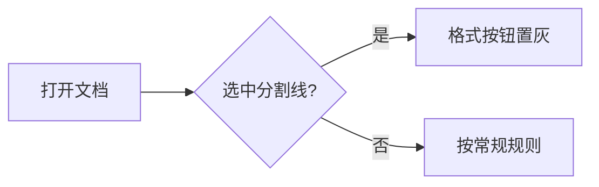
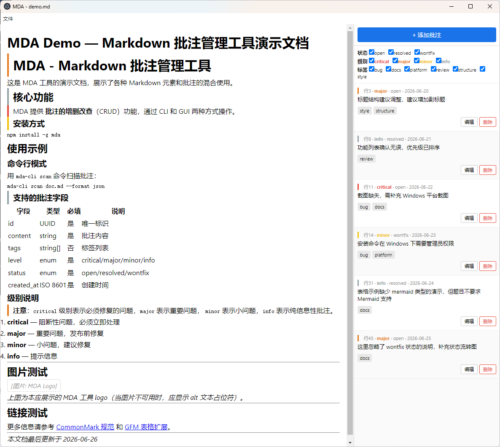

# MDA 全块类型测试文档

用于验收编辑栏 / 块 widget / 插入菜单覆盖的各类块。本地打开：`npm run gui -- samples/all-blocks.md`。

## 正文段落与行内格式

在头前插入汉字：含 ~下划线~、**加粗**、*斜体*、~~删除线~~、`行内代码`，以及 [链接](https://www.kdocs.cn/)。

在尾部插入汉字：含 ~下划线~、**加粗**、*斜体*、~~删除线~~、`行内代码`，以及 [链接](https://www.kdocs.cn/)。

选区删除测试：含 ~下划线~、**加粗**、*斜体*、~~删除线~~、`行内代码`，以及 [链接](https://www.kdocs.cn/)。

行内公式：$E = mc^2$。

## 标题层级

### 三级标题 H3

#### 四级标题 H4

##### 五级标题 H5

###### 六级标题 H6

## 列表

无序列表：

- 项 A
- 项 B
  - 嵌套 B-1

有序列表：

1. 第一项
2. 第二项

任务列表：

- [ ] 未完成
- [x] 已完成

## 引用

> 这是一段引用块。
>
> 引用第二段。

## 表格

| 列 A | 列 B |
| --- | --- |
| 单元格 1 | **粗体** |
| 单元格 2 | *斜体* |
| 单元格 3 | ~~删除线~~ |
| 单元格 4 | ~下划线~ |
| 单元格 5 | `行内代码` |

## 代码块

```js
function greet(name) {
  return `Hello, ${name}!`;
}
```

## 流程图（Mermaid）



## 图片



## 块级公式

$$
\sum_{n=1}^{\infty} \frac{1}{n^2} = \frac{\pi^2}{6}
$$

## 分割线

下面是一条分割线（点击选中后，特殊/字符/段落格式按钮应置灰）：

---

分割线下方正文，用于离开选中态后恢复工具栏。

## 文末

*测试文档结束。*
