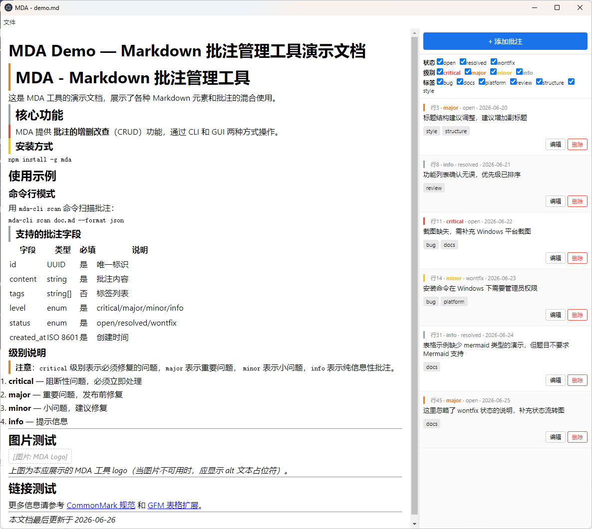
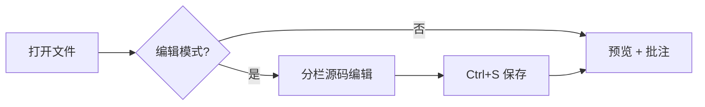

[comment]: <> (@anno {"id":"demo-1","content":"这是一条演示批注：一级标题应正确渲染，段落左侧显示级别色条。","tags":["demo"],"level":"major","status":"open","created_at":"2026-06-30T00:00:00.000Z"})
# MDA GUI 综合演示

本文件用于验证 GUI 的四项能力：**深色模式**、**图片加载**、**流程图渲染**、**源码编辑**。

## 一、标题层级与排版

### 三级标题

- 无序列表项 A
- 无序列表项 B
  - 嵌套项 B-1

1. 有序列表项一
2. 有序列表项二

> 引用块：切换深色模式（工具栏「深色」按钮或 `Ctrl+Shift+D`）观察配色变化。

| 列 1 | 列 2 |
|------|------|
| 单元格 | 单元格 |

## 二、图片加载

下图使用相对路径引用 `assets/demo.png`，应能正常显示：



若图片路径错误，则降级为占位文字：


## 三、流程图渲染



## 四、代码高亮与编辑

进入编辑模式（工具栏「编辑」或 `Ctrl+E`），修改本段文字并 `Ctrl+S` 保存，观察预览实时更新。

```js
function greet(name1) {
  return `Hello, ${name1}!`;
}
```

---

*演示结束！！！*
