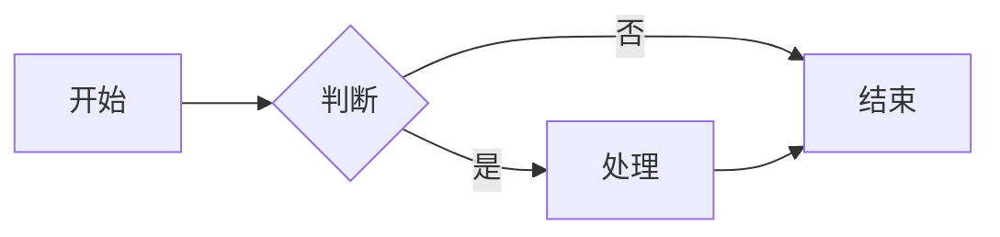
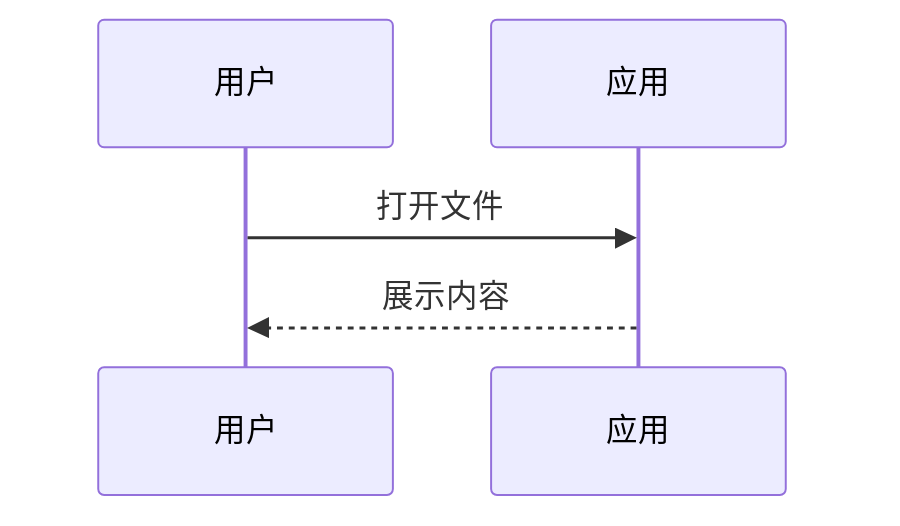
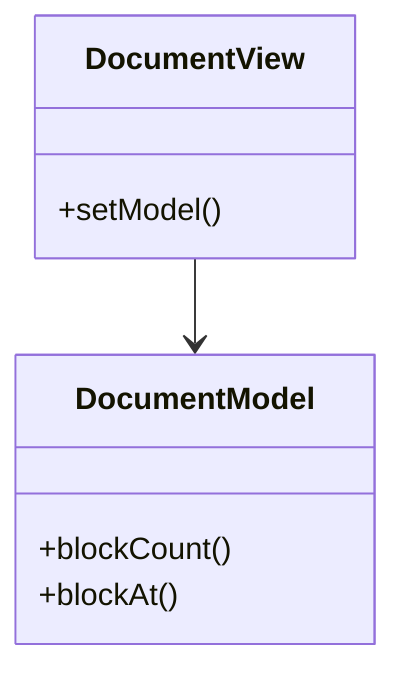
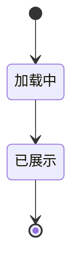

# 基础 GFM 样例 — Phase-1 测试文档

本文档用于验证 Markdown 查看器对常见 GFM 元素的解析与展示骨架。

## 标题与段落

这是一段普通段落，包含 **粗体**、*斜体* 与 `行内代码`。

## 列表

无序列表：

- 第一项
- 第二项
  - 嵌套项

有序列表：

1. 步骤一
2. 步骤二

## 代码块

```python
def hello():
    print("Hello, Markdown!")
```

## 链接与引用

访问 [Qt 官网](https://www.qt.io/) 或 [相对链接](./test-basic.md)。

> 这是一段引用文字，用于测试 blockquote 样式。

## 表格

| 列 A | 列 B | 列 C |
|------|------|------|
| 数据 1 | 数据 2 | 数据 3 |
| 数据 4 | 数据 5 | 数据 6 |

## 水平线

---

## Mermaid 图表示例








