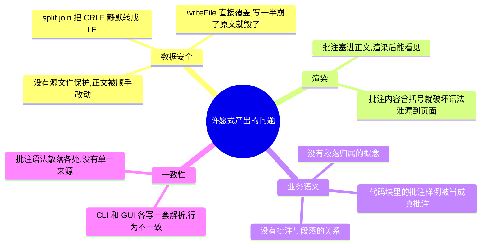
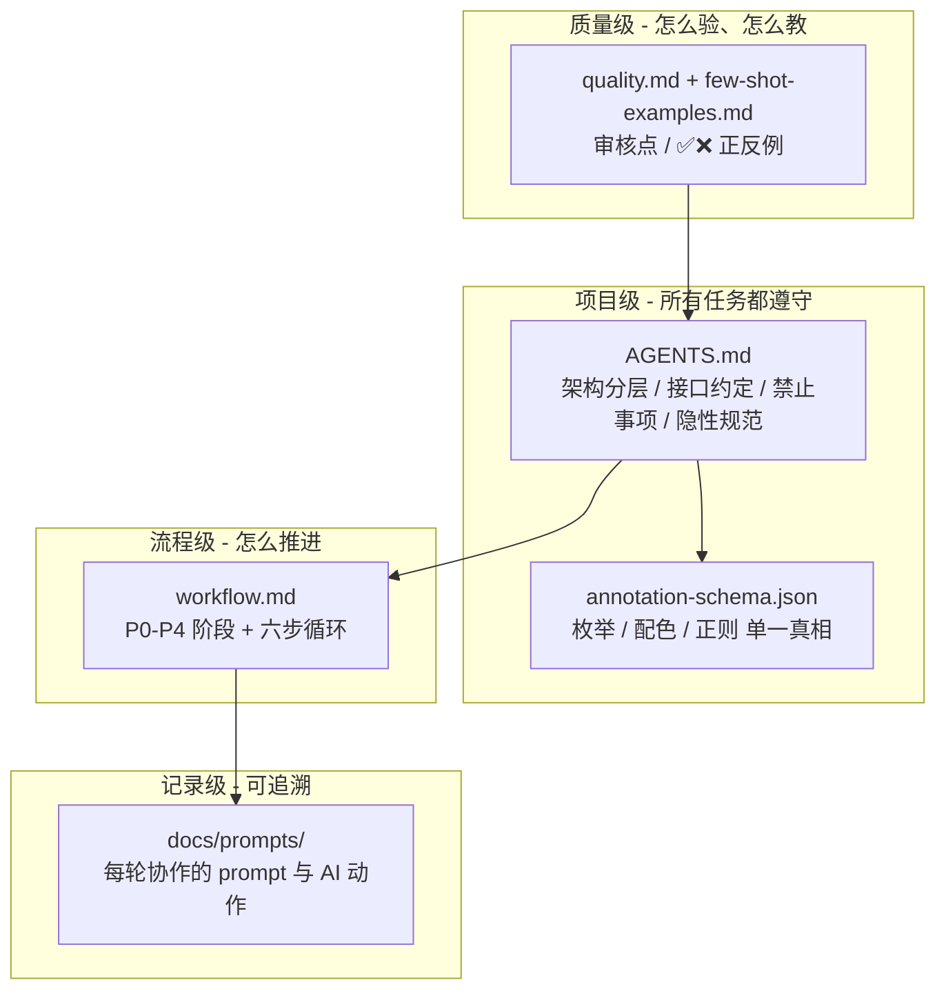
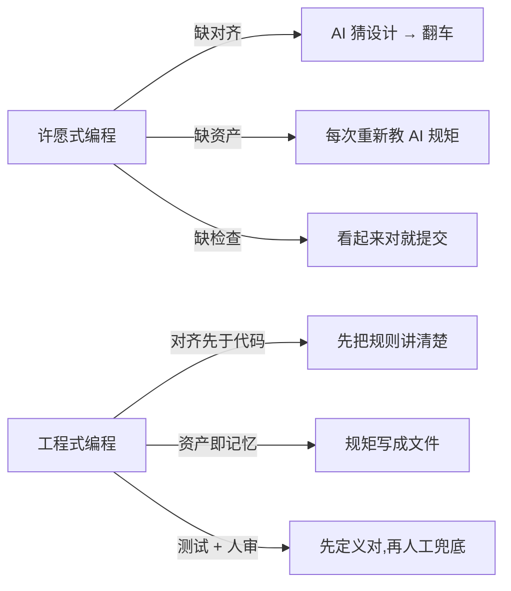

# 别许愿，做工程 —— 一个 Markdown 批注工具教我的 AI 协作三件事

> 以 MDA（Markdown 批注管理工具）的完整开发过程为例，讲清楚 **对齐先于代码、资产即记忆、测试与人审** 这三件事。
> 真实项目：TypeScript 核心库 + commander CLI + Electron GUI，**73 个测试、42+ 轮人机协作**；初版交付后仍经历源码编辑、流程图渲染、缩放遮罩等大迭代，并打成 Windows 安装包分发。

## 1. 从一次"想象中的翻车"说起

### 1.1 需求背景

我们要做一个工具：**在不破坏 Markdown 原文渲染效果的前提下，往 `.md` 文件里嵌入、查询、管理结构化批注（评审意见）**。

这不是"写个脚本跑一下"的事。它有几个绕不开的硬要求：

- 批注要和正文存在同一个 `.md` 文件里，跟着 git 一起版本化；
- 批注是结构化的（有级别、状态、标签、时间），能被脚本扫描、筛选；
- 渲染成 HTML 后，批注必须**完全不可见**；
- 写批注时，**正文一个字节都不能动**；
- 还要同时提供 CLI 和 GUI 两种用法，且行为完全一致。

### 1.2 许愿式对话

大多数人拿到这个需求，跟 AI 的对话是这样的：

```
帮我做一个 Markdown 批注工具。
能给 .md 文件加批注、查批注、改批注、删批注。
批注要结构化，最好渲染的时候看不见。
做好用一点，再来个界面。
```

四句话，需求说完了。AI 开始哐哐写代码。一个小时后，目录结构有了、CLI 有了、Electron 界面也能打开，`node` 能跑。

你很开心——直到你认真读一遍代码。

### 1.3 AI 会交付什么

打开核心的"写批注"逻辑，大概率长这样：

```javascript
// 许愿式产出：addAnnotation
function addAnnotation(file, line, content) {
  const text = fs.readFileSync(file, 'utf-8');
  const lines = text.split('\n');                    // ① 换行被吃掉
  lines[line] = `<!-- 批注: ${content} -->\n` + lines[line]; // ② 直接拼进正文
  fs.writeFileSync(file, lines.join('\n'));           // ③ 直接覆盖原文件
}
```

看起来能跑。但你逐行读，问题一个接一个冒出来。

### 1.4 问题全景



逐个展开：

**① 换行被静默篡改。** `text.split('\n')` 再 `join('\n')`，Windows 上常见的 CRLF 文件会被悄悄转成 LF。结果是：你只想加一条批注，git 却把整个文件标记成"全部改动"，diff 直接爆炸。

**② 批注塞进了正文。** 用 `<!-- -->` 拼在正文行上，不仅污染了原文结构，渲染后这条注释在不同渲染器下行为还不一致。更糟的是——一旦批注内容里出现一个 `)`，连"看不见"都做不到。

**③ 直接覆盖写。** `writeFileSync` 写到一半进程被杀，原文件就变成残缺状态——用户辛辛苦苦写的文档，因为一条批注没了。

**④ 没有"段落"和"归属"。** 批注到底属于哪段正文？AI 根本没这个概念，于是批注就是一堆游离的文本，查询、定位、双向跳转全都无从谈起。

**⑤ CLI 和 GUI 各写一套。** AI 在 CLI 里写了一遍解析、在 GUI 里又写了一遍，两边正则还不完全一样。三天后改个语法，你得改两个地方，且总会漏一个。

### 1.5 根因分析

这些问题的根源不是 AI 能力不行。GPT、Claude 都能写出原子写入、源文件校验、分层清晰的代码。问题是：

**你没给它足够的设计输入和约束。**

四句话的需求里，你没说：这个系统里有哪些"名词"（实体）、它们什么关系、批注用什么语法承载、什么算"写对了"、什么坚决不能做。AI 只能自己猜。猜对算运气，猜错你就得纠正——纠正三次发现越改越乱，不如推翻重来。

这就是**许愿式编程**：把一个模糊的愿望扔给 AI，期待它心领神会。

下面三件事，就是许愿式编程的解药。它们不是我编出来的方法论，而是这个项目 **42+ 轮协作**里真刀真枪沉淀下来的——其中一半发生在「初版能跑」之后的大迭代里。

## 原则一：对齐先于代码

### 把需求切成阶段，每一步先对齐再动手

在写第一行代码之前，先把"做什么、怎么做、怎么算做完"想清楚，并让人确认。这个项目把它落成了一条主线工作流：


P0 需求分析 → P1 架构设计 → P2 详细设计 → P3 实现步骤 → P4 编码实现，**每个阶段产出一份文档、人确认后才 git commit、再进入下一阶段**。关键不在"分了几段"，而在两个机制：每段之间有一道**确认门**（把理解偏差挡在早期），每次确认对应一个 **git commit**（每步都是可回退的 checkpoint）。

而对齐这件事，最值得展开的是 P0。它干的就是四件具体的事。

### 第一步：定名词 —— 系统里有什么东西

这是对齐最核心的一步。名词会直接变成代码里的类型、数据结构、API 路径。名词层想清楚了，骨架就清楚了。MDA 的名词表（节选自项目的 `AGENTS.md`）：

```
Annotation（批注）
  一条评审意见，结构化为 JSON
  - id / content / tags[] / level / status / created_at
  - level: critical | major | minor | info
  - status: open | resolved | wontfix

Paragraph（段落）
  连续非空行组成的文本块，空行分隔；是批注的归属对象
  - startLine / endLine / text / annotations[]

批注行
  形如 [comment]: <> (@anno {...}) 的整行
  这是唯一允许被增删改的行

段落归属
  批注归属于它下方第一个正文段落；中间空行不打断归属
  文件末尾无后续正文的批注 = 孤儿批注（在 annotations 中，但不属于任何段落）
```

如果不写这份名词表，AI 会自己编：批注可能叫 `Comment` / `Note` / `Review`，在不同文件里指同一个东西；"段落归属"这种业务语义它压根不会有。开头翻车代码里"没有段落概念"就是这么来的。

### 第二步：定接口 —— 唯一的契约

名词定义了"有什么"，接口定义了"怎么用"。MDA 把全部能力收敛到一个纯函数核心库 `@mda/core`，CLI 和 GUI 都只能调它：

```ts
parseAnnotations(text): ScanResult          // 纯函数，解析 + 段落归属
findParagraphByLine(paragraphs, line)       // 行号定位段落
addAnnotation(filePath, paragraphLine, input): Promise<Annotation>
editAnnotation(filePath, id, patch): Promise<Annotation>
removeAnnotation(filePath, id): Promise<void>
writeRawFile(filePath, content)             // GUI 整篇写回（原子写入 + EOL 保留）
createMarkdownIt() / renderMarkdown(md, text)
```

还有比函数签名更关键的一条契约——**批注行语法**，整个项目从解析、写入到渲染共用同一条正则，绝不允许各写各的：

```
[comment]: <> (@anno {"id":...,"content":...,"level":...,"status":...,"created_at":...})

识别正则：/^\[comment\]:\s*<>\s*\(@anno\s+(\{.+?\})\)\s*$/
```

这条契约直接消灭了开头翻车里"CLI 和 GUI 各写一套正则"的问题——因为只有一个来源。

### 第三步：定验收标准 —— 怎么算做对

验收标准不是"跑起来了"，而是一组能逐条核对的具体场景。MDA 的验收用 **Given/When/Then** 写（项目里写了 14 条），并把解析的边界情况编成 **E1–E25** 一整套用例：

```
- Given 一个含批注的文件，When 执行 scan --format json，
  Then stdout 仅输出含全部字段的 JSON 数组（无批注则 []）
- Given 批注下方隔着空行才是正文，When 解析，
  Then 批注仍归属该正文段落（空行不打断归属）
- Given 文件末尾的批注后没有正文，When 解析，
  Then 它是孤儿批注：出现在 annotations 中，但不属于任何段落
- E1–E25：连续多条批注 / 批注夹空行 / 段落内换行 / 围栏内的批注样例 ...
```

"模糊的需求"写不出这种验收。能写出 Given/When/Then 的那一刻，需求才真正被想清楚了。

### 第四步：定不做清单 —— 显式的边界

"不做什么"常比"做什么"更重要。你不明说，AI 就会自作主张加东西，而你得花审查精力去看那些你根本不需要的代码。MDA 把边界写成了硬性**禁止事项**（摘自 `AGENTS.md` 第 8 节）：

```
✗ 不得修改正文行：写操作只能增删改批注行，正文必须逐字节不变
✗ 不得改批注语法：必须沿用 [comment]: <> (@anno {JSON}) 与现有正则
✗ CLI 不得污染 stdout：scan --format json 之外不得向 stdout 写非数据文本
✗ GUI 不得重写 core 逻辑：禁止自实现 parser/writer/UUID 或手工拼批注行
✗ renderer 保持纯净：禁止注入 data-line 等 GUI 专属内容
```

每一条"不做"，都在替你省下未来的审查和返工成本。

### 真实片段：一句话把规则全定死

整个工作流的"启动指令"，就是下面这条 prompt。它一次性把阶段、确认门、提交时机、循环步骤全部讲清楚，AI 后续所有动作都围绕它展开：

```
对需求文档进行 P0需求分析→P1架构设计→P2详细设计→P3实现步骤，
每阶段产出文档，确认后进入下一阶段并 git commit。
P4实现阶段遵循：Step1审查→Step2实施→Step3自查→Step4验证
→Step5文档→Step5.5commit→Step6下一步。
中间产物必须严格遵循需求文档的交付清单。
```

关键不在"让 AI 干活"，而在**先把游戏规则讲清楚**。规则定死，AI 才不会跑飞。

### 对齐的效果对比

| 维度 | 许愿式 | 先对齐 |
|------|--------|--------|
| AI 的输入 | 4 句话 | 名词 + 接口 + 验收 + 不做清单 |
| 实体命名 | AI 自己编，各文件可能不同 | 全局统一（Annotation/Paragraph…） |
| 批注语法 | 散落各处、CLI/GUI 不一致 | 单一正则，core 唯一来源 |
| 验收 | "跑起来了"算完 | 逐条核对 Given/When/Then + E1–E25 |
| 改需求 | 在几千行代码里到处改 | 先改文档，再让 AI 按新文档改代码 |
| 三天后再看 | 忘了为什么这么设计 | 读文档就能回忆起来 |

对齐的本质：**把"你脑子里的设计决策"变成"AI 能读到的文件"。**

## 原则二：资产是 AI 的工作记忆

### AI 没有记忆，每次都会"失忆"

你纠正了 AI 一次："写文件要原子写入，先写临时文件再 rename，别直接覆盖。" AI 改了。

下一轮你让它写"删除批注"，它又写了 `writeFileSync` 直接覆盖。同样的错误，每个写操作犯一遍。

为什么？因为 AI 没有记忆。你的项目约束在你脑子里，不在它能读到的地方。每开一个新对话、甚至同一对话里切个话题，它就可能忘了你之前定的规矩。

### 解决方案：把规矩写成文件

MDA 用三样东西沉淀协作记忆，让 AI 每次进来都能"读到"项目规矩：



| 层级 | 内容 | 载体 | 生命周期 |
|------|------|------|----------|
| 项目级 | 分层依赖、批注语法、源文件保护、CLI 输出规范、11 条禁止事项、隐性规范 | `AGENTS.md` | 跟项目走，长期维护 |
| 配置级 | 级别枚举、状态枚举、级别配色、批注正则 | `annotation-schema.json` | 改规则只改一处，core/GUI 同步派生 |
| 流程级 | 阶段划分、确认门、六步循环、提交规范、**GUI 截图须人工补充** | `workflow.md` | 跟方法论走 |
| 质量级 | 测试清单、人工审核点、易错点正反例 | `quality.md` / `few-shot-examples.md` | 每次大迭代后同步 |
| 记录级 | 哪一轮改了什么、为什么这么改 | `docs/prompts/` | 全程可追溯 |

`AGENTS.md` 是这个项目的"宪法"——AI 每次动手前先读它，行为就不会跑偏。开头翻车的那五个问题，本质上都是因为没有这样一份宪法。

### 有规范 vs 没规范的代码对比

**没规范** —— AI 写的"写批注"（就是开头那段）：

```javascript
function addAnnotation(file, line, content) {
  const text = fs.readFileSync(file, 'utf-8');
  const lines = text.split('\n');
  lines[line] = `<!-- 批注: ${content} -->\n` + lines[line];
  fs.writeFileSync(file, lines.join('\n'));
}
```

5 行代码，4 个隐患：换行被转、批注进正文、直接覆盖、正文被改。

**有规范** —— AI 读到 `AGENTS.md` 的"写入安全"约束后写出的 writer（这是项目里的真实代码）：

```typescript
// 保留源文件原有换行风格：出现过 CRLF 就按 CRLF 回写，否则 LF
function detectEol(text: string): '\r\n' | '\n' {
  return text.includes('\r\n') ? '\r\n' : '\n';
}

// 原子写入：先写临时文件，再 rename 覆盖；失败清理临时文件
async function atomicWrite(filePath: string, content: string): Promise<void> {
  const tmpPath = path.join(dir, `.${base}.${randomUUID()}.tmp`);
  try {
    await fs.writeFile(tmpPath, content, 'utf-8');
    await fs.rename(tmpPath, filePath);
  } catch (err) {
    try { await fs.unlink(tmpPath); } catch {}
    throw new Error(`写入失败: ${(err as Error).message}`);
  }
}

// 源文件保护：写回后校验，非批注行发生任何变化就拒绝写入
if (!verifySourceProtection(rawText, newText)) {
  throw new Error('源文件保护检查失败：非批注行被意外修改');
}
```

- 换行风格保留（`detectEol`）
- 原子写入，写一半崩了原文也不坏
- 只增删改批注行，正文逐字节保护

关键区别不是 AI 变聪明了，是**你给了它正确的约束**。而且你只需写一次 `AGENTS.md`，后面 add / edit / remove 每一个写操作，AI 都会自动遵守。写一次，省 N 次纠正。

### 写好资产的三个标准

资产不是越多越好。烂资产比没有更糟——AI 读到一堆模糊、冲突的规则，产出更混乱。三个标准：

**标准 1：具体（明确到可以检查）**

```
❌ 注意保护源文件
✅ 写操作只能增删改批注行，正文必须逐字节不变（verifySourceProtection）
```

**标准 2：可验证（Review 时一眼能看出违没违反）**

```
❌ CLI 输出要规范
✅ scan --format json 时 stdout 仅输出 JSON 数组，所有警告/错误一律走 stderr
```

**标准 3：最小必要（别教 AI 它已经会的东西）**

```
❌ Electron 的 contextIsolation 是一种安全机制，它的原理是...（教科书搬运）
✅ 保持 contextIsolation: true、nodeIntegration: false；sandbox: false 仅为让
   preload require('../core')，不得进一步放开
```

AI 已经知道 Electron 是什么，你只需要告诉它**你的项目对它有什么特殊要求**。

一次典型的「踩坑 → 沉淀」：缩放遮罩初版放大 SVG/图片发糊，人工实机反馈后定位到 `will-change: transform` 先栅格化再缩放；修复后把「遮罩舞台禁止 will-change」写进 `AGENTS.md` 隐性规范，并在 `few-shot-examples.md` 里补了 ✅/❌ 对照——**下一轮 AI 不会再犯同一个错**。

## 原则三：测试定义"对"，人审兜住"AI 看不见的"

对齐解决"做什么"，资产解决"按什么规矩做"，但还差最后一环：**做对没？** 这一环靠两样东西——测试和人审，它们都发生在每个阶段内部的"六步循环"里：


其中第 3 步自查、第 4 步验证，就是测试与人审落地的地方。

### 先写测试，定义"对的标准"

最容易翻车的"渲染不可见性"，MDA 不是写完渲染再补测试，而是先用一条测试钉死正确行为：

> **"把所有批注行删掉后渲染" 与 "带批注渲染"，产出的 HTML 必须完全相等。**

这条断言先立在那里，实现就必须满足它。如果反过来——先让 AI 写渲染、再补测试，你会下意识写一个"验证当前行为"的测试：代码把批注泄漏了，你测试里可能也就不检查泄漏了。**先写测试，想的是"正确行为应该是什么"；后补测试，想的是"代码现在是什么样"，这是两种完全不同的思维。**

### 测试全过 ≠ 代码没问题

这是 AI 协作里最反直觉的一点。来看一个真实 bug：

不可见性的测试当时是全绿的。直到有人写了一条内容含括号的批注：

```
[comment]: <> (@anno {"content":"复杂度是 n(n-1)/2","level":"minor",...})
```

界面上，这条批注**直接泄漏到了正文里**。

为什么测试没拦住？因为 `[comment]: <> (...)` 这种语法靠括号配对，内容里出现 `)` 就提前闭合，后半段被当成正文渲染了——而原来的测试数据里，批注内容恰好都没有括号。

修复方式也写进了项目的隐性规范：渲染前把批注行**清空为空行**（保留行数，否则定位用的 `data-line` 会错位），让不可见性对**任意内容**都成立；并补了 2 条回归测试（含括号、BOM 标题）。

**第二轮迭代又踩了一类更隐蔽的坑**：用户在源码编辑栏里手滑删掉批注行的 `]`，严格正则不匹配 → 批注既不进面板、又泄漏进预览。这类「编辑中/被改坏」的行，自动化测试很难事先想到。修复是 GUI 层增加宽松识别 `ANNO_ISH`（只认 `<> (@anno` 标记），预览前清空；保存时用 `findMalformedAnnotations` 弹窗提示行号——**测试管「规范输入」，人审 + 实机管「用户会怎么改坏」**。

> 测试保证的是"你想到的情况是对的"，但保证不了"你没想到的情况"。所以测试之后，还需要人审。

### 人审兜住"AI 看不见的"

这个项目做过一次完整的代码 review，一轮就揪出 9 个测试覆盖不到的问题，例如：

| 问题 | 测试为什么没发现 |
|------|------------------|
| `level`/`status` 缺枚举校验，能写出无法被解析的脏批注（静默丢失） | 测试用例传的都是合法值 |
| CRLF 文件被静默转 LF（违背源文件保护承诺） | 测试样本恰好是 LF |
| scan 目录模式所有行显示目录路径而非真实文件路径 | 单文件测试不触发 |
| 中文列宽用 `padEnd` 按码元数对齐导致错位 | 断言没校验对齐宽度 |

这些都不是"行为错误"，而是 AI 在 mock、在理想输入下看不到的工程问题：边界、性能、一致性、跨平台。**这正是人审存在的意义。**

### GUI 改动：必须人工实机测试

还有一类问题，自动化测试和 `npm run build` 全过也照样漏——真机才暴露的问题。于是工作流里加了一条**硬约束**：

> 凡涉及 `src/gui/**` 的改动，自动化测试通过 **不等于** 验证完成。必须启动 GUI 让人实机操作确认；用户明确回复"测试通过"前，不提交、不进下一步。

这条约束是踩出来的。真实片段：

```
用户: 先把GUI跑起来 → md文档没有渲染
```

AI 加日志定位到 `module not found: markdown-it`——preload 跑在 Electron sandbox 里，沙箱内 `require` 加载不了第三方模块，导致整个界面白屏。自动化测试根本覆盖不到这种"真机才暴露"的场景。复盘后，这条硬约束被写进了 `workflow.md`。

### Review 检查清单

```
正确性
  - [ ] 错误处理完整，没有把 error 静默吞掉
  - [ ] 边界条件覆盖（空文件、孤儿批注、连续批注、围栏内样例）
  - [ ] 枚举值经守卫校验后才落盘
与设计一致性
  - [ ] 实体命名与名词表一致（Annotation/Paragraph…）
  - [ ] 批注语法、CLI 输出格式与契约一致
  - [ ] "禁止事项"确实没被违反（正文未改、stdout 未污染）
跨平台 / 写入安全
  - [ ] 换行风格保留（CRLF 不被转 LF）
  - [ ] 写入走原子写入 + 源文件保护
  - [ ] 中文按显示宽度对齐，不用 padEnd
GUI（如涉及）
  - [ ] 已人工实机测试并由用户确认通过
  - [ ] 新增/变更的交互已对照 docs/screenshots/README.md 补充截图（AI 不得伪造）
```

## 初版交付之后：大迭代仍走同一条路

很多团队以为「P4 做完、测试绿了」就可以松口气。MDA 在初版（批注 CRUD + CLI/GUI 一致 + 66 测试）之后，又加了一整波 GUI 能力：**源码编辑、三栏布局、深色模式、图片/流程图渲染、缩放遮罩、electron-builder 打包**。如果这时回到许愿式——「帮我加编辑、加深色、加 mermaid」——几乎必然再翻一次车。

实际做法是：**仍然先对齐口径，再分步实现，每步人工实机，踩坑就写回资产**。

### 对齐：新需求也要先定边界

Prompt 18 一口气提了四个功能，AI 没有直接开写，而是先和你确认口径：

```
用户: 继续迭代以下功能：1、支持深色模式；2、支持加载常见图片；
3、支持流程图渲染；4、支持编辑
```

对齐结果写进了设计决策里，例如：

- **编辑** = 分栏源码编辑 + 防抖实时预览 + `Ctrl+S` 整篇原子写回（走 `writeRawFile`，保留 EOL），**不是** WYSIWYG 改 HTML；
- **mermaid** = 离线 UMD 打包进 `dist/gui/renderer/`，不依赖 CDN；
- **批注写操作**与**源码编辑**两条路径不能打架——存在未保存编辑（dirty）时禁用批注增删改。

这些边界如果不先讲清楚，AI 很可能给你做一个「预览区 contenteditable」或「编辑时顺手改批注行」的版本——看起来也能用，但会违反源文件保护。

### 成品长什么样（效果图）

按工程方法迭代出来的 GUI，大致是这样：

**三栏平铺：源码 ｜ 预览 ｜ 批注**


工具栏「编辑」「批注」两个独立开关，预览常驻中间；栏间可拖拽调宽，**双击手柄复位**默认宽度。

**段落 ↔ 批注双向定位（四级别色条）**


点击段落定位批注、点击批注滚动到段落——这类交互自动化测不到，必须实机点一遍。（完整操作见 `./assets/operation_demo.gif`）

**源码编辑：语法高亮 + 行号 + 实时预览**


编辑器是「透明 textarea + 高亮层 + 行号槽」三层结构，scroll 必须同步——光标错位是另一类「测试全过、人眼一眼假」的典型问题，后来也写进了 `AGENTS.md` 隐性规范（连字关闭、整数行高、CJK 回退字体一致等）。

**流程图与图片渲染（离线 mermaid）**


**缩放遮罩：滚轮缩放 + 拖拽平移**


深色模式整体效果见 `./assets/6-dark-mode.png`（跟随系统 / `Ctrl+Shift+D` 切换，hljs 与 mermaid 主题联动）。

### 分步实现 + 人工 checkpoint（不是一口气 3000 行）

大迭代按 Prompt 18→21 拆成多轮，每轮走六步循环，GUI 每轮都要你实机确认：

| 轮次 | 做什么 | 人审抓到的典型问题 |
|------|--------|-------------------|
| 18 | 深色 / 图片 / mermaid / 编辑 + `writeRawFile` | 口径确认：整篇写回 vs 批注写回两条路径 |
| 19 | 三栏布局、dirty 禁用批注、坏批注 ANNO_ISH | 缺 `]` 的批注泄漏预览；编辑与批注冲突 |
| 20 | 编辑器高亮行号、缩放遮罩、分栏拖拽 | 高亮层与 textarea 光标错位 |
| 21 | 缩放模糊、误复位、白图按钮不可见、平移丢内容 | `will-change` 导致 SVG 栅格化发糊；按钮 dblclick 冒泡误复位 |

> **真实片段** —— 坏批注 + 布局，一轮 prompt 同时暴露「产品决策」和「隐蔽 bug」：
>
> ```
> 用户: 1、编辑到批注，如果使批注发生错误应该提示用户，或者不允许在编辑模式下修改批注，
> 你觉哪个更合理？ 2、去掉保存和深色按键，将预览改为批注，批注和编辑平展开
> （后续补充：故意删掉批注的一个 ] 改坏格式，结果泄漏到了预览区）
> ```
>
> 产品决策（dirty 时禁用批注 vs 允许改坏）+ 技术修复（ANNO_ISH 宽松识别）+ 布局重构（三栏），都在同一套「确认 → 实现 → 实机 → 写回资产」里完成——而不是在 3000 行 diff 里硬改。

### 文档与截图也是交付物

L2 评估后，工作流 Step 5 明确：**GUI 改动须提示人工补截图，AI 不得伪造**。于是有了 `docs/screenshots/README.md` 清单，README 引用 5–9 号新截图，并把编辑器对齐、缩放遮罩等审核点写进 `quality.md`。

这也是「资产即记忆」的延伸——**效果图不是装饰，是验收证据**。

## 把三件事串起来：完整工作流

三件事不是孤立的，它们在每个阶段内的"六步循环"里组成一个闭环：


### 这套流程跑下来的真实数据

| 指标 | 数值 |
|------|------|
| AI 协作轮次 | 42+ 轮 |
| git commits | 26+ 个 |
| 测试用例 | 73 个（全部通过） |
| 代码覆盖率 | Statements 88.36% / Lines 91.29% |
| GUI 截图 | 9 张 + 1 个操作 GIF |
| 分发产物 | Windows NSIS 安装包 + portable 便携版 |

平均一两轮就有一个可回退的 checkpoint，每次改动都有自动化兜底；GUI 大迭代另有多轮人工实机与截图验收。**这不是"AI 一把生成"的结果，而是人和 AI 在一套流程里反复迭代出来的**——初版交付之后的那 8 轮协作，和 P4 里写 core 一样重要。

### 三个原则的常见误区

| 误区 | 正解 |
|------|------|
| "对齐就是写长文档" | 名词 + 接口 + 验收 + 不做清单，几十行就够。重要的是清晰度不是长度 |
| "AGENTS.md 写一次就不用管了" | 它是活的。发现 AI 反复犯同一个错，就把那条规则加进去 |
| "先让 AI 写完代码再补测试更快" | 先写测试定义"对"，和后补测试"验证现状"，是两种思维 |
| "测试过了就没问题" | 测试只覆盖你想到的；边界、跨平台、真机问题要靠人审 |
| "AI 审过就不用人审了" | AI 找得到机械性问题，找不到业务语义错误和工程判断 |
| "方案定了不能改" | 实现中发现设计有问题，先改文档再改代码，别直接改代码 |

## 总结



| 原则 | 做什么 | 在 MDA 里的落地 |
|------|--------|-----------------|
| 对齐先于代码 | 写代码前先把"做什么/怎么算对/坚决不做"讲清楚 | P0–P4 + 确认门；名词表、core 契约、Given/When/Then、禁止事项；**迭代新功能也先对齐口径** |
| 资产即记忆 | 把规矩写成文件让 AI 每次都读到 | `AGENTS.md` + `workflow.md` + `annotation-schema.json` + `quality.md` / `few-shot` + `docs/prompts/` |
| 测试 + 人审 | 先写测试定义"对"，再用人审兜住看不见的 | 不可见性等价断言、E1–E25、`writeRawFile` EOL 测试、GUI 实机硬约束、**截图清单作验收证据** |

许愿式编程的反面不是"不用 AI"，而是**用工程方法驾驭 AI**。

AI 是高效执行体。你给它一句话的许愿，它给你一堆能跑但经不起推敲的代码（就像开头那段 `addAnnotation`）；你给它一份对齐过的设计 + 一套沉淀的资产 + 一组先行的测试，它给你一个正文逐字节安全、批注渲染不可见、CLI/GUI 行为一致、**源码可编辑、流程图可渲染、可打包分发**、73 个测试护着的系统。

**差别不在 AI，在你。** 在方案阶段改一行需求要 1 分钟，在代码阶段改一个设计决策要 1 小时，等用户文档被写坏了再补救——可能就是不可挽回的 1 天。这套流程做的事，本质上就是帮你**花今天的 1 分钟，省明天的 1 小时**。

---

## 附：项目、产物与完整协作记录

本文所有方法、代码、数据、prompt 片段与效果图均来自真实项目 **MDA（Markdown 批注管理工具）**。

| 资源 | 说明 |
|------|------|
| 源码与协作记录 | `AGENTS.md`、`workflow.md`、逐轮 `docs/prompts/` |
| 体验样本 | `samples/demo.md` 等，可直接 `npm run gui -- samples/demo.md` |
| Windows 分发 | `release/MDA-1.0.0-win-x64.exe`（安装包）、`MDA-1.0.0-portable-win-x64.exe`（便携版） |
| GUI 截图清单 | `docs/screenshots/README.md` |

仓库地址：

```

```

> 内部源（inner-source）仓库，无法访问的同学欢迎在评论区交流工作流细节。

---

*觉得有用，欢迎点赞 / 在看，转给还在让 AI"一把梭"的同事。*
