# Mermaid 图表语法样例

> 在 MDA GUI 中打开本文件，逐项查看渲染效果。  
> 启动：`npm run gui -- samples/mermaid-diagrams.md`  
> 依赖：Mermaid ^11（见 `package.json`）。个别实验性图表若失败，应降级为源码块而非白屏。

---

## 1. Flowchart / graph

节点外形、边样式、子图与链式边：

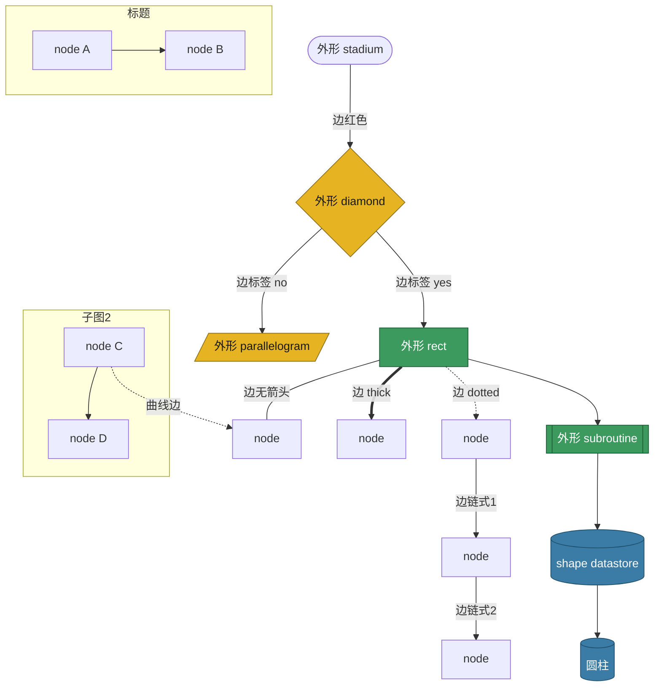
```mermaid
flowchart TB
  subgraph 标题
    A[node A] --> B[node B]
  end

  subgraph 子图2
    C[node C] --> D[node D]
  end

  S([外形 stadium]) -->|边红色| Dia{外形 diamond}
  Dia -->|边标签 no| Para[/外形 parallelogram/]
  Dia -->|边标签 yes| Rect[外形 rect]

  Rect ---|边无箭头| N1[node]
  Rect ==>|边 thick| N2[node]
  Rect -.->|边 dotted| N3[node]
  Rect --> Sub[[外形 subroutine]]
  Sub --> Store[(shape datastore)]
  Store --> Cyl[(圆柱)]

  N3 -->|边链式1| Chain1[node]
  Chain1 -->|边链式2| Chain2[node]

  C -.->|曲线边| N1

  classDef warm fill:#e6b422,stroke:#8a6d1a,color:#1a1a1a
  classDef cool fill:#3d9a5f,stroke:#1e5c36,color:#ffffff
  classDef ice fill:#3a7ca5,stroke:#1f4e6b,color:#ffffff
  class Dia,Para warm
  class Rect,Sub cool
  class Store,Cyl ice
```

经典 `graph` 写法（与 flowchart 等价族）：

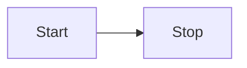
```mermaid
graph LR
  Start --> Stop
```

---

## 2. Sequence diagram

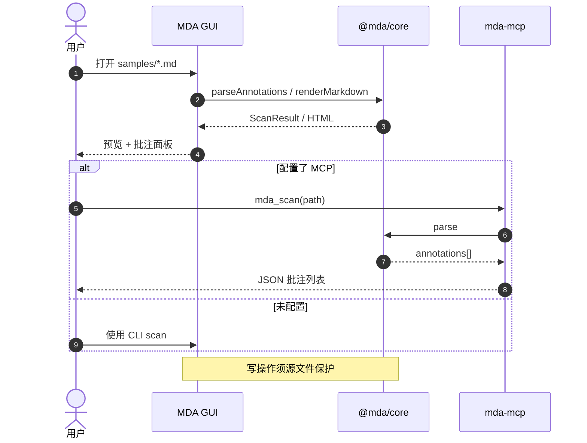
```mermaid
sequenceDiagram
  autonumber
  actor User as 用户
  participant GUI as MDA GUI
  participant Core as @mda/core
  participant MCP as mda-mcp

  User->>GUI: 打开 samples/*.md
  GUI->>Core: parseAnnotations / renderMarkdown
  Core-->>GUI: ScanResult / HTML
  GUI-->>User: 预览 + 批注面板

  alt 配置了 MCP
    User->>MCP: mda_scan(path)
    MCP->>Core: parse
    Core-->>MCP: annotations[]
    MCP-->>User: JSON 批注列表
  else 未配置
    User->>GUI: 使用 CLI scan
  end

  Note over GUI,Core: 写操作须源文件保护
```

---

## 3. Class diagram

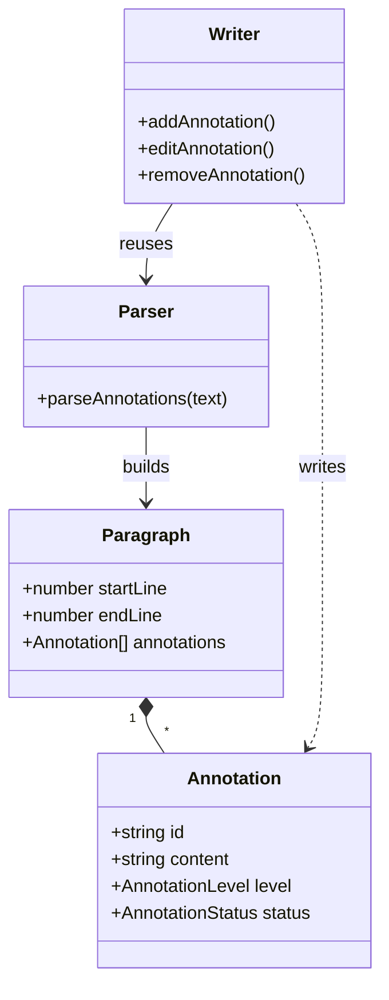
```mermaid
classDiagram
  direction TB
  class Annotation {
    +string id
    +string content
    +AnnotationLevel level
    +AnnotationStatus status
  }
  class Paragraph {
    +number startLine
    +number endLine
    +Annotation[] annotations
  }
  class Writer {
    +addAnnotation()
    +editAnnotation()
    +removeAnnotation()
  }
  class Parser {
    +parseAnnotations(text)
  }
  Parser --> Paragraph : builds
  Paragraph "1" *-- "*" Annotation
  Writer --> Parser : reuses
  Writer ..> Annotation : writes
```

---

## 4. State diagram

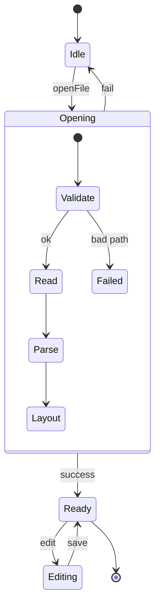
```mermaid
stateDiagram-v2
  [*] --> Idle
  Idle --> Opening: openFile
  state Opening {
    [*] --> Validate
    Validate --> Read: ok
    Validate --> Failed: bad path
    Read --> Parse
    Parse --> Layout
  }
  Opening --> Ready: success
  Opening --> Idle: fail
  Ready --> Editing: edit
  Editing --> Ready: save
  Ready --> [*]
```

---

## 5. ER diagram

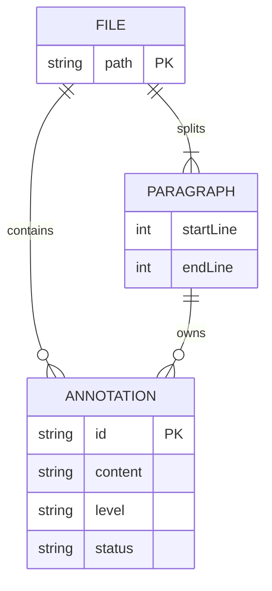
```mermaid
erDiagram
  FILE ||--o{ ANNOTATION : contains
  PARAGRAPH ||--o{ ANNOTATION : owns
  FILE ||--|{ PARAGRAPH : splits
  ANNOTATION {
    string id PK
    string content
    string level
    string status
  }
  FILE {
    string path PK
  }
  PARAGRAPH {
    int startLine
    int endLine
  }
```

---

## 6. Gantt

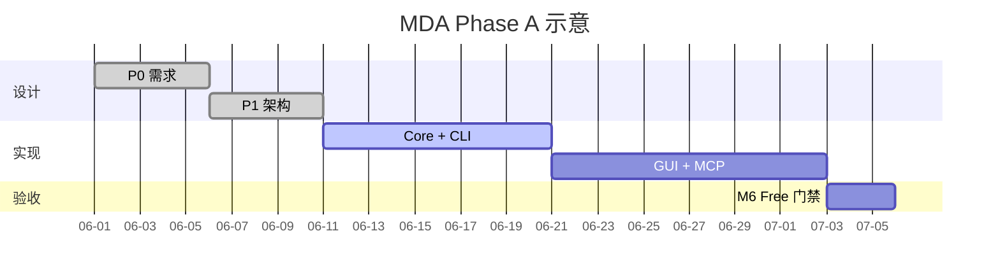
```mermaid
gantt
  title MDA Phase A 示意
  dateFormat  YYYY-MM-DD
  axisFormat  %m-%d
  section 设计
  P0 需求           :done,    des1, 2026-06-01, 5d
  P1 架构           :done,    des2, after des1, 5d
  section 实现
  Core + CLI        :active,  dev1, after des2, 10d
  GUI + MCP         :         dev2, after dev1, 12d
  section 验收
  M6 Free 门禁      :         mil1, after dev2, 3d
```

---

## 7. Pie

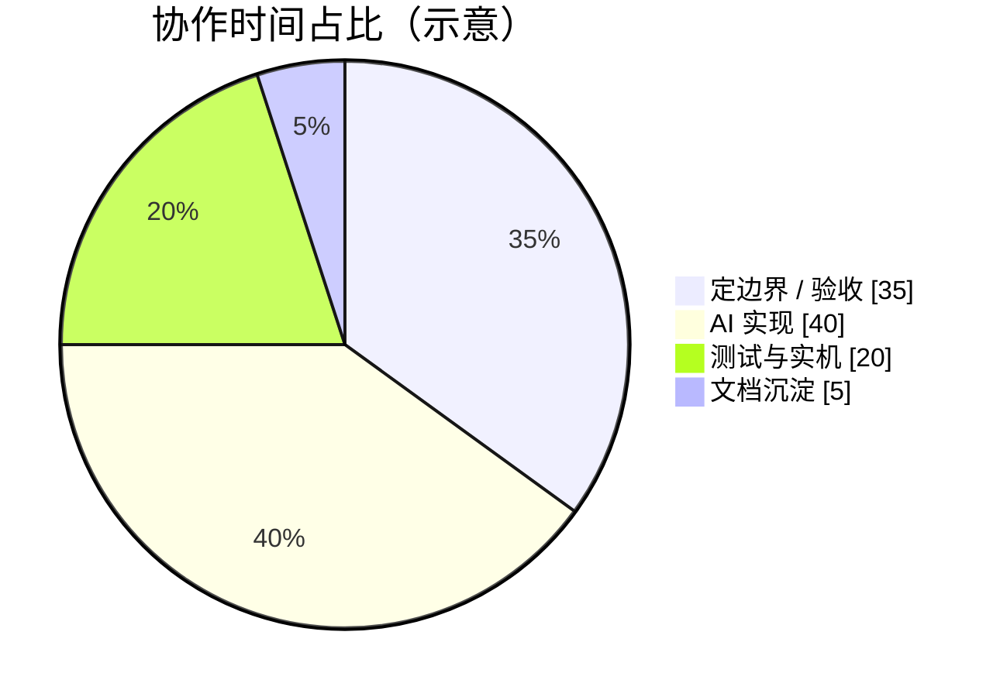
```mermaid
pie showData
  title 协作时间占比（示意）
  "定边界 / 验收" : 35
  "AI 实现" : 40
  "测试与实机" : 20
  "文档沉淀" : 5
```

---

## 8. User journey

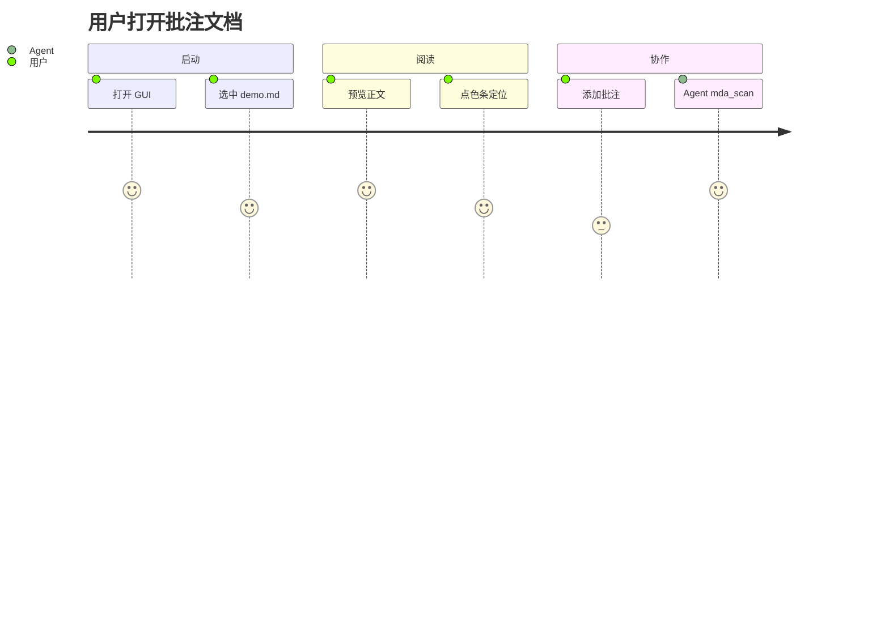
```mermaid
journey
  title 用户打开批注文档
  section 启动
    打开 GUI: 5: 用户
    选中 demo.md: 4: 用户
  section 阅读
    预览正文: 5: 用户
    点色条定位: 4: 用户
  section 协作
    添加批注: 3: 用户
    Agent mda_scan: 5: Agent
```

---

## 9. Git graph

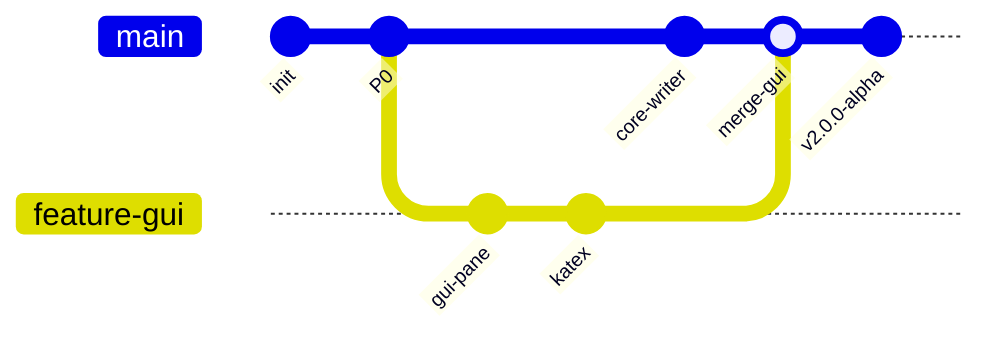
```mermaid
gitGraph
  commit id: "init"
  commit id: "P0"
  branch feature-gui
  checkout feature-gui
  commit id: "gui-pane"
  commit id: "katex"
  checkout main
  commit id: "core-writer"
  merge feature-gui id: "merge-gui"
  commit id: "v2.0.0-alpha"
```

---

## 10. Mindmap

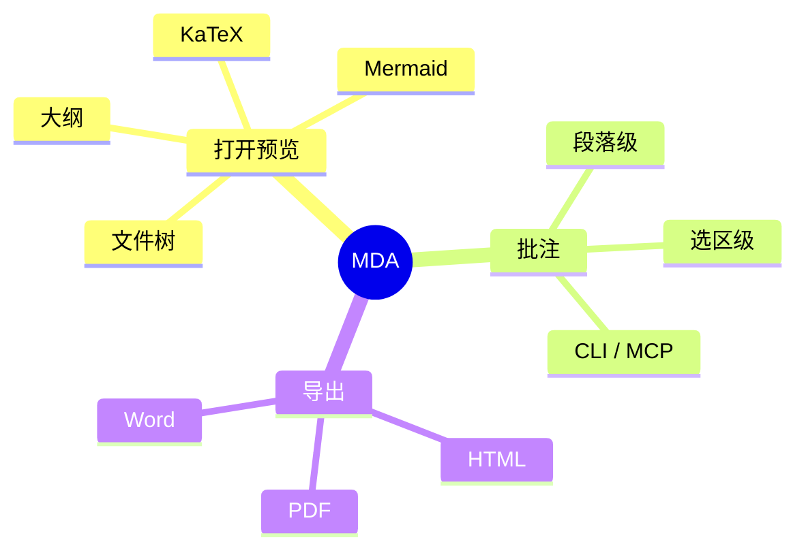
```mermaid
mindmap
  root((MDA))
    打开预览
      文件树
      大纲
      KaTeX
      Mermaid
    批注
      段落级
      选区级
      CLI / MCP
    导出
      HTML
      PDF
      Word
```

---

## 11. Timeline

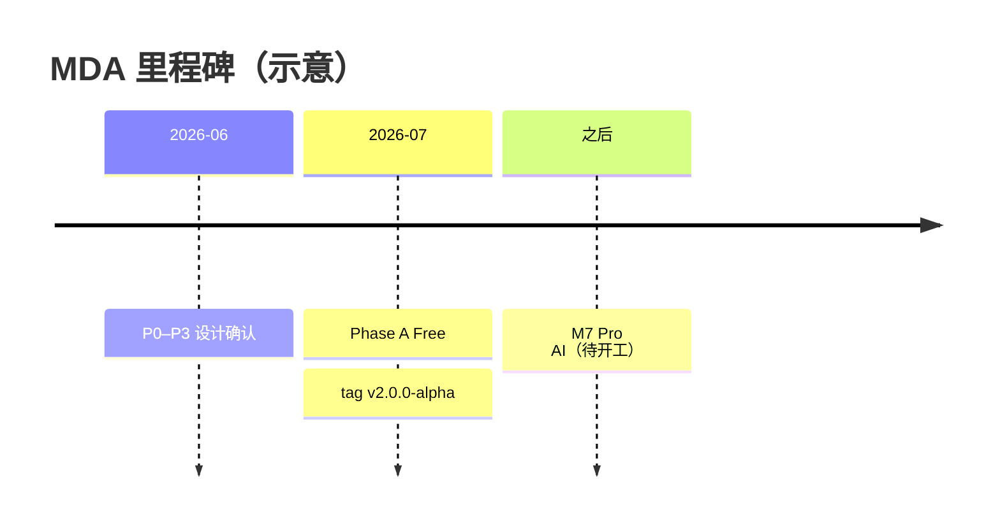
```mermaid
timeline
  title MDA 里程碑（示意）
  2026-06 : P0–P3 设计确认
  2026-07 : Phase A Free
         : tag v2.0.0-alpha
  之后    : M7 Pro AI（待开工）
```

---

## 12. Quadrant chart

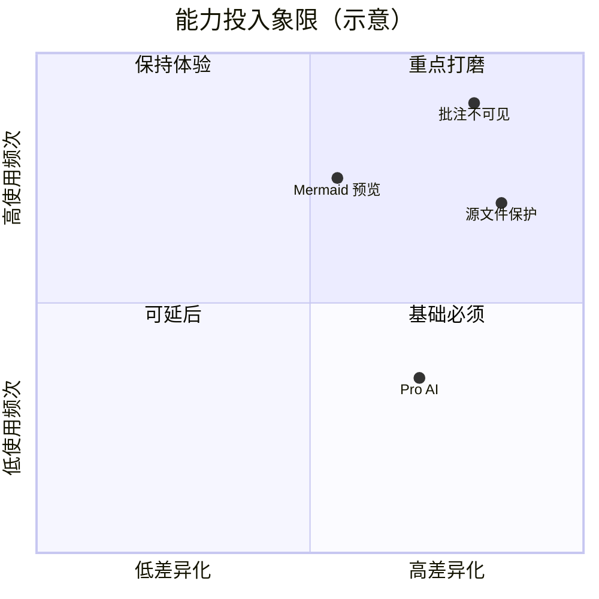
```mermaid
quadrantChart
  title 能力投入象限（示意）
  x-axis 低差异化 --> 高差异化
  y-axis 低使用频次 --> 高使用频次
  quadrant-1 重点打磨
  quadrant-2 保持体验
  quadrant-3 可延后
  quadrant-4 基础必须
  批注不可见: [0.8, 0.9]
  源文件保护: [0.85, 0.7]
  Mermaid 预览: [0.55, 0.75]
  Pro AI: [0.7, 0.35]
```

---

## 13. Requirement diagram

> 名称含中文或特殊字符时须加引号，否则会 Lexical error。

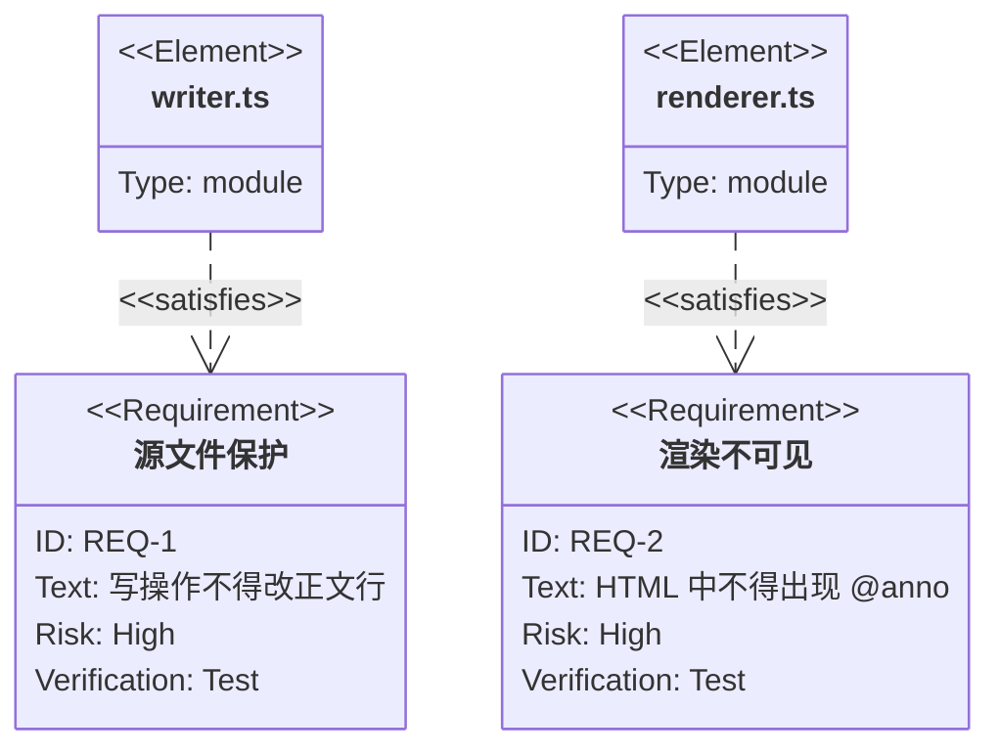
```mermaid
requirementDiagram
  requirement "源文件保护" {
    id: "REQ-1"
    text: "写操作不得改正文行"
    risk: high
    verifymethod: test
  }
  requirement "渲染不可见" {
    id: "REQ-2"
    text: "HTML 中不得出现 @anno"
    risk: high
    verifymethod: test
  }
  element "writer.ts" {
    type: "module"
  }
  element "renderer.ts" {
    type: "module"
  }
  "writer.ts" - satisfies -> "源文件保护"
  "renderer.ts" - satisfies -> "渲染不可见"
```

---

## 14. XY chart

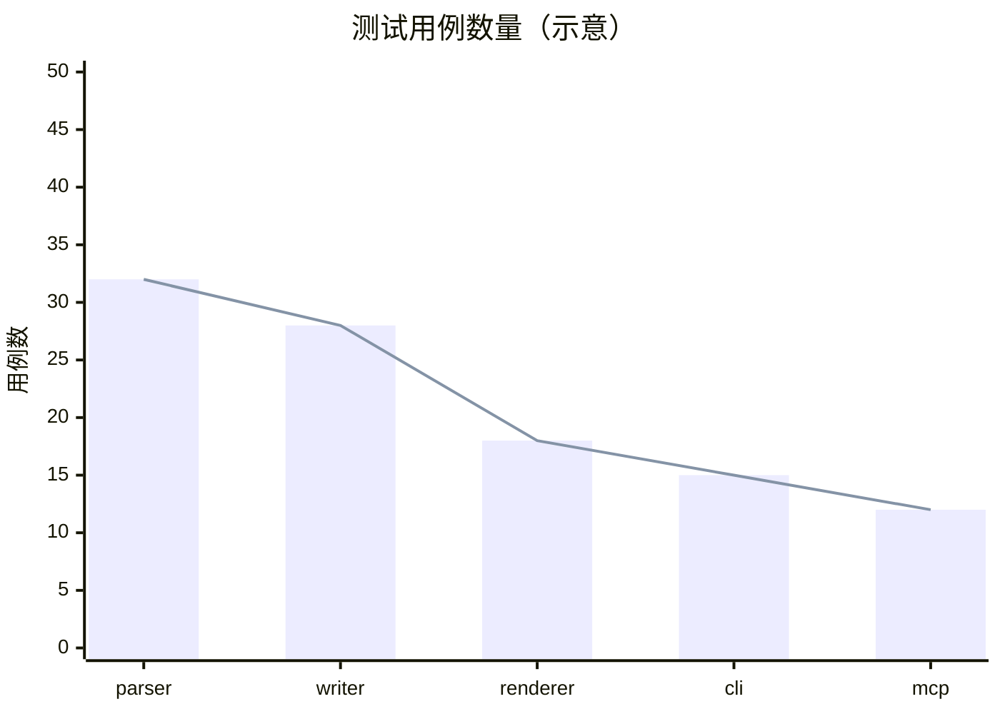
```mermaid
xychart-beta
  title "测试用例数量（示意）"
  x-axis [parser, writer, renderer, cli, mcp]
  y-axis "用例数" 0 --> 50
  bar [32, 28, 18, 15, 12]
  line [32, 28, 18, 15, 12]
```

---

## 15. Sankey

> **注意**：Mermaid Sankey（CSV）目前**不支持中文/CJK 节点名**（带引号也会 `ESCAPED_TEXT` 解析失败）。样例用英文节点；语义见下行对照。  
> 对照：`User`=用户，`DiskWrite`=磁盘写入，`PreviewHTML`=预览 HTML。

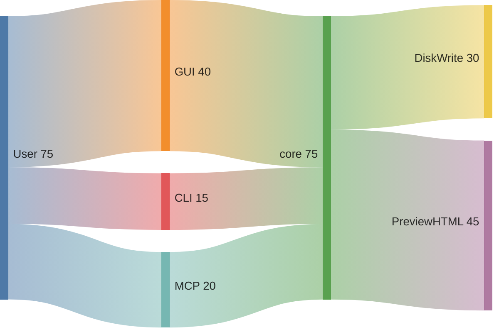
```mermaid
sankey-beta

User,GUI,40
User,CLI,15
User,MCP,20
GUI,core,40
CLI,core,15
MCP,core,20
core,DiskWrite,30
core,PreviewHTML,45
```

---

## 16. Block

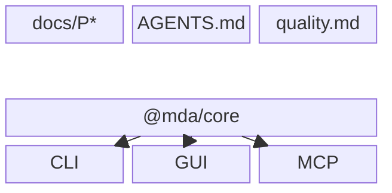
```mermaid
block-beta
  columns 3
  docs["docs/P*"]:1
  agents["AGENTS.md"]:1
  quality["quality.md"]:1
  space:3
  core["@mda/core"]:3
  cli["CLI"]:1
  gui["GUI"]:1
  mcp["MCP"]:1
  core --> cli
  core --> gui
  core --> mcp
```

---

## 17. Architecture

> `architecture-beta` 多服务塞进同一 group 时标签易重叠；样例每组一个服务，关系更清晰。

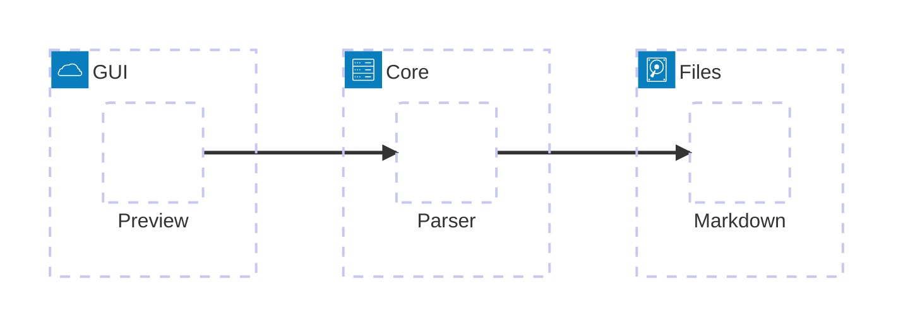
```mermaid
architecture-beta
  group gui(cloud)[GUI]
  group core(server)[Core]
  group disk(disk)[Files]

  service preview[Preview] in gui
  service parser[Parser] in core
  service md[Markdown] in disk

  preview:R --> L:parser
  parser:R --> L:md
```

---

## 18. Kanban

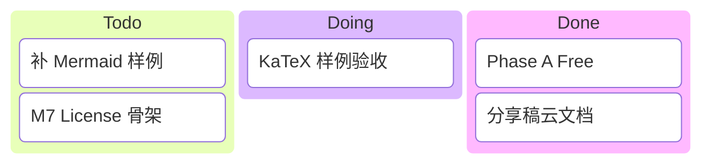
```mermaid
kanban
  Todo
    [补 Mermaid 样例]
    [M7 License 骨架]
  Doing
    [KaTeX 样例验收]
  Done
    [Phase A Free]
    [分享稿云文档]
```

---

## 19. C4

> Rel 文案宜短；过长标签会压在箭头上。`<<stereotype>>` 挤压由 GUI 去掉 `textLength` 缓解。

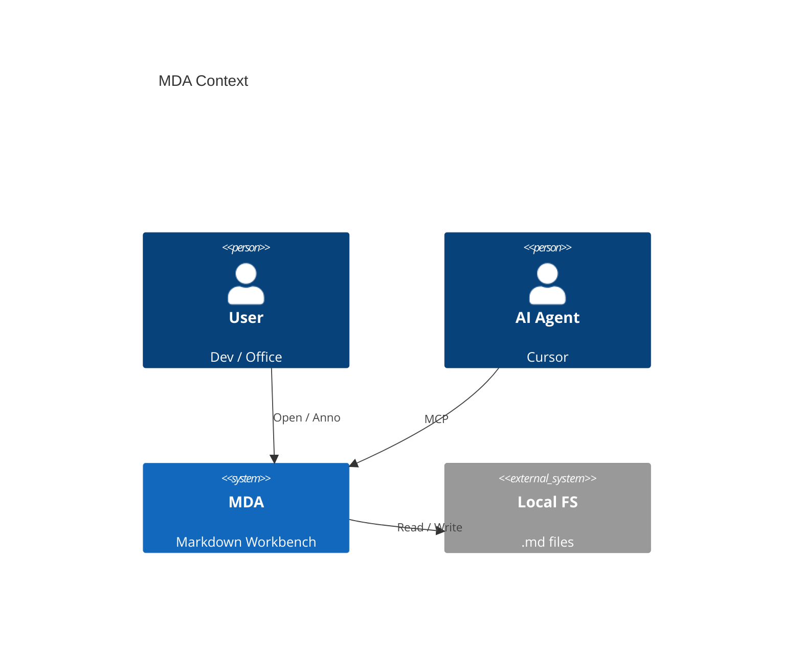
```mermaid
C4Context
  title MDA Context
  Person(user, "User", "Dev / Office")
  Person(agent, "AI Agent", "Cursor")
  System(mda, "MDA", "Markdown Workbench")
  System_Ext(fs, "Local FS", ".md files")
  Rel(user, mda, "Open / Anno")
  Rel(agent, mda, "MCP")
  Rel(mda, fs, "Read / Write")
```

---

## 20. Packet

```mermaid
packet-beta
  0-15: "Source Port"
  16-31: "Dest Port"
  32-63: "Sequence Number"
  64-95: "Ack Number"
```

---

## 21. Radar

标题放在围栏外，避免 SVG 顶部裁切：

**质量维度（示意）**

```mermaid
radar-beta
  axis protect["源文件保护"], invisible["渲染不可见"], coverage["测试覆盖"], gui["实机验收"], docs["文档沉淀"]
  curve current["当前"]{5, 5, 4, 4, 4}
  curve target["目标"]{5, 5, 5, 5, 5}
```

---

## 22. Treemap

```mermaid
treemap-beta
  "仓库"
    "src"
      "core": 40
      "gui": 35
      "cli": 10
      "mcp": 8
    "docs": 20
    "tests": 15
```

---

## 23. Venn

标题放在围栏外，避免顶部被截：

**协作边界（示意）**

```mermaid
venn-beta
  set A["人定边界"]:20
  set B["AI 实现"]:20
  set C["机器门禁"]:20
  union A,B["设计确认"]:4
  union B,C["自动化测试"]:4
  union A,C["实机验收"]:4
  union A,B,C["可交付"]:2
```

---

## 建议你点的几下

1. 大纲跳到各节，确认预览不错位  
2. 点流程图 / 大图试缩放遮罩与复制（流程图应复制源码）  
3. 若某实验性类型失败：应显示可读源码，而不是整页崩溃  
4. Architecture 勿在同一 group 堆太多 service（易叠字）；C4 Rel 文案宜短  
5. Radar / Venn 标题建议写在围栏外（或依赖 GUI 扩 viewBox）  
6. 与 `samples/mermaid.md`（AC-2 四类验收）对照：本文件偏「语法全景」  
