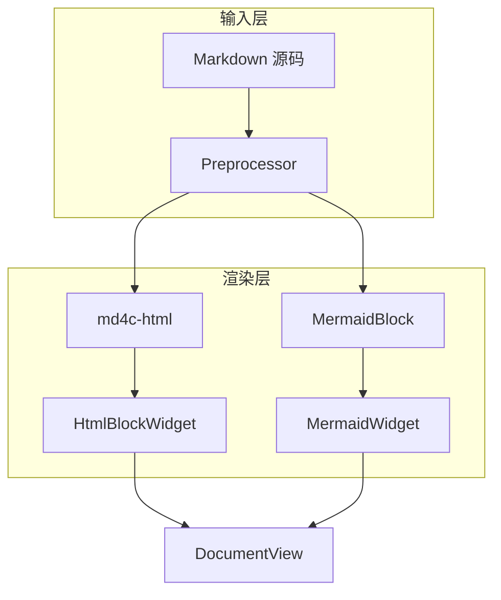
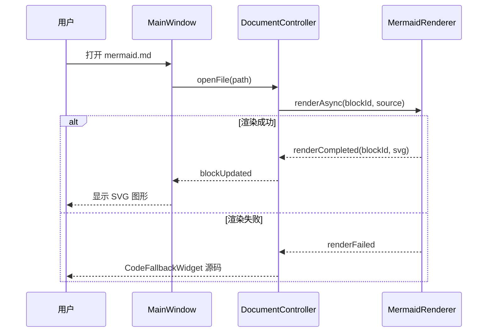
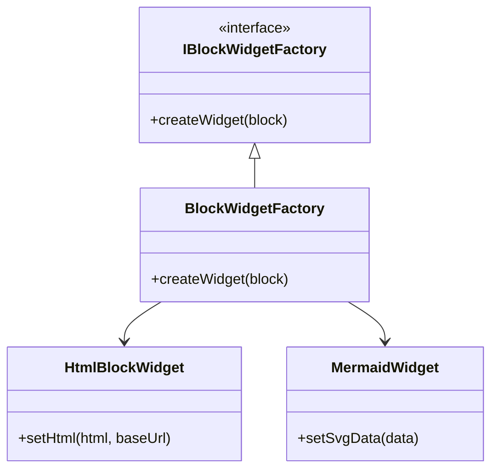
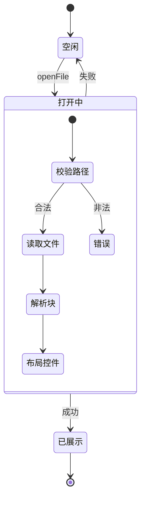
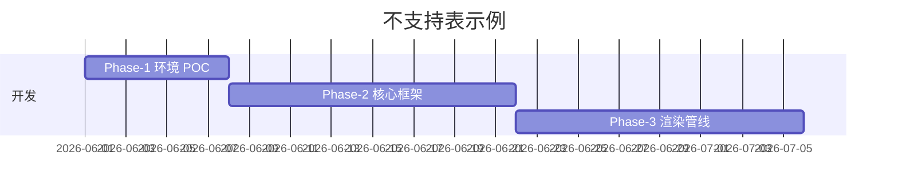

# AC-2 Mermaid 验收样例

本文档仅用于 P0 四类 Mermaid 图表验收，以及不支持类型的降级测试。

## 1. Flowchart（含子图）

## 2. Sequence Diagram（含 alt 分支）

## 3. Class Diagram（含继承）

## 4. State Diagram-v2（含嵌套）

## 5. 不支持类型 — Gantt（应降级为源码）

以下 gantt 图表不在 P0 支持范围，预期显示为 `CodeFallbackWidget` 源码：

---

*AC-2 样例结束。*
