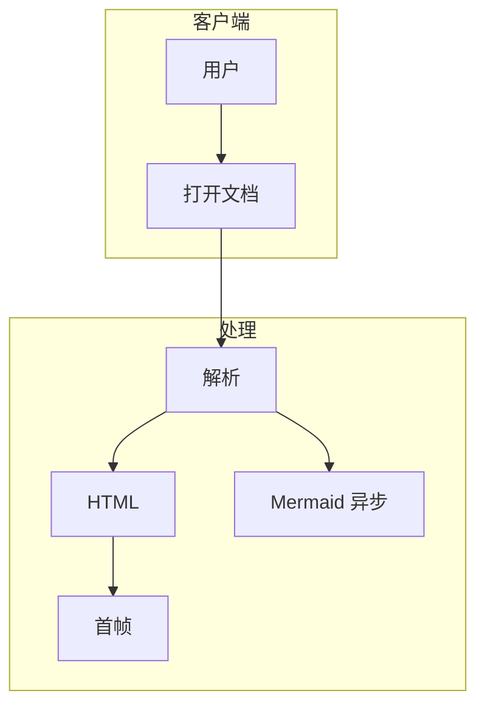
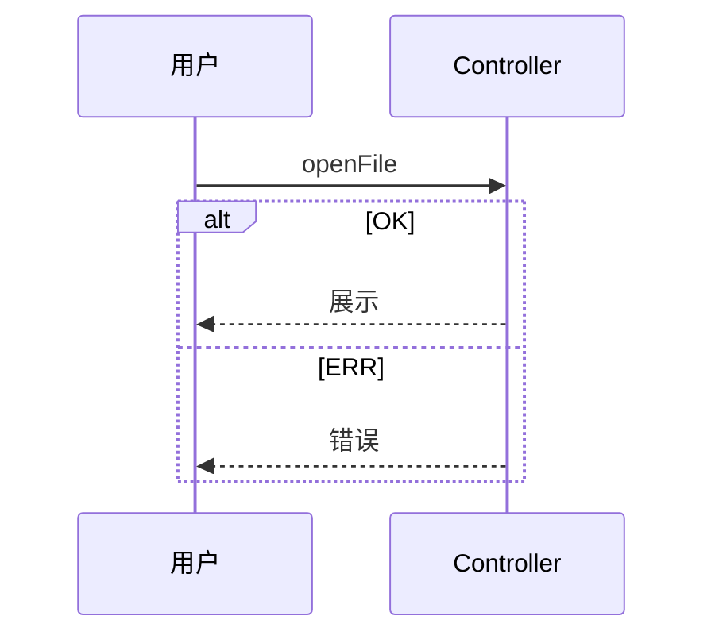

# 性能测试样例 — perf-mixed

约 400KB 混合内容：段落、代码块、5 个 Mermaid 图表。






```mermaid
stateDiagram-v2
    [*] --> 空闲
    state 加载 {
        [*] --> 解析 --> 布局
    }
    空闲 --> 加载 --> 完成
```


## 块 675

这是一段用于填充文档体积的中文技术说明文字，测试冷启动性能。这是一段用于填充文档体积的中文技术说明文字，测试冷启动性能。这是一段用于填充文档体积的中文技术说明文字，测试冷启动性能。这是一段用于填充文档体积的中文技术说明文字，测试冷启动性能。这是一段用于填充文档体积的中文技术说明文字，测试冷启动性能。这是一段用于填充文档体积的中文技术说明文字，测试冷启动性能。这是一段用于填充文档体积的中文技术说明文字，测试冷启动性能。这是一段用于填充文档体积的中文技术说明文字，测试冷启动性能。

`python
print('x'*100)
` 

## 块 954

这是一段用于填充文档体积的中文技术说明文字，测试冷启动性能。这是一段用于填充文档体积的中文技术说明文字，测试冷启动性能。这是一段用于填充文档体积的中文技术说明文字，测试冷启动性能。这是一段用于填充文档体积的中文技术说明文字，测试冷启动性能。这是一段用于填充文档体积的中文技术说明文字，测试冷启动性能。这是一段用于填充文档体积的中文技术说明文字，测试冷启动性能。这是一段用于填充文档体积的中文技术说明文字，测试冷启动性能。这是一段用于填充文档体积的中文技术说明文字，测试冷启动性能。

`python
print('x'*100)
` 

## 块 1233

这是一段用于填充文档体积的中文技术说明文字，测试冷启动性能。这是一段用于填充文档体积的中文技术说明文字，测试冷启动性能。这是一段用于填充文档体积的中文技术说明文字，测试冷启动性能。这是一段用于填充文档体积的中文技术说明文字，测试冷启动性能。这是一段用于填充文档体积的中文技术说明文字，测试冷启动性能。这是一段用于填充文档体积的中文技术说明文字，测试冷启动性能。这是一段用于填充文档体积的中文技术说明文字，测试冷启动性能。这是一段用于填充文档体积的中文技术说明文字，测试冷启动性能。

`python
print('x'*100)
` 

## 块 1513

这是一段用于填充文档体积的中文技术说明文字，测试冷启动性能。这是一段用于填充文档体积的中文技术说明文字，测试冷启动性能。这是一段用于填充文档体积的中文技术说明文字，测试冷启动性能。这是一段用于填充文档体积的中文技术说明文字，测试冷启动性能。这是一段用于填充文档体积的中文技术说明文字，测试冷启动性能。这是一段用于填充文档体积的中文技术说明文字，测试冷启动性能。这是一段用于填充文档体积的中文技术说明文字，测试冷启动性能。这是一段用于填充文档体积的中文技术说明文字，测试冷启动性能。

`python
print('x'*100)
` 

## 块 1793

这是一段用于填充文档体积的中文技术说明文字，测试冷启动性能。这是一段用于填充文档体积的中文技术说明文字，测试冷启动性能。这是一段用于填充文档体积的中文技术说明文字，测试冷启动性能。这是一段用于填充文档体积的中文技术说明文字，测试冷启动性能。这是一段用于填充文档体积的中文技术说明文字，测试冷启动性能。这是一段用于填充文档体积的中文技术说明文字，测试冷启动性能。这是一段用于填充文档体积的中文技术说明文字，测试冷启动性能。这是一段用于填充文档体积的中文技术说明文字，测试冷启动性能。

`python
print('x'*100)
` 

## 块 2073

这是一段用于填充文档体积的中文技术说明文字，测试冷启动性能。这是一段用于填充文档体积的中文技术说明文字，测试冷启动性能。这是一段用于填充文档体积的中文技术说明文字，测试冷启动性能。这是一段用于填充文档体积的中文技术说明文字，测试冷启动性能。这是一段用于填充文档体积的中文技术说明文字，测试冷启动性能。这是一段用于填充文档体积的中文技术说明文字，测试冷启动性能。这是一段用于填充文档体积的中文技术说明文字，测试冷启动性能。这是一段用于填充文档体积的中文技术说明文字，测试冷启动性能。

`python
print('x'*100)
` 

## 块 2353

这是一段用于填充文档体积的中文技术说明文字，测试冷启动性能。这是一段用于填充文档体积的中文技术说明文字，测试冷启动性能。这是一段用于填充文档体积的中文技术说明文字，测试冷启动性能。这是一段用于填充文档体积的中文技术说明文字，测试冷启动性能。这是一段用于填充文档体积的中文技术说明文字，测试冷启动性能。这是一段用于填充文档体积的中文技术说明文字，测试冷启动性能。这是一段用于填充文档体积的中文技术说明文字，测试冷启动性能。这是一段用于填充文档体积的中文技术说明文字，测试冷启动性能。

`python
print('x'*100)
` 

## 块 2633

这是一段用于填充文档体积的中文技术说明文字，测试冷启动性能。这是一段用于填充文档体积的中文技术说明文字，测试冷启动性能。这是一段用于填充文档体积的中文技术说明文字，测试冷启动性能。这是一段用于填充文档体积的中文技术说明文字，测试冷启动性能。这是一段用于填充文档体积的中文技术说明文字，测试冷启动性能。这是一段用于填充文档体积的中文技术说明文字，测试冷启动性能。这是一段用于填充文档体积的中文技术说明文字，测试冷启动性能。这是一段用于填充文档体积的中文技术说明文字，测试冷启动性能。

`python
print('x'*100)
` 

## 块 2913

这是一段用于填充文档体积的中文技术说明文字，测试冷启动性能。这是一段用于填充文档体积的中文技术说明文字，测试冷启动性能。这是一段用于填充文档体积的中文技术说明文字，测试冷启动性能。这是一段用于填充文档体积的中文技术说明文字，测试冷启动性能。这是一段用于填充文档体积的中文技术说明文字，测试冷启动性能。这是一段用于填充文档体积的中文技术说明文字，测试冷启动性能。这是一段用于填充文档体积的中文技术说明文字，测试冷启动性能。这是一段用于填充文档体积的中文技术说明文字，测试冷启动性能。

`python
print('x'*100)
` 

## 块 3193

这是一段用于填充文档体积的中文技术说明文字，测试冷启动性能。这是一段用于填充文档体积的中文技术说明文字，测试冷启动性能。这是一段用于填充文档体积的中文技术说明文字，测试冷启动性能。这是一段用于填充文档体积的中文技术说明文字，测试冷启动性能。这是一段用于填充文档体积的中文技术说明文字，测试冷启动性能。这是一段用于填充文档体积的中文技术说明文字，测试冷启动性能。这是一段用于填充文档体积的中文技术说明文字，测试冷启动性能。这是一段用于填充文档体积的中文技术说明文字，测试冷启动性能。

`python
print('x'*100)
` 

## 块 3473

这是一段用于填充文档体积的中文技术说明文字，测试冷启动性能。这是一段用于填充文档体积的中文技术说明文字，测试冷启动性能。这是一段用于填充文档体积的中文技术说明文字，测试冷启动性能。这是一段用于填充文档体积的中文技术说明文字，测试冷启动性能。这是一段用于填充文档体积的中文技术说明文字，测试冷启动性能。这是一段用于填充文档体积的中文技术说明文字，测试冷启动性能。这是一段用于填充文档体积的中文技术说明文字，测试冷启动性能。这是一段用于填充文档体积的中文技术说明文字，测试冷启动性能。

`python
print('x'*100)
` 

## 块 3753

这是一段用于填充文档体积的中文技术说明文字，测试冷启动性能。这是一段用于填充文档体积的中文技术说明文字，测试冷启动性能。这是一段用于填充文档体积的中文技术说明文字，测试冷启动性能。这是一段用于填充文档体积的中文技术说明文字，测试冷启动性能。这是一段用于填充文档体积的中文技术说明文字，测试冷启动性能。这是一段用于填充文档体积的中文技术说明文字，测试冷启动性能。这是一段用于填充文档体积的中文技术说明文字，测试冷启动性能。这是一段用于填充文档体积的中文技术说明文字，测试冷启动性能。

`python
print('x'*100)
` 

## 块 4033

这是一段用于填充文档体积的中文技术说明文字，测试冷启动性能。这是一段用于填充文档体积的中文技术说明文字，测试冷启动性能。这是一段用于填充文档体积的中文技术说明文字，测试冷启动性能。这是一段用于填充文档体积的中文技术说明文字，测试冷启动性能。这是一段用于填充文档体积的中文技术说明文字，测试冷启动性能。这是一段用于填充文档体积的中文技术说明文字，测试冷启动性能。这是一段用于填充文档体积的中文技术说明文字，测试冷启动性能。这是一段用于填充文档体积的中文技术说明文字，测试冷启动性能。

`python
print('x'*100)
` 

## 块 4313

这是一段用于填充文档体积的中文技术说明文字，测试冷启动性能。这是一段用于填充文档体积的中文技术说明文字，测试冷启动性能。这是一段用于填充文档体积的中文技术说明文字，测试冷启动性能。这是一段用于填充文档体积的中文技术说明文字，测试冷启动性能。这是一段用于填充文档体积的中文技术说明文字，测试冷启动性能。这是一段用于填充文档体积的中文技术说明文字，测试冷启动性能。这是一段用于填充文档体积的中文技术说明文字，测试冷启动性能。这是一段用于填充文档体积的中文技术说明文字，测试冷启动性能。

`python
print('x'*100)
` 

## 块 4593

这是一段用于填充文档体积的中文技术说明文字，测试冷启动性能。这是一段用于填充文档体积的中文技术说明文字，测试冷启动性能。这是一段用于填充文档体积的中文技术说明文字，测试冷启动性能。这是一段用于填充文档体积的中文技术说明文字，测试冷启动性能。这是一段用于填充文档体积的中文技术说明文字，测试冷启动性能。这是一段用于填充文档体积的中文技术说明文字，测试冷启动性能。这是一段用于填充文档体积的中文技术说明文字，测试冷启动性能。这是一段用于填充文档体积的中文技术说明文字，测试冷启动性能。

`python
print('x'*100)
` 

## 块 4873

这是一段用于填充文档体积的中文技术说明文字，测试冷启动性能。这是一段用于填充文档体积的中文技术说明文字，测试冷启动性能。这是一段用于填充文档体积的中文技术说明文字，测试冷启动性能。这是一段用于填充文档体积的中文技术说明文字，测试冷启动性能。这是一段用于填充文档体积的中文技术说明文字，测试冷启动性能。这是一段用于填充文档体积的中文技术说明文字，测试冷启动性能。这是一段用于填充文档体积的中文技术说明文字，测试冷启动性能。这是一段用于填充文档体积的中文技术说明文字，测试冷启动性能。

`python
print('x'*100)
` 

## 块 5153

这是一段用于填充文档体积的中文技术说明文字，测试冷启动性能。这是一段用于填充文档体积的中文技术说明文字，测试冷启动性能。这是一段用于填充文档体积的中文技术说明文字，测试冷启动性能。这是一段用于填充文档体积的中文技术说明文字，测试冷启动性能。这是一段用于填充文档体积的中文技术说明文字，测试冷启动性能。这是一段用于填充文档体积的中文技术说明文字，测试冷启动性能。这是一段用于填充文档体积的中文技术说明文字，测试冷启动性能。这是一段用于填充文档体积的中文技术说明文字，测试冷启动性能。

`python
print('x'*100)
` 

## 块 5433

这是一段用于填充文档体积的中文技术说明文字，测试冷启动性能。这是一段用于填充文档体积的中文技术说明文字，测试冷启动性能。这是一段用于填充文档体积的中文技术说明文字，测试冷启动性能。这是一段用于填充文档体积的中文技术说明文字，测试冷启动性能。这是一段用于填充文档体积的中文技术说明文字，测试冷启动性能。这是一段用于填充文档体积的中文技术说明文字，测试冷启动性能。这是一段用于填充文档体积的中文技术说明文字，测试冷启动性能。这是一段用于填充文档体积的中文技术说明文字，测试冷启动性能。

`python
print('x'*100)
` 

## 块 5713

这是一段用于填充文档体积的中文技术说明文字，测试冷启动性能。这是一段用于填充文档体积的中文技术说明文字，测试冷启动性能。这是一段用于填充文档体积的中文技术说明文字，测试冷启动性能。这是一段用于填充文档体积的中文技术说明文字，测试冷启动性能。这是一段用于填充文档体积的中文技术说明文字，测试冷启动性能。这是一段用于填充文档体积的中文技术说明文字，测试冷启动性能。这是一段用于填充文档体积的中文技术说明文字，测试冷启动性能。这是一段用于填充文档体积的中文技术说明文字，测试冷启动性能。

`python
print('x'*100)
` 

## 块 5993

这是一段用于填充文档体积的中文技术说明文字，测试冷启动性能。这是一段用于填充文档体积的中文技术说明文字，测试冷启动性能。这是一段用于填充文档体积的中文技术说明文字，测试冷启动性能。这是一段用于填充文档体积的中文技术说明文字，测试冷启动性能。这是一段用于填充文档体积的中文技术说明文字，测试冷启动性能。这是一段用于填充文档体积的中文技术说明文字，测试冷启动性能。这是一段用于填充文档体积的中文技术说明文字，测试冷启动性能。这是一段用于填充文档体积的中文技术说明文字，测试冷启动性能。

`python
print('x'*100)
` 

## 块 6273

这是一段用于填充文档体积的中文技术说明文字，测试冷启动性能。这是一段用于填充文档体积的中文技术说明文字，测试冷启动性能。这是一段用于填充文档体积的中文技术说明文字，测试冷启动性能。这是一段用于填充文档体积的中文技术说明文字，测试冷启动性能。这是一段用于填充文档体积的中文技术说明文字，测试冷启动性能。这是一段用于填充文档体积的中文技术说明文字，测试冷启动性能。这是一段用于填充文档体积的中文技术说明文字，测试冷启动性能。这是一段用于填充文档体积的中文技术说明文字，测试冷启动性能。

`python
print('x'*100)
` 

## 块 6553

这是一段用于填充文档体积的中文技术说明文字，测试冷启动性能。这是一段用于填充文档体积的中文技术说明文字，测试冷启动性能。这是一段用于填充文档体积的中文技术说明文字，测试冷启动性能。这是一段用于填充文档体积的中文技术说明文字，测试冷启动性能。这是一段用于填充文档体积的中文技术说明文字，测试冷启动性能。这是一段用于填充文档体积的中文技术说明文字，测试冷启动性能。这是一段用于填充文档体积的中文技术说明文字，测试冷启动性能。这是一段用于填充文档体积的中文技术说明文字，测试冷启动性能。

`python
print('x'*100)
` 

## 块 6833

这是一段用于填充文档体积的中文技术说明文字，测试冷启动性能。这是一段用于填充文档体积的中文技术说明文字，测试冷启动性能。这是一段用于填充文档体积的中文技术说明文字，测试冷启动性能。这是一段用于填充文档体积的中文技术说明文字，测试冷启动性能。这是一段用于填充文档体积的中文技术说明文字，测试冷启动性能。这是一段用于填充文档体积的中文技术说明文字，测试冷启动性能。这是一段用于填充文档体积的中文技术说明文字，测试冷启动性能。这是一段用于填充文档体积的中文技术说明文字，测试冷启动性能。

`python
print('x'*100)
` 

## 块 7113

这是一段用于填充文档体积的中文技术说明文字，测试冷启动性能。这是一段用于填充文档体积的中文技术说明文字，测试冷启动性能。这是一段用于填充文档体积的中文技术说明文字，测试冷启动性能。这是一段用于填充文档体积的中文技术说明文字，测试冷启动性能。这是一段用于填充文档体积的中文技术说明文字，测试冷启动性能。这是一段用于填充文档体积的中文技术说明文字，测试冷启动性能。这是一段用于填充文档体积的中文技术说明文字，测试冷启动性能。这是一段用于填充文档体积的中文技术说明文字，测试冷启动性能。

`python
print('x'*100)
` 

## 块 7393

这是一段用于填充文档体积的中文技术说明文字，测试冷启动性能。这是一段用于填充文档体积的中文技术说明文字，测试冷启动性能。这是一段用于填充文档体积的中文技术说明文字，测试冷启动性能。这是一段用于填充文档体积的中文技术说明文字，测试冷启动性能。这是一段用于填充文档体积的中文技术说明文字，测试冷启动性能。这是一段用于填充文档体积的中文技术说明文字，测试冷启动性能。这是一段用于填充文档体积的中文技术说明文字，测试冷启动性能。这是一段用于填充文档体积的中文技术说明文字，测试冷启动性能。

`python
print('x'*100)
` 

## 块 7673

这是一段用于填充文档体积的中文技术说明文字，测试冷启动性能。这是一段用于填充文档体积的中文技术说明文字，测试冷启动性能。这是一段用于填充文档体积的中文技术说明文字，测试冷启动性能。这是一段用于填充文档体积的中文技术说明文字，测试冷启动性能。这是一段用于填充文档体积的中文技术说明文字，测试冷启动性能。这是一段用于填充文档体积的中文技术说明文字，测试冷启动性能。这是一段用于填充文档体积的中文技术说明文字，测试冷启动性能。这是一段用于填充文档体积的中文技术说明文字，测试冷启动性能。

`python
print('x'*100)
` 

## 块 7953

这是一段用于填充文档体积的中文技术说明文字，测试冷启动性能。这是一段用于填充文档体积的中文技术说明文字，测试冷启动性能。这是一段用于填充文档体积的中文技术说明文字，测试冷启动性能。这是一段用于填充文档体积的中文技术说明文字，测试冷启动性能。这是一段用于填充文档体积的中文技术说明文字，测试冷启动性能。这是一段用于填充文档体积的中文技术说明文字，测试冷启动性能。这是一段用于填充文档体积的中文技术说明文字，测试冷启动性能。这是一段用于填充文档体积的中文技术说明文字，测试冷启动性能。

`python
print('x'*100)
` 

## 块 8233

这是一段用于填充文档体积的中文技术说明文字，测试冷启动性能。这是一段用于填充文档体积的中文技术说明文字，测试冷启动性能。这是一段用于填充文档体积的中文技术说明文字，测试冷启动性能。这是一段用于填充文档体积的中文技术说明文字，测试冷启动性能。这是一段用于填充文档体积的中文技术说明文字，测试冷启动性能。这是一段用于填充文档体积的中文技术说明文字，测试冷启动性能。这是一段用于填充文档体积的中文技术说明文字，测试冷启动性能。这是一段用于填充文档体积的中文技术说明文字，测试冷启动性能。

`python
print('x'*100)
` 

## 块 8513

这是一段用于填充文档体积的中文技术说明文字，测试冷启动性能。这是一段用于填充文档体积的中文技术说明文字，测试冷启动性能。这是一段用于填充文档体积的中文技术说明文字，测试冷启动性能。这是一段用于填充文档体积的中文技术说明文字，测试冷启动性能。这是一段用于填充文档体积的中文技术说明文字，测试冷启动性能。这是一段用于填充文档体积的中文技术说明文字，测试冷启动性能。这是一段用于填充文档体积的中文技术说明文字，测试冷启动性能。这是一段用于填充文档体积的中文技术说明文字，测试冷启动性能。

`python
print('x'*100)
` 

## 块 8793

这是一段用于填充文档体积的中文技术说明文字，测试冷启动性能。这是一段用于填充文档体积的中文技术说明文字，测试冷启动性能。这是一段用于填充文档体积的中文技术说明文字，测试冷启动性能。这是一段用于填充文档体积的中文技术说明文字，测试冷启动性能。这是一段用于填充文档体积的中文技术说明文字，测试冷启动性能。这是一段用于填充文档体积的中文技术说明文字，测试冷启动性能。这是一段用于填充文档体积的中文技术说明文字，测试冷启动性能。这是一段用于填充文档体积的中文技术说明文字，测试冷启动性能。

`python
print('x'*100)
` 

## 块 9073

这是一段用于填充文档体积的中文技术说明文字，测试冷启动性能。这是一段用于填充文档体积的中文技术说明文字，测试冷启动性能。这是一段用于填充文档体积的中文技术说明文字，测试冷启动性能。这是一段用于填充文档体积的中文技术说明文字，测试冷启动性能。这是一段用于填充文档体积的中文技术说明文字，测试冷启动性能。这是一段用于填充文档体积的中文技术说明文字，测试冷启动性能。这是一段用于填充文档体积的中文技术说明文字，测试冷启动性能。这是一段用于填充文档体积的中文技术说明文字，测试冷启动性能。

`python
print('x'*100)
` 

## 块 9353

这是一段用于填充文档体积的中文技术说明文字，测试冷启动性能。这是一段用于填充文档体积的中文技术说明文字，测试冷启动性能。这是一段用于填充文档体积的中文技术说明文字，测试冷启动性能。这是一段用于填充文档体积的中文技术说明文字，测试冷启动性能。这是一段用于填充文档体积的中文技术说明文字，测试冷启动性能。这是一段用于填充文档体积的中文技术说明文字，测试冷启动性能。这是一段用于填充文档体积的中文技术说明文字，测试冷启动性能。这是一段用于填充文档体积的中文技术说明文字，测试冷启动性能。

`python
print('x'*100)
` 

## 块 9633

这是一段用于填充文档体积的中文技术说明文字，测试冷启动性能。这是一段用于填充文档体积的中文技术说明文字，测试冷启动性能。这是一段用于填充文档体积的中文技术说明文字，测试冷启动性能。这是一段用于填充文档体积的中文技术说明文字，测试冷启动性能。这是一段用于填充文档体积的中文技术说明文字，测试冷启动性能。这是一段用于填充文档体积的中文技术说明文字，测试冷启动性能。这是一段用于填充文档体积的中文技术说明文字，测试冷启动性能。这是一段用于填充文档体积的中文技术说明文字，测试冷启动性能。

`python
print('x'*100)
` 

## 块 9913

这是一段用于填充文档体积的中文技术说明文字，测试冷启动性能。这是一段用于填充文档体积的中文技术说明文字，测试冷启动性能。这是一段用于填充文档体积的中文技术说明文字，测试冷启动性能。这是一段用于填充文档体积的中文技术说明文字，测试冷启动性能。这是一段用于填充文档体积的中文技术说明文字，测试冷启动性能。这是一段用于填充文档体积的中文技术说明文字，测试冷启动性能。这是一段用于填充文档体积的中文技术说明文字，测试冷启动性能。这是一段用于填充文档体积的中文技术说明文字，测试冷启动性能。

`python
print('x'*100)
` 

## 块 10193

这是一段用于填充文档体积的中文技术说明文字，测试冷启动性能。这是一段用于填充文档体积的中文技术说明文字，测试冷启动性能。这是一段用于填充文档体积的中文技术说明文字，测试冷启动性能。这是一段用于填充文档体积的中文技术说明文字，测试冷启动性能。这是一段用于填充文档体积的中文技术说明文字，测试冷启动性能。这是一段用于填充文档体积的中文技术说明文字，测试冷启动性能。这是一段用于填充文档体积的中文技术说明文字，测试冷启动性能。这是一段用于填充文档体积的中文技术说明文字，测试冷启动性能。

`python
print('x'*100)
` 

## 块 10474

这是一段用于填充文档体积的中文技术说明文字，测试冷启动性能。这是一段用于填充文档体积的中文技术说明文字，测试冷启动性能。这是一段用于填充文档体积的中文技术说明文字，测试冷启动性能。这是一段用于填充文档体积的中文技术说明文字，测试冷启动性能。这是一段用于填充文档体积的中文技术说明文字，测试冷启动性能。这是一段用于填充文档体积的中文技术说明文字，测试冷启动性能。这是一段用于填充文档体积的中文技术说明文字，测试冷启动性能。这是一段用于填充文档体积的中文技术说明文字，测试冷启动性能。

`python
print('x'*100)
` 

## 块 10755

这是一段用于填充文档体积的中文技术说明文字，测试冷启动性能。这是一段用于填充文档体积的中文技术说明文字，测试冷启动性能。这是一段用于填充文档体积的中文技术说明文字，测试冷启动性能。这是一段用于填充文档体积的中文技术说明文字，测试冷启动性能。这是一段用于填充文档体积的中文技术说明文字，测试冷启动性能。这是一段用于填充文档体积的中文技术说明文字，测试冷启动性能。这是一段用于填充文档体积的中文技术说明文字，测试冷启动性能。这是一段用于填充文档体积的中文技术说明文字，测试冷启动性能。

`python
print('x'*100)
` 

## 块 11036

这是一段用于填充文档体积的中文技术说明文字，测试冷启动性能。这是一段用于填充文档体积的中文技术说明文字，测试冷启动性能。这是一段用于填充文档体积的中文技术说明文字，测试冷启动性能。这是一段用于填充文档体积的中文技术说明文字，测试冷启动性能。这是一段用于填充文档体积的中文技术说明文字，测试冷启动性能。这是一段用于填充文档体积的中文技术说明文字，测试冷启动性能。这是一段用于填充文档体积的中文技术说明文字，测试冷启动性能。这是一段用于填充文档体积的中文技术说明文字，测试冷启动性能。

`python
print('x'*100)
` 

## 块 11317

这是一段用于填充文档体积的中文技术说明文字，测试冷启动性能。这是一段用于填充文档体积的中文技术说明文字，测试冷启动性能。这是一段用于填充文档体积的中文技术说明文字，测试冷启动性能。这是一段用于填充文档体积的中文技术说明文字，测试冷启动性能。这是一段用于填充文档体积的中文技术说明文字，测试冷启动性能。这是一段用于填充文档体积的中文技术说明文字，测试冷启动性能。这是一段用于填充文档体积的中文技术说明文字，测试冷启动性能。这是一段用于填充文档体积的中文技术说明文字，测试冷启动性能。

`python
print('x'*100)
` 

## 块 11598

这是一段用于填充文档体积的中文技术说明文字，测试冷启动性能。这是一段用于填充文档体积的中文技术说明文字，测试冷启动性能。这是一段用于填充文档体积的中文技术说明文字，测试冷启动性能。这是一段用于填充文档体积的中文技术说明文字，测试冷启动性能。这是一段用于填充文档体积的中文技术说明文字，测试冷启动性能。这是一段用于填充文档体积的中文技术说明文字，测试冷启动性能。这是一段用于填充文档体积的中文技术说明文字，测试冷启动性能。这是一段用于填充文档体积的中文技术说明文字，测试冷启动性能。

`python
print('x'*100)
` 

## 块 11879

这是一段用于填充文档体积的中文技术说明文字，测试冷启动性能。这是一段用于填充文档体积的中文技术说明文字，测试冷启动性能。这是一段用于填充文档体积的中文技术说明文字，测试冷启动性能。这是一段用于填充文档体积的中文技术说明文字，测试冷启动性能。这是一段用于填充文档体积的中文技术说明文字，测试冷启动性能。这是一段用于填充文档体积的中文技术说明文字，测试冷启动性能。这是一段用于填充文档体积的中文技术说明文字，测试冷启动性能。这是一段用于填充文档体积的中文技术说明文字，测试冷启动性能。

`python
print('x'*100)
` 

## 块 12160

这是一段用于填充文档体积的中文技术说明文字，测试冷启动性能。这是一段用于填充文档体积的中文技术说明文字，测试冷启动性能。这是一段用于填充文档体积的中文技术说明文字，测试冷启动性能。这是一段用于填充文档体积的中文技术说明文字，测试冷启动性能。这是一段用于填充文档体积的中文技术说明文字，测试冷启动性能。这是一段用于填充文档体积的中文技术说明文字，测试冷启动性能。这是一段用于填充文档体积的中文技术说明文字，测试冷启动性能。这是一段用于填充文档体积的中文技术说明文字，测试冷启动性能。

`python
print('x'*100)
` 

## 块 12441

这是一段用于填充文档体积的中文技术说明文字，测试冷启动性能。这是一段用于填充文档体积的中文技术说明文字，测试冷启动性能。这是一段用于填充文档体积的中文技术说明文字，测试冷启动性能。这是一段用于填充文档体积的中文技术说明文字，测试冷启动性能。这是一段用于填充文档体积的中文技术说明文字，测试冷启动性能。这是一段用于填充文档体积的中文技术说明文字，测试冷启动性能。这是一段用于填充文档体积的中文技术说明文字，测试冷启动性能。这是一段用于填充文档体积的中文技术说明文字，测试冷启动性能。

`python
print('x'*100)
` 

## 块 12722

这是一段用于填充文档体积的中文技术说明文字，测试冷启动性能。这是一段用于填充文档体积的中文技术说明文字，测试冷启动性能。这是一段用于填充文档体积的中文技术说明文字，测试冷启动性能。这是一段用于填充文档体积的中文技术说明文字，测试冷启动性能。这是一段用于填充文档体积的中文技术说明文字，测试冷启动性能。这是一段用于填充文档体积的中文技术说明文字，测试冷启动性能。这是一段用于填充文档体积的中文技术说明文字，测试冷启动性能。这是一段用于填充文档体积的中文技术说明文字，测试冷启动性能。

`python
print('x'*100)
` 

## 块 13003

这是一段用于填充文档体积的中文技术说明文字，测试冷启动性能。这是一段用于填充文档体积的中文技术说明文字，测试冷启动性能。这是一段用于填充文档体积的中文技术说明文字，测试冷启动性能。这是一段用于填充文档体积的中文技术说明文字，测试冷启动性能。这是一段用于填充文档体积的中文技术说明文字，测试冷启动性能。这是一段用于填充文档体积的中文技术说明文字，测试冷启动性能。这是一段用于填充文档体积的中文技术说明文字，测试冷启动性能。这是一段用于填充文档体积的中文技术说明文字，测试冷启动性能。

`python
print('x'*100)
` 

## 块 13284

这是一段用于填充文档体积的中文技术说明文字，测试冷启动性能。这是一段用于填充文档体积的中文技术说明文字，测试冷启动性能。这是一段用于填充文档体积的中文技术说明文字，测试冷启动性能。这是一段用于填充文档体积的中文技术说明文字，测试冷启动性能。这是一段用于填充文档体积的中文技术说明文字，测试冷启动性能。这是一段用于填充文档体积的中文技术说明文字，测试冷启动性能。这是一段用于填充文档体积的中文技术说明文字，测试冷启动性能。这是一段用于填充文档体积的中文技术说明文字，测试冷启动性能。

`python
print('x'*100)
` 

## 块 13565

这是一段用于填充文档体积的中文技术说明文字，测试冷启动性能。这是一段用于填充文档体积的中文技术说明文字，测试冷启动性能。这是一段用于填充文档体积的中文技术说明文字，测试冷启动性能。这是一段用于填充文档体积的中文技术说明文字，测试冷启动性能。这是一段用于填充文档体积的中文技术说明文字，测试冷启动性能。这是一段用于填充文档体积的中文技术说明文字，测试冷启动性能。这是一段用于填充文档体积的中文技术说明文字，测试冷启动性能。这是一段用于填充文档体积的中文技术说明文字，测试冷启动性能。

`python
print('x'*100)
` 

## 块 13846

这是一段用于填充文档体积的中文技术说明文字，测试冷启动性能。这是一段用于填充文档体积的中文技术说明文字，测试冷启动性能。这是一段用于填充文档体积的中文技术说明文字，测试冷启动性能。这是一段用于填充文档体积的中文技术说明文字，测试冷启动性能。这是一段用于填充文档体积的中文技术说明文字，测试冷启动性能。这是一段用于填充文档体积的中文技术说明文字，测试冷启动性能。这是一段用于填充文档体积的中文技术说明文字，测试冷启动性能。这是一段用于填充文档体积的中文技术说明文字，测试冷启动性能。

`python
print('x'*100)
` 

## 块 14127

这是一段用于填充文档体积的中文技术说明文字，测试冷启动性能。这是一段用于填充文档体积的中文技术说明文字，测试冷启动性能。这是一段用于填充文档体积的中文技术说明文字，测试冷启动性能。这是一段用于填充文档体积的中文技术说明文字，测试冷启动性能。这是一段用于填充文档体积的中文技术说明文字，测试冷启动性能。这是一段用于填充文档体积的中文技术说明文字，测试冷启动性能。这是一段用于填充文档体积的中文技术说明文字，测试冷启动性能。这是一段用于填充文档体积的中文技术说明文字，测试冷启动性能。

`python
print('x'*100)
` 

## 块 14408

这是一段用于填充文档体积的中文技术说明文字，测试冷启动性能。这是一段用于填充文档体积的中文技术说明文字，测试冷启动性能。这是一段用于填充文档体积的中文技术说明文字，测试冷启动性能。这是一段用于填充文档体积的中文技术说明文字，测试冷启动性能。这是一段用于填充文档体积的中文技术说明文字，测试冷启动性能。这是一段用于填充文档体积的中文技术说明文字，测试冷启动性能。这是一段用于填充文档体积的中文技术说明文字，测试冷启动性能。这是一段用于填充文档体积的中文技术说明文字，测试冷启动性能。

`python
print('x'*100)
` 

## 块 14689

这是一段用于填充文档体积的中文技术说明文字，测试冷启动性能。这是一段用于填充文档体积的中文技术说明文字，测试冷启动性能。这是一段用于填充文档体积的中文技术说明文字，测试冷启动性能。这是一段用于填充文档体积的中文技术说明文字，测试冷启动性能。这是一段用于填充文档体积的中文技术说明文字，测试冷启动性能。这是一段用于填充文档体积的中文技术说明文字，测试冷启动性能。这是一段用于填充文档体积的中文技术说明文字，测试冷启动性能。这是一段用于填充文档体积的中文技术说明文字，测试冷启动性能。

`python
print('x'*100)
` 

## 块 14970

这是一段用于填充文档体积的中文技术说明文字，测试冷启动性能。这是一段用于填充文档体积的中文技术说明文字，测试冷启动性能。这是一段用于填充文档体积的中文技术说明文字，测试冷启动性能。这是一段用于填充文档体积的中文技术说明文字，测试冷启动性能。这是一段用于填充文档体积的中文技术说明文字，测试冷启动性能。这是一段用于填充文档体积的中文技术说明文字，测试冷启动性能。这是一段用于填充文档体积的中文技术说明文字，测试冷启动性能。这是一段用于填充文档体积的中文技术说明文字，测试冷启动性能。

`python
print('x'*100)
` 

## 块 15251

这是一段用于填充文档体积的中文技术说明文字，测试冷启动性能。这是一段用于填充文档体积的中文技术说明文字，测试冷启动性能。这是一段用于填充文档体积的中文技术说明文字，测试冷启动性能。这是一段用于填充文档体积的中文技术说明文字，测试冷启动性能。这是一段用于填充文档体积的中文技术说明文字，测试冷启动性能。这是一段用于填充文档体积的中文技术说明文字，测试冷启动性能。这是一段用于填充文档体积的中文技术说明文字，测试冷启动性能。这是一段用于填充文档体积的中文技术说明文字，测试冷启动性能。

`python
print('x'*100)
` 

## 块 15532

这是一段用于填充文档体积的中文技术说明文字，测试冷启动性能。这是一段用于填充文档体积的中文技术说明文字，测试冷启动性能。这是一段用于填充文档体积的中文技术说明文字，测试冷启动性能。这是一段用于填充文档体积的中文技术说明文字，测试冷启动性能。这是一段用于填充文档体积的中文技术说明文字，测试冷启动性能。这是一段用于填充文档体积的中文技术说明文字，测试冷启动性能。这是一段用于填充文档体积的中文技术说明文字，测试冷启动性能。这是一段用于填充文档体积的中文技术说明文字，测试冷启动性能。

`python
print('x'*100)
` 

## 块 15813

这是一段用于填充文档体积的中文技术说明文字，测试冷启动性能。这是一段用于填充文档体积的中文技术说明文字，测试冷启动性能。这是一段用于填充文档体积的中文技术说明文字，测试冷启动性能。这是一段用于填充文档体积的中文技术说明文字，测试冷启动性能。这是一段用于填充文档体积的中文技术说明文字，测试冷启动性能。这是一段用于填充文档体积的中文技术说明文字，测试冷启动性能。这是一段用于填充文档体积的中文技术说明文字，测试冷启动性能。这是一段用于填充文档体积的中文技术说明文字，测试冷启动性能。

`python
print('x'*100)
` 

## 块 16094

这是一段用于填充文档体积的中文技术说明文字，测试冷启动性能。这是一段用于填充文档体积的中文技术说明文字，测试冷启动性能。这是一段用于填充文档体积的中文技术说明文字，测试冷启动性能。这是一段用于填充文档体积的中文技术说明文字，测试冷启动性能。这是一段用于填充文档体积的中文技术说明文字，测试冷启动性能。这是一段用于填充文档体积的中文技术说明文字，测试冷启动性能。这是一段用于填充文档体积的中文技术说明文字，测试冷启动性能。这是一段用于填充文档体积的中文技术说明文字，测试冷启动性能。

`python
print('x'*100)
` 

## 块 16375

这是一段用于填充文档体积的中文技术说明文字，测试冷启动性能。这是一段用于填充文档体积的中文技术说明文字，测试冷启动性能。这是一段用于填充文档体积的中文技术说明文字，测试冷启动性能。这是一段用于填充文档体积的中文技术说明文字，测试冷启动性能。这是一段用于填充文档体积的中文技术说明文字，测试冷启动性能。这是一段用于填充文档体积的中文技术说明文字，测试冷启动性能。这是一段用于填充文档体积的中文技术说明文字，测试冷启动性能。这是一段用于填充文档体积的中文技术说明文字，测试冷启动性能。

`python
print('x'*100)
` 

## 块 16656

这是一段用于填充文档体积的中文技术说明文字，测试冷启动性能。这是一段用于填充文档体积的中文技术说明文字，测试冷启动性能。这是一段用于填充文档体积的中文技术说明文字，测试冷启动性能。这是一段用于填充文档体积的中文技术说明文字，测试冷启动性能。这是一段用于填充文档体积的中文技术说明文字，测试冷启动性能。这是一段用于填充文档体积的中文技术说明文字，测试冷启动性能。这是一段用于填充文档体积的中文技术说明文字，测试冷启动性能。这是一段用于填充文档体积的中文技术说明文字，测试冷启动性能。

`python
print('x'*100)
` 

## 块 16937

这是一段用于填充文档体积的中文技术说明文字，测试冷启动性能。这是一段用于填充文档体积的中文技术说明文字，测试冷启动性能。这是一段用于填充文档体积的中文技术说明文字，测试冷启动性能。这是一段用于填充文档体积的中文技术说明文字，测试冷启动性能。这是一段用于填充文档体积的中文技术说明文字，测试冷启动性能。这是一段用于填充文档体积的中文技术说明文字，测试冷启动性能。这是一段用于填充文档体积的中文技术说明文字，测试冷启动性能。这是一段用于填充文档体积的中文技术说明文字，测试冷启动性能。

`python
print('x'*100)
` 

## 块 17218

这是一段用于填充文档体积的中文技术说明文字，测试冷启动性能。这是一段用于填充文档体积的中文技术说明文字，测试冷启动性能。这是一段用于填充文档体积的中文技术说明文字，测试冷启动性能。这是一段用于填充文档体积的中文技术说明文字，测试冷启动性能。这是一段用于填充文档体积的中文技术说明文字，测试冷启动性能。这是一段用于填充文档体积的中文技术说明文字，测试冷启动性能。这是一段用于填充文档体积的中文技术说明文字，测试冷启动性能。这是一段用于填充文档体积的中文技术说明文字，测试冷启动性能。

`python
print('x'*100)
` 

## 块 17499

这是一段用于填充文档体积的中文技术说明文字，测试冷启动性能。这是一段用于填充文档体积的中文技术说明文字，测试冷启动性能。这是一段用于填充文档体积的中文技术说明文字，测试冷启动性能。这是一段用于填充文档体积的中文技术说明文字，测试冷启动性能。这是一段用于填充文档体积的中文技术说明文字，测试冷启动性能。这是一段用于填充文档体积的中文技术说明文字，测试冷启动性能。这是一段用于填充文档体积的中文技术说明文字，测试冷启动性能。这是一段用于填充文档体积的中文技术说明文字，测试冷启动性能。

`python
print('x'*100)
` 

## 块 17780

这是一段用于填充文档体积的中文技术说明文字，测试冷启动性能。这是一段用于填充文档体积的中文技术说明文字，测试冷启动性能。这是一段用于填充文档体积的中文技术说明文字，测试冷启动性能。这是一段用于填充文档体积的中文技术说明文字，测试冷启动性能。这是一段用于填充文档体积的中文技术说明文字，测试冷启动性能。这是一段用于填充文档体积的中文技术说明文字，测试冷启动性能。这是一段用于填充文档体积的中文技术说明文字，测试冷启动性能。这是一段用于填充文档体积的中文技术说明文字，测试冷启动性能。

`python
print('x'*100)
` 

## 块 18061

这是一段用于填充文档体积的中文技术说明文字，测试冷启动性能。这是一段用于填充文档体积的中文技术说明文字，测试冷启动性能。这是一段用于填充文档体积的中文技术说明文字，测试冷启动性能。这是一段用于填充文档体积的中文技术说明文字，测试冷启动性能。这是一段用于填充文档体积的中文技术说明文字，测试冷启动性能。这是一段用于填充文档体积的中文技术说明文字，测试冷启动性能。这是一段用于填充文档体积的中文技术说明文字，测试冷启动性能。这是一段用于填充文档体积的中文技术说明文字，测试冷启动性能。

`python
print('x'*100)
` 

## 块 18342

这是一段用于填充文档体积的中文技术说明文字，测试冷启动性能。这是一段用于填充文档体积的中文技术说明文字，测试冷启动性能。这是一段用于填充文档体积的中文技术说明文字，测试冷启动性能。这是一段用于填充文档体积的中文技术说明文字，测试冷启动性能。这是一段用于填充文档体积的中文技术说明文字，测试冷启动性能。这是一段用于填充文档体积的中文技术说明文字，测试冷启动性能。这是一段用于填充文档体积的中文技术说明文字，测试冷启动性能。这是一段用于填充文档体积的中文技术说明文字，测试冷启动性能。

`python
print('x'*100)
` 

## 块 18623

这是一段用于填充文档体积的中文技术说明文字，测试冷启动性能。这是一段用于填充文档体积的中文技术说明文字，测试冷启动性能。这是一段用于填充文档体积的中文技术说明文字，测试冷启动性能。这是一段用于填充文档体积的中文技术说明文字，测试冷启动性能。这是一段用于填充文档体积的中文技术说明文字，测试冷启动性能。这是一段用于填充文档体积的中文技术说明文字，测试冷启动性能。这是一段用于填充文档体积的中文技术说明文字，测试冷启动性能。这是一段用于填充文档体积的中文技术说明文字，测试冷启动性能。

`python
print('x'*100)
` 

## 块 18904

这是一段用于填充文档体积的中文技术说明文字，测试冷启动性能。这是一段用于填充文档体积的中文技术说明文字，测试冷启动性能。这是一段用于填充文档体积的中文技术说明文字，测试冷启动性能。这是一段用于填充文档体积的中文技术说明文字，测试冷启动性能。这是一段用于填充文档体积的中文技术说明文字，测试冷启动性能。这是一段用于填充文档体积的中文技术说明文字，测试冷启动性能。这是一段用于填充文档体积的中文技术说明文字，测试冷启动性能。这是一段用于填充文档体积的中文技术说明文字，测试冷启动性能。

`python
print('x'*100)
` 

## 块 19185

这是一段用于填充文档体积的中文技术说明文字，测试冷启动性能。这是一段用于填充文档体积的中文技术说明文字，测试冷启动性能。这是一段用于填充文档体积的中文技术说明文字，测试冷启动性能。这是一段用于填充文档体积的中文技术说明文字，测试冷启动性能。这是一段用于填充文档体积的中文技术说明文字，测试冷启动性能。这是一段用于填充文档体积的中文技术说明文字，测试冷启动性能。这是一段用于填充文档体积的中文技术说明文字，测试冷启动性能。这是一段用于填充文档体积的中文技术说明文字，测试冷启动性能。

`python
print('x'*100)
` 

## 块 19466

这是一段用于填充文档体积的中文技术说明文字，测试冷启动性能。这是一段用于填充文档体积的中文技术说明文字，测试冷启动性能。这是一段用于填充文档体积的中文技术说明文字，测试冷启动性能。这是一段用于填充文档体积的中文技术说明文字，测试冷启动性能。这是一段用于填充文档体积的中文技术说明文字，测试冷启动性能。这是一段用于填充文档体积的中文技术说明文字，测试冷启动性能。这是一段用于填充文档体积的中文技术说明文字，测试冷启动性能。这是一段用于填充文档体积的中文技术说明文字，测试冷启动性能。

`python
print('x'*100)
` 

## 块 19747

这是一段用于填充文档体积的中文技术说明文字，测试冷启动性能。这是一段用于填充文档体积的中文技术说明文字，测试冷启动性能。这是一段用于填充文档体积的中文技术说明文字，测试冷启动性能。这是一段用于填充文档体积的中文技术说明文字，测试冷启动性能。这是一段用于填充文档体积的中文技术说明文字，测试冷启动性能。这是一段用于填充文档体积的中文技术说明文字，测试冷启动性能。这是一段用于填充文档体积的中文技术说明文字，测试冷启动性能。这是一段用于填充文档体积的中文技术说明文字，测试冷启动性能。

`python
print('x'*100)
` 

## 块 20028

这是一段用于填充文档体积的中文技术说明文字，测试冷启动性能。这是一段用于填充文档体积的中文技术说明文字，测试冷启动性能。这是一段用于填充文档体积的中文技术说明文字，测试冷启动性能。这是一段用于填充文档体积的中文技术说明文字，测试冷启动性能。这是一段用于填充文档体积的中文技术说明文字，测试冷启动性能。这是一段用于填充文档体积的中文技术说明文字，测试冷启动性能。这是一段用于填充文档体积的中文技术说明文字，测试冷启动性能。这是一段用于填充文档体积的中文技术说明文字，测试冷启动性能。

`python
print('x'*100)
` 

## 块 20309

这是一段用于填充文档体积的中文技术说明文字，测试冷启动性能。这是一段用于填充文档体积的中文技术说明文字，测试冷启动性能。这是一段用于填充文档体积的中文技术说明文字，测试冷启动性能。这是一段用于填充文档体积的中文技术说明文字，测试冷启动性能。这是一段用于填充文档体积的中文技术说明文字，测试冷启动性能。这是一段用于填充文档体积的中文技术说明文字，测试冷启动性能。这是一段用于填充文档体积的中文技术说明文字，测试冷启动性能。这是一段用于填充文档体积的中文技术说明文字，测试冷启动性能。

`python
print('x'*100)
` 

## 块 20590

这是一段用于填充文档体积的中文技术说明文字，测试冷启动性能。这是一段用于填充文档体积的中文技术说明文字，测试冷启动性能。这是一段用于填充文档体积的中文技术说明文字，测试冷启动性能。这是一段用于填充文档体积的中文技术说明文字，测试冷启动性能。这是一段用于填充文档体积的中文技术说明文字，测试冷启动性能。这是一段用于填充文档体积的中文技术说明文字，测试冷启动性能。这是一段用于填充文档体积的中文技术说明文字，测试冷启动性能。这是一段用于填充文档体积的中文技术说明文字，测试冷启动性能。

`python
print('x'*100)
` 

## 块 20871

这是一段用于填充文档体积的中文技术说明文字，测试冷启动性能。这是一段用于填充文档体积的中文技术说明文字，测试冷启动性能。这是一段用于填充文档体积的中文技术说明文字，测试冷启动性能。这是一段用于填充文档体积的中文技术说明文字，测试冷启动性能。这是一段用于填充文档体积的中文技术说明文字，测试冷启动性能。这是一段用于填充文档体积的中文技术说明文字，测试冷启动性能。这是一段用于填充文档体积的中文技术说明文字，测试冷启动性能。这是一段用于填充文档体积的中文技术说明文字，测试冷启动性能。

`python
print('x'*100)
` 

## 块 21152

这是一段用于填充文档体积的中文技术说明文字，测试冷启动性能。这是一段用于填充文档体积的中文技术说明文字，测试冷启动性能。这是一段用于填充文档体积的中文技术说明文字，测试冷启动性能。这是一段用于填充文档体积的中文技术说明文字，测试冷启动性能。这是一段用于填充文档体积的中文技术说明文字，测试冷启动性能。这是一段用于填充文档体积的中文技术说明文字，测试冷启动性能。这是一段用于填充文档体积的中文技术说明文字，测试冷启动性能。这是一段用于填充文档体积的中文技术说明文字，测试冷启动性能。

`python
print('x'*100)
` 

## 块 21433

这是一段用于填充文档体积的中文技术说明文字，测试冷启动性能。这是一段用于填充文档体积的中文技术说明文字，测试冷启动性能。这是一段用于填充文档体积的中文技术说明文字，测试冷启动性能。这是一段用于填充文档体积的中文技术说明文字，测试冷启动性能。这是一段用于填充文档体积的中文技术说明文字，测试冷启动性能。这是一段用于填充文档体积的中文技术说明文字，测试冷启动性能。这是一段用于填充文档体积的中文技术说明文字，测试冷启动性能。这是一段用于填充文档体积的中文技术说明文字，测试冷启动性能。

`python
print('x'*100)
` 

## 块 21714

这是一段用于填充文档体积的中文技术说明文字，测试冷启动性能。这是一段用于填充文档体积的中文技术说明文字，测试冷启动性能。这是一段用于填充文档体积的中文技术说明文字，测试冷启动性能。这是一段用于填充文档体积的中文技术说明文字，测试冷启动性能。这是一段用于填充文档体积的中文技术说明文字，测试冷启动性能。这是一段用于填充文档体积的中文技术说明文字，测试冷启动性能。这是一段用于填充文档体积的中文技术说明文字，测试冷启动性能。这是一段用于填充文档体积的中文技术说明文字，测试冷启动性能。

`python
print('x'*100)
` 

## 块 21995

这是一段用于填充文档体积的中文技术说明文字，测试冷启动性能。这是一段用于填充文档体积的中文技术说明文字，测试冷启动性能。这是一段用于填充文档体积的中文技术说明文字，测试冷启动性能。这是一段用于填充文档体积的中文技术说明文字，测试冷启动性能。这是一段用于填充文档体积的中文技术说明文字，测试冷启动性能。这是一段用于填充文档体积的中文技术说明文字，测试冷启动性能。这是一段用于填充文档体积的中文技术说明文字，测试冷启动性能。这是一段用于填充文档体积的中文技术说明文字，测试冷启动性能。

`python
print('x'*100)
` 

## 块 22276

这是一段用于填充文档体积的中文技术说明文字，测试冷启动性能。这是一段用于填充文档体积的中文技术说明文字，测试冷启动性能。这是一段用于填充文档体积的中文技术说明文字，测试冷启动性能。这是一段用于填充文档体积的中文技术说明文字，测试冷启动性能。这是一段用于填充文档体积的中文技术说明文字，测试冷启动性能。这是一段用于填充文档体积的中文技术说明文字，测试冷启动性能。这是一段用于填充文档体积的中文技术说明文字，测试冷启动性能。这是一段用于填充文档体积的中文技术说明文字，测试冷启动性能。

`python
print('x'*100)
` 

## 块 22557

这是一段用于填充文档体积的中文技术说明文字，测试冷启动性能。这是一段用于填充文档体积的中文技术说明文字，测试冷启动性能。这是一段用于填充文档体积的中文技术说明文字，测试冷启动性能。这是一段用于填充文档体积的中文技术说明文字，测试冷启动性能。这是一段用于填充文档体积的中文技术说明文字，测试冷启动性能。这是一段用于填充文档体积的中文技术说明文字，测试冷启动性能。这是一段用于填充文档体积的中文技术说明文字，测试冷启动性能。这是一段用于填充文档体积的中文技术说明文字，测试冷启动性能。

`python
print('x'*100)
` 

## 块 22838

这是一段用于填充文档体积的中文技术说明文字，测试冷启动性能。这是一段用于填充文档体积的中文技术说明文字，测试冷启动性能。这是一段用于填充文档体积的中文技术说明文字，测试冷启动性能。这是一段用于填充文档体积的中文技术说明文字，测试冷启动性能。这是一段用于填充文档体积的中文技术说明文字，测试冷启动性能。这是一段用于填充文档体积的中文技术说明文字，测试冷启动性能。这是一段用于填充文档体积的中文技术说明文字，测试冷启动性能。这是一段用于填充文档体积的中文技术说明文字，测试冷启动性能。

`python
print('x'*100)
` 

## 块 23119

这是一段用于填充文档体积的中文技术说明文字，测试冷启动性能。这是一段用于填充文档体积的中文技术说明文字，测试冷启动性能。这是一段用于填充文档体积的中文技术说明文字，测试冷启动性能。这是一段用于填充文档体积的中文技术说明文字，测试冷启动性能。这是一段用于填充文档体积的中文技术说明文字，测试冷启动性能。这是一段用于填充文档体积的中文技术说明文字，测试冷启动性能。这是一段用于填充文档体积的中文技术说明文字，测试冷启动性能。这是一段用于填充文档体积的中文技术说明文字，测试冷启动性能。

`python
print('x'*100)
` 

## 块 23400

这是一段用于填充文档体积的中文技术说明文字，测试冷启动性能。这是一段用于填充文档体积的中文技术说明文字，测试冷启动性能。这是一段用于填充文档体积的中文技术说明文字，测试冷启动性能。这是一段用于填充文档体积的中文技术说明文字，测试冷启动性能。这是一段用于填充文档体积的中文技术说明文字，测试冷启动性能。这是一段用于填充文档体积的中文技术说明文字，测试冷启动性能。这是一段用于填充文档体积的中文技术说明文字，测试冷启动性能。这是一段用于填充文档体积的中文技术说明文字，测试冷启动性能。

`python
print('x'*100)
` 

## 块 23681

这是一段用于填充文档体积的中文技术说明文字，测试冷启动性能。这是一段用于填充文档体积的中文技术说明文字，测试冷启动性能。这是一段用于填充文档体积的中文技术说明文字，测试冷启动性能。这是一段用于填充文档体积的中文技术说明文字，测试冷启动性能。这是一段用于填充文档体积的中文技术说明文字，测试冷启动性能。这是一段用于填充文档体积的中文技术说明文字，测试冷启动性能。这是一段用于填充文档体积的中文技术说明文字，测试冷启动性能。这是一段用于填充文档体积的中文技术说明文字，测试冷启动性能。

`python
print('x'*100)
` 

## 块 23962

这是一段用于填充文档体积的中文技术说明文字，测试冷启动性能。这是一段用于填充文档体积的中文技术说明文字，测试冷启动性能。这是一段用于填充文档体积的中文技术说明文字，测试冷启动性能。这是一段用于填充文档体积的中文技术说明文字，测试冷启动性能。这是一段用于填充文档体积的中文技术说明文字，测试冷启动性能。这是一段用于填充文档体积的中文技术说明文字，测试冷启动性能。这是一段用于填充文档体积的中文技术说明文字，测试冷启动性能。这是一段用于填充文档体积的中文技术说明文字，测试冷启动性能。

`python
print('x'*100)
` 

## 块 24243

这是一段用于填充文档体积的中文技术说明文字，测试冷启动性能。这是一段用于填充文档体积的中文技术说明文字，测试冷启动性能。这是一段用于填充文档体积的中文技术说明文字，测试冷启动性能。这是一段用于填充文档体积的中文技术说明文字，测试冷启动性能。这是一段用于填充文档体积的中文技术说明文字，测试冷启动性能。这是一段用于填充文档体积的中文技术说明文字，测试冷启动性能。这是一段用于填充文档体积的中文技术说明文字，测试冷启动性能。这是一段用于填充文档体积的中文技术说明文字，测试冷启动性能。

`python
print('x'*100)
` 

## 块 24524

这是一段用于填充文档体积的中文技术说明文字，测试冷启动性能。这是一段用于填充文档体积的中文技术说明文字，测试冷启动性能。这是一段用于填充文档体积的中文技术说明文字，测试冷启动性能。这是一段用于填充文档体积的中文技术说明文字，测试冷启动性能。这是一段用于填充文档体积的中文技术说明文字，测试冷启动性能。这是一段用于填充文档体积的中文技术说明文字，测试冷启动性能。这是一段用于填充文档体积的中文技术说明文字，测试冷启动性能。这是一段用于填充文档体积的中文技术说明文字，测试冷启动性能。

`python
print('x'*100)
` 

## 块 24805

这是一段用于填充文档体积的中文技术说明文字，测试冷启动性能。这是一段用于填充文档体积的中文技术说明文字，测试冷启动性能。这是一段用于填充文档体积的中文技术说明文字，测试冷启动性能。这是一段用于填充文档体积的中文技术说明文字，测试冷启动性能。这是一段用于填充文档体积的中文技术说明文字，测试冷启动性能。这是一段用于填充文档体积的中文技术说明文字，测试冷启动性能。这是一段用于填充文档体积的中文技术说明文字，测试冷启动性能。这是一段用于填充文档体积的中文技术说明文字，测试冷启动性能。

`python
print('x'*100)
` 

## 块 25086

这是一段用于填充文档体积的中文技术说明文字，测试冷启动性能。这是一段用于填充文档体积的中文技术说明文字，测试冷启动性能。这是一段用于填充文档体积的中文技术说明文字，测试冷启动性能。这是一段用于填充文档体积的中文技术说明文字，测试冷启动性能。这是一段用于填充文档体积的中文技术说明文字，测试冷启动性能。这是一段用于填充文档体积的中文技术说明文字，测试冷启动性能。这是一段用于填充文档体积的中文技术说明文字，测试冷启动性能。这是一段用于填充文档体积的中文技术说明文字，测试冷启动性能。

`python
print('x'*100)
` 

## 块 25367

这是一段用于填充文档体积的中文技术说明文字，测试冷启动性能。这是一段用于填充文档体积的中文技术说明文字，测试冷启动性能。这是一段用于填充文档体积的中文技术说明文字，测试冷启动性能。这是一段用于填充文档体积的中文技术说明文字，测试冷启动性能。这是一段用于填充文档体积的中文技术说明文字，测试冷启动性能。这是一段用于填充文档体积的中文技术说明文字，测试冷启动性能。这是一段用于填充文档体积的中文技术说明文字，测试冷启动性能。这是一段用于填充文档体积的中文技术说明文字，测试冷启动性能。

`python
print('x'*100)
` 

## 块 25648

这是一段用于填充文档体积的中文技术说明文字，测试冷启动性能。这是一段用于填充文档体积的中文技术说明文字，测试冷启动性能。这是一段用于填充文档体积的中文技术说明文字，测试冷启动性能。这是一段用于填充文档体积的中文技术说明文字，测试冷启动性能。这是一段用于填充文档体积的中文技术说明文字，测试冷启动性能。这是一段用于填充文档体积的中文技术说明文字，测试冷启动性能。这是一段用于填充文档体积的中文技术说明文字，测试冷启动性能。这是一段用于填充文档体积的中文技术说明文字，测试冷启动性能。

`python
print('x'*100)
` 

## 块 25929

这是一段用于填充文档体积的中文技术说明文字，测试冷启动性能。这是一段用于填充文档体积的中文技术说明文字，测试冷启动性能。这是一段用于填充文档体积的中文技术说明文字，测试冷启动性能。这是一段用于填充文档体积的中文技术说明文字，测试冷启动性能。这是一段用于填充文档体积的中文技术说明文字，测试冷启动性能。这是一段用于填充文档体积的中文技术说明文字，测试冷启动性能。这是一段用于填充文档体积的中文技术说明文字，测试冷启动性能。这是一段用于填充文档体积的中文技术说明文字，测试冷启动性能。

`python
print('x'*100)
` 

## 块 26210

这是一段用于填充文档体积的中文技术说明文字，测试冷启动性能。这是一段用于填充文档体积的中文技术说明文字，测试冷启动性能。这是一段用于填充文档体积的中文技术说明文字，测试冷启动性能。这是一段用于填充文档体积的中文技术说明文字，测试冷启动性能。这是一段用于填充文档体积的中文技术说明文字，测试冷启动性能。这是一段用于填充文档体积的中文技术说明文字，测试冷启动性能。这是一段用于填充文档体积的中文技术说明文字，测试冷启动性能。这是一段用于填充文档体积的中文技术说明文字，测试冷启动性能。

`python
print('x'*100)
` 

## 块 26491

这是一段用于填充文档体积的中文技术说明文字，测试冷启动性能。这是一段用于填充文档体积的中文技术说明文字，测试冷启动性能。这是一段用于填充文档体积的中文技术说明文字，测试冷启动性能。这是一段用于填充文档体积的中文技术说明文字，测试冷启动性能。这是一段用于填充文档体积的中文技术说明文字，测试冷启动性能。这是一段用于填充文档体积的中文技术说明文字，测试冷启动性能。这是一段用于填充文档体积的中文技术说明文字，测试冷启动性能。这是一段用于填充文档体积的中文技术说明文字，测试冷启动性能。

`python
print('x'*100)
` 

## 块 26772

这是一段用于填充文档体积的中文技术说明文字，测试冷启动性能。这是一段用于填充文档体积的中文技术说明文字，测试冷启动性能。这是一段用于填充文档体积的中文技术说明文字，测试冷启动性能。这是一段用于填充文档体积的中文技术说明文字，测试冷启动性能。这是一段用于填充文档体积的中文技术说明文字，测试冷启动性能。这是一段用于填充文档体积的中文技术说明文字，测试冷启动性能。这是一段用于填充文档体积的中文技术说明文字，测试冷启动性能。这是一段用于填充文档体积的中文技术说明文字，测试冷启动性能。

`python
print('x'*100)
` 

## 块 27053

这是一段用于填充文档体积的中文技术说明文字，测试冷启动性能。这是一段用于填充文档体积的中文技术说明文字，测试冷启动性能。这是一段用于填充文档体积的中文技术说明文字，测试冷启动性能。这是一段用于填充文档体积的中文技术说明文字，测试冷启动性能。这是一段用于填充文档体积的中文技术说明文字，测试冷启动性能。这是一段用于填充文档体积的中文技术说明文字，测试冷启动性能。这是一段用于填充文档体积的中文技术说明文字，测试冷启动性能。这是一段用于填充文档体积的中文技术说明文字，测试冷启动性能。

`python
print('x'*100)
` 

## 块 27334

这是一段用于填充文档体积的中文技术说明文字，测试冷启动性能。这是一段用于填充文档体积的中文技术说明文字，测试冷启动性能。这是一段用于填充文档体积的中文技术说明文字，测试冷启动性能。这是一段用于填充文档体积的中文技术说明文字，测试冷启动性能。这是一段用于填充文档体积的中文技术说明文字，测试冷启动性能。这是一段用于填充文档体积的中文技术说明文字，测试冷启动性能。这是一段用于填充文档体积的中文技术说明文字，测试冷启动性能。这是一段用于填充文档体积的中文技术说明文字，测试冷启动性能。

`python
print('x'*100)
` 

## 块 27615

这是一段用于填充文档体积的中文技术说明文字，测试冷启动性能。这是一段用于填充文档体积的中文技术说明文字，测试冷启动性能。这是一段用于填充文档体积的中文技术说明文字，测试冷启动性能。这是一段用于填充文档体积的中文技术说明文字，测试冷启动性能。这是一段用于填充文档体积的中文技术说明文字，测试冷启动性能。这是一段用于填充文档体积的中文技术说明文字，测试冷启动性能。这是一段用于填充文档体积的中文技术说明文字，测试冷启动性能。这是一段用于填充文档体积的中文技术说明文字，测试冷启动性能。

`python
print('x'*100)
` 

## 块 27896

这是一段用于填充文档体积的中文技术说明文字，测试冷启动性能。这是一段用于填充文档体积的中文技术说明文字，测试冷启动性能。这是一段用于填充文档体积的中文技术说明文字，测试冷启动性能。这是一段用于填充文档体积的中文技术说明文字，测试冷启动性能。这是一段用于填充文档体积的中文技术说明文字，测试冷启动性能。这是一段用于填充文档体积的中文技术说明文字，测试冷启动性能。这是一段用于填充文档体积的中文技术说明文字，测试冷启动性能。这是一段用于填充文档体积的中文技术说明文字，测试冷启动性能。

`python
print('x'*100)
` 

## 块 28177

这是一段用于填充文档体积的中文技术说明文字，测试冷启动性能。这是一段用于填充文档体积的中文技术说明文字，测试冷启动性能。这是一段用于填充文档体积的中文技术说明文字，测试冷启动性能。这是一段用于填充文档体积的中文技术说明文字，测试冷启动性能。这是一段用于填充文档体积的中文技术说明文字，测试冷启动性能。这是一段用于填充文档体积的中文技术说明文字，测试冷启动性能。这是一段用于填充文档体积的中文技术说明文字，测试冷启动性能。这是一段用于填充文档体积的中文技术说明文字，测试冷启动性能。

`python
print('x'*100)
` 

## 块 28458

这是一段用于填充文档体积的中文技术说明文字，测试冷启动性能。这是一段用于填充文档体积的中文技术说明文字，测试冷启动性能。这是一段用于填充文档体积的中文技术说明文字，测试冷启动性能。这是一段用于填充文档体积的中文技术说明文字，测试冷启动性能。这是一段用于填充文档体积的中文技术说明文字，测试冷启动性能。这是一段用于填充文档体积的中文技术说明文字，测试冷启动性能。这是一段用于填充文档体积的中文技术说明文字，测试冷启动性能。这是一段用于填充文档体积的中文技术说明文字，测试冷启动性能。

`python
print('x'*100)
` 

## 块 28739

这是一段用于填充文档体积的中文技术说明文字，测试冷启动性能。这是一段用于填充文档体积的中文技术说明文字，测试冷启动性能。这是一段用于填充文档体积的中文技术说明文字，测试冷启动性能。这是一段用于填充文档体积的中文技术说明文字，测试冷启动性能。这是一段用于填充文档体积的中文技术说明文字，测试冷启动性能。这是一段用于填充文档体积的中文技术说明文字，测试冷启动性能。这是一段用于填充文档体积的中文技术说明文字，测试冷启动性能。这是一段用于填充文档体积的中文技术说明文字，测试冷启动性能。

`python
print('x'*100)
` 

## 块 29020

这是一段用于填充文档体积的中文技术说明文字，测试冷启动性能。这是一段用于填充文档体积的中文技术说明文字，测试冷启动性能。这是一段用于填充文档体积的中文技术说明文字，测试冷启动性能。这是一段用于填充文档体积的中文技术说明文字，测试冷启动性能。这是一段用于填充文档体积的中文技术说明文字，测试冷启动性能。这是一段用于填充文档体积的中文技术说明文字，测试冷启动性能。这是一段用于填充文档体积的中文技术说明文字，测试冷启动性能。这是一段用于填充文档体积的中文技术说明文字，测试冷启动性能。

`python
print('x'*100)
` 

## 块 29301

这是一段用于填充文档体积的中文技术说明文字，测试冷启动性能。这是一段用于填充文档体积的中文技术说明文字，测试冷启动性能。这是一段用于填充文档体积的中文技术说明文字，测试冷启动性能。这是一段用于填充文档体积的中文技术说明文字，测试冷启动性能。这是一段用于填充文档体积的中文技术说明文字，测试冷启动性能。这是一段用于填充文档体积的中文技术说明文字，测试冷启动性能。这是一段用于填充文档体积的中文技术说明文字，测试冷启动性能。这是一段用于填充文档体积的中文技术说明文字，测试冷启动性能。

`python
print('x'*100)
` 

## 块 29582

这是一段用于填充文档体积的中文技术说明文字，测试冷启动性能。这是一段用于填充文档体积的中文技术说明文字，测试冷启动性能。这是一段用于填充文档体积的中文技术说明文字，测试冷启动性能。这是一段用于填充文档体积的中文技术说明文字，测试冷启动性能。这是一段用于填充文档体积的中文技术说明文字，测试冷启动性能。这是一段用于填充文档体积的中文技术说明文字，测试冷启动性能。这是一段用于填充文档体积的中文技术说明文字，测试冷启动性能。这是一段用于填充文档体积的中文技术说明文字，测试冷启动性能。

`python
print('x'*100)
` 

## 块 29863

这是一段用于填充文档体积的中文技术说明文字，测试冷启动性能。这是一段用于填充文档体积的中文技术说明文字，测试冷启动性能。这是一段用于填充文档体积的中文技术说明文字，测试冷启动性能。这是一段用于填充文档体积的中文技术说明文字，测试冷启动性能。这是一段用于填充文档体积的中文技术说明文字，测试冷启动性能。这是一段用于填充文档体积的中文技术说明文字，测试冷启动性能。这是一段用于填充文档体积的中文技术说明文字，测试冷启动性能。这是一段用于填充文档体积的中文技术说明文字，测试冷启动性能。

`python
print('x'*100)
` 

## 块 30144

这是一段用于填充文档体积的中文技术说明文字，测试冷启动性能。这是一段用于填充文档体积的中文技术说明文字，测试冷启动性能。这是一段用于填充文档体积的中文技术说明文字，测试冷启动性能。这是一段用于填充文档体积的中文技术说明文字，测试冷启动性能。这是一段用于填充文档体积的中文技术说明文字，测试冷启动性能。这是一段用于填充文档体积的中文技术说明文字，测试冷启动性能。这是一段用于填充文档体积的中文技术说明文字，测试冷启动性能。这是一段用于填充文档体积的中文技术说明文字，测试冷启动性能。

`python
print('x'*100)
` 

## 块 30425

这是一段用于填充文档体积的中文技术说明文字，测试冷启动性能。这是一段用于填充文档体积的中文技术说明文字，测试冷启动性能。这是一段用于填充文档体积的中文技术说明文字，测试冷启动性能。这是一段用于填充文档体积的中文技术说明文字，测试冷启动性能。这是一段用于填充文档体积的中文技术说明文字，测试冷启动性能。这是一段用于填充文档体积的中文技术说明文字，测试冷启动性能。这是一段用于填充文档体积的中文技术说明文字，测试冷启动性能。这是一段用于填充文档体积的中文技术说明文字，测试冷启动性能。

`python
print('x'*100)
` 

## 块 30706

这是一段用于填充文档体积的中文技术说明文字，测试冷启动性能。这是一段用于填充文档体积的中文技术说明文字，测试冷启动性能。这是一段用于填充文档体积的中文技术说明文字，测试冷启动性能。这是一段用于填充文档体积的中文技术说明文字，测试冷启动性能。这是一段用于填充文档体积的中文技术说明文字，测试冷启动性能。这是一段用于填充文档体积的中文技术说明文字，测试冷启动性能。这是一段用于填充文档体积的中文技术说明文字，测试冷启动性能。这是一段用于填充文档体积的中文技术说明文字，测试冷启动性能。

`python
print('x'*100)
` 

## 块 30987

这是一段用于填充文档体积的中文技术说明文字，测试冷启动性能。这是一段用于填充文档体积的中文技术说明文字，测试冷启动性能。这是一段用于填充文档体积的中文技术说明文字，测试冷启动性能。这是一段用于填充文档体积的中文技术说明文字，测试冷启动性能。这是一段用于填充文档体积的中文技术说明文字，测试冷启动性能。这是一段用于填充文档体积的中文技术说明文字，测试冷启动性能。这是一段用于填充文档体积的中文技术说明文字，测试冷启动性能。这是一段用于填充文档体积的中文技术说明文字，测试冷启动性能。

`python
print('x'*100)
` 

## 块 31268

这是一段用于填充文档体积的中文技术说明文字，测试冷启动性能。这是一段用于填充文档体积的中文技术说明文字，测试冷启动性能。这是一段用于填充文档体积的中文技术说明文字，测试冷启动性能。这是一段用于填充文档体积的中文技术说明文字，测试冷启动性能。这是一段用于填充文档体积的中文技术说明文字，测试冷启动性能。这是一段用于填充文档体积的中文技术说明文字，测试冷启动性能。这是一段用于填充文档体积的中文技术说明文字，测试冷启动性能。这是一段用于填充文档体积的中文技术说明文字，测试冷启动性能。

`python
print('x'*100)
` 

## 块 31549

这是一段用于填充文档体积的中文技术说明文字，测试冷启动性能。这是一段用于填充文档体积的中文技术说明文字，测试冷启动性能。这是一段用于填充文档体积的中文技术说明文字，测试冷启动性能。这是一段用于填充文档体积的中文技术说明文字，测试冷启动性能。这是一段用于填充文档体积的中文技术说明文字，测试冷启动性能。这是一段用于填充文档体积的中文技术说明文字，测试冷启动性能。这是一段用于填充文档体积的中文技术说明文字，测试冷启动性能。这是一段用于填充文档体积的中文技术说明文字，测试冷启动性能。

`python
print('x'*100)
` 

## 块 31830

这是一段用于填充文档体积的中文技术说明文字，测试冷启动性能。这是一段用于填充文档体积的中文技术说明文字，测试冷启动性能。这是一段用于填充文档体积的中文技术说明文字，测试冷启动性能。这是一段用于填充文档体积的中文技术说明文字，测试冷启动性能。这是一段用于填充文档体积的中文技术说明文字，测试冷启动性能。这是一段用于填充文档体积的中文技术说明文字，测试冷启动性能。这是一段用于填充文档体积的中文技术说明文字，测试冷启动性能。这是一段用于填充文档体积的中文技术说明文字，测试冷启动性能。

`python
print('x'*100)
` 

## 块 32111

这是一段用于填充文档体积的中文技术说明文字，测试冷启动性能。这是一段用于填充文档体积的中文技术说明文字，测试冷启动性能。这是一段用于填充文档体积的中文技术说明文字，测试冷启动性能。这是一段用于填充文档体积的中文技术说明文字，测试冷启动性能。这是一段用于填充文档体积的中文技术说明文字，测试冷启动性能。这是一段用于填充文档体积的中文技术说明文字，测试冷启动性能。这是一段用于填充文档体积的中文技术说明文字，测试冷启动性能。这是一段用于填充文档体积的中文技术说明文字，测试冷启动性能。

`python
print('x'*100)
` 

## 块 32392

这是一段用于填充文档体积的中文技术说明文字，测试冷启动性能。这是一段用于填充文档体积的中文技术说明文字，测试冷启动性能。这是一段用于填充文档体积的中文技术说明文字，测试冷启动性能。这是一段用于填充文档体积的中文技术说明文字，测试冷启动性能。这是一段用于填充文档体积的中文技术说明文字，测试冷启动性能。这是一段用于填充文档体积的中文技术说明文字，测试冷启动性能。这是一段用于填充文档体积的中文技术说明文字，测试冷启动性能。这是一段用于填充文档体积的中文技术说明文字，测试冷启动性能。

`python
print('x'*100)
` 

## 块 32673

这是一段用于填充文档体积的中文技术说明文字，测试冷启动性能。这是一段用于填充文档体积的中文技术说明文字，测试冷启动性能。这是一段用于填充文档体积的中文技术说明文字，测试冷启动性能。这是一段用于填充文档体积的中文技术说明文字，测试冷启动性能。这是一段用于填充文档体积的中文技术说明文字，测试冷启动性能。这是一段用于填充文档体积的中文技术说明文字，测试冷启动性能。这是一段用于填充文档体积的中文技术说明文字，测试冷启动性能。这是一段用于填充文档体积的中文技术说明文字，测试冷启动性能。

`python
print('x'*100)
` 

## 块 32954

这是一段用于填充文档体积的中文技术说明文字，测试冷启动性能。这是一段用于填充文档体积的中文技术说明文字，测试冷启动性能。这是一段用于填充文档体积的中文技术说明文字，测试冷启动性能。这是一段用于填充文档体积的中文技术说明文字，测试冷启动性能。这是一段用于填充文档体积的中文技术说明文字，测试冷启动性能。这是一段用于填充文档体积的中文技术说明文字，测试冷启动性能。这是一段用于填充文档体积的中文技术说明文字，测试冷启动性能。这是一段用于填充文档体积的中文技术说明文字，测试冷启动性能。

`python
print('x'*100)
` 

## 块 33235

这是一段用于填充文档体积的中文技术说明文字，测试冷启动性能。这是一段用于填充文档体积的中文技术说明文字，测试冷启动性能。这是一段用于填充文档体积的中文技术说明文字，测试冷启动性能。这是一段用于填充文档体积的中文技术说明文字，测试冷启动性能。这是一段用于填充文档体积的中文技术说明文字，测试冷启动性能。这是一段用于填充文档体积的中文技术说明文字，测试冷启动性能。这是一段用于填充文档体积的中文技术说明文字，测试冷启动性能。这是一段用于填充文档体积的中文技术说明文字，测试冷启动性能。

`python
print('x'*100)
` 

## 块 33516

这是一段用于填充文档体积的中文技术说明文字，测试冷启动性能。这是一段用于填充文档体积的中文技术说明文字，测试冷启动性能。这是一段用于填充文档体积的中文技术说明文字，测试冷启动性能。这是一段用于填充文档体积的中文技术说明文字，测试冷启动性能。这是一段用于填充文档体积的中文技术说明文字，测试冷启动性能。这是一段用于填充文档体积的中文技术说明文字，测试冷启动性能。这是一段用于填充文档体积的中文技术说明文字，测试冷启动性能。这是一段用于填充文档体积的中文技术说明文字，测试冷启动性能。

`python
print('x'*100)
` 

## 块 33797

这是一段用于填充文档体积的中文技术说明文字，测试冷启动性能。这是一段用于填充文档体积的中文技术说明文字，测试冷启动性能。这是一段用于填充文档体积的中文技术说明文字，测试冷启动性能。这是一段用于填充文档体积的中文技术说明文字，测试冷启动性能。这是一段用于填充文档体积的中文技术说明文字，测试冷启动性能。这是一段用于填充文档体积的中文技术说明文字，测试冷启动性能。这是一段用于填充文档体积的中文技术说明文字，测试冷启动性能。这是一段用于填充文档体积的中文技术说明文字，测试冷启动性能。

`python
print('x'*100)
` 

## 块 34078

这是一段用于填充文档体积的中文技术说明文字，测试冷启动性能。这是一段用于填充文档体积的中文技术说明文字，测试冷启动性能。这是一段用于填充文档体积的中文技术说明文字，测试冷启动性能。这是一段用于填充文档体积的中文技术说明文字，测试冷启动性能。这是一段用于填充文档体积的中文技术说明文字，测试冷启动性能。这是一段用于填充文档体积的中文技术说明文字，测试冷启动性能。这是一段用于填充文档体积的中文技术说明文字，测试冷启动性能。这是一段用于填充文档体积的中文技术说明文字，测试冷启动性能。

`python
print('x'*100)
` 

## 块 34359

这是一段用于填充文档体积的中文技术说明文字，测试冷启动性能。这是一段用于填充文档体积的中文技术说明文字，测试冷启动性能。这是一段用于填充文档体积的中文技术说明文字，测试冷启动性能。这是一段用于填充文档体积的中文技术说明文字，测试冷启动性能。这是一段用于填充文档体积的中文技术说明文字，测试冷启动性能。这是一段用于填充文档体积的中文技术说明文字，测试冷启动性能。这是一段用于填充文档体积的中文技术说明文字，测试冷启动性能。这是一段用于填充文档体积的中文技术说明文字，测试冷启动性能。

`python
print('x'*100)
` 

## 块 34640

这是一段用于填充文档体积的中文技术说明文字，测试冷启动性能。这是一段用于填充文档体积的中文技术说明文字，测试冷启动性能。这是一段用于填充文档体积的中文技术说明文字，测试冷启动性能。这是一段用于填充文档体积的中文技术说明文字，测试冷启动性能。这是一段用于填充文档体积的中文技术说明文字，测试冷启动性能。这是一段用于填充文档体积的中文技术说明文字，测试冷启动性能。这是一段用于填充文档体积的中文技术说明文字，测试冷启动性能。这是一段用于填充文档体积的中文技术说明文字，测试冷启动性能。

`python
print('x'*100)
` 

## 块 34921

这是一段用于填充文档体积的中文技术说明文字，测试冷启动性能。这是一段用于填充文档体积的中文技术说明文字，测试冷启动性能。这是一段用于填充文档体积的中文技术说明文字，测试冷启动性能。这是一段用于填充文档体积的中文技术说明文字，测试冷启动性能。这是一段用于填充文档体积的中文技术说明文字，测试冷启动性能。这是一段用于填充文档体积的中文技术说明文字，测试冷启动性能。这是一段用于填充文档体积的中文技术说明文字，测试冷启动性能。这是一段用于填充文档体积的中文技术说明文字，测试冷启动性能。

`python
print('x'*100)
` 

## 块 35202

这是一段用于填充文档体积的中文技术说明文字，测试冷启动性能。这是一段用于填充文档体积的中文技术说明文字，测试冷启动性能。这是一段用于填充文档体积的中文技术说明文字，测试冷启动性能。这是一段用于填充文档体积的中文技术说明文字，测试冷启动性能。这是一段用于填充文档体积的中文技术说明文字，测试冷启动性能。这是一段用于填充文档体积的中文技术说明文字，测试冷启动性能。这是一段用于填充文档体积的中文技术说明文字，测试冷启动性能。这是一段用于填充文档体积的中文技术说明文字，测试冷启动性能。

`python
print('x'*100)
` 

## 块 35483

这是一段用于填充文档体积的中文技术说明文字，测试冷启动性能。这是一段用于填充文档体积的中文技术说明文字，测试冷启动性能。这是一段用于填充文档体积的中文技术说明文字，测试冷启动性能。这是一段用于填充文档体积的中文技术说明文字，测试冷启动性能。这是一段用于填充文档体积的中文技术说明文字，测试冷启动性能。这是一段用于填充文档体积的中文技术说明文字，测试冷启动性能。这是一段用于填充文档体积的中文技术说明文字，测试冷启动性能。这是一段用于填充文档体积的中文技术说明文字，测试冷启动性能。

`python
print('x'*100)
` 

## 块 35764

这是一段用于填充文档体积的中文技术说明文字，测试冷启动性能。这是一段用于填充文档体积的中文技术说明文字，测试冷启动性能。这是一段用于填充文档体积的中文技术说明文字，测试冷启动性能。这是一段用于填充文档体积的中文技术说明文字，测试冷启动性能。这是一段用于填充文档体积的中文技术说明文字，测试冷启动性能。这是一段用于填充文档体积的中文技术说明文字，测试冷启动性能。这是一段用于填充文档体积的中文技术说明文字，测试冷启动性能。这是一段用于填充文档体积的中文技术说明文字，测试冷启动性能。

`python
print('x'*100)
` 

## 块 36045

这是一段用于填充文档体积的中文技术说明文字，测试冷启动性能。这是一段用于填充文档体积的中文技术说明文字，测试冷启动性能。这是一段用于填充文档体积的中文技术说明文字，测试冷启动性能。这是一段用于填充文档体积的中文技术说明文字，测试冷启动性能。这是一段用于填充文档体积的中文技术说明文字，测试冷启动性能。这是一段用于填充文档体积的中文技术说明文字，测试冷启动性能。这是一段用于填充文档体积的中文技术说明文字，测试冷启动性能。这是一段用于填充文档体积的中文技术说明文字，测试冷启动性能。

`python
print('x'*100)
` 

## 块 36326

这是一段用于填充文档体积的中文技术说明文字，测试冷启动性能。这是一段用于填充文档体积的中文技术说明文字，测试冷启动性能。这是一段用于填充文档体积的中文技术说明文字，测试冷启动性能。这是一段用于填充文档体积的中文技术说明文字，测试冷启动性能。这是一段用于填充文档体积的中文技术说明文字，测试冷启动性能。这是一段用于填充文档体积的中文技术说明文字，测试冷启动性能。这是一段用于填充文档体积的中文技术说明文字，测试冷启动性能。这是一段用于填充文档体积的中文技术说明文字，测试冷启动性能。

`python
print('x'*100)
` 

## 块 36607

这是一段用于填充文档体积的中文技术说明文字，测试冷启动性能。这是一段用于填充文档体积的中文技术说明文字，测试冷启动性能。这是一段用于填充文档体积的中文技术说明文字，测试冷启动性能。这是一段用于填充文档体积的中文技术说明文字，测试冷启动性能。这是一段用于填充文档体积的中文技术说明文字，测试冷启动性能。这是一段用于填充文档体积的中文技术说明文字，测试冷启动性能。这是一段用于填充文档体积的中文技术说明文字，测试冷启动性能。这是一段用于填充文档体积的中文技术说明文字，测试冷启动性能。

`python
print('x'*100)
` 

## 块 36888

这是一段用于填充文档体积的中文技术说明文字，测试冷启动性能。这是一段用于填充文档体积的中文技术说明文字，测试冷启动性能。这是一段用于填充文档体积的中文技术说明文字，测试冷启动性能。这是一段用于填充文档体积的中文技术说明文字，测试冷启动性能。这是一段用于填充文档体积的中文技术说明文字，测试冷启动性能。这是一段用于填充文档体积的中文技术说明文字，测试冷启动性能。这是一段用于填充文档体积的中文技术说明文字，测试冷启动性能。这是一段用于填充文档体积的中文技术说明文字，测试冷启动性能。

`python
print('x'*100)
` 

## 块 37169

这是一段用于填充文档体积的中文技术说明文字，测试冷启动性能。这是一段用于填充文档体积的中文技术说明文字，测试冷启动性能。这是一段用于填充文档体积的中文技术说明文字，测试冷启动性能。这是一段用于填充文档体积的中文技术说明文字，测试冷启动性能。这是一段用于填充文档体积的中文技术说明文字，测试冷启动性能。这是一段用于填充文档体积的中文技术说明文字，测试冷启动性能。这是一段用于填充文档体积的中文技术说明文字，测试冷启动性能。这是一段用于填充文档体积的中文技术说明文字，测试冷启动性能。

`python
print('x'*100)
` 

## 块 37450

这是一段用于填充文档体积的中文技术说明文字，测试冷启动性能。这是一段用于填充文档体积的中文技术说明文字，测试冷启动性能。这是一段用于填充文档体积的中文技术说明文字，测试冷启动性能。这是一段用于填充文档体积的中文技术说明文字，测试冷启动性能。这是一段用于填充文档体积的中文技术说明文字，测试冷启动性能。这是一段用于填充文档体积的中文技术说明文字，测试冷启动性能。这是一段用于填充文档体积的中文技术说明文字，测试冷启动性能。这是一段用于填充文档体积的中文技术说明文字，测试冷启动性能。

`python
print('x'*100)
` 

## 块 37731

这是一段用于填充文档体积的中文技术说明文字，测试冷启动性能。这是一段用于填充文档体积的中文技术说明文字，测试冷启动性能。这是一段用于填充文档体积的中文技术说明文字，测试冷启动性能。这是一段用于填充文档体积的中文技术说明文字，测试冷启动性能。这是一段用于填充文档体积的中文技术说明文字，测试冷启动性能。这是一段用于填充文档体积的中文技术说明文字，测试冷启动性能。这是一段用于填充文档体积的中文技术说明文字，测试冷启动性能。这是一段用于填充文档体积的中文技术说明文字，测试冷启动性能。

`python
print('x'*100)
` 

## 块 38012

这是一段用于填充文档体积的中文技术说明文字，测试冷启动性能。这是一段用于填充文档体积的中文技术说明文字，测试冷启动性能。这是一段用于填充文档体积的中文技术说明文字，测试冷启动性能。这是一段用于填充文档体积的中文技术说明文字，测试冷启动性能。这是一段用于填充文档体积的中文技术说明文字，测试冷启动性能。这是一段用于填充文档体积的中文技术说明文字，测试冷启动性能。这是一段用于填充文档体积的中文技术说明文字，测试冷启动性能。这是一段用于填充文档体积的中文技术说明文字，测试冷启动性能。

`python
print('x'*100)
` 

## 块 38293

这是一段用于填充文档体积的中文技术说明文字，测试冷启动性能。这是一段用于填充文档体积的中文技术说明文字，测试冷启动性能。这是一段用于填充文档体积的中文技术说明文字，测试冷启动性能。这是一段用于填充文档体积的中文技术说明文字，测试冷启动性能。这是一段用于填充文档体积的中文技术说明文字，测试冷启动性能。这是一段用于填充文档体积的中文技术说明文字，测试冷启动性能。这是一段用于填充文档体积的中文技术说明文字，测试冷启动性能。这是一段用于填充文档体积的中文技术说明文字，测试冷启动性能。

`python
print('x'*100)
` 

## 块 38574

这是一段用于填充文档体积的中文技术说明文字，测试冷启动性能。这是一段用于填充文档体积的中文技术说明文字，测试冷启动性能。这是一段用于填充文档体积的中文技术说明文字，测试冷启动性能。这是一段用于填充文档体积的中文技术说明文字，测试冷启动性能。这是一段用于填充文档体积的中文技术说明文字，测试冷启动性能。这是一段用于填充文档体积的中文技术说明文字，测试冷启动性能。这是一段用于填充文档体积的中文技术说明文字，测试冷启动性能。这是一段用于填充文档体积的中文技术说明文字，测试冷启动性能。

`python
print('x'*100)
` 

## 块 38855

这是一段用于填充文档体积的中文技术说明文字，测试冷启动性能。这是一段用于填充文档体积的中文技术说明文字，测试冷启动性能。这是一段用于填充文档体积的中文技术说明文字，测试冷启动性能。这是一段用于填充文档体积的中文技术说明文字，测试冷启动性能。这是一段用于填充文档体积的中文技术说明文字，测试冷启动性能。这是一段用于填充文档体积的中文技术说明文字，测试冷启动性能。这是一段用于填充文档体积的中文技术说明文字，测试冷启动性能。这是一段用于填充文档体积的中文技术说明文字，测试冷启动性能。

`python
print('x'*100)
` 

## 块 39136

这是一段用于填充文档体积的中文技术说明文字，测试冷启动性能。这是一段用于填充文档体积的中文技术说明文字，测试冷启动性能。这是一段用于填充文档体积的中文技术说明文字，测试冷启动性能。这是一段用于填充文档体积的中文技术说明文字，测试冷启动性能。这是一段用于填充文档体积的中文技术说明文字，测试冷启动性能。这是一段用于填充文档体积的中文技术说明文字，测试冷启动性能。这是一段用于填充文档体积的中文技术说明文字，测试冷启动性能。这是一段用于填充文档体积的中文技术说明文字，测试冷启动性能。

`python
print('x'*100)
` 

## 块 39417

这是一段用于填充文档体积的中文技术说明文字，测试冷启动性能。这是一段用于填充文档体积的中文技术说明文字，测试冷启动性能。这是一段用于填充文档体积的中文技术说明文字，测试冷启动性能。这是一段用于填充文档体积的中文技术说明文字，测试冷启动性能。这是一段用于填充文档体积的中文技术说明文字，测试冷启动性能。这是一段用于填充文档体积的中文技术说明文字，测试冷启动性能。这是一段用于填充文档体积的中文技术说明文字，测试冷启动性能。这是一段用于填充文档体积的中文技术说明文字，测试冷启动性能。

`python
print('x'*100)
` 

## 块 39698

这是一段用于填充文档体积的中文技术说明文字，测试冷启动性能。这是一段用于填充文档体积的中文技术说明文字，测试冷启动性能。这是一段用于填充文档体积的中文技术说明文字，测试冷启动性能。这是一段用于填充文档体积的中文技术说明文字，测试冷启动性能。这是一段用于填充文档体积的中文技术说明文字，测试冷启动性能。这是一段用于填充文档体积的中文技术说明文字，测试冷启动性能。这是一段用于填充文档体积的中文技术说明文字，测试冷启动性能。这是一段用于填充文档体积的中文技术说明文字，测试冷启动性能。

`python
print('x'*100)
` 

## 块 39979

这是一段用于填充文档体积的中文技术说明文字，测试冷启动性能。这是一段用于填充文档体积的中文技术说明文字，测试冷启动性能。这是一段用于填充文档体积的中文技术说明文字，测试冷启动性能。这是一段用于填充文档体积的中文技术说明文字，测试冷启动性能。这是一段用于填充文档体积的中文技术说明文字，测试冷启动性能。这是一段用于填充文档体积的中文技术说明文字，测试冷启动性能。这是一段用于填充文档体积的中文技术说明文字，测试冷启动性能。这是一段用于填充文档体积的中文技术说明文字，测试冷启动性能。

`python
print('x'*100)
` 

## 块 40260

这是一段用于填充文档体积的中文技术说明文字，测试冷启动性能。这是一段用于填充文档体积的中文技术说明文字，测试冷启动性能。这是一段用于填充文档体积的中文技术说明文字，测试冷启动性能。这是一段用于填充文档体积的中文技术说明文字，测试冷启动性能。这是一段用于填充文档体积的中文技术说明文字，测试冷启动性能。这是一段用于填充文档体积的中文技术说明文字，测试冷启动性能。这是一段用于填充文档体积的中文技术说明文字，测试冷启动性能。这是一段用于填充文档体积的中文技术说明文字，测试冷启动性能。

`python
print('x'*100)
` 

## 块 40541

这是一段用于填充文档体积的中文技术说明文字，测试冷启动性能。这是一段用于填充文档体积的中文技术说明文字，测试冷启动性能。这是一段用于填充文档体积的中文技术说明文字，测试冷启动性能。这是一段用于填充文档体积的中文技术说明文字，测试冷启动性能。这是一段用于填充文档体积的中文技术说明文字，测试冷启动性能。这是一段用于填充文档体积的中文技术说明文字，测试冷启动性能。这是一段用于填充文档体积的中文技术说明文字，测试冷启动性能。这是一段用于填充文档体积的中文技术说明文字，测试冷启动性能。

`python
print('x'*100)
` 

## 块 40822

这是一段用于填充文档体积的中文技术说明文字，测试冷启动性能。这是一段用于填充文档体积的中文技术说明文字，测试冷启动性能。这是一段用于填充文档体积的中文技术说明文字，测试冷启动性能。这是一段用于填充文档体积的中文技术说明文字，测试冷启动性能。这是一段用于填充文档体积的中文技术说明文字，测试冷启动性能。这是一段用于填充文档体积的中文技术说明文字，测试冷启动性能。这是一段用于填充文档体积的中文技术说明文字，测试冷启动性能。这是一段用于填充文档体积的中文技术说明文字，测试冷启动性能。

`python
print('x'*100)
` 

## 块 41103

这是一段用于填充文档体积的中文技术说明文字，测试冷启动性能。这是一段用于填充文档体积的中文技术说明文字，测试冷启动性能。这是一段用于填充文档体积的中文技术说明文字，测试冷启动性能。这是一段用于填充文档体积的中文技术说明文字，测试冷启动性能。这是一段用于填充文档体积的中文技术说明文字，测试冷启动性能。这是一段用于填充文档体积的中文技术说明文字，测试冷启动性能。这是一段用于填充文档体积的中文技术说明文字，测试冷启动性能。这是一段用于填充文档体积的中文技术说明文字，测试冷启动性能。

`python
print('x'*100)
` 

## 块 41384

这是一段用于填充文档体积的中文技术说明文字，测试冷启动性能。这是一段用于填充文档体积的中文技术说明文字，测试冷启动性能。这是一段用于填充文档体积的中文技术说明文字，测试冷启动性能。这是一段用于填充文档体积的中文技术说明文字，测试冷启动性能。这是一段用于填充文档体积的中文技术说明文字，测试冷启动性能。这是一段用于填充文档体积的中文技术说明文字，测试冷启动性能。这是一段用于填充文档体积的中文技术说明文字，测试冷启动性能。这是一段用于填充文档体积的中文技术说明文字，测试冷启动性能。

`python
print('x'*100)
` 

## 块 41665

这是一段用于填充文档体积的中文技术说明文字，测试冷启动性能。这是一段用于填充文档体积的中文技术说明文字，测试冷启动性能。这是一段用于填充文档体积的中文技术说明文字，测试冷启动性能。这是一段用于填充文档体积的中文技术说明文字，测试冷启动性能。这是一段用于填充文档体积的中文技术说明文字，测试冷启动性能。这是一段用于填充文档体积的中文技术说明文字，测试冷启动性能。这是一段用于填充文档体积的中文技术说明文字，测试冷启动性能。这是一段用于填充文档体积的中文技术说明文字，测试冷启动性能。

`python
print('x'*100)
` 

## 块 41946

这是一段用于填充文档体积的中文技术说明文字，测试冷启动性能。这是一段用于填充文档体积的中文技术说明文字，测试冷启动性能。这是一段用于填充文档体积的中文技术说明文字，测试冷启动性能。这是一段用于填充文档体积的中文技术说明文字，测试冷启动性能。这是一段用于填充文档体积的中文技术说明文字，测试冷启动性能。这是一段用于填充文档体积的中文技术说明文字，测试冷启动性能。这是一段用于填充文档体积的中文技术说明文字，测试冷启动性能。这是一段用于填充文档体积的中文技术说明文字，测试冷启动性能。

`python
print('x'*100)
` 

## 块 42227

这是一段用于填充文档体积的中文技术说明文字，测试冷启动性能。这是一段用于填充文档体积的中文技术说明文字，测试冷启动性能。这是一段用于填充文档体积的中文技术说明文字，测试冷启动性能。这是一段用于填充文档体积的中文技术说明文字，测试冷启动性能。这是一段用于填充文档体积的中文技术说明文字，测试冷启动性能。这是一段用于填充文档体积的中文技术说明文字，测试冷启动性能。这是一段用于填充文档体积的中文技术说明文字，测试冷启动性能。这是一段用于填充文档体积的中文技术说明文字，测试冷启动性能。

`python
print('x'*100)
` 

## 块 42508

这是一段用于填充文档体积的中文技术说明文字，测试冷启动性能。这是一段用于填充文档体积的中文技术说明文字，测试冷启动性能。这是一段用于填充文档体积的中文技术说明文字，测试冷启动性能。这是一段用于填充文档体积的中文技术说明文字，测试冷启动性能。这是一段用于填充文档体积的中文技术说明文字，测试冷启动性能。这是一段用于填充文档体积的中文技术说明文字，测试冷启动性能。这是一段用于填充文档体积的中文技术说明文字，测试冷启动性能。这是一段用于填充文档体积的中文技术说明文字，测试冷启动性能。

`python
print('x'*100)
` 

## 块 42789

这是一段用于填充文档体积的中文技术说明文字，测试冷启动性能。这是一段用于填充文档体积的中文技术说明文字，测试冷启动性能。这是一段用于填充文档体积的中文技术说明文字，测试冷启动性能。这是一段用于填充文档体积的中文技术说明文字，测试冷启动性能。这是一段用于填充文档体积的中文技术说明文字，测试冷启动性能。这是一段用于填充文档体积的中文技术说明文字，测试冷启动性能。这是一段用于填充文档体积的中文技术说明文字，测试冷启动性能。这是一段用于填充文档体积的中文技术说明文字，测试冷启动性能。

`python
print('x'*100)
` 

## 块 43070

这是一段用于填充文档体积的中文技术说明文字，测试冷启动性能。这是一段用于填充文档体积的中文技术说明文字，测试冷启动性能。这是一段用于填充文档体积的中文技术说明文字，测试冷启动性能。这是一段用于填充文档体积的中文技术说明文字，测试冷启动性能。这是一段用于填充文档体积的中文技术说明文字，测试冷启动性能。这是一段用于填充文档体积的中文技术说明文字，测试冷启动性能。这是一段用于填充文档体积的中文技术说明文字，测试冷启动性能。这是一段用于填充文档体积的中文技术说明文字，测试冷启动性能。

`python
print('x'*100)
` 

## 块 43351

这是一段用于填充文档体积的中文技术说明文字，测试冷启动性能。这是一段用于填充文档体积的中文技术说明文字，测试冷启动性能。这是一段用于填充文档体积的中文技术说明文字，测试冷启动性能。这是一段用于填充文档体积的中文技术说明文字，测试冷启动性能。这是一段用于填充文档体积的中文技术说明文字，测试冷启动性能。这是一段用于填充文档体积的中文技术说明文字，测试冷启动性能。这是一段用于填充文档体积的中文技术说明文字，测试冷启动性能。这是一段用于填充文档体积的中文技术说明文字，测试冷启动性能。

`python
print('x'*100)
` 

## 块 43632

这是一段用于填充文档体积的中文技术说明文字，测试冷启动性能。这是一段用于填充文档体积的中文技术说明文字，测试冷启动性能。这是一段用于填充文档体积的中文技术说明文字，测试冷启动性能。这是一段用于填充文档体积的中文技术说明文字，测试冷启动性能。这是一段用于填充文档体积的中文技术说明文字，测试冷启动性能。这是一段用于填充文档体积的中文技术说明文字，测试冷启动性能。这是一段用于填充文档体积的中文技术说明文字，测试冷启动性能。这是一段用于填充文档体积的中文技术说明文字，测试冷启动性能。

`python
print('x'*100)
` 

## 块 43913

这是一段用于填充文档体积的中文技术说明文字，测试冷启动性能。这是一段用于填充文档体积的中文技术说明文字，测试冷启动性能。这是一段用于填充文档体积的中文技术说明文字，测试冷启动性能。这是一段用于填充文档体积的中文技术说明文字，测试冷启动性能。这是一段用于填充文档体积的中文技术说明文字，测试冷启动性能。这是一段用于填充文档体积的中文技术说明文字，测试冷启动性能。这是一段用于填充文档体积的中文技术说明文字，测试冷启动性能。这是一段用于填充文档体积的中文技术说明文字，测试冷启动性能。

`python
print('x'*100)
` 

## 块 44194

这是一段用于填充文档体积的中文技术说明文字，测试冷启动性能。这是一段用于填充文档体积的中文技术说明文字，测试冷启动性能。这是一段用于填充文档体积的中文技术说明文字，测试冷启动性能。这是一段用于填充文档体积的中文技术说明文字，测试冷启动性能。这是一段用于填充文档体积的中文技术说明文字，测试冷启动性能。这是一段用于填充文档体积的中文技术说明文字，测试冷启动性能。这是一段用于填充文档体积的中文技术说明文字，测试冷启动性能。这是一段用于填充文档体积的中文技术说明文字，测试冷启动性能。

`python
print('x'*100)
` 

## 块 44475

这是一段用于填充文档体积的中文技术说明文字，测试冷启动性能。这是一段用于填充文档体积的中文技术说明文字，测试冷启动性能。这是一段用于填充文档体积的中文技术说明文字，测试冷启动性能。这是一段用于填充文档体积的中文技术说明文字，测试冷启动性能。这是一段用于填充文档体积的中文技术说明文字，测试冷启动性能。这是一段用于填充文档体积的中文技术说明文字，测试冷启动性能。这是一段用于填充文档体积的中文技术说明文字，测试冷启动性能。这是一段用于填充文档体积的中文技术说明文字，测试冷启动性能。

`python
print('x'*100)
` 

## 块 44756

这是一段用于填充文档体积的中文技术说明文字，测试冷启动性能。这是一段用于填充文档体积的中文技术说明文字，测试冷启动性能。这是一段用于填充文档体积的中文技术说明文字，测试冷启动性能。这是一段用于填充文档体积的中文技术说明文字，测试冷启动性能。这是一段用于填充文档体积的中文技术说明文字，测试冷启动性能。这是一段用于填充文档体积的中文技术说明文字，测试冷启动性能。这是一段用于填充文档体积的中文技术说明文字，测试冷启动性能。这是一段用于填充文档体积的中文技术说明文字，测试冷启动性能。

`python
print('x'*100)
` 

## 块 45037

这是一段用于填充文档体积的中文技术说明文字，测试冷启动性能。这是一段用于填充文档体积的中文技术说明文字，测试冷启动性能。这是一段用于填充文档体积的中文技术说明文字，测试冷启动性能。这是一段用于填充文档体积的中文技术说明文字，测试冷启动性能。这是一段用于填充文档体积的中文技术说明文字，测试冷启动性能。这是一段用于填充文档体积的中文技术说明文字，测试冷启动性能。这是一段用于填充文档体积的中文技术说明文字，测试冷启动性能。这是一段用于填充文档体积的中文技术说明文字，测试冷启动性能。

`python
print('x'*100)
` 

## 块 45318

这是一段用于填充文档体积的中文技术说明文字，测试冷启动性能。这是一段用于填充文档体积的中文技术说明文字，测试冷启动性能。这是一段用于填充文档体积的中文技术说明文字，测试冷启动性能。这是一段用于填充文档体积的中文技术说明文字，测试冷启动性能。这是一段用于填充文档体积的中文技术说明文字，测试冷启动性能。这是一段用于填充文档体积的中文技术说明文字，测试冷启动性能。这是一段用于填充文档体积的中文技术说明文字，测试冷启动性能。这是一段用于填充文档体积的中文技术说明文字，测试冷启动性能。

`python
print('x'*100)
` 

## 块 45599

这是一段用于填充文档体积的中文技术说明文字，测试冷启动性能。这是一段用于填充文档体积的中文技术说明文字，测试冷启动性能。这是一段用于填充文档体积的中文技术说明文字，测试冷启动性能。这是一段用于填充文档体积的中文技术说明文字，测试冷启动性能。这是一段用于填充文档体积的中文技术说明文字，测试冷启动性能。这是一段用于填充文档体积的中文技术说明文字，测试冷启动性能。这是一段用于填充文档体积的中文技术说明文字，测试冷启动性能。这是一段用于填充文档体积的中文技术说明文字，测试冷启动性能。

`python
print('x'*100)
` 

## 块 45880

这是一段用于填充文档体积的中文技术说明文字，测试冷启动性能。这是一段用于填充文档体积的中文技术说明文字，测试冷启动性能。这是一段用于填充文档体积的中文技术说明文字，测试冷启动性能。这是一段用于填充文档体积的中文技术说明文字，测试冷启动性能。这是一段用于填充文档体积的中文技术说明文字，测试冷启动性能。这是一段用于填充文档体积的中文技术说明文字，测试冷启动性能。这是一段用于填充文档体积的中文技术说明文字，测试冷启动性能。这是一段用于填充文档体积的中文技术说明文字，测试冷启动性能。

`python
print('x'*100)
` 

## 块 46161

这是一段用于填充文档体积的中文技术说明文字，测试冷启动性能。这是一段用于填充文档体积的中文技术说明文字，测试冷启动性能。这是一段用于填充文档体积的中文技术说明文字，测试冷启动性能。这是一段用于填充文档体积的中文技术说明文字，测试冷启动性能。这是一段用于填充文档体积的中文技术说明文字，测试冷启动性能。这是一段用于填充文档体积的中文技术说明文字，测试冷启动性能。这是一段用于填充文档体积的中文技术说明文字，测试冷启动性能。这是一段用于填充文档体积的中文技术说明文字，测试冷启动性能。

`python
print('x'*100)
` 

## 块 46442

这是一段用于填充文档体积的中文技术说明文字，测试冷启动性能。这是一段用于填充文档体积的中文技术说明文字，测试冷启动性能。这是一段用于填充文档体积的中文技术说明文字，测试冷启动性能。这是一段用于填充文档体积的中文技术说明文字，测试冷启动性能。这是一段用于填充文档体积的中文技术说明文字，测试冷启动性能。这是一段用于填充文档体积的中文技术说明文字，测试冷启动性能。这是一段用于填充文档体积的中文技术说明文字，测试冷启动性能。这是一段用于填充文档体积的中文技术说明文字，测试冷启动性能。

`python
print('x'*100)
` 

## 块 46723

这是一段用于填充文档体积的中文技术说明文字，测试冷启动性能。这是一段用于填充文档体积的中文技术说明文字，测试冷启动性能。这是一段用于填充文档体积的中文技术说明文字，测试冷启动性能。这是一段用于填充文档体积的中文技术说明文字，测试冷启动性能。这是一段用于填充文档体积的中文技术说明文字，测试冷启动性能。这是一段用于填充文档体积的中文技术说明文字，测试冷启动性能。这是一段用于填充文档体积的中文技术说明文字，测试冷启动性能。这是一段用于填充文档体积的中文技术说明文字，测试冷启动性能。

`python
print('x'*100)
` 

## 块 47004

这是一段用于填充文档体积的中文技术说明文字，测试冷启动性能。这是一段用于填充文档体积的中文技术说明文字，测试冷启动性能。这是一段用于填充文档体积的中文技术说明文字，测试冷启动性能。这是一段用于填充文档体积的中文技术说明文字，测试冷启动性能。这是一段用于填充文档体积的中文技术说明文字，测试冷启动性能。这是一段用于填充文档体积的中文技术说明文字，测试冷启动性能。这是一段用于填充文档体积的中文技术说明文字，测试冷启动性能。这是一段用于填充文档体积的中文技术说明文字，测试冷启动性能。

`python
print('x'*100)
` 

## 块 47285

这是一段用于填充文档体积的中文技术说明文字，测试冷启动性能。这是一段用于填充文档体积的中文技术说明文字，测试冷启动性能。这是一段用于填充文档体积的中文技术说明文字，测试冷启动性能。这是一段用于填充文档体积的中文技术说明文字，测试冷启动性能。这是一段用于填充文档体积的中文技术说明文字，测试冷启动性能。这是一段用于填充文档体积的中文技术说明文字，测试冷启动性能。这是一段用于填充文档体积的中文技术说明文字，测试冷启动性能。这是一段用于填充文档体积的中文技术说明文字，测试冷启动性能。

`python
print('x'*100)
` 

## 块 47566

这是一段用于填充文档体积的中文技术说明文字，测试冷启动性能。这是一段用于填充文档体积的中文技术说明文字，测试冷启动性能。这是一段用于填充文档体积的中文技术说明文字，测试冷启动性能。这是一段用于填充文档体积的中文技术说明文字，测试冷启动性能。这是一段用于填充文档体积的中文技术说明文字，测试冷启动性能。这是一段用于填充文档体积的中文技术说明文字，测试冷启动性能。这是一段用于填充文档体积的中文技术说明文字，测试冷启动性能。这是一段用于填充文档体积的中文技术说明文字，测试冷启动性能。

`python
print('x'*100)
` 

## 块 47847

这是一段用于填充文档体积的中文技术说明文字，测试冷启动性能。这是一段用于填充文档体积的中文技术说明文字，测试冷启动性能。这是一段用于填充文档体积的中文技术说明文字，测试冷启动性能。这是一段用于填充文档体积的中文技术说明文字，测试冷启动性能。这是一段用于填充文档体积的中文技术说明文字，测试冷启动性能。这是一段用于填充文档体积的中文技术说明文字，测试冷启动性能。这是一段用于填充文档体积的中文技术说明文字，测试冷启动性能。这是一段用于填充文档体积的中文技术说明文字，测试冷启动性能。

`python
print('x'*100)
` 

## 块 48128

这是一段用于填充文档体积的中文技术说明文字，测试冷启动性能。这是一段用于填充文档体积的中文技术说明文字，测试冷启动性能。这是一段用于填充文档体积的中文技术说明文字，测试冷启动性能。这是一段用于填充文档体积的中文技术说明文字，测试冷启动性能。这是一段用于填充文档体积的中文技术说明文字，测试冷启动性能。这是一段用于填充文档体积的中文技术说明文字，测试冷启动性能。这是一段用于填充文档体积的中文技术说明文字，测试冷启动性能。这是一段用于填充文档体积的中文技术说明文字，测试冷启动性能。

`python
print('x'*100)
` 

## 块 48409

这是一段用于填充文档体积的中文技术说明文字，测试冷启动性能。这是一段用于填充文档体积的中文技术说明文字，测试冷启动性能。这是一段用于填充文档体积的中文技术说明文字，测试冷启动性能。这是一段用于填充文档体积的中文技术说明文字，测试冷启动性能。这是一段用于填充文档体积的中文技术说明文字，测试冷启动性能。这是一段用于填充文档体积的中文技术说明文字，测试冷启动性能。这是一段用于填充文档体积的中文技术说明文字，测试冷启动性能。这是一段用于填充文档体积的中文技术说明文字，测试冷启动性能。

`python
print('x'*100)
` 

## 块 48690

这是一段用于填充文档体积的中文技术说明文字，测试冷启动性能。这是一段用于填充文档体积的中文技术说明文字，测试冷启动性能。这是一段用于填充文档体积的中文技术说明文字，测试冷启动性能。这是一段用于填充文档体积的中文技术说明文字，测试冷启动性能。这是一段用于填充文档体积的中文技术说明文字，测试冷启动性能。这是一段用于填充文档体积的中文技术说明文字，测试冷启动性能。这是一段用于填充文档体积的中文技术说明文字，测试冷启动性能。这是一段用于填充文档体积的中文技术说明文字，测试冷启动性能。

`python
print('x'*100)
` 

## 块 48971

这是一段用于填充文档体积的中文技术说明文字，测试冷启动性能。这是一段用于填充文档体积的中文技术说明文字，测试冷启动性能。这是一段用于填充文档体积的中文技术说明文字，测试冷启动性能。这是一段用于填充文档体积的中文技术说明文字，测试冷启动性能。这是一段用于填充文档体积的中文技术说明文字，测试冷启动性能。这是一段用于填充文档体积的中文技术说明文字，测试冷启动性能。这是一段用于填充文档体积的中文技术说明文字，测试冷启动性能。这是一段用于填充文档体积的中文技术说明文字，测试冷启动性能。

`python
print('x'*100)
` 

## 块 49252

这是一段用于填充文档体积的中文技术说明文字，测试冷启动性能。这是一段用于填充文档体积的中文技术说明文字，测试冷启动性能。这是一段用于填充文档体积的中文技术说明文字，测试冷启动性能。这是一段用于填充文档体积的中文技术说明文字，测试冷启动性能。这是一段用于填充文档体积的中文技术说明文字，测试冷启动性能。这是一段用于填充文档体积的中文技术说明文字，测试冷启动性能。这是一段用于填充文档体积的中文技术说明文字，测试冷启动性能。这是一段用于填充文档体积的中文技术说明文字，测试冷启动性能。

`python
print('x'*100)
` 

## 块 49533

这是一段用于填充文档体积的中文技术说明文字，测试冷启动性能。这是一段用于填充文档体积的中文技术说明文字，测试冷启动性能。这是一段用于填充文档体积的中文技术说明文字，测试冷启动性能。这是一段用于填充文档体积的中文技术说明文字，测试冷启动性能。这是一段用于填充文档体积的中文技术说明文字，测试冷启动性能。这是一段用于填充文档体积的中文技术说明文字，测试冷启动性能。这是一段用于填充文档体积的中文技术说明文字，测试冷启动性能。这是一段用于填充文档体积的中文技术说明文字，测试冷启动性能。

`python
print('x'*100)
` 

## 块 49814

这是一段用于填充文档体积的中文技术说明文字，测试冷启动性能。这是一段用于填充文档体积的中文技术说明文字，测试冷启动性能。这是一段用于填充文档体积的中文技术说明文字，测试冷启动性能。这是一段用于填充文档体积的中文技术说明文字，测试冷启动性能。这是一段用于填充文档体积的中文技术说明文字，测试冷启动性能。这是一段用于填充文档体积的中文技术说明文字，测试冷启动性能。这是一段用于填充文档体积的中文技术说明文字，测试冷启动性能。这是一段用于填充文档体积的中文技术说明文字，测试冷启动性能。

`python
print('x'*100)
` 

## 块 50095

这是一段用于填充文档体积的中文技术说明文字，测试冷启动性能。这是一段用于填充文档体积的中文技术说明文字，测试冷启动性能。这是一段用于填充文档体积的中文技术说明文字，测试冷启动性能。这是一段用于填充文档体积的中文技术说明文字，测试冷启动性能。这是一段用于填充文档体积的中文技术说明文字，测试冷启动性能。这是一段用于填充文档体积的中文技术说明文字，测试冷启动性能。这是一段用于填充文档体积的中文技术说明文字，测试冷启动性能。这是一段用于填充文档体积的中文技术说明文字，测试冷启动性能。

`python
print('x'*100)
` 

## 块 50376

这是一段用于填充文档体积的中文技术说明文字，测试冷启动性能。这是一段用于填充文档体积的中文技术说明文字，测试冷启动性能。这是一段用于填充文档体积的中文技术说明文字，测试冷启动性能。这是一段用于填充文档体积的中文技术说明文字，测试冷启动性能。这是一段用于填充文档体积的中文技术说明文字，测试冷启动性能。这是一段用于填充文档体积的中文技术说明文字，测试冷启动性能。这是一段用于填充文档体积的中文技术说明文字，测试冷启动性能。这是一段用于填充文档体积的中文技术说明文字，测试冷启动性能。

`python
print('x'*100)
` 

## 块 50657

这是一段用于填充文档体积的中文技术说明文字，测试冷启动性能。这是一段用于填充文档体积的中文技术说明文字，测试冷启动性能。这是一段用于填充文档体积的中文技术说明文字，测试冷启动性能。这是一段用于填充文档体积的中文技术说明文字，测试冷启动性能。这是一段用于填充文档体积的中文技术说明文字，测试冷启动性能。这是一段用于填充文档体积的中文技术说明文字，测试冷启动性能。这是一段用于填充文档体积的中文技术说明文字，测试冷启动性能。这是一段用于填充文档体积的中文技术说明文字，测试冷启动性能。

`python
print('x'*100)
` 

## 块 50938

这是一段用于填充文档体积的中文技术说明文字，测试冷启动性能。这是一段用于填充文档体积的中文技术说明文字，测试冷启动性能。这是一段用于填充文档体积的中文技术说明文字，测试冷启动性能。这是一段用于填充文档体积的中文技术说明文字，测试冷启动性能。这是一段用于填充文档体积的中文技术说明文字，测试冷启动性能。这是一段用于填充文档体积的中文技术说明文字，测试冷启动性能。这是一段用于填充文档体积的中文技术说明文字，测试冷启动性能。这是一段用于填充文档体积的中文技术说明文字，测试冷启动性能。

`python
print('x'*100)
` 

## 块 51219

这是一段用于填充文档体积的中文技术说明文字，测试冷启动性能。这是一段用于填充文档体积的中文技术说明文字，测试冷启动性能。这是一段用于填充文档体积的中文技术说明文字，测试冷启动性能。这是一段用于填充文档体积的中文技术说明文字，测试冷启动性能。这是一段用于填充文档体积的中文技术说明文字，测试冷启动性能。这是一段用于填充文档体积的中文技术说明文字，测试冷启动性能。这是一段用于填充文档体积的中文技术说明文字，测试冷启动性能。这是一段用于填充文档体积的中文技术说明文字，测试冷启动性能。

`python
print('x'*100)
` 

## 块 51500

这是一段用于填充文档体积的中文技术说明文字，测试冷启动性能。这是一段用于填充文档体积的中文技术说明文字，测试冷启动性能。这是一段用于填充文档体积的中文技术说明文字，测试冷启动性能。这是一段用于填充文档体积的中文技术说明文字，测试冷启动性能。这是一段用于填充文档体积的中文技术说明文字，测试冷启动性能。这是一段用于填充文档体积的中文技术说明文字，测试冷启动性能。这是一段用于填充文档体积的中文技术说明文字，测试冷启动性能。这是一段用于填充文档体积的中文技术说明文字，测试冷启动性能。

`python
print('x'*100)
` 

## 块 51781

这是一段用于填充文档体积的中文技术说明文字，测试冷启动性能。这是一段用于填充文档体积的中文技术说明文字，测试冷启动性能。这是一段用于填充文档体积的中文技术说明文字，测试冷启动性能。这是一段用于填充文档体积的中文技术说明文字，测试冷启动性能。这是一段用于填充文档体积的中文技术说明文字，测试冷启动性能。这是一段用于填充文档体积的中文技术说明文字，测试冷启动性能。这是一段用于填充文档体积的中文技术说明文字，测试冷启动性能。这是一段用于填充文档体积的中文技术说明文字，测试冷启动性能。

`python
print('x'*100)
` 

## 块 52062

这是一段用于填充文档体积的中文技术说明文字，测试冷启动性能。这是一段用于填充文档体积的中文技术说明文字，测试冷启动性能。这是一段用于填充文档体积的中文技术说明文字，测试冷启动性能。这是一段用于填充文档体积的中文技术说明文字，测试冷启动性能。这是一段用于填充文档体积的中文技术说明文字，测试冷启动性能。这是一段用于填充文档体积的中文技术说明文字，测试冷启动性能。这是一段用于填充文档体积的中文技术说明文字，测试冷启动性能。这是一段用于填充文档体积的中文技术说明文字，测试冷启动性能。

`python
print('x'*100)
` 

## 块 52343

这是一段用于填充文档体积的中文技术说明文字，测试冷启动性能。这是一段用于填充文档体积的中文技术说明文字，测试冷启动性能。这是一段用于填充文档体积的中文技术说明文字，测试冷启动性能。这是一段用于填充文档体积的中文技术说明文字，测试冷启动性能。这是一段用于填充文档体积的中文技术说明文字，测试冷启动性能。这是一段用于填充文档体积的中文技术说明文字，测试冷启动性能。这是一段用于填充文档体积的中文技术说明文字，测试冷启动性能。这是一段用于填充文档体积的中文技术说明文字，测试冷启动性能。

`python
print('x'*100)
` 

## 块 52624

这是一段用于填充文档体积的中文技术说明文字，测试冷启动性能。这是一段用于填充文档体积的中文技术说明文字，测试冷启动性能。这是一段用于填充文档体积的中文技术说明文字，测试冷启动性能。这是一段用于填充文档体积的中文技术说明文字，测试冷启动性能。这是一段用于填充文档体积的中文技术说明文字，测试冷启动性能。这是一段用于填充文档体积的中文技术说明文字，测试冷启动性能。这是一段用于填充文档体积的中文技术说明文字，测试冷启动性能。这是一段用于填充文档体积的中文技术说明文字，测试冷启动性能。

`python
print('x'*100)
` 

## 块 52905

这是一段用于填充文档体积的中文技术说明文字，测试冷启动性能。这是一段用于填充文档体积的中文技术说明文字，测试冷启动性能。这是一段用于填充文档体积的中文技术说明文字，测试冷启动性能。这是一段用于填充文档体积的中文技术说明文字，测试冷启动性能。这是一段用于填充文档体积的中文技术说明文字，测试冷启动性能。这是一段用于填充文档体积的中文技术说明文字，测试冷启动性能。这是一段用于填充文档体积的中文技术说明文字，测试冷启动性能。这是一段用于填充文档体积的中文技术说明文字，测试冷启动性能。

`python
print('x'*100)
` 

## 块 53186

这是一段用于填充文档体积的中文技术说明文字，测试冷启动性能。这是一段用于填充文档体积的中文技术说明文字，测试冷启动性能。这是一段用于填充文档体积的中文技术说明文字，测试冷启动性能。这是一段用于填充文档体积的中文技术说明文字，测试冷启动性能。这是一段用于填充文档体积的中文技术说明文字，测试冷启动性能。这是一段用于填充文档体积的中文技术说明文字，测试冷启动性能。这是一段用于填充文档体积的中文技术说明文字，测试冷启动性能。这是一段用于填充文档体积的中文技术说明文字，测试冷启动性能。

`python
print('x'*100)
` 

## 块 53467

这是一段用于填充文档体积的中文技术说明文字，测试冷启动性能。这是一段用于填充文档体积的中文技术说明文字，测试冷启动性能。这是一段用于填充文档体积的中文技术说明文字，测试冷启动性能。这是一段用于填充文档体积的中文技术说明文字，测试冷启动性能。这是一段用于填充文档体积的中文技术说明文字，测试冷启动性能。这是一段用于填充文档体积的中文技术说明文字，测试冷启动性能。这是一段用于填充文档体积的中文技术说明文字，测试冷启动性能。这是一段用于填充文档体积的中文技术说明文字，测试冷启动性能。

`python
print('x'*100)
` 

## 块 53748

这是一段用于填充文档体积的中文技术说明文字，测试冷启动性能。这是一段用于填充文档体积的中文技术说明文字，测试冷启动性能。这是一段用于填充文档体积的中文技术说明文字，测试冷启动性能。这是一段用于填充文档体积的中文技术说明文字，测试冷启动性能。这是一段用于填充文档体积的中文技术说明文字，测试冷启动性能。这是一段用于填充文档体积的中文技术说明文字，测试冷启动性能。这是一段用于填充文档体积的中文技术说明文字，测试冷启动性能。这是一段用于填充文档体积的中文技术说明文字，测试冷启动性能。

`python
print('x'*100)
` 

## 块 54029

这是一段用于填充文档体积的中文技术说明文字，测试冷启动性能。这是一段用于填充文档体积的中文技术说明文字，测试冷启动性能。这是一段用于填充文档体积的中文技术说明文字，测试冷启动性能。这是一段用于填充文档体积的中文技术说明文字，测试冷启动性能。这是一段用于填充文档体积的中文技术说明文字，测试冷启动性能。这是一段用于填充文档体积的中文技术说明文字，测试冷启动性能。这是一段用于填充文档体积的中文技术说明文字，测试冷启动性能。这是一段用于填充文档体积的中文技术说明文字，测试冷启动性能。

`python
print('x'*100)
` 

## 块 54310

这是一段用于填充文档体积的中文技术说明文字，测试冷启动性能。这是一段用于填充文档体积的中文技术说明文字，测试冷启动性能。这是一段用于填充文档体积的中文技术说明文字，测试冷启动性能。这是一段用于填充文档体积的中文技术说明文字，测试冷启动性能。这是一段用于填充文档体积的中文技术说明文字，测试冷启动性能。这是一段用于填充文档体积的中文技术说明文字，测试冷启动性能。这是一段用于填充文档体积的中文技术说明文字，测试冷启动性能。这是一段用于填充文档体积的中文技术说明文字，测试冷启动性能。

`python
print('x'*100)
` 

## 块 54591

这是一段用于填充文档体积的中文技术说明文字，测试冷启动性能。这是一段用于填充文档体积的中文技术说明文字，测试冷启动性能。这是一段用于填充文档体积的中文技术说明文字，测试冷启动性能。这是一段用于填充文档体积的中文技术说明文字，测试冷启动性能。这是一段用于填充文档体积的中文技术说明文字，测试冷启动性能。这是一段用于填充文档体积的中文技术说明文字，测试冷启动性能。这是一段用于填充文档体积的中文技术说明文字，测试冷启动性能。这是一段用于填充文档体积的中文技术说明文字，测试冷启动性能。

`python
print('x'*100)
` 

## 块 54872

这是一段用于填充文档体积的中文技术说明文字，测试冷启动性能。这是一段用于填充文档体积的中文技术说明文字，测试冷启动性能。这是一段用于填充文档体积的中文技术说明文字，测试冷启动性能。这是一段用于填充文档体积的中文技术说明文字，测试冷启动性能。这是一段用于填充文档体积的中文技术说明文字，测试冷启动性能。这是一段用于填充文档体积的中文技术说明文字，测试冷启动性能。这是一段用于填充文档体积的中文技术说明文字，测试冷启动性能。这是一段用于填充文档体积的中文技术说明文字，测试冷启动性能。

`python
print('x'*100)
` 

## 块 55153

这是一段用于填充文档体积的中文技术说明文字，测试冷启动性能。这是一段用于填充文档体积的中文技术说明文字，测试冷启动性能。这是一段用于填充文档体积的中文技术说明文字，测试冷启动性能。这是一段用于填充文档体积的中文技术说明文字，测试冷启动性能。这是一段用于填充文档体积的中文技术说明文字，测试冷启动性能。这是一段用于填充文档体积的中文技术说明文字，测试冷启动性能。这是一段用于填充文档体积的中文技术说明文字，测试冷启动性能。这是一段用于填充文档体积的中文技术说明文字，测试冷启动性能。

`python
print('x'*100)
` 

## 块 55434

这是一段用于填充文档体积的中文技术说明文字，测试冷启动性能。这是一段用于填充文档体积的中文技术说明文字，测试冷启动性能。这是一段用于填充文档体积的中文技术说明文字，测试冷启动性能。这是一段用于填充文档体积的中文技术说明文字，测试冷启动性能。这是一段用于填充文档体积的中文技术说明文字，测试冷启动性能。这是一段用于填充文档体积的中文技术说明文字，测试冷启动性能。这是一段用于填充文档体积的中文技术说明文字，测试冷启动性能。这是一段用于填充文档体积的中文技术说明文字，测试冷启动性能。

`python
print('x'*100)
` 

## 块 55715

这是一段用于填充文档体积的中文技术说明文字，测试冷启动性能。这是一段用于填充文档体积的中文技术说明文字，测试冷启动性能。这是一段用于填充文档体积的中文技术说明文字，测试冷启动性能。这是一段用于填充文档体积的中文技术说明文字，测试冷启动性能。这是一段用于填充文档体积的中文技术说明文字，测试冷启动性能。这是一段用于填充文档体积的中文技术说明文字，测试冷启动性能。这是一段用于填充文档体积的中文技术说明文字，测试冷启动性能。这是一段用于填充文档体积的中文技术说明文字，测试冷启动性能。

`python
print('x'*100)
` 

## 块 55996

这是一段用于填充文档体积的中文技术说明文字，测试冷启动性能。这是一段用于填充文档体积的中文技术说明文字，测试冷启动性能。这是一段用于填充文档体积的中文技术说明文字，测试冷启动性能。这是一段用于填充文档体积的中文技术说明文字，测试冷启动性能。这是一段用于填充文档体积的中文技术说明文字，测试冷启动性能。这是一段用于填充文档体积的中文技术说明文字，测试冷启动性能。这是一段用于填充文档体积的中文技术说明文字，测试冷启动性能。这是一段用于填充文档体积的中文技术说明文字，测试冷启动性能。

`python
print('x'*100)
` 

## 块 56277

这是一段用于填充文档体积的中文技术说明文字，测试冷启动性能。这是一段用于填充文档体积的中文技术说明文字，测试冷启动性能。这是一段用于填充文档体积的中文技术说明文字，测试冷启动性能。这是一段用于填充文档体积的中文技术说明文字，测试冷启动性能。这是一段用于填充文档体积的中文技术说明文字，测试冷启动性能。这是一段用于填充文档体积的中文技术说明文字，测试冷启动性能。这是一段用于填充文档体积的中文技术说明文字，测试冷启动性能。这是一段用于填充文档体积的中文技术说明文字，测试冷启动性能。

`python
print('x'*100)
` 

## 块 56558

这是一段用于填充文档体积的中文技术说明文字，测试冷启动性能。这是一段用于填充文档体积的中文技术说明文字，测试冷启动性能。这是一段用于填充文档体积的中文技术说明文字，测试冷启动性能。这是一段用于填充文档体积的中文技术说明文字，测试冷启动性能。这是一段用于填充文档体积的中文技术说明文字，测试冷启动性能。这是一段用于填充文档体积的中文技术说明文字，测试冷启动性能。这是一段用于填充文档体积的中文技术说明文字，测试冷启动性能。这是一段用于填充文档体积的中文技术说明文字，测试冷启动性能。

`python
print('x'*100)
` 

## 块 56839

这是一段用于填充文档体积的中文技术说明文字，测试冷启动性能。这是一段用于填充文档体积的中文技术说明文字，测试冷启动性能。这是一段用于填充文档体积的中文技术说明文字，测试冷启动性能。这是一段用于填充文档体积的中文技术说明文字，测试冷启动性能。这是一段用于填充文档体积的中文技术说明文字，测试冷启动性能。这是一段用于填充文档体积的中文技术说明文字，测试冷启动性能。这是一段用于填充文档体积的中文技术说明文字，测试冷启动性能。这是一段用于填充文档体积的中文技术说明文字，测试冷启动性能。

`python
print('x'*100)
` 

## 块 57120

这是一段用于填充文档体积的中文技术说明文字，测试冷启动性能。这是一段用于填充文档体积的中文技术说明文字，测试冷启动性能。这是一段用于填充文档体积的中文技术说明文字，测试冷启动性能。这是一段用于填充文档体积的中文技术说明文字，测试冷启动性能。这是一段用于填充文档体积的中文技术说明文字，测试冷启动性能。这是一段用于填充文档体积的中文技术说明文字，测试冷启动性能。这是一段用于填充文档体积的中文技术说明文字，测试冷启动性能。这是一段用于填充文档体积的中文技术说明文字，测试冷启动性能。

`python
print('x'*100)
` 

## 块 57401

这是一段用于填充文档体积的中文技术说明文字，测试冷启动性能。这是一段用于填充文档体积的中文技术说明文字，测试冷启动性能。这是一段用于填充文档体积的中文技术说明文字，测试冷启动性能。这是一段用于填充文档体积的中文技术说明文字，测试冷启动性能。这是一段用于填充文档体积的中文技术说明文字，测试冷启动性能。这是一段用于填充文档体积的中文技术说明文字，测试冷启动性能。这是一段用于填充文档体积的中文技术说明文字，测试冷启动性能。这是一段用于填充文档体积的中文技术说明文字，测试冷启动性能。

`python
print('x'*100)
` 

## 块 57682

这是一段用于填充文档体积的中文技术说明文字，测试冷启动性能。这是一段用于填充文档体积的中文技术说明文字，测试冷启动性能。这是一段用于填充文档体积的中文技术说明文字，测试冷启动性能。这是一段用于填充文档体积的中文技术说明文字，测试冷启动性能。这是一段用于填充文档体积的中文技术说明文字，测试冷启动性能。这是一段用于填充文档体积的中文技术说明文字，测试冷启动性能。这是一段用于填充文档体积的中文技术说明文字，测试冷启动性能。这是一段用于填充文档体积的中文技术说明文字，测试冷启动性能。

`python
print('x'*100)
` 

## 块 57963

这是一段用于填充文档体积的中文技术说明文字，测试冷启动性能。这是一段用于填充文档体积的中文技术说明文字，测试冷启动性能。这是一段用于填充文档体积的中文技术说明文字，测试冷启动性能。这是一段用于填充文档体积的中文技术说明文字，测试冷启动性能。这是一段用于填充文档体积的中文技术说明文字，测试冷启动性能。这是一段用于填充文档体积的中文技术说明文字，测试冷启动性能。这是一段用于填充文档体积的中文技术说明文字，测试冷启动性能。这是一段用于填充文档体积的中文技术说明文字，测试冷启动性能。

`python
print('x'*100)
` 

## 块 58244

这是一段用于填充文档体积的中文技术说明文字，测试冷启动性能。这是一段用于填充文档体积的中文技术说明文字，测试冷启动性能。这是一段用于填充文档体积的中文技术说明文字，测试冷启动性能。这是一段用于填充文档体积的中文技术说明文字，测试冷启动性能。这是一段用于填充文档体积的中文技术说明文字，测试冷启动性能。这是一段用于填充文档体积的中文技术说明文字，测试冷启动性能。这是一段用于填充文档体积的中文技术说明文字，测试冷启动性能。这是一段用于填充文档体积的中文技术说明文字，测试冷启动性能。

`python
print('x'*100)
` 

## 块 58525

这是一段用于填充文档体积的中文技术说明文字，测试冷启动性能。这是一段用于填充文档体积的中文技术说明文字，测试冷启动性能。这是一段用于填充文档体积的中文技术说明文字，测试冷启动性能。这是一段用于填充文档体积的中文技术说明文字，测试冷启动性能。这是一段用于填充文档体积的中文技术说明文字，测试冷启动性能。这是一段用于填充文档体积的中文技术说明文字，测试冷启动性能。这是一段用于填充文档体积的中文技术说明文字，测试冷启动性能。这是一段用于填充文档体积的中文技术说明文字，测试冷启动性能。

`python
print('x'*100)
` 

## 块 58806

这是一段用于填充文档体积的中文技术说明文字，测试冷启动性能。这是一段用于填充文档体积的中文技术说明文字，测试冷启动性能。这是一段用于填充文档体积的中文技术说明文字，测试冷启动性能。这是一段用于填充文档体积的中文技术说明文字，测试冷启动性能。这是一段用于填充文档体积的中文技术说明文字，测试冷启动性能。这是一段用于填充文档体积的中文技术说明文字，测试冷启动性能。这是一段用于填充文档体积的中文技术说明文字，测试冷启动性能。这是一段用于填充文档体积的中文技术说明文字，测试冷启动性能。

`python
print('x'*100)
` 

## 块 59087

这是一段用于填充文档体积的中文技术说明文字，测试冷启动性能。这是一段用于填充文档体积的中文技术说明文字，测试冷启动性能。这是一段用于填充文档体积的中文技术说明文字，测试冷启动性能。这是一段用于填充文档体积的中文技术说明文字，测试冷启动性能。这是一段用于填充文档体积的中文技术说明文字，测试冷启动性能。这是一段用于填充文档体积的中文技术说明文字，测试冷启动性能。这是一段用于填充文档体积的中文技术说明文字，测试冷启动性能。这是一段用于填充文档体积的中文技术说明文字，测试冷启动性能。

`python
print('x'*100)
` 

## 块 59368

这是一段用于填充文档体积的中文技术说明文字，测试冷启动性能。这是一段用于填充文档体积的中文技术说明文字，测试冷启动性能。这是一段用于填充文档体积的中文技术说明文字，测试冷启动性能。这是一段用于填充文档体积的中文技术说明文字，测试冷启动性能。这是一段用于填充文档体积的中文技术说明文字，测试冷启动性能。这是一段用于填充文档体积的中文技术说明文字，测试冷启动性能。这是一段用于填充文档体积的中文技术说明文字，测试冷启动性能。这是一段用于填充文档体积的中文技术说明文字，测试冷启动性能。

`python
print('x'*100)
` 

## 块 59649

这是一段用于填充文档体积的中文技术说明文字，测试冷启动性能。这是一段用于填充文档体积的中文技术说明文字，测试冷启动性能。这是一段用于填充文档体积的中文技术说明文字，测试冷启动性能。这是一段用于填充文档体积的中文技术说明文字，测试冷启动性能。这是一段用于填充文档体积的中文技术说明文字，测试冷启动性能。这是一段用于填充文档体积的中文技术说明文字，测试冷启动性能。这是一段用于填充文档体积的中文技术说明文字，测试冷启动性能。这是一段用于填充文档体积的中文技术说明文字，测试冷启动性能。

`python
print('x'*100)
` 

## 块 59930

这是一段用于填充文档体积的中文技术说明文字，测试冷启动性能。这是一段用于填充文档体积的中文技术说明文字，测试冷启动性能。这是一段用于填充文档体积的中文技术说明文字，测试冷启动性能。这是一段用于填充文档体积的中文技术说明文字，测试冷启动性能。这是一段用于填充文档体积的中文技术说明文字，测试冷启动性能。这是一段用于填充文档体积的中文技术说明文字，测试冷启动性能。这是一段用于填充文档体积的中文技术说明文字，测试冷启动性能。这是一段用于填充文档体积的中文技术说明文字，测试冷启动性能。

`python
print('x'*100)
` 

## 块 60211

这是一段用于填充文档体积的中文技术说明文字，测试冷启动性能。这是一段用于填充文档体积的中文技术说明文字，测试冷启动性能。这是一段用于填充文档体积的中文技术说明文字，测试冷启动性能。这是一段用于填充文档体积的中文技术说明文字，测试冷启动性能。这是一段用于填充文档体积的中文技术说明文字，测试冷启动性能。这是一段用于填充文档体积的中文技术说明文字，测试冷启动性能。这是一段用于填充文档体积的中文技术说明文字，测试冷启动性能。这是一段用于填充文档体积的中文技术说明文字，测试冷启动性能。

`python
print('x'*100)
` 

## 块 60492

这是一段用于填充文档体积的中文技术说明文字，测试冷启动性能。这是一段用于填充文档体积的中文技术说明文字，测试冷启动性能。这是一段用于填充文档体积的中文技术说明文字，测试冷启动性能。这是一段用于填充文档体积的中文技术说明文字，测试冷启动性能。这是一段用于填充文档体积的中文技术说明文字，测试冷启动性能。这是一段用于填充文档体积的中文技术说明文字，测试冷启动性能。这是一段用于填充文档体积的中文技术说明文字，测试冷启动性能。这是一段用于填充文档体积的中文技术说明文字，测试冷启动性能。

`python
print('x'*100)
` 

## 块 60773

这是一段用于填充文档体积的中文技术说明文字，测试冷启动性能。这是一段用于填充文档体积的中文技术说明文字，测试冷启动性能。这是一段用于填充文档体积的中文技术说明文字，测试冷启动性能。这是一段用于填充文档体积的中文技术说明文字，测试冷启动性能。这是一段用于填充文档体积的中文技术说明文字，测试冷启动性能。这是一段用于填充文档体积的中文技术说明文字，测试冷启动性能。这是一段用于填充文档体积的中文技术说明文字，测试冷启动性能。这是一段用于填充文档体积的中文技术说明文字，测试冷启动性能。

`python
print('x'*100)
` 

## 块 61054

这是一段用于填充文档体积的中文技术说明文字，测试冷启动性能。这是一段用于填充文档体积的中文技术说明文字，测试冷启动性能。这是一段用于填充文档体积的中文技术说明文字，测试冷启动性能。这是一段用于填充文档体积的中文技术说明文字，测试冷启动性能。这是一段用于填充文档体积的中文技术说明文字，测试冷启动性能。这是一段用于填充文档体积的中文技术说明文字，测试冷启动性能。这是一段用于填充文档体积的中文技术说明文字，测试冷启动性能。这是一段用于填充文档体积的中文技术说明文字，测试冷启动性能。

`python
print('x'*100)
` 

## 块 61335

这是一段用于填充文档体积的中文技术说明文字，测试冷启动性能。这是一段用于填充文档体积的中文技术说明文字，测试冷启动性能。这是一段用于填充文档体积的中文技术说明文字，测试冷启动性能。这是一段用于填充文档体积的中文技术说明文字，测试冷启动性能。这是一段用于填充文档体积的中文技术说明文字，测试冷启动性能。这是一段用于填充文档体积的中文技术说明文字，测试冷启动性能。这是一段用于填充文档体积的中文技术说明文字，测试冷启动性能。这是一段用于填充文档体积的中文技术说明文字，测试冷启动性能。

`python
print('x'*100)
` 

## 块 61616

这是一段用于填充文档体积的中文技术说明文字，测试冷启动性能。这是一段用于填充文档体积的中文技术说明文字，测试冷启动性能。这是一段用于填充文档体积的中文技术说明文字，测试冷启动性能。这是一段用于填充文档体积的中文技术说明文字，测试冷启动性能。这是一段用于填充文档体积的中文技术说明文字，测试冷启动性能。这是一段用于填充文档体积的中文技术说明文字，测试冷启动性能。这是一段用于填充文档体积的中文技术说明文字，测试冷启动性能。这是一段用于填充文档体积的中文技术说明文字，测试冷启动性能。

`python
print('x'*100)
` 

## 块 61897

这是一段用于填充文档体积的中文技术说明文字，测试冷启动性能。这是一段用于填充文档体积的中文技术说明文字，测试冷启动性能。这是一段用于填充文档体积的中文技术说明文字，测试冷启动性能。这是一段用于填充文档体积的中文技术说明文字，测试冷启动性能。这是一段用于填充文档体积的中文技术说明文字，测试冷启动性能。这是一段用于填充文档体积的中文技术说明文字，测试冷启动性能。这是一段用于填充文档体积的中文技术说明文字，测试冷启动性能。这是一段用于填充文档体积的中文技术说明文字，测试冷启动性能。

`python
print('x'*100)
` 

## 块 62178

这是一段用于填充文档体积的中文技术说明文字，测试冷启动性能。这是一段用于填充文档体积的中文技术说明文字，测试冷启动性能。这是一段用于填充文档体积的中文技术说明文字，测试冷启动性能。这是一段用于填充文档体积的中文技术说明文字，测试冷启动性能。这是一段用于填充文档体积的中文技术说明文字，测试冷启动性能。这是一段用于填充文档体积的中文技术说明文字，测试冷启动性能。这是一段用于填充文档体积的中文技术说明文字，测试冷启动性能。这是一段用于填充文档体积的中文技术说明文字，测试冷启动性能。

`python
print('x'*100)
` 

## 块 62459

这是一段用于填充文档体积的中文技术说明文字，测试冷启动性能。这是一段用于填充文档体积的中文技术说明文字，测试冷启动性能。这是一段用于填充文档体积的中文技术说明文字，测试冷启动性能。这是一段用于填充文档体积的中文技术说明文字，测试冷启动性能。这是一段用于填充文档体积的中文技术说明文字，测试冷启动性能。这是一段用于填充文档体积的中文技术说明文字，测试冷启动性能。这是一段用于填充文档体积的中文技术说明文字，测试冷启动性能。这是一段用于填充文档体积的中文技术说明文字，测试冷启动性能。

`python
print('x'*100)
` 

## 块 62740

这是一段用于填充文档体积的中文技术说明文字，测试冷启动性能。这是一段用于填充文档体积的中文技术说明文字，测试冷启动性能。这是一段用于填充文档体积的中文技术说明文字，测试冷启动性能。这是一段用于填充文档体积的中文技术说明文字，测试冷启动性能。这是一段用于填充文档体积的中文技术说明文字，测试冷启动性能。这是一段用于填充文档体积的中文技术说明文字，测试冷启动性能。这是一段用于填充文档体积的中文技术说明文字，测试冷启动性能。这是一段用于填充文档体积的中文技术说明文字，测试冷启动性能。

`python
print('x'*100)
` 

## 块 63021

这是一段用于填充文档体积的中文技术说明文字，测试冷启动性能。这是一段用于填充文档体积的中文技术说明文字，测试冷启动性能。这是一段用于填充文档体积的中文技术说明文字，测试冷启动性能。这是一段用于填充文档体积的中文技术说明文字，测试冷启动性能。这是一段用于填充文档体积的中文技术说明文字，测试冷启动性能。这是一段用于填充文档体积的中文技术说明文字，测试冷启动性能。这是一段用于填充文档体积的中文技术说明文字，测试冷启动性能。这是一段用于填充文档体积的中文技术说明文字，测试冷启动性能。

`python
print('x'*100)
` 

## 块 63302

这是一段用于填充文档体积的中文技术说明文字，测试冷启动性能。这是一段用于填充文档体积的中文技术说明文字，测试冷启动性能。这是一段用于填充文档体积的中文技术说明文字，测试冷启动性能。这是一段用于填充文档体积的中文技术说明文字，测试冷启动性能。这是一段用于填充文档体积的中文技术说明文字，测试冷启动性能。这是一段用于填充文档体积的中文技术说明文字，测试冷启动性能。这是一段用于填充文档体积的中文技术说明文字，测试冷启动性能。这是一段用于填充文档体积的中文技术说明文字，测试冷启动性能。

`python
print('x'*100)
` 

## 块 63583

这是一段用于填充文档体积的中文技术说明文字，测试冷启动性能。这是一段用于填充文档体积的中文技术说明文字，测试冷启动性能。这是一段用于填充文档体积的中文技术说明文字，测试冷启动性能。这是一段用于填充文档体积的中文技术说明文字，测试冷启动性能。这是一段用于填充文档体积的中文技术说明文字，测试冷启动性能。这是一段用于填充文档体积的中文技术说明文字，测试冷启动性能。这是一段用于填充文档体积的中文技术说明文字，测试冷启动性能。这是一段用于填充文档体积的中文技术说明文字，测试冷启动性能。

`python
print('x'*100)
` 

## 块 63864

这是一段用于填充文档体积的中文技术说明文字，测试冷启动性能。这是一段用于填充文档体积的中文技术说明文字，测试冷启动性能。这是一段用于填充文档体积的中文技术说明文字，测试冷启动性能。这是一段用于填充文档体积的中文技术说明文字，测试冷启动性能。这是一段用于填充文档体积的中文技术说明文字，测试冷启动性能。这是一段用于填充文档体积的中文技术说明文字，测试冷启动性能。这是一段用于填充文档体积的中文技术说明文字，测试冷启动性能。这是一段用于填充文档体积的中文技术说明文字，测试冷启动性能。

`python
print('x'*100)
` 

## 块 64145

这是一段用于填充文档体积的中文技术说明文字，测试冷启动性能。这是一段用于填充文档体积的中文技术说明文字，测试冷启动性能。这是一段用于填充文档体积的中文技术说明文字，测试冷启动性能。这是一段用于填充文档体积的中文技术说明文字，测试冷启动性能。这是一段用于填充文档体积的中文技术说明文字，测试冷启动性能。这是一段用于填充文档体积的中文技术说明文字，测试冷启动性能。这是一段用于填充文档体积的中文技术说明文字，测试冷启动性能。这是一段用于填充文档体积的中文技术说明文字，测试冷启动性能。

`python
print('x'*100)
` 

## 块 64426

这是一段用于填充文档体积的中文技术说明文字，测试冷启动性能。这是一段用于填充文档体积的中文技术说明文字，测试冷启动性能。这是一段用于填充文档体积的中文技术说明文字，测试冷启动性能。这是一段用于填充文档体积的中文技术说明文字，测试冷启动性能。这是一段用于填充文档体积的中文技术说明文字，测试冷启动性能。这是一段用于填充文档体积的中文技术说明文字，测试冷启动性能。这是一段用于填充文档体积的中文技术说明文字，测试冷启动性能。这是一段用于填充文档体积的中文技术说明文字，测试冷启动性能。

`python
print('x'*100)
` 

## 块 64707

这是一段用于填充文档体积的中文技术说明文字，测试冷启动性能。这是一段用于填充文档体积的中文技术说明文字，测试冷启动性能。这是一段用于填充文档体积的中文技术说明文字，测试冷启动性能。这是一段用于填充文档体积的中文技术说明文字，测试冷启动性能。这是一段用于填充文档体积的中文技术说明文字，测试冷启动性能。这是一段用于填充文档体积的中文技术说明文字，测试冷启动性能。这是一段用于填充文档体积的中文技术说明文字，测试冷启动性能。这是一段用于填充文档体积的中文技术说明文字，测试冷启动性能。

`python
print('x'*100)
` 

## 块 64988

这是一段用于填充文档体积的中文技术说明文字，测试冷启动性能。这是一段用于填充文档体积的中文技术说明文字，测试冷启动性能。这是一段用于填充文档体积的中文技术说明文字，测试冷启动性能。这是一段用于填充文档体积的中文技术说明文字，测试冷启动性能。这是一段用于填充文档体积的中文技术说明文字，测试冷启动性能。这是一段用于填充文档体积的中文技术说明文字，测试冷启动性能。这是一段用于填充文档体积的中文技术说明文字，测试冷启动性能。这是一段用于填充文档体积的中文技术说明文字，测试冷启动性能。

`python
print('x'*100)
` 

## 块 65269

这是一段用于填充文档体积的中文技术说明文字，测试冷启动性能。这是一段用于填充文档体积的中文技术说明文字，测试冷启动性能。这是一段用于填充文档体积的中文技术说明文字，测试冷启动性能。这是一段用于填充文档体积的中文技术说明文字，测试冷启动性能。这是一段用于填充文档体积的中文技术说明文字，测试冷启动性能。这是一段用于填充文档体积的中文技术说明文字，测试冷启动性能。这是一段用于填充文档体积的中文技术说明文字，测试冷启动性能。这是一段用于填充文档体积的中文技术说明文字，测试冷启动性能。

`python
print('x'*100)
` 

## 块 65550

这是一段用于填充文档体积的中文技术说明文字，测试冷启动性能。这是一段用于填充文档体积的中文技术说明文字，测试冷启动性能。这是一段用于填充文档体积的中文技术说明文字，测试冷启动性能。这是一段用于填充文档体积的中文技术说明文字，测试冷启动性能。这是一段用于填充文档体积的中文技术说明文字，测试冷启动性能。这是一段用于填充文档体积的中文技术说明文字，测试冷启动性能。这是一段用于填充文档体积的中文技术说明文字，测试冷启动性能。这是一段用于填充文档体积的中文技术说明文字，测试冷启动性能。

`python
print('x'*100)
` 

## 块 65831

这是一段用于填充文档体积的中文技术说明文字，测试冷启动性能。这是一段用于填充文档体积的中文技术说明文字，测试冷启动性能。这是一段用于填充文档体积的中文技术说明文字，测试冷启动性能。这是一段用于填充文档体积的中文技术说明文字，测试冷启动性能。这是一段用于填充文档体积的中文技术说明文字，测试冷启动性能。这是一段用于填充文档体积的中文技术说明文字，测试冷启动性能。这是一段用于填充文档体积的中文技术说明文字，测试冷启动性能。这是一段用于填充文档体积的中文技术说明文字，测试冷启动性能。

`python
print('x'*100)
` 

## 块 66112

这是一段用于填充文档体积的中文技术说明文字，测试冷启动性能。这是一段用于填充文档体积的中文技术说明文字，测试冷启动性能。这是一段用于填充文档体积的中文技术说明文字，测试冷启动性能。这是一段用于填充文档体积的中文技术说明文字，测试冷启动性能。这是一段用于填充文档体积的中文技术说明文字，测试冷启动性能。这是一段用于填充文档体积的中文技术说明文字，测试冷启动性能。这是一段用于填充文档体积的中文技术说明文字，测试冷启动性能。这是一段用于填充文档体积的中文技术说明文字，测试冷启动性能。

`python
print('x'*100)
` 

## 块 66393

这是一段用于填充文档体积的中文技术说明文字，测试冷启动性能。这是一段用于填充文档体积的中文技术说明文字，测试冷启动性能。这是一段用于填充文档体积的中文技术说明文字，测试冷启动性能。这是一段用于填充文档体积的中文技术说明文字，测试冷启动性能。这是一段用于填充文档体积的中文技术说明文字，测试冷启动性能。这是一段用于填充文档体积的中文技术说明文字，测试冷启动性能。这是一段用于填充文档体积的中文技术说明文字，测试冷启动性能。这是一段用于填充文档体积的中文技术说明文字，测试冷启动性能。

`python
print('x'*100)
` 

## 块 66674

这是一段用于填充文档体积的中文技术说明文字，测试冷启动性能。这是一段用于填充文档体积的中文技术说明文字，测试冷启动性能。这是一段用于填充文档体积的中文技术说明文字，测试冷启动性能。这是一段用于填充文档体积的中文技术说明文字，测试冷启动性能。这是一段用于填充文档体积的中文技术说明文字，测试冷启动性能。这是一段用于填充文档体积的中文技术说明文字，测试冷启动性能。这是一段用于填充文档体积的中文技术说明文字，测试冷启动性能。这是一段用于填充文档体积的中文技术说明文字，测试冷启动性能。

`python
print('x'*100)
` 

## 块 66955

这是一段用于填充文档体积的中文技术说明文字，测试冷启动性能。这是一段用于填充文档体积的中文技术说明文字，测试冷启动性能。这是一段用于填充文档体积的中文技术说明文字，测试冷启动性能。这是一段用于填充文档体积的中文技术说明文字，测试冷启动性能。这是一段用于填充文档体积的中文技术说明文字，测试冷启动性能。这是一段用于填充文档体积的中文技术说明文字，测试冷启动性能。这是一段用于填充文档体积的中文技术说明文字，测试冷启动性能。这是一段用于填充文档体积的中文技术说明文字，测试冷启动性能。

`python
print('x'*100)
` 

## 块 67236

这是一段用于填充文档体积的中文技术说明文字，测试冷启动性能。这是一段用于填充文档体积的中文技术说明文字，测试冷启动性能。这是一段用于填充文档体积的中文技术说明文字，测试冷启动性能。这是一段用于填充文档体积的中文技术说明文字，测试冷启动性能。这是一段用于填充文档体积的中文技术说明文字，测试冷启动性能。这是一段用于填充文档体积的中文技术说明文字，测试冷启动性能。这是一段用于填充文档体积的中文技术说明文字，测试冷启动性能。这是一段用于填充文档体积的中文技术说明文字，测试冷启动性能。

`python
print('x'*100)
` 

## 块 67517

这是一段用于填充文档体积的中文技术说明文字，测试冷启动性能。这是一段用于填充文档体积的中文技术说明文字，测试冷启动性能。这是一段用于填充文档体积的中文技术说明文字，测试冷启动性能。这是一段用于填充文档体积的中文技术说明文字，测试冷启动性能。这是一段用于填充文档体积的中文技术说明文字，测试冷启动性能。这是一段用于填充文档体积的中文技术说明文字，测试冷启动性能。这是一段用于填充文档体积的中文技术说明文字，测试冷启动性能。这是一段用于填充文档体积的中文技术说明文字，测试冷启动性能。

`python
print('x'*100)
` 

## 块 67798

这是一段用于填充文档体积的中文技术说明文字，测试冷启动性能。这是一段用于填充文档体积的中文技术说明文字，测试冷启动性能。这是一段用于填充文档体积的中文技术说明文字，测试冷启动性能。这是一段用于填充文档体积的中文技术说明文字，测试冷启动性能。这是一段用于填充文档体积的中文技术说明文字，测试冷启动性能。这是一段用于填充文档体积的中文技术说明文字，测试冷启动性能。这是一段用于填充文档体积的中文技术说明文字，测试冷启动性能。这是一段用于填充文档体积的中文技术说明文字，测试冷启动性能。

`python
print('x'*100)
` 

## 块 68079

这是一段用于填充文档体积的中文技术说明文字，测试冷启动性能。这是一段用于填充文档体积的中文技术说明文字，测试冷启动性能。这是一段用于填充文档体积的中文技术说明文字，测试冷启动性能。这是一段用于填充文档体积的中文技术说明文字，测试冷启动性能。这是一段用于填充文档体积的中文技术说明文字，测试冷启动性能。这是一段用于填充文档体积的中文技术说明文字，测试冷启动性能。这是一段用于填充文档体积的中文技术说明文字，测试冷启动性能。这是一段用于填充文档体积的中文技术说明文字，测试冷启动性能。

`python
print('x'*100)
` 

## 块 68360

这是一段用于填充文档体积的中文技术说明文字，测试冷启动性能。这是一段用于填充文档体积的中文技术说明文字，测试冷启动性能。这是一段用于填充文档体积的中文技术说明文字，测试冷启动性能。这是一段用于填充文档体积的中文技术说明文字，测试冷启动性能。这是一段用于填充文档体积的中文技术说明文字，测试冷启动性能。这是一段用于填充文档体积的中文技术说明文字，测试冷启动性能。这是一段用于填充文档体积的中文技术说明文字，测试冷启动性能。这是一段用于填充文档体积的中文技术说明文字，测试冷启动性能。

`python
print('x'*100)
` 

## 块 68641

这是一段用于填充文档体积的中文技术说明文字，测试冷启动性能。这是一段用于填充文档体积的中文技术说明文字，测试冷启动性能。这是一段用于填充文档体积的中文技术说明文字，测试冷启动性能。这是一段用于填充文档体积的中文技术说明文字，测试冷启动性能。这是一段用于填充文档体积的中文技术说明文字，测试冷启动性能。这是一段用于填充文档体积的中文技术说明文字，测试冷启动性能。这是一段用于填充文档体积的中文技术说明文字，测试冷启动性能。这是一段用于填充文档体积的中文技术说明文字，测试冷启动性能。

`python
print('x'*100)
` 

## 块 68922

这是一段用于填充文档体积的中文技术说明文字，测试冷启动性能。这是一段用于填充文档体积的中文技术说明文字，测试冷启动性能。这是一段用于填充文档体积的中文技术说明文字，测试冷启动性能。这是一段用于填充文档体积的中文技术说明文字，测试冷启动性能。这是一段用于填充文档体积的中文技术说明文字，测试冷启动性能。这是一段用于填充文档体积的中文技术说明文字，测试冷启动性能。这是一段用于填充文档体积的中文技术说明文字，测试冷启动性能。这是一段用于填充文档体积的中文技术说明文字，测试冷启动性能。

`python
print('x'*100)
` 

## 块 69203

这是一段用于填充文档体积的中文技术说明文字，测试冷启动性能。这是一段用于填充文档体积的中文技术说明文字，测试冷启动性能。这是一段用于填充文档体积的中文技术说明文字，测试冷启动性能。这是一段用于填充文档体积的中文技术说明文字，测试冷启动性能。这是一段用于填充文档体积的中文技术说明文字，测试冷启动性能。这是一段用于填充文档体积的中文技术说明文字，测试冷启动性能。这是一段用于填充文档体积的中文技术说明文字，测试冷启动性能。这是一段用于填充文档体积的中文技术说明文字，测试冷启动性能。

`python
print('x'*100)
` 

## 块 69484

这是一段用于填充文档体积的中文技术说明文字，测试冷启动性能。这是一段用于填充文档体积的中文技术说明文字，测试冷启动性能。这是一段用于填充文档体积的中文技术说明文字，测试冷启动性能。这是一段用于填充文档体积的中文技术说明文字，测试冷启动性能。这是一段用于填充文档体积的中文技术说明文字，测试冷启动性能。这是一段用于填充文档体积的中文技术说明文字，测试冷启动性能。这是一段用于填充文档体积的中文技术说明文字，测试冷启动性能。这是一段用于填充文档体积的中文技术说明文字，测试冷启动性能。

`python
print('x'*100)
` 

## 块 69765

这是一段用于填充文档体积的中文技术说明文字，测试冷启动性能。这是一段用于填充文档体积的中文技术说明文字，测试冷启动性能。这是一段用于填充文档体积的中文技术说明文字，测试冷启动性能。这是一段用于填充文档体积的中文技术说明文字，测试冷启动性能。这是一段用于填充文档体积的中文技术说明文字，测试冷启动性能。这是一段用于填充文档体积的中文技术说明文字，测试冷启动性能。这是一段用于填充文档体积的中文技术说明文字，测试冷启动性能。这是一段用于填充文档体积的中文技术说明文字，测试冷启动性能。

`python
print('x'*100)
` 

## 块 70046

这是一段用于填充文档体积的中文技术说明文字，测试冷启动性能。这是一段用于填充文档体积的中文技术说明文字，测试冷启动性能。这是一段用于填充文档体积的中文技术说明文字，测试冷启动性能。这是一段用于填充文档体积的中文技术说明文字，测试冷启动性能。这是一段用于填充文档体积的中文技术说明文字，测试冷启动性能。这是一段用于填充文档体积的中文技术说明文字，测试冷启动性能。这是一段用于填充文档体积的中文技术说明文字，测试冷启动性能。这是一段用于填充文档体积的中文技术说明文字，测试冷启动性能。

`python
print('x'*100)
` 

## 块 70327

这是一段用于填充文档体积的中文技术说明文字，测试冷启动性能。这是一段用于填充文档体积的中文技术说明文字，测试冷启动性能。这是一段用于填充文档体积的中文技术说明文字，测试冷启动性能。这是一段用于填充文档体积的中文技术说明文字，测试冷启动性能。这是一段用于填充文档体积的中文技术说明文字，测试冷启动性能。这是一段用于填充文档体积的中文技术说明文字，测试冷启动性能。这是一段用于填充文档体积的中文技术说明文字，测试冷启动性能。这是一段用于填充文档体积的中文技术说明文字，测试冷启动性能。

`python
print('x'*100)
` 

## 块 70608

这是一段用于填充文档体积的中文技术说明文字，测试冷启动性能。这是一段用于填充文档体积的中文技术说明文字，测试冷启动性能。这是一段用于填充文档体积的中文技术说明文字，测试冷启动性能。这是一段用于填充文档体积的中文技术说明文字，测试冷启动性能。这是一段用于填充文档体积的中文技术说明文字，测试冷启动性能。这是一段用于填充文档体积的中文技术说明文字，测试冷启动性能。这是一段用于填充文档体积的中文技术说明文字，测试冷启动性能。这是一段用于填充文档体积的中文技术说明文字，测试冷启动性能。

`python
print('x'*100)
` 

## 块 70889

这是一段用于填充文档体积的中文技术说明文字，测试冷启动性能。这是一段用于填充文档体积的中文技术说明文字，测试冷启动性能。这是一段用于填充文档体积的中文技术说明文字，测试冷启动性能。这是一段用于填充文档体积的中文技术说明文字，测试冷启动性能。这是一段用于填充文档体积的中文技术说明文字，测试冷启动性能。这是一段用于填充文档体积的中文技术说明文字，测试冷启动性能。这是一段用于填充文档体积的中文技术说明文字，测试冷启动性能。这是一段用于填充文档体积的中文技术说明文字，测试冷启动性能。

`python
print('x'*100)
` 

## 块 71170

这是一段用于填充文档体积的中文技术说明文字，测试冷启动性能。这是一段用于填充文档体积的中文技术说明文字，测试冷启动性能。这是一段用于填充文档体积的中文技术说明文字，测试冷启动性能。这是一段用于填充文档体积的中文技术说明文字，测试冷启动性能。这是一段用于填充文档体积的中文技术说明文字，测试冷启动性能。这是一段用于填充文档体积的中文技术说明文字，测试冷启动性能。这是一段用于填充文档体积的中文技术说明文字，测试冷启动性能。这是一段用于填充文档体积的中文技术说明文字，测试冷启动性能。

`python
print('x'*100)
` 

## 块 71451

这是一段用于填充文档体积的中文技术说明文字，测试冷启动性能。这是一段用于填充文档体积的中文技术说明文字，测试冷启动性能。这是一段用于填充文档体积的中文技术说明文字，测试冷启动性能。这是一段用于填充文档体积的中文技术说明文字，测试冷启动性能。这是一段用于填充文档体积的中文技术说明文字，测试冷启动性能。这是一段用于填充文档体积的中文技术说明文字，测试冷启动性能。这是一段用于填充文档体积的中文技术说明文字，测试冷启动性能。这是一段用于填充文档体积的中文技术说明文字，测试冷启动性能。

`python
print('x'*100)
` 

## 块 71732

这是一段用于填充文档体积的中文技术说明文字，测试冷启动性能。这是一段用于填充文档体积的中文技术说明文字，测试冷启动性能。这是一段用于填充文档体积的中文技术说明文字，测试冷启动性能。这是一段用于填充文档体积的中文技术说明文字，测试冷启动性能。这是一段用于填充文档体积的中文技术说明文字，测试冷启动性能。这是一段用于填充文档体积的中文技术说明文字，测试冷启动性能。这是一段用于填充文档体积的中文技术说明文字，测试冷启动性能。这是一段用于填充文档体积的中文技术说明文字，测试冷启动性能。

`python
print('x'*100)
` 

## 块 72013

这是一段用于填充文档体积的中文技术说明文字，测试冷启动性能。这是一段用于填充文档体积的中文技术说明文字，测试冷启动性能。这是一段用于填充文档体积的中文技术说明文字，测试冷启动性能。这是一段用于填充文档体积的中文技术说明文字，测试冷启动性能。这是一段用于填充文档体积的中文技术说明文字，测试冷启动性能。这是一段用于填充文档体积的中文技术说明文字，测试冷启动性能。这是一段用于填充文档体积的中文技术说明文字，测试冷启动性能。这是一段用于填充文档体积的中文技术说明文字，测试冷启动性能。

`python
print('x'*100)
` 

## 块 72294

这是一段用于填充文档体积的中文技术说明文字，测试冷启动性能。这是一段用于填充文档体积的中文技术说明文字，测试冷启动性能。这是一段用于填充文档体积的中文技术说明文字，测试冷启动性能。这是一段用于填充文档体积的中文技术说明文字，测试冷启动性能。这是一段用于填充文档体积的中文技术说明文字，测试冷启动性能。这是一段用于填充文档体积的中文技术说明文字，测试冷启动性能。这是一段用于填充文档体积的中文技术说明文字，测试冷启动性能。这是一段用于填充文档体积的中文技术说明文字，测试冷启动性能。

`python
print('x'*100)
` 

## 块 72575

这是一段用于填充文档体积的中文技术说明文字，测试冷启动性能。这是一段用于填充文档体积的中文技术说明文字，测试冷启动性能。这是一段用于填充文档体积的中文技术说明文字，测试冷启动性能。这是一段用于填充文档体积的中文技术说明文字，测试冷启动性能。这是一段用于填充文档体积的中文技术说明文字，测试冷启动性能。这是一段用于填充文档体积的中文技术说明文字，测试冷启动性能。这是一段用于填充文档体积的中文技术说明文字，测试冷启动性能。这是一段用于填充文档体积的中文技术说明文字，测试冷启动性能。

`python
print('x'*100)
` 

## 块 72856

这是一段用于填充文档体积的中文技术说明文字，测试冷启动性能。这是一段用于填充文档体积的中文技术说明文字，测试冷启动性能。这是一段用于填充文档体积的中文技术说明文字，测试冷启动性能。这是一段用于填充文档体积的中文技术说明文字，测试冷启动性能。这是一段用于填充文档体积的中文技术说明文字，测试冷启动性能。这是一段用于填充文档体积的中文技术说明文字，测试冷启动性能。这是一段用于填充文档体积的中文技术说明文字，测试冷启动性能。这是一段用于填充文档体积的中文技术说明文字，测试冷启动性能。

`python
print('x'*100)
` 

## 块 73137

这是一段用于填充文档体积的中文技术说明文字，测试冷启动性能。这是一段用于填充文档体积的中文技术说明文字，测试冷启动性能。这是一段用于填充文档体积的中文技术说明文字，测试冷启动性能。这是一段用于填充文档体积的中文技术说明文字，测试冷启动性能。这是一段用于填充文档体积的中文技术说明文字，测试冷启动性能。这是一段用于填充文档体积的中文技术说明文字，测试冷启动性能。这是一段用于填充文档体积的中文技术说明文字，测试冷启动性能。这是一段用于填充文档体积的中文技术说明文字，测试冷启动性能。

`python
print('x'*100)
` 

## 块 73418

这是一段用于填充文档体积的中文技术说明文字，测试冷启动性能。这是一段用于填充文档体积的中文技术说明文字，测试冷启动性能。这是一段用于填充文档体积的中文技术说明文字，测试冷启动性能。这是一段用于填充文档体积的中文技术说明文字，测试冷启动性能。这是一段用于填充文档体积的中文技术说明文字，测试冷启动性能。这是一段用于填充文档体积的中文技术说明文字，测试冷启动性能。这是一段用于填充文档体积的中文技术说明文字，测试冷启动性能。这是一段用于填充文档体积的中文技术说明文字，测试冷启动性能。

`python
print('x'*100)
` 

## 块 73699

这是一段用于填充文档体积的中文技术说明文字，测试冷启动性能。这是一段用于填充文档体积的中文技术说明文字，测试冷启动性能。这是一段用于填充文档体积的中文技术说明文字，测试冷启动性能。这是一段用于填充文档体积的中文技术说明文字，测试冷启动性能。这是一段用于填充文档体积的中文技术说明文字，测试冷启动性能。这是一段用于填充文档体积的中文技术说明文字，测试冷启动性能。这是一段用于填充文档体积的中文技术说明文字，测试冷启动性能。这是一段用于填充文档体积的中文技术说明文字，测试冷启动性能。

`python
print('x'*100)
` 

## 块 73980

这是一段用于填充文档体积的中文技术说明文字，测试冷启动性能。这是一段用于填充文档体积的中文技术说明文字，测试冷启动性能。这是一段用于填充文档体积的中文技术说明文字，测试冷启动性能。这是一段用于填充文档体积的中文技术说明文字，测试冷启动性能。这是一段用于填充文档体积的中文技术说明文字，测试冷启动性能。这是一段用于填充文档体积的中文技术说明文字，测试冷启动性能。这是一段用于填充文档体积的中文技术说明文字，测试冷启动性能。这是一段用于填充文档体积的中文技术说明文字，测试冷启动性能。

`python
print('x'*100)
` 

## 块 74261

这是一段用于填充文档体积的中文技术说明文字，测试冷启动性能。这是一段用于填充文档体积的中文技术说明文字，测试冷启动性能。这是一段用于填充文档体积的中文技术说明文字，测试冷启动性能。这是一段用于填充文档体积的中文技术说明文字，测试冷启动性能。这是一段用于填充文档体积的中文技术说明文字，测试冷启动性能。这是一段用于填充文档体积的中文技术说明文字，测试冷启动性能。这是一段用于填充文档体积的中文技术说明文字，测试冷启动性能。这是一段用于填充文档体积的中文技术说明文字，测试冷启动性能。

`python
print('x'*100)
` 

## 块 74542

这是一段用于填充文档体积的中文技术说明文字，测试冷启动性能。这是一段用于填充文档体积的中文技术说明文字，测试冷启动性能。这是一段用于填充文档体积的中文技术说明文字，测试冷启动性能。这是一段用于填充文档体积的中文技术说明文字，测试冷启动性能。这是一段用于填充文档体积的中文技术说明文字，测试冷启动性能。这是一段用于填充文档体积的中文技术说明文字，测试冷启动性能。这是一段用于填充文档体积的中文技术说明文字，测试冷启动性能。这是一段用于填充文档体积的中文技术说明文字，测试冷启动性能。

`python
print('x'*100)
` 

## 块 74823

这是一段用于填充文档体积的中文技术说明文字，测试冷启动性能。这是一段用于填充文档体积的中文技术说明文字，测试冷启动性能。这是一段用于填充文档体积的中文技术说明文字，测试冷启动性能。这是一段用于填充文档体积的中文技术说明文字，测试冷启动性能。这是一段用于填充文档体积的中文技术说明文字，测试冷启动性能。这是一段用于填充文档体积的中文技术说明文字，测试冷启动性能。这是一段用于填充文档体积的中文技术说明文字，测试冷启动性能。这是一段用于填充文档体积的中文技术说明文字，测试冷启动性能。

`python
print('x'*100)
` 

## 块 75104

这是一段用于填充文档体积的中文技术说明文字，测试冷启动性能。这是一段用于填充文档体积的中文技术说明文字，测试冷启动性能。这是一段用于填充文档体积的中文技术说明文字，测试冷启动性能。这是一段用于填充文档体积的中文技术说明文字，测试冷启动性能。这是一段用于填充文档体积的中文技术说明文字，测试冷启动性能。这是一段用于填充文档体积的中文技术说明文字，测试冷启动性能。这是一段用于填充文档体积的中文技术说明文字，测试冷启动性能。这是一段用于填充文档体积的中文技术说明文字，测试冷启动性能。

`python
print('x'*100)
` 

## 块 75385

这是一段用于填充文档体积的中文技术说明文字，测试冷启动性能。这是一段用于填充文档体积的中文技术说明文字，测试冷启动性能。这是一段用于填充文档体积的中文技术说明文字，测试冷启动性能。这是一段用于填充文档体积的中文技术说明文字，测试冷启动性能。这是一段用于填充文档体积的中文技术说明文字，测试冷启动性能。这是一段用于填充文档体积的中文技术说明文字，测试冷启动性能。这是一段用于填充文档体积的中文技术说明文字，测试冷启动性能。这是一段用于填充文档体积的中文技术说明文字，测试冷启动性能。

`python
print('x'*100)
` 

## 块 75666

这是一段用于填充文档体积的中文技术说明文字，测试冷启动性能。这是一段用于填充文档体积的中文技术说明文字，测试冷启动性能。这是一段用于填充文档体积的中文技术说明文字，测试冷启动性能。这是一段用于填充文档体积的中文技术说明文字，测试冷启动性能。这是一段用于填充文档体积的中文技术说明文字，测试冷启动性能。这是一段用于填充文档体积的中文技术说明文字，测试冷启动性能。这是一段用于填充文档体积的中文技术说明文字，测试冷启动性能。这是一段用于填充文档体积的中文技术说明文字，测试冷启动性能。

`python
print('x'*100)
` 

## 块 75947

这是一段用于填充文档体积的中文技术说明文字，测试冷启动性能。这是一段用于填充文档体积的中文技术说明文字，测试冷启动性能。这是一段用于填充文档体积的中文技术说明文字，测试冷启动性能。这是一段用于填充文档体积的中文技术说明文字，测试冷启动性能。这是一段用于填充文档体积的中文技术说明文字，测试冷启动性能。这是一段用于填充文档体积的中文技术说明文字，测试冷启动性能。这是一段用于填充文档体积的中文技术说明文字，测试冷启动性能。这是一段用于填充文档体积的中文技术说明文字，测试冷启动性能。

`python
print('x'*100)
` 

## 块 76228

这是一段用于填充文档体积的中文技术说明文字，测试冷启动性能。这是一段用于填充文档体积的中文技术说明文字，测试冷启动性能。这是一段用于填充文档体积的中文技术说明文字，测试冷启动性能。这是一段用于填充文档体积的中文技术说明文字，测试冷启动性能。这是一段用于填充文档体积的中文技术说明文字，测试冷启动性能。这是一段用于填充文档体积的中文技术说明文字，测试冷启动性能。这是一段用于填充文档体积的中文技术说明文字，测试冷启动性能。这是一段用于填充文档体积的中文技术说明文字，测试冷启动性能。

`python
print('x'*100)
` 

## 块 76509

这是一段用于填充文档体积的中文技术说明文字，测试冷启动性能。这是一段用于填充文档体积的中文技术说明文字，测试冷启动性能。这是一段用于填充文档体积的中文技术说明文字，测试冷启动性能。这是一段用于填充文档体积的中文技术说明文字，测试冷启动性能。这是一段用于填充文档体积的中文技术说明文字，测试冷启动性能。这是一段用于填充文档体积的中文技术说明文字，测试冷启动性能。这是一段用于填充文档体积的中文技术说明文字，测试冷启动性能。这是一段用于填充文档体积的中文技术说明文字，测试冷启动性能。

`python
print('x'*100)
` 

## 块 76790

这是一段用于填充文档体积的中文技术说明文字，测试冷启动性能。这是一段用于填充文档体积的中文技术说明文字，测试冷启动性能。这是一段用于填充文档体积的中文技术说明文字，测试冷启动性能。这是一段用于填充文档体积的中文技术说明文字，测试冷启动性能。这是一段用于填充文档体积的中文技术说明文字，测试冷启动性能。这是一段用于填充文档体积的中文技术说明文字，测试冷启动性能。这是一段用于填充文档体积的中文技术说明文字，测试冷启动性能。这是一段用于填充文档体积的中文技术说明文字，测试冷启动性能。

`python
print('x'*100)
` 

## 块 77071

这是一段用于填充文档体积的中文技术说明文字，测试冷启动性能。这是一段用于填充文档体积的中文技术说明文字，测试冷启动性能。这是一段用于填充文档体积的中文技术说明文字，测试冷启动性能。这是一段用于填充文档体积的中文技术说明文字，测试冷启动性能。这是一段用于填充文档体积的中文技术说明文字，测试冷启动性能。这是一段用于填充文档体积的中文技术说明文字，测试冷启动性能。这是一段用于填充文档体积的中文技术说明文字，测试冷启动性能。这是一段用于填充文档体积的中文技术说明文字，测试冷启动性能。

`python
print('x'*100)
` 

## 块 77352

这是一段用于填充文档体积的中文技术说明文字，测试冷启动性能。这是一段用于填充文档体积的中文技术说明文字，测试冷启动性能。这是一段用于填充文档体积的中文技术说明文字，测试冷启动性能。这是一段用于填充文档体积的中文技术说明文字，测试冷启动性能。这是一段用于填充文档体积的中文技术说明文字，测试冷启动性能。这是一段用于填充文档体积的中文技术说明文字，测试冷启动性能。这是一段用于填充文档体积的中文技术说明文字，测试冷启动性能。这是一段用于填充文档体积的中文技术说明文字，测试冷启动性能。

`python
print('x'*100)
` 

## 块 77633

这是一段用于填充文档体积的中文技术说明文字，测试冷启动性能。这是一段用于填充文档体积的中文技术说明文字，测试冷启动性能。这是一段用于填充文档体积的中文技术说明文字，测试冷启动性能。这是一段用于填充文档体积的中文技术说明文字，测试冷启动性能。这是一段用于填充文档体积的中文技术说明文字，测试冷启动性能。这是一段用于填充文档体积的中文技术说明文字，测试冷启动性能。这是一段用于填充文档体积的中文技术说明文字，测试冷启动性能。这是一段用于填充文档体积的中文技术说明文字，测试冷启动性能。

`python
print('x'*100)
` 

## 块 77914

这是一段用于填充文档体积的中文技术说明文字，测试冷启动性能。这是一段用于填充文档体积的中文技术说明文字，测试冷启动性能。这是一段用于填充文档体积的中文技术说明文字，测试冷启动性能。这是一段用于填充文档体积的中文技术说明文字，测试冷启动性能。这是一段用于填充文档体积的中文技术说明文字，测试冷启动性能。这是一段用于填充文档体积的中文技术说明文字，测试冷启动性能。这是一段用于填充文档体积的中文技术说明文字，测试冷启动性能。这是一段用于填充文档体积的中文技术说明文字，测试冷启动性能。

`python
print('x'*100)
` 

## 块 78195

这是一段用于填充文档体积的中文技术说明文字，测试冷启动性能。这是一段用于填充文档体积的中文技术说明文字，测试冷启动性能。这是一段用于填充文档体积的中文技术说明文字，测试冷启动性能。这是一段用于填充文档体积的中文技术说明文字，测试冷启动性能。这是一段用于填充文档体积的中文技术说明文字，测试冷启动性能。这是一段用于填充文档体积的中文技术说明文字，测试冷启动性能。这是一段用于填充文档体积的中文技术说明文字，测试冷启动性能。这是一段用于填充文档体积的中文技术说明文字，测试冷启动性能。

`python
print('x'*100)
` 

## 块 78476

这是一段用于填充文档体积的中文技术说明文字，测试冷启动性能。这是一段用于填充文档体积的中文技术说明文字，测试冷启动性能。这是一段用于填充文档体积的中文技术说明文字，测试冷启动性能。这是一段用于填充文档体积的中文技术说明文字，测试冷启动性能。这是一段用于填充文档体积的中文技术说明文字，测试冷启动性能。这是一段用于填充文档体积的中文技术说明文字，测试冷启动性能。这是一段用于填充文档体积的中文技术说明文字，测试冷启动性能。这是一段用于填充文档体积的中文技术说明文字，测试冷启动性能。

`python
print('x'*100)
` 

## 块 78757

这是一段用于填充文档体积的中文技术说明文字，测试冷启动性能。这是一段用于填充文档体积的中文技术说明文字，测试冷启动性能。这是一段用于填充文档体积的中文技术说明文字，测试冷启动性能。这是一段用于填充文档体积的中文技术说明文字，测试冷启动性能。这是一段用于填充文档体积的中文技术说明文字，测试冷启动性能。这是一段用于填充文档体积的中文技术说明文字，测试冷启动性能。这是一段用于填充文档体积的中文技术说明文字，测试冷启动性能。这是一段用于填充文档体积的中文技术说明文字，测试冷启动性能。

`python
print('x'*100)
` 

## 块 79038

这是一段用于填充文档体积的中文技术说明文字，测试冷启动性能。这是一段用于填充文档体积的中文技术说明文字，测试冷启动性能。这是一段用于填充文档体积的中文技术说明文字，测试冷启动性能。这是一段用于填充文档体积的中文技术说明文字，测试冷启动性能。这是一段用于填充文档体积的中文技术说明文字，测试冷启动性能。这是一段用于填充文档体积的中文技术说明文字，测试冷启动性能。这是一段用于填充文档体积的中文技术说明文字，测试冷启动性能。这是一段用于填充文档体积的中文技术说明文字，测试冷启动性能。

`python
print('x'*100)
` 

## 块 79319

这是一段用于填充文档体积的中文技术说明文字，测试冷启动性能。这是一段用于填充文档体积的中文技术说明文字，测试冷启动性能。这是一段用于填充文档体积的中文技术说明文字，测试冷启动性能。这是一段用于填充文档体积的中文技术说明文字，测试冷启动性能。这是一段用于填充文档体积的中文技术说明文字，测试冷启动性能。这是一段用于填充文档体积的中文技术说明文字，测试冷启动性能。这是一段用于填充文档体积的中文技术说明文字，测试冷启动性能。这是一段用于填充文档体积的中文技术说明文字，测试冷启动性能。

`python
print('x'*100)
` 

## 块 79600

这是一段用于填充文档体积的中文技术说明文字，测试冷启动性能。这是一段用于填充文档体积的中文技术说明文字，测试冷启动性能。这是一段用于填充文档体积的中文技术说明文字，测试冷启动性能。这是一段用于填充文档体积的中文技术说明文字，测试冷启动性能。这是一段用于填充文档体积的中文技术说明文字，测试冷启动性能。这是一段用于填充文档体积的中文技术说明文字，测试冷启动性能。这是一段用于填充文档体积的中文技术说明文字，测试冷启动性能。这是一段用于填充文档体积的中文技术说明文字，测试冷启动性能。

`python
print('x'*100)
` 

## 块 79881

这是一段用于填充文档体积的中文技术说明文字，测试冷启动性能。这是一段用于填充文档体积的中文技术说明文字，测试冷启动性能。这是一段用于填充文档体积的中文技术说明文字，测试冷启动性能。这是一段用于填充文档体积的中文技术说明文字，测试冷启动性能。这是一段用于填充文档体积的中文技术说明文字，测试冷启动性能。这是一段用于填充文档体积的中文技术说明文字，测试冷启动性能。这是一段用于填充文档体积的中文技术说明文字，测试冷启动性能。这是一段用于填充文档体积的中文技术说明文字，测试冷启动性能。

`python
print('x'*100)
` 

## 块 80162

这是一段用于填充文档体积的中文技术说明文字，测试冷启动性能。这是一段用于填充文档体积的中文技术说明文字，测试冷启动性能。这是一段用于填充文档体积的中文技术说明文字，测试冷启动性能。这是一段用于填充文档体积的中文技术说明文字，测试冷启动性能。这是一段用于填充文档体积的中文技术说明文字，测试冷启动性能。这是一段用于填充文档体积的中文技术说明文字，测试冷启动性能。这是一段用于填充文档体积的中文技术说明文字，测试冷启动性能。这是一段用于填充文档体积的中文技术说明文字，测试冷启动性能。

`python
print('x'*100)
` 

## 块 80443

这是一段用于填充文档体积的中文技术说明文字，测试冷启动性能。这是一段用于填充文档体积的中文技术说明文字，测试冷启动性能。这是一段用于填充文档体积的中文技术说明文字，测试冷启动性能。这是一段用于填充文档体积的中文技术说明文字，测试冷启动性能。这是一段用于填充文档体积的中文技术说明文字，测试冷启动性能。这是一段用于填充文档体积的中文技术说明文字，测试冷启动性能。这是一段用于填充文档体积的中文技术说明文字，测试冷启动性能。这是一段用于填充文档体积的中文技术说明文字，测试冷启动性能。

`python
print('x'*100)
` 

## 块 80724

这是一段用于填充文档体积的中文技术说明文字，测试冷启动性能。这是一段用于填充文档体积的中文技术说明文字，测试冷启动性能。这是一段用于填充文档体积的中文技术说明文字，测试冷启动性能。这是一段用于填充文档体积的中文技术说明文字，测试冷启动性能。这是一段用于填充文档体积的中文技术说明文字，测试冷启动性能。这是一段用于填充文档体积的中文技术说明文字，测试冷启动性能。这是一段用于填充文档体积的中文技术说明文字，测试冷启动性能。这是一段用于填充文档体积的中文技术说明文字，测试冷启动性能。

`python
print('x'*100)
` 

## 块 81005

这是一段用于填充文档体积的中文技术说明文字，测试冷启动性能。这是一段用于填充文档体积的中文技术说明文字，测试冷启动性能。这是一段用于填充文档体积的中文技术说明文字，测试冷启动性能。这是一段用于填充文档体积的中文技术说明文字，测试冷启动性能。这是一段用于填充文档体积的中文技术说明文字，测试冷启动性能。这是一段用于填充文档体积的中文技术说明文字，测试冷启动性能。这是一段用于填充文档体积的中文技术说明文字，测试冷启动性能。这是一段用于填充文档体积的中文技术说明文字，测试冷启动性能。

`python
print('x'*100)
` 

## 块 81286

这是一段用于填充文档体积的中文技术说明文字，测试冷启动性能。这是一段用于填充文档体积的中文技术说明文字，测试冷启动性能。这是一段用于填充文档体积的中文技术说明文字，测试冷启动性能。这是一段用于填充文档体积的中文技术说明文字，测试冷启动性能。这是一段用于填充文档体积的中文技术说明文字，测试冷启动性能。这是一段用于填充文档体积的中文技术说明文字，测试冷启动性能。这是一段用于填充文档体积的中文技术说明文字，测试冷启动性能。这是一段用于填充文档体积的中文技术说明文字，测试冷启动性能。

`python
print('x'*100)
` 

## 块 81567

这是一段用于填充文档体积的中文技术说明文字，测试冷启动性能。这是一段用于填充文档体积的中文技术说明文字，测试冷启动性能。这是一段用于填充文档体积的中文技术说明文字，测试冷启动性能。这是一段用于填充文档体积的中文技术说明文字，测试冷启动性能。这是一段用于填充文档体积的中文技术说明文字，测试冷启动性能。这是一段用于填充文档体积的中文技术说明文字，测试冷启动性能。这是一段用于填充文档体积的中文技术说明文字，测试冷启动性能。这是一段用于填充文档体积的中文技术说明文字，测试冷启动性能。

`python
print('x'*100)
` 

## 块 81848

这是一段用于填充文档体积的中文技术说明文字，测试冷启动性能。这是一段用于填充文档体积的中文技术说明文字，测试冷启动性能。这是一段用于填充文档体积的中文技术说明文字，测试冷启动性能。这是一段用于填充文档体积的中文技术说明文字，测试冷启动性能。这是一段用于填充文档体积的中文技术说明文字，测试冷启动性能。这是一段用于填充文档体积的中文技术说明文字，测试冷启动性能。这是一段用于填充文档体积的中文技术说明文字，测试冷启动性能。这是一段用于填充文档体积的中文技术说明文字，测试冷启动性能。

`python
print('x'*100)
` 

## 块 82129

这是一段用于填充文档体积的中文技术说明文字，测试冷启动性能。这是一段用于填充文档体积的中文技术说明文字，测试冷启动性能。这是一段用于填充文档体积的中文技术说明文字，测试冷启动性能。这是一段用于填充文档体积的中文技术说明文字，测试冷启动性能。这是一段用于填充文档体积的中文技术说明文字，测试冷启动性能。这是一段用于填充文档体积的中文技术说明文字，测试冷启动性能。这是一段用于填充文档体积的中文技术说明文字，测试冷启动性能。这是一段用于填充文档体积的中文技术说明文字，测试冷启动性能。

`python
print('x'*100)
` 

## 块 82410

这是一段用于填充文档体积的中文技术说明文字，测试冷启动性能。这是一段用于填充文档体积的中文技术说明文字，测试冷启动性能。这是一段用于填充文档体积的中文技术说明文字，测试冷启动性能。这是一段用于填充文档体积的中文技术说明文字，测试冷启动性能。这是一段用于填充文档体积的中文技术说明文字，测试冷启动性能。这是一段用于填充文档体积的中文技术说明文字，测试冷启动性能。这是一段用于填充文档体积的中文技术说明文字，测试冷启动性能。这是一段用于填充文档体积的中文技术说明文字，测试冷启动性能。

`python
print('x'*100)
` 

## 块 82691

这是一段用于填充文档体积的中文技术说明文字，测试冷启动性能。这是一段用于填充文档体积的中文技术说明文字，测试冷启动性能。这是一段用于填充文档体积的中文技术说明文字，测试冷启动性能。这是一段用于填充文档体积的中文技术说明文字，测试冷启动性能。这是一段用于填充文档体积的中文技术说明文字，测试冷启动性能。这是一段用于填充文档体积的中文技术说明文字，测试冷启动性能。这是一段用于填充文档体积的中文技术说明文字，测试冷启动性能。这是一段用于填充文档体积的中文技术说明文字，测试冷启动性能。

`python
print('x'*100)
` 

## 块 82972

这是一段用于填充文档体积的中文技术说明文字，测试冷启动性能。这是一段用于填充文档体积的中文技术说明文字，测试冷启动性能。这是一段用于填充文档体积的中文技术说明文字，测试冷启动性能。这是一段用于填充文档体积的中文技术说明文字，测试冷启动性能。这是一段用于填充文档体积的中文技术说明文字，测试冷启动性能。这是一段用于填充文档体积的中文技术说明文字，测试冷启动性能。这是一段用于填充文档体积的中文技术说明文字，测试冷启动性能。这是一段用于填充文档体积的中文技术说明文字，测试冷启动性能。

`python
print('x'*100)
` 

## 块 83253

这是一段用于填充文档体积的中文技术说明文字，测试冷启动性能。这是一段用于填充文档体积的中文技术说明文字，测试冷启动性能。这是一段用于填充文档体积的中文技术说明文字，测试冷启动性能。这是一段用于填充文档体积的中文技术说明文字，测试冷启动性能。这是一段用于填充文档体积的中文技术说明文字，测试冷启动性能。这是一段用于填充文档体积的中文技术说明文字，测试冷启动性能。这是一段用于填充文档体积的中文技术说明文字，测试冷启动性能。这是一段用于填充文档体积的中文技术说明文字，测试冷启动性能。

`python
print('x'*100)
` 

## 块 83534

这是一段用于填充文档体积的中文技术说明文字，测试冷启动性能。这是一段用于填充文档体积的中文技术说明文字，测试冷启动性能。这是一段用于填充文档体积的中文技术说明文字，测试冷启动性能。这是一段用于填充文档体积的中文技术说明文字，测试冷启动性能。这是一段用于填充文档体积的中文技术说明文字，测试冷启动性能。这是一段用于填充文档体积的中文技术说明文字，测试冷启动性能。这是一段用于填充文档体积的中文技术说明文字，测试冷启动性能。这是一段用于填充文档体积的中文技术说明文字，测试冷启动性能。

`python
print('x'*100)
` 

## 块 83815

这是一段用于填充文档体积的中文技术说明文字，测试冷启动性能。这是一段用于填充文档体积的中文技术说明文字，测试冷启动性能。这是一段用于填充文档体积的中文技术说明文字，测试冷启动性能。这是一段用于填充文档体积的中文技术说明文字，测试冷启动性能。这是一段用于填充文档体积的中文技术说明文字，测试冷启动性能。这是一段用于填充文档体积的中文技术说明文字，测试冷启动性能。这是一段用于填充文档体积的中文技术说明文字，测试冷启动性能。这是一段用于填充文档体积的中文技术说明文字，测试冷启动性能。

`python
print('x'*100)
` 

## 块 84096

这是一段用于填充文档体积的中文技术说明文字，测试冷启动性能。这是一段用于填充文档体积的中文技术说明文字，测试冷启动性能。这是一段用于填充文档体积的中文技术说明文字，测试冷启动性能。这是一段用于填充文档体积的中文技术说明文字，测试冷启动性能。这是一段用于填充文档体积的中文技术说明文字，测试冷启动性能。这是一段用于填充文档体积的中文技术说明文字，测试冷启动性能。这是一段用于填充文档体积的中文技术说明文字，测试冷启动性能。这是一段用于填充文档体积的中文技术说明文字，测试冷启动性能。

`python
print('x'*100)
` 

## 块 84377

这是一段用于填充文档体积的中文技术说明文字，测试冷启动性能。这是一段用于填充文档体积的中文技术说明文字，测试冷启动性能。这是一段用于填充文档体积的中文技术说明文字，测试冷启动性能。这是一段用于填充文档体积的中文技术说明文字，测试冷启动性能。这是一段用于填充文档体积的中文技术说明文字，测试冷启动性能。这是一段用于填充文档体积的中文技术说明文字，测试冷启动性能。这是一段用于填充文档体积的中文技术说明文字，测试冷启动性能。这是一段用于填充文档体积的中文技术说明文字，测试冷启动性能。

`python
print('x'*100)
` 

## 块 84658

这是一段用于填充文档体积的中文技术说明文字，测试冷启动性能。这是一段用于填充文档体积的中文技术说明文字，测试冷启动性能。这是一段用于填充文档体积的中文技术说明文字，测试冷启动性能。这是一段用于填充文档体积的中文技术说明文字，测试冷启动性能。这是一段用于填充文档体积的中文技术说明文字，测试冷启动性能。这是一段用于填充文档体积的中文技术说明文字，测试冷启动性能。这是一段用于填充文档体积的中文技术说明文字，测试冷启动性能。这是一段用于填充文档体积的中文技术说明文字，测试冷启动性能。

`python
print('x'*100)
` 

## 块 84939

这是一段用于填充文档体积的中文技术说明文字，测试冷启动性能。这是一段用于填充文档体积的中文技术说明文字，测试冷启动性能。这是一段用于填充文档体积的中文技术说明文字，测试冷启动性能。这是一段用于填充文档体积的中文技术说明文字，测试冷启动性能。这是一段用于填充文档体积的中文技术说明文字，测试冷启动性能。这是一段用于填充文档体积的中文技术说明文字，测试冷启动性能。这是一段用于填充文档体积的中文技术说明文字，测试冷启动性能。这是一段用于填充文档体积的中文技术说明文字，测试冷启动性能。

`python
print('x'*100)
` 

## 块 85220

这是一段用于填充文档体积的中文技术说明文字，测试冷启动性能。这是一段用于填充文档体积的中文技术说明文字，测试冷启动性能。这是一段用于填充文档体积的中文技术说明文字，测试冷启动性能。这是一段用于填充文档体积的中文技术说明文字，测试冷启动性能。这是一段用于填充文档体积的中文技术说明文字，测试冷启动性能。这是一段用于填充文档体积的中文技术说明文字，测试冷启动性能。这是一段用于填充文档体积的中文技术说明文字，测试冷启动性能。这是一段用于填充文档体积的中文技术说明文字，测试冷启动性能。

`python
print('x'*100)
` 

## 块 85501

这是一段用于填充文档体积的中文技术说明文字，测试冷启动性能。这是一段用于填充文档体积的中文技术说明文字，测试冷启动性能。这是一段用于填充文档体积的中文技术说明文字，测试冷启动性能。这是一段用于填充文档体积的中文技术说明文字，测试冷启动性能。这是一段用于填充文档体积的中文技术说明文字，测试冷启动性能。这是一段用于填充文档体积的中文技术说明文字，测试冷启动性能。这是一段用于填充文档体积的中文技术说明文字，测试冷启动性能。这是一段用于填充文档体积的中文技术说明文字，测试冷启动性能。

`python
print('x'*100)
` 

## 块 85782

这是一段用于填充文档体积的中文技术说明文字，测试冷启动性能。这是一段用于填充文档体积的中文技术说明文字，测试冷启动性能。这是一段用于填充文档体积的中文技术说明文字，测试冷启动性能。这是一段用于填充文档体积的中文技术说明文字，测试冷启动性能。这是一段用于填充文档体积的中文技术说明文字，测试冷启动性能。这是一段用于填充文档体积的中文技术说明文字，测试冷启动性能。这是一段用于填充文档体积的中文技术说明文字，测试冷启动性能。这是一段用于填充文档体积的中文技术说明文字，测试冷启动性能。

`python
print('x'*100)
` 

## 块 86063

这是一段用于填充文档体积的中文技术说明文字，测试冷启动性能。这是一段用于填充文档体积的中文技术说明文字，测试冷启动性能。这是一段用于填充文档体积的中文技术说明文字，测试冷启动性能。这是一段用于填充文档体积的中文技术说明文字，测试冷启动性能。这是一段用于填充文档体积的中文技术说明文字，测试冷启动性能。这是一段用于填充文档体积的中文技术说明文字，测试冷启动性能。这是一段用于填充文档体积的中文技术说明文字，测试冷启动性能。这是一段用于填充文档体积的中文技术说明文字，测试冷启动性能。

`python
print('x'*100)
` 

## 块 86344

这是一段用于填充文档体积的中文技术说明文字，测试冷启动性能。这是一段用于填充文档体积的中文技术说明文字，测试冷启动性能。这是一段用于填充文档体积的中文技术说明文字，测试冷启动性能。这是一段用于填充文档体积的中文技术说明文字，测试冷启动性能。这是一段用于填充文档体积的中文技术说明文字，测试冷启动性能。这是一段用于填充文档体积的中文技术说明文字，测试冷启动性能。这是一段用于填充文档体积的中文技术说明文字，测试冷启动性能。这是一段用于填充文档体积的中文技术说明文字，测试冷启动性能。

`python
print('x'*100)
` 

## 块 86625

这是一段用于填充文档体积的中文技术说明文字，测试冷启动性能。这是一段用于填充文档体积的中文技术说明文字，测试冷启动性能。这是一段用于填充文档体积的中文技术说明文字，测试冷启动性能。这是一段用于填充文档体积的中文技术说明文字，测试冷启动性能。这是一段用于填充文档体积的中文技术说明文字，测试冷启动性能。这是一段用于填充文档体积的中文技术说明文字，测试冷启动性能。这是一段用于填充文档体积的中文技术说明文字，测试冷启动性能。这是一段用于填充文档体积的中文技术说明文字，测试冷启动性能。

`python
print('x'*100)
` 

## 块 86906

这是一段用于填充文档体积的中文技术说明文字，测试冷启动性能。这是一段用于填充文档体积的中文技术说明文字，测试冷启动性能。这是一段用于填充文档体积的中文技术说明文字，测试冷启动性能。这是一段用于填充文档体积的中文技术说明文字，测试冷启动性能。这是一段用于填充文档体积的中文技术说明文字，测试冷启动性能。这是一段用于填充文档体积的中文技术说明文字，测试冷启动性能。这是一段用于填充文档体积的中文技术说明文字，测试冷启动性能。这是一段用于填充文档体积的中文技术说明文字，测试冷启动性能。

`python
print('x'*100)
` 

## 块 87187

这是一段用于填充文档体积的中文技术说明文字，测试冷启动性能。这是一段用于填充文档体积的中文技术说明文字，测试冷启动性能。这是一段用于填充文档体积的中文技术说明文字，测试冷启动性能。这是一段用于填充文档体积的中文技术说明文字，测试冷启动性能。这是一段用于填充文档体积的中文技术说明文字，测试冷启动性能。这是一段用于填充文档体积的中文技术说明文字，测试冷启动性能。这是一段用于填充文档体积的中文技术说明文字，测试冷启动性能。这是一段用于填充文档体积的中文技术说明文字，测试冷启动性能。

`python
print('x'*100)
` 

## 块 87468

这是一段用于填充文档体积的中文技术说明文字，测试冷启动性能。这是一段用于填充文档体积的中文技术说明文字，测试冷启动性能。这是一段用于填充文档体积的中文技术说明文字，测试冷启动性能。这是一段用于填充文档体积的中文技术说明文字，测试冷启动性能。这是一段用于填充文档体积的中文技术说明文字，测试冷启动性能。这是一段用于填充文档体积的中文技术说明文字，测试冷启动性能。这是一段用于填充文档体积的中文技术说明文字，测试冷启动性能。这是一段用于填充文档体积的中文技术说明文字，测试冷启动性能。

`python
print('x'*100)
` 

## 块 87749

这是一段用于填充文档体积的中文技术说明文字，测试冷启动性能。这是一段用于填充文档体积的中文技术说明文字，测试冷启动性能。这是一段用于填充文档体积的中文技术说明文字，测试冷启动性能。这是一段用于填充文档体积的中文技术说明文字，测试冷启动性能。这是一段用于填充文档体积的中文技术说明文字，测试冷启动性能。这是一段用于填充文档体积的中文技术说明文字，测试冷启动性能。这是一段用于填充文档体积的中文技术说明文字，测试冷启动性能。这是一段用于填充文档体积的中文技术说明文字，测试冷启动性能。

`python
print('x'*100)
` 

## 块 88030

这是一段用于填充文档体积的中文技术说明文字，测试冷启动性能。这是一段用于填充文档体积的中文技术说明文字，测试冷启动性能。这是一段用于填充文档体积的中文技术说明文字，测试冷启动性能。这是一段用于填充文档体积的中文技术说明文字，测试冷启动性能。这是一段用于填充文档体积的中文技术说明文字，测试冷启动性能。这是一段用于填充文档体积的中文技术说明文字，测试冷启动性能。这是一段用于填充文档体积的中文技术说明文字，测试冷启动性能。这是一段用于填充文档体积的中文技术说明文字，测试冷启动性能。

`python
print('x'*100)
` 

## 块 88311

这是一段用于填充文档体积的中文技术说明文字，测试冷启动性能。这是一段用于填充文档体积的中文技术说明文字，测试冷启动性能。这是一段用于填充文档体积的中文技术说明文字，测试冷启动性能。这是一段用于填充文档体积的中文技术说明文字，测试冷启动性能。这是一段用于填充文档体积的中文技术说明文字，测试冷启动性能。这是一段用于填充文档体积的中文技术说明文字，测试冷启动性能。这是一段用于填充文档体积的中文技术说明文字，测试冷启动性能。这是一段用于填充文档体积的中文技术说明文字，测试冷启动性能。

`python
print('x'*100)
` 

## 块 88592

这是一段用于填充文档体积的中文技术说明文字，测试冷启动性能。这是一段用于填充文档体积的中文技术说明文字，测试冷启动性能。这是一段用于填充文档体积的中文技术说明文字，测试冷启动性能。这是一段用于填充文档体积的中文技术说明文字，测试冷启动性能。这是一段用于填充文档体积的中文技术说明文字，测试冷启动性能。这是一段用于填充文档体积的中文技术说明文字，测试冷启动性能。这是一段用于填充文档体积的中文技术说明文字，测试冷启动性能。这是一段用于填充文档体积的中文技术说明文字，测试冷启动性能。

`python
print('x'*100)
` 

## 块 88873

这是一段用于填充文档体积的中文技术说明文字，测试冷启动性能。这是一段用于填充文档体积的中文技术说明文字，测试冷启动性能。这是一段用于填充文档体积的中文技术说明文字，测试冷启动性能。这是一段用于填充文档体积的中文技术说明文字，测试冷启动性能。这是一段用于填充文档体积的中文技术说明文字，测试冷启动性能。这是一段用于填充文档体积的中文技术说明文字，测试冷启动性能。这是一段用于填充文档体积的中文技术说明文字，测试冷启动性能。这是一段用于填充文档体积的中文技术说明文字，测试冷启动性能。

`python
print('x'*100)
` 

## 块 89154

这是一段用于填充文档体积的中文技术说明文字，测试冷启动性能。这是一段用于填充文档体积的中文技术说明文字，测试冷启动性能。这是一段用于填充文档体积的中文技术说明文字，测试冷启动性能。这是一段用于填充文档体积的中文技术说明文字，测试冷启动性能。这是一段用于填充文档体积的中文技术说明文字，测试冷启动性能。这是一段用于填充文档体积的中文技术说明文字，测试冷启动性能。这是一段用于填充文档体积的中文技术说明文字，测试冷启动性能。这是一段用于填充文档体积的中文技术说明文字，测试冷启动性能。

`python
print('x'*100)
` 

## 块 89435

这是一段用于填充文档体积的中文技术说明文字，测试冷启动性能。这是一段用于填充文档体积的中文技术说明文字，测试冷启动性能。这是一段用于填充文档体积的中文技术说明文字，测试冷启动性能。这是一段用于填充文档体积的中文技术说明文字，测试冷启动性能。这是一段用于填充文档体积的中文技术说明文字，测试冷启动性能。这是一段用于填充文档体积的中文技术说明文字，测试冷启动性能。这是一段用于填充文档体积的中文技术说明文字，测试冷启动性能。这是一段用于填充文档体积的中文技术说明文字，测试冷启动性能。

`python
print('x'*100)
` 

## 块 89716

这是一段用于填充文档体积的中文技术说明文字，测试冷启动性能。这是一段用于填充文档体积的中文技术说明文字，测试冷启动性能。这是一段用于填充文档体积的中文技术说明文字，测试冷启动性能。这是一段用于填充文档体积的中文技术说明文字，测试冷启动性能。这是一段用于填充文档体积的中文技术说明文字，测试冷启动性能。这是一段用于填充文档体积的中文技术说明文字，测试冷启动性能。这是一段用于填充文档体积的中文技术说明文字，测试冷启动性能。这是一段用于填充文档体积的中文技术说明文字，测试冷启动性能。

`python
print('x'*100)
` 

## 块 89997

这是一段用于填充文档体积的中文技术说明文字，测试冷启动性能。这是一段用于填充文档体积的中文技术说明文字，测试冷启动性能。这是一段用于填充文档体积的中文技术说明文字，测试冷启动性能。这是一段用于填充文档体积的中文技术说明文字，测试冷启动性能。这是一段用于填充文档体积的中文技术说明文字，测试冷启动性能。这是一段用于填充文档体积的中文技术说明文字，测试冷启动性能。这是一段用于填充文档体积的中文技术说明文字，测试冷启动性能。这是一段用于填充文档体积的中文技术说明文字，测试冷启动性能。

`python
print('x'*100)
` 

## 块 90278

这是一段用于填充文档体积的中文技术说明文字，测试冷启动性能。这是一段用于填充文档体积的中文技术说明文字，测试冷启动性能。这是一段用于填充文档体积的中文技术说明文字，测试冷启动性能。这是一段用于填充文档体积的中文技术说明文字，测试冷启动性能。这是一段用于填充文档体积的中文技术说明文字，测试冷启动性能。这是一段用于填充文档体积的中文技术说明文字，测试冷启动性能。这是一段用于填充文档体积的中文技术说明文字，测试冷启动性能。这是一段用于填充文档体积的中文技术说明文字，测试冷启动性能。

`python
print('x'*100)
` 

## 块 90559

这是一段用于填充文档体积的中文技术说明文字，测试冷启动性能。这是一段用于填充文档体积的中文技术说明文字，测试冷启动性能。这是一段用于填充文档体积的中文技术说明文字，测试冷启动性能。这是一段用于填充文档体积的中文技术说明文字，测试冷启动性能。这是一段用于填充文档体积的中文技术说明文字，测试冷启动性能。这是一段用于填充文档体积的中文技术说明文字，测试冷启动性能。这是一段用于填充文档体积的中文技术说明文字，测试冷启动性能。这是一段用于填充文档体积的中文技术说明文字，测试冷启动性能。

`python
print('x'*100)
` 

## 块 90840

这是一段用于填充文档体积的中文技术说明文字，测试冷启动性能。这是一段用于填充文档体积的中文技术说明文字，测试冷启动性能。这是一段用于填充文档体积的中文技术说明文字，测试冷启动性能。这是一段用于填充文档体积的中文技术说明文字，测试冷启动性能。这是一段用于填充文档体积的中文技术说明文字，测试冷启动性能。这是一段用于填充文档体积的中文技术说明文字，测试冷启动性能。这是一段用于填充文档体积的中文技术说明文字，测试冷启动性能。这是一段用于填充文档体积的中文技术说明文字，测试冷启动性能。

`python
print('x'*100)
` 

## 块 91121

这是一段用于填充文档体积的中文技术说明文字，测试冷启动性能。这是一段用于填充文档体积的中文技术说明文字，测试冷启动性能。这是一段用于填充文档体积的中文技术说明文字，测试冷启动性能。这是一段用于填充文档体积的中文技术说明文字，测试冷启动性能。这是一段用于填充文档体积的中文技术说明文字，测试冷启动性能。这是一段用于填充文档体积的中文技术说明文字，测试冷启动性能。这是一段用于填充文档体积的中文技术说明文字，测试冷启动性能。这是一段用于填充文档体积的中文技术说明文字，测试冷启动性能。

`python
print('x'*100)
` 

## 块 91402

这是一段用于填充文档体积的中文技术说明文字，测试冷启动性能。这是一段用于填充文档体积的中文技术说明文字，测试冷启动性能。这是一段用于填充文档体积的中文技术说明文字，测试冷启动性能。这是一段用于填充文档体积的中文技术说明文字，测试冷启动性能。这是一段用于填充文档体积的中文技术说明文字，测试冷启动性能。这是一段用于填充文档体积的中文技术说明文字，测试冷启动性能。这是一段用于填充文档体积的中文技术说明文字，测试冷启动性能。这是一段用于填充文档体积的中文技术说明文字，测试冷启动性能。

`python
print('x'*100)
` 

## 块 91683

这是一段用于填充文档体积的中文技术说明文字，测试冷启动性能。这是一段用于填充文档体积的中文技术说明文字，测试冷启动性能。这是一段用于填充文档体积的中文技术说明文字，测试冷启动性能。这是一段用于填充文档体积的中文技术说明文字，测试冷启动性能。这是一段用于填充文档体积的中文技术说明文字，测试冷启动性能。这是一段用于填充文档体积的中文技术说明文字，测试冷启动性能。这是一段用于填充文档体积的中文技术说明文字，测试冷启动性能。这是一段用于填充文档体积的中文技术说明文字，测试冷启动性能。

`python
print('x'*100)
` 

## 块 91964

这是一段用于填充文档体积的中文技术说明文字，测试冷启动性能。这是一段用于填充文档体积的中文技术说明文字，测试冷启动性能。这是一段用于填充文档体积的中文技术说明文字，测试冷启动性能。这是一段用于填充文档体积的中文技术说明文字，测试冷启动性能。这是一段用于填充文档体积的中文技术说明文字，测试冷启动性能。这是一段用于填充文档体积的中文技术说明文字，测试冷启动性能。这是一段用于填充文档体积的中文技术说明文字，测试冷启动性能。这是一段用于填充文档体积的中文技术说明文字，测试冷启动性能。

`python
print('x'*100)
` 

## 块 92245

这是一段用于填充文档体积的中文技术说明文字，测试冷启动性能。这是一段用于填充文档体积的中文技术说明文字，测试冷启动性能。这是一段用于填充文档体积的中文技术说明文字，测试冷启动性能。这是一段用于填充文档体积的中文技术说明文字，测试冷启动性能。这是一段用于填充文档体积的中文技术说明文字，测试冷启动性能。这是一段用于填充文档体积的中文技术说明文字，测试冷启动性能。这是一段用于填充文档体积的中文技术说明文字，测试冷启动性能。这是一段用于填充文档体积的中文技术说明文字，测试冷启动性能。

`python
print('x'*100)
` 

## 块 92526

这是一段用于填充文档体积的中文技术说明文字，测试冷启动性能。这是一段用于填充文档体积的中文技术说明文字，测试冷启动性能。这是一段用于填充文档体积的中文技术说明文字，测试冷启动性能。这是一段用于填充文档体积的中文技术说明文字，测试冷启动性能。这是一段用于填充文档体积的中文技术说明文字，测试冷启动性能。这是一段用于填充文档体积的中文技术说明文字，测试冷启动性能。这是一段用于填充文档体积的中文技术说明文字，测试冷启动性能。这是一段用于填充文档体积的中文技术说明文字，测试冷启动性能。

`python
print('x'*100)
` 

## 块 92807

这是一段用于填充文档体积的中文技术说明文字，测试冷启动性能。这是一段用于填充文档体积的中文技术说明文字，测试冷启动性能。这是一段用于填充文档体积的中文技术说明文字，测试冷启动性能。这是一段用于填充文档体积的中文技术说明文字，测试冷启动性能。这是一段用于填充文档体积的中文技术说明文字，测试冷启动性能。这是一段用于填充文档体积的中文技术说明文字，测试冷启动性能。这是一段用于填充文档体积的中文技术说明文字，测试冷启动性能。这是一段用于填充文档体积的中文技术说明文字，测试冷启动性能。

`python
print('x'*100)
` 

## 块 93088

这是一段用于填充文档体积的中文技术说明文字，测试冷启动性能。这是一段用于填充文档体积的中文技术说明文字，测试冷启动性能。这是一段用于填充文档体积的中文技术说明文字，测试冷启动性能。这是一段用于填充文档体积的中文技术说明文字，测试冷启动性能。这是一段用于填充文档体积的中文技术说明文字，测试冷启动性能。这是一段用于填充文档体积的中文技术说明文字，测试冷启动性能。这是一段用于填充文档体积的中文技术说明文字，测试冷启动性能。这是一段用于填充文档体积的中文技术说明文字，测试冷启动性能。

`python
print('x'*100)
` 

## 块 93369

这是一段用于填充文档体积的中文技术说明文字，测试冷启动性能。这是一段用于填充文档体积的中文技术说明文字，测试冷启动性能。这是一段用于填充文档体积的中文技术说明文字，测试冷启动性能。这是一段用于填充文档体积的中文技术说明文字，测试冷启动性能。这是一段用于填充文档体积的中文技术说明文字，测试冷启动性能。这是一段用于填充文档体积的中文技术说明文字，测试冷启动性能。这是一段用于填充文档体积的中文技术说明文字，测试冷启动性能。这是一段用于填充文档体积的中文技术说明文字，测试冷启动性能。

`python
print('x'*100)
` 

## 块 93650

这是一段用于填充文档体积的中文技术说明文字，测试冷启动性能。这是一段用于填充文档体积的中文技术说明文字，测试冷启动性能。这是一段用于填充文档体积的中文技术说明文字，测试冷启动性能。这是一段用于填充文档体积的中文技术说明文字，测试冷启动性能。这是一段用于填充文档体积的中文技术说明文字，测试冷启动性能。这是一段用于填充文档体积的中文技术说明文字，测试冷启动性能。这是一段用于填充文档体积的中文技术说明文字，测试冷启动性能。这是一段用于填充文档体积的中文技术说明文字，测试冷启动性能。

`python
print('x'*100)
` 

## 块 93931

这是一段用于填充文档体积的中文技术说明文字，测试冷启动性能。这是一段用于填充文档体积的中文技术说明文字，测试冷启动性能。这是一段用于填充文档体积的中文技术说明文字，测试冷启动性能。这是一段用于填充文档体积的中文技术说明文字，测试冷启动性能。这是一段用于填充文档体积的中文技术说明文字，测试冷启动性能。这是一段用于填充文档体积的中文技术说明文字，测试冷启动性能。这是一段用于填充文档体积的中文技术说明文字，测试冷启动性能。这是一段用于填充文档体积的中文技术说明文字，测试冷启动性能。

`python
print('x'*100)
` 

## 块 94212

这是一段用于填充文档体积的中文技术说明文字，测试冷启动性能。这是一段用于填充文档体积的中文技术说明文字，测试冷启动性能。这是一段用于填充文档体积的中文技术说明文字，测试冷启动性能。这是一段用于填充文档体积的中文技术说明文字，测试冷启动性能。这是一段用于填充文档体积的中文技术说明文字，测试冷启动性能。这是一段用于填充文档体积的中文技术说明文字，测试冷启动性能。这是一段用于填充文档体积的中文技术说明文字，测试冷启动性能。这是一段用于填充文档体积的中文技术说明文字，测试冷启动性能。

`python
print('x'*100)
` 

## 块 94493

这是一段用于填充文档体积的中文技术说明文字，测试冷启动性能。这是一段用于填充文档体积的中文技术说明文字，测试冷启动性能。这是一段用于填充文档体积的中文技术说明文字，测试冷启动性能。这是一段用于填充文档体积的中文技术说明文字，测试冷启动性能。这是一段用于填充文档体积的中文技术说明文字，测试冷启动性能。这是一段用于填充文档体积的中文技术说明文字，测试冷启动性能。这是一段用于填充文档体积的中文技术说明文字，测试冷启动性能。这是一段用于填充文档体积的中文技术说明文字，测试冷启动性能。

`python
print('x'*100)
` 

## 块 94774

这是一段用于填充文档体积的中文技术说明文字，测试冷启动性能。这是一段用于填充文档体积的中文技术说明文字，测试冷启动性能。这是一段用于填充文档体积的中文技术说明文字，测试冷启动性能。这是一段用于填充文档体积的中文技术说明文字，测试冷启动性能。这是一段用于填充文档体积的中文技术说明文字，测试冷启动性能。这是一段用于填充文档体积的中文技术说明文字，测试冷启动性能。这是一段用于填充文档体积的中文技术说明文字，测试冷启动性能。这是一段用于填充文档体积的中文技术说明文字，测试冷启动性能。

`python
print('x'*100)
` 

## 块 95055

这是一段用于填充文档体积的中文技术说明文字，测试冷启动性能。这是一段用于填充文档体积的中文技术说明文字，测试冷启动性能。这是一段用于填充文档体积的中文技术说明文字，测试冷启动性能。这是一段用于填充文档体积的中文技术说明文字，测试冷启动性能。这是一段用于填充文档体积的中文技术说明文字，测试冷启动性能。这是一段用于填充文档体积的中文技术说明文字，测试冷启动性能。这是一段用于填充文档体积的中文技术说明文字，测试冷启动性能。这是一段用于填充文档体积的中文技术说明文字，测试冷启动性能。

`python
print('x'*100)
` 

## 块 95336

这是一段用于填充文档体积的中文技术说明文字，测试冷启动性能。这是一段用于填充文档体积的中文技术说明文字，测试冷启动性能。这是一段用于填充文档体积的中文技术说明文字，测试冷启动性能。这是一段用于填充文档体积的中文技术说明文字，测试冷启动性能。这是一段用于填充文档体积的中文技术说明文字，测试冷启动性能。这是一段用于填充文档体积的中文技术说明文字，测试冷启动性能。这是一段用于填充文档体积的中文技术说明文字，测试冷启动性能。这是一段用于填充文档体积的中文技术说明文字，测试冷启动性能。

`python
print('x'*100)
` 

## 块 95617

这是一段用于填充文档体积的中文技术说明文字，测试冷启动性能。这是一段用于填充文档体积的中文技术说明文字，测试冷启动性能。这是一段用于填充文档体积的中文技术说明文字，测试冷启动性能。这是一段用于填充文档体积的中文技术说明文字，测试冷启动性能。这是一段用于填充文档体积的中文技术说明文字，测试冷启动性能。这是一段用于填充文档体积的中文技术说明文字，测试冷启动性能。这是一段用于填充文档体积的中文技术说明文字，测试冷启动性能。这是一段用于填充文档体积的中文技术说明文字，测试冷启动性能。

`python
print('x'*100)
` 

## 块 95898

这是一段用于填充文档体积的中文技术说明文字，测试冷启动性能。这是一段用于填充文档体积的中文技术说明文字，测试冷启动性能。这是一段用于填充文档体积的中文技术说明文字，测试冷启动性能。这是一段用于填充文档体积的中文技术说明文字，测试冷启动性能。这是一段用于填充文档体积的中文技术说明文字，测试冷启动性能。这是一段用于填充文档体积的中文技术说明文字，测试冷启动性能。这是一段用于填充文档体积的中文技术说明文字，测试冷启动性能。这是一段用于填充文档体积的中文技术说明文字，测试冷启动性能。

`python
print('x'*100)
` 

## 块 96179

这是一段用于填充文档体积的中文技术说明文字，测试冷启动性能。这是一段用于填充文档体积的中文技术说明文字，测试冷启动性能。这是一段用于填充文档体积的中文技术说明文字，测试冷启动性能。这是一段用于填充文档体积的中文技术说明文字，测试冷启动性能。这是一段用于填充文档体积的中文技术说明文字，测试冷启动性能。这是一段用于填充文档体积的中文技术说明文字，测试冷启动性能。这是一段用于填充文档体积的中文技术说明文字，测试冷启动性能。这是一段用于填充文档体积的中文技术说明文字，测试冷启动性能。

`python
print('x'*100)
` 

## 块 96460

这是一段用于填充文档体积的中文技术说明文字，测试冷启动性能。这是一段用于填充文档体积的中文技术说明文字，测试冷启动性能。这是一段用于填充文档体积的中文技术说明文字，测试冷启动性能。这是一段用于填充文档体积的中文技术说明文字，测试冷启动性能。这是一段用于填充文档体积的中文技术说明文字，测试冷启动性能。这是一段用于填充文档体积的中文技术说明文字，测试冷启动性能。这是一段用于填充文档体积的中文技术说明文字，测试冷启动性能。这是一段用于填充文档体积的中文技术说明文字，测试冷启动性能。

`python
print('x'*100)
` 

## 块 96741

这是一段用于填充文档体积的中文技术说明文字，测试冷启动性能。这是一段用于填充文档体积的中文技术说明文字，测试冷启动性能。这是一段用于填充文档体积的中文技术说明文字，测试冷启动性能。这是一段用于填充文档体积的中文技术说明文字，测试冷启动性能。这是一段用于填充文档体积的中文技术说明文字，测试冷启动性能。这是一段用于填充文档体积的中文技术说明文字，测试冷启动性能。这是一段用于填充文档体积的中文技术说明文字，测试冷启动性能。这是一段用于填充文档体积的中文技术说明文字，测试冷启动性能。

`python
print('x'*100)
` 

## 块 97022

这是一段用于填充文档体积的中文技术说明文字，测试冷启动性能。这是一段用于填充文档体积的中文技术说明文字，测试冷启动性能。这是一段用于填充文档体积的中文技术说明文字，测试冷启动性能。这是一段用于填充文档体积的中文技术说明文字，测试冷启动性能。这是一段用于填充文档体积的中文技术说明文字，测试冷启动性能。这是一段用于填充文档体积的中文技术说明文字，测试冷启动性能。这是一段用于填充文档体积的中文技术说明文字，测试冷启动性能。这是一段用于填充文档体积的中文技术说明文字，测试冷启动性能。

`python
print('x'*100)
` 

## 块 97303

这是一段用于填充文档体积的中文技术说明文字，测试冷启动性能。这是一段用于填充文档体积的中文技术说明文字，测试冷启动性能。这是一段用于填充文档体积的中文技术说明文字，测试冷启动性能。这是一段用于填充文档体积的中文技术说明文字，测试冷启动性能。这是一段用于填充文档体积的中文技术说明文字，测试冷启动性能。这是一段用于填充文档体积的中文技术说明文字，测试冷启动性能。这是一段用于填充文档体积的中文技术说明文字，测试冷启动性能。这是一段用于填充文档体积的中文技术说明文字，测试冷启动性能。

`python
print('x'*100)
` 

## 块 97584

这是一段用于填充文档体积的中文技术说明文字，测试冷启动性能。这是一段用于填充文档体积的中文技术说明文字，测试冷启动性能。这是一段用于填充文档体积的中文技术说明文字，测试冷启动性能。这是一段用于填充文档体积的中文技术说明文字，测试冷启动性能。这是一段用于填充文档体积的中文技术说明文字，测试冷启动性能。这是一段用于填充文档体积的中文技术说明文字，测试冷启动性能。这是一段用于填充文档体积的中文技术说明文字，测试冷启动性能。这是一段用于填充文档体积的中文技术说明文字，测试冷启动性能。

`python
print('x'*100)
` 

## 块 97865

这是一段用于填充文档体积的中文技术说明文字，测试冷启动性能。这是一段用于填充文档体积的中文技术说明文字，测试冷启动性能。这是一段用于填充文档体积的中文技术说明文字，测试冷启动性能。这是一段用于填充文档体积的中文技术说明文字，测试冷启动性能。这是一段用于填充文档体积的中文技术说明文字，测试冷启动性能。这是一段用于填充文档体积的中文技术说明文字，测试冷启动性能。这是一段用于填充文档体积的中文技术说明文字，测试冷启动性能。这是一段用于填充文档体积的中文技术说明文字，测试冷启动性能。

`python
print('x'*100)
` 

## 块 98146

这是一段用于填充文档体积的中文技术说明文字，测试冷启动性能。这是一段用于填充文档体积的中文技术说明文字，测试冷启动性能。这是一段用于填充文档体积的中文技术说明文字，测试冷启动性能。这是一段用于填充文档体积的中文技术说明文字，测试冷启动性能。这是一段用于填充文档体积的中文技术说明文字，测试冷启动性能。这是一段用于填充文档体积的中文技术说明文字，测试冷启动性能。这是一段用于填充文档体积的中文技术说明文字，测试冷启动性能。这是一段用于填充文档体积的中文技术说明文字，测试冷启动性能。

`python
print('x'*100)
` 

## 块 98427

这是一段用于填充文档体积的中文技术说明文字，测试冷启动性能。这是一段用于填充文档体积的中文技术说明文字，测试冷启动性能。这是一段用于填充文档体积的中文技术说明文字，测试冷启动性能。这是一段用于填充文档体积的中文技术说明文字，测试冷启动性能。这是一段用于填充文档体积的中文技术说明文字，测试冷启动性能。这是一段用于填充文档体积的中文技术说明文字，测试冷启动性能。这是一段用于填充文档体积的中文技术说明文字，测试冷启动性能。这是一段用于填充文档体积的中文技术说明文字，测试冷启动性能。

`python
print('x'*100)
` 

## 块 98708

这是一段用于填充文档体积的中文技术说明文字，测试冷启动性能。这是一段用于填充文档体积的中文技术说明文字，测试冷启动性能。这是一段用于填充文档体积的中文技术说明文字，测试冷启动性能。这是一段用于填充文档体积的中文技术说明文字，测试冷启动性能。这是一段用于填充文档体积的中文技术说明文字，测试冷启动性能。这是一段用于填充文档体积的中文技术说明文字，测试冷启动性能。这是一段用于填充文档体积的中文技术说明文字，测试冷启动性能。这是一段用于填充文档体积的中文技术说明文字，测试冷启动性能。

`python
print('x'*100)
` 

## 块 98989

这是一段用于填充文档体积的中文技术说明文字，测试冷启动性能。这是一段用于填充文档体积的中文技术说明文字，测试冷启动性能。这是一段用于填充文档体积的中文技术说明文字，测试冷启动性能。这是一段用于填充文档体积的中文技术说明文字，测试冷启动性能。这是一段用于填充文档体积的中文技术说明文字，测试冷启动性能。这是一段用于填充文档体积的中文技术说明文字，测试冷启动性能。这是一段用于填充文档体积的中文技术说明文字，测试冷启动性能。这是一段用于填充文档体积的中文技术说明文字，测试冷启动性能。

`python
print('x'*100)
` 

## 块 99270

这是一段用于填充文档体积的中文技术说明文字，测试冷启动性能。这是一段用于填充文档体积的中文技术说明文字，测试冷启动性能。这是一段用于填充文档体积的中文技术说明文字，测试冷启动性能。这是一段用于填充文档体积的中文技术说明文字，测试冷启动性能。这是一段用于填充文档体积的中文技术说明文字，测试冷启动性能。这是一段用于填充文档体积的中文技术说明文字，测试冷启动性能。这是一段用于填充文档体积的中文技术说明文字，测试冷启动性能。这是一段用于填充文档体积的中文技术说明文字，测试冷启动性能。

`python
print('x'*100)
` 

## 块 99551

这是一段用于填充文档体积的中文技术说明文字，测试冷启动性能。这是一段用于填充文档体积的中文技术说明文字，测试冷启动性能。这是一段用于填充文档体积的中文技术说明文字，测试冷启动性能。这是一段用于填充文档体积的中文技术说明文字，测试冷启动性能。这是一段用于填充文档体积的中文技术说明文字，测试冷启动性能。这是一段用于填充文档体积的中文技术说明文字，测试冷启动性能。这是一段用于填充文档体积的中文技术说明文字，测试冷启动性能。这是一段用于填充文档体积的中文技术说明文字，测试冷启动性能。

`python
print('x'*100)
` 

## 块 99832

这是一段用于填充文档体积的中文技术说明文字，测试冷启动性能。这是一段用于填充文档体积的中文技术说明文字，测试冷启动性能。这是一段用于填充文档体积的中文技术说明文字，测试冷启动性能。这是一段用于填充文档体积的中文技术说明文字，测试冷启动性能。这是一段用于填充文档体积的中文技术说明文字，测试冷启动性能。这是一段用于填充文档体积的中文技术说明文字，测试冷启动性能。这是一段用于填充文档体积的中文技术说明文字，测试冷启动性能。这是一段用于填充文档体积的中文技术说明文字，测试冷启动性能。

`python
print('x'*100)
` 

## 块 100113

这是一段用于填充文档体积的中文技术说明文字，测试冷启动性能。这是一段用于填充文档体积的中文技术说明文字，测试冷启动性能。这是一段用于填充文档体积的中文技术说明文字，测试冷启动性能。这是一段用于填充文档体积的中文技术说明文字，测试冷启动性能。这是一段用于填充文档体积的中文技术说明文字，测试冷启动性能。这是一段用于填充文档体积的中文技术说明文字，测试冷启动性能。这是一段用于填充文档体积的中文技术说明文字，测试冷启动性能。这是一段用于填充文档体积的中文技术说明文字，测试冷启动性能。

`python
print('x'*100)
` 

## 块 100395

这是一段用于填充文档体积的中文技术说明文字，测试冷启动性能。这是一段用于填充文档体积的中文技术说明文字，测试冷启动性能。这是一段用于填充文档体积的中文技术说明文字，测试冷启动性能。这是一段用于填充文档体积的中文技术说明文字，测试冷启动性能。这是一段用于填充文档体积的中文技术说明文字，测试冷启动性能。这是一段用于填充文档体积的中文技术说明文字，测试冷启动性能。这是一段用于填充文档体积的中文技术说明文字，测试冷启动性能。这是一段用于填充文档体积的中文技术说明文字，测试冷启动性能。

`python
print('x'*100)
` 

## 块 100677

这是一段用于填充文档体积的中文技术说明文字，测试冷启动性能。这是一段用于填充文档体积的中文技术说明文字，测试冷启动性能。这是一段用于填充文档体积的中文技术说明文字，测试冷启动性能。这是一段用于填充文档体积的中文技术说明文字，测试冷启动性能。这是一段用于填充文档体积的中文技术说明文字，测试冷启动性能。这是一段用于填充文档体积的中文技术说明文字，测试冷启动性能。这是一段用于填充文档体积的中文技术说明文字，测试冷启动性能。这是一段用于填充文档体积的中文技术说明文字，测试冷启动性能。

`python
print('x'*100)
` 

## 块 100959

这是一段用于填充文档体积的中文技术说明文字，测试冷启动性能。这是一段用于填充文档体积的中文技术说明文字，测试冷启动性能。这是一段用于填充文档体积的中文技术说明文字，测试冷启动性能。这是一段用于填充文档体积的中文技术说明文字，测试冷启动性能。这是一段用于填充文档体积的中文技术说明文字，测试冷启动性能。这是一段用于填充文档体积的中文技术说明文字，测试冷启动性能。这是一段用于填充文档体积的中文技术说明文字，测试冷启动性能。这是一段用于填充文档体积的中文技术说明文字，测试冷启动性能。

`python
print('x'*100)
` 

## 块 101241

这是一段用于填充文档体积的中文技术说明文字，测试冷启动性能。这是一段用于填充文档体积的中文技术说明文字，测试冷启动性能。这是一段用于填充文档体积的中文技术说明文字，测试冷启动性能。这是一段用于填充文档体积的中文技术说明文字，测试冷启动性能。这是一段用于填充文档体积的中文技术说明文字，测试冷启动性能。这是一段用于填充文档体积的中文技术说明文字，测试冷启动性能。这是一段用于填充文档体积的中文技术说明文字，测试冷启动性能。这是一段用于填充文档体积的中文技术说明文字，测试冷启动性能。

`python
print('x'*100)
` 

## 块 101523

这是一段用于填充文档体积的中文技术说明文字，测试冷启动性能。这是一段用于填充文档体积的中文技术说明文字，测试冷启动性能。这是一段用于填充文档体积的中文技术说明文字，测试冷启动性能。这是一段用于填充文档体积的中文技术说明文字，测试冷启动性能。这是一段用于填充文档体积的中文技术说明文字，测试冷启动性能。这是一段用于填充文档体积的中文技术说明文字，测试冷启动性能。这是一段用于填充文档体积的中文技术说明文字，测试冷启动性能。这是一段用于填充文档体积的中文技术说明文字，测试冷启动性能。

`python
print('x'*100)
` 

## 块 101805

这是一段用于填充文档体积的中文技术说明文字，测试冷启动性能。这是一段用于填充文档体积的中文技术说明文字，测试冷启动性能。这是一段用于填充文档体积的中文技术说明文字，测试冷启动性能。这是一段用于填充文档体积的中文技术说明文字，测试冷启动性能。这是一段用于填充文档体积的中文技术说明文字，测试冷启动性能。这是一段用于填充文档体积的中文技术说明文字，测试冷启动性能。这是一段用于填充文档体积的中文技术说明文字，测试冷启动性能。这是一段用于填充文档体积的中文技术说明文字，测试冷启动性能。

`python
print('x'*100)
` 

## 块 102087

这是一段用于填充文档体积的中文技术说明文字，测试冷启动性能。这是一段用于填充文档体积的中文技术说明文字，测试冷启动性能。这是一段用于填充文档体积的中文技术说明文字，测试冷启动性能。这是一段用于填充文档体积的中文技术说明文字，测试冷启动性能。这是一段用于填充文档体积的中文技术说明文字，测试冷启动性能。这是一段用于填充文档体积的中文技术说明文字，测试冷启动性能。这是一段用于填充文档体积的中文技术说明文字，测试冷启动性能。这是一段用于填充文档体积的中文技术说明文字，测试冷启动性能。

`python
print('x'*100)
` 

## 块 102369

这是一段用于填充文档体积的中文技术说明文字，测试冷启动性能。这是一段用于填充文档体积的中文技术说明文字，测试冷启动性能。这是一段用于填充文档体积的中文技术说明文字，测试冷启动性能。这是一段用于填充文档体积的中文技术说明文字，测试冷启动性能。这是一段用于填充文档体积的中文技术说明文字，测试冷启动性能。这是一段用于填充文档体积的中文技术说明文字，测试冷启动性能。这是一段用于填充文档体积的中文技术说明文字，测试冷启动性能。这是一段用于填充文档体积的中文技术说明文字，测试冷启动性能。

`python
print('x'*100)
` 

## 块 102651

这是一段用于填充文档体积的中文技术说明文字，测试冷启动性能。这是一段用于填充文档体积的中文技术说明文字，测试冷启动性能。这是一段用于填充文档体积的中文技术说明文字，测试冷启动性能。这是一段用于填充文档体积的中文技术说明文字，测试冷启动性能。这是一段用于填充文档体积的中文技术说明文字，测试冷启动性能。这是一段用于填充文档体积的中文技术说明文字，测试冷启动性能。这是一段用于填充文档体积的中文技术说明文字，测试冷启动性能。这是一段用于填充文档体积的中文技术说明文字，测试冷启动性能。

`python
print('x'*100)
` 

## 块 102933

这是一段用于填充文档体积的中文技术说明文字，测试冷启动性能。这是一段用于填充文档体积的中文技术说明文字，测试冷启动性能。这是一段用于填充文档体积的中文技术说明文字，测试冷启动性能。这是一段用于填充文档体积的中文技术说明文字，测试冷启动性能。这是一段用于填充文档体积的中文技术说明文字，测试冷启动性能。这是一段用于填充文档体积的中文技术说明文字，测试冷启动性能。这是一段用于填充文档体积的中文技术说明文字，测试冷启动性能。这是一段用于填充文档体积的中文技术说明文字，测试冷启动性能。

`python
print('x'*100)
` 

## 块 103215

这是一段用于填充文档体积的中文技术说明文字，测试冷启动性能。这是一段用于填充文档体积的中文技术说明文字，测试冷启动性能。这是一段用于填充文档体积的中文技术说明文字，测试冷启动性能。这是一段用于填充文档体积的中文技术说明文字，测试冷启动性能。这是一段用于填充文档体积的中文技术说明文字，测试冷启动性能。这是一段用于填充文档体积的中文技术说明文字，测试冷启动性能。这是一段用于填充文档体积的中文技术说明文字，测试冷启动性能。这是一段用于填充文档体积的中文技术说明文字，测试冷启动性能。

`python
print('x'*100)
` 

## 块 103497

这是一段用于填充文档体积的中文技术说明文字，测试冷启动性能。这是一段用于填充文档体积的中文技术说明文字，测试冷启动性能。这是一段用于填充文档体积的中文技术说明文字，测试冷启动性能。这是一段用于填充文档体积的中文技术说明文字，测试冷启动性能。这是一段用于填充文档体积的中文技术说明文字，测试冷启动性能。这是一段用于填充文档体积的中文技术说明文字，测试冷启动性能。这是一段用于填充文档体积的中文技术说明文字，测试冷启动性能。这是一段用于填充文档体积的中文技术说明文字，测试冷启动性能。

`python
print('x'*100)
` 

## 块 103779

这是一段用于填充文档体积的中文技术说明文字，测试冷启动性能。这是一段用于填充文档体积的中文技术说明文字，测试冷启动性能。这是一段用于填充文档体积的中文技术说明文字，测试冷启动性能。这是一段用于填充文档体积的中文技术说明文字，测试冷启动性能。这是一段用于填充文档体积的中文技术说明文字，测试冷启动性能。这是一段用于填充文档体积的中文技术说明文字，测试冷启动性能。这是一段用于填充文档体积的中文技术说明文字，测试冷启动性能。这是一段用于填充文档体积的中文技术说明文字，测试冷启动性能。

`python
print('x'*100)
` 

## 块 104061

这是一段用于填充文档体积的中文技术说明文字，测试冷启动性能。这是一段用于填充文档体积的中文技术说明文字，测试冷启动性能。这是一段用于填充文档体积的中文技术说明文字，测试冷启动性能。这是一段用于填充文档体积的中文技术说明文字，测试冷启动性能。这是一段用于填充文档体积的中文技术说明文字，测试冷启动性能。这是一段用于填充文档体积的中文技术说明文字，测试冷启动性能。这是一段用于填充文档体积的中文技术说明文字，测试冷启动性能。这是一段用于填充文档体积的中文技术说明文字，测试冷启动性能。

`python
print('x'*100)
` 

## 块 104343

这是一段用于填充文档体积的中文技术说明文字，测试冷启动性能。这是一段用于填充文档体积的中文技术说明文字，测试冷启动性能。这是一段用于填充文档体积的中文技术说明文字，测试冷启动性能。这是一段用于填充文档体积的中文技术说明文字，测试冷启动性能。这是一段用于填充文档体积的中文技术说明文字，测试冷启动性能。这是一段用于填充文档体积的中文技术说明文字，测试冷启动性能。这是一段用于填充文档体积的中文技术说明文字，测试冷启动性能。这是一段用于填充文档体积的中文技术说明文字，测试冷启动性能。

`python
print('x'*100)
` 

## 块 104625

这是一段用于填充文档体积的中文技术说明文字，测试冷启动性能。这是一段用于填充文档体积的中文技术说明文字，测试冷启动性能。这是一段用于填充文档体积的中文技术说明文字，测试冷启动性能。这是一段用于填充文档体积的中文技术说明文字，测试冷启动性能。这是一段用于填充文档体积的中文技术说明文字，测试冷启动性能。这是一段用于填充文档体积的中文技术说明文字，测试冷启动性能。这是一段用于填充文档体积的中文技术说明文字，测试冷启动性能。这是一段用于填充文档体积的中文技术说明文字，测试冷启动性能。

`python
print('x'*100)
` 

## 块 104907

这是一段用于填充文档体积的中文技术说明文字，测试冷启动性能。这是一段用于填充文档体积的中文技术说明文字，测试冷启动性能。这是一段用于填充文档体积的中文技术说明文字，测试冷启动性能。这是一段用于填充文档体积的中文技术说明文字，测试冷启动性能。这是一段用于填充文档体积的中文技术说明文字，测试冷启动性能。这是一段用于填充文档体积的中文技术说明文字，测试冷启动性能。这是一段用于填充文档体积的中文技术说明文字，测试冷启动性能。这是一段用于填充文档体积的中文技术说明文字，测试冷启动性能。

`python
print('x'*100)
` 

## 块 105189

这是一段用于填充文档体积的中文技术说明文字，测试冷启动性能。这是一段用于填充文档体积的中文技术说明文字，测试冷启动性能。这是一段用于填充文档体积的中文技术说明文字，测试冷启动性能。这是一段用于填充文档体积的中文技术说明文字，测试冷启动性能。这是一段用于填充文档体积的中文技术说明文字，测试冷启动性能。这是一段用于填充文档体积的中文技术说明文字，测试冷启动性能。这是一段用于填充文档体积的中文技术说明文字，测试冷启动性能。这是一段用于填充文档体积的中文技术说明文字，测试冷启动性能。

`python
print('x'*100)
` 

## 块 105471

这是一段用于填充文档体积的中文技术说明文字，测试冷启动性能。这是一段用于填充文档体积的中文技术说明文字，测试冷启动性能。这是一段用于填充文档体积的中文技术说明文字，测试冷启动性能。这是一段用于填充文档体积的中文技术说明文字，测试冷启动性能。这是一段用于填充文档体积的中文技术说明文字，测试冷启动性能。这是一段用于填充文档体积的中文技术说明文字，测试冷启动性能。这是一段用于填充文档体积的中文技术说明文字，测试冷启动性能。这是一段用于填充文档体积的中文技术说明文字，测试冷启动性能。

`python
print('x'*100)
` 

## 块 105753

这是一段用于填充文档体积的中文技术说明文字，测试冷启动性能。这是一段用于填充文档体积的中文技术说明文字，测试冷启动性能。这是一段用于填充文档体积的中文技术说明文字，测试冷启动性能。这是一段用于填充文档体积的中文技术说明文字，测试冷启动性能。这是一段用于填充文档体积的中文技术说明文字，测试冷启动性能。这是一段用于填充文档体积的中文技术说明文字，测试冷启动性能。这是一段用于填充文档体积的中文技术说明文字，测试冷启动性能。这是一段用于填充文档体积的中文技术说明文字，测试冷启动性能。

`python
print('x'*100)
` 

## 块 106035

这是一段用于填充文档体积的中文技术说明文字，测试冷启动性能。这是一段用于填充文档体积的中文技术说明文字，测试冷启动性能。这是一段用于填充文档体积的中文技术说明文字，测试冷启动性能。这是一段用于填充文档体积的中文技术说明文字，测试冷启动性能。这是一段用于填充文档体积的中文技术说明文字，测试冷启动性能。这是一段用于填充文档体积的中文技术说明文字，测试冷启动性能。这是一段用于填充文档体积的中文技术说明文字，测试冷启动性能。这是一段用于填充文档体积的中文技术说明文字，测试冷启动性能。

`python
print('x'*100)
` 

## 块 106317

这是一段用于填充文档体积的中文技术说明文字，测试冷启动性能。这是一段用于填充文档体积的中文技术说明文字，测试冷启动性能。这是一段用于填充文档体积的中文技术说明文字，测试冷启动性能。这是一段用于填充文档体积的中文技术说明文字，测试冷启动性能。这是一段用于填充文档体积的中文技术说明文字，测试冷启动性能。这是一段用于填充文档体积的中文技术说明文字，测试冷启动性能。这是一段用于填充文档体积的中文技术说明文字，测试冷启动性能。这是一段用于填充文档体积的中文技术说明文字，测试冷启动性能。

`python
print('x'*100)
` 

## 块 106599

这是一段用于填充文档体积的中文技术说明文字，测试冷启动性能。这是一段用于填充文档体积的中文技术说明文字，测试冷启动性能。这是一段用于填充文档体积的中文技术说明文字，测试冷启动性能。这是一段用于填充文档体积的中文技术说明文字，测试冷启动性能。这是一段用于填充文档体积的中文技术说明文字，测试冷启动性能。这是一段用于填充文档体积的中文技术说明文字，测试冷启动性能。这是一段用于填充文档体积的中文技术说明文字，测试冷启动性能。这是一段用于填充文档体积的中文技术说明文字，测试冷启动性能。

`python
print('x'*100)
` 

## 块 106881

这是一段用于填充文档体积的中文技术说明文字，测试冷启动性能。这是一段用于填充文档体积的中文技术说明文字，测试冷启动性能。这是一段用于填充文档体积的中文技术说明文字，测试冷启动性能。这是一段用于填充文档体积的中文技术说明文字，测试冷启动性能。这是一段用于填充文档体积的中文技术说明文字，测试冷启动性能。这是一段用于填充文档体积的中文技术说明文字，测试冷启动性能。这是一段用于填充文档体积的中文技术说明文字，测试冷启动性能。这是一段用于填充文档体积的中文技术说明文字，测试冷启动性能。

`python
print('x'*100)
` 

## 块 107163

这是一段用于填充文档体积的中文技术说明文字，测试冷启动性能。这是一段用于填充文档体积的中文技术说明文字，测试冷启动性能。这是一段用于填充文档体积的中文技术说明文字，测试冷启动性能。这是一段用于填充文档体积的中文技术说明文字，测试冷启动性能。这是一段用于填充文档体积的中文技术说明文字，测试冷启动性能。这是一段用于填充文档体积的中文技术说明文字，测试冷启动性能。这是一段用于填充文档体积的中文技术说明文字，测试冷启动性能。这是一段用于填充文档体积的中文技术说明文字，测试冷启动性能。

`python
print('x'*100)
` 

## 块 107445

这是一段用于填充文档体积的中文技术说明文字，测试冷启动性能。这是一段用于填充文档体积的中文技术说明文字，测试冷启动性能。这是一段用于填充文档体积的中文技术说明文字，测试冷启动性能。这是一段用于填充文档体积的中文技术说明文字，测试冷启动性能。这是一段用于填充文档体积的中文技术说明文字，测试冷启动性能。这是一段用于填充文档体积的中文技术说明文字，测试冷启动性能。这是一段用于填充文档体积的中文技术说明文字，测试冷启动性能。这是一段用于填充文档体积的中文技术说明文字，测试冷启动性能。

`python
print('x'*100)
` 

## 块 107727

这是一段用于填充文档体积的中文技术说明文字，测试冷启动性能。这是一段用于填充文档体积的中文技术说明文字，测试冷启动性能。这是一段用于填充文档体积的中文技术说明文字，测试冷启动性能。这是一段用于填充文档体积的中文技术说明文字，测试冷启动性能。这是一段用于填充文档体积的中文技术说明文字，测试冷启动性能。这是一段用于填充文档体积的中文技术说明文字，测试冷启动性能。这是一段用于填充文档体积的中文技术说明文字，测试冷启动性能。这是一段用于填充文档体积的中文技术说明文字，测试冷启动性能。

`python
print('x'*100)
` 

## 块 108009

这是一段用于填充文档体积的中文技术说明文字，测试冷启动性能。这是一段用于填充文档体积的中文技术说明文字，测试冷启动性能。这是一段用于填充文档体积的中文技术说明文字，测试冷启动性能。这是一段用于填充文档体积的中文技术说明文字，测试冷启动性能。这是一段用于填充文档体积的中文技术说明文字，测试冷启动性能。这是一段用于填充文档体积的中文技术说明文字，测试冷启动性能。这是一段用于填充文档体积的中文技术说明文字，测试冷启动性能。这是一段用于填充文档体积的中文技术说明文字，测试冷启动性能。

`python
print('x'*100)
` 

## 块 108291

这是一段用于填充文档体积的中文技术说明文字，测试冷启动性能。这是一段用于填充文档体积的中文技术说明文字，测试冷启动性能。这是一段用于填充文档体积的中文技术说明文字，测试冷启动性能。这是一段用于填充文档体积的中文技术说明文字，测试冷启动性能。这是一段用于填充文档体积的中文技术说明文字，测试冷启动性能。这是一段用于填充文档体积的中文技术说明文字，测试冷启动性能。这是一段用于填充文档体积的中文技术说明文字，测试冷启动性能。这是一段用于填充文档体积的中文技术说明文字，测试冷启动性能。

`python
print('x'*100)
` 

## 块 108573

这是一段用于填充文档体积的中文技术说明文字，测试冷启动性能。这是一段用于填充文档体积的中文技术说明文字，测试冷启动性能。这是一段用于填充文档体积的中文技术说明文字，测试冷启动性能。这是一段用于填充文档体积的中文技术说明文字，测试冷启动性能。这是一段用于填充文档体积的中文技术说明文字，测试冷启动性能。这是一段用于填充文档体积的中文技术说明文字，测试冷启动性能。这是一段用于填充文档体积的中文技术说明文字，测试冷启动性能。这是一段用于填充文档体积的中文技术说明文字，测试冷启动性能。

`python
print('x'*100)
` 

## 块 108855

这是一段用于填充文档体积的中文技术说明文字，测试冷启动性能。这是一段用于填充文档体积的中文技术说明文字，测试冷启动性能。这是一段用于填充文档体积的中文技术说明文字，测试冷启动性能。这是一段用于填充文档体积的中文技术说明文字，测试冷启动性能。这是一段用于填充文档体积的中文技术说明文字，测试冷启动性能。这是一段用于填充文档体积的中文技术说明文字，测试冷启动性能。这是一段用于填充文档体积的中文技术说明文字，测试冷启动性能。这是一段用于填充文档体积的中文技术说明文字，测试冷启动性能。

`python
print('x'*100)
` 

## 块 109137

这是一段用于填充文档体积的中文技术说明文字，测试冷启动性能。这是一段用于填充文档体积的中文技术说明文字，测试冷启动性能。这是一段用于填充文档体积的中文技术说明文字，测试冷启动性能。这是一段用于填充文档体积的中文技术说明文字，测试冷启动性能。这是一段用于填充文档体积的中文技术说明文字，测试冷启动性能。这是一段用于填充文档体积的中文技术说明文字，测试冷启动性能。这是一段用于填充文档体积的中文技术说明文字，测试冷启动性能。这是一段用于填充文档体积的中文技术说明文字，测试冷启动性能。

`python
print('x'*100)
` 

## 块 109419

这是一段用于填充文档体积的中文技术说明文字，测试冷启动性能。这是一段用于填充文档体积的中文技术说明文字，测试冷启动性能。这是一段用于填充文档体积的中文技术说明文字，测试冷启动性能。这是一段用于填充文档体积的中文技术说明文字，测试冷启动性能。这是一段用于填充文档体积的中文技术说明文字，测试冷启动性能。这是一段用于填充文档体积的中文技术说明文字，测试冷启动性能。这是一段用于填充文档体积的中文技术说明文字，测试冷启动性能。这是一段用于填充文档体积的中文技术说明文字，测试冷启动性能。

`python
print('x'*100)
` 

## 块 109701

这是一段用于填充文档体积的中文技术说明文字，测试冷启动性能。这是一段用于填充文档体积的中文技术说明文字，测试冷启动性能。这是一段用于填充文档体积的中文技术说明文字，测试冷启动性能。这是一段用于填充文档体积的中文技术说明文字，测试冷启动性能。这是一段用于填充文档体积的中文技术说明文字，测试冷启动性能。这是一段用于填充文档体积的中文技术说明文字，测试冷启动性能。这是一段用于填充文档体积的中文技术说明文字，测试冷启动性能。这是一段用于填充文档体积的中文技术说明文字，测试冷启动性能。

`python
print('x'*100)
` 

## 块 109983

这是一段用于填充文档体积的中文技术说明文字，测试冷启动性能。这是一段用于填充文档体积的中文技术说明文字，测试冷启动性能。这是一段用于填充文档体积的中文技术说明文字，测试冷启动性能。这是一段用于填充文档体积的中文技术说明文字，测试冷启动性能。这是一段用于填充文档体积的中文技术说明文字，测试冷启动性能。这是一段用于填充文档体积的中文技术说明文字，测试冷启动性能。这是一段用于填充文档体积的中文技术说明文字，测试冷启动性能。这是一段用于填充文档体积的中文技术说明文字，测试冷启动性能。

`python
print('x'*100)
` 

## 块 110265

这是一段用于填充文档体积的中文技术说明文字，测试冷启动性能。这是一段用于填充文档体积的中文技术说明文字，测试冷启动性能。这是一段用于填充文档体积的中文技术说明文字，测试冷启动性能。这是一段用于填充文档体积的中文技术说明文字，测试冷启动性能。这是一段用于填充文档体积的中文技术说明文字，测试冷启动性能。这是一段用于填充文档体积的中文技术说明文字，测试冷启动性能。这是一段用于填充文档体积的中文技术说明文字，测试冷启动性能。这是一段用于填充文档体积的中文技术说明文字，测试冷启动性能。

`python
print('x'*100)
` 

## 块 110547

这是一段用于填充文档体积的中文技术说明文字，测试冷启动性能。这是一段用于填充文档体积的中文技术说明文字，测试冷启动性能。这是一段用于填充文档体积的中文技术说明文字，测试冷启动性能。这是一段用于填充文档体积的中文技术说明文字，测试冷启动性能。这是一段用于填充文档体积的中文技术说明文字，测试冷启动性能。这是一段用于填充文档体积的中文技术说明文字，测试冷启动性能。这是一段用于填充文档体积的中文技术说明文字，测试冷启动性能。这是一段用于填充文档体积的中文技术说明文字，测试冷启动性能。

`python
print('x'*100)
` 

## 块 110829

这是一段用于填充文档体积的中文技术说明文字，测试冷启动性能。这是一段用于填充文档体积的中文技术说明文字，测试冷启动性能。这是一段用于填充文档体积的中文技术说明文字，测试冷启动性能。这是一段用于填充文档体积的中文技术说明文字，测试冷启动性能。这是一段用于填充文档体积的中文技术说明文字，测试冷启动性能。这是一段用于填充文档体积的中文技术说明文字，测试冷启动性能。这是一段用于填充文档体积的中文技术说明文字，测试冷启动性能。这是一段用于填充文档体积的中文技术说明文字，测试冷启动性能。

`python
print('x'*100)
` 

## 块 111111

这是一段用于填充文档体积的中文技术说明文字，测试冷启动性能。这是一段用于填充文档体积的中文技术说明文字，测试冷启动性能。这是一段用于填充文档体积的中文技术说明文字，测试冷启动性能。这是一段用于填充文档体积的中文技术说明文字，测试冷启动性能。这是一段用于填充文档体积的中文技术说明文字，测试冷启动性能。这是一段用于填充文档体积的中文技术说明文字，测试冷启动性能。这是一段用于填充文档体积的中文技术说明文字，测试冷启动性能。这是一段用于填充文档体积的中文技术说明文字，测试冷启动性能。

`python
print('x'*100)
` 

## 块 111393

这是一段用于填充文档体积的中文技术说明文字，测试冷启动性能。这是一段用于填充文档体积的中文技术说明文字，测试冷启动性能。这是一段用于填充文档体积的中文技术说明文字，测试冷启动性能。这是一段用于填充文档体积的中文技术说明文字，测试冷启动性能。这是一段用于填充文档体积的中文技术说明文字，测试冷启动性能。这是一段用于填充文档体积的中文技术说明文字，测试冷启动性能。这是一段用于填充文档体积的中文技术说明文字，测试冷启动性能。这是一段用于填充文档体积的中文技术说明文字，测试冷启动性能。

`python
print('x'*100)
` 

## 块 111675

这是一段用于填充文档体积的中文技术说明文字，测试冷启动性能。这是一段用于填充文档体积的中文技术说明文字，测试冷启动性能。这是一段用于填充文档体积的中文技术说明文字，测试冷启动性能。这是一段用于填充文档体积的中文技术说明文字，测试冷启动性能。这是一段用于填充文档体积的中文技术说明文字，测试冷启动性能。这是一段用于填充文档体积的中文技术说明文字，测试冷启动性能。这是一段用于填充文档体积的中文技术说明文字，测试冷启动性能。这是一段用于填充文档体积的中文技术说明文字，测试冷启动性能。

`python
print('x'*100)
` 

## 块 111957

这是一段用于填充文档体积的中文技术说明文字，测试冷启动性能。这是一段用于填充文档体积的中文技术说明文字，测试冷启动性能。这是一段用于填充文档体积的中文技术说明文字，测试冷启动性能。这是一段用于填充文档体积的中文技术说明文字，测试冷启动性能。这是一段用于填充文档体积的中文技术说明文字，测试冷启动性能。这是一段用于填充文档体积的中文技术说明文字，测试冷启动性能。这是一段用于填充文档体积的中文技术说明文字，测试冷启动性能。这是一段用于填充文档体积的中文技术说明文字，测试冷启动性能。

`python
print('x'*100)
` 

## 块 112239

这是一段用于填充文档体积的中文技术说明文字，测试冷启动性能。这是一段用于填充文档体积的中文技术说明文字，测试冷启动性能。这是一段用于填充文档体积的中文技术说明文字，测试冷启动性能。这是一段用于填充文档体积的中文技术说明文字，测试冷启动性能。这是一段用于填充文档体积的中文技术说明文字，测试冷启动性能。这是一段用于填充文档体积的中文技术说明文字，测试冷启动性能。这是一段用于填充文档体积的中文技术说明文字，测试冷启动性能。这是一段用于填充文档体积的中文技术说明文字，测试冷启动性能。

`python
print('x'*100)
` 

## 块 112521

这是一段用于填充文档体积的中文技术说明文字，测试冷启动性能。这是一段用于填充文档体积的中文技术说明文字，测试冷启动性能。这是一段用于填充文档体积的中文技术说明文字，测试冷启动性能。这是一段用于填充文档体积的中文技术说明文字，测试冷启动性能。这是一段用于填充文档体积的中文技术说明文字，测试冷启动性能。这是一段用于填充文档体积的中文技术说明文字，测试冷启动性能。这是一段用于填充文档体积的中文技术说明文字，测试冷启动性能。这是一段用于填充文档体积的中文技术说明文字，测试冷启动性能。

`python
print('x'*100)
` 

## 块 112803

这是一段用于填充文档体积的中文技术说明文字，测试冷启动性能。这是一段用于填充文档体积的中文技术说明文字，测试冷启动性能。这是一段用于填充文档体积的中文技术说明文字，测试冷启动性能。这是一段用于填充文档体积的中文技术说明文字，测试冷启动性能。这是一段用于填充文档体积的中文技术说明文字，测试冷启动性能。这是一段用于填充文档体积的中文技术说明文字，测试冷启动性能。这是一段用于填充文档体积的中文技术说明文字，测试冷启动性能。这是一段用于填充文档体积的中文技术说明文字，测试冷启动性能。

`python
print('x'*100)
` 

## 块 113085

这是一段用于填充文档体积的中文技术说明文字，测试冷启动性能。这是一段用于填充文档体积的中文技术说明文字，测试冷启动性能。这是一段用于填充文档体积的中文技术说明文字，测试冷启动性能。这是一段用于填充文档体积的中文技术说明文字，测试冷启动性能。这是一段用于填充文档体积的中文技术说明文字，测试冷启动性能。这是一段用于填充文档体积的中文技术说明文字，测试冷启动性能。这是一段用于填充文档体积的中文技术说明文字，测试冷启动性能。这是一段用于填充文档体积的中文技术说明文字，测试冷启动性能。

`python
print('x'*100)
` 

## 块 113367

这是一段用于填充文档体积的中文技术说明文字，测试冷启动性能。这是一段用于填充文档体积的中文技术说明文字，测试冷启动性能。这是一段用于填充文档体积的中文技术说明文字，测试冷启动性能。这是一段用于填充文档体积的中文技术说明文字，测试冷启动性能。这是一段用于填充文档体积的中文技术说明文字，测试冷启动性能。这是一段用于填充文档体积的中文技术说明文字，测试冷启动性能。这是一段用于填充文档体积的中文技术说明文字，测试冷启动性能。这是一段用于填充文档体积的中文技术说明文字，测试冷启动性能。

`python
print('x'*100)
` 

## 块 113649

这是一段用于填充文档体积的中文技术说明文字，测试冷启动性能。这是一段用于填充文档体积的中文技术说明文字，测试冷启动性能。这是一段用于填充文档体积的中文技术说明文字，测试冷启动性能。这是一段用于填充文档体积的中文技术说明文字，测试冷启动性能。这是一段用于填充文档体积的中文技术说明文字，测试冷启动性能。这是一段用于填充文档体积的中文技术说明文字，测试冷启动性能。这是一段用于填充文档体积的中文技术说明文字，测试冷启动性能。这是一段用于填充文档体积的中文技术说明文字，测试冷启动性能。

`python
print('x'*100)
` 

## 块 113931

这是一段用于填充文档体积的中文技术说明文字，测试冷启动性能。这是一段用于填充文档体积的中文技术说明文字，测试冷启动性能。这是一段用于填充文档体积的中文技术说明文字，测试冷启动性能。这是一段用于填充文档体积的中文技术说明文字，测试冷启动性能。这是一段用于填充文档体积的中文技术说明文字，测试冷启动性能。这是一段用于填充文档体积的中文技术说明文字，测试冷启动性能。这是一段用于填充文档体积的中文技术说明文字，测试冷启动性能。这是一段用于填充文档体积的中文技术说明文字，测试冷启动性能。

`python
print('x'*100)
` 

## 块 114213

这是一段用于填充文档体积的中文技术说明文字，测试冷启动性能。这是一段用于填充文档体积的中文技术说明文字，测试冷启动性能。这是一段用于填充文档体积的中文技术说明文字，测试冷启动性能。这是一段用于填充文档体积的中文技术说明文字，测试冷启动性能。这是一段用于填充文档体积的中文技术说明文字，测试冷启动性能。这是一段用于填充文档体积的中文技术说明文字，测试冷启动性能。这是一段用于填充文档体积的中文技术说明文字，测试冷启动性能。这是一段用于填充文档体积的中文技术说明文字，测试冷启动性能。

`python
print('x'*100)
` 

## 块 114495

这是一段用于填充文档体积的中文技术说明文字，测试冷启动性能。这是一段用于填充文档体积的中文技术说明文字，测试冷启动性能。这是一段用于填充文档体积的中文技术说明文字，测试冷启动性能。这是一段用于填充文档体积的中文技术说明文字，测试冷启动性能。这是一段用于填充文档体积的中文技术说明文字，测试冷启动性能。这是一段用于填充文档体积的中文技术说明文字，测试冷启动性能。这是一段用于填充文档体积的中文技术说明文字，测试冷启动性能。这是一段用于填充文档体积的中文技术说明文字，测试冷启动性能。

`python
print('x'*100)
` 

## 块 114777

这是一段用于填充文档体积的中文技术说明文字，测试冷启动性能。这是一段用于填充文档体积的中文技术说明文字，测试冷启动性能。这是一段用于填充文档体积的中文技术说明文字，测试冷启动性能。这是一段用于填充文档体积的中文技术说明文字，测试冷启动性能。这是一段用于填充文档体积的中文技术说明文字，测试冷启动性能。这是一段用于填充文档体积的中文技术说明文字，测试冷启动性能。这是一段用于填充文档体积的中文技术说明文字，测试冷启动性能。这是一段用于填充文档体积的中文技术说明文字，测试冷启动性能。

`python
print('x'*100)
` 

## 块 115059

这是一段用于填充文档体积的中文技术说明文字，测试冷启动性能。这是一段用于填充文档体积的中文技术说明文字，测试冷启动性能。这是一段用于填充文档体积的中文技术说明文字，测试冷启动性能。这是一段用于填充文档体积的中文技术说明文字，测试冷启动性能。这是一段用于填充文档体积的中文技术说明文字，测试冷启动性能。这是一段用于填充文档体积的中文技术说明文字，测试冷启动性能。这是一段用于填充文档体积的中文技术说明文字，测试冷启动性能。这是一段用于填充文档体积的中文技术说明文字，测试冷启动性能。

`python
print('x'*100)
` 

## 块 115341

这是一段用于填充文档体积的中文技术说明文字，测试冷启动性能。这是一段用于填充文档体积的中文技术说明文字，测试冷启动性能。这是一段用于填充文档体积的中文技术说明文字，测试冷启动性能。这是一段用于填充文档体积的中文技术说明文字，测试冷启动性能。这是一段用于填充文档体积的中文技术说明文字，测试冷启动性能。这是一段用于填充文档体积的中文技术说明文字，测试冷启动性能。这是一段用于填充文档体积的中文技术说明文字，测试冷启动性能。这是一段用于填充文档体积的中文技术说明文字，测试冷启动性能。

`python
print('x'*100)
` 

## 块 115623

这是一段用于填充文档体积的中文技术说明文字，测试冷启动性能。这是一段用于填充文档体积的中文技术说明文字，测试冷启动性能。这是一段用于填充文档体积的中文技术说明文字，测试冷启动性能。这是一段用于填充文档体积的中文技术说明文字，测试冷启动性能。这是一段用于填充文档体积的中文技术说明文字，测试冷启动性能。这是一段用于填充文档体积的中文技术说明文字，测试冷启动性能。这是一段用于填充文档体积的中文技术说明文字，测试冷启动性能。这是一段用于填充文档体积的中文技术说明文字，测试冷启动性能。

`python
print('x'*100)
` 

## 块 115905

这是一段用于填充文档体积的中文技术说明文字，测试冷启动性能。这是一段用于填充文档体积的中文技术说明文字，测试冷启动性能。这是一段用于填充文档体积的中文技术说明文字，测试冷启动性能。这是一段用于填充文档体积的中文技术说明文字，测试冷启动性能。这是一段用于填充文档体积的中文技术说明文字，测试冷启动性能。这是一段用于填充文档体积的中文技术说明文字，测试冷启动性能。这是一段用于填充文档体积的中文技术说明文字，测试冷启动性能。这是一段用于填充文档体积的中文技术说明文字，测试冷启动性能。

`python
print('x'*100)
` 

## 块 116187

这是一段用于填充文档体积的中文技术说明文字，测试冷启动性能。这是一段用于填充文档体积的中文技术说明文字，测试冷启动性能。这是一段用于填充文档体积的中文技术说明文字，测试冷启动性能。这是一段用于填充文档体积的中文技术说明文字，测试冷启动性能。这是一段用于填充文档体积的中文技术说明文字，测试冷启动性能。这是一段用于填充文档体积的中文技术说明文字，测试冷启动性能。这是一段用于填充文档体积的中文技术说明文字，测试冷启动性能。这是一段用于填充文档体积的中文技术说明文字，测试冷启动性能。

`python
print('x'*100)
` 

## 块 116469

这是一段用于填充文档体积的中文技术说明文字，测试冷启动性能。这是一段用于填充文档体积的中文技术说明文字，测试冷启动性能。这是一段用于填充文档体积的中文技术说明文字，测试冷启动性能。这是一段用于填充文档体积的中文技术说明文字，测试冷启动性能。这是一段用于填充文档体积的中文技术说明文字，测试冷启动性能。这是一段用于填充文档体积的中文技术说明文字，测试冷启动性能。这是一段用于填充文档体积的中文技术说明文字，测试冷启动性能。这是一段用于填充文档体积的中文技术说明文字，测试冷启动性能。

`python
print('x'*100)
` 

## 块 116751

这是一段用于填充文档体积的中文技术说明文字，测试冷启动性能。这是一段用于填充文档体积的中文技术说明文字，测试冷启动性能。这是一段用于填充文档体积的中文技术说明文字，测试冷启动性能。这是一段用于填充文档体积的中文技术说明文字，测试冷启动性能。这是一段用于填充文档体积的中文技术说明文字，测试冷启动性能。这是一段用于填充文档体积的中文技术说明文字，测试冷启动性能。这是一段用于填充文档体积的中文技术说明文字，测试冷启动性能。这是一段用于填充文档体积的中文技术说明文字，测试冷启动性能。

`python
print('x'*100)
` 

## 块 117033

这是一段用于填充文档体积的中文技术说明文字，测试冷启动性能。这是一段用于填充文档体积的中文技术说明文字，测试冷启动性能。这是一段用于填充文档体积的中文技术说明文字，测试冷启动性能。这是一段用于填充文档体积的中文技术说明文字，测试冷启动性能。这是一段用于填充文档体积的中文技术说明文字，测试冷启动性能。这是一段用于填充文档体积的中文技术说明文字，测试冷启动性能。这是一段用于填充文档体积的中文技术说明文字，测试冷启动性能。这是一段用于填充文档体积的中文技术说明文字，测试冷启动性能。

`python
print('x'*100)
` 

## 块 117315

这是一段用于填充文档体积的中文技术说明文字，测试冷启动性能。这是一段用于填充文档体积的中文技术说明文字，测试冷启动性能。这是一段用于填充文档体积的中文技术说明文字，测试冷启动性能。这是一段用于填充文档体积的中文技术说明文字，测试冷启动性能。这是一段用于填充文档体积的中文技术说明文字，测试冷启动性能。这是一段用于填充文档体积的中文技术说明文字，测试冷启动性能。这是一段用于填充文档体积的中文技术说明文字，测试冷启动性能。这是一段用于填充文档体积的中文技术说明文字，测试冷启动性能。

`python
print('x'*100)
` 

## 块 117597

这是一段用于填充文档体积的中文技术说明文字，测试冷启动性能。这是一段用于填充文档体积的中文技术说明文字，测试冷启动性能。这是一段用于填充文档体积的中文技术说明文字，测试冷启动性能。这是一段用于填充文档体积的中文技术说明文字，测试冷启动性能。这是一段用于填充文档体积的中文技术说明文字，测试冷启动性能。这是一段用于填充文档体积的中文技术说明文字，测试冷启动性能。这是一段用于填充文档体积的中文技术说明文字，测试冷启动性能。这是一段用于填充文档体积的中文技术说明文字，测试冷启动性能。

`python
print('x'*100)
` 

## 块 117879

这是一段用于填充文档体积的中文技术说明文字，测试冷启动性能。这是一段用于填充文档体积的中文技术说明文字，测试冷启动性能。这是一段用于填充文档体积的中文技术说明文字，测试冷启动性能。这是一段用于填充文档体积的中文技术说明文字，测试冷启动性能。这是一段用于填充文档体积的中文技术说明文字，测试冷启动性能。这是一段用于填充文档体积的中文技术说明文字，测试冷启动性能。这是一段用于填充文档体积的中文技术说明文字，测试冷启动性能。这是一段用于填充文档体积的中文技术说明文字，测试冷启动性能。

`python
print('x'*100)
` 

## 块 118161

这是一段用于填充文档体积的中文技术说明文字，测试冷启动性能。这是一段用于填充文档体积的中文技术说明文字，测试冷启动性能。这是一段用于填充文档体积的中文技术说明文字，测试冷启动性能。这是一段用于填充文档体积的中文技术说明文字，测试冷启动性能。这是一段用于填充文档体积的中文技术说明文字，测试冷启动性能。这是一段用于填充文档体积的中文技术说明文字，测试冷启动性能。这是一段用于填充文档体积的中文技术说明文字，测试冷启动性能。这是一段用于填充文档体积的中文技术说明文字，测试冷启动性能。

`python
print('x'*100)
` 

## 块 118443

这是一段用于填充文档体积的中文技术说明文字，测试冷启动性能。这是一段用于填充文档体积的中文技术说明文字，测试冷启动性能。这是一段用于填充文档体积的中文技术说明文字，测试冷启动性能。这是一段用于填充文档体积的中文技术说明文字，测试冷启动性能。这是一段用于填充文档体积的中文技术说明文字，测试冷启动性能。这是一段用于填充文档体积的中文技术说明文字，测试冷启动性能。这是一段用于填充文档体积的中文技术说明文字，测试冷启动性能。这是一段用于填充文档体积的中文技术说明文字，测试冷启动性能。

`python
print('x'*100)
` 

## 块 118725

这是一段用于填充文档体积的中文技术说明文字，测试冷启动性能。这是一段用于填充文档体积的中文技术说明文字，测试冷启动性能。这是一段用于填充文档体积的中文技术说明文字，测试冷启动性能。这是一段用于填充文档体积的中文技术说明文字，测试冷启动性能。这是一段用于填充文档体积的中文技术说明文字，测试冷启动性能。这是一段用于填充文档体积的中文技术说明文字，测试冷启动性能。这是一段用于填充文档体积的中文技术说明文字，测试冷启动性能。这是一段用于填充文档体积的中文技术说明文字，测试冷启动性能。

`python
print('x'*100)
` 

## 块 119007

这是一段用于填充文档体积的中文技术说明文字，测试冷启动性能。这是一段用于填充文档体积的中文技术说明文字，测试冷启动性能。这是一段用于填充文档体积的中文技术说明文字，测试冷启动性能。这是一段用于填充文档体积的中文技术说明文字，测试冷启动性能。这是一段用于填充文档体积的中文技术说明文字，测试冷启动性能。这是一段用于填充文档体积的中文技术说明文字，测试冷启动性能。这是一段用于填充文档体积的中文技术说明文字，测试冷启动性能。这是一段用于填充文档体积的中文技术说明文字，测试冷启动性能。

`python
print('x'*100)
` 

## 块 119289

这是一段用于填充文档体积的中文技术说明文字，测试冷启动性能。这是一段用于填充文档体积的中文技术说明文字，测试冷启动性能。这是一段用于填充文档体积的中文技术说明文字，测试冷启动性能。这是一段用于填充文档体积的中文技术说明文字，测试冷启动性能。这是一段用于填充文档体积的中文技术说明文字，测试冷启动性能。这是一段用于填充文档体积的中文技术说明文字，测试冷启动性能。这是一段用于填充文档体积的中文技术说明文字，测试冷启动性能。这是一段用于填充文档体积的中文技术说明文字，测试冷启动性能。

`python
print('x'*100)
` 

## 块 119571

这是一段用于填充文档体积的中文技术说明文字，测试冷启动性能。这是一段用于填充文档体积的中文技术说明文字，测试冷启动性能。这是一段用于填充文档体积的中文技术说明文字，测试冷启动性能。这是一段用于填充文档体积的中文技术说明文字，测试冷启动性能。这是一段用于填充文档体积的中文技术说明文字，测试冷启动性能。这是一段用于填充文档体积的中文技术说明文字，测试冷启动性能。这是一段用于填充文档体积的中文技术说明文字，测试冷启动性能。这是一段用于填充文档体积的中文技术说明文字，测试冷启动性能。

`python
print('x'*100)
` 

## 块 119853

这是一段用于填充文档体积的中文技术说明文字，测试冷启动性能。这是一段用于填充文档体积的中文技术说明文字，测试冷启动性能。这是一段用于填充文档体积的中文技术说明文字，测试冷启动性能。这是一段用于填充文档体积的中文技术说明文字，测试冷启动性能。这是一段用于填充文档体积的中文技术说明文字，测试冷启动性能。这是一段用于填充文档体积的中文技术说明文字，测试冷启动性能。这是一段用于填充文档体积的中文技术说明文字，测试冷启动性能。这是一段用于填充文档体积的中文技术说明文字，测试冷启动性能。

`python
print('x'*100)
` 

## 块 120135

这是一段用于填充文档体积的中文技术说明文字，测试冷启动性能。这是一段用于填充文档体积的中文技术说明文字，测试冷启动性能。这是一段用于填充文档体积的中文技术说明文字，测试冷启动性能。这是一段用于填充文档体积的中文技术说明文字，测试冷启动性能。这是一段用于填充文档体积的中文技术说明文字，测试冷启动性能。这是一段用于填充文档体积的中文技术说明文字，测试冷启动性能。这是一段用于填充文档体积的中文技术说明文字，测试冷启动性能。这是一段用于填充文档体积的中文技术说明文字，测试冷启动性能。

`python
print('x'*100)
` 

## 块 120417

这是一段用于填充文档体积的中文技术说明文字，测试冷启动性能。这是一段用于填充文档体积的中文技术说明文字，测试冷启动性能。这是一段用于填充文档体积的中文技术说明文字，测试冷启动性能。这是一段用于填充文档体积的中文技术说明文字，测试冷启动性能。这是一段用于填充文档体积的中文技术说明文字，测试冷启动性能。这是一段用于填充文档体积的中文技术说明文字，测试冷启动性能。这是一段用于填充文档体积的中文技术说明文字，测试冷启动性能。这是一段用于填充文档体积的中文技术说明文字，测试冷启动性能。

`python
print('x'*100)
` 

## 块 120699

这是一段用于填充文档体积的中文技术说明文字，测试冷启动性能。这是一段用于填充文档体积的中文技术说明文字，测试冷启动性能。这是一段用于填充文档体积的中文技术说明文字，测试冷启动性能。这是一段用于填充文档体积的中文技术说明文字，测试冷启动性能。这是一段用于填充文档体积的中文技术说明文字，测试冷启动性能。这是一段用于填充文档体积的中文技术说明文字，测试冷启动性能。这是一段用于填充文档体积的中文技术说明文字，测试冷启动性能。这是一段用于填充文档体积的中文技术说明文字，测试冷启动性能。

`python
print('x'*100)
` 

## 块 120981

这是一段用于填充文档体积的中文技术说明文字，测试冷启动性能。这是一段用于填充文档体积的中文技术说明文字，测试冷启动性能。这是一段用于填充文档体积的中文技术说明文字，测试冷启动性能。这是一段用于填充文档体积的中文技术说明文字，测试冷启动性能。这是一段用于填充文档体积的中文技术说明文字，测试冷启动性能。这是一段用于填充文档体积的中文技术说明文字，测试冷启动性能。这是一段用于填充文档体积的中文技术说明文字，测试冷启动性能。这是一段用于填充文档体积的中文技术说明文字，测试冷启动性能。

`python
print('x'*100)
` 

## 块 121263

这是一段用于填充文档体积的中文技术说明文字，测试冷启动性能。这是一段用于填充文档体积的中文技术说明文字，测试冷启动性能。这是一段用于填充文档体积的中文技术说明文字，测试冷启动性能。这是一段用于填充文档体积的中文技术说明文字，测试冷启动性能。这是一段用于填充文档体积的中文技术说明文字，测试冷启动性能。这是一段用于填充文档体积的中文技术说明文字，测试冷启动性能。这是一段用于填充文档体积的中文技术说明文字，测试冷启动性能。这是一段用于填充文档体积的中文技术说明文字，测试冷启动性能。

`python
print('x'*100)
` 

## 块 121545

这是一段用于填充文档体积的中文技术说明文字，测试冷启动性能。这是一段用于填充文档体积的中文技术说明文字，测试冷启动性能。这是一段用于填充文档体积的中文技术说明文字，测试冷启动性能。这是一段用于填充文档体积的中文技术说明文字，测试冷启动性能。这是一段用于填充文档体积的中文技术说明文字，测试冷启动性能。这是一段用于填充文档体积的中文技术说明文字，测试冷启动性能。这是一段用于填充文档体积的中文技术说明文字，测试冷启动性能。这是一段用于填充文档体积的中文技术说明文字，测试冷启动性能。

`python
print('x'*100)
` 

## 块 121827

这是一段用于填充文档体积的中文技术说明文字，测试冷启动性能。这是一段用于填充文档体积的中文技术说明文字，测试冷启动性能。这是一段用于填充文档体积的中文技术说明文字，测试冷启动性能。这是一段用于填充文档体积的中文技术说明文字，测试冷启动性能。这是一段用于填充文档体积的中文技术说明文字，测试冷启动性能。这是一段用于填充文档体积的中文技术说明文字，测试冷启动性能。这是一段用于填充文档体积的中文技术说明文字，测试冷启动性能。这是一段用于填充文档体积的中文技术说明文字，测试冷启动性能。

`python
print('x'*100)
` 

## 块 122109

这是一段用于填充文档体积的中文技术说明文字，测试冷启动性能。这是一段用于填充文档体积的中文技术说明文字，测试冷启动性能。这是一段用于填充文档体积的中文技术说明文字，测试冷启动性能。这是一段用于填充文档体积的中文技术说明文字，测试冷启动性能。这是一段用于填充文档体积的中文技术说明文字，测试冷启动性能。这是一段用于填充文档体积的中文技术说明文字，测试冷启动性能。这是一段用于填充文档体积的中文技术说明文字，测试冷启动性能。这是一段用于填充文档体积的中文技术说明文字，测试冷启动性能。

`python
print('x'*100)
` 

## 块 122391

这是一段用于填充文档体积的中文技术说明文字，测试冷启动性能。这是一段用于填充文档体积的中文技术说明文字，测试冷启动性能。这是一段用于填充文档体积的中文技术说明文字，测试冷启动性能。这是一段用于填充文档体积的中文技术说明文字，测试冷启动性能。这是一段用于填充文档体积的中文技术说明文字，测试冷启动性能。这是一段用于填充文档体积的中文技术说明文字，测试冷启动性能。这是一段用于填充文档体积的中文技术说明文字，测试冷启动性能。这是一段用于填充文档体积的中文技术说明文字，测试冷启动性能。

`python
print('x'*100)
` 

## 块 122673

这是一段用于填充文档体积的中文技术说明文字，测试冷启动性能。这是一段用于填充文档体积的中文技术说明文字，测试冷启动性能。这是一段用于填充文档体积的中文技术说明文字，测试冷启动性能。这是一段用于填充文档体积的中文技术说明文字，测试冷启动性能。这是一段用于填充文档体积的中文技术说明文字，测试冷启动性能。这是一段用于填充文档体积的中文技术说明文字，测试冷启动性能。这是一段用于填充文档体积的中文技术说明文字，测试冷启动性能。这是一段用于填充文档体积的中文技术说明文字，测试冷启动性能。

`python
print('x'*100)
` 

## 块 122955

这是一段用于填充文档体积的中文技术说明文字，测试冷启动性能。这是一段用于填充文档体积的中文技术说明文字，测试冷启动性能。这是一段用于填充文档体积的中文技术说明文字，测试冷启动性能。这是一段用于填充文档体积的中文技术说明文字，测试冷启动性能。这是一段用于填充文档体积的中文技术说明文字，测试冷启动性能。这是一段用于填充文档体积的中文技术说明文字，测试冷启动性能。这是一段用于填充文档体积的中文技术说明文字，测试冷启动性能。这是一段用于填充文档体积的中文技术说明文字，测试冷启动性能。

`python
print('x'*100)
` 

## 块 123237

这是一段用于填充文档体积的中文技术说明文字，测试冷启动性能。这是一段用于填充文档体积的中文技术说明文字，测试冷启动性能。这是一段用于填充文档体积的中文技术说明文字，测试冷启动性能。这是一段用于填充文档体积的中文技术说明文字，测试冷启动性能。这是一段用于填充文档体积的中文技术说明文字，测试冷启动性能。这是一段用于填充文档体积的中文技术说明文字，测试冷启动性能。这是一段用于填充文档体积的中文技术说明文字，测试冷启动性能。这是一段用于填充文档体积的中文技术说明文字，测试冷启动性能。

`python
print('x'*100)
` 

## 块 123519

这是一段用于填充文档体积的中文技术说明文字，测试冷启动性能。这是一段用于填充文档体积的中文技术说明文字，测试冷启动性能。这是一段用于填充文档体积的中文技术说明文字，测试冷启动性能。这是一段用于填充文档体积的中文技术说明文字，测试冷启动性能。这是一段用于填充文档体积的中文技术说明文字，测试冷启动性能。这是一段用于填充文档体积的中文技术说明文字，测试冷启动性能。这是一段用于填充文档体积的中文技术说明文字，测试冷启动性能。这是一段用于填充文档体积的中文技术说明文字，测试冷启动性能。

`python
print('x'*100)
` 

## 块 123801

这是一段用于填充文档体积的中文技术说明文字，测试冷启动性能。这是一段用于填充文档体积的中文技术说明文字，测试冷启动性能。这是一段用于填充文档体积的中文技术说明文字，测试冷启动性能。这是一段用于填充文档体积的中文技术说明文字，测试冷启动性能。这是一段用于填充文档体积的中文技术说明文字，测试冷启动性能。这是一段用于填充文档体积的中文技术说明文字，测试冷启动性能。这是一段用于填充文档体积的中文技术说明文字，测试冷启动性能。这是一段用于填充文档体积的中文技术说明文字，测试冷启动性能。

`python
print('x'*100)
` 

## 块 124083

这是一段用于填充文档体积的中文技术说明文字，测试冷启动性能。这是一段用于填充文档体积的中文技术说明文字，测试冷启动性能。这是一段用于填充文档体积的中文技术说明文字，测试冷启动性能。这是一段用于填充文档体积的中文技术说明文字，测试冷启动性能。这是一段用于填充文档体积的中文技术说明文字，测试冷启动性能。这是一段用于填充文档体积的中文技术说明文字，测试冷启动性能。这是一段用于填充文档体积的中文技术说明文字，测试冷启动性能。这是一段用于填充文档体积的中文技术说明文字，测试冷启动性能。

`python
print('x'*100)
` 

## 块 124365

这是一段用于填充文档体积的中文技术说明文字，测试冷启动性能。这是一段用于填充文档体积的中文技术说明文字，测试冷启动性能。这是一段用于填充文档体积的中文技术说明文字，测试冷启动性能。这是一段用于填充文档体积的中文技术说明文字，测试冷启动性能。这是一段用于填充文档体积的中文技术说明文字，测试冷启动性能。这是一段用于填充文档体积的中文技术说明文字，测试冷启动性能。这是一段用于填充文档体积的中文技术说明文字，测试冷启动性能。这是一段用于填充文档体积的中文技术说明文字，测试冷启动性能。

`python
print('x'*100)
` 

## 块 124647

这是一段用于填充文档体积的中文技术说明文字，测试冷启动性能。这是一段用于填充文档体积的中文技术说明文字，测试冷启动性能。这是一段用于填充文档体积的中文技术说明文字，测试冷启动性能。这是一段用于填充文档体积的中文技术说明文字，测试冷启动性能。这是一段用于填充文档体积的中文技术说明文字，测试冷启动性能。这是一段用于填充文档体积的中文技术说明文字，测试冷启动性能。这是一段用于填充文档体积的中文技术说明文字，测试冷启动性能。这是一段用于填充文档体积的中文技术说明文字，测试冷启动性能。

`python
print('x'*100)
` 

## 块 124929

这是一段用于填充文档体积的中文技术说明文字，测试冷启动性能。这是一段用于填充文档体积的中文技术说明文字，测试冷启动性能。这是一段用于填充文档体积的中文技术说明文字，测试冷启动性能。这是一段用于填充文档体积的中文技术说明文字，测试冷启动性能。这是一段用于填充文档体积的中文技术说明文字，测试冷启动性能。这是一段用于填充文档体积的中文技术说明文字，测试冷启动性能。这是一段用于填充文档体积的中文技术说明文字，测试冷启动性能。这是一段用于填充文档体积的中文技术说明文字，测试冷启动性能。

`python
print('x'*100)
` 

## 块 125211

这是一段用于填充文档体积的中文技术说明文字，测试冷启动性能。这是一段用于填充文档体积的中文技术说明文字，测试冷启动性能。这是一段用于填充文档体积的中文技术说明文字，测试冷启动性能。这是一段用于填充文档体积的中文技术说明文字，测试冷启动性能。这是一段用于填充文档体积的中文技术说明文字，测试冷启动性能。这是一段用于填充文档体积的中文技术说明文字，测试冷启动性能。这是一段用于填充文档体积的中文技术说明文字，测试冷启动性能。这是一段用于填充文档体积的中文技术说明文字，测试冷启动性能。

`python
print('x'*100)
` 

## 块 125493

这是一段用于填充文档体积的中文技术说明文字，测试冷启动性能。这是一段用于填充文档体积的中文技术说明文字，测试冷启动性能。这是一段用于填充文档体积的中文技术说明文字，测试冷启动性能。这是一段用于填充文档体积的中文技术说明文字，测试冷启动性能。这是一段用于填充文档体积的中文技术说明文字，测试冷启动性能。这是一段用于填充文档体积的中文技术说明文字，测试冷启动性能。这是一段用于填充文档体积的中文技术说明文字，测试冷启动性能。这是一段用于填充文档体积的中文技术说明文字，测试冷启动性能。

`python
print('x'*100)
` 

## 块 125775

这是一段用于填充文档体积的中文技术说明文字，测试冷启动性能。这是一段用于填充文档体积的中文技术说明文字，测试冷启动性能。这是一段用于填充文档体积的中文技术说明文字，测试冷启动性能。这是一段用于填充文档体积的中文技术说明文字，测试冷启动性能。这是一段用于填充文档体积的中文技术说明文字，测试冷启动性能。这是一段用于填充文档体积的中文技术说明文字，测试冷启动性能。这是一段用于填充文档体积的中文技术说明文字，测试冷启动性能。这是一段用于填充文档体积的中文技术说明文字，测试冷启动性能。

`python
print('x'*100)
` 

## 块 126057

这是一段用于填充文档体积的中文技术说明文字，测试冷启动性能。这是一段用于填充文档体积的中文技术说明文字，测试冷启动性能。这是一段用于填充文档体积的中文技术说明文字，测试冷启动性能。这是一段用于填充文档体积的中文技术说明文字，测试冷启动性能。这是一段用于填充文档体积的中文技术说明文字，测试冷启动性能。这是一段用于填充文档体积的中文技术说明文字，测试冷启动性能。这是一段用于填充文档体积的中文技术说明文字，测试冷启动性能。这是一段用于填充文档体积的中文技术说明文字，测试冷启动性能。

`python
print('x'*100)
` 

## 块 126339

这是一段用于填充文档体积的中文技术说明文字，测试冷启动性能。这是一段用于填充文档体积的中文技术说明文字，测试冷启动性能。这是一段用于填充文档体积的中文技术说明文字，测试冷启动性能。这是一段用于填充文档体积的中文技术说明文字，测试冷启动性能。这是一段用于填充文档体积的中文技术说明文字，测试冷启动性能。这是一段用于填充文档体积的中文技术说明文字，测试冷启动性能。这是一段用于填充文档体积的中文技术说明文字，测试冷启动性能。这是一段用于填充文档体积的中文技术说明文字，测试冷启动性能。

`python
print('x'*100)
` 

## 块 126621

这是一段用于填充文档体积的中文技术说明文字，测试冷启动性能。这是一段用于填充文档体积的中文技术说明文字，测试冷启动性能。这是一段用于填充文档体积的中文技术说明文字，测试冷启动性能。这是一段用于填充文档体积的中文技术说明文字，测试冷启动性能。这是一段用于填充文档体积的中文技术说明文字，测试冷启动性能。这是一段用于填充文档体积的中文技术说明文字，测试冷启动性能。这是一段用于填充文档体积的中文技术说明文字，测试冷启动性能。这是一段用于填充文档体积的中文技术说明文字，测试冷启动性能。

`python
print('x'*100)
` 

## 块 126903

这是一段用于填充文档体积的中文技术说明文字，测试冷启动性能。这是一段用于填充文档体积的中文技术说明文字，测试冷启动性能。这是一段用于填充文档体积的中文技术说明文字，测试冷启动性能。这是一段用于填充文档体积的中文技术说明文字，测试冷启动性能。这是一段用于填充文档体积的中文技术说明文字，测试冷启动性能。这是一段用于填充文档体积的中文技术说明文字，测试冷启动性能。这是一段用于填充文档体积的中文技术说明文字，测试冷启动性能。这是一段用于填充文档体积的中文技术说明文字，测试冷启动性能。

`python
print('x'*100)
` 

## 块 127185

这是一段用于填充文档体积的中文技术说明文字，测试冷启动性能。这是一段用于填充文档体积的中文技术说明文字，测试冷启动性能。这是一段用于填充文档体积的中文技术说明文字，测试冷启动性能。这是一段用于填充文档体积的中文技术说明文字，测试冷启动性能。这是一段用于填充文档体积的中文技术说明文字，测试冷启动性能。这是一段用于填充文档体积的中文技术说明文字，测试冷启动性能。这是一段用于填充文档体积的中文技术说明文字，测试冷启动性能。这是一段用于填充文档体积的中文技术说明文字，测试冷启动性能。

`python
print('x'*100)
` 

## 块 127467

这是一段用于填充文档体积的中文技术说明文字，测试冷启动性能。这是一段用于填充文档体积的中文技术说明文字，测试冷启动性能。这是一段用于填充文档体积的中文技术说明文字，测试冷启动性能。这是一段用于填充文档体积的中文技术说明文字，测试冷启动性能。这是一段用于填充文档体积的中文技术说明文字，测试冷启动性能。这是一段用于填充文档体积的中文技术说明文字，测试冷启动性能。这是一段用于填充文档体积的中文技术说明文字，测试冷启动性能。这是一段用于填充文档体积的中文技术说明文字，测试冷启动性能。

`python
print('x'*100)
` 

## 块 127749

这是一段用于填充文档体积的中文技术说明文字，测试冷启动性能。这是一段用于填充文档体积的中文技术说明文字，测试冷启动性能。这是一段用于填充文档体积的中文技术说明文字，测试冷启动性能。这是一段用于填充文档体积的中文技术说明文字，测试冷启动性能。这是一段用于填充文档体积的中文技术说明文字，测试冷启动性能。这是一段用于填充文档体积的中文技术说明文字，测试冷启动性能。这是一段用于填充文档体积的中文技术说明文字，测试冷启动性能。这是一段用于填充文档体积的中文技术说明文字，测试冷启动性能。

`python
print('x'*100)
` 

## 块 128031

这是一段用于填充文档体积的中文技术说明文字，测试冷启动性能。这是一段用于填充文档体积的中文技术说明文字，测试冷启动性能。这是一段用于填充文档体积的中文技术说明文字，测试冷启动性能。这是一段用于填充文档体积的中文技术说明文字，测试冷启动性能。这是一段用于填充文档体积的中文技术说明文字，测试冷启动性能。这是一段用于填充文档体积的中文技术说明文字，测试冷启动性能。这是一段用于填充文档体积的中文技术说明文字，测试冷启动性能。这是一段用于填充文档体积的中文技术说明文字，测试冷启动性能。

`python
print('x'*100)
` 

## 块 128313

这是一段用于填充文档体积的中文技术说明文字，测试冷启动性能。这是一段用于填充文档体积的中文技术说明文字，测试冷启动性能。这是一段用于填充文档体积的中文技术说明文字，测试冷启动性能。这是一段用于填充文档体积的中文技术说明文字，测试冷启动性能。这是一段用于填充文档体积的中文技术说明文字，测试冷启动性能。这是一段用于填充文档体积的中文技术说明文字，测试冷启动性能。这是一段用于填充文档体积的中文技术说明文字，测试冷启动性能。这是一段用于填充文档体积的中文技术说明文字，测试冷启动性能。

`python
print('x'*100)
` 

## 块 128595

这是一段用于填充文档体积的中文技术说明文字，测试冷启动性能。这是一段用于填充文档体积的中文技术说明文字，测试冷启动性能。这是一段用于填充文档体积的中文技术说明文字，测试冷启动性能。这是一段用于填充文档体积的中文技术说明文字，测试冷启动性能。这是一段用于填充文档体积的中文技术说明文字，测试冷启动性能。这是一段用于填充文档体积的中文技术说明文字，测试冷启动性能。这是一段用于填充文档体积的中文技术说明文字，测试冷启动性能。这是一段用于填充文档体积的中文技术说明文字，测试冷启动性能。

`python
print('x'*100)
` 

## 块 128877

这是一段用于填充文档体积的中文技术说明文字，测试冷启动性能。这是一段用于填充文档体积的中文技术说明文字，测试冷启动性能。这是一段用于填充文档体积的中文技术说明文字，测试冷启动性能。这是一段用于填充文档体积的中文技术说明文字，测试冷启动性能。这是一段用于填充文档体积的中文技术说明文字，测试冷启动性能。这是一段用于填充文档体积的中文技术说明文字，测试冷启动性能。这是一段用于填充文档体积的中文技术说明文字，测试冷启动性能。这是一段用于填充文档体积的中文技术说明文字，测试冷启动性能。

`python
print('x'*100)
` 

## 块 129159

这是一段用于填充文档体积的中文技术说明文字，测试冷启动性能。这是一段用于填充文档体积的中文技术说明文字，测试冷启动性能。这是一段用于填充文档体积的中文技术说明文字，测试冷启动性能。这是一段用于填充文档体积的中文技术说明文字，测试冷启动性能。这是一段用于填充文档体积的中文技术说明文字，测试冷启动性能。这是一段用于填充文档体积的中文技术说明文字，测试冷启动性能。这是一段用于填充文档体积的中文技术说明文字，测试冷启动性能。这是一段用于填充文档体积的中文技术说明文字，测试冷启动性能。

`python
print('x'*100)
` 

## 块 129441

这是一段用于填充文档体积的中文技术说明文字，测试冷启动性能。这是一段用于填充文档体积的中文技术说明文字，测试冷启动性能。这是一段用于填充文档体积的中文技术说明文字，测试冷启动性能。这是一段用于填充文档体积的中文技术说明文字，测试冷启动性能。这是一段用于填充文档体积的中文技术说明文字，测试冷启动性能。这是一段用于填充文档体积的中文技术说明文字，测试冷启动性能。这是一段用于填充文档体积的中文技术说明文字，测试冷启动性能。这是一段用于填充文档体积的中文技术说明文字，测试冷启动性能。

`python
print('x'*100)
` 

## 块 129723

这是一段用于填充文档体积的中文技术说明文字，测试冷启动性能。这是一段用于填充文档体积的中文技术说明文字，测试冷启动性能。这是一段用于填充文档体积的中文技术说明文字，测试冷启动性能。这是一段用于填充文档体积的中文技术说明文字，测试冷启动性能。这是一段用于填充文档体积的中文技术说明文字，测试冷启动性能。这是一段用于填充文档体积的中文技术说明文字，测试冷启动性能。这是一段用于填充文档体积的中文技术说明文字，测试冷启动性能。这是一段用于填充文档体积的中文技术说明文字，测试冷启动性能。

`python
print('x'*100)
` 

## 块 130005

这是一段用于填充文档体积的中文技术说明文字，测试冷启动性能。这是一段用于填充文档体积的中文技术说明文字，测试冷启动性能。这是一段用于填充文档体积的中文技术说明文字，测试冷启动性能。这是一段用于填充文档体积的中文技术说明文字，测试冷启动性能。这是一段用于填充文档体积的中文技术说明文字，测试冷启动性能。这是一段用于填充文档体积的中文技术说明文字，测试冷启动性能。这是一段用于填充文档体积的中文技术说明文字，测试冷启动性能。这是一段用于填充文档体积的中文技术说明文字，测试冷启动性能。

`python
print('x'*100)
` 

## 块 130287

这是一段用于填充文档体积的中文技术说明文字，测试冷启动性能。这是一段用于填充文档体积的中文技术说明文字，测试冷启动性能。这是一段用于填充文档体积的中文技术说明文字，测试冷启动性能。这是一段用于填充文档体积的中文技术说明文字，测试冷启动性能。这是一段用于填充文档体积的中文技术说明文字，测试冷启动性能。这是一段用于填充文档体积的中文技术说明文字，测试冷启动性能。这是一段用于填充文档体积的中文技术说明文字，测试冷启动性能。这是一段用于填充文档体积的中文技术说明文字，测试冷启动性能。

`python
print('x'*100)
` 

## 块 130569

这是一段用于填充文档体积的中文技术说明文字，测试冷启动性能。这是一段用于填充文档体积的中文技术说明文字，测试冷启动性能。这是一段用于填充文档体积的中文技术说明文字，测试冷启动性能。这是一段用于填充文档体积的中文技术说明文字，测试冷启动性能。这是一段用于填充文档体积的中文技术说明文字，测试冷启动性能。这是一段用于填充文档体积的中文技术说明文字，测试冷启动性能。这是一段用于填充文档体积的中文技术说明文字，测试冷启动性能。这是一段用于填充文档体积的中文技术说明文字，测试冷启动性能。

`python
print('x'*100)
` 

## 块 130851

这是一段用于填充文档体积的中文技术说明文字，测试冷启动性能。这是一段用于填充文档体积的中文技术说明文字，测试冷启动性能。这是一段用于填充文档体积的中文技术说明文字，测试冷启动性能。这是一段用于填充文档体积的中文技术说明文字，测试冷启动性能。这是一段用于填充文档体积的中文技术说明文字，测试冷启动性能。这是一段用于填充文档体积的中文技术说明文字，测试冷启动性能。这是一段用于填充文档体积的中文技术说明文字，测试冷启动性能。这是一段用于填充文档体积的中文技术说明文字，测试冷启动性能。

`python
print('x'*100)
` 

## 块 131133

这是一段用于填充文档体积的中文技术说明文字，测试冷启动性能。这是一段用于填充文档体积的中文技术说明文字，测试冷启动性能。这是一段用于填充文档体积的中文技术说明文字，测试冷启动性能。这是一段用于填充文档体积的中文技术说明文字，测试冷启动性能。这是一段用于填充文档体积的中文技术说明文字，测试冷启动性能。这是一段用于填充文档体积的中文技术说明文字，测试冷启动性能。这是一段用于填充文档体积的中文技术说明文字，测试冷启动性能。这是一段用于填充文档体积的中文技术说明文字，测试冷启动性能。

`python
print('x'*100)
` 

## 块 131415

这是一段用于填充文档体积的中文技术说明文字，测试冷启动性能。这是一段用于填充文档体积的中文技术说明文字，测试冷启动性能。这是一段用于填充文档体积的中文技术说明文字，测试冷启动性能。这是一段用于填充文档体积的中文技术说明文字，测试冷启动性能。这是一段用于填充文档体积的中文技术说明文字，测试冷启动性能。这是一段用于填充文档体积的中文技术说明文字，测试冷启动性能。这是一段用于填充文档体积的中文技术说明文字，测试冷启动性能。这是一段用于填充文档体积的中文技术说明文字，测试冷启动性能。

`python
print('x'*100)
` 

## 块 131697

这是一段用于填充文档体积的中文技术说明文字，测试冷启动性能。这是一段用于填充文档体积的中文技术说明文字，测试冷启动性能。这是一段用于填充文档体积的中文技术说明文字，测试冷启动性能。这是一段用于填充文档体积的中文技术说明文字，测试冷启动性能。这是一段用于填充文档体积的中文技术说明文字，测试冷启动性能。这是一段用于填充文档体积的中文技术说明文字，测试冷启动性能。这是一段用于填充文档体积的中文技术说明文字，测试冷启动性能。这是一段用于填充文档体积的中文技术说明文字，测试冷启动性能。

`python
print('x'*100)
` 

## 块 131979

这是一段用于填充文档体积的中文技术说明文字，测试冷启动性能。这是一段用于填充文档体积的中文技术说明文字，测试冷启动性能。这是一段用于填充文档体积的中文技术说明文字，测试冷启动性能。这是一段用于填充文档体积的中文技术说明文字，测试冷启动性能。这是一段用于填充文档体积的中文技术说明文字，测试冷启动性能。这是一段用于填充文档体积的中文技术说明文字，测试冷启动性能。这是一段用于填充文档体积的中文技术说明文字，测试冷启动性能。这是一段用于填充文档体积的中文技术说明文字，测试冷启动性能。

`python
print('x'*100)
` 

## 块 132261

这是一段用于填充文档体积的中文技术说明文字，测试冷启动性能。这是一段用于填充文档体积的中文技术说明文字，测试冷启动性能。这是一段用于填充文档体积的中文技术说明文字，测试冷启动性能。这是一段用于填充文档体积的中文技术说明文字，测试冷启动性能。这是一段用于填充文档体积的中文技术说明文字，测试冷启动性能。这是一段用于填充文档体积的中文技术说明文字，测试冷启动性能。这是一段用于填充文档体积的中文技术说明文字，测试冷启动性能。这是一段用于填充文档体积的中文技术说明文字，测试冷启动性能。

`python
print('x'*100)
` 

## 块 132543

这是一段用于填充文档体积的中文技术说明文字，测试冷启动性能。这是一段用于填充文档体积的中文技术说明文字，测试冷启动性能。这是一段用于填充文档体积的中文技术说明文字，测试冷启动性能。这是一段用于填充文档体积的中文技术说明文字，测试冷启动性能。这是一段用于填充文档体积的中文技术说明文字，测试冷启动性能。这是一段用于填充文档体积的中文技术说明文字，测试冷启动性能。这是一段用于填充文档体积的中文技术说明文字，测试冷启动性能。这是一段用于填充文档体积的中文技术说明文字，测试冷启动性能。

`python
print('x'*100)
` 

## 块 132825

这是一段用于填充文档体积的中文技术说明文字，测试冷启动性能。这是一段用于填充文档体积的中文技术说明文字，测试冷启动性能。这是一段用于填充文档体积的中文技术说明文字，测试冷启动性能。这是一段用于填充文档体积的中文技术说明文字，测试冷启动性能。这是一段用于填充文档体积的中文技术说明文字，测试冷启动性能。这是一段用于填充文档体积的中文技术说明文字，测试冷启动性能。这是一段用于填充文档体积的中文技术说明文字，测试冷启动性能。这是一段用于填充文档体积的中文技术说明文字，测试冷启动性能。

`python
print('x'*100)
` 

## 块 133107

这是一段用于填充文档体积的中文技术说明文字，测试冷启动性能。这是一段用于填充文档体积的中文技术说明文字，测试冷启动性能。这是一段用于填充文档体积的中文技术说明文字，测试冷启动性能。这是一段用于填充文档体积的中文技术说明文字，测试冷启动性能。这是一段用于填充文档体积的中文技术说明文字，测试冷启动性能。这是一段用于填充文档体积的中文技术说明文字，测试冷启动性能。这是一段用于填充文档体积的中文技术说明文字，测试冷启动性能。这是一段用于填充文档体积的中文技术说明文字，测试冷启动性能。

`python
print('x'*100)
` 

## 块 133389

这是一段用于填充文档体积的中文技术说明文字，测试冷启动性能。这是一段用于填充文档体积的中文技术说明文字，测试冷启动性能。这是一段用于填充文档体积的中文技术说明文字，测试冷启动性能。这是一段用于填充文档体积的中文技术说明文字，测试冷启动性能。这是一段用于填充文档体积的中文技术说明文字，测试冷启动性能。这是一段用于填充文档体积的中文技术说明文字，测试冷启动性能。这是一段用于填充文档体积的中文技术说明文字，测试冷启动性能。这是一段用于填充文档体积的中文技术说明文字，测试冷启动性能。

`python
print('x'*100)
` 

## 块 133671

这是一段用于填充文档体积的中文技术说明文字，测试冷启动性能。这是一段用于填充文档体积的中文技术说明文字，测试冷启动性能。这是一段用于填充文档体积的中文技术说明文字，测试冷启动性能。这是一段用于填充文档体积的中文技术说明文字，测试冷启动性能。这是一段用于填充文档体积的中文技术说明文字，测试冷启动性能。这是一段用于填充文档体积的中文技术说明文字，测试冷启动性能。这是一段用于填充文档体积的中文技术说明文字，测试冷启动性能。这是一段用于填充文档体积的中文技术说明文字，测试冷启动性能。

`python
print('x'*100)
` 

## 块 133953

这是一段用于填充文档体积的中文技术说明文字，测试冷启动性能。这是一段用于填充文档体积的中文技术说明文字，测试冷启动性能。这是一段用于填充文档体积的中文技术说明文字，测试冷启动性能。这是一段用于填充文档体积的中文技术说明文字，测试冷启动性能。这是一段用于填充文档体积的中文技术说明文字，测试冷启动性能。这是一段用于填充文档体积的中文技术说明文字，测试冷启动性能。这是一段用于填充文档体积的中文技术说明文字，测试冷启动性能。这是一段用于填充文档体积的中文技术说明文字，测试冷启动性能。

`python
print('x'*100)
` 

## 块 134235

这是一段用于填充文档体积的中文技术说明文字，测试冷启动性能。这是一段用于填充文档体积的中文技术说明文字，测试冷启动性能。这是一段用于填充文档体积的中文技术说明文字，测试冷启动性能。这是一段用于填充文档体积的中文技术说明文字，测试冷启动性能。这是一段用于填充文档体积的中文技术说明文字，测试冷启动性能。这是一段用于填充文档体积的中文技术说明文字，测试冷启动性能。这是一段用于填充文档体积的中文技术说明文字，测试冷启动性能。这是一段用于填充文档体积的中文技术说明文字，测试冷启动性能。

`python
print('x'*100)
` 

## 块 134517

这是一段用于填充文档体积的中文技术说明文字，测试冷启动性能。这是一段用于填充文档体积的中文技术说明文字，测试冷启动性能。这是一段用于填充文档体积的中文技术说明文字，测试冷启动性能。这是一段用于填充文档体积的中文技术说明文字，测试冷启动性能。这是一段用于填充文档体积的中文技术说明文字，测试冷启动性能。这是一段用于填充文档体积的中文技术说明文字，测试冷启动性能。这是一段用于填充文档体积的中文技术说明文字，测试冷启动性能。这是一段用于填充文档体积的中文技术说明文字，测试冷启动性能。

`python
print('x'*100)
` 

## 块 134799

这是一段用于填充文档体积的中文技术说明文字，测试冷启动性能。这是一段用于填充文档体积的中文技术说明文字，测试冷启动性能。这是一段用于填充文档体积的中文技术说明文字，测试冷启动性能。这是一段用于填充文档体积的中文技术说明文字，测试冷启动性能。这是一段用于填充文档体积的中文技术说明文字，测试冷启动性能。这是一段用于填充文档体积的中文技术说明文字，测试冷启动性能。这是一段用于填充文档体积的中文技术说明文字，测试冷启动性能。这是一段用于填充文档体积的中文技术说明文字，测试冷启动性能。

`python
print('x'*100)
` 

## 块 135081

这是一段用于填充文档体积的中文技术说明文字，测试冷启动性能。这是一段用于填充文档体积的中文技术说明文字，测试冷启动性能。这是一段用于填充文档体积的中文技术说明文字，测试冷启动性能。这是一段用于填充文档体积的中文技术说明文字，测试冷启动性能。这是一段用于填充文档体积的中文技术说明文字，测试冷启动性能。这是一段用于填充文档体积的中文技术说明文字，测试冷启动性能。这是一段用于填充文档体积的中文技术说明文字，测试冷启动性能。这是一段用于填充文档体积的中文技术说明文字，测试冷启动性能。

`python
print('x'*100)
` 

## 块 135363

这是一段用于填充文档体积的中文技术说明文字，测试冷启动性能。这是一段用于填充文档体积的中文技术说明文字，测试冷启动性能。这是一段用于填充文档体积的中文技术说明文字，测试冷启动性能。这是一段用于填充文档体积的中文技术说明文字，测试冷启动性能。这是一段用于填充文档体积的中文技术说明文字，测试冷启动性能。这是一段用于填充文档体积的中文技术说明文字，测试冷启动性能。这是一段用于填充文档体积的中文技术说明文字，测试冷启动性能。这是一段用于填充文档体积的中文技术说明文字，测试冷启动性能。

`python
print('x'*100)
` 

## 块 135645

这是一段用于填充文档体积的中文技术说明文字，测试冷启动性能。这是一段用于填充文档体积的中文技术说明文字，测试冷启动性能。这是一段用于填充文档体积的中文技术说明文字，测试冷启动性能。这是一段用于填充文档体积的中文技术说明文字，测试冷启动性能。这是一段用于填充文档体积的中文技术说明文字，测试冷启动性能。这是一段用于填充文档体积的中文技术说明文字，测试冷启动性能。这是一段用于填充文档体积的中文技术说明文字，测试冷启动性能。这是一段用于填充文档体积的中文技术说明文字，测试冷启动性能。

`python
print('x'*100)
` 

## 块 135927

这是一段用于填充文档体积的中文技术说明文字，测试冷启动性能。这是一段用于填充文档体积的中文技术说明文字，测试冷启动性能。这是一段用于填充文档体积的中文技术说明文字，测试冷启动性能。这是一段用于填充文档体积的中文技术说明文字，测试冷启动性能。这是一段用于填充文档体积的中文技术说明文字，测试冷启动性能。这是一段用于填充文档体积的中文技术说明文字，测试冷启动性能。这是一段用于填充文档体积的中文技术说明文字，测试冷启动性能。这是一段用于填充文档体积的中文技术说明文字，测试冷启动性能。

`python
print('x'*100)
` 

## 块 136209

这是一段用于填充文档体积的中文技术说明文字，测试冷启动性能。这是一段用于填充文档体积的中文技术说明文字，测试冷启动性能。这是一段用于填充文档体积的中文技术说明文字，测试冷启动性能。这是一段用于填充文档体积的中文技术说明文字，测试冷启动性能。这是一段用于填充文档体积的中文技术说明文字，测试冷启动性能。这是一段用于填充文档体积的中文技术说明文字，测试冷启动性能。这是一段用于填充文档体积的中文技术说明文字，测试冷启动性能。这是一段用于填充文档体积的中文技术说明文字，测试冷启动性能。

`python
print('x'*100)
` 

## 块 136491

这是一段用于填充文档体积的中文技术说明文字，测试冷启动性能。这是一段用于填充文档体积的中文技术说明文字，测试冷启动性能。这是一段用于填充文档体积的中文技术说明文字，测试冷启动性能。这是一段用于填充文档体积的中文技术说明文字，测试冷启动性能。这是一段用于填充文档体积的中文技术说明文字，测试冷启动性能。这是一段用于填充文档体积的中文技术说明文字，测试冷启动性能。这是一段用于填充文档体积的中文技术说明文字，测试冷启动性能。这是一段用于填充文档体积的中文技术说明文字，测试冷启动性能。

`python
print('x'*100)
` 

## 块 136773

这是一段用于填充文档体积的中文技术说明文字，测试冷启动性能。这是一段用于填充文档体积的中文技术说明文字，测试冷启动性能。这是一段用于填充文档体积的中文技术说明文字，测试冷启动性能。这是一段用于填充文档体积的中文技术说明文字，测试冷启动性能。这是一段用于填充文档体积的中文技术说明文字，测试冷启动性能。这是一段用于填充文档体积的中文技术说明文字，测试冷启动性能。这是一段用于填充文档体积的中文技术说明文字，测试冷启动性能。这是一段用于填充文档体积的中文技术说明文字，测试冷启动性能。

`python
print('x'*100)
` 

## 块 137055

这是一段用于填充文档体积的中文技术说明文字，测试冷启动性能。这是一段用于填充文档体积的中文技术说明文字，测试冷启动性能。这是一段用于填充文档体积的中文技术说明文字，测试冷启动性能。这是一段用于填充文档体积的中文技术说明文字，测试冷启动性能。这是一段用于填充文档体积的中文技术说明文字，测试冷启动性能。这是一段用于填充文档体积的中文技术说明文字，测试冷启动性能。这是一段用于填充文档体积的中文技术说明文字，测试冷启动性能。这是一段用于填充文档体积的中文技术说明文字，测试冷启动性能。

`python
print('x'*100)
` 

## 块 137337

这是一段用于填充文档体积的中文技术说明文字，测试冷启动性能。这是一段用于填充文档体积的中文技术说明文字，测试冷启动性能。这是一段用于填充文档体积的中文技术说明文字，测试冷启动性能。这是一段用于填充文档体积的中文技术说明文字，测试冷启动性能。这是一段用于填充文档体积的中文技术说明文字，测试冷启动性能。这是一段用于填充文档体积的中文技术说明文字，测试冷启动性能。这是一段用于填充文档体积的中文技术说明文字，测试冷启动性能。这是一段用于填充文档体积的中文技术说明文字，测试冷启动性能。

`python
print('x'*100)
` 

## 块 137619

这是一段用于填充文档体积的中文技术说明文字，测试冷启动性能。这是一段用于填充文档体积的中文技术说明文字，测试冷启动性能。这是一段用于填充文档体积的中文技术说明文字，测试冷启动性能。这是一段用于填充文档体积的中文技术说明文字，测试冷启动性能。这是一段用于填充文档体积的中文技术说明文字，测试冷启动性能。这是一段用于填充文档体积的中文技术说明文字，测试冷启动性能。这是一段用于填充文档体积的中文技术说明文字，测试冷启动性能。这是一段用于填充文档体积的中文技术说明文字，测试冷启动性能。

`python
print('x'*100)
` 

## 块 137901

这是一段用于填充文档体积的中文技术说明文字，测试冷启动性能。这是一段用于填充文档体积的中文技术说明文字，测试冷启动性能。这是一段用于填充文档体积的中文技术说明文字，测试冷启动性能。这是一段用于填充文档体积的中文技术说明文字，测试冷启动性能。这是一段用于填充文档体积的中文技术说明文字，测试冷启动性能。这是一段用于填充文档体积的中文技术说明文字，测试冷启动性能。这是一段用于填充文档体积的中文技术说明文字，测试冷启动性能。这是一段用于填充文档体积的中文技术说明文字，测试冷启动性能。

`python
print('x'*100)
` 

## 块 138183

这是一段用于填充文档体积的中文技术说明文字，测试冷启动性能。这是一段用于填充文档体积的中文技术说明文字，测试冷启动性能。这是一段用于填充文档体积的中文技术说明文字，测试冷启动性能。这是一段用于填充文档体积的中文技术说明文字，测试冷启动性能。这是一段用于填充文档体积的中文技术说明文字，测试冷启动性能。这是一段用于填充文档体积的中文技术说明文字，测试冷启动性能。这是一段用于填充文档体积的中文技术说明文字，测试冷启动性能。这是一段用于填充文档体积的中文技术说明文字，测试冷启动性能。

`python
print('x'*100)
` 

## 块 138465

这是一段用于填充文档体积的中文技术说明文字，测试冷启动性能。这是一段用于填充文档体积的中文技术说明文字，测试冷启动性能。这是一段用于填充文档体积的中文技术说明文字，测试冷启动性能。这是一段用于填充文档体积的中文技术说明文字，测试冷启动性能。这是一段用于填充文档体积的中文技术说明文字，测试冷启动性能。这是一段用于填充文档体积的中文技术说明文字，测试冷启动性能。这是一段用于填充文档体积的中文技术说明文字，测试冷启动性能。这是一段用于填充文档体积的中文技术说明文字，测试冷启动性能。

`python
print('x'*100)
` 

## 块 138747

这是一段用于填充文档体积的中文技术说明文字，测试冷启动性能。这是一段用于填充文档体积的中文技术说明文字，测试冷启动性能。这是一段用于填充文档体积的中文技术说明文字，测试冷启动性能。这是一段用于填充文档体积的中文技术说明文字，测试冷启动性能。这是一段用于填充文档体积的中文技术说明文字，测试冷启动性能。这是一段用于填充文档体积的中文技术说明文字，测试冷启动性能。这是一段用于填充文档体积的中文技术说明文字，测试冷启动性能。这是一段用于填充文档体积的中文技术说明文字，测试冷启动性能。

`python
print('x'*100)
` 

## 块 139029

这是一段用于填充文档体积的中文技术说明文字，测试冷启动性能。这是一段用于填充文档体积的中文技术说明文字，测试冷启动性能。这是一段用于填充文档体积的中文技术说明文字，测试冷启动性能。这是一段用于填充文档体积的中文技术说明文字，测试冷启动性能。这是一段用于填充文档体积的中文技术说明文字，测试冷启动性能。这是一段用于填充文档体积的中文技术说明文字，测试冷启动性能。这是一段用于填充文档体积的中文技术说明文字，测试冷启动性能。这是一段用于填充文档体积的中文技术说明文字，测试冷启动性能。

`python
print('x'*100)
` 

## 块 139311

这是一段用于填充文档体积的中文技术说明文字，测试冷启动性能。这是一段用于填充文档体积的中文技术说明文字，测试冷启动性能。这是一段用于填充文档体积的中文技术说明文字，测试冷启动性能。这是一段用于填充文档体积的中文技术说明文字，测试冷启动性能。这是一段用于填充文档体积的中文技术说明文字，测试冷启动性能。这是一段用于填充文档体积的中文技术说明文字，测试冷启动性能。这是一段用于填充文档体积的中文技术说明文字，测试冷启动性能。这是一段用于填充文档体积的中文技术说明文字，测试冷启动性能。

`python
print('x'*100)
` 

## 块 139593

这是一段用于填充文档体积的中文技术说明文字，测试冷启动性能。这是一段用于填充文档体积的中文技术说明文字，测试冷启动性能。这是一段用于填充文档体积的中文技术说明文字，测试冷启动性能。这是一段用于填充文档体积的中文技术说明文字，测试冷启动性能。这是一段用于填充文档体积的中文技术说明文字，测试冷启动性能。这是一段用于填充文档体积的中文技术说明文字，测试冷启动性能。这是一段用于填充文档体积的中文技术说明文字，测试冷启动性能。这是一段用于填充文档体积的中文技术说明文字，测试冷启动性能。

`python
print('x'*100)
` 

## 块 139875

这是一段用于填充文档体积的中文技术说明文字，测试冷启动性能。这是一段用于填充文档体积的中文技术说明文字，测试冷启动性能。这是一段用于填充文档体积的中文技术说明文字，测试冷启动性能。这是一段用于填充文档体积的中文技术说明文字，测试冷启动性能。这是一段用于填充文档体积的中文技术说明文字，测试冷启动性能。这是一段用于填充文档体积的中文技术说明文字，测试冷启动性能。这是一段用于填充文档体积的中文技术说明文字，测试冷启动性能。这是一段用于填充文档体积的中文技术说明文字，测试冷启动性能。

`python
print('x'*100)
` 

## 块 140157

这是一段用于填充文档体积的中文技术说明文字，测试冷启动性能。这是一段用于填充文档体积的中文技术说明文字，测试冷启动性能。这是一段用于填充文档体积的中文技术说明文字，测试冷启动性能。这是一段用于填充文档体积的中文技术说明文字，测试冷启动性能。这是一段用于填充文档体积的中文技术说明文字，测试冷启动性能。这是一段用于填充文档体积的中文技术说明文字，测试冷启动性能。这是一段用于填充文档体积的中文技术说明文字，测试冷启动性能。这是一段用于填充文档体积的中文技术说明文字，测试冷启动性能。

`python
print('x'*100)
` 

## 块 140439

这是一段用于填充文档体积的中文技术说明文字，测试冷启动性能。这是一段用于填充文档体积的中文技术说明文字，测试冷启动性能。这是一段用于填充文档体积的中文技术说明文字，测试冷启动性能。这是一段用于填充文档体积的中文技术说明文字，测试冷启动性能。这是一段用于填充文档体积的中文技术说明文字，测试冷启动性能。这是一段用于填充文档体积的中文技术说明文字，测试冷启动性能。这是一段用于填充文档体积的中文技术说明文字，测试冷启动性能。这是一段用于填充文档体积的中文技术说明文字，测试冷启动性能。

`python
print('x'*100)
` 

## 块 140721

这是一段用于填充文档体积的中文技术说明文字，测试冷启动性能。这是一段用于填充文档体积的中文技术说明文字，测试冷启动性能。这是一段用于填充文档体积的中文技术说明文字，测试冷启动性能。这是一段用于填充文档体积的中文技术说明文字，测试冷启动性能。这是一段用于填充文档体积的中文技术说明文字，测试冷启动性能。这是一段用于填充文档体积的中文技术说明文字，测试冷启动性能。这是一段用于填充文档体积的中文技术说明文字，测试冷启动性能。这是一段用于填充文档体积的中文技术说明文字，测试冷启动性能。

`python
print('x'*100)
` 

## 块 141003

这是一段用于填充文档体积的中文技术说明文字，测试冷启动性能。这是一段用于填充文档体积的中文技术说明文字，测试冷启动性能。这是一段用于填充文档体积的中文技术说明文字，测试冷启动性能。这是一段用于填充文档体积的中文技术说明文字，测试冷启动性能。这是一段用于填充文档体积的中文技术说明文字，测试冷启动性能。这是一段用于填充文档体积的中文技术说明文字，测试冷启动性能。这是一段用于填充文档体积的中文技术说明文字，测试冷启动性能。这是一段用于填充文档体积的中文技术说明文字，测试冷启动性能。

`python
print('x'*100)
` 

## 块 141285

这是一段用于填充文档体积的中文技术说明文字，测试冷启动性能。这是一段用于填充文档体积的中文技术说明文字，测试冷启动性能。这是一段用于填充文档体积的中文技术说明文字，测试冷启动性能。这是一段用于填充文档体积的中文技术说明文字，测试冷启动性能。这是一段用于填充文档体积的中文技术说明文字，测试冷启动性能。这是一段用于填充文档体积的中文技术说明文字，测试冷启动性能。这是一段用于填充文档体积的中文技术说明文字，测试冷启动性能。这是一段用于填充文档体积的中文技术说明文字，测试冷启动性能。

`python
print('x'*100)
` 

## 块 141567

这是一段用于填充文档体积的中文技术说明文字，测试冷启动性能。这是一段用于填充文档体积的中文技术说明文字，测试冷启动性能。这是一段用于填充文档体积的中文技术说明文字，测试冷启动性能。这是一段用于填充文档体积的中文技术说明文字，测试冷启动性能。这是一段用于填充文档体积的中文技术说明文字，测试冷启动性能。这是一段用于填充文档体积的中文技术说明文字，测试冷启动性能。这是一段用于填充文档体积的中文技术说明文字，测试冷启动性能。这是一段用于填充文档体积的中文技术说明文字，测试冷启动性能。

`python
print('x'*100)
` 

## 块 141849

这是一段用于填充文档体积的中文技术说明文字，测试冷启动性能。这是一段用于填充文档体积的中文技术说明文字，测试冷启动性能。这是一段用于填充文档体积的中文技术说明文字，测试冷启动性能。这是一段用于填充文档体积的中文技术说明文字，测试冷启动性能。这是一段用于填充文档体积的中文技术说明文字，测试冷启动性能。这是一段用于填充文档体积的中文技术说明文字，测试冷启动性能。这是一段用于填充文档体积的中文技术说明文字，测试冷启动性能。这是一段用于填充文档体积的中文技术说明文字，测试冷启动性能。

`python
print('x'*100)
` 

## 块 142131

这是一段用于填充文档体积的中文技术说明文字，测试冷启动性能。这是一段用于填充文档体积的中文技术说明文字，测试冷启动性能。这是一段用于填充文档体积的中文技术说明文字，测试冷启动性能。这是一段用于填充文档体积的中文技术说明文字，测试冷启动性能。这是一段用于填充文档体积的中文技术说明文字，测试冷启动性能。这是一段用于填充文档体积的中文技术说明文字，测试冷启动性能。这是一段用于填充文档体积的中文技术说明文字，测试冷启动性能。这是一段用于填充文档体积的中文技术说明文字，测试冷启动性能。

`python
print('x'*100)
` 

## 块 142413

这是一段用于填充文档体积的中文技术说明文字，测试冷启动性能。这是一段用于填充文档体积的中文技术说明文字，测试冷启动性能。这是一段用于填充文档体积的中文技术说明文字，测试冷启动性能。这是一段用于填充文档体积的中文技术说明文字，测试冷启动性能。这是一段用于填充文档体积的中文技术说明文字，测试冷启动性能。这是一段用于填充文档体积的中文技术说明文字，测试冷启动性能。这是一段用于填充文档体积的中文技术说明文字，测试冷启动性能。这是一段用于填充文档体积的中文技术说明文字，测试冷启动性能。

`python
print('x'*100)
` 

## 块 142695

这是一段用于填充文档体积的中文技术说明文字，测试冷启动性能。这是一段用于填充文档体积的中文技术说明文字，测试冷启动性能。这是一段用于填充文档体积的中文技术说明文字，测试冷启动性能。这是一段用于填充文档体积的中文技术说明文字，测试冷启动性能。这是一段用于填充文档体积的中文技术说明文字，测试冷启动性能。这是一段用于填充文档体积的中文技术说明文字，测试冷启动性能。这是一段用于填充文档体积的中文技术说明文字，测试冷启动性能。这是一段用于填充文档体积的中文技术说明文字，测试冷启动性能。

`python
print('x'*100)
` 

## 块 142977

这是一段用于填充文档体积的中文技术说明文字，测试冷启动性能。这是一段用于填充文档体积的中文技术说明文字，测试冷启动性能。这是一段用于填充文档体积的中文技术说明文字，测试冷启动性能。这是一段用于填充文档体积的中文技术说明文字，测试冷启动性能。这是一段用于填充文档体积的中文技术说明文字，测试冷启动性能。这是一段用于填充文档体积的中文技术说明文字，测试冷启动性能。这是一段用于填充文档体积的中文技术说明文字，测试冷启动性能。这是一段用于填充文档体积的中文技术说明文字，测试冷启动性能。

`python
print('x'*100)
` 

## 块 143259

这是一段用于填充文档体积的中文技术说明文字，测试冷启动性能。这是一段用于填充文档体积的中文技术说明文字，测试冷启动性能。这是一段用于填充文档体积的中文技术说明文字，测试冷启动性能。这是一段用于填充文档体积的中文技术说明文字，测试冷启动性能。这是一段用于填充文档体积的中文技术说明文字，测试冷启动性能。这是一段用于填充文档体积的中文技术说明文字，测试冷启动性能。这是一段用于填充文档体积的中文技术说明文字，测试冷启动性能。这是一段用于填充文档体积的中文技术说明文字，测试冷启动性能。

`python
print('x'*100)
` 

## 块 143541

这是一段用于填充文档体积的中文技术说明文字，测试冷启动性能。这是一段用于填充文档体积的中文技术说明文字，测试冷启动性能。这是一段用于填充文档体积的中文技术说明文字，测试冷启动性能。这是一段用于填充文档体积的中文技术说明文字，测试冷启动性能。这是一段用于填充文档体积的中文技术说明文字，测试冷启动性能。这是一段用于填充文档体积的中文技术说明文字，测试冷启动性能。这是一段用于填充文档体积的中文技术说明文字，测试冷启动性能。这是一段用于填充文档体积的中文技术说明文字，测试冷启动性能。

`python
print('x'*100)
` 

## 块 143823

这是一段用于填充文档体积的中文技术说明文字，测试冷启动性能。这是一段用于填充文档体积的中文技术说明文字，测试冷启动性能。这是一段用于填充文档体积的中文技术说明文字，测试冷启动性能。这是一段用于填充文档体积的中文技术说明文字，测试冷启动性能。这是一段用于填充文档体积的中文技术说明文字，测试冷启动性能。这是一段用于填充文档体积的中文技术说明文字，测试冷启动性能。这是一段用于填充文档体积的中文技术说明文字，测试冷启动性能。这是一段用于填充文档体积的中文技术说明文字，测试冷启动性能。

`python
print('x'*100)
` 

## 块 144105

这是一段用于填充文档体积的中文技术说明文字，测试冷启动性能。这是一段用于填充文档体积的中文技术说明文字，测试冷启动性能。这是一段用于填充文档体积的中文技术说明文字，测试冷启动性能。这是一段用于填充文档体积的中文技术说明文字，测试冷启动性能。这是一段用于填充文档体积的中文技术说明文字，测试冷启动性能。这是一段用于填充文档体积的中文技术说明文字，测试冷启动性能。这是一段用于填充文档体积的中文技术说明文字，测试冷启动性能。这是一段用于填充文档体积的中文技术说明文字，测试冷启动性能。

`python
print('x'*100)
` 

## 块 144387

这是一段用于填充文档体积的中文技术说明文字，测试冷启动性能。这是一段用于填充文档体积的中文技术说明文字，测试冷启动性能。这是一段用于填充文档体积的中文技术说明文字，测试冷启动性能。这是一段用于填充文档体积的中文技术说明文字，测试冷启动性能。这是一段用于填充文档体积的中文技术说明文字，测试冷启动性能。这是一段用于填充文档体积的中文技术说明文字，测试冷启动性能。这是一段用于填充文档体积的中文技术说明文字，测试冷启动性能。这是一段用于填充文档体积的中文技术说明文字，测试冷启动性能。

`python
print('x'*100)
` 

## 块 144669

这是一段用于填充文档体积的中文技术说明文字，测试冷启动性能。这是一段用于填充文档体积的中文技术说明文字，测试冷启动性能。这是一段用于填充文档体积的中文技术说明文字，测试冷启动性能。这是一段用于填充文档体积的中文技术说明文字，测试冷启动性能。这是一段用于填充文档体积的中文技术说明文字，测试冷启动性能。这是一段用于填充文档体积的中文技术说明文字，测试冷启动性能。这是一段用于填充文档体积的中文技术说明文字，测试冷启动性能。这是一段用于填充文档体积的中文技术说明文字，测试冷启动性能。

`python
print('x'*100)
` 

## 块 144951

这是一段用于填充文档体积的中文技术说明文字，测试冷启动性能。这是一段用于填充文档体积的中文技术说明文字，测试冷启动性能。这是一段用于填充文档体积的中文技术说明文字，测试冷启动性能。这是一段用于填充文档体积的中文技术说明文字，测试冷启动性能。这是一段用于填充文档体积的中文技术说明文字，测试冷启动性能。这是一段用于填充文档体积的中文技术说明文字，测试冷启动性能。这是一段用于填充文档体积的中文技术说明文字，测试冷启动性能。这是一段用于填充文档体积的中文技术说明文字，测试冷启动性能。

`python
print('x'*100)
` 

## 块 145233

这是一段用于填充文档体积的中文技术说明文字，测试冷启动性能。这是一段用于填充文档体积的中文技术说明文字，测试冷启动性能。这是一段用于填充文档体积的中文技术说明文字，测试冷启动性能。这是一段用于填充文档体积的中文技术说明文字，测试冷启动性能。这是一段用于填充文档体积的中文技术说明文字，测试冷启动性能。这是一段用于填充文档体积的中文技术说明文字，测试冷启动性能。这是一段用于填充文档体积的中文技术说明文字，测试冷启动性能。这是一段用于填充文档体积的中文技术说明文字，测试冷启动性能。

`python
print('x'*100)
` 

## 块 145515

这是一段用于填充文档体积的中文技术说明文字，测试冷启动性能。这是一段用于填充文档体积的中文技术说明文字，测试冷启动性能。这是一段用于填充文档体积的中文技术说明文字，测试冷启动性能。这是一段用于填充文档体积的中文技术说明文字，测试冷启动性能。这是一段用于填充文档体积的中文技术说明文字，测试冷启动性能。这是一段用于填充文档体积的中文技术说明文字，测试冷启动性能。这是一段用于填充文档体积的中文技术说明文字，测试冷启动性能。这是一段用于填充文档体积的中文技术说明文字，测试冷启动性能。

`python
print('x'*100)
` 

## 块 145797

这是一段用于填充文档体积的中文技术说明文字，测试冷启动性能。这是一段用于填充文档体积的中文技术说明文字，测试冷启动性能。这是一段用于填充文档体积的中文技术说明文字，测试冷启动性能。这是一段用于填充文档体积的中文技术说明文字，测试冷启动性能。这是一段用于填充文档体积的中文技术说明文字，测试冷启动性能。这是一段用于填充文档体积的中文技术说明文字，测试冷启动性能。这是一段用于填充文档体积的中文技术说明文字，测试冷启动性能。这是一段用于填充文档体积的中文技术说明文字，测试冷启动性能。

`python
print('x'*100)
` 

## 块 146079

这是一段用于填充文档体积的中文技术说明文字，测试冷启动性能。这是一段用于填充文档体积的中文技术说明文字，测试冷启动性能。这是一段用于填充文档体积的中文技术说明文字，测试冷启动性能。这是一段用于填充文档体积的中文技术说明文字，测试冷启动性能。这是一段用于填充文档体积的中文技术说明文字，测试冷启动性能。这是一段用于填充文档体积的中文技术说明文字，测试冷启动性能。这是一段用于填充文档体积的中文技术说明文字，测试冷启动性能。这是一段用于填充文档体积的中文技术说明文字，测试冷启动性能。

`python
print('x'*100)
` 

## 块 146361

这是一段用于填充文档体积的中文技术说明文字，测试冷启动性能。这是一段用于填充文档体积的中文技术说明文字，测试冷启动性能。这是一段用于填充文档体积的中文技术说明文字，测试冷启动性能。这是一段用于填充文档体积的中文技术说明文字，测试冷启动性能。这是一段用于填充文档体积的中文技术说明文字，测试冷启动性能。这是一段用于填充文档体积的中文技术说明文字，测试冷启动性能。这是一段用于填充文档体积的中文技术说明文字，测试冷启动性能。这是一段用于填充文档体积的中文技术说明文字，测试冷启动性能。

`python
print('x'*100)
` 

## 块 146643

这是一段用于填充文档体积的中文技术说明文字，测试冷启动性能。这是一段用于填充文档体积的中文技术说明文字，测试冷启动性能。这是一段用于填充文档体积的中文技术说明文字，测试冷启动性能。这是一段用于填充文档体积的中文技术说明文字，测试冷启动性能。这是一段用于填充文档体积的中文技术说明文字，测试冷启动性能。这是一段用于填充文档体积的中文技术说明文字，测试冷启动性能。这是一段用于填充文档体积的中文技术说明文字，测试冷启动性能。这是一段用于填充文档体积的中文技术说明文字，测试冷启动性能。

`python
print('x'*100)
` 

## 块 146925

这是一段用于填充文档体积的中文技术说明文字，测试冷启动性能。这是一段用于填充文档体积的中文技术说明文字，测试冷启动性能。这是一段用于填充文档体积的中文技术说明文字，测试冷启动性能。这是一段用于填充文档体积的中文技术说明文字，测试冷启动性能。这是一段用于填充文档体积的中文技术说明文字，测试冷启动性能。这是一段用于填充文档体积的中文技术说明文字，测试冷启动性能。这是一段用于填充文档体积的中文技术说明文字，测试冷启动性能。这是一段用于填充文档体积的中文技术说明文字，测试冷启动性能。

`python
print('x'*100)
` 

## 块 147207

这是一段用于填充文档体积的中文技术说明文字，测试冷启动性能。这是一段用于填充文档体积的中文技术说明文字，测试冷启动性能。这是一段用于填充文档体积的中文技术说明文字，测试冷启动性能。这是一段用于填充文档体积的中文技术说明文字，测试冷启动性能。这是一段用于填充文档体积的中文技术说明文字，测试冷启动性能。这是一段用于填充文档体积的中文技术说明文字，测试冷启动性能。这是一段用于填充文档体积的中文技术说明文字，测试冷启动性能。这是一段用于填充文档体积的中文技术说明文字，测试冷启动性能。

`python
print('x'*100)
` 

## 块 147489

这是一段用于填充文档体积的中文技术说明文字，测试冷启动性能。这是一段用于填充文档体积的中文技术说明文字，测试冷启动性能。这是一段用于填充文档体积的中文技术说明文字，测试冷启动性能。这是一段用于填充文档体积的中文技术说明文字，测试冷启动性能。这是一段用于填充文档体积的中文技术说明文字，测试冷启动性能。这是一段用于填充文档体积的中文技术说明文字，测试冷启动性能。这是一段用于填充文档体积的中文技术说明文字，测试冷启动性能。这是一段用于填充文档体积的中文技术说明文字，测试冷启动性能。

`python
print('x'*100)
` 

## 块 147771

这是一段用于填充文档体积的中文技术说明文字，测试冷启动性能。这是一段用于填充文档体积的中文技术说明文字，测试冷启动性能。这是一段用于填充文档体积的中文技术说明文字，测试冷启动性能。这是一段用于填充文档体积的中文技术说明文字，测试冷启动性能。这是一段用于填充文档体积的中文技术说明文字，测试冷启动性能。这是一段用于填充文档体积的中文技术说明文字，测试冷启动性能。这是一段用于填充文档体积的中文技术说明文字，测试冷启动性能。这是一段用于填充文档体积的中文技术说明文字，测试冷启动性能。

`python
print('x'*100)
` 


---

*性能样例结束。*
