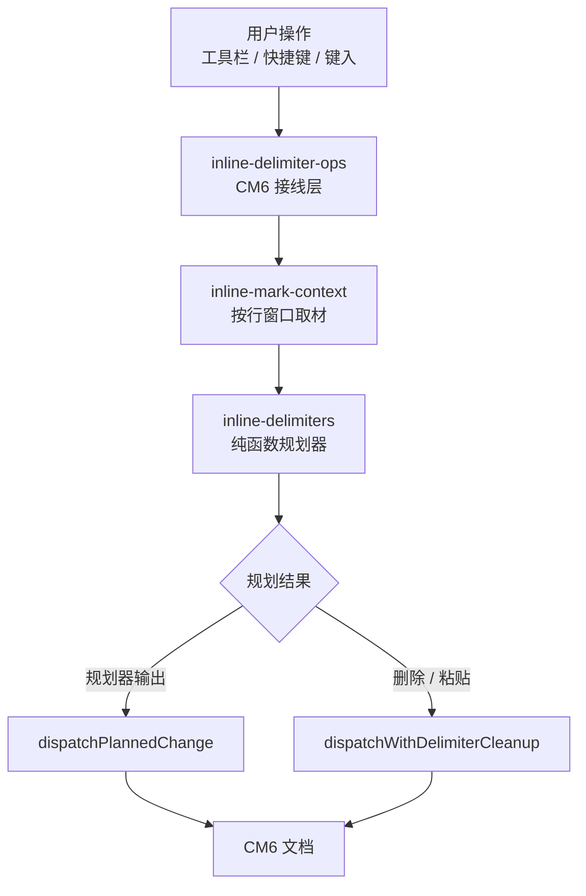

# 预览编辑架构评审记录

> 评审对象：MDA 预览编辑（CM6）行内定界符方案
> 参与人：架构组、编辑器组、测试组

## 1. 背景

[comment]: <> (@anno {"id":"31cfb40b-51d0-4004-842f-c3f0dc7a8b7e","content":"「直接在渲染结果上编辑」是与同类工具的主要差异，建议在 README 首屏就点明。","tags":["定位"],"level":"info","status":"open","created_at":"2026-09-21T02:22:28.577Z"})
传统 Markdown 编辑器把「源码」和「渲染结果」分成两栏，用户改的是源码、看的是预览。
MDA 的预览编辑让用户**直接在渲染结果上编辑**：`**` `*` `~~` 等定界符在预览中隐藏，
光标和选区落在*可见文字*上，而磁盘里保存的仍是原始 Markdown 源文件。

这带来一个核心难题：用户按下 `Ctrl+B` 时，我们无法靠「`*` 是否成对」判断当前是否已加粗。

## 2. 问题拆解

[comment]: <> (@anno {"id":"ae842f68-c550-49cd-a9d5-df20926dc6d8","content":"这条判据是整个方案的立足点，务必在 AGENTS 隐性规范里写死，避免后人改回成对检查。","tags":["架构","约束"],"level":"critical","status":"open","created_at":"2026-09-21T02:22:28.576Z"})
挖掉全部隐藏区后的**可见文本**才是合法性判据。下面这段源码每一对 `**` 都配对，
却会在预览里渲染出裸露的四个星号：

```markdown
**加粗一****加粗二**
```

[comment]: <> (@anno {"id":"5bd14e1b-ba9b-431e-acbb-f48c904942fd","content":"这里最好加一个脚注链接到 CommonMark 规范原文，评审时有人问过具体条款。","tags":["文档"],"level":"major","status":"open","created_at":"2026-09-21T02:22:28.578Z","anchor":{"start":1108,"end":1119,"quote":"flanking 规则"}})
原因是 CommonMark 的 flanking 规则允许相邻的两个强调段共享边界。
若只做「成对检查」，取消其中一段样式后会留下无法独立成立的残段。

### 2.1 四类编辑意图

| 意图 | 触发方式 | 期望结果 |
| --- | --- | --- |
| 包裹 | 选中可见文字后 `Ctrl+B` | 吸收相交或紧邻的同类样式段，只留一对定界符 |
| 拆分取消 | 在样式段内部分选中后 `Ctrl+B` | 拆成左右两段，残段为空则整对删除 |
| 残余清理 | 非规划器路径的变更 | 内容掏空或同类紧邻时清掉裸定界符 |
| 跨定界符删除 | 选区删除 / 剪切 | 只覆盖一侧的定界符原样保留 |

## 3. 方案

### 3.1 三层结构



[comment]: <> (@anno {"id":"d8b18357-7402-4229-8ce7-95be327012ec","content":"行窗口的边界条件需要补一条 10 万字文稿的压测数据，否则「肉眼可见」缺少依据。","tags":["性能"],"level":"major","status":"open","created_at":"2026-09-21T02:22:28.575Z"})
取材刻意限制在**行窗口**内而非全树遍历：长文档里一次加粗若要扫描整棵语法树，
在 10 万字文稿上会产生肉眼可见的输入延迟。

### 3.2 沟通成本类比

团队规模与沟通路径的关系是 $C = \frac{n(n-1)}{2}$，定界符的相邻关系同理：

$$
\text{候选区段} = \{ r \mid r \cap [lo, hi] \neq \emptyset \ \lor \ r.\text{close.to} = lo \ \lor \ r.\text{open.from} = hi \}
$$

紧邻（端点相接）也要算作候选，否则 `**A**|**B**` 在光标处输入会插出第三对定界符。

### 3.3 关键代码

```javascript
// 端点一律向外映射：定界符长度变化说明本次变更自己重写了它，
// 拿旧坐标清理会把刚写进去的定界符当残余删掉。
function mapRegions(regions, changes) {
  return regions.map((r) => ({
    open: { from: changes.mapPos(r.open.from, -1), to: changes.mapPos(r.open.to, -1) },
    content: { from: changes.mapPos(r.content.from, -1), to: changes.mapPos(r.content.to, 1) },
    close: { from: changes.mapPos(r.close.from, 1), to: changes.mapPos(r.close.to, 1) },
  }));
}
```

## 4. 遗留风险

- [x] 拆分取消后的残段需过渲染探针，确认插入文字确实无样式
- [x] 输入法组字阶段落盘的是拼音，规划必须基于摘掉待删区的「干净文档」
- [ ] 表格单元格内没有 CM6 文档可依托，需用一次性 `EditorState` 搭桥
- [ ] 超长行（单行 >50KB）的行窗口取材成本待压测

## 5. 结论

[comment]: <> (@anno {"id":"41245377-892a-48a9-ad68-e23830c652d5","content":"结论段建议补上复用规划器后新增的回归用例编号，便于验收对照。","tags":["验收"],"level":"minor","status":"open","created_at":"2026-09-21T02:22:28.572Z"})
方案通过评审。行内定界符编辑与表格单元格编辑复用同一套规划器，
避免「格内是独立王国」导致的行为漂移。

---

*本文档同时作为 MDA 预览编辑、批注、导出能力的演示样张。*
